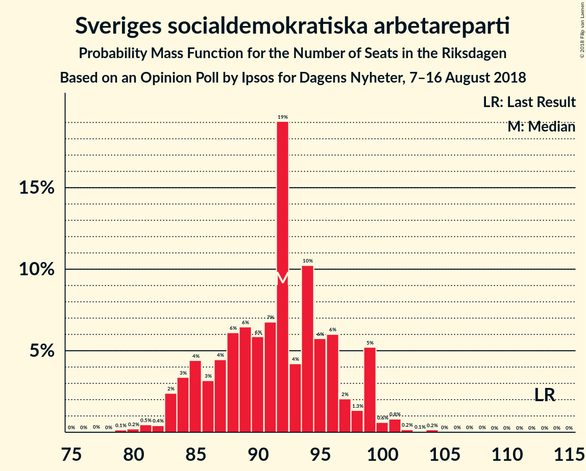
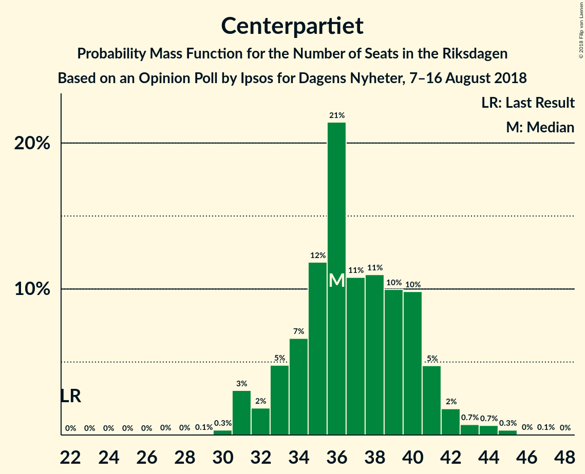

# Opinion Poll by Ipsos for Dagens Nyheter, 7–16 August 2018

<a href="#voting-intentions">Voting Intentions</a> | <a href="#seats">Seats</a> | <a href="#coalitions">Coalitions</a> | <a href="#technical-information">Technical Information</a>

## Voting Intentions

### Confidence Intervals

| Party | Last Result | Poll Result | 80% Confidence Interval | 90% Confidence Interval | 95% Confidence Interval | 99% Confidence Interval |
|:-----:|:-----------:|:-----------:|:-----------------------:|:-----------------------:|:-----------------------:|:-----------------------:|
| Sveriges socialdemokratiska arbetareparti | 31.0% | 24.9% | 23.7–26.2% |23.3–26.6% |23.0–26.9% |22.4–27.6% |
| Sverigedemokraterna | 12.9% | 19.0% | 17.9–20.2% |17.6–20.6% |17.3–20.9% |16.8–21.4% |
| Moderata samlingspartiet | 23.3% | 17.7% | 16.6–18.9% |16.3–19.2% |16.0–19.5% |15.5–20.1% |
| Centerpartiet | 6.1% | 10.1% | 9.3–11.0% |9.0–11.3% |8.8–11.5% |8.4–12.0% |
| Vänsterpartiet | 5.7% | 9.5% | 8.7–10.4% |8.5–10.7% |8.3–10.9% |7.9–11.4% |
| Miljöpartiet de gröna | 6.9% | 6.1% | 5.4–6.9% |5.3–7.1% |5.1–7.3% |4.8–7.7% |
| Liberalerna | 5.4% | 5.9% | 5.2–6.7% |5.1–6.9% |4.9–7.1% |4.6–7.4% |
| Kristdemokraterna | 4.6% | 4.0% | 3.5–4.6% |3.3–4.8% |3.2–5.0% |3.0–5.3% |
| Feministiskt initiativ | 3.1% | 1.0% | 0.8–1.4% |0.7–1.5% |0.6–1.6% |0.5–1.8% |

*Note:* The poll result column reflects the actual value used in the calculations. Published results may vary slightly, and in addition be rounded to fewer digits.

## Seats

### Confidence Intervals

| Party | Last Result | Median | 80% Confidence Interval | 90% Confidence Interval | 95% Confidence Interval | 99% Confidence Interval |
|:-----:|:-----------:|:------:|:-----------------------:|:-----------------------:|:-----------------------:|:-----------------------:|
| <a href="#sveriges-socialdemokratiska-arbetareparti">Sveriges socialdemokratiska arbetareparti</a> | 113 | 91 | 85–95 |84–96 |83–100 |81–100 |
| <a href="#sverigedemokraterna">Sverigedemokraterna</a> | 49 | 70 | 67–74 |65–75 |63–76 |61–78 |
| <a href="#moderata-samlingspartiet">Moderata samlingspartiet</a> | 84 | 65 | 60–70 |59–71 |57–71 |57–73 |
| <a href="#centerpartiet">Centerpartiet</a> | 22 | 37 | 33–40 |31–40 |31–42 |31–44 |
| <a href="#vänsterpartiet">Vänsterpartiet</a> | 21 | 34 | 32–39 |32–40 |31–40 |29–41 |
| <a href="#miljöpartiet-de-gröna">Miljöpartiet de gröna</a> | 25 | 22 | 20–26 |19–26 |19–27 |18–28 |
| <a href="#liberalerna">Liberalerna</a> | 19 | 22 | 20–24 |19–25 |19–25 |17–27 |
| <a href="#kristdemokraterna">Kristdemokraterna</a> | 16 | 0 | 0–16 |0–17 |0–18 |0–19 |
| <a href="#feministiskt-initiativ">Feministiskt initiativ</a> | 0 | 0 | 0 |0 |0 |0 |

### Sveriges socialdemokratiska arbetareparti

*For a full overview of the results for this party, see the [Sveriges socialdemokratiska arbetareparti](party-sverigessocialdemokratiskaarbetareparti.html) page.*

| Number of Seats | Probability | Accumulated | Special Marks |
|:---------------:|:-----------:|:-----------:|:-------------:|
| 78 | 0% | 100% |  |
| 79 | 0.1% | 99.9% |  |
| 80 | 0.2% | 99.8% |  |
| 81 | 2% | 99.6% |  |
| 82 | 0.3% | 98% |  |
| 83 | 0.2% | 98% |  |
| 84 | 4% | 97% |  |
| 85 | 14% | 93% |  |
| 86 | 2% | 79% |  |
| 87 | 8% | 77% |  |
| 88 | 13% | 69% |  |
| 89 | 0.8% | 56% |  |
| 90 | 3% | 55% |  |
| 91 | 14% | 52% | Median |
| 92 | 11% | 38% |  |
| 93 | 4% | 27% |  |
| 94 | 6% | 23% |  |
| 95 | 9% | 17% |  |
| 96 | 4% | 8% |  |
| 97 | 0.6% | 5% |  |
| 98 | 0.5% | 4% |  |
| 99 | 0.3% | 4% |  |
| 100 | 3% | 3% |  |
| 101 | 0.2% | 0.4% |  |
| 102 | 0.1% | 0.2% |  |
| 103 | 0% | 0.1% |  |
| 104 | 0.1% | 0.1% |  |
| 105 | 0% | 0% |  |
| 106 | 0% | 0% |  |
| 107 | 0% | 0% |  |
| 108 | 0% | 0% |  |
| 109 | 0% | 0% |  |
| 110 | 0% | 0% |  |
| 111 | 0% | 0% |  |
| 112 | 0% | 0% |  |
| 113 | 0% | 0% | Last Result |

### Sverigedemokraterna

*For a full overview of the results for this party, see the [Sverigedemokraterna](party-sverigedemokraterna.html) page.*

| Number of Seats | Probability | Accumulated | Special Marks |
|:---------------:|:-----------:|:-----------:|:-------------:|
| 49 | 0% | 100% | Last Result |
| 50 | 0% | 100% |  |
| 51 | 0% | 100% |  |
| 52 | 0% | 100% |  |
| 53 | 0% | 100% |  |
| 54 | 0% | 100% |  |
| 55 | 0% | 100% |  |
| 56 | 0% | 100% |  |
| 57 | 0% | 100% |  |
| 58 | 0% | 100% |  |
| 59 | 0.1% | 99.9% |  |
| 60 | 0.1% | 99.9% |  |
| 61 | 0.5% | 99.8% |  |
| 62 | 0.8% | 99.3% |  |
| 63 | 1.4% | 98.5% |  |
| 64 | 1.1% | 97% |  |
| 65 | 4% | 96% |  |
| 66 | 2% | 92% |  |
| 67 | 8% | 90% |  |
| 68 | 8% | 82% |  |
| 69 | 3% | 74% |  |
| 70 | 31% | 71% | Median |
| 71 | 8% | 40% |  |
| 72 | 13% | 33% |  |
| 73 | 10% | 20% |  |
| 74 | 2% | 10% |  |
| 75 | 4% | 8% |  |
| 76 | 3% | 4% |  |
| 77 | 0.5% | 1.3% |  |
| 78 | 0.3% | 0.8% |  |
| 79 | 0.1% | 0.4% |  |
| 80 | 0.2% | 0.4% |  |
| 81 | 0.1% | 0.2% |  |
| 82 | 0.1% | 0.1% |  |
| 83 | 0% | 0% |  |

### Moderata samlingspartiet

*For a full overview of the results for this party, see the [Moderata samlingspartiet](party-moderatasamlingspartiet.html) page.*

| Number of Seats | Probability | Accumulated | Special Marks |
|:---------------:|:-----------:|:-----------:|:-------------:|
| 54 | 0% | 100% |  |
| 55 | 0.1% | 99.9% |  |
| 56 | 0.2% | 99.9% |  |
| 57 | 3% | 99.7% |  |
| 58 | 0.6% | 97% |  |
| 59 | 2% | 96% |  |
| 60 | 7% | 94% |  |
| 61 | 0.9% | 87% |  |
| 62 | 3% | 86% |  |
| 63 | 18% | 83% |  |
| 64 | 9% | 65% |  |
| 65 | 7% | 56% | Median |
| 66 | 1.3% | 50% |  |
| 67 | 5% | 48% |  |
| 68 | 18% | 44% |  |
| 69 | 0.5% | 26% |  |
| 70 | 18% | 25% |  |
| 71 | 7% | 8% |  |
| 72 | 0.3% | 0.9% |  |
| 73 | 0.1% | 0.6% |  |
| 74 | 0.3% | 0.5% |  |
| 75 | 0.1% | 0.2% |  |
| 76 | 0% | 0% |  |
| 77 | 0% | 0% |  |
| 78 | 0% | 0% |  |
| 79 | 0% | 0% |  |
| 80 | 0% | 0% |  |
| 81 | 0% | 0% |  |
| 82 | 0% | 0% |  |
| 83 | 0% | 0% |  |
| 84 | 0% | 0% | Last Result |

### Centerpartiet

*For a full overview of the results for this party, see the [Centerpartiet](party-centerpartiet.html) page.*

| Number of Seats | Probability | Accumulated | Special Marks |
|:---------------:|:-----------:|:-----------:|:-------------:|
| 22 | 0% | 100% | Last Result |
| 23 | 0% | 100% |  |
| 24 | 0% | 100% |  |
| 25 | 0% | 100% |  |
| 26 | 0% | 100% |  |
| 27 | 0% | 100% |  |
| 28 | 0% | 100% |  |
| 29 | 0% | 99.9% |  |
| 30 | 0.1% | 99.9% |  |
| 31 | 6% | 99.8% |  |
| 32 | 2% | 93% |  |
| 33 | 2% | 91% |  |
| 34 | 7% | 90% |  |
| 35 | 5% | 82% |  |
| 36 | 12% | 77% |  |
| 37 | 18% | 65% | Median |
| 38 | 8% | 47% |  |
| 39 | 19% | 39% |  |
| 40 | 16% | 20% |  |
| 41 | 0.8% | 4% |  |
| 42 | 1.1% | 3% |  |
| 43 | 0.7% | 2% |  |
| 44 | 1.5% | 2% |  |
| 45 | 0% | 0.2% |  |
| 46 | 0.1% | 0.2% |  |
| 47 | 0.1% | 0.1% |  |
| 48 | 0% | 0% |  |

### Vänsterpartiet

*For a full overview of the results for this party, see the [Vänsterpartiet](party-vänsterpartiet.html) page.*

| Number of Seats | Probability | Accumulated | Special Marks |
|:---------------:|:-----------:|:-----------:|:-------------:|
| 21 | 0% | 100% | Last Result |
| 22 | 0% | 100% |  |
| 23 | 0% | 100% |  |
| 24 | 0% | 100% |  |
| 25 | 0% | 100% |  |
| 26 | 0% | 100% |  |
| 27 | 0% | 100% |  |
| 28 | 0.2% | 99.9% |  |
| 29 | 0.4% | 99.7% |  |
| 30 | 2% | 99.3% |  |
| 31 | 1.5% | 98% |  |
| 32 | 24% | 96% |  |
| 33 | 21% | 72% |  |
| 34 | 7% | 51% | Median |
| 35 | 7% | 44% |  |
| 36 | 16% | 37% |  |
| 37 | 2% | 21% |  |
| 38 | 6% | 19% |  |
| 39 | 3% | 12% |  |
| 40 | 9% | 9% |  |
| 41 | 0.2% | 0.5% |  |
| 42 | 0.1% | 0.3% |  |
| 43 | 0.1% | 0.2% |  |
| 44 | 0.1% | 0.1% |  |
| 45 | 0% | 0% |  |

### Miljöpartiet de gröna

*For a full overview of the results for this party, see the [Miljöpartiet de gröna](party-miljöpartietdegröna.html) page.*

| Number of Seats | Probability | Accumulated | Special Marks |
|:---------------:|:-----------:|:-----------:|:-------------:|
| 16 | 0.1% | 100% |  |
| 17 | 0.1% | 99.9% |  |
| 18 | 0.5% | 99.8% |  |
| 19 | 5% | 99.3% |  |
| 20 | 11% | 94% |  |
| 21 | 21% | 83% |  |
| 22 | 27% | 62% | Median |
| 23 | 4% | 35% |  |
| 24 | 8% | 32% |  |
| 25 | 12% | 24% | Last Result |
| 26 | 9% | 11% |  |
| 27 | 1.1% | 3% |  |
| 28 | 1.4% | 2% |  |
| 29 | 0% | 0.1% |  |
| 30 | 0% | 0.1% |  |
| 31 | 0% | 0% |  |

### Liberalerna

*For a full overview of the results for this party, see the [Liberalerna](party-liberalerna.html) page.*

| Number of Seats | Probability | Accumulated | Special Marks |
|:---------------:|:-----------:|:-----------:|:-------------:|
| 16 | 0% | 100% |  |
| 17 | 1.1% | 99.9% |  |
| 18 | 1.1% | 98.9% |  |
| 19 | 4% | 98% | Last Result |
| 20 | 21% | 94% |  |
| 21 | 3% | 72% |  |
| 22 | 37% | 69% | Median |
| 23 | 10% | 32% |  |
| 24 | 16% | 22% |  |
| 25 | 4% | 6% |  |
| 26 | 0.9% | 2% |  |
| 27 | 0.8% | 1.1% |  |
| 28 | 0.2% | 0.3% |  |
| 29 | 0.1% | 0.1% |  |
| 30 | 0% | 0% |  |

### Kristdemokraterna

*For a full overview of the results for this party, see the [Kristdemokraterna](party-kristdemokraterna.html) page.*

| Number of Seats | Probability | Accumulated | Special Marks |
|:---------------:|:-----------:|:-----------:|:-------------:|
| 0 | 56% | 100% | Median |
| 1 | 0% | 44% |  |
| 2 | 0% | 44% |  |
| 3 | 0% | 44% |  |
| 4 | 0% | 44% |  |
| 5 | 0% | 44% |  |
| 6 | 0% | 44% |  |
| 7 | 0% | 44% |  |
| 8 | 0% | 44% |  |
| 9 | 0% | 44% |  |
| 10 | 0% | 44% |  |
| 11 | 0% | 44% |  |
| 12 | 0% | 44% |  |
| 13 | 0% | 44% |  |
| 14 | 4% | 44% |  |
| 15 | 20% | 40% |  |
| 16 | 11% | 20% | Last Result |
| 17 | 3% | 8% |  |
| 18 | 4% | 5% |  |
| 19 | 0.5% | 0.8% |  |
| 20 | 0.3% | 0.3% |  |
| 21 | 0% | 0% |  |

### Feministiskt initiativ

*For a full overview of the results for this party, see the [Feministiskt initiativ](party-feministisktinitiativ.html) page.*

| Number of Seats | Probability | Accumulated | Special Marks |
|:---------------:|:-----------:|:-----------:|:-------------:|
| 0 | 100% | 100% | Last Result, Median |

## Coalitions

### Confidence Intervals

| Coalition | Last Result | Median | Majority? | 80% Confidence Interval | 90% Confidence Interval | 95% Confidence Interval | 99% Confidence Interval |
|:---------:|:-----------:|:------:|:---------:|:-----------------------:|:-----------------------:|:-----------------------:|:-----------------------:|
| Sveriges socialdemokratiska arbetareparti – Moderata samlingspartiet | 197 | 156 | 0% | 148–164 | 148–166 | 147–166 | 143–166 |
| Sveriges socialdemokratiska arbetareparti – Vänsterpartiet – Miljöpartiet de gröna – Feministiskt initiativ | 159 | 147 | 0% | 139–154 | 139–155 | 139–158 | 136–162 |
| Sveriges socialdemokratiska arbetareparti – Vänsterpartiet – Miljöpartiet de gröna | 159 | 147 | 0% | 139–154 | 139–155 | 139–158 | 136–162 |
| Sverigedemokraterna – Moderata samlingspartiet | 133 | 135 | 0% | 130–143 | 127–143 | 127–143 | 123–144 |
| Moderata samlingspartiet – Centerpartiet – Liberalerna – Kristdemokraterna | 141 | 131 | 0% | 124–140 | 119–141 | 119–143 | 119–146 |
| Sveriges socialdemokratiska arbetareparti – Vänsterpartiet | 134 | 126 | 0% | 117–129 | 117–131 | 117–134 | 114–138 |
| Moderata samlingspartiet – Centerpartiet – Liberalerna | 125 | 125 | 0% | 119–131 | 114–131 | 112–131 | 112–136 |
| Sveriges socialdemokratiska arbetareparti – Miljöpartiet de gröna | 138 | 112 | 0% | 107–120 | 107–121 | 105–124 | 104–124 |
| Moderata samlingspartiet – Centerpartiet – Kristdemokraterna | 122 | 107 | 0% | 101–118 | 99–120 | 98–121 | 96–122 |
| Moderata samlingspartiet – Centerpartiet | 106 | 103 | 0% | 97–107 | 93–108 | 92–109 | 90–111 |

### Sveriges socialdemokratiska arbetareparti – Moderata samlingspartiet

| Number of Seats | Probability | Accumulated | Special Marks |
|:---------------:|:-----------:|:-----------:|:-------------:|
| 137 | 0% | 100% |  |
| 138 | 0% | 99.9% |  |
| 139 | 0% | 99.9% |  |
| 140 | 0.1% | 99.9% |  |
| 141 | 0.2% | 99.9% |  |
| 142 | 0% | 99.7% |  |
| 143 | 2% | 99.6% |  |
| 144 | 0% | 98% |  |
| 145 | 0.1% | 98% |  |
| 146 | 0.2% | 98% |  |
| 147 | 1.0% | 98% |  |
| 148 | 15% | 97% |  |
| 149 | 4% | 82% |  |
| 150 | 6% | 78% |  |
| 151 | 8% | 73% |  |
| 152 | 0.5% | 65% |  |
| 153 | 2% | 64% |  |
| 154 | 6% | 62% |  |
| 155 | 0.8% | 56% |  |
| 156 | 6% | 56% | Median |
| 157 | 0.8% | 50% |  |
| 158 | 11% | 49% |  |
| 159 | 12% | 38% |  |
| 160 | 3% | 26% |  |
| 161 | 1.1% | 23% |  |
| 162 | 10% | 22% |  |
| 163 | 1.2% | 12% |  |
| 164 | 2% | 10% |  |
| 165 | 2% | 8% |  |
| 166 | 6% | 6% |  |
| 167 | 0% | 0.3% |  |
| 168 | 0% | 0.3% |  |
| 169 | 0.1% | 0.2% |  |
| 170 | 0% | 0.1% |  |
| 171 | 0% | 0.1% |  |
| 172 | 0% | 0.1% |  |
| 173 | 0% | 0.1% |  |
| 174 | 0.1% | 0.1% |  |
| 175 | 0% | 0% | Majority |
| 176 | 0% | 0% |  |
| 177 | 0% | 0% |  |
| 178 | 0% | 0% |  |
| 179 | 0% | 0% |  |
| 180 | 0% | 0% |  |
| 181 | 0% | 0% |  |
| 182 | 0% | 0% |  |
| 183 | 0% | 0% |  |
| 184 | 0% | 0% |  |
| 185 | 0% | 0% |  |
| 186 | 0% | 0% |  |
| 187 | 0% | 0% |  |
| 188 | 0% | 0% |  |
| 189 | 0% | 0% |  |
| 190 | 0% | 0% |  |
| 191 | 0% | 0% |  |
| 192 | 0% | 0% |  |
| 193 | 0% | 0% |  |
| 194 | 0% | 0% |  |
| 195 | 0% | 0% |  |
| 196 | 0% | 0% |  |
| 197 | 0% | 0% | Last Result |

### Sveriges socialdemokratiska arbetareparti – Vänsterpartiet – Miljöpartiet de gröna – Feministiskt initiativ

| Number of Seats | Probability | Accumulated | Special Marks |
|:---------------:|:-----------:|:-----------:|:-------------:|
| 134 | 0.1% | 100% |  |
| 135 | 0% | 99.9% |  |
| 136 | 0.6% | 99.9% |  |
| 137 | 0.2% | 99.3% |  |
| 138 | 0.1% | 99.1% |  |
| 139 | 14% | 99.0% |  |
| 140 | 0.3% | 85% |  |
| 141 | 9% | 85% |  |
| 142 | 2% | 75% |  |
| 143 | 2% | 73% |  |
| 144 | 2% | 71% |  |
| 145 | 11% | 69% |  |
| 146 | 1.0% | 58% |  |
| 147 | 7% | 57% | Median |
| 148 | 1.1% | 49% |  |
| 149 | 18% | 48% |  |
| 150 | 0.7% | 30% |  |
| 151 | 2% | 30% |  |
| 152 | 14% | 27% |  |
| 153 | 3% | 13% |  |
| 154 | 1.4% | 10% |  |
| 155 | 4% | 9% |  |
| 156 | 0.5% | 5% |  |
| 157 | 0.6% | 4% |  |
| 158 | 1.5% | 4% |  |
| 159 | 0.1% | 2% | Last Result |
| 160 | 0.2% | 2% |  |
| 161 | 1.4% | 2% |  |
| 162 | 0.3% | 0.5% |  |
| 163 | 0.1% | 0.2% |  |
| 164 | 0% | 0.1% |  |
| 165 | 0.1% | 0.1% |  |
| 166 | 0% | 0% |  |

### Sveriges socialdemokratiska arbetareparti – Vänsterpartiet – Miljöpartiet de gröna

| Number of Seats | Probability | Accumulated | Special Marks |
|:---------------:|:-----------:|:-----------:|:-------------:|
| 134 | 0.1% | 100% |  |
| 135 | 0% | 99.9% |  |
| 136 | 0.6% | 99.9% |  |
| 137 | 0.2% | 99.3% |  |
| 138 | 0.1% | 99.1% |  |
| 139 | 14% | 99.0% |  |
| 140 | 0.3% | 85% |  |
| 141 | 9% | 85% |  |
| 142 | 2% | 75% |  |
| 143 | 2% | 73% |  |
| 144 | 2% | 71% |  |
| 145 | 11% | 69% |  |
| 146 | 1.0% | 58% |  |
| 147 | 7% | 57% | Median |
| 148 | 1.1% | 49% |  |
| 149 | 18% | 48% |  |
| 150 | 0.7% | 30% |  |
| 151 | 2% | 30% |  |
| 152 | 14% | 27% |  |
| 153 | 3% | 13% |  |
| 154 | 1.4% | 10% |  |
| 155 | 4% | 9% |  |
| 156 | 0.5% | 5% |  |
| 157 | 0.6% | 4% |  |
| 158 | 1.5% | 4% |  |
| 159 | 0.1% | 2% | Last Result |
| 160 | 0.2% | 2% |  |
| 161 | 1.4% | 2% |  |
| 162 | 0.3% | 0.5% |  |
| 163 | 0.1% | 0.2% |  |
| 164 | 0% | 0.1% |  |
| 165 | 0.1% | 0.1% |  |
| 166 | 0% | 0% |  |

### Sverigedemokraterna – Moderata samlingspartiet

| Number of Seats | Probability | Accumulated | Special Marks |
|:---------------:|:-----------:|:-----------:|:-------------:|
| 119 | 0% | 100% |  |
| 120 | 0.2% | 99.9% |  |
| 121 | 0.1% | 99.8% |  |
| 122 | 0% | 99.7% |  |
| 123 | 0.3% | 99.7% |  |
| 124 | 0% | 99.3% |  |
| 125 | 0.5% | 99.3% |  |
| 126 | 0.6% | 98.8% |  |
| 127 | 5% | 98% |  |
| 128 | 1.2% | 93% |  |
| 129 | 1.1% | 92% |  |
| 130 | 6% | 91% |  |
| 131 | 3% | 85% |  |
| 132 | 11% | 82% |  |
| 133 | 14% | 71% | Last Result |
| 134 | 1.3% | 57% |  |
| 135 | 8% | 55% | Median |
| 136 | 0.5% | 47% |  |
| 137 | 3% | 47% |  |
| 138 | 13% | 44% |  |
| 139 | 1.3% | 31% |  |
| 140 | 3% | 30% |  |
| 141 | 2% | 27% |  |
| 142 | 14% | 25% |  |
| 143 | 11% | 11% |  |
| 144 | 0.3% | 0.6% |  |
| 145 | 0.1% | 0.3% |  |
| 146 | 0.1% | 0.2% |  |
| 147 | 0% | 0.1% |  |
| 148 | 0% | 0.1% |  |
| 149 | 0% | 0.1% |  |
| 150 | 0% | 0.1% |  |
| 151 | 0.1% | 0.1% |  |
| 152 | 0% | 0% |  |

### Moderata samlingspartiet – Centerpartiet – Liberalerna – Kristdemokraterna

| Number of Seats | Probability | Accumulated | Special Marks |
|:---------------:|:-----------:|:-----------:|:-------------:|
| 114 | 0% | 100% |  |
| 115 | 0% | 99.9% |  |
| 116 | 0.2% | 99.9% |  |
| 117 | 0.1% | 99.7% |  |
| 118 | 0.2% | 99.7% |  |
| 119 | 5% | 99.5% |  |
| 120 | 1.1% | 94% |  |
| 121 | 2% | 93% |  |
| 122 | 0.3% | 92% |  |
| 123 | 0.2% | 91% |  |
| 124 | 2% | 91% | Median |
| 125 | 2% | 89% |  |
| 126 | 2% | 88% |  |
| 127 | 15% | 86% |  |
| 128 | 9% | 71% |  |
| 129 | 7% | 62% |  |
| 130 | 2% | 55% |  |
| 131 | 11% | 53% |  |
| 132 | 3% | 41% |  |
| 133 | 0.8% | 38% |  |
| 134 | 1.5% | 38% |  |
| 135 | 5% | 36% |  |
| 136 | 3% | 32% |  |
| 137 | 1.2% | 28% |  |
| 138 | 0.3% | 27% |  |
| 139 | 0.7% | 27% |  |
| 140 | 20% | 26% |  |
| 141 | 1.2% | 6% | Last Result |
| 142 | 0.7% | 5% |  |
| 143 | 3% | 4% |  |
| 144 | 0.1% | 0.9% |  |
| 145 | 0% | 0.8% |  |
| 146 | 0.5% | 0.7% |  |
| 147 | 0.2% | 0.2% |  |
| 148 | 0% | 0.1% |  |
| 149 | 0% | 0.1% |  |
| 150 | 0% | 0% |  |

### Sveriges socialdemokratiska arbetareparti – Vänsterpartiet

| Number of Seats | Probability | Accumulated | Special Marks |
|:---------------:|:-----------:|:-----------:|:-------------:|
| 113 | 0.2% | 100% |  |
| 114 | 0.5% | 99.8% |  |
| 115 | 0.1% | 99.3% |  |
| 116 | 0.3% | 99.2% |  |
| 117 | 17% | 98.9% |  |
| 118 | 0.4% | 82% |  |
| 119 | 6% | 82% |  |
| 120 | 4% | 75% |  |
| 121 | 0.5% | 72% |  |
| 122 | 1.4% | 71% |  |
| 123 | 2% | 70% |  |
| 124 | 2% | 67% |  |
| 125 | 12% | 66% | Median |
| 126 | 9% | 53% |  |
| 127 | 14% | 44% |  |
| 128 | 16% | 30% |  |
| 129 | 4% | 14% |  |
| 130 | 2% | 10% |  |
| 131 | 3% | 8% |  |
| 132 | 0.6% | 5% |  |
| 133 | 0.5% | 4% |  |
| 134 | 2% | 4% | Last Result |
| 135 | 0.1% | 2% |  |
| 136 | 0.1% | 2% |  |
| 137 | 2% | 2% |  |
| 138 | 0.1% | 0.5% |  |
| 139 | 0.1% | 0.4% |  |
| 140 | 0.3% | 0.3% |  |
| 141 | 0% | 0% |  |

### Moderata samlingspartiet – Centerpartiet – Liberalerna

| Number of Seats | Probability | Accumulated | Special Marks |
|:---------------:|:-----------:|:-----------:|:-------------:|
| 110 | 0.1% | 100% |  |
| 111 | 0% | 99.9% |  |
| 112 | 4% | 99.9% |  |
| 113 | 0.1% | 96% |  |
| 114 | 0.9% | 96% |  |
| 115 | 0.3% | 95% |  |
| 116 | 1.4% | 95% |  |
| 117 | 1.1% | 93% |  |
| 118 | 2% | 92% |  |
| 119 | 6% | 90% |  |
| 120 | 3% | 84% |  |
| 121 | 6% | 81% |  |
| 122 | 1.4% | 75% |  |
| 123 | 0.7% | 73% |  |
| 124 | 8% | 72% | Median |
| 125 | 19% | 64% | Last Result |
| 126 | 2% | 45% |  |
| 127 | 13% | 43% |  |
| 128 | 9% | 30% |  |
| 129 | 6% | 21% |  |
| 130 | 2% | 16% |  |
| 131 | 11% | 14% |  |
| 132 | 1.1% | 2% |  |
| 133 | 0.2% | 0.9% |  |
| 134 | 0.1% | 0.7% |  |
| 135 | 0% | 0.6% |  |
| 136 | 0.2% | 0.5% |  |
| 137 | 0% | 0.3% |  |
| 138 | 0% | 0.3% |  |
| 139 | 0.2% | 0.3% |  |
| 140 | 0% | 0% |  |

### Sveriges socialdemokratiska arbetareparti – Miljöpartiet de gröna

| Number of Seats | Probability | Accumulated | Special Marks |
|:---------------:|:-----------:|:-----------:|:-------------:|
| 100 | 0.1% | 100% |  |
| 101 | 0.2% | 99.9% |  |
| 102 | 0% | 99.7% |  |
| 103 | 0.2% | 99.7% |  |
| 104 | 2% | 99.5% |  |
| 105 | 0.3% | 98% |  |
| 106 | 1.0% | 97% |  |
| 107 | 15% | 96% |  |
| 108 | 5% | 81% |  |
| 109 | 19% | 76% |  |
| 110 | 1.2% | 57% |  |
| 111 | 0.4% | 56% |  |
| 112 | 13% | 56% |  |
| 113 | 3% | 43% | Median |
| 114 | 1.0% | 40% |  |
| 115 | 5% | 39% |  |
| 116 | 17% | 34% |  |
| 117 | 2% | 17% |  |
| 118 | 0.9% | 15% |  |
| 119 | 3% | 14% |  |
| 120 | 6% | 11% |  |
| 121 | 1.4% | 5% |  |
| 122 | 0.4% | 4% |  |
| 123 | 0.2% | 3% |  |
| 124 | 3% | 3% |  |
| 125 | 0.1% | 0.4% |  |
| 126 | 0.1% | 0.3% |  |
| 127 | 0.2% | 0.3% |  |
| 128 | 0% | 0% |  |
| 129 | 0% | 0% |  |
| 130 | 0% | 0% |  |
| 131 | 0% | 0% |  |
| 132 | 0% | 0% |  |
| 133 | 0% | 0% |  |
| 134 | 0% | 0% |  |
| 135 | 0% | 0% |  |
| 136 | 0% | 0% |  |
| 137 | 0% | 0% |  |
| 138 | 0% | 0% | Last Result |

### Moderata samlingspartiet – Centerpartiet – Kristdemokraterna

| Number of Seats | Probability | Accumulated | Special Marks |
|:---------------:|:-----------:|:-----------:|:-------------:|
| 93 | 0.2% | 100% |  |
| 94 | 0.1% | 99.8% |  |
| 95 | 0.1% | 99.6% |  |
| 96 | 0.3% | 99.6% |  |
| 97 | 2% | 99.3% |  |
| 98 | 2% | 98% |  |
| 99 | 4% | 96% |  |
| 100 | 2% | 92% |  |
| 101 | 0.2% | 90% |  |
| 102 | 3% | 90% | Median |
| 103 | 0.3% | 87% |  |
| 104 | 0.3% | 87% |  |
| 105 | 6% | 87% |  |
| 106 | 9% | 80% |  |
| 107 | 26% | 71% |  |
| 108 | 2% | 45% |  |
| 109 | 3% | 43% |  |
| 110 | 2% | 40% |  |
| 111 | 0.5% | 38% |  |
| 112 | 0.3% | 38% |  |
| 113 | 5% | 38% |  |
| 114 | 0.7% | 32% |  |
| 115 | 1.4% | 32% |  |
| 116 | 3% | 30% |  |
| 117 | 7% | 28% |  |
| 118 | 15% | 21% |  |
| 119 | 0.4% | 6% |  |
| 120 | 0.9% | 5% |  |
| 121 | 3% | 4% |  |
| 122 | 0.8% | 1.1% | Last Result |
| 123 | 0.1% | 0.4% |  |
| 124 | 0% | 0.2% |  |
| 125 | 0.1% | 0.2% |  |
| 126 | 0% | 0.2% |  |
| 127 | 0.1% | 0.1% |  |
| 128 | 0% | 0% |  |

### Moderata samlingspartiet – Centerpartiet

| Number of Seats | Probability | Accumulated | Special Marks |
|:---------------:|:-----------:|:-----------:|:-------------:|
| 90 | 2% | 100% |  |
| 91 | 0.1% | 98% |  |
| 92 | 3% | 98% |  |
| 93 | 1.2% | 96% |  |
| 94 | 1.4% | 94% |  |
| 95 | 0.8% | 93% |  |
| 96 | 0.6% | 92% |  |
| 97 | 2% | 91% |  |
| 98 | 3% | 89% |  |
| 99 | 9% | 86% |  |
| 100 | 3% | 77% |  |
| 101 | 7% | 73% |  |
| 102 | 3% | 66% | Median |
| 103 | 18% | 63% |  |
| 104 | 1.2% | 45% |  |
| 105 | 7% | 44% |  |
| 106 | 9% | 37% | Last Result |
| 107 | 22% | 28% |  |
| 108 | 2% | 6% |  |
| 109 | 2% | 4% |  |
| 110 | 0.9% | 2% |  |
| 111 | 0.1% | 0.6% |  |
| 112 | 0.1% | 0.5% |  |
| 113 | 0.1% | 0.4% |  |
| 114 | 0% | 0.3% |  |
| 115 | 0% | 0.3% |  |
| 116 | 0.2% | 0.3% |  |
| 117 | 0% | 0% |  |

## Technical Information

### Opinion Poll

+ **Polling firm:** Ipsos
+ **Commissioner(s):** Dagens Nyheter
+ **Fieldwork period:** 7–16 August 2018

### Calculations

+ **Sample size:** 1883
+ **Simulations done:** 131,072
+ **Error estimate:** 1.46%

