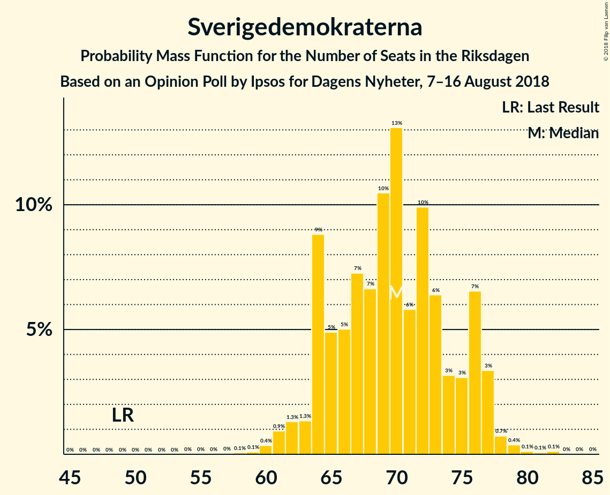
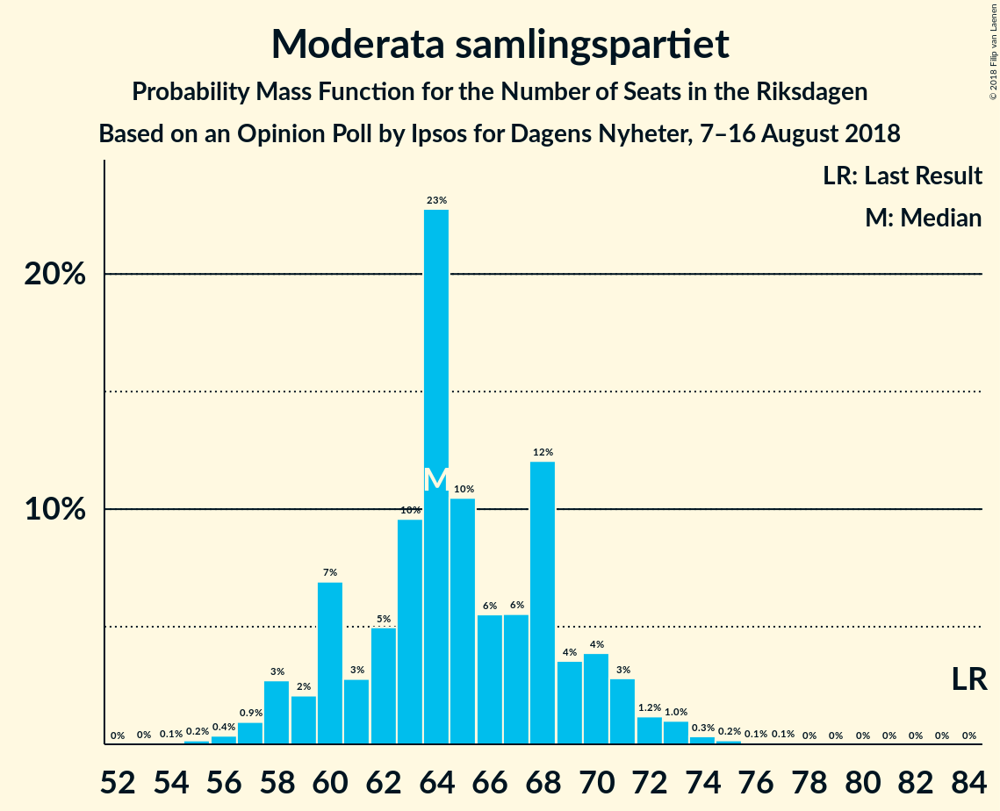
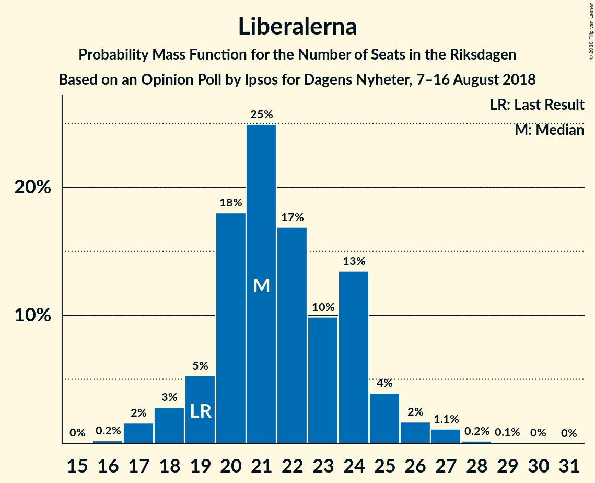

# Opinion Poll by Ipsos for Dagens Nyheter, 7–16 August 2018

<a href="#voting-intentions">Voting Intentions</a> | <a href="#seats">Seats</a> | <a href="#coalitions">Coalitions</a> | <a href="#technical-information">Technical Information</a>

## Voting Intentions

### Confidence Intervals

| Party | Last Result | Poll Result | 80% Confidence Interval | 90% Confidence Interval | 95% Confidence Interval | 99% Confidence Interval |
|:-----:|:-----------:|:-----------:|:-----------------------:|:-----------------------:|:-----------------------:|:-----------------------:|
| Sveriges socialdemokratiska arbetareparti | 31.0% | 24.9% | 23.7–26.2% |23.3–26.6% |23.0–26.9% |22.4–27.6% |
| Sverigedemokraterna | 12.9% | 19.0% | 17.9–20.2% |17.6–20.6% |17.3–20.9% |16.8–21.4% |
| Moderata samlingspartiet | 23.3% | 17.7% | 16.6–18.9% |16.3–19.2% |16.0–19.5% |15.5–20.1% |
| Centerpartiet | 6.1% | 10.1% | 9.3–11.0% |9.0–11.3% |8.8–11.5% |8.4–12.0% |
| Vänsterpartiet | 5.7% | 9.5% | 8.7–10.4% |8.5–10.7% |8.3–10.9% |7.9–11.4% |
| Miljöpartiet de gröna | 6.9% | 6.1% | 5.4–6.9% |5.3–7.1% |5.1–7.3% |4.8–7.7% |
| Liberalerna | 5.4% | 5.9% | 5.2–6.7% |5.1–6.9% |4.9–7.1% |4.6–7.4% |
| Kristdemokraterna | 4.6% | 4.0% | 3.5–4.6% |3.3–4.8% |3.2–5.0% |3.0–5.3% |
| Feministiskt initiativ | 3.1% | 1.0% | 0.8–1.4% |0.7–1.5% |0.6–1.6% |0.5–1.8% |

*Note:* The poll result column reflects the actual value used in the calculations. Published results may vary slightly, and in addition be rounded to fewer digits.

## Seats

### Confidence Intervals

| Party | Last Result | Median | 80% Confidence Interval | 90% Confidence Interval | 95% Confidence Interval | 99% Confidence Interval |
|:-----:|:-----------:|:------:|:-----------------------:|:-----------------------:|:-----------------------:|:-----------------------:|
| <a href="#sveriges-socialdemokratiska-arbetareparti">Sveriges socialdemokratiska arbetareparti</a> | 113 | 92 | 85–97 |84–99 |83–99 |81–101 |
| <a href="#sverigedemokraterna">Sverigedemokraterna</a> | 49 | 70 | 64–76 |64–76 |62–77 |60–79 |
| <a href="#moderata-samlingspartiet">Moderata samlingspartiet</a> | 84 | 64 | 60–69 |59–71 |58–72 |56–74 |
| <a href="#centerpartiet">Centerpartiet</a> | 22 | 36 | 33–40 |32–41 |31–42 |31–44 |
| <a href="#vänsterpartiet">Vänsterpartiet</a> | 21 | 35 | 32–38 |31–39 |30–40 |29–42 |
| <a href="#miljöpartiet-de-gröna">Miljöpartiet de gröna</a> | 25 | 23 | 20–25 |19–26 |19–26 |17–28 |
| <a href="#liberalerna">Liberalerna</a> | 19 | 21 | 20–24 |19–25 |18–26 |17–27 |
| <a href="#kristdemokraterna">Kristdemokraterna</a> | 16 | 0 | 0–17 |0–17 |0–18 |0–19 |
| <a href="#feministiskt-initiativ">Feministiskt initiativ</a> | 0 | 0 | 0 |0 |0 |0 |

### Sveriges socialdemokratiska arbetareparti

*For a full overview of the results for this party, see the [Sveriges socialdemokratiska arbetareparti](party-sverigessocialdemokratiskaarbetareparti.html) page.*

| Number of Seats | Probability | Accumulated | Special Marks |
|:---------------:|:-----------:|:-----------:|:-------------:|
| 78 | 0% | 100% |  |
| 79 | 0.1% | 99.9% |  |
| 80 | 0.2% | 99.8% |  |
| 81 | 0.5% | 99.6% |  |
| 82 | 0.4% | 99.1% |  |
| 83 | 2% | 98.7% |  |
| 84 | 3% | 96% |  |
| 85 | 4% | 93% |  |
| 86 | 3% | 89% |  |
| 87 | 4% | 85% |  |
| 88 | 6% | 81% |  |
| 89 | 6% | 75% |  |
| 90 | 6% | 68% |  |
| 91 | 7% | 62% |  |
| 92 | 19% | 56% | Median |
| 93 | 4% | 37% |  |
| 94 | 10% | 32% |  |
| 95 | 6% | 22% |  |
| 96 | 6% | 16% |  |
| 97 | 2% | 10% |  |
| 98 | 1.3% | 8% |  |
| 99 | 5% | 7% |  |
| 100 | 0.6% | 2% |  |
| 101 | 0.8% | 1.2% |  |
| 102 | 0.2% | 0.4% |  |
| 103 | 0.1% | 0.3% |  |
| 104 | 0.2% | 0.2% |  |
| 105 | 0% | 0.1% |  |
| 106 | 0% | 0% |  |
| 107 | 0% | 0% |  |
| 108 | 0% | 0% |  |
| 109 | 0% | 0% |  |
| 110 | 0% | 0% |  |
| 111 | 0% | 0% |  |
| 112 | 0% | 0% |  |
| 113 | 0% | 0% | Last Result |

### Sverigedemokraterna

*For a full overview of the results for this party, see the [Sverigedemokraterna](party-sverigedemokraterna.html) page.*

| Number of Seats | Probability | Accumulated | Special Marks |
|:---------------:|:-----------:|:-----------:|:-------------:|
| 49 | 0% | 100% | Last Result |
| 50 | 0% | 100% |  |
| 51 | 0% | 100% |  |
| 52 | 0% | 100% |  |
| 53 | 0% | 100% |  |
| 54 | 0% | 100% |  |
| 55 | 0% | 100% |  |
| 56 | 0% | 100% |  |
| 57 | 0% | 100% |  |
| 58 | 0.1% | 100% |  |
| 59 | 0.1% | 99.9% |  |
| 60 | 0.4% | 99.8% |  |
| 61 | 0.9% | 99.5% |  |
| 62 | 1.3% | 98.5% |  |
| 63 | 1.3% | 97% |  |
| 64 | 9% | 96% |  |
| 65 | 5% | 87% |  |
| 66 | 5% | 82% |  |
| 67 | 7% | 77% |  |
| 68 | 7% | 70% |  |
| 69 | 10% | 63% |  |
| 70 | 13% | 53% | Median |
| 71 | 6% | 40% |  |
| 72 | 10% | 34% |  |
| 73 | 6% | 24% |  |
| 74 | 3% | 18% |  |
| 75 | 3% | 14% |  |
| 76 | 7% | 11% |  |
| 77 | 3% | 5% |  |
| 78 | 0.7% | 1.4% |  |
| 79 | 0.4% | 0.7% |  |
| 80 | 0.1% | 0.3% |  |
| 81 | 0.1% | 0.2% |  |
| 82 | 0.1% | 0.1% |  |
| 83 | 0% | 0% |  |

### Moderata samlingspartiet

*For a full overview of the results for this party, see the [Moderata samlingspartiet](party-moderatasamlingspartiet.html) page.*

| Number of Seats | Probability | Accumulated | Special Marks |
|:---------------:|:-----------:|:-----------:|:-------------:|
| 54 | 0.1% | 100% |  |
| 55 | 0.2% | 99.9% |  |
| 56 | 0.4% | 99.7% |  |
| 57 | 0.9% | 99.4% |  |
| 58 | 3% | 98% |  |
| 59 | 2% | 96% |  |
| 60 | 7% | 94% |  |
| 61 | 3% | 87% |  |
| 62 | 5% | 84% |  |
| 63 | 10% | 79% |  |
| 64 | 23% | 69% | Median |
| 65 | 10% | 47% |  |
| 66 | 6% | 36% |  |
| 67 | 6% | 31% |  |
| 68 | 12% | 25% |  |
| 69 | 4% | 13% |  |
| 70 | 4% | 10% |  |
| 71 | 3% | 6% |  |
| 72 | 1.2% | 3% |  |
| 73 | 1.0% | 2% |  |
| 74 | 0.3% | 0.6% |  |
| 75 | 0.2% | 0.3% |  |
| 76 | 0.1% | 0.1% |  |
| 77 | 0.1% | 0.1% |  |
| 78 | 0% | 0% |  |
| 79 | 0% | 0% |  |
| 80 | 0% | 0% |  |
| 81 | 0% | 0% |  |
| 82 | 0% | 0% |  |
| 83 | 0% | 0% |  |
| 84 | 0% | 0% | Last Result |

### Centerpartiet

*For a full overview of the results for this party, see the [Centerpartiet](party-centerpartiet.html) page.*

| Number of Seats | Probability | Accumulated | Special Marks |
|:---------------:|:-----------:|:-----------:|:-------------:|
| 22 | 0% | 100% | Last Result |
| 23 | 0% | 100% |  |
| 24 | 0% | 100% |  |
| 25 | 0% | 100% |  |
| 26 | 0% | 100% |  |
| 27 | 0% | 100% |  |
| 28 | 0% | 100% |  |
| 29 | 0.1% | 100% |  |
| 30 | 0.3% | 99.9% |  |
| 31 | 3% | 99.6% |  |
| 32 | 2% | 96% |  |
| 33 | 5% | 95% |  |
| 34 | 7% | 90% |  |
| 35 | 12% | 83% |  |
| 36 | 21% | 71% | Median |
| 37 | 11% | 50% |  |
| 38 | 11% | 39% |  |
| 39 | 10% | 28% |  |
| 40 | 10% | 18% |  |
| 41 | 5% | 8% |  |
| 42 | 2% | 4% |  |
| 43 | 0.7% | 2% |  |
| 44 | 0.7% | 1.1% |  |
| 45 | 0.3% | 0.4% |  |
| 46 | 0% | 0.1% |  |
| 47 | 0.1% | 0.1% |  |
| 48 | 0% | 0% |  |

### Vänsterpartiet

*For a full overview of the results for this party, see the [Vänsterpartiet](party-vänsterpartiet.html) page.*

| Number of Seats | Probability | Accumulated | Special Marks |
|:---------------:|:-----------:|:-----------:|:-------------:|
| 21 | 0% | 100% | Last Result |
| 22 | 0% | 100% |  |
| 23 | 0% | 100% |  |
| 24 | 0% | 100% |  |
| 25 | 0% | 100% |  |
| 26 | 0% | 100% |  |
| 27 | 0.1% | 100% |  |
| 28 | 0.3% | 99.9% |  |
| 29 | 2% | 99.6% |  |
| 30 | 3% | 98% |  |
| 31 | 3% | 95% |  |
| 32 | 9% | 92% |  |
| 33 | 11% | 83% |  |
| 34 | 10% | 72% |  |
| 35 | 21% | 62% | Median |
| 36 | 20% | 41% |  |
| 37 | 9% | 21% |  |
| 38 | 5% | 12% |  |
| 39 | 3% | 8% |  |
| 40 | 3% | 5% |  |
| 41 | 0.5% | 2% |  |
| 42 | 0.9% | 1.1% |  |
| 43 | 0.1% | 0.2% |  |
| 44 | 0% | 0.1% |  |
| 45 | 0% | 0% |  |

### Miljöpartiet de gröna

*For a full overview of the results for this party, see the [Miljöpartiet de gröna](party-miljöpartietdegröna.html) page.*

| Number of Seats | Probability | Accumulated | Special Marks |
|:---------------:|:-----------:|:-----------:|:-------------:|
| 16 | 0.1% | 100% |  |
| 17 | 0.5% | 99.9% |  |
| 18 | 2% | 99.4% |  |
| 19 | 4% | 98% |  |
| 20 | 10% | 94% |  |
| 21 | 15% | 84% |  |
| 22 | 15% | 70% |  |
| 23 | 19% | 54% | Median |
| 24 | 15% | 35% |  |
| 25 | 12% | 20% | Last Result |
| 26 | 5% | 8% |  |
| 27 | 1.3% | 2% |  |
| 28 | 0.9% | 1.2% |  |
| 29 | 0.3% | 0.4% |  |
| 30 | 0% | 0.1% |  |
| 31 | 0% | 0% |  |

### Liberalerna

*For a full overview of the results for this party, see the [Liberalerna](party-liberalerna.html) page.*

| Number of Seats | Probability | Accumulated | Special Marks |
|:---------------:|:-----------:|:-----------:|:-------------:|
| 16 | 0.2% | 100% |  |
| 17 | 2% | 99.8% |  |
| 18 | 3% | 98% |  |
| 19 | 5% | 95% | Last Result |
| 20 | 18% | 90% |  |
| 21 | 25% | 72% | Median |
| 22 | 17% | 47% |  |
| 23 | 10% | 30% |  |
| 24 | 13% | 20% |  |
| 25 | 4% | 7% |  |
| 26 | 2% | 3% |  |
| 27 | 1.1% | 1.4% |  |
| 28 | 0.2% | 0.3% |  |
| 29 | 0.1% | 0.1% |  |
| 30 | 0% | 0.1% |  |
| 31 | 0% | 0% |  |

### Kristdemokraterna

*For a full overview of the results for this party, see the [Kristdemokraterna](party-kristdemokraterna.html) page.*

| Number of Seats | Probability | Accumulated | Special Marks |
|:---------------:|:-----------:|:-----------:|:-------------:|
| 0 | 55% | 100% | Median |
| 1 | 0% | 45% |  |
| 2 | 0% | 45% |  |
| 3 | 0% | 45% |  |
| 4 | 0% | 45% |  |
| 5 | 0% | 45% |  |
| 6 | 0% | 45% |  |
| 7 | 0% | 45% |  |
| 8 | 0% | 45% |  |
| 9 | 0% | 45% |  |
| 10 | 0% | 45% |  |
| 11 | 0% | 45% |  |
| 12 | 0% | 45% |  |
| 13 | 0% | 45% |  |
| 14 | 2% | 45% |  |
| 15 | 23% | 43% |  |
| 16 | 9% | 20% | Last Result |
| 17 | 7% | 11% |  |
| 18 | 2% | 3% |  |
| 19 | 0.7% | 0.9% |  |
| 20 | 0.2% | 0.2% |  |
| 21 | 0% | 0% |  |

### Feministiskt initiativ

*For a full overview of the results for this party, see the [Feministiskt initiativ](party-feministisktinitiativ.html) page.*

| Number of Seats | Probability | Accumulated | Special Marks |
|:---------------:|:-----------:|:-----------:|:-------------:|
| 0 | 100% | 100% | Last Result, Median |

## Coalitions

### Confidence Intervals

| Coalition | Last Result | Median | Majority? | 80% Confidence Interval | 90% Confidence Interval | 95% Confidence Interval | 99% Confidence Interval |
|:---------:|:-----------:|:------:|:---------:|:-----------------------:|:-----------------------:|:-----------------------:|:-----------------------:|
| Sveriges socialdemokratiska arbetareparti – Moderata samlingspartiet | 197 | 156 | 0% | 149–163 | 148–164 | 145–166 | 142–168 |
| Sveriges socialdemokratiska arbetareparti – Vänsterpartiet – Miljöpartiet de gröna – Feministiskt initiativ | 159 | 150 | 0% | 141–156 | 139–157 | 138–159 | 136–161 |
| Sveriges socialdemokratiska arbetareparti – Vänsterpartiet – Miljöpartiet de gröna | 159 | 150 | 0% | 141–156 | 139–157 | 138–159 | 136–161 |
| Sverigedemokraterna – Moderata samlingspartiet | 133 | 135 | 0% | 127–141 | 125–143 | 124–143 | 122–146 |
| Moderata samlingspartiet – Centerpartiet – Liberalerna – Kristdemokraterna | 141 | 130 | 0% | 122–140 | 121–141 | 120–142 | 118–146 |
| Sveriges socialdemokratiska arbetareparti – Vänsterpartiet | 134 | 127 | 0% | 119–133 | 117–134 | 117–135 | 114–138 |
| Moderata samlingspartiet – Centerpartiet – Liberalerna | 125 | 123 | 0% | 117–130 | 115–131 | 113–133 | 112–136 |
| Sveriges socialdemokratiska arbetareparti – Miljöpartiet de gröna | 138 | 115 | 0% | 107–120 | 106–121 | 104–122 | 102–125 |
| Moderata samlingspartiet – Centerpartiet – Kristdemokraterna | 122 | 107 | 0% | 100–118 | 100–120 | 98–121 | 96–124 |
| Moderata samlingspartiet – Centerpartiet | 106 | 101 | 0% | 96–107 | 94–109 | 92–110 | 90–113 |

