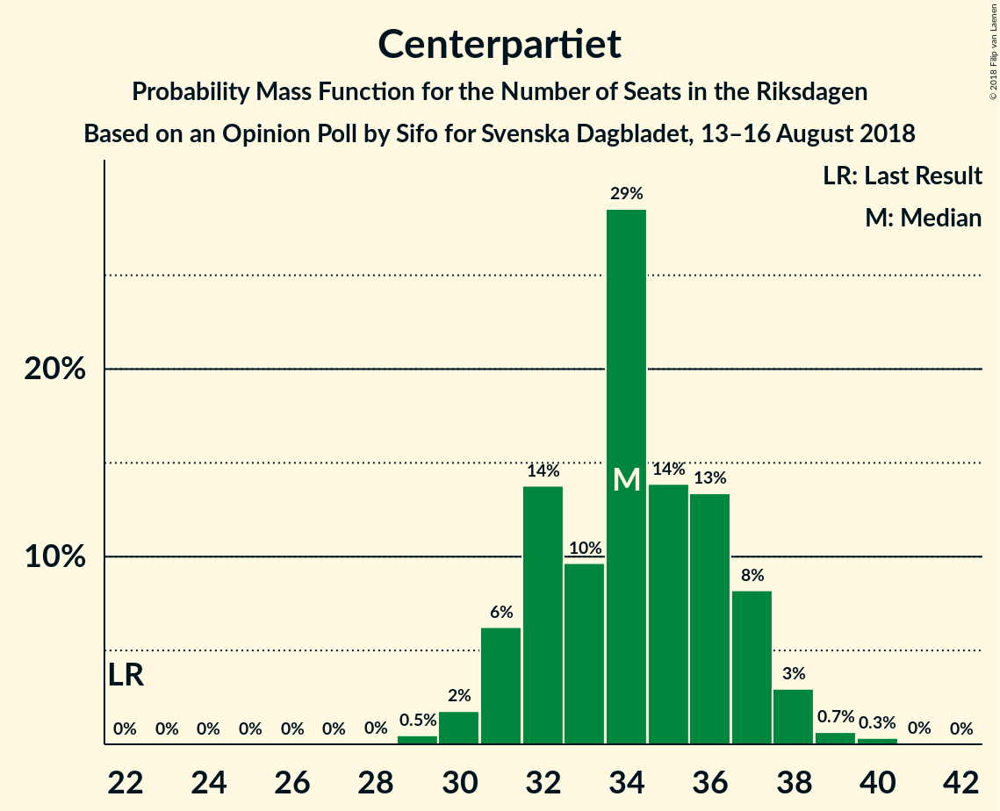
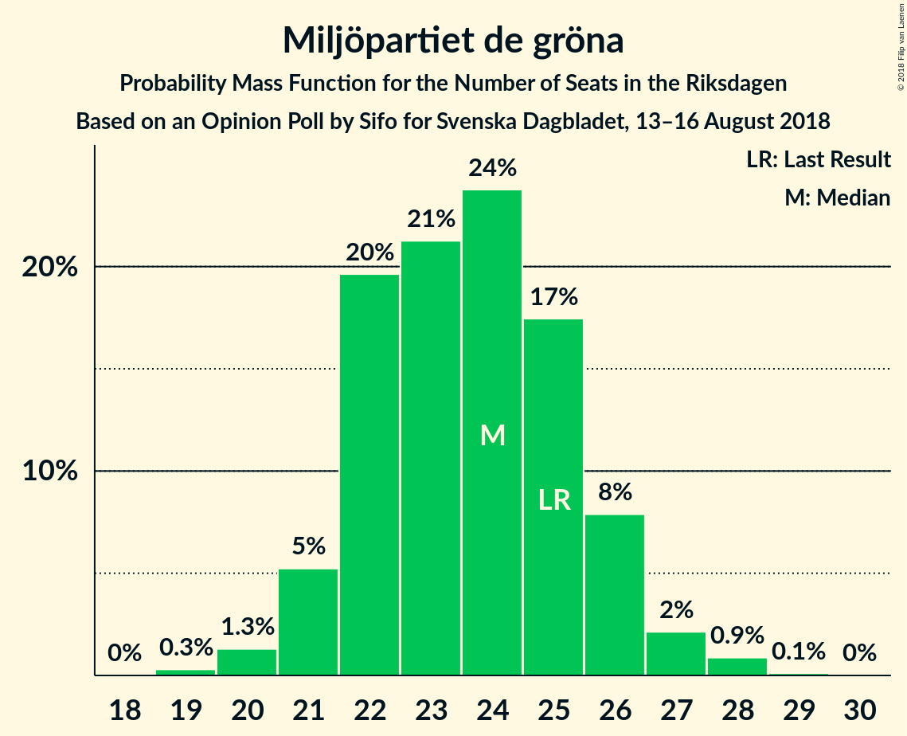

# Opinion Poll by Sifo for Svenska Dagbladet, 13–16 August 2018

<a href="#voting-intentions">Voting Intentions</a> | <a href="#seats">Seats</a> | <a href="#coalitions">Coalitions</a> | <a href="#technical-information">Technical Information</a>

## Voting Intentions

### Confidence Intervals

| Party | Last Result | Poll Result | 80% Confidence Interval | 90% Confidence Interval | 95% Confidence Interval | 99% Confidence Interval |
|:-----:|:-----------:|:-----------:|:-----------------------:|:-----------------------:|:-----------------------:|:-----------------------:|
| Sveriges socialdemokratiska arbetareparti | 31.0% | 25.2% | 24.2–26.2% |24.0–26.4% |23.8–26.7% |23.3–27.1% |
| Moderata samlingspartiet | 23.3% | 19.4% | 18.5–20.3% |18.3–20.5% |18.1–20.7% |17.7–21.2% |
| Sverigedemokraterna | 12.9% | 18.7% | 17.9–19.6% |17.6–19.8% |17.4–20.0% |17.0–20.5% |
| Centerpartiet | 6.1% | 9.5% | 8.9–10.2% |8.7–10.3% |8.6–10.5% |8.3–10.9% |
| Vänsterpartiet | 5.7% | 9.3% | 8.7–10.0% |8.5–10.2% |8.4–10.3% |8.1–10.6% |
| Miljöpartiet de gröna | 6.9% | 6.5% | 6.0–7.1% |5.9–7.2% |5.7–7.4% |5.5–7.7% |
| Liberalerna | 5.4% | 5.1% | 4.6–5.6% |4.5–5.8% |4.4–5.9% |4.2–6.1% |
| Kristdemokraterna | 4.6% | 4.2% | 3.8–4.7% |3.7–4.8% |3.6–4.9% |3.4–5.2% |
| Feministiskt initiativ | 3.1% | 1.0% | 0.8–1.3% |0.8–1.3% |0.7–1.4% |0.6–1.5% |

*Note:* The poll result column reflects the actual value used in the calculations. Published results may vary slightly, and in addition be rounded to fewer digits.

## Seats

### Confidence Intervals

| Party | Last Result | Median | 80% Confidence Interval | 90% Confidence Interval | 95% Confidence Interval | 99% Confidence Interval |
|:-----:|:-----------:|:------:|:-----------------------:|:-----------------------:|:-----------------------:|:-----------------------:|
| <a href="#sveriges-socialdemokratiska-arbetareparti">Sveriges socialdemokratiska arbetareparti</a> | 113 | 91 | 86–94 |85–96 |85–97 |83–100 |
| <a href="#moderata-samlingspartiet">Moderata samlingspartiet</a> | 84 | 70 | 66–73 |65–74 |65–76 |63–77 |
| <a href="#sverigedemokraterna">Sverigedemokraterna</a> | 49 | 68 | 64–71 |63–72 |62–73 |60–75 |
| <a href="#centerpartiet">Centerpartiet</a> | 22 | 34 | 32–37 |31–37 |31–38 |29–39 |
| <a href="#vänsterpartiet">Vänsterpartiet</a> | 21 | 33 | 31–36 |30–37 |30–37 |29–39 |
| <a href="#miljöpartiet-de-gröna">Miljöpartiet de gröna</a> | 25 | 24 | 22–26 |21–26 |21–27 |20–28 |
| <a href="#liberalerna">Liberalerna</a> | 19 | 19 | 17–20 |16–21 |16–21 |15–22 |
| <a href="#kristdemokraterna">Kristdemokraterna</a> | 16 | 15 | 0–17 |0–17 |0–17 |0–19 |
| <a href="#feministiskt-initiativ">Feministiskt initiativ</a> | 0 | 0 | 0 |0 |0 |0 |

### Sveriges socialdemokratiska arbetareparti

*For a full overview of the results for this party, see the [Sveriges socialdemokratiska arbetareparti](party-sverigessocialdemokratiskaarbetareparti.html) page.*

| Number of Seats | Probability | Accumulated | Special Marks |
|:---------------:|:-----------:|:-----------:|:-------------:|
| 81 | 0% | 100% |  |
| 82 | 0.1% | 99.9% |  |
| 83 | 0.6% | 99.9% |  |
| 84 | 0.7% | 99.2% |  |
| 85 | 8% | 98.6% |  |
| 86 | 13% | 91% |  |
| 87 | 4% | 78% |  |
| 88 | 4% | 73% |  |
| 89 | 4% | 69% |  |
| 90 | 10% | 65% |  |
| 91 | 18% | 55% | Median |
| 92 | 6% | 38% |  |
| 93 | 14% | 31% |  |
| 94 | 9% | 17% |  |
| 95 | 3% | 8% |  |
| 96 | 2% | 5% |  |
| 97 | 2% | 3% |  |
| 98 | 0.4% | 1.4% |  |
| 99 | 0.2% | 1.0% |  |
| 100 | 0.4% | 0.8% |  |
| 101 | 0.2% | 0.4% |  |
| 102 | 0.2% | 0.2% |  |
| 103 | 0% | 0% |  |
| 104 | 0% | 0% |  |
| 105 | 0% | 0% |  |
| 106 | 0% | 0% |  |
| 107 | 0% | 0% |  |
| 108 | 0% | 0% |  |
| 109 | 0% | 0% |  |
| 110 | 0% | 0% |  |
| 111 | 0% | 0% |  |
| 112 | 0% | 0% |  |
| 113 | 0% | 0% | Last Result |

### Moderata samlingspartiet

*For a full overview of the results for this party, see the [Moderata samlingspartiet](party-moderatasamlingspartiet.html) page.*

| Number of Seats | Probability | Accumulated | Special Marks |
|:---------------:|:-----------:|:-----------:|:-------------:|
| 62 | 0.3% | 100% |  |
| 63 | 0.4% | 99.7% |  |
| 64 | 2% | 99.3% |  |
| 65 | 4% | 98% |  |
| 66 | 4% | 93% |  |
| 67 | 9% | 89% |  |
| 68 | 14% | 80% |  |
| 69 | 16% | 66% |  |
| 70 | 16% | 51% | Median |
| 71 | 9% | 35% |  |
| 72 | 10% | 26% |  |
| 73 | 7% | 16% |  |
| 74 | 4% | 9% |  |
| 75 | 1.2% | 5% |  |
| 76 | 3% | 4% |  |
| 77 | 0.4% | 0.8% |  |
| 78 | 0.2% | 0.4% |  |
| 79 | 0.2% | 0.2% |  |
| 80 | 0% | 0.1% |  |
| 81 | 0% | 0% |  |
| 82 | 0% | 0% |  |
| 83 | 0% | 0% |  |
| 84 | 0% | 0% | Last Result |

### Sverigedemokraterna

*For a full overview of the results for this party, see the [Sverigedemokraterna](party-sverigedemokraterna.html) page.*

| Number of Seats | Probability | Accumulated | Special Marks |
|:---------------:|:-----------:|:-----------:|:-------------:|
| 49 | 0% | 100% | Last Result |
| 50 | 0% | 100% |  |
| 51 | 0% | 100% |  |
| 52 | 0% | 100% |  |
| 53 | 0% | 100% |  |
| 54 | 0% | 100% |  |
| 55 | 0% | 100% |  |
| 56 | 0% | 100% |  |
| 57 | 0% | 100% |  |
| 58 | 0% | 100% |  |
| 59 | 0.1% | 100% |  |
| 60 | 0.6% | 99.9% |  |
| 61 | 0.4% | 99.3% |  |
| 62 | 3% | 98.9% |  |
| 63 | 5% | 96% |  |
| 64 | 5% | 90% |  |
| 65 | 6% | 85% |  |
| 66 | 17% | 79% |  |
| 67 | 12% | 63% |  |
| 68 | 9% | 50% | Median |
| 69 | 25% | 41% |  |
| 70 | 5% | 17% |  |
| 71 | 3% | 11% |  |
| 72 | 6% | 9% |  |
| 73 | 2% | 3% |  |
| 74 | 0.3% | 1.2% |  |
| 75 | 0.8% | 0.9% |  |
| 76 | 0.1% | 0.2% |  |
| 77 | 0% | 0.1% |  |
| 78 | 0.1% | 0.1% |  |
| 79 | 0% | 0% |  |

### Centerpartiet

*For a full overview of the results for this party, see the [Centerpartiet](party-centerpartiet.html) page.*

| Number of Seats | Probability | Accumulated | Special Marks |
|:---------------:|:-----------:|:-----------:|:-------------:|
| 22 | 0% | 100% | Last Result |
| 23 | 0% | 100% |  |
| 24 | 0% | 100% |  |
| 25 | 0% | 100% |  |
| 26 | 0% | 100% |  |
| 27 | 0% | 100% |  |
| 28 | 0% | 100% |  |
| 29 | 0.5% | 100% |  |
| 30 | 2% | 99.5% |  |
| 31 | 6% | 98% |  |
| 32 | 14% | 91% |  |
| 33 | 10% | 78% |  |
| 34 | 29% | 68% | Median |
| 35 | 14% | 39% |  |
| 36 | 13% | 26% |  |
| 37 | 8% | 12% |  |
| 38 | 3% | 4% |  |
| 39 | 0.7% | 1.1% |  |
| 40 | 0.3% | 0.4% |  |
| 41 | 0% | 0.1% |  |
| 42 | 0% | 0% |  |

### Vänsterpartiet

*For a full overview of the results for this party, see the [Vänsterpartiet](party-vänsterpartiet.html) page.*

| Number of Seats | Probability | Accumulated | Special Marks |
|:---------------:|:-----------:|:-----------:|:-------------:|
| 21 | 0% | 100% | Last Result |
| 22 | 0% | 100% |  |
| 23 | 0% | 100% |  |
| 24 | 0% | 100% |  |
| 25 | 0% | 100% |  |
| 26 | 0% | 100% |  |
| 27 | 0% | 100% |  |
| 28 | 0.2% | 100% |  |
| 29 | 1.3% | 99.7% |  |
| 30 | 4% | 98% |  |
| 31 | 13% | 95% |  |
| 32 | 19% | 81% |  |
| 33 | 18% | 62% | Median |
| 34 | 17% | 44% |  |
| 35 | 10% | 27% |  |
| 36 | 9% | 18% |  |
| 37 | 6% | 8% |  |
| 38 | 1.2% | 2% |  |
| 39 | 0.3% | 0.7% |  |
| 40 | 0.4% | 0.4% |  |
| 41 | 0% | 0% |  |

### Miljöpartiet de gröna

*For a full overview of the results for this party, see the [Miljöpartiet de gröna](party-miljöpartietdegröna.html) page.*

| Number of Seats | Probability | Accumulated | Special Marks |
|:---------------:|:-----------:|:-----------:|:-------------:|
| 19 | 0.3% | 100% |  |
| 20 | 1.3% | 99.7% |  |
| 21 | 5% | 98% |  |
| 22 | 20% | 93% |  |
| 23 | 21% | 74% |  |
| 24 | 24% | 52% | Median |
| 25 | 17% | 28% | Last Result |
| 26 | 8% | 11% |  |
| 27 | 2% | 3% |  |
| 28 | 0.9% | 1.0% |  |
| 29 | 0.1% | 0.1% |  |
| 30 | 0% | 0% |  |

### Liberalerna

*For a full overview of the results for this party, see the [Liberalerna](party-liberalerna.html) page.*

| Number of Seats | Probability | Accumulated | Special Marks |
|:---------------:|:-----------:|:-----------:|:-------------:|
| 0 | 0.1% | 100% |  |
| 1 | 0% | 99.9% |  |
| 2 | 0% | 99.9% |  |
| 3 | 0% | 99.9% |  |
| 4 | 0% | 99.9% |  |
| 5 | 0% | 99.9% |  |
| 6 | 0% | 99.9% |  |
| 7 | 0% | 99.9% |  |
| 8 | 0% | 99.9% |  |
| 9 | 0% | 99.9% |  |
| 10 | 0% | 99.9% |  |
| 11 | 0% | 99.9% |  |
| 12 | 0% | 99.9% |  |
| 13 | 0% | 99.9% |  |
| 14 | 0% | 99.9% |  |
| 15 | 1.3% | 99.9% |  |
| 16 | 4% | 98.6% |  |
| 17 | 16% | 95% |  |
| 18 | 29% | 79% |  |
| 19 | 28% | 51% | Last Result, Median |
| 20 | 16% | 23% |  |
| 21 | 5% | 7% |  |
| 22 | 2% | 2% |  |
| 23 | 0.3% | 0.3% |  |
| 24 | 0% | 0.1% |  |
| 25 | 0% | 0% |  |

### Kristdemokraterna

*For a full overview of the results for this party, see the [Kristdemokraterna](party-kristdemokraterna.html) page.*

| Number of Seats | Probability | Accumulated | Special Marks |
|:---------------:|:-----------:|:-----------:|:-------------:|
| 0 | 24% | 100% |  |
| 1 | 0% | 76% |  |
| 2 | 0% | 76% |  |
| 3 | 0% | 76% |  |
| 4 | 0% | 76% |  |
| 5 | 0% | 76% |  |
| 6 | 0% | 76% |  |
| 7 | 0% | 76% |  |
| 8 | 0% | 76% |  |
| 9 | 0% | 76% |  |
| 10 | 0% | 76% |  |
| 11 | 0% | 76% |  |
| 12 | 0% | 76% |  |
| 13 | 0% | 76% |  |
| 14 | 8% | 76% |  |
| 15 | 42% | 69% | Median |
| 16 | 16% | 27% | Last Result |
| 17 | 8% | 10% |  |
| 18 | 2% | 2% |  |
| 19 | 0.5% | 0.5% |  |
| 20 | 0% | 0% |  |

### Feministiskt initiativ

*For a full overview of the results for this party, see the [Feministiskt initiativ](party-feministisktinitiativ.html) page.*

| Number of Seats | Probability | Accumulated | Special Marks |
|:---------------:|:-----------:|:-----------:|:-------------:|
| 0 | 100% | 100% | Last Result, Median |

## Coalitions

### Confidence Intervals

| Coalition | Last Result | Median | Majority? | 80% Confidence Interval | 90% Confidence Interval | 95% Confidence Interval | 99% Confidence Interval |
|:---------:|:-----------:|:------:|:---------:|:-----------------------:|:-----------------------:|:-----------------------:|:-----------------------:|
| Sveriges socialdemokratiska arbetareparti – Moderata samlingspartiet | 197 | 159 | 0.1% | 155–166 | 154–169 | 153–171 | 151–173 |
| Sveriges socialdemokratiska arbetareparti – Vänsterpartiet – Miljöpartiet de gröna – Feministiskt initiativ | 159 | 147 | 0% | 141–153 | 141–154 | 140–157 | 139–159 |
| Sveriges socialdemokratiska arbetareparti – Vänsterpartiet – Miljöpartiet de gröna | 159 | 147 | 0% | 141–153 | 141–154 | 140–157 | 139–159 |
| Moderata samlingspartiet – Sverigedemokraterna | 133 | 136 | 0% | 132–143 | 131–144 | 131–146 | 128–148 |
| Moderata samlingspartiet – Centerpartiet – Liberalerna – Kristdemokraterna | 141 | 135 | 0% | 125–141 | 124–142 | 123–143 | 121–144 |
| Sveriges socialdemokratiska arbetareparti – Vänsterpartiet | 134 | 123 | 0% | 118–130 | 118–131 | 117–132 | 116–135 |
| Moderata samlingspartiet – Centerpartiet – Liberalerna | 125 | 122 | 0% | 118–127 | 117–129 | 116–129 | 114–133 |
| Moderata samlingspartiet – Centerpartiet – Kristdemokraterna | 122 | 116 | 0% | 106–122 | 105–123 | 103–124 | 102–126 |
| Sveriges socialdemokratiska arbetareparti – Miljöpartiet de gröna | 138 | 115 | 0% | 109–118 | 108–119 | 108–120 | 107–125 |
| Moderata samlingspartiet – Centerpartiet | 106 | 104 | 0% | 100–108 | 99–110 | 97–111 | 96–114 |

