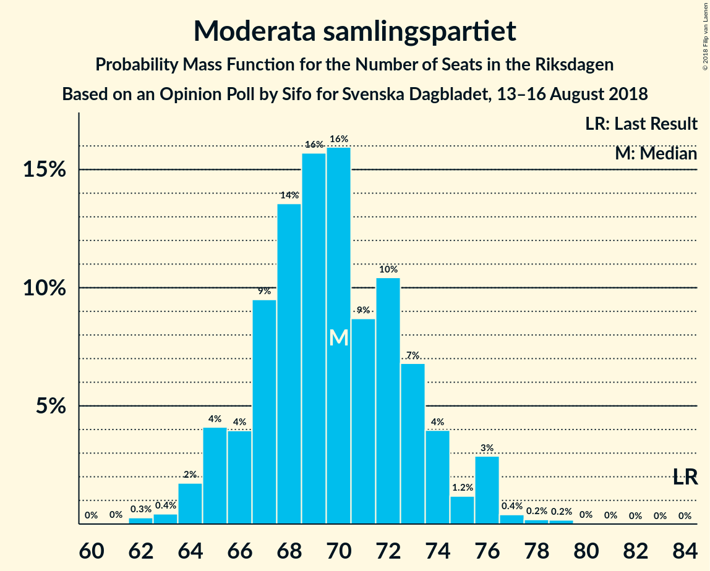

# Opinion Poll by Sifo for Svenska Dagbladet, 13–16 August 2018

<a href="#voting-intentions">Voting Intentions</a> | <a href="#seats">Seats</a> | <a href="#coalitions">Coalitions</a> | <a href="#technical-information">Technical Information</a>

## Voting Intentions

### Confidence Intervals

| Party | Last Result | Poll Result | 80% Confidence Interval | 90% Confidence Interval | 95% Confidence Interval | 99% Confidence Interval |
|:-----:|:-----------:|:-----------:|:-----------------------:|:-----------------------:|:-----------------------:|:-----------------------:|
| Sveriges socialdemokratiska arbetareparti | 31.0% | 25.2% | 24.2–26.2% |24.0–26.4% |23.8–26.7% |23.3–27.1% |
| Moderata samlingspartiet | 23.3% | 19.4% | 18.5–20.3% |18.3–20.5% |18.1–20.7% |17.7–21.2% |
| Sverigedemokraterna | 12.9% | 18.7% | 17.9–19.6% |17.6–19.8% |17.4–20.0% |17.0–20.5% |
| Centerpartiet | 6.1% | 9.5% | 8.9–10.2% |8.7–10.3% |8.6–10.5% |8.3–10.9% |
| Vänsterpartiet | 5.7% | 9.3% | 8.7–10.0% |8.5–10.2% |8.4–10.3% |8.1–10.6% |
| Miljöpartiet de gröna | 6.9% | 6.5% | 6.0–7.1% |5.9–7.2% |5.7–7.4% |5.5–7.7% |
| Liberalerna | 5.4% | 5.1% | 4.6–5.6% |4.5–5.8% |4.4–5.9% |4.2–6.1% |
| Kristdemokraterna | 4.6% | 4.2% | 3.8–4.7% |3.7–4.8% |3.6–4.9% |3.4–5.2% |
| Feministiskt initiativ | 3.1% | 1.0% | 0.8–1.3% |0.8–1.3% |0.7–1.4% |0.6–1.5% |

*Note:* The poll result column reflects the actual value used in the calculations. Published results may vary slightly, and in addition be rounded to fewer digits.

## Seats

### Confidence Intervals

| Party | Last Result | Median | 80% Confidence Interval | 90% Confidence Interval | 95% Confidence Interval | 99% Confidence Interval |
|:-----:|:-----------:|:------:|:-----------------------:|:-----------------------:|:-----------------------:|:-----------------------:|
| <a href="#sveriges-socialdemokratiska-arbetareparti">Sveriges socialdemokratiska arbetareparti</a> | 113 | 91 | 86–94 |85–96 |85–97 |84–100 |
| <a href="#moderata-samlingspartiet">Moderata samlingspartiet</a> | 84 | 69 | 66–73 |64–74 |64–75 |64–77 |
| <a href="#sverigedemokraterna">Sverigedemokraterna</a> | 49 | 68 | 64–70 |62–72 |62–73 |60–75 |
| <a href="#centerpartiet">Centerpartiet</a> | 22 | 34 | 31–37 |31–38 |30–38 |29–40 |
| <a href="#vänsterpartiet">Vänsterpartiet</a> | 21 | 33 | 31–36 |30–37 |30–39 |29–40 |
| <a href="#miljöpartiet-de-gröna">Miljöpartiet de gröna</a> | 25 | 24 | 21–25 |21–26 |20–26 |20–28 |
| <a href="#liberalerna">Liberalerna</a> | 19 | 18 | 17–22 |16–22 |16–22 |15–22 |
| <a href="#kristdemokraterna">Kristdemokraterna</a> | 16 | 15 | 0–16 |0–17 |0–17 |0–18 |
| <a href="#feministiskt-initiativ">Feministiskt initiativ</a> | 0 | 0 | 0 |0 |0 |0 |

### Sveriges socialdemokratiska arbetareparti

*For a full overview of the results for this party, see the [Sveriges socialdemokratiska arbetareparti](party-sverigessocialdemokratiskaarbetareparti.html) page.*

| Number of Seats | Probability | Accumulated | Special Marks |
|:---------------:|:-----------:|:-----------:|:-------------:|
| 80 | 0.1% | 100% |  |
| 81 | 0% | 99.9% |  |
| 82 | 0.1% | 99.9% |  |
| 83 | 0.2% | 99.8% |  |
| 84 | 0.5% | 99.6% |  |
| 85 | 5% | 99.2% |  |
| 86 | 6% | 95% |  |
| 87 | 8% | 89% |  |
| 88 | 3% | 81% |  |
| 89 | 7% | 78% |  |
| 90 | 17% | 71% |  |
| 91 | 19% | 54% | Median |
| 92 | 1.0% | 35% |  |
| 93 | 8% | 34% |  |
| 94 | 18% | 25% |  |
| 95 | 2% | 8% |  |
| 96 | 2% | 5% |  |
| 97 | 0.6% | 3% |  |
| 98 | 0.1% | 2% |  |
| 99 | 0.1% | 2% |  |
| 100 | 2% | 2% |  |
| 101 | 0.1% | 0.5% |  |
| 102 | 0.4% | 0.4% |  |
| 103 | 0% | 0% |  |
| 104 | 0% | 0% |  |
| 105 | 0% | 0% |  |
| 106 | 0% | 0% |  |
| 107 | 0% | 0% |  |
| 108 | 0% | 0% |  |
| 109 | 0% | 0% |  |
| 110 | 0% | 0% |  |
| 111 | 0% | 0% |  |
| 112 | 0% | 0% |  |
| 113 | 0% | 0% | Last Result |

### Moderata samlingspartiet

*For a full overview of the results for this party, see the [Moderata samlingspartiet](party-moderatasamlingspartiet.html) page.*

| Number of Seats | Probability | Accumulated | Special Marks |
|:---------------:|:-----------:|:-----------:|:-------------:|
| 63 | 0.2% | 100% |  |
| 64 | 6% | 99.7% |  |
| 65 | 3% | 93% |  |
| 66 | 4% | 90% |  |
| 67 | 6% | 87% |  |
| 68 | 14% | 80% |  |
| 69 | 25% | 66% | Median |
| 70 | 4% | 41% |  |
| 71 | 19% | 37% |  |
| 72 | 7% | 18% |  |
| 73 | 5% | 11% |  |
| 74 | 1.3% | 6% |  |
| 75 | 2% | 5% |  |
| 76 | 0.7% | 2% |  |
| 77 | 2% | 2% |  |
| 78 | 0.1% | 0.2% |  |
| 79 | 0% | 0.1% |  |
| 80 | 0.1% | 0.1% |  |
| 81 | 0% | 0% |  |
| 82 | 0% | 0% |  |
| 83 | 0% | 0% |  |
| 84 | 0% | 0% | Last Result |

### Sverigedemokraterna

*For a full overview of the results for this party, see the [Sverigedemokraterna](party-sverigedemokraterna.html) page.*

| Number of Seats | Probability | Accumulated | Special Marks |
|:---------------:|:-----------:|:-----------:|:-------------:|
| 49 | 0% | 100% | Last Result |
| 50 | 0% | 100% |  |
| 51 | 0% | 100% |  |
| 52 | 0% | 100% |  |
| 53 | 0% | 100% |  |
| 54 | 0% | 100% |  |
| 55 | 0% | 100% |  |
| 56 | 0% | 100% |  |
| 57 | 0% | 100% |  |
| 58 | 0% | 100% |  |
| 59 | 0.3% | 100% |  |
| 60 | 0.2% | 99.7% |  |
| 61 | 0.4% | 99.5% |  |
| 62 | 5% | 99.1% |  |
| 63 | 4% | 94% |  |
| 64 | 2% | 91% |  |
| 65 | 2% | 88% |  |
| 66 | 17% | 86% |  |
| 67 | 12% | 69% |  |
| 68 | 12% | 57% | Median |
| 69 | 28% | 44% |  |
| 70 | 7% | 16% |  |
| 71 | 4% | 10% |  |
| 72 | 3% | 5% |  |
| 73 | 0.3% | 3% |  |
| 74 | 0.2% | 2% |  |
| 75 | 2% | 2% |  |
| 76 | 0.2% | 0.3% |  |
| 77 | 0.1% | 0.1% |  |
| 78 | 0% | 0% |  |

### Centerpartiet

*For a full overview of the results for this party, see the [Centerpartiet](party-centerpartiet.html) page.*

| Number of Seats | Probability | Accumulated | Special Marks |
|:---------------:|:-----------:|:-----------:|:-------------:|
| 22 | 0% | 100% | Last Result |
| 23 | 0% | 100% |  |
| 24 | 0% | 100% |  |
| 25 | 0% | 100% |  |
| 26 | 0% | 100% |  |
| 27 | 0% | 100% |  |
| 28 | 0% | 100% |  |
| 29 | 1.3% | 100% |  |
| 30 | 1.4% | 98.7% |  |
| 31 | 18% | 97% |  |
| 32 | 13% | 80% |  |
| 33 | 7% | 67% |  |
| 34 | 21% | 59% | Median |
| 35 | 17% | 39% |  |
| 36 | 8% | 22% |  |
| 37 | 5% | 14% |  |
| 38 | 8% | 9% |  |
| 39 | 0.7% | 2% |  |
| 40 | 1.0% | 1.1% |  |
| 41 | 0.1% | 0.1% |  |
| 42 | 0% | 0% |  |

### Vänsterpartiet

*For a full overview of the results for this party, see the [Vänsterpartiet](party-vänsterpartiet.html) page.*

| Number of Seats | Probability | Accumulated | Special Marks |
|:---------------:|:-----------:|:-----------:|:-------------:|
| 21 | 0% | 100% | Last Result |
| 22 | 0% | 100% |  |
| 23 | 0% | 100% |  |
| 24 | 0% | 100% |  |
| 25 | 0% | 100% |  |
| 26 | 0% | 100% |  |
| 27 | 0% | 100% |  |
| 28 | 0.1% | 100% |  |
| 29 | 0.9% | 99.9% |  |
| 30 | 4% | 99.0% |  |
| 31 | 10% | 95% |  |
| 32 | 10% | 85% |  |
| 33 | 25% | 75% | Median |
| 34 | 22% | 49% |  |
| 35 | 10% | 27% |  |
| 36 | 8% | 17% |  |
| 37 | 5% | 9% |  |
| 38 | 0.9% | 4% |  |
| 39 | 0.5% | 3% |  |
| 40 | 2% | 2% |  |
| 41 | 0% | 0% |  |

### Miljöpartiet de gröna

*For a full overview of the results for this party, see the [Miljöpartiet de gröna](party-miljöpartietdegröna.html) page.*

| Number of Seats | Probability | Accumulated | Special Marks |
|:---------------:|:-----------:|:-----------:|:-------------:|
| 19 | 0.2% | 100% |  |
| 20 | 3% | 99.8% |  |
| 21 | 7% | 97% |  |
| 22 | 22% | 90% |  |
| 23 | 15% | 68% |  |
| 24 | 17% | 52% | Median |
| 25 | 30% | 36% | Last Result |
| 26 | 4% | 6% |  |
| 27 | 1.2% | 2% |  |
| 28 | 0.9% | 1.0% |  |
| 29 | 0% | 0% |  |

### Liberalerna

*For a full overview of the results for this party, see the [Liberalerna](party-liberalerna.html) page.*

| Number of Seats | Probability | Accumulated | Special Marks |
|:---------------:|:-----------:|:-----------:|:-------------:|
| 14 | 0% | 100% |  |
| 15 | 1.4% | 99.9% |  |
| 16 | 5% | 98.6% |  |
| 17 | 19% | 93% |  |
| 18 | 27% | 74% | Median |
| 19 | 22% | 47% | Last Result |
| 20 | 9% | 25% |  |
| 21 | 5% | 16% |  |
| 22 | 11% | 11% |  |
| 23 | 0.2% | 0.3% |  |
| 24 | 0% | 0% |  |

### Kristdemokraterna

*For a full overview of the results for this party, see the [Kristdemokraterna](party-kristdemokraterna.html) page.*

| Number of Seats | Probability | Accumulated | Special Marks |
|:---------------:|:-----------:|:-----------:|:-------------:|
| 0 | 26% | 100% |  |
| 1 | 0% | 74% |  |
| 2 | 0% | 74% |  |
| 3 | 0% | 74% |  |
| 4 | 0% | 74% |  |
| 5 | 0% | 74% |  |
| 6 | 0% | 74% |  |
| 7 | 0% | 74% |  |
| 8 | 0% | 74% |  |
| 9 | 0% | 74% |  |
| 10 | 0% | 74% |  |
| 11 | 0% | 74% |  |
| 12 | 0% | 74% |  |
| 13 | 0% | 74% |  |
| 14 | 0.5% | 74% |  |
| 15 | 51% | 74% | Median |
| 16 | 16% | 23% | Last Result |
| 17 | 5% | 6% |  |
| 18 | 0.8% | 1.2% |  |
| 19 | 0.4% | 0.4% |  |
| 20 | 0% | 0% |  |

### Feministiskt initiativ

*For a full overview of the results for this party, see the [Feministiskt initiativ](party-feministisktinitiativ.html) page.*

| Number of Seats | Probability | Accumulated | Special Marks |
|:---------------:|:-----------:|:-----------:|:-------------:|
| 0 | 100% | 100% | Last Result, Median |

## Coalitions

### Confidence Intervals

| Coalition | Last Result | Median | Majority? | 80% Confidence Interval | 90% Confidence Interval | 95% Confidence Interval | 99% Confidence Interval |
|:---------:|:-----------:|:------:|:---------:|:-----------------------:|:-----------------------:|:-----------------------:|:-----------------------:|
| Sveriges socialdemokratiska arbetareparti – Moderata samlingspartiet | 197 | 160 | 0.4% | 154–165 | 154–168 | 153–169 | 151–174 |
| Sveriges socialdemokratiska arbetareparti – Vänsterpartiet – Miljöpartiet de gröna – Feministiskt initiativ | 159 | 148 | 0% | 142–153 | 140–157 | 140–158 | 140–160 |
| Sveriges socialdemokratiska arbetareparti – Vänsterpartiet – Miljöpartiet de gröna | 159 | 148 | 0% | 142–153 | 140–157 | 140–158 | 140–160 |
| Moderata samlingspartiet – Sverigedemokraterna | 133 | 137 | 0% | 132–142 | 131–145 | 131–146 | 129–147 |
| Moderata samlingspartiet – Centerpartiet – Liberalerna – Kristdemokraterna | 141 | 133 | 0% | 126–140 | 123–143 | 122–143 | 121–145 |
| Sveriges socialdemokratiska arbetareparti – Vänsterpartiet | 134 | 125 | 0% | 120–129 | 118–132 | 116–134 | 116–135 |
| Moderata samlingspartiet – Centerpartiet – Liberalerna | 125 | 121 | 0% | 118–128 | 117–129 | 115–133 | 113–134 |
| Moderata samlingspartiet – Centerpartiet – Kristdemokraterna | 122 | 116 | 0% | 106–120 | 104–125 | 103–125 | 101–126 |
| Sveriges socialdemokratiska arbetareparti – Miljöpartiet de gröna | 138 | 115 | 0% | 109–119 | 108–120 | 108–122 | 108–126 |
| Moderata samlingspartiet – Centerpartiet | 106 | 102 | 0% | 99–109 | 99–110 | 97–112 | 96–114 |

### Sveriges socialdemokratiska arbetareparti – Moderata samlingspartiet

| Number of Seats | Probability | Accumulated | Special Marks |
|:---------------:|:-----------:|:-----------:|:-------------:|
| 150 | 0.2% | 100% |  |
| 151 | 0.2% | 99.7% |  |
| 152 | 0.1% | 99.5% |  |
| 153 | 3% | 99.4% |  |
| 154 | 8% | 97% |  |
| 155 | 0.8% | 89% |  |
| 156 | 7% | 88% |  |
| 157 | 7% | 81% |  |
| 158 | 12% | 74% |  |
| 159 | 9% | 62% |  |
| 160 | 14% | 53% | Median |
| 161 | 6% | 40% |  |
| 162 | 5% | 33% |  |
| 163 | 5% | 29% |  |
| 164 | 0.5% | 23% |  |
| 165 | 14% | 23% |  |
| 166 | 3% | 9% |  |
| 167 | 0.2% | 6% |  |
| 168 | 3% | 6% |  |
| 169 | 0.8% | 3% |  |
| 170 | 0.3% | 2% |  |
| 171 | 0.1% | 2% |  |
| 172 | 0% | 2% |  |
| 173 | 0.9% | 2% |  |
| 174 | 0.2% | 0.6% |  |
| 175 | 0% | 0.4% | Majority |
| 176 | 0.3% | 0.3% |  |
| 177 | 0% | 0% |  |
| 178 | 0% | 0% |  |
| 179 | 0% | 0% |  |
| 180 | 0% | 0% |  |
| 181 | 0% | 0% |  |
| 182 | 0% | 0% |  |
| 183 | 0% | 0% |  |
| 184 | 0% | 0% |  |
| 185 | 0% | 0% |  |
| 186 | 0% | 0% |  |
| 187 | 0% | 0% |  |
| 188 | 0% | 0% |  |
| 189 | 0% | 0% |  |
| 190 | 0% | 0% |  |
| 191 | 0% | 0% |  |
| 192 | 0% | 0% |  |
| 193 | 0% | 0% |  |
| 194 | 0% | 0% |  |
| 195 | 0% | 0% |  |
| 196 | 0% | 0% |  |
| 197 | 0% | 0% | Last Result |

### Sveriges socialdemokratiska arbetareparti – Vänsterpartiet – Miljöpartiet de gröna – Feministiskt initiativ

| Number of Seats | Probability | Accumulated | Special Marks |
|:---------------:|:-----------:|:-----------:|:-------------:|
| 136 | 0.1% | 100% |  |
| 137 | 0.1% | 99.9% |  |
| 138 | 0% | 99.8% |  |
| 139 | 0.2% | 99.8% |  |
| 140 | 6% | 99.6% |  |
| 141 | 3% | 93% |  |
| 142 | 1.4% | 91% |  |
| 143 | 5% | 89% |  |
| 144 | 5% | 85% |  |
| 145 | 6% | 80% |  |
| 146 | 3% | 73% |  |
| 147 | 16% | 70% |  |
| 148 | 17% | 54% | Median |
| 149 | 2% | 37% |  |
| 150 | 8% | 35% |  |
| 151 | 4% | 27% |  |
| 152 | 12% | 22% |  |
| 153 | 3% | 11% |  |
| 154 | 0.5% | 7% |  |
| 155 | 0.5% | 7% |  |
| 156 | 1.1% | 6% |  |
| 157 | 3% | 5% |  |
| 158 | 0.3% | 3% |  |
| 159 | 0.4% | 2% | Last Result |
| 160 | 2% | 2% |  |
| 161 | 0.4% | 0.4% |  |
| 162 | 0% | 0.1% |  |
| 163 | 0% | 0% |  |

### Sveriges socialdemokratiska arbetareparti – Vänsterpartiet – Miljöpartiet de gröna

| Number of Seats | Probability | Accumulated | Special Marks |
|:---------------:|:-----------:|:-----------:|:-------------:|
| 136 | 0.1% | 100% |  |
| 137 | 0.1% | 99.9% |  |
| 138 | 0% | 99.8% |  |
| 139 | 0.2% | 99.8% |  |
| 140 | 6% | 99.6% |  |
| 141 | 3% | 93% |  |
| 142 | 1.4% | 91% |  |
| 143 | 5% | 89% |  |
| 144 | 5% | 85% |  |
| 145 | 6% | 80% |  |
| 146 | 3% | 73% |  |
| 147 | 16% | 70% |  |
| 148 | 17% | 54% | Median |
| 149 | 2% | 37% |  |
| 150 | 8% | 35% |  |
| 151 | 4% | 27% |  |
| 152 | 12% | 22% |  |
| 153 | 3% | 11% |  |
| 154 | 0.5% | 7% |  |
| 155 | 0.5% | 7% |  |
| 156 | 1.1% | 6% |  |
| 157 | 3% | 5% |  |
| 158 | 0.3% | 3% |  |
| 159 | 0.4% | 2% | Last Result |
| 160 | 2% | 2% |  |
| 161 | 0.4% | 0.4% |  |
| 162 | 0% | 0.1% |  |
| 163 | 0% | 0% |  |

### Moderata samlingspartiet – Sverigedemokraterna

| Number of Seats | Probability | Accumulated | Special Marks |
|:---------------:|:-----------:|:-----------:|:-------------:|
| 127 | 0.1% | 100% |  |
| 128 | 0.2% | 99.8% |  |
| 129 | 0.3% | 99.6% |  |
| 130 | 0.7% | 99.3% |  |
| 131 | 6% | 98.7% |  |
| 132 | 7% | 93% |  |
| 133 | 5% | 86% | Last Result |
| 134 | 3% | 81% |  |
| 135 | 16% | 77% |  |
| 136 | 5% | 61% |  |
| 137 | 8% | 56% | Median |
| 138 | 17% | 48% |  |
| 139 | 3% | 31% |  |
| 140 | 16% | 28% |  |
| 141 | 0.4% | 12% |  |
| 142 | 2% | 11% |  |
| 143 | 4% | 9% |  |
| 144 | 0.3% | 6% |  |
| 145 | 2% | 5% |  |
| 146 | 2% | 3% |  |
| 147 | 0.9% | 1.2% |  |
| 148 | 0.2% | 0.3% |  |
| 149 | 0.1% | 0.1% |  |
| 150 | 0% | 0% |  |

### Moderata samlingspartiet – Centerpartiet – Liberalerna – Kristdemokraterna

| Number of Seats | Probability | Accumulated | Special Marks |
|:---------------:|:-----------:|:-----------:|:-------------:|
| 118 | 0% | 100% |  |
| 119 | 0.3% | 99.9% |  |
| 120 | 0% | 99.6% |  |
| 121 | 2% | 99.6% |  |
| 122 | 0.5% | 98% |  |
| 123 | 3% | 97% |  |
| 124 | 2% | 95% |  |
| 125 | 2% | 92% |  |
| 126 | 1.3% | 91% |  |
| 127 | 0.2% | 89% |  |
| 128 | 10% | 89% |  |
| 129 | 0.8% | 79% |  |
| 130 | 3% | 78% |  |
| 131 | 0.4% | 75% |  |
| 132 | 1.0% | 74% |  |
| 133 | 28% | 73% |  |
| 134 | 12% | 45% |  |
| 135 | 1.1% | 33% |  |
| 136 | 6% | 32% | Median |
| 137 | 5% | 26% |  |
| 138 | 6% | 21% |  |
| 139 | 3% | 16% |  |
| 140 | 6% | 13% |  |
| 141 | 2% | 7% | Last Result |
| 142 | 0.2% | 5% |  |
| 143 | 4% | 5% |  |
| 144 | 0.1% | 1.2% |  |
| 145 | 1.0% | 1.1% |  |
| 146 | 0% | 0% |  |

### Sveriges socialdemokratiska arbetareparti – Vänsterpartiet

| Number of Seats | Probability | Accumulated | Special Marks |
|:---------------:|:-----------:|:-----------:|:-------------:|
| 114 | 0% | 100% |  |
| 115 | 0.1% | 99.9% |  |
| 116 | 3% | 99.8% |  |
| 117 | 2% | 97% |  |
| 118 | 3% | 96% |  |
| 119 | 0.7% | 92% |  |
| 120 | 3% | 92% |  |
| 121 | 8% | 88% |  |
| 122 | 9% | 81% |  |
| 123 | 13% | 72% |  |
| 124 | 3% | 59% | Median |
| 125 | 25% | 56% |  |
| 126 | 3% | 31% |  |
| 127 | 14% | 28% |  |
| 128 | 3% | 13% |  |
| 129 | 2% | 10% |  |
| 130 | 0.5% | 8% |  |
| 131 | 2% | 8% |  |
| 132 | 1.0% | 6% |  |
| 133 | 0.4% | 5% |  |
| 134 | 2% | 5% | Last Result |
| 135 | 2% | 2% |  |
| 136 | 0.3% | 0.4% |  |
| 137 | 0% | 0.1% |  |
| 138 | 0% | 0% |  |

### Moderata samlingspartiet – Centerpartiet – Liberalerna

| Number of Seats | Probability | Accumulated | Special Marks |
|:---------------:|:-----------:|:-----------:|:-------------:|
| 110 | 0% | 100% |  |
| 111 | 0% | 99.9% |  |
| 112 | 0% | 99.9% |  |
| 113 | 0.5% | 99.9% |  |
| 114 | 0.2% | 99.4% |  |
| 115 | 2% | 99.2% |  |
| 116 | 0.6% | 97% |  |
| 117 | 4% | 96% |  |
| 118 | 25% | 92% |  |
| 119 | 10% | 67% |  |
| 120 | 6% | 57% |  |
| 121 | 7% | 51% | Median |
| 122 | 2% | 45% |  |
| 123 | 7% | 42% |  |
| 124 | 6% | 35% |  |
| 125 | 7% | 29% | Last Result |
| 126 | 2% | 22% |  |
| 127 | 2% | 20% |  |
| 128 | 12% | 18% |  |
| 129 | 2% | 6% |  |
| 130 | 1.2% | 4% |  |
| 131 | 0.1% | 3% |  |
| 132 | 0.3% | 3% |  |
| 133 | 0.9% | 3% |  |
| 134 | 2% | 2% |  |
| 135 | 0.1% | 0.2% |  |
| 136 | 0.1% | 0.1% |  |
| 137 | 0% | 0% |  |

### Moderata samlingspartiet – Centerpartiet – Kristdemokraterna

| Number of Seats | Probability | Accumulated | Special Marks |
|:---------------:|:-----------:|:-----------:|:-------------:|
| 100 | 0% | 100% |  |
| 101 | 0.5% | 99.9% |  |
| 102 | 2% | 99.5% |  |
| 103 | 0.4% | 98% |  |
| 104 | 3% | 97% |  |
| 105 | 1.2% | 95% |  |
| 106 | 9% | 93% |  |
| 107 | 4% | 85% |  |
| 108 | 0.3% | 81% |  |
| 109 | 2% | 81% |  |
| 110 | 0.4% | 79% |  |
| 111 | 0.8% | 79% |  |
| 112 | 4% | 78% |  |
| 113 | 1.2% | 74% |  |
| 114 | 8% | 72% |  |
| 115 | 14% | 65% |  |
| 116 | 9% | 50% |  |
| 117 | 15% | 41% |  |
| 118 | 4% | 26% | Median |
| 119 | 4% | 22% |  |
| 120 | 8% | 18% |  |
| 121 | 2% | 10% |  |
| 122 | 1.0% | 8% | Last Result |
| 123 | 1.1% | 7% |  |
| 124 | 0.6% | 6% |  |
| 125 | 5% | 6% |  |
| 126 | 1.0% | 1.1% |  |
| 127 | 0.1% | 0.1% |  |
| 128 | 0% | 0% |  |

### Sveriges socialdemokratiska arbetareparti – Miljöpartiet de gröna

| Number of Seats | Probability | Accumulated | Special Marks |
|:---------------:|:-----------:|:-----------:|:-------------:|
| 102 | 0.1% | 100% |  |
| 103 | 0.1% | 99.9% |  |
| 104 | 0% | 99.8% |  |
| 105 | 0% | 99.8% |  |
| 106 | 0.1% | 99.8% |  |
| 107 | 0.2% | 99.7% |  |
| 108 | 9% | 99.5% |  |
| 109 | 6% | 90% |  |
| 110 | 8% | 85% |  |
| 111 | 1.2% | 76% |  |
| 112 | 0.9% | 75% |  |
| 113 | 14% | 74% |  |
| 114 | 4% | 61% |  |
| 115 | 21% | 57% | Median |
| 116 | 10% | 36% |  |
| 117 | 5% | 26% |  |
| 118 | 5% | 21% |  |
| 119 | 11% | 16% |  |
| 120 | 2% | 5% |  |
| 121 | 0.3% | 3% |  |
| 122 | 0.2% | 3% |  |
| 123 | 0.1% | 2% |  |
| 124 | 0.2% | 2% |  |
| 125 | 2% | 2% |  |
| 126 | 0.5% | 0.6% |  |
| 127 | 0.1% | 0.1% |  |
| 128 | 0.1% | 0.1% |  |
| 129 | 0% | 0% |  |
| 130 | 0% | 0% |  |
| 131 | 0% | 0% |  |
| 132 | 0% | 0% |  |
| 133 | 0% | 0% |  |
| 134 | 0% | 0% |  |
| 135 | 0% | 0% |  |
| 136 | 0% | 0% |  |
| 137 | 0% | 0% |  |
| 138 | 0% | 0% | Last Result |

### Moderata samlingspartiet – Centerpartiet

| Number of Seats | Probability | Accumulated | Special Marks |
|:---------------:|:-----------:|:-----------:|:-------------:|
| 95 | 0% | 100% |  |
| 96 | 0.6% | 99.9% |  |
| 97 | 2% | 99.4% |  |
| 98 | 0.3% | 97% |  |
| 99 | 8% | 97% |  |
| 100 | 17% | 89% |  |
| 101 | 14% | 72% |  |
| 102 | 13% | 58% |  |
| 103 | 3% | 46% | Median |
| 104 | 5% | 43% |  |
| 105 | 10% | 37% |  |
| 106 | 10% | 27% | Last Result |
| 107 | 5% | 18% |  |
| 108 | 0.5% | 13% |  |
| 109 | 4% | 12% |  |
| 110 | 4% | 8% |  |
| 111 | 0.4% | 5% |  |
| 112 | 2% | 4% |  |
| 113 | 1.1% | 2% |  |
| 114 | 0.7% | 0.9% |  |
| 115 | 0% | 0.1% |  |
| 116 | 0.1% | 0.1% |  |
| 117 | 0% | 0% |  |

## Technical Information

### Opinion Poll

+ **Polling firm:** Sifo
+ **Commissioner(s):** Svenska Dagbladet
+ **Fieldwork period:** 13–16 August 2018

### Calculations

+ **Sample size:** 3486
+ **Simulations done:** 131,072
+ **Error estimate:** 0.79%

