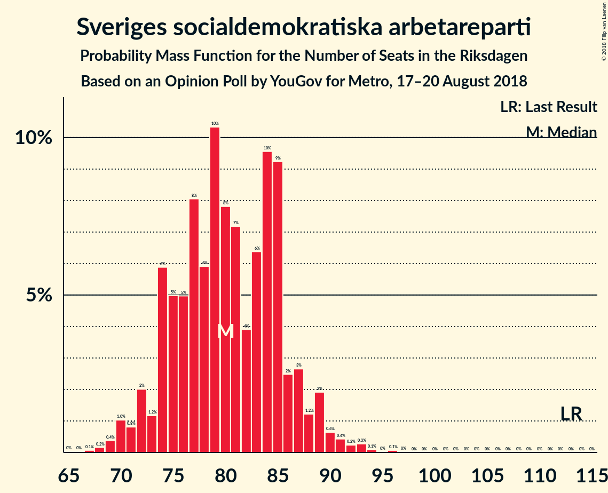
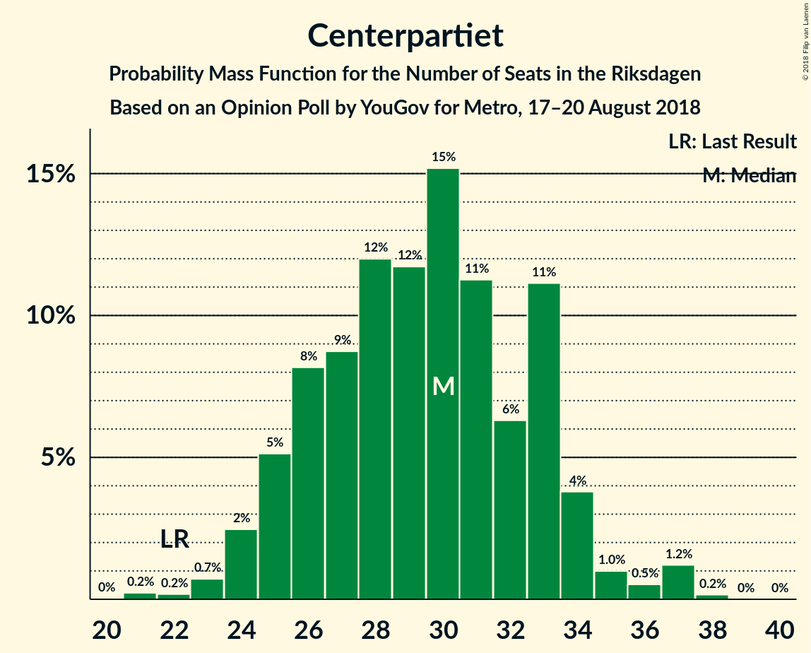
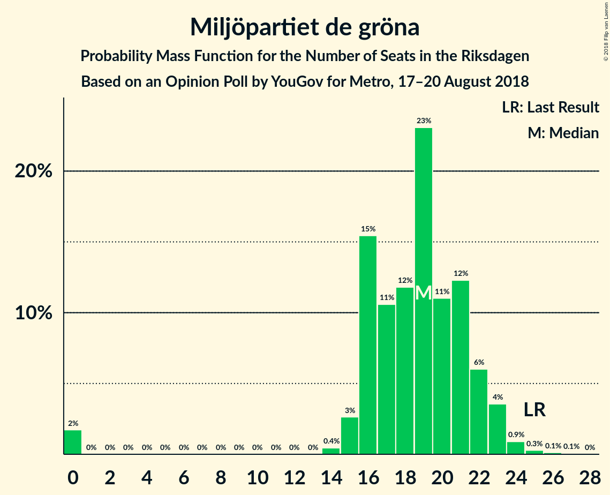
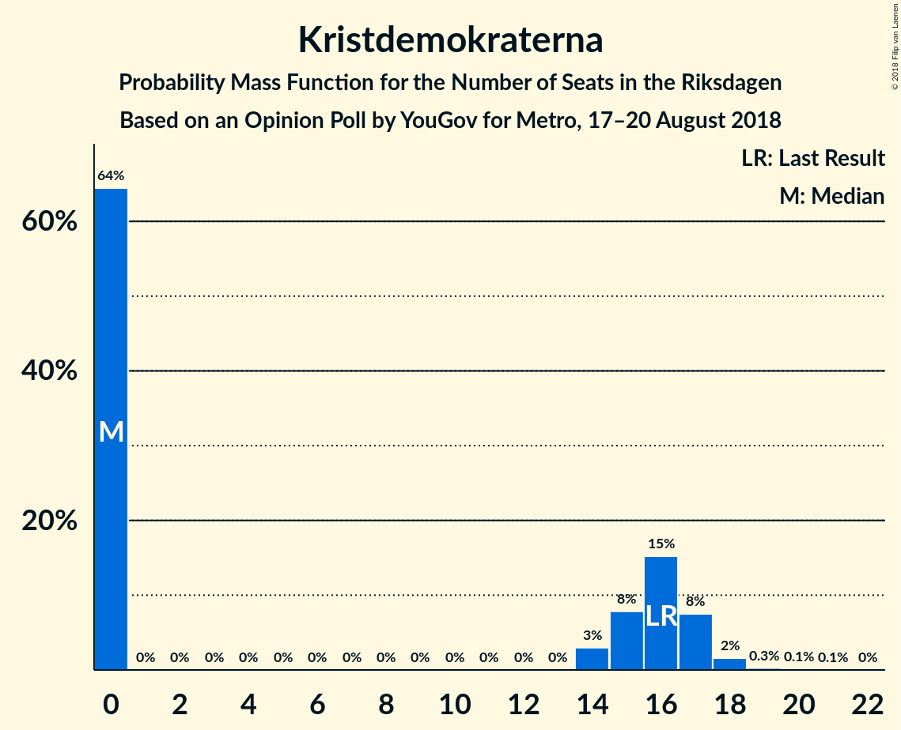

# Opinion Poll by YouGov for Metro, 17–20 August 2018

<a href="#voting-intentions">Voting Intentions</a> | <a href="#seats">Seats</a> | <a href="#coalitions">Coalitions</a> | <a href="#technical-information">Technical Information</a>

## Voting Intentions

### Confidence Intervals

| Party | Last Result | Poll Result | 80% Confidence Interval | 90% Confidence Interval | 95% Confidence Interval | 99% Confidence Interval |
|:-----:|:-----------:|:-----------:|:-----------------------:|:-----------------------:|:-----------------------:|:-----------------------:|
| Sverigedemokraterna | 12.9% | 24.2% | 22.8–25.6% |22.4–26.0% |22.1–26.4% |21.4–27.1% |
| Sveriges socialdemokratiska arbetareparti | 31.0% | 21.9% | 20.6–23.3% |20.2–23.7% |19.9–24.0% |19.3–24.7% |
| Moderata samlingspartiet | 23.3% | 15.8% | 14.6–17.1% |14.3–17.4% |14.0–17.7% |13.5–18.3% |
| Vänsterpartiet | 5.7% | 9.2% | 8.3–10.2% |8.0–10.5% |7.8–10.7% |7.4–11.2% |
| Centerpartiet | 6.1% | 7.9% | 7.1–8.9% |6.9–9.2% |6.7–9.4% |6.3–9.9% |
| Liberalerna | 5.4% | 5.3% | 4.6–6.1% |4.5–6.4% |4.3–6.6% |4.0–7.0% |
| Miljöpartiet de gröna | 6.9% | 5.1% | 4.5–5.9% |4.3–6.1% |4.1–6.3% |3.8–6.8% |
| Kristdemokraterna | 4.6% | 3.8% | 3.2–4.5% |3.1–4.7% |2.9–4.9% |2.7–5.2% |
| Feministiskt initiativ | 3.1% | 2.1% | 1.7–2.7% |1.6–2.8% |1.5–3.0% |1.3–3.2% |

*Note:* The poll result column reflects the actual value used in the calculations. Published results may vary slightly, and in addition be rounded to fewer digits.

## Seats

### Confidence Intervals

| Party | Last Result | Median | 80% Confidence Interval | 90% Confidence Interval | 95% Confidence Interval | 99% Confidence Interval |
|:-----:|:-----------:|:------:|:-----------------------:|:-----------------------:|:-----------------------:|:-----------------------:|
| <a href="#sverigedemokraterna">Sverigedemokraterna</a> | 49 | 94 | 82–94 |82–94 |82–94 |82–94 |
| <a href="#sveriges-socialdemokratiska-arbetareparti">Sveriges socialdemokratiska arbetareparti</a> | 113 | 70 | 70–79 |70–84 |70–84 |70–84 |
| <a href="#moderata-samlingspartiet">Moderata samlingspartiet</a> | 84 | 56 | 56–60 |55–68 |55–68 |55–68 |
| <a href="#vänsterpartiet">Vänsterpartiet</a> | 21 | 29 | 29–37 |29–39 |29–39 |29–39 |
| <a href="#centerpartiet">Centerpartiet</a> | 22 | 23 | 23–41 |23–41 |23–41 |23–41 |
| <a href="#liberalerna">Liberalerna</a> | 19 | 23 | 18–23 |17–23 |17–23 |17–23 |
| <a href="#miljöpartiet-de-gröna">Miljöpartiet de gröna</a> | 25 | 20 | 20 |15–21 |15–21 |15–23 |
| <a href="#kristdemokraterna">Kristdemokraterna</a> | 16 | 15 | 0–15 |0–19 |0–19 |0–19 |
| <a href="#feministiskt-initiativ">Feministiskt initiativ</a> | 0 | 0 | 0 |0 |0 |0 |

### Sverigedemokraterna

*For a full overview of the results for this party, see the [Sverigedemokraterna](party-sverigedemokraterna.html) page.*

| Number of Seats | Probability | Accumulated | Special Marks |
|:---------------:|:-----------:|:-----------:|:-------------:|
| 49 | 0% | 100% | Last Result |
| 50 | 0% | 100% |  |
| 51 | 0% | 100% |  |
| 52 | 0% | 100% |  |
| 53 | 0% | 100% |  |
| 54 | 0% | 100% |  |
| 55 | 0% | 100% |  |
| 56 | 0% | 100% |  |
| 57 | 0% | 100% |  |
| 58 | 0% | 100% |  |
| 59 | 0% | 100% |  |
| 60 | 0% | 100% |  |
| 61 | 0% | 100% |  |
| 62 | 0% | 100% |  |
| 63 | 0% | 100% |  |
| 64 | 0% | 100% |  |
| 65 | 0% | 100% |  |
| 66 | 0% | 100% |  |
| 67 | 0% | 100% |  |
| 68 | 0% | 100% |  |
| 69 | 0% | 100% |  |
| 70 | 0% | 100% |  |
| 71 | 0% | 100% |  |
| 72 | 0% | 100% |  |
| 73 | 0.1% | 100% |  |
| 74 | 0% | 99.9% |  |
| 75 | 0% | 99.9% |  |
| 76 | 0.1% | 99.9% |  |
| 77 | 0% | 99.8% |  |
| 78 | 0% | 99.8% |  |
| 79 | 0% | 99.8% |  |
| 80 | 0% | 99.8% |  |
| 81 | 0% | 99.8% |  |
| 82 | 15% | 99.8% |  |
| 83 | 24% | 85% |  |
| 84 | 0% | 61% |  |
| 85 | 0% | 61% |  |
| 86 | 0% | 61% |  |
| 87 | 6% | 61% |  |
| 88 | 0% | 55% |  |
| 89 | 0% | 55% |  |
| 90 | 0.2% | 55% |  |
| 91 | 0% | 55% |  |
| 92 | 0.6% | 55% |  |
| 93 | 0% | 54% |  |
| 94 | 54% | 54% | Median |
| 95 | 0% | 0.1% |  |
| 96 | 0% | 0% |  |

### Sveriges socialdemokratiska arbetareparti

*For a full overview of the results for this party, see the [Sveriges socialdemokratiska arbetareparti](party-sverigessocialdemokratiskaarbetareparti.html) page.*

| Number of Seats | Probability | Accumulated | Special Marks |
|:---------------:|:-----------:|:-----------:|:-------------:|
| 68 | 0.2% | 100% |  |
| 69 | 0% | 99.8% |  |
| 70 | 54% | 99.8% | Median |
| 71 | 9% | 46% |  |
| 72 | 0% | 36% |  |
| 73 | 5% | 36% |  |
| 74 | 0.7% | 31% |  |
| 75 | 0% | 30% |  |
| 76 | 0% | 30% |  |
| 77 | 0% | 30% |  |
| 78 | 0% | 30% |  |
| 79 | 24% | 30% |  |
| 80 | 0% | 6% |  |
| 81 | 0% | 6% |  |
| 82 | 0% | 6% |  |
| 83 | 0% | 6% |  |
| 84 | 6% | 6% |  |
| 85 | 0% | 0.1% |  |
| 86 | 0.1% | 0.1% |  |
| 87 | 0% | 0% |  |
| 88 | 0% | 0% |  |
| 89 | 0% | 0% |  |
| 90 | 0% | 0% |  |
| 91 | 0% | 0% |  |
| 92 | 0% | 0% |  |
| 93 | 0% | 0% |  |
| 94 | 0% | 0% |  |
| 95 | 0% | 0% |  |
| 96 | 0% | 0% |  |
| 97 | 0% | 0% |  |
| 98 | 0% | 0% |  |
| 99 | 0% | 0% |  |
| 100 | 0% | 0% |  |
| 101 | 0% | 0% |  |
| 102 | 0% | 0% |  |
| 103 | 0% | 0% |  |
| 104 | 0% | 0% |  |
| 105 | 0% | 0% |  |
| 106 | 0% | 0% |  |
| 107 | 0% | 0% |  |
| 108 | 0% | 0% |  |
| 109 | 0% | 0% |  |
| 110 | 0% | 0% |  |
| 111 | 0% | 0% |  |
| 112 | 0% | 0% |  |
| 113 | 0% | 0% | Last Result |

### Moderata samlingspartiet

*For a full overview of the results for this party, see the [Moderata samlingspartiet](party-moderatasamlingspartiet.html) page.*

| Number of Seats | Probability | Accumulated | Special Marks |
|:---------------:|:-----------:|:-----------:|:-------------:|
| 48 | 0.1% | 100% |  |
| 49 | 0% | 99.9% |  |
| 50 | 0% | 99.9% |  |
| 51 | 0% | 99.9% |  |
| 52 | 0% | 99.9% |  |
| 53 | 0% | 99.9% |  |
| 54 | 0% | 99.9% |  |
| 55 | 9% | 99.9% |  |
| 56 | 54% | 90% | Median |
| 57 | 5% | 36% |  |
| 58 | 0% | 31% |  |
| 59 | 0% | 31% |  |
| 60 | 24% | 31% |  |
| 61 | 0% | 7% |  |
| 62 | 0% | 7% |  |
| 63 | 0% | 7% |  |
| 64 | 0.2% | 7% |  |
| 65 | 0.6% | 7% |  |
| 66 | 0% | 6% |  |
| 67 | 0% | 6% |  |
| 68 | 6% | 6% |  |
| 69 | 0% | 0% |  |
| 70 | 0% | 0% |  |
| 71 | 0% | 0% |  |
| 72 | 0% | 0% |  |
| 73 | 0% | 0% |  |
| 74 | 0% | 0% |  |
| 75 | 0% | 0% |  |
| 76 | 0% | 0% |  |
| 77 | 0% | 0% |  |
| 78 | 0% | 0% |  |
| 79 | 0% | 0% |  |
| 80 | 0% | 0% |  |
| 81 | 0% | 0% |  |
| 82 | 0% | 0% |  |
| 83 | 0% | 0% |  |
| 84 | 0% | 0% | Last Result |

### Vänsterpartiet

*For a full overview of the results for this party, see the [Vänsterpartiet](party-vänsterpartiet.html) page.*

| Number of Seats | Probability | Accumulated | Special Marks |
|:---------------:|:-----------:|:-----------:|:-------------:|
| 21 | 0% | 100% | Last Result |
| 22 | 0% | 100% |  |
| 23 | 0% | 100% |  |
| 24 | 0% | 100% |  |
| 25 | 0% | 100% |  |
| 26 | 0% | 100% |  |
| 27 | 0% | 100% |  |
| 28 | 0% | 100% |  |
| 29 | 54% | 100% | Median |
| 30 | 0.6% | 46% |  |
| 31 | 0% | 45% |  |
| 32 | 24% | 45% |  |
| 33 | 0.1% | 21% |  |
| 34 | 0% | 21% |  |
| 35 | 0% | 21% |  |
| 36 | 6% | 21% |  |
| 37 | 5% | 15% |  |
| 38 | 0% | 10% |  |
| 39 | 10% | 10% |  |
| 40 | 0% | 0.1% |  |
| 41 | 0% | 0% |  |

### Centerpartiet

*For a full overview of the results for this party, see the [Centerpartiet](party-centerpartiet.html) page.*

| Number of Seats | Probability | Accumulated | Special Marks |
|:---------------:|:-----------:|:-----------:|:-------------:|
| 22 | 0% | 100% | Last Result |
| 23 | 54% | 100% | Median |
| 24 | 0% | 46% |  |
| 25 | 0.6% | 46% |  |
| 26 | 0% | 45% |  |
| 27 | 0% | 45% |  |
| 28 | 5% | 45% |  |
| 29 | 0.2% | 40% |  |
| 30 | 0% | 40% |  |
| 31 | 10% | 40% |  |
| 32 | 6% | 30% |  |
| 33 | 0% | 24% |  |
| 34 | 0% | 24% |  |
| 35 | 0% | 24% |  |
| 36 | 0% | 24% |  |
| 37 | 0% | 24% |  |
| 38 | 0% | 24% |  |
| 39 | 0% | 24% |  |
| 40 | 0% | 24% |  |
| 41 | 24% | 24% |  |
| 42 | 0% | 0% |  |

### Liberalerna

*For a full overview of the results for this party, see the [Liberalerna](party-liberalerna.html) page.*

| Number of Seats | Probability | Accumulated | Special Marks |
|:---------------:|:-----------:|:-----------:|:-------------:|
| 17 | 5% | 100% |  |
| 18 | 24% | 95% |  |
| 19 | 0% | 71% | Last Result |
| 20 | 0% | 71% |  |
| 21 | 16% | 71% |  |
| 22 | 0.6% | 55% |  |
| 23 | 54% | 54% | Median |
| 24 | 0% | 0.3% |  |
| 25 | 0% | 0.3% |  |
| 26 | 0.1% | 0.2% |  |
| 27 | 0.2% | 0.2% |  |
| 28 | 0% | 0% |  |

### Miljöpartiet de gröna

*For a full overview of the results for this party, see the [Miljöpartiet de gröna](party-miljöpartietdegröna.html) page.*

| Number of Seats | Probability | Accumulated | Special Marks |
|:---------------:|:-----------:|:-----------:|:-------------:|
| 15 | 9% | 100% |  |
| 16 | 0.1% | 91% |  |
| 17 | 0.2% | 90% |  |
| 18 | 0% | 90% |  |
| 19 | 0% | 90% |  |
| 20 | 83% | 90% | Median |
| 21 | 6% | 7% |  |
| 22 | 0.1% | 0.7% |  |
| 23 | 0.6% | 0.6% |  |
| 24 | 0% | 0.1% |  |
| 25 | 0% | 0% | Last Result |

### Kristdemokraterna

*For a full overview of the results for this party, see the [Kristdemokraterna](party-kristdemokraterna.html) page.*

| Number of Seats | Probability | Accumulated | Special Marks |
|:---------------:|:-----------:|:-----------:|:-------------:|
| 0 | 31% | 100% |  |
| 1 | 0% | 69% |  |
| 2 | 0% | 69% |  |
| 3 | 0% | 69% |  |
| 4 | 0% | 69% |  |
| 5 | 0% | 69% |  |
| 6 | 0% | 69% |  |
| 7 | 0% | 69% |  |
| 8 | 0% | 69% |  |
| 9 | 0% | 69% |  |
| 10 | 0% | 69% |  |
| 11 | 0% | 69% |  |
| 12 | 0% | 69% |  |
| 13 | 0% | 69% |  |
| 14 | 10% | 69% |  |
| 15 | 54% | 59% | Median |
| 16 | 0% | 5% | Last Result |
| 17 | 0% | 5% |  |
| 18 | 0% | 5% |  |
| 19 | 5% | 5% |  |
| 20 | 0.1% | 0.1% |  |
| 21 | 0% | 0% |  |

### Feministiskt initiativ

*For a full overview of the results for this party, see the [Feministiskt initiativ](party-feministisktinitiativ.html) page.*

| Number of Seats | Probability | Accumulated | Special Marks |
|:---------------:|:-----------:|:-----------:|:-------------:|
| 0 | 100% | 100% | Last Result, Median |

## Coalitions

### Confidence Intervals

| Coalition | Last Result | Median | Majority? | 80% Confidence Interval | 90% Confidence Interval | 95% Confidence Interval | 99% Confidence Interval |
|:---------:|:-----------:|:------:|:---------:|:-----------------------:|:-----------------------:|:-----------------------:|:-----------------------:|
| Sverigedemokraterna – Moderata samlingspartiet – Kristdemokraterna | 149 | 165 | 0% | 143–165 | 143–165 | 143–165 | 143–165 |
| Sverigedemokraterna – Moderata samlingspartiet | 133 | 150 | 0% | 139–150 | 137–155 | 137–155 | 137–157 |
| Sveriges socialdemokratiska arbetareparti – Moderata samlingspartiet | 197 | 126 | 0% | 126–139 | 126–152 | 126–152 | 126–152 |
| Sveriges socialdemokratiska arbetareparti – Vänsterpartiet – Miljöpartiet de gröna – Feministiskt initiativ | 159 | 119 | 0% | 119–131 | 119–141 | 119–141 | 119–141 |
| Sveriges socialdemokratiska arbetareparti – Vänsterpartiet – Miljöpartiet de gröna | 159 | 119 | 0% | 119–131 | 119–141 | 119–141 | 119–141 |
| Moderata samlingspartiet – Centerpartiet – Liberalerna – Kristdemokraterna | 141 | 117 | 0% | 117–121 | 117–121 | 117–121 | 112–121 |
| Moderata samlingspartiet – Centerpartiet – Liberalerna | 125 | 102 | 0% | 102–119 | 102–121 | 102–121 | 102–121 |
| Sveriges socialdemokratiska arbetareparti – Vänsterpartiet | 134 | 99 | 0% | 99–111 | 99–120 | 99–120 | 99–120 |
| Sveriges socialdemokratiska arbetareparti – Miljöpartiet de gröna | 138 | 90 | 0% | 90–99 | 86–105 | 86–105 | 86–105 |
| Moderata samlingspartiet – Centerpartiet – Kristdemokraterna | 122 | 94 | 0% | 94–101 | 94–104 | 94–104 | 90–104 |
| Moderata samlingspartiet – Centerpartiet | 106 | 79 | 0% | 79–101 | 79–101 | 79–101 | 79–101 |

### Sverigedemokraterna – Moderata samlingspartiet – Kristdemokraterna

| Number of Seats | Probability | Accumulated | Special Marks |
|:---------------:|:-----------:|:-----------:|:-------------:|
| 138 | 0.1% | 100% |  |
| 139 | 0% | 99.9% |  |
| 140 | 0% | 99.9% |  |
| 141 | 0% | 99.9% |  |
| 142 | 0% | 99.9% |  |
| 143 | 24% | 99.9% |  |
| 144 | 0% | 76% |  |
| 145 | 0% | 76% |  |
| 146 | 0% | 76% |  |
| 147 | 0% | 76% |  |
| 148 | 0% | 76% |  |
| 149 | 0% | 76% | Last Result |
| 150 | 0% | 76% |  |
| 151 | 9% | 76% |  |
| 152 | 0% | 66% |  |
| 153 | 0% | 66% |  |
| 154 | 0.2% | 66% |  |
| 155 | 6% | 66% |  |
| 156 | 0% | 60% |  |
| 157 | 0.6% | 60% |  |
| 158 | 5% | 59% |  |
| 159 | 0% | 54% |  |
| 160 | 0% | 54% |  |
| 161 | 0% | 54% |  |
| 162 | 0% | 54% |  |
| 163 | 0% | 54% |  |
| 164 | 0% | 54% |  |
| 165 | 54% | 54% | Median |
| 166 | 0% | 0% |  |

### Sverigedemokraterna – Moderata samlingspartiet

| Number of Seats | Probability | Accumulated | Special Marks |
|:---------------:|:-----------:|:-----------:|:-------------:|
| 124 | 0.1% | 100% |  |
| 125 | 0% | 99.9% |  |
| 126 | 0% | 99.9% |  |
| 127 | 0% | 99.9% |  |
| 128 | 0% | 99.9% |  |
| 129 | 0% | 99.9% |  |
| 130 | 0% | 99.9% |  |
| 131 | 0% | 99.9% |  |
| 132 | 0% | 99.9% |  |
| 133 | 0% | 99.9% | Last Result |
| 134 | 0% | 99.9% |  |
| 135 | 0% | 99.9% |  |
| 136 | 0% | 99.9% |  |
| 137 | 9% | 99.9% |  |
| 138 | 0.1% | 90% |  |
| 139 | 5% | 90% |  |
| 140 | 0% | 85% |  |
| 141 | 0% | 85% |  |
| 142 | 0% | 85% |  |
| 143 | 24% | 85% |  |
| 144 | 0% | 61% |  |
| 145 | 0% | 61% |  |
| 146 | 0% | 61% |  |
| 147 | 0% | 61% |  |
| 148 | 0% | 61% |  |
| 149 | 0% | 61% |  |
| 150 | 54% | 61% | Median |
| 151 | 0% | 7% |  |
| 152 | 0% | 7% |  |
| 153 | 0% | 7% |  |
| 154 | 0.2% | 7% |  |
| 155 | 6% | 7% |  |
| 156 | 0% | 0.6% |  |
| 157 | 0.6% | 0.6% |  |
| 158 | 0% | 0% |  |

### Sveriges socialdemokratiska arbetareparti – Moderata samlingspartiet

| Number of Seats | Probability | Accumulated | Special Marks |
|:---------------:|:-----------:|:-----------:|:-------------:|
| 126 | 64% | 100% | Median |
| 127 | 0% | 36% |  |
| 128 | 0% | 36% |  |
| 129 | 0% | 36% |  |
| 130 | 5% | 36% |  |
| 131 | 0% | 31% |  |
| 132 | 0.2% | 31% |  |
| 133 | 0% | 31% |  |
| 134 | 0.1% | 31% |  |
| 135 | 0% | 31% |  |
| 136 | 0% | 31% |  |
| 137 | 0% | 31% |  |
| 138 | 0% | 31% |  |
| 139 | 25% | 31% |  |
| 140 | 0% | 6% |  |
| 141 | 0% | 6% |  |
| 142 | 0% | 6% |  |
| 143 | 0% | 6% |  |
| 144 | 0% | 6% |  |
| 145 | 0% | 6% |  |
| 146 | 0% | 6% |  |
| 147 | 0% | 6% |  |
| 148 | 0% | 6% |  |
| 149 | 0% | 6% |  |
| 150 | 0% | 6% |  |
| 151 | 0% | 6% |  |
| 152 | 6% | 6% |  |
| 153 | 0% | 0% |  |
| 154 | 0% | 0% |  |
| 155 | 0% | 0% |  |
| 156 | 0% | 0% |  |
| 157 | 0% | 0% |  |
| 158 | 0% | 0% |  |
| 159 | 0% | 0% |  |
| 160 | 0% | 0% |  |
| 161 | 0% | 0% |  |
| 162 | 0% | 0% |  |
| 163 | 0% | 0% |  |
| 164 | 0% | 0% |  |
| 165 | 0% | 0% |  |
| 166 | 0% | 0% |  |
| 167 | 0% | 0% |  |
| 168 | 0% | 0% |  |
| 169 | 0% | 0% |  |
| 170 | 0% | 0% |  |
| 171 | 0% | 0% |  |
| 172 | 0% | 0% |  |
| 173 | 0% | 0% |  |
| 174 | 0% | 0% |  |
| 175 | 0% | 0% | Majority |
| 176 | 0% | 0% |  |
| 177 | 0% | 0% |  |
| 178 | 0% | 0% |  |
| 179 | 0% | 0% |  |
| 180 | 0% | 0% |  |
| 181 | 0% | 0% |  |
| 182 | 0% | 0% |  |
| 183 | 0% | 0% |  |
| 184 | 0% | 0% |  |
| 185 | 0% | 0% |  |
| 186 | 0% | 0% |  |
| 187 | 0% | 0% |  |
| 188 | 0% | 0% |  |
| 189 | 0% | 0% |  |
| 190 | 0% | 0% |  |
| 191 | 0% | 0% |  |
| 192 | 0% | 0% |  |
| 193 | 0% | 0% |  |
| 194 | 0% | 0% |  |
| 195 | 0% | 0% |  |
| 196 | 0% | 0% |  |
| 197 | 0% | 0% | Last Result |

### Sveriges socialdemokratiska arbetareparti – Vänsterpartiet – Miljöpartiet de gröna – Feministiskt initiativ

| Number of Seats | Probability | Accumulated | Special Marks |
|:---------------:|:-----------:|:-----------:|:-------------:|
| 119 | 54% | 100% | Median |
| 120 | 0% | 46% |  |
| 121 | 0% | 46% |  |
| 122 | 0.1% | 46% |  |
| 123 | 0% | 46% |  |
| 124 | 0.2% | 46% |  |
| 125 | 9% | 46% |  |
| 126 | 0% | 36% |  |
| 127 | 0.6% | 36% |  |
| 128 | 0% | 36% |  |
| 129 | 0% | 36% |  |
| 130 | 5% | 36% |  |
| 131 | 24% | 30% |  |
| 132 | 0% | 6% |  |
| 133 | 0% | 6% |  |
| 134 | 0% | 6% |  |
| 135 | 0% | 6% |  |
| 136 | 0% | 6% |  |
| 137 | 0% | 6% |  |
| 138 | 0% | 6% |  |
| 139 | 0% | 6% |  |
| 140 | 0% | 6% |  |
| 141 | 6% | 6% |  |
| 142 | 0% | 0% |  |
| 143 | 0% | 0% |  |
| 144 | 0% | 0% |  |
| 145 | 0% | 0% |  |
| 146 | 0% | 0% |  |
| 147 | 0% | 0% |  |
| 148 | 0% | 0% |  |
| 149 | 0% | 0% |  |
| 150 | 0% | 0% |  |
| 151 | 0% | 0% |  |
| 152 | 0% | 0% |  |
| 153 | 0% | 0% |  |
| 154 | 0% | 0% |  |
| 155 | 0% | 0% |  |
| 156 | 0% | 0% |  |
| 157 | 0% | 0% |  |
| 158 | 0% | 0% |  |
| 159 | 0% | 0% | Last Result |

### Sveriges socialdemokratiska arbetareparti – Vänsterpartiet – Miljöpartiet de gröna

| Number of Seats | Probability | Accumulated | Special Marks |
|:---------------:|:-----------:|:-----------:|:-------------:|
| 119 | 54% | 100% | Median |
| 120 | 0% | 46% |  |
| 121 | 0% | 46% |  |
| 122 | 0.1% | 46% |  |
| 123 | 0% | 46% |  |
| 124 | 0.2% | 46% |  |
| 125 | 9% | 46% |  |
| 126 | 0% | 36% |  |
| 127 | 0.6% | 36% |  |
| 128 | 0% | 36% |  |
| 129 | 0% | 36% |  |
| 130 | 5% | 36% |  |
| 131 | 24% | 30% |  |
| 132 | 0% | 6% |  |
| 133 | 0% | 6% |  |
| 134 | 0% | 6% |  |
| 135 | 0% | 6% |  |
| 136 | 0% | 6% |  |
| 137 | 0% | 6% |  |
| 138 | 0% | 6% |  |
| 139 | 0% | 6% |  |
| 140 | 0% | 6% |  |
| 141 | 6% | 6% |  |
| 142 | 0% | 0% |  |
| 143 | 0% | 0% |  |
| 144 | 0% | 0% |  |
| 145 | 0% | 0% |  |
| 146 | 0% | 0% |  |
| 147 | 0% | 0% |  |
| 148 | 0% | 0% |  |
| 149 | 0% | 0% |  |
| 150 | 0% | 0% |  |
| 151 | 0% | 0% |  |
| 152 | 0% | 0% |  |
| 153 | 0% | 0% |  |
| 154 | 0% | 0% |  |
| 155 | 0% | 0% |  |
| 156 | 0% | 0% |  |
| 157 | 0% | 0% |  |
| 158 | 0% | 0% |  |
| 159 | 0% | 0% | Last Result |

### Moderata samlingspartiet – Centerpartiet – Liberalerna – Kristdemokraterna

| Number of Seats | Probability | Accumulated | Special Marks |
|:---------------:|:-----------:|:-----------:|:-------------:|
| 104 | 0% | 100% |  |
| 105 | 0% | 99.9% |  |
| 106 | 0% | 99.9% |  |
| 107 | 0% | 99.9% |  |
| 108 | 0% | 99.9% |  |
| 109 | 0% | 99.9% |  |
| 110 | 0% | 99.9% |  |
| 111 | 0% | 99.9% |  |
| 112 | 0.6% | 99.9% |  |
| 113 | 0.1% | 99.3% |  |
| 114 | 0% | 99.2% |  |
| 115 | 0% | 99.2% |  |
| 116 | 0% | 99.2% |  |
| 117 | 54% | 99.2% | Median |
| 118 | 0% | 45% |  |
| 119 | 24% | 45% |  |
| 120 | 0.2% | 21% |  |
| 121 | 21% | 21% |  |
| 122 | 0% | 0.1% |  |
| 123 | 0% | 0.1% |  |
| 124 | 0% | 0.1% |  |
| 125 | 0% | 0.1% |  |
| 126 | 0% | 0.1% |  |
| 127 | 0% | 0.1% |  |
| 128 | 0% | 0.1% |  |
| 129 | 0% | 0.1% |  |
| 130 | 0% | 0.1% |  |
| 131 | 0% | 0.1% |  |
| 132 | 0% | 0.1% |  |
| 133 | 0% | 0.1% |  |
| 134 | 0% | 0.1% |  |
| 135 | 0% | 0.1% |  |
| 136 | 0% | 0.1% |  |
| 137 | 0.1% | 0.1% |  |
| 138 | 0% | 0% |  |
| 139 | 0% | 0% |  |
| 140 | 0% | 0% |  |
| 141 | 0% | 0% | Last Result |

### Moderata samlingspartiet – Centerpartiet – Liberalerna

| Number of Seats | Probability | Accumulated | Special Marks |
|:---------------:|:-----------:|:-----------:|:-------------:|
| 99 | 0.1% | 100% |  |
| 100 | 0% | 99.9% |  |
| 101 | 0% | 99.9% |  |
| 102 | 59% | 99.9% | Median |
| 103 | 0% | 41% |  |
| 104 | 0% | 41% |  |
| 105 | 0% | 41% |  |
| 106 | 0% | 41% |  |
| 107 | 9% | 41% |  |
| 108 | 0% | 31% |  |
| 109 | 0.1% | 31% |  |
| 110 | 0% | 31% |  |
| 111 | 0% | 31% |  |
| 112 | 0.6% | 31% |  |
| 113 | 0% | 30% |  |
| 114 | 0% | 30% |  |
| 115 | 0% | 30% |  |
| 116 | 0% | 30% |  |
| 117 | 0.1% | 30% |  |
| 118 | 0% | 30% |  |
| 119 | 24% | 30% |  |
| 120 | 0.2% | 6% |  |
| 121 | 6% | 6% |  |
| 122 | 0% | 0% |  |
| 123 | 0% | 0% |  |
| 124 | 0% | 0% |  |
| 125 | 0% | 0% | Last Result |

### Sveriges socialdemokratiska arbetareparti – Vänsterpartiet

| Number of Seats | Probability | Accumulated | Special Marks |
|:---------------:|:-----------:|:-----------:|:-------------:|
| 99 | 54% | 100% | Median |
| 100 | 0% | 46% |  |
| 101 | 0% | 46% |  |
| 102 | 0% | 46% |  |
| 103 | 0% | 46% |  |
| 104 | 0.6% | 46% |  |
| 105 | 0% | 45% |  |
| 106 | 0.1% | 45% |  |
| 107 | 0.2% | 45% |  |
| 108 | 0% | 45% |  |
| 109 | 0% | 45% |  |
| 110 | 15% | 45% |  |
| 111 | 24% | 30% |  |
| 112 | 0% | 6% |  |
| 113 | 0% | 6% |  |
| 114 | 0% | 6% |  |
| 115 | 0% | 6% |  |
| 116 | 0% | 6% |  |
| 117 | 0% | 6% |  |
| 118 | 0% | 6% |  |
| 119 | 0.1% | 6% |  |
| 120 | 6% | 6% |  |
| 121 | 0% | 0.1% |  |
| 122 | 0% | 0.1% |  |
| 123 | 0% | 0% |  |
| 124 | 0% | 0% |  |
| 125 | 0% | 0% |  |
| 126 | 0% | 0% |  |
| 127 | 0% | 0% |  |
| 128 | 0% | 0% |  |
| 129 | 0% | 0% |  |
| 130 | 0% | 0% |  |
| 131 | 0% | 0% |  |
| 132 | 0% | 0% |  |
| 133 | 0% | 0% |  |
| 134 | 0% | 0% | Last Result |

### Sveriges socialdemokratiska arbetareparti – Miljöpartiet de gröna

| Number of Seats | Probability | Accumulated | Special Marks |
|:---------------:|:-----------:|:-----------:|:-------------:|
| 85 | 0.2% | 100% |  |
| 86 | 9% | 99.8% |  |
| 87 | 0% | 90% |  |
| 88 | 0% | 90% |  |
| 89 | 0% | 90% |  |
| 90 | 54% | 90% | Median |
| 91 | 0% | 36% |  |
| 92 | 0% | 36% |  |
| 93 | 5% | 36% |  |
| 94 | 0% | 31% |  |
| 95 | 0% | 31% |  |
| 96 | 0% | 31% |  |
| 97 | 0.6% | 31% |  |
| 98 | 0% | 30% |  |
| 99 | 24% | 30% |  |
| 100 | 0% | 6% |  |
| 101 | 0% | 6% |  |
| 102 | 0% | 6% |  |
| 103 | 0% | 6% |  |
| 104 | 0% | 6% |  |
| 105 | 6% | 6% |  |
| 106 | 0% | 0.1% |  |
| 107 | 0% | 0.1% |  |
| 108 | 0.1% | 0.1% |  |
| 109 | 0% | 0% |  |
| 110 | 0% | 0% |  |
| 111 | 0% | 0% |  |
| 112 | 0% | 0% |  |
| 113 | 0% | 0% |  |
| 114 | 0% | 0% |  |
| 115 | 0% | 0% |  |
| 116 | 0% | 0% |  |
| 117 | 0% | 0% |  |
| 118 | 0% | 0% |  |
| 119 | 0% | 0% |  |
| 120 | 0% | 0% |  |
| 121 | 0% | 0% |  |
| 122 | 0% | 0% |  |
| 123 | 0% | 0% |  |
| 124 | 0% | 0% |  |
| 125 | 0% | 0% |  |
| 126 | 0% | 0% |  |
| 127 | 0% | 0% |  |
| 128 | 0% | 0% |  |
| 129 | 0% | 0% |  |
| 130 | 0% | 0% |  |
| 131 | 0% | 0% |  |
| 132 | 0% | 0% |  |
| 133 | 0% | 0% |  |
| 134 | 0% | 0% |  |
| 135 | 0% | 0% |  |
| 136 | 0% | 0% |  |
| 137 | 0% | 0% |  |
| 138 | 0% | 0% | Last Result |

### Moderata samlingspartiet – Centerpartiet – Kristdemokraterna

| Number of Seats | Probability | Accumulated | Special Marks |
|:---------------:|:-----------:|:-----------:|:-------------:|
| 84 | 0% | 100% |  |
| 85 | 0% | 99.9% |  |
| 86 | 0% | 99.9% |  |
| 87 | 0.1% | 99.9% |  |
| 88 | 0% | 99.9% |  |
| 89 | 0% | 99.9% |  |
| 90 | 0.6% | 99.9% |  |
| 91 | 0% | 99.3% |  |
| 92 | 0.1% | 99.3% |  |
| 93 | 0.2% | 99.2% |  |
| 94 | 54% | 99.1% | Median |
| 95 | 0% | 45% |  |
| 96 | 0% | 45% |  |
| 97 | 0% | 45% |  |
| 98 | 0% | 45% |  |
| 99 | 0% | 45% |  |
| 100 | 16% | 45% |  |
| 101 | 24% | 29% |  |
| 102 | 0% | 5% |  |
| 103 | 0% | 5% |  |
| 104 | 5% | 5% |  |
| 105 | 0% | 0.1% |  |
| 106 | 0% | 0.1% |  |
| 107 | 0% | 0.1% |  |
| 108 | 0% | 0.1% |  |
| 109 | 0% | 0.1% |  |
| 110 | 0% | 0.1% |  |
| 111 | 0% | 0.1% |  |
| 112 | 0% | 0.1% |  |
| 113 | 0% | 0.1% |  |
| 114 | 0% | 0.1% |  |
| 115 | 0% | 0.1% |  |
| 116 | 0.1% | 0.1% |  |
| 117 | 0% | 0% |  |
| 118 | 0% | 0% |  |
| 119 | 0% | 0% |  |
| 120 | 0% | 0% |  |
| 121 | 0% | 0% |  |
| 122 | 0% | 0% | Last Result |

### Moderata samlingspartiet – Centerpartiet

| Number of Seats | Probability | Accumulated | Special Marks |
|:---------------:|:-----------:|:-----------:|:-------------:|
| 73 | 0.1% | 100% |  |
| 74 | 0% | 99.9% |  |
| 75 | 0% | 99.9% |  |
| 76 | 0% | 99.9% |  |
| 77 | 0% | 99.9% |  |
| 78 | 0% | 99.9% |  |
| 79 | 54% | 99.9% | Median |
| 80 | 0% | 46% |  |
| 81 | 0% | 46% |  |
| 82 | 0% | 46% |  |
| 83 | 0% | 46% |  |
| 84 | 0% | 46% |  |
| 85 | 5% | 46% |  |
| 86 | 9% | 41% |  |
| 87 | 0% | 31% |  |
| 88 | 0% | 31% |  |
| 89 | 0% | 31% |  |
| 90 | 0.6% | 31% |  |
| 91 | 0% | 30% |  |
| 92 | 0.1% | 30% |  |
| 93 | 0.2% | 30% |  |
| 94 | 0% | 30% |  |
| 95 | 0% | 30% |  |
| 96 | 0.1% | 30% |  |
| 97 | 0% | 30% |  |
| 98 | 0% | 30% |  |
| 99 | 0% | 30% |  |
| 100 | 6% | 30% |  |
| 101 | 24% | 24% |  |
| 102 | 0% | 0% |  |
| 103 | 0% | 0% |  |
| 104 | 0% | 0% |  |
| 105 | 0% | 0% |  |
| 106 | 0% | 0% | Last Result |

## Technical Information

### Opinion Poll

+ **Polling firm:** YouGov
+ **Commissioner(s):** Metro
+ **Fieldwork period:** 17–20 August 2018

### Calculations

+ **Sample size:** 1526
+ **Simulations done:** 1,024
+ **Error estimate:** 2.16%

