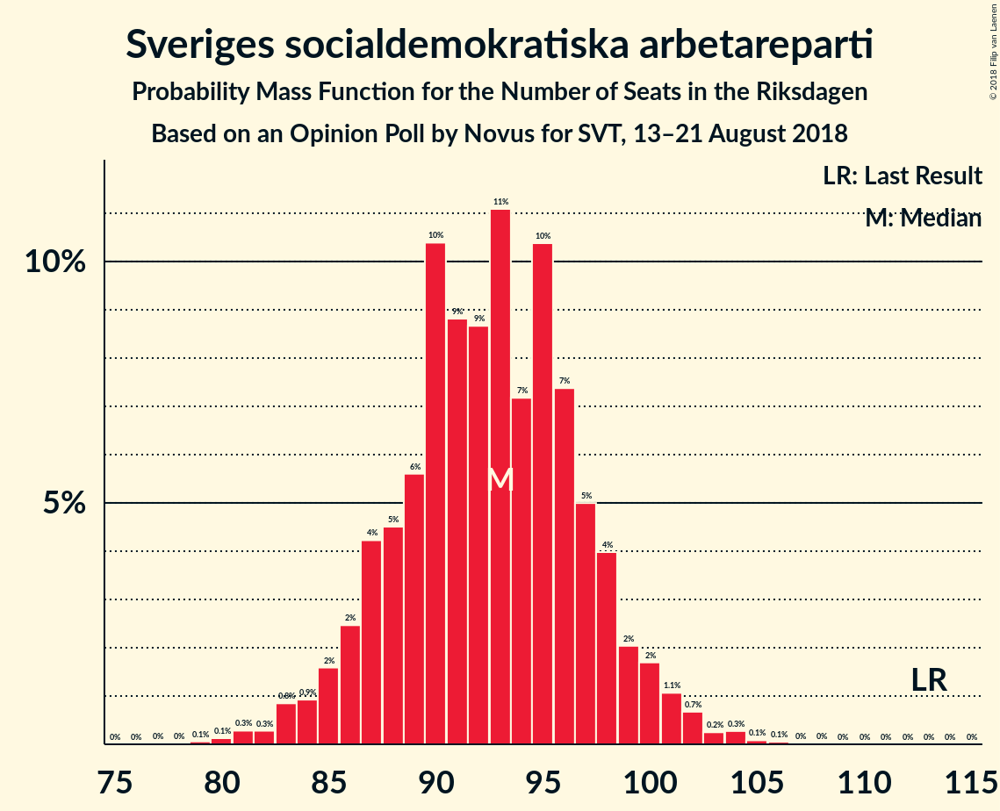
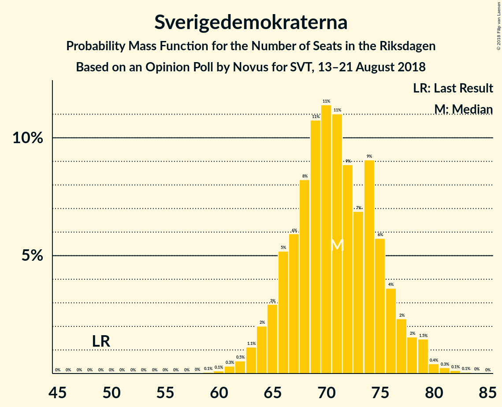

# Opinion Poll by Novus for SVT, 13–21 August 2018

<a href="#voting-intentions">Voting Intentions</a> | <a href="#seats">Seats</a> | <a href="#coalitions">Coalitions</a> | <a href="#technical-information">Technical Information</a>

## Voting Intentions

### Confidence Intervals

| Party | Last Result | Poll Result | 80% Confidence Interval | 90% Confidence Interval | 95% Confidence Interval | 99% Confidence Interval |
|:-----:|:-----------:|:-----------:|:-----------------------:|:-----------------------:|:-----------------------:|:-----------------------:|
| Sveriges socialdemokratiska arbetareparti | 31.0% | 25.1% | 23.8–26.5% |23.4–26.9% |23.1–27.2% |22.4–27.9% |
| Moderata samlingspartiet | 23.3% | 19.3% | 18.1–20.6% |17.8–21.0% |17.5–21.3% |16.9–21.9% |
| Sverigedemokraterna | 12.9% | 19.2% | 18.0–20.5% |17.6–20.9% |17.4–21.2% |16.8–21.8% |
| Centerpartiet | 6.1% | 10.0% | 9.1–11.0% |8.8–11.3% |8.6–11.5% |8.2–12.0% |
| Vänsterpartiet | 5.7% | 8.7% | 7.9–9.7% |7.7–10.0% |7.5–10.2% |7.1–10.7% |
| Miljöpartiet de gröna | 6.9% | 6.2% | 5.5–7.0% |5.3–7.3% |5.1–7.5% |4.8–7.9% |
| Liberalerna | 5.4% | 5.3% | 4.6–6.1% |4.5–6.3% |4.3–6.5% |4.0–6.9% |
| Kristdemokraterna | 4.6% | 3.5% | 3.0–4.1% |2.8–4.3% |2.7–4.5% |2.5–4.8% |

*Note:* The poll result column reflects the actual value used in the calculations. Published results may vary slightly, and in addition be rounded to fewer digits.

## Seats

### Confidence Intervals

| Party | Last Result | Median | 80% Confidence Interval | 90% Confidence Interval | 95% Confidence Interval | 99% Confidence Interval |
|:-----:|:-----------:|:------:|:-----------------------:|:-----------------------:|:-----------------------:|:-----------------------:|
| <a href="#sveriges-socialdemokratiska-arbetareparti">Sveriges socialdemokratiska arbetareparti</a> | 113 | 85 | 85 |85 |85–93 |81–103 |
| <a href="#moderata-samlingspartiet">Moderata samlingspartiet</a> | 84 | 65 | 65–71 |65–71 |65–73 |65–78 |
| <a href="#sverigedemokraterna">Sverigedemokraterna</a> | 49 | 74 | 72–74 |72–74 |65–74 |65–74 |
| <a href="#centerpartiet">Centerpartiet</a> | 22 | 37 | 37 |33–37 |33–37 |33–41 |
| <a href="#vänsterpartiet">Vänsterpartiet</a> | 21 | 34 | 32–34 |29–34 |29–34 |25–34 |
| <a href="#miljöpartiet-de-gröna">Miljöpartiet de gröna</a> | 25 | 24 | 24 |24–29 |22–29 |19–29 |
| <a href="#liberalerna">Liberalerna</a> | 19 | 15 | 15–16 |15–17 |15–18 |15–21 |
| <a href="#kristdemokraterna">Kristdemokraterna</a> | 16 | 15 | 15 |14–15 |14–16 |0–16 |

### Sveriges socialdemokratiska arbetareparti

*For a full overview of the results for this party, see the [Sveriges socialdemokratiska arbetareparti](party-sverigessocialdemokratiskaarbetareparti.html) page.*

| Number of Seats | Probability | Accumulated | Special Marks |
|:---------------:|:-----------:|:-----------:|:-------------:|
| 81 | 2% | 100% |  |
| 82 | 0% | 98% |  |
| 83 | 0% | 98% |  |
| 84 | 0.2% | 98% |  |
| 85 | 95% | 98% | Median |
| 86 | 0% | 3% |  |
| 87 | 0.2% | 3% |  |
| 88 | 0.1% | 3% |  |
| 89 | 0.2% | 3% |  |
| 90 | 0% | 3% |  |
| 91 | 0% | 3% |  |
| 92 | 0% | 3% |  |
| 93 | 2% | 3% |  |
| 94 | 0% | 1.2% |  |
| 95 | 0.2% | 1.2% |  |
| 96 | 0% | 1.1% |  |
| 97 | 0.1% | 1.0% |  |
| 98 | 0% | 1.0% |  |
| 99 | 0% | 1.0% |  |
| 100 | 0% | 1.0% |  |
| 101 | 0% | 1.0% |  |
| 102 | 0% | 1.0% |  |
| 103 | 1.0% | 1.0% |  |
| 104 | 0% | 0% |  |
| 105 | 0% | 0% |  |
| 106 | 0% | 0% |  |
| 107 | 0% | 0% |  |
| 108 | 0% | 0% |  |
| 109 | 0% | 0% |  |
| 110 | 0% | 0% |  |
| 111 | 0% | 0% |  |
| 112 | 0% | 0% |  |
| 113 | 0% | 0% | Last Result |

### Moderata samlingspartiet

*For a full overview of the results for this party, see the [Moderata samlingspartiet](party-moderatasamlingspartiet.html) page.*

| Number of Seats | Probability | Accumulated | Special Marks |
|:---------------:|:-----------:|:-----------:|:-------------:|
| 57 | 0.1% | 100% |  |
| 58 | 0% | 99.9% |  |
| 59 | 0% | 99.9% |  |
| 60 | 0% | 99.9% |  |
| 61 | 0% | 99.9% |  |
| 62 | 0.1% | 99.9% |  |
| 63 | 0% | 99.9% |  |
| 64 | 0% | 99.9% |  |
| 65 | 88% | 99.8% | Median |
| 66 | 1.0% | 11% |  |
| 67 | 0% | 10% |  |
| 68 | 0% | 10% |  |
| 69 | 0.2% | 10% |  |
| 70 | 0.2% | 10% |  |
| 71 | 6% | 10% |  |
| 72 | 0% | 4% |  |
| 73 | 2% | 4% |  |
| 74 | 0% | 2% |  |
| 75 | 0% | 2% |  |
| 76 | 0% | 2% |  |
| 77 | 0% | 2% |  |
| 78 | 2% | 2% |  |
| 79 | 0% | 0% |  |
| 80 | 0% | 0% |  |
| 81 | 0% | 0% |  |
| 82 | 0% | 0% |  |
| 83 | 0% | 0% |  |
| 84 | 0% | 0% | Last Result |

### Sverigedemokraterna

*For a full overview of the results for this party, see the [Sverigedemokraterna](party-sverigedemokraterna.html) page.*

| Number of Seats | Probability | Accumulated | Special Marks |
|:---------------:|:-----------:|:-----------:|:-------------:|
| 49 | 0% | 100% | Last Result |
| 50 | 0% | 100% |  |
| 51 | 0% | 100% |  |
| 52 | 0% | 100% |  |
| 53 | 0% | 100% |  |
| 54 | 0% | 100% |  |
| 55 | 0% | 100% |  |
| 56 | 0% | 100% |  |
| 57 | 0% | 100% |  |
| 58 | 0% | 100% |  |
| 59 | 0% | 100% |  |
| 60 | 0% | 100% |  |
| 61 | 0% | 100% |  |
| 62 | 0% | 100% |  |
| 63 | 0% | 100% |  |
| 64 | 0% | 100% |  |
| 65 | 3% | 100% |  |
| 66 | 0% | 97% |  |
| 67 | 0% | 97% |  |
| 68 | 2% | 97% |  |
| 69 | 0.2% | 95% |  |
| 70 | 0% | 95% |  |
| 71 | 0.1% | 95% |  |
| 72 | 6% | 95% |  |
| 73 | 0.1% | 89% |  |
| 74 | 88% | 89% | Median |
| 75 | 0% | 0.4% |  |
| 76 | 0% | 0.4% |  |
| 77 | 0% | 0.4% |  |
| 78 | 0.1% | 0.4% |  |
| 79 | 0% | 0.2% |  |
| 80 | 0% | 0.2% |  |
| 81 | 0% | 0.2% |  |
| 82 | 0% | 0.2% |  |
| 83 | 0% | 0.2% |  |
| 84 | 0% | 0.2% |  |
| 85 | 0.2% | 0.2% |  |
| 86 | 0% | 0% |  |

### Centerpartiet

*For a full overview of the results for this party, see the [Centerpartiet](party-centerpartiet.html) page.*

| Number of Seats | Probability | Accumulated | Special Marks |
|:---------------:|:-----------:|:-----------:|:-------------:|
| 22 | 0% | 100% | Last Result |
| 23 | 0% | 100% |  |
| 24 | 0% | 100% |  |
| 25 | 0% | 100% |  |
| 26 | 0% | 100% |  |
| 27 | 0% | 100% |  |
| 28 | 0% | 100% |  |
| 29 | 0% | 100% |  |
| 30 | 0% | 100% |  |
| 31 | 0.2% | 100% |  |
| 32 | 0% | 99.8% |  |
| 33 | 6% | 99.8% |  |
| 34 | 2% | 94% |  |
| 35 | 0.1% | 92% |  |
| 36 | 0.4% | 92% |  |
| 37 | 90% | 91% | Median |
| 38 | 0% | 1.2% |  |
| 39 | 0.1% | 1.2% |  |
| 40 | 0.1% | 1.1% |  |
| 41 | 1.0% | 1.0% |  |
| 42 | 0% | 0% |  |

### Vänsterpartiet

*For a full overview of the results for this party, see the [Vänsterpartiet](party-vänsterpartiet.html) page.*

| Number of Seats | Probability | Accumulated | Special Marks |
|:---------------:|:-----------:|:-----------:|:-------------:|
| 21 | 0% | 100% | Last Result |
| 22 | 0% | 100% |  |
| 23 | 0% | 100% |  |
| 24 | 0% | 100% |  |
| 25 | 2% | 100% |  |
| 26 | 0.2% | 98% |  |
| 27 | 0% | 98% |  |
| 28 | 0% | 98% |  |
| 29 | 6% | 98% |  |
| 30 | 0.2% | 92% |  |
| 31 | 1.0% | 92% |  |
| 32 | 1.1% | 91% |  |
| 33 | 0.8% | 90% |  |
| 34 | 88% | 89% | Median |
| 35 | 0% | 0.2% |  |
| 36 | 0% | 0.2% |  |
| 37 | 0.2% | 0.2% |  |
| 38 | 0% | 0% |  |

### Miljöpartiet de gröna

*For a full overview of the results for this party, see the [Miljöpartiet de gröna](party-miljöpartietdegröna.html) page.*

| Number of Seats | Probability | Accumulated | Special Marks |
|:---------------:|:-----------:|:-----------:|:-------------:|
| 0 | 0.1% | 100% |  |
| 1 | 0% | 99.9% |  |
| 2 | 0% | 99.9% |  |
| 3 | 0% | 99.9% |  |
| 4 | 0% | 99.9% |  |
| 5 | 0% | 99.9% |  |
| 6 | 0% | 99.9% |  |
| 7 | 0% | 99.9% |  |
| 8 | 0% | 99.9% |  |
| 9 | 0% | 99.9% |  |
| 10 | 0% | 99.9% |  |
| 11 | 0% | 99.9% |  |
| 12 | 0% | 99.9% |  |
| 13 | 0% | 99.9% |  |
| 14 | 0% | 99.9% |  |
| 15 | 0% | 99.9% |  |
| 16 | 0% | 99.9% |  |
| 17 | 0% | 99.9% |  |
| 18 | 0% | 99.9% |  |
| 19 | 2% | 99.9% |  |
| 20 | 0.2% | 98% |  |
| 21 | 0.2% | 98% |  |
| 22 | 2% | 98% |  |
| 23 | 0.1% | 96% |  |
| 24 | 88% | 96% | Median |
| 25 | 1.1% | 7% | Last Result |
| 26 | 0% | 6% |  |
| 27 | 0% | 6% |  |
| 28 | 0% | 6% |  |
| 29 | 6% | 6% |  |
| 30 | 0% | 0% |  |

### Liberalerna

*For a full overview of the results for this party, see the [Liberalerna](party-liberalerna.html) page.*

| Number of Seats | Probability | Accumulated | Special Marks |
|:---------------:|:-----------:|:-----------:|:-------------:|
| 15 | 89% | 100% | Median |
| 16 | 6% | 11% |  |
| 17 | 0.8% | 5% |  |
| 18 | 2% | 4% |  |
| 19 | 0.3% | 2% | Last Result |
| 20 | 0% | 2% |  |
| 21 | 2% | 2% |  |
| 22 | 0% | 0.4% |  |
| 23 | 0.2% | 0.4% |  |
| 24 | 0% | 0.2% |  |
| 25 | 0% | 0.2% |  |
| 26 | 0% | 0.2% |  |
| 27 | 0% | 0.2% |  |
| 28 | 0.2% | 0.2% |  |
| 29 | 0% | 0% |  |

### Kristdemokraterna

*For a full overview of the results for this party, see the [Kristdemokraterna](party-kristdemokraterna.html) page.*

| Number of Seats | Probability | Accumulated | Special Marks |
|:---------------:|:-----------:|:-----------:|:-------------:|
| 0 | 2% | 100% |  |
| 1 | 0% | 98% |  |
| 2 | 0% | 98% |  |
| 3 | 0% | 98% |  |
| 4 | 0% | 98% |  |
| 5 | 0% | 98% |  |
| 6 | 0% | 98% |  |
| 7 | 0% | 98% |  |
| 8 | 0% | 98% |  |
| 9 | 0% | 98% |  |
| 10 | 0% | 98% |  |
| 11 | 0% | 98% |  |
| 12 | 0% | 98% |  |
| 13 | 0% | 98% |  |
| 14 | 6% | 98% |  |
| 15 | 89% | 92% | Median |
| 16 | 4% | 4% | Last Result |
| 17 | 0.1% | 0.1% |  |
| 18 | 0% | 0% |  |

## Coalitions

### Confidence Intervals

| Coalition | Last Result | Median | Majority? | 80% Confidence Interval | 90% Confidence Interval | 95% Confidence Interval | 99% Confidence Interval |
|:---------:|:-----------:|:------:|:---------:|:-----------------------:|:-----------------------:|:-----------------------:|:-----------------------:|
| Sveriges socialdemokratiska arbetareparti – Moderata samlingspartiet | 197 | 150 | 0% | 150–156 | 150–157 | 150–166 | 150–169 |
| Moderata samlingspartiet – Sverigedemokraterna – Kristdemokraterna | 149 | 154 | 0% | 154–157 | 154–157 | 154–157 | 131–159 |
| Moderata samlingspartiet – Centerpartiet – Liberalerna – Kristdemokraterna | 141 | 132 | 0% | 132 | 132–134 | 132–144 | 125–149 |
| Moderata samlingspartiet – Sverigedemokraterna | 133 | 139 | 0% | 139–141 | 139–143 | 139–143 | 131–143 |
| Sveriges socialdemokratiska arbetareparti – Vänsterpartiet – Miljöpartiet de gröna | 159 | 143 | 0% | 143 | 143 | 137–143 | 135–159 |
| Moderata samlingspartiet – Centerpartiet – Liberalerna | 125 | 117 | 0% | 117–120 | 117–125 | 117–128 | 117–133 |
| Moderata samlingspartiet – Centerpartiet – Kristdemokraterna | 122 | 117 | 0% | 117 | 117–118 | 117–123 | 107–131 |
| Sveriges socialdemokratiska arbetareparti – Vänsterpartiet | 134 | 119 | 0% | 118–119 | 114–119 | 114–119 | 113–134 |
| Sveriges socialdemokratiska arbetareparti – Miljöpartiet de gröna | 138 | 109 | 0% | 109 | 109–114 | 109–114 | 103–128 |
| Moderata samlingspartiet – Centerpartiet | 106 | 102 | 0% | 102–104 | 102–104 | 102–107 | 102–115 |

### Sveriges socialdemokratiska arbetareparti – Moderata samlingspartiet

| Number of Seats | Probability | Accumulated | Special Marks |
|:---------------:|:-----------:|:-----------:|:-------------:|
| 143 | 0.1% | 100% |  |
| 144 | 0% | 99.9% |  |
| 145 | 0.1% | 99.9% |  |
| 146 | 0% | 99.9% |  |
| 147 | 0% | 99.9% |  |
| 148 | 0% | 99.9% |  |
| 149 | 0% | 99.9% |  |
| 150 | 88% | 99.9% | Median |
| 151 | 0% | 11% |  |
| 152 | 0% | 11% |  |
| 153 | 0% | 11% |  |
| 154 | 0% | 11% |  |
| 155 | 0.2% | 11% |  |
| 156 | 6% | 11% |  |
| 157 | 0.1% | 5% |  |
| 158 | 0% | 5% |  |
| 159 | 2% | 5% |  |
| 160 | 0% | 3% |  |
| 161 | 0% | 3% |  |
| 162 | 0.2% | 3% |  |
| 163 | 0% | 3% |  |
| 164 | 0.2% | 3% |  |
| 165 | 0% | 3% |  |
| 166 | 2% | 3% |  |
| 167 | 0.1% | 1.1% |  |
| 168 | 0% | 1.0% |  |
| 169 | 1.0% | 1.0% |  |
| 170 | 0% | 0% |  |
| 171 | 0% | 0% |  |
| 172 | 0% | 0% |  |
| 173 | 0% | 0% |  |
| 174 | 0% | 0% |  |
| 175 | 0% | 0% | Majority |
| 176 | 0% | 0% |  |
| 177 | 0% | 0% |  |
| 178 | 0% | 0% |  |
| 179 | 0% | 0% |  |
| 180 | 0% | 0% |  |
| 181 | 0% | 0% |  |
| 182 | 0% | 0% |  |
| 183 | 0% | 0% |  |
| 184 | 0% | 0% |  |
| 185 | 0% | 0% |  |
| 186 | 0% | 0% |  |
| 187 | 0% | 0% |  |
| 188 | 0% | 0% |  |
| 189 | 0% | 0% |  |
| 190 | 0% | 0% |  |
| 191 | 0% | 0% |  |
| 192 | 0% | 0% |  |
| 193 | 0% | 0% |  |
| 194 | 0% | 0% |  |
| 195 | 0% | 0% |  |
| 196 | 0% | 0% |  |
| 197 | 0% | 0% | Last Result |

### Moderata samlingspartiet – Sverigedemokraterna – Kristdemokraterna

| Number of Seats | Probability | Accumulated | Special Marks |
|:---------------:|:-----------:|:-----------:|:-------------:|
| 131 | 1.0% | 100% |  |
| 132 | 0% | 99.0% |  |
| 133 | 0% | 99.0% |  |
| 134 | 0% | 99.0% |  |
| 135 | 0% | 99.0% |  |
| 136 | 0% | 99.0% |  |
| 137 | 0% | 99.0% |  |
| 138 | 0.2% | 99.0% |  |
| 139 | 0% | 98.9% |  |
| 140 | 0% | 98.9% |  |
| 141 | 0% | 98.8% |  |
| 142 | 0.1% | 98.8% |  |
| 143 | 0% | 98.8% |  |
| 144 | 0% | 98.8% |  |
| 145 | 0% | 98.7% |  |
| 146 | 0% | 98.7% |  |
| 147 | 0.1% | 98.7% |  |
| 148 | 0.1% | 98.7% |  |
| 149 | 0% | 98.5% | Last Result |
| 150 | 0% | 98.5% |  |
| 151 | 0% | 98.5% |  |
| 152 | 0% | 98% |  |
| 153 | 0% | 98% |  |
| 154 | 88% | 98% | Median |
| 155 | 0% | 10% |  |
| 156 | 0% | 10% |  |
| 157 | 8% | 10% |  |
| 158 | 0.4% | 2% |  |
| 159 | 2% | 2% |  |
| 160 | 0.1% | 0.1% |  |
| 161 | 0% | 0% |  |

### Moderata samlingspartiet – Centerpartiet – Liberalerna – Kristdemokraterna

| Number of Seats | Probability | Accumulated | Special Marks |
|:---------------:|:-----------:|:-----------:|:-------------:|
| 125 | 1.0% | 100% |  |
| 126 | 0.1% | 99.0% |  |
| 127 | 0% | 99.0% |  |
| 128 | 0.4% | 99.0% |  |
| 129 | 0.1% | 98.6% |  |
| 130 | 0% | 98% |  |
| 131 | 0.1% | 98% |  |
| 132 | 88% | 98% | Median |
| 133 | 0% | 10% |  |
| 134 | 6% | 10% |  |
| 135 | 0.2% | 4% |  |
| 136 | 0% | 4% |  |
| 137 | 0% | 4% |  |
| 138 | 0% | 4% |  |
| 139 | 0% | 4% |  |
| 140 | 0% | 4% |  |
| 141 | 0% | 4% | Last Result |
| 142 | 0% | 4% |  |
| 143 | 0% | 4% |  |
| 144 | 2% | 4% |  |
| 145 | 0% | 2% |  |
| 146 | 0% | 2% |  |
| 147 | 0% | 2% |  |
| 148 | 0.9% | 2% |  |
| 149 | 1.0% | 1.0% |  |
| 150 | 0% | 0% |  |

### Moderata samlingspartiet – Sverigedemokraterna

| Number of Seats | Probability | Accumulated | Special Marks |
|:---------------:|:-----------:|:-----------:|:-------------:|
| 126 | 0.1% | 100% |  |
| 127 | 0% | 99.9% |  |
| 128 | 0% | 99.9% |  |
| 129 | 0% | 99.9% |  |
| 130 | 0% | 99.9% |  |
| 131 | 1.0% | 99.9% |  |
| 132 | 0% | 99.0% |  |
| 133 | 0.1% | 99.0% | Last Result |
| 134 | 0% | 98.9% |  |
| 135 | 0% | 98.9% |  |
| 136 | 0% | 98.9% |  |
| 137 | 0% | 98.9% |  |
| 138 | 0.2% | 98.9% |  |
| 139 | 88% | 98.7% | Median |
| 140 | 0% | 10% |  |
| 141 | 2% | 10% |  |
| 142 | 0% | 9% |  |
| 143 | 8% | 9% |  |
| 144 | 0% | 0.4% |  |
| 145 | 0% | 0.4% |  |
| 146 | 0% | 0.4% |  |
| 147 | 0% | 0.4% |  |
| 148 | 0.1% | 0.4% |  |
| 149 | 0% | 0.2% |  |
| 150 | 0% | 0.2% |  |
| 151 | 0% | 0.2% |  |
| 152 | 0% | 0.2% |  |
| 153 | 0% | 0.2% |  |
| 154 | 0% | 0.2% |  |
| 155 | 0% | 0.2% |  |
| 156 | 0% | 0.2% |  |
| 157 | 0% | 0.2% |  |
| 158 | 0.2% | 0.2% |  |
| 159 | 0% | 0% |  |

### Sveriges socialdemokratiska arbetareparti – Vänsterpartiet – Miljöpartiet de gröna

| Number of Seats | Probability | Accumulated | Special Marks |
|:---------------:|:-----------:|:-----------:|:-------------:|
| 128 | 0.1% | 100% |  |
| 129 | 0% | 99.9% |  |
| 130 | 0% | 99.9% |  |
| 131 | 0% | 99.9% |  |
| 132 | 0% | 99.9% |  |
| 133 | 0% | 99.9% |  |
| 134 | 0% | 99.9% |  |
| 135 | 1.0% | 99.9% |  |
| 136 | 1.1% | 98.9% |  |
| 137 | 2% | 98% |  |
| 138 | 0% | 96% |  |
| 139 | 0% | 96% |  |
| 140 | 0% | 96% |  |
| 141 | 0% | 96% |  |
| 142 | 0.4% | 96% |  |
| 143 | 95% | 96% | Median |
| 144 | 0% | 1.3% |  |
| 145 | 0% | 1.3% |  |
| 146 | 0% | 1.3% |  |
| 147 | 0% | 1.3% |  |
| 148 | 0% | 1.2% |  |
| 149 | 0.1% | 1.2% |  |
| 150 | 0% | 1.2% |  |
| 151 | 0% | 1.2% |  |
| 152 | 0.2% | 1.2% |  |
| 153 | 0% | 1.0% |  |
| 154 | 0% | 1.0% |  |
| 155 | 0% | 1.0% |  |
| 156 | 0% | 1.0% |  |
| 157 | 0% | 1.0% |  |
| 158 | 0% | 1.0% |  |
| 159 | 1.0% | 1.0% | Last Result |
| 160 | 0% | 0% |  |

### Moderata samlingspartiet – Centerpartiet – Liberalerna

| Number of Seats | Probability | Accumulated | Special Marks |
|:---------------:|:-----------:|:-----------:|:-------------:|
| 112 | 0.1% | 100% |  |
| 113 | 0% | 99.9% |  |
| 114 | 0% | 99.9% |  |
| 115 | 0.1% | 99.9% |  |
| 116 | 0% | 99.9% |  |
| 117 | 88% | 99.9% | Median |
| 118 | 0% | 11% |  |
| 119 | 0% | 11% |  |
| 120 | 6% | 11% |  |
| 121 | 0% | 5% |  |
| 122 | 0% | 5% |  |
| 123 | 0% | 5% |  |
| 124 | 0% | 5% |  |
| 125 | 1.0% | 5% | Last Result |
| 126 | 0% | 4% |  |
| 127 | 0% | 4% |  |
| 128 | 2% | 4% |  |
| 129 | 0.1% | 2% |  |
| 130 | 0% | 2% |  |
| 131 | 0.1% | 2% |  |
| 132 | 0.8% | 2% |  |
| 133 | 1.0% | 1.0% |  |
| 134 | 0% | 0% |  |

### Moderata samlingspartiet – Centerpartiet – Kristdemokraterna

| Number of Seats | Probability | Accumulated | Special Marks |
|:---------------:|:-----------:|:-----------:|:-------------:|
| 100 | 0.2% | 100% |  |
| 101 | 0% | 99.8% |  |
| 102 | 0% | 99.8% |  |
| 103 | 0% | 99.8% |  |
| 104 | 0% | 99.8% |  |
| 105 | 0% | 99.8% |  |
| 106 | 0.1% | 99.8% |  |
| 107 | 1.0% | 99.6% |  |
| 108 | 0% | 98.7% |  |
| 109 | 0.2% | 98.7% |  |
| 110 | 0% | 98% |  |
| 111 | 0.1% | 98% |  |
| 112 | 0.1% | 98% |  |
| 113 | 0% | 98% |  |
| 114 | 0% | 98% |  |
| 115 | 0% | 98% |  |
| 116 | 0% | 98% |  |
| 117 | 88% | 98% | Median |
| 118 | 6% | 10% |  |
| 119 | 0.2% | 4% |  |
| 120 | 0% | 4% |  |
| 121 | 0% | 4% |  |
| 122 | 0% | 4% | Last Result |
| 123 | 2% | 4% |  |
| 124 | 0% | 2% |  |
| 125 | 0% | 2% |  |
| 126 | 0% | 2% |  |
| 127 | 0.1% | 2% |  |
| 128 | 0% | 2% |  |
| 129 | 0% | 2% |  |
| 130 | 0% | 2% |  |
| 131 | 2% | 2% |  |
| 132 | 0% | 0% |  |

### Sveriges socialdemokratiska arbetareparti – Vänsterpartiet

| Number of Seats | Probability | Accumulated | Special Marks |
|:---------------:|:-----------:|:-----------:|:-------------:|
| 113 | 1.2% | 100% |  |
| 114 | 7% | 98.8% |  |
| 115 | 0.2% | 92% |  |
| 116 | 0% | 92% |  |
| 117 | 0.1% | 92% |  |
| 118 | 2% | 92% |  |
| 119 | 88% | 90% | Median |
| 120 | 0.1% | 1.4% |  |
| 121 | 0% | 1.3% |  |
| 122 | 0% | 1.3% |  |
| 123 | 0% | 1.3% |  |
| 124 | 0% | 1.3% |  |
| 125 | 0% | 1.3% |  |
| 126 | 0% | 1.3% |  |
| 127 | 0% | 1.3% |  |
| 128 | 0.1% | 1.2% |  |
| 129 | 0% | 1.1% |  |
| 130 | 0% | 1.1% |  |
| 131 | 0% | 1.1% |  |
| 132 | 0.2% | 1.1% |  |
| 133 | 0% | 1.0% |  |
| 134 | 1.0% | 1.0% | Last Result |
| 135 | 0% | 0% |  |

### Sveriges socialdemokratiska arbetareparti – Miljöpartiet de gröna

| Number of Seats | Probability | Accumulated | Special Marks |
|:---------------:|:-----------:|:-----------:|:-------------:|
| 97 | 0.1% | 100% |  |
| 98 | 0% | 99.9% |  |
| 99 | 0% | 99.9% |  |
| 100 | 0% | 99.9% |  |
| 101 | 0% | 99.9% |  |
| 102 | 0% | 99.9% |  |
| 103 | 2% | 99.9% |  |
| 104 | 0.1% | 98% |  |
| 105 | 0% | 98% |  |
| 106 | 0% | 98% |  |
| 107 | 0% | 98% |  |
| 108 | 0% | 98% |  |
| 109 | 88% | 98% | Median |
| 110 | 0.2% | 10% |  |
| 111 | 0% | 9% |  |
| 112 | 2% | 9% |  |
| 113 | 0.2% | 8% |  |
| 114 | 6% | 7% |  |
| 115 | 0.2% | 1.2% |  |
| 116 | 0% | 1.0% |  |
| 117 | 0.1% | 1.0% |  |
| 118 | 0% | 1.0% |  |
| 119 | 0% | 1.0% |  |
| 120 | 0% | 1.0% |  |
| 121 | 0% | 1.0% |  |
| 122 | 0% | 1.0% |  |
| 123 | 0% | 1.0% |  |
| 124 | 0% | 1.0% |  |
| 125 | 0% | 1.0% |  |
| 126 | 0% | 1.0% |  |
| 127 | 0% | 1.0% |  |
| 128 | 1.0% | 1.0% |  |
| 129 | 0% | 0% |  |
| 130 | 0% | 0% |  |
| 131 | 0% | 0% |  |
| 132 | 0% | 0% |  |
| 133 | 0% | 0% |  |
| 134 | 0% | 0% |  |
| 135 | 0% | 0% |  |
| 136 | 0% | 0% |  |
| 137 | 0% | 0% |  |
| 138 | 0% | 0% | Last Result |

### Moderata samlingspartiet – Centerpartiet

| Number of Seats | Probability | Accumulated | Special Marks |
|:---------------:|:-----------:|:-----------:|:-------------:|
| 96 | 0.1% | 100% |  |
| 97 | 0.1% | 99.9% |  |
| 98 | 0% | 99.9% |  |
| 99 | 0% | 99.9% |  |
| 100 | 0.2% | 99.9% |  |
| 101 | 0% | 99.7% |  |
| 102 | 88% | 99.7% | Median |
| 103 | 0% | 11% |  |
| 104 | 6% | 11% |  |
| 105 | 0% | 5% |  |
| 106 | 0.1% | 5% | Last Result |
| 107 | 3% | 5% |  |
| 108 | 0% | 2% |  |
| 109 | 0.2% | 2% |  |
| 110 | 0.1% | 2% |  |
| 111 | 0% | 2% |  |
| 112 | 0% | 2% |  |
| 113 | 0% | 2% |  |
| 114 | 0% | 2% |  |
| 115 | 2% | 2% |  |
| 116 | 0% | 0% |  |

## Technical Information

### Opinion Poll

+ **Polling firm:** Novus
+ **Commissioner(s):** SVT
+ **Fieldwork period:** 13–21 August 2018

### Calculations

+ **Sample size:** 1662
+ **Simulations done:** 1,024
+ **Error estimate:** 3.48%

