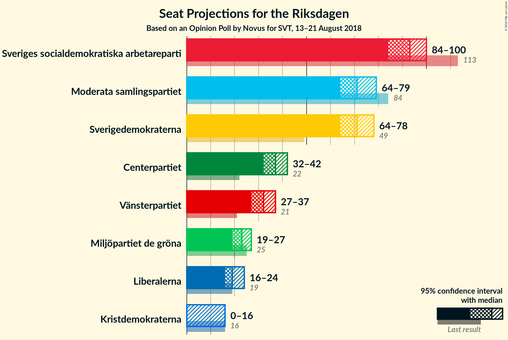

# Opinion Poll by Novus for SVT, 13–21 August 2018

<a href="#voting-intentions">Voting Intentions</a> | <a href="#seats">Seats</a> | <a href="#coalitions">Coalitions</a> | <a href="#technical-information">Technical Information</a>

## Voting Intentions

### Confidence Intervals

| Party | Last Result | Poll Result | 80% Confidence Interval | 90% Confidence Interval | 95% Confidence Interval | 99% Confidence Interval |
|:-----:|:-----------:|:-----------:|:-----------------------:|:-----------------------:|:-----------------------:|:-----------------------:|
| Sveriges socialdemokratiska arbetareparti | 31.0% | 25.1% | 23.8–26.5% |23.4–26.9% |23.1–27.2% |22.4–27.9% |
| Moderata samlingspartiet | 23.3% | 19.3% | 18.1–20.6% |17.8–21.0% |17.5–21.3% |16.9–21.9% |
| Sverigedemokraterna | 12.9% | 19.2% | 18.0–20.5% |17.6–20.9% |17.4–21.2% |16.8–21.8% |
| Centerpartiet | 6.1% | 10.0% | 9.1–11.0% |8.8–11.3% |8.6–11.5% |8.2–12.0% |
| Vänsterpartiet | 5.7% | 8.7% | 7.9–9.7% |7.7–10.0% |7.5–10.2% |7.1–10.7% |
| Miljöpartiet de gröna | 6.9% | 6.2% | 5.5–7.0% |5.3–7.3% |5.1–7.5% |4.8–7.9% |
| Liberalerna | 5.4% | 5.3% | 4.6–6.1% |4.5–6.3% |4.3–6.5% |4.0–6.9% |
| Kristdemokraterna | 4.6% | 3.5% | 3.0–4.1% |2.8–4.3% |2.7–4.5% |2.5–4.8% |

*Note:* The poll result column reflects the actual value used in the calculations. Published results may vary slightly, and in addition be rounded to fewer digits.

## Seats

### Confidence Intervals

| Party | Last Result | Median | 80% Confidence Interval | 90% Confidence Interval | 95% Confidence Interval | 99% Confidence Interval |
|:-----:|:-----------:|:------:|:-----------------------:|:-----------------------:|:-----------------------:|:-----------------------:|
| <a href="#sveriges-socialdemokratiska-arbetareparti">Sveriges socialdemokratiska arbetareparti</a> | 113 | 93 | 87–98 |86–99 |84–100 |82–103 |
| <a href="#moderata-samlingspartiet">Moderata samlingspartiet</a> | 84 | 71 | 66–76 |65–77 |64–79 |62–81 |
| <a href="#sverigedemokraterna">Sverigedemokraterna</a> | 49 | 71 | 66–75 |65–77 |64–78 |61–80 |
| <a href="#centerpartiet">Centerpartiet</a> | 22 | 37 | 34–40 |32–42 |32–42 |30–44 |
| <a href="#vänsterpartiet">Vänsterpartiet</a> | 21 | 32 | 29–36 |28–37 |27–37 |26–39 |
| <a href="#miljöpartiet-de-gröna">Miljöpartiet de gröna</a> | 25 | 23 | 20–26 |19–27 |19–27 |18–29 |
| <a href="#liberalerna">Liberalerna</a> | 19 | 19 | 17–22 |16–23 |16–24 |0–25 |
| <a href="#kristdemokraterna">Kristdemokraterna</a> | 16 | 0 | 0–15 |0–15 |0–16 |0–17 |

### Sveriges socialdemokratiska arbetareparti

*For a full overview of the results for this party, see the [Sveriges socialdemokratiska arbetareparti](party-sverigessocialdemokratiskaarbetareparti.html) page.*

| Number of Seats | Probability | Accumulated | Special Marks |
|:---------------:|:-----------:|:-----------:|:-------------:|
| 79 | 0.1% | 100% |  |
| 80 | 0.1% | 99.9% |  |
| 81 | 0.3% | 99.8% |  |
| 82 | 0.3% | 99.5% |  |
| 83 | 0.8% | 99.2% |  |
| 84 | 0.9% | 98% |  |
| 85 | 2% | 97% |  |
| 86 | 2% | 96% |  |
| 87 | 4% | 93% |  |
| 88 | 5% | 89% |  |
| 89 | 6% | 85% |  |
| 90 | 10% | 79% |  |
| 91 | 9% | 69% |  |
| 92 | 9% | 60% |  |
| 93 | 11% | 51% | Median |
| 94 | 7% | 40% |  |
| 95 | 10% | 33% |  |
| 96 | 7% | 23% |  |
| 97 | 5% | 15% |  |
| 98 | 4% | 10% |  |
| 99 | 2% | 6% |  |
| 100 | 2% | 4% |  |
| 101 | 1.1% | 2% |  |
| 102 | 0.7% | 1.4% |  |
| 103 | 0.2% | 0.7% |  |
| 104 | 0.3% | 0.4% |  |
| 105 | 0.1% | 0.2% |  |
| 106 | 0.1% | 0.1% |  |
| 107 | 0% | 0% |  |
| 108 | 0% | 0% |  |
| 109 | 0% | 0% |  |
| 110 | 0% | 0% |  |
| 111 | 0% | 0% |  |
| 112 | 0% | 0% |  |
| 113 | 0% | 0% | Last Result |

### Moderata samlingspartiet

*For a full overview of the results for this party, see the [Moderata samlingspartiet](party-moderatasamlingspartiet.html) page.*

| Number of Seats | Probability | Accumulated | Special Marks |
|:---------------:|:-----------:|:-----------:|:-------------:|
| 59 | 0% | 100% |  |
| 60 | 0.1% | 99.9% |  |
| 61 | 0.3% | 99.8% |  |
| 62 | 0.4% | 99.6% |  |
| 63 | 0.8% | 99.2% |  |
| 64 | 1.0% | 98% |  |
| 65 | 3% | 97% |  |
| 66 | 7% | 94% |  |
| 67 | 6% | 87% |  |
| 68 | 5% | 82% |  |
| 69 | 7% | 76% |  |
| 70 | 10% | 69% |  |
| 71 | 11% | 59% | Median |
| 72 | 9% | 48% |  |
| 73 | 7% | 39% |  |
| 74 | 11% | 32% |  |
| 75 | 7% | 21% |  |
| 76 | 8% | 14% |  |
| 77 | 2% | 6% |  |
| 78 | 1.1% | 4% |  |
| 79 | 1.0% | 3% |  |
| 80 | 1.0% | 2% |  |
| 81 | 0.4% | 0.7% |  |
| 82 | 0.1% | 0.3% |  |
| 83 | 0.1% | 0.2% |  |
| 84 | 0% | 0.1% | Last Result |
| 85 | 0% | 0% |  |

### Sverigedemokraterna

*For a full overview of the results for this party, see the [Sverigedemokraterna](party-sverigedemokraterna.html) page.*

| Number of Seats | Probability | Accumulated | Special Marks |
|:---------------:|:-----------:|:-----------:|:-------------:|
| 49 | 0% | 100% | Last Result |
| 50 | 0% | 100% |  |
| 51 | 0% | 100% |  |
| 52 | 0% | 100% |  |
| 53 | 0% | 100% |  |
| 54 | 0% | 100% |  |
| 55 | 0% | 100% |  |
| 56 | 0% | 100% |  |
| 57 | 0% | 100% |  |
| 58 | 0% | 100% |  |
| 59 | 0.1% | 100% |  |
| 60 | 0.1% | 99.9% |  |
| 61 | 0.3% | 99.8% |  |
| 62 | 0.5% | 99.5% |  |
| 63 | 1.1% | 99.0% |  |
| 64 | 2% | 98% |  |
| 65 | 3% | 96% |  |
| 66 | 5% | 93% |  |
| 67 | 6% | 88% |  |
| 68 | 8% | 82% |  |
| 69 | 11% | 74% |  |
| 70 | 11% | 63% |  |
| 71 | 11% | 51% | Median |
| 72 | 9% | 40% |  |
| 73 | 7% | 32% |  |
| 74 | 9% | 25% |  |
| 75 | 6% | 16% |  |
| 76 | 4% | 10% |  |
| 77 | 2% | 6% |  |
| 78 | 2% | 4% |  |
| 79 | 1.5% | 2% |  |
| 80 | 0.4% | 0.9% |  |
| 81 | 0.3% | 0.5% |  |
| 82 | 0.1% | 0.2% |  |
| 83 | 0.1% | 0.1% |  |
| 84 | 0% | 0% |  |

### Centerpartiet

*For a full overview of the results for this party, see the [Centerpartiet](party-centerpartiet.html) page.*

| Number of Seats | Probability | Accumulated | Special Marks |
|:---------------:|:-----------:|:-----------:|:-------------:|
| 22 | 0% | 100% | Last Result |
| 23 | 0% | 100% |  |
| 24 | 0% | 100% |  |
| 25 | 0% | 100% |  |
| 26 | 0% | 100% |  |
| 27 | 0% | 100% |  |
| 28 | 0% | 100% |  |
| 29 | 0.2% | 100% |  |
| 30 | 0.5% | 99.8% |  |
| 31 | 1.3% | 99.3% |  |
| 32 | 3% | 98% |  |
| 33 | 4% | 95% |  |
| 34 | 10% | 91% |  |
| 35 | 14% | 81% |  |
| 36 | 9% | 67% |  |
| 37 | 17% | 58% | Median |
| 38 | 14% | 41% |  |
| 39 | 10% | 28% |  |
| 40 | 8% | 18% |  |
| 41 | 4% | 10% |  |
| 42 | 3% | 5% |  |
| 43 | 1.3% | 2% |  |
| 44 | 0.7% | 1.1% |  |
| 45 | 0.3% | 0.4% |  |
| 46 | 0.1% | 0.2% |  |
| 47 | 0% | 0.1% |  |
| 48 | 0% | 0% |  |

### Vänsterpartiet

*For a full overview of the results for this party, see the [Vänsterpartiet](party-vänsterpartiet.html) page.*

| Number of Seats | Probability | Accumulated | Special Marks |
|:---------------:|:-----------:|:-----------:|:-------------:|
| 21 | 0% | 100% | Last Result |
| 22 | 0% | 100% |  |
| 23 | 0% | 100% |  |
| 24 | 0% | 100% |  |
| 25 | 0.3% | 100% |  |
| 26 | 0.7% | 99.7% |  |
| 27 | 2% | 99.0% |  |
| 28 | 4% | 97% |  |
| 29 | 6% | 93% |  |
| 30 | 9% | 87% |  |
| 31 | 16% | 78% |  |
| 32 | 13% | 62% | Median |
| 33 | 18% | 49% |  |
| 34 | 11% | 31% |  |
| 35 | 10% | 21% |  |
| 36 | 4% | 11% |  |
| 37 | 5% | 7% |  |
| 38 | 1.1% | 2% |  |
| 39 | 0.8% | 1.3% |  |
| 40 | 0.3% | 0.5% |  |
| 41 | 0.2% | 0.2% |  |
| 42 | 0% | 0% |  |

### Miljöpartiet de gröna

*For a full overview of the results for this party, see the [Miljöpartiet de gröna](party-miljöpartietdegröna.html) page.*

| Number of Seats | Probability | Accumulated | Special Marks |
|:---------------:|:-----------:|:-----------:|:-------------:|
| 16 | 0.1% | 100% |  |
| 17 | 0.4% | 99.9% |  |
| 18 | 1.2% | 99.6% |  |
| 19 | 3% | 98% |  |
| 20 | 6% | 95% |  |
| 21 | 10% | 89% |  |
| 22 | 21% | 79% |  |
| 23 | 16% | 58% | Median |
| 24 | 15% | 42% |  |
| 25 | 16% | 27% | Last Result |
| 26 | 5% | 10% |  |
| 27 | 3% | 6% |  |
| 28 | 1.5% | 2% |  |
| 29 | 0.5% | 0.8% |  |
| 30 | 0.2% | 0.3% |  |
| 31 | 0.1% | 0.1% |  |
| 32 | 0% | 0% |  |

### Liberalerna

*For a full overview of the results for this party, see the [Liberalerna](party-liberalerna.html) page.*

| Number of Seats | Probability | Accumulated | Special Marks |
|:---------------:|:-----------:|:-----------:|:-------------:|
| 0 | 0.5% | 100% |  |
| 1 | 0% | 99.5% |  |
| 2 | 0% | 99.5% |  |
| 3 | 0% | 99.5% |  |
| 4 | 0% | 99.5% |  |
| 5 | 0% | 99.5% |  |
| 6 | 0% | 99.5% |  |
| 7 | 0% | 99.5% |  |
| 8 | 0% | 99.5% |  |
| 9 | 0% | 99.5% |  |
| 10 | 0% | 99.5% |  |
| 11 | 0% | 99.5% |  |
| 12 | 0% | 99.5% |  |
| 13 | 0% | 99.5% |  |
| 14 | 0% | 99.5% |  |
| 15 | 1.3% | 99.5% |  |
| 16 | 3% | 98% |  |
| 17 | 7% | 95% |  |
| 18 | 16% | 88% |  |
| 19 | 26% | 72% | Last Result, Median |
| 20 | 16% | 46% |  |
| 21 | 12% | 30% |  |
| 22 | 9% | 18% |  |
| 23 | 5% | 9% |  |
| 24 | 2% | 4% |  |
| 25 | 0.8% | 1.2% |  |
| 26 | 0.3% | 0.4% |  |
| 27 | 0.1% | 0.1% |  |
| 28 | 0% | 0% |  |

### Kristdemokraterna

*For a full overview of the results for this party, see the [Kristdemokraterna](party-kristdemokraterna.html) page.*

| Number of Seats | Probability | Accumulated | Special Marks |
|:---------------:|:-----------:|:-----------:|:-------------:|
| 0 | 84% | 100% | Median |
| 1 | 0% | 16% |  |
| 2 | 0% | 16% |  |
| 3 | 0% | 16% |  |
| 4 | 0% | 16% |  |
| 5 | 0% | 16% |  |
| 6 | 0% | 16% |  |
| 7 | 0% | 16% |  |
| 8 | 0% | 16% |  |
| 9 | 0% | 16% |  |
| 10 | 0% | 16% |  |
| 11 | 0% | 16% |  |
| 12 | 0% | 16% |  |
| 13 | 0% | 16% |  |
| 14 | 5% | 16% |  |
| 15 | 8% | 11% |  |
| 16 | 3% | 4% | Last Result |
| 17 | 0.8% | 1.1% |  |
| 18 | 0.3% | 0.3% |  |
| 19 | 0% | 0.1% |  |
| 20 | 0% | 0% |  |

## Coalitions

### Confidence Intervals

| Coalition | Last Result | Median | Majority? | 80% Confidence Interval | 90% Confidence Interval | 95% Confidence Interval | 99% Confidence Interval |
|:---------:|:-----------:|:------:|:---------:|:-----------------------:|:-----------------------:|:-----------------------:|:-----------------------:|
| Sveriges socialdemokratiska arbetareparti – Moderata samlingspartiet – Centerpartiet | 219 | 201 | 100% | 193–207 | 191–210 | 190–211 | 185–214 |
| Sveriges socialdemokratiska arbetareparti – Moderata samlingspartiet | 197 | 164 | 1.2% | 157–170 | 155–172 | 154–173 | 150–177 |
| Sveriges socialdemokratiska arbetareparti – Vänsterpartiet – Miljöpartiet de gröna | 159 | 148 | 0% | 141–154 | 140–155 | 138–157 | 134–160 |
| Moderata samlingspartiet – Sverigedemokraterna – Kristdemokraterna | 149 | 144 | 0% | 138–151 | 136–154 | 135–156 | 132–160 |
| Moderata samlingspartiet – Sverigedemokraterna | 133 | 143 | 0% | 135–148 | 133–150 | 132–151 | 129–155 |
| Moderata samlingspartiet – Centerpartiet – Liberalerna – Kristdemokraterna | 141 | 130 | 0% | 124–137 | 122–140 | 120–143 | 117–146 |
| Moderata samlingspartiet – Centerpartiet – Liberalerna | 125 | 128 | 0% | 122–134 | 120–135 | 118–137 | 115–139 |
| Sveriges socialdemokratiska arbetareparti – Vänsterpartiet | 134 | 125 | 0% | 119–130 | 117–132 | 115–134 | 113–136 |
| Sveriges socialdemokratiska arbetareparti – Miljöpartiet de gröna | 138 | 116 | 0% | 110–121 | 108–123 | 107–124 | 103–127 |
| Moderata samlingspartiet – Centerpartiet – Kristdemokraterna | 122 | 110 | 0% | 105–118 | 103–121 | 101–123 | 99–127 |
| Moderata samlingspartiet – Centerpartiet | 106 | 108 | 0% | 102–114 | 100–115 | 100–117 | 96–119 |

