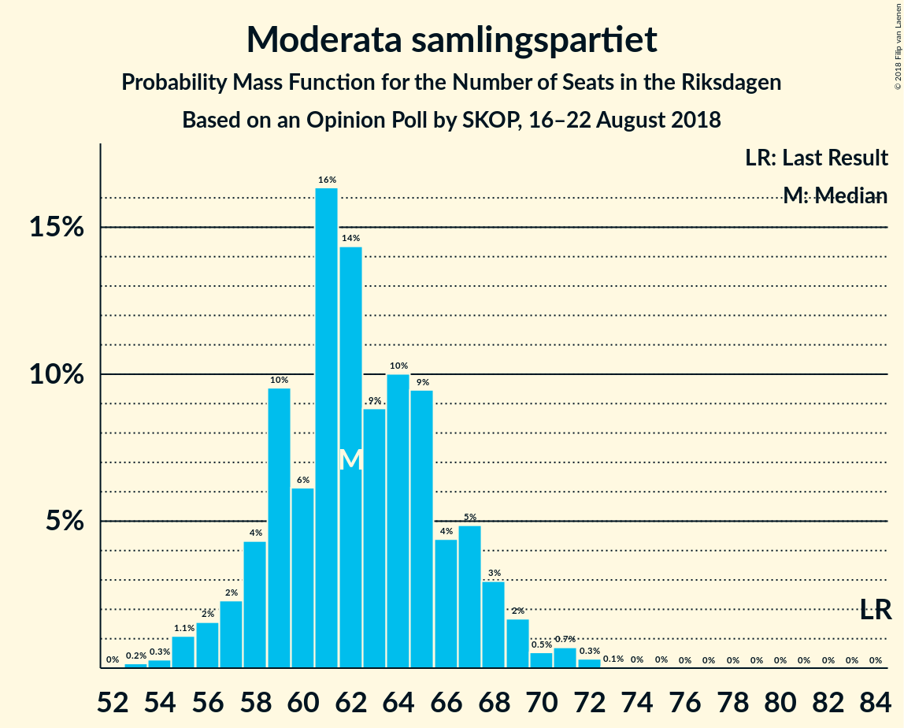

# Opinion Poll by SKOP, 16–22 August 2018

<a href="#voting-intentions">Voting Intentions</a> | <a href="#seats">Seats</a> | <a href="#coalitions">Coalitions</a> | <a href="#technical-information">Technical Information</a>

## Voting Intentions

### Confidence Intervals

| Party | Last Result | Poll Result | 80% Confidence Interval | 90% Confidence Interval | 95% Confidence Interval | 99% Confidence Interval |
|:-----:|:-----------:|:-----------:|:-----------------------:|:-----------------------:|:-----------------------:|:-----------------------:|
| Sveriges socialdemokratiska arbetareparti | 31.0% | 24.5% | 23.4–25.8% |23.0–26.1% |22.7–26.4% |22.2–27.0% |
| Sverigedemokraterna | 12.9% | 20.1% | 19.0–21.3% |18.7–21.6% |18.4–21.9% |17.9–22.4% |
| Moderata samlingspartiet | 23.3% | 17.1% | 16.1–18.2% |15.8–18.5% |15.5–18.8% |15.1–19.3% |
| Vänsterpartiet | 5.7% | 9.2% | 8.4–10.1% |8.2–10.3% |8.0–10.5% |7.7–10.9% |
| Centerpartiet | 6.1% | 8.2% | 7.5–9.0% |7.3–9.3% |7.1–9.4% |6.8–9.9% |
| Liberalerna | 5.4% | 6.3% | 5.7–7.0% |5.5–7.2% |5.3–7.4% |5.0–7.8% |
| Miljöpartiet de gröna | 6.9% | 5.8% | 5.2–6.5% |5.0–6.7% |4.9–6.9% |4.6–7.3% |
| Kristdemokraterna | 4.6% | 4.6% | 4.1–5.3% |3.9–5.5% |3.8–5.6% |3.6–5.9% |
| Feministiskt initiativ | 3.1% | 1.7% | 1.4–2.1% |1.3–2.3% |1.2–2.4% |1.1–2.6% |

*Note:* The poll result column reflects the actual value used in the calculations. Published results may vary slightly, and in addition be rounded to fewer digits.

## Seats

### Confidence Intervals

| Party | Last Result | Median | 80% Confidence Interval | 90% Confidence Interval | 95% Confidence Interval | 99% Confidence Interval |
|:-----:|:-----------:|:------:|:-----------------------:|:-----------------------:|:-----------------------:|:-----------------------:|
| <a href="#sveriges-socialdemokratiska-arbetareparti">Sveriges socialdemokratiska arbetareparti</a> | 113 | 89 | 85–94 |83–95 |82–96 |81–99 |
| <a href="#sverigedemokraterna">Sverigedemokraterna</a> | 49 | 73 | 69–77 |68–79 |68–81 |65–83 |
| <a href="#moderata-samlingspartiet">Moderata samlingspartiet</a> | 84 | 62 | 59–67 |57–68 |56–69 |55–71 |
| <a href="#vänsterpartiet">Vänsterpartiet</a> | 21 | 34 | 30–36 |30–38 |29–38 |28–40 |
| <a href="#centerpartiet">Centerpartiet</a> | 22 | 30 | 27–33 |26–34 |26–35 |25–36 |
| <a href="#liberalerna">Liberalerna</a> | 19 | 23 | 20–26 |20–27 |19–27 |18–28 |
| <a href="#miljöpartiet-de-gröna">Miljöpartiet de gröna</a> | 25 | 21 | 19–24 |18–24 |18–25 |17–26 |
| <a href="#kristdemokraterna">Kristdemokraterna</a> | 16 | 17 | 15–19 |0–20 |0–20 |0–22 |
| <a href="#feministiskt-initiativ">Feministiskt initiativ</a> | 0 | 0 | 0 |0 |0 |0 |

### Sveriges socialdemokratiska arbetareparti

*For a full overview of the results for this party, see the [Sveriges socialdemokratiska arbetareparti](party-sverigessocialdemokratiskaarbetareparti.html) page.*

| Number of Seats | Probability | Accumulated | Special Marks |
|:---------------:|:-----------:|:-----------:|:-------------:|
| 78 | 0% | 100% |  |
| 79 | 0.1% | 99.9% |  |
| 80 | 0.2% | 99.9% |  |
| 81 | 1.0% | 99.7% |  |
| 82 | 2% | 98.7% |  |
| 83 | 2% | 97% |  |
| 84 | 2% | 95% |  |
| 85 | 7% | 92% |  |
| 86 | 5% | 85% |  |
| 87 | 12% | 80% |  |
| 88 | 14% | 68% |  |
| 89 | 7% | 53% | Median |
| 90 | 12% | 46% |  |
| 91 | 5% | 34% |  |
| 92 | 8% | 29% |  |
| 93 | 3% | 21% |  |
| 94 | 9% | 18% |  |
| 95 | 4% | 9% |  |
| 96 | 3% | 5% |  |
| 97 | 0.8% | 2% |  |
| 98 | 0.4% | 1.4% |  |
| 99 | 0.5% | 1.0% |  |
| 100 | 0.3% | 0.5% |  |
| 101 | 0.1% | 0.2% |  |
| 102 | 0.1% | 0.1% |  |
| 103 | 0% | 0% |  |
| 104 | 0% | 0% |  |
| 105 | 0% | 0% |  |
| 106 | 0% | 0% |  |
| 107 | 0% | 0% |  |
| 108 | 0% | 0% |  |
| 109 | 0% | 0% |  |
| 110 | 0% | 0% |  |
| 111 | 0% | 0% |  |
| 112 | 0% | 0% |  |
| 113 | 0% | 0% | Last Result |

### Sverigedemokraterna

*For a full overview of the results for this party, see the [Sverigedemokraterna](party-sverigedemokraterna.html) page.*

| Number of Seats | Probability | Accumulated | Special Marks |
|:---------------:|:-----------:|:-----------:|:-------------:|
| 49 | 0% | 100% | Last Result |
| 50 | 0% | 100% |  |
| 51 | 0% | 100% |  |
| 52 | 0% | 100% |  |
| 53 | 0% | 100% |  |
| 54 | 0% | 100% |  |
| 55 | 0% | 100% |  |
| 56 | 0% | 100% |  |
| 57 | 0% | 100% |  |
| 58 | 0% | 100% |  |
| 59 | 0% | 100% |  |
| 60 | 0% | 100% |  |
| 61 | 0% | 100% |  |
| 62 | 0% | 100% |  |
| 63 | 0.1% | 100% |  |
| 64 | 0.2% | 99.9% |  |
| 65 | 0.3% | 99.7% |  |
| 66 | 0.7% | 99.4% |  |
| 67 | 1.1% | 98.8% |  |
| 68 | 6% | 98% |  |
| 69 | 8% | 91% |  |
| 70 | 6% | 84% |  |
| 71 | 9% | 78% |  |
| 72 | 7% | 69% |  |
| 73 | 15% | 62% | Median |
| 74 | 12% | 47% |  |
| 75 | 14% | 35% |  |
| 76 | 7% | 21% |  |
| 77 | 5% | 14% |  |
| 78 | 2% | 9% |  |
| 79 | 2% | 7% |  |
| 80 | 2% | 5% |  |
| 81 | 2% | 3% |  |
| 82 | 0.3% | 0.9% |  |
| 83 | 0.3% | 0.6% |  |
| 84 | 0.2% | 0.3% |  |
| 85 | 0.1% | 0.1% |  |
| 86 | 0% | 0% |  |

### Moderata samlingspartiet

*For a full overview of the results for this party, see the [Moderata samlingspartiet](party-moderatasamlingspartiet.html) page.*

| Number of Seats | Probability | Accumulated | Special Marks |
|:---------------:|:-----------:|:-----------:|:-------------:|
| 53 | 0.2% | 100% |  |
| 54 | 0.3% | 99.8% |  |
| 55 | 1.1% | 99.5% |  |
| 56 | 2% | 98% |  |
| 57 | 2% | 97% |  |
| 58 | 4% | 95% |  |
| 59 | 10% | 90% |  |
| 60 | 6% | 81% |  |
| 61 | 16% | 75% |  |
| 62 | 14% | 58% | Median |
| 63 | 9% | 44% |  |
| 64 | 10% | 35% |  |
| 65 | 9% | 25% |  |
| 66 | 4% | 16% |  |
| 67 | 5% | 11% |  |
| 68 | 3% | 6% |  |
| 69 | 2% | 3% |  |
| 70 | 0.5% | 2% |  |
| 71 | 0.7% | 1.1% |  |
| 72 | 0.3% | 0.4% |  |
| 73 | 0.1% | 0.1% |  |
| 74 | 0% | 0% |  |
| 75 | 0% | 0% |  |
| 76 | 0% | 0% |  |
| 77 | 0% | 0% |  |
| 78 | 0% | 0% |  |
| 79 | 0% | 0% |  |
| 80 | 0% | 0% |  |
| 81 | 0% | 0% |  |
| 82 | 0% | 0% |  |
| 83 | 0% | 0% |  |
| 84 | 0% | 0% | Last Result |

### Vänsterpartiet

*For a full overview of the results for this party, see the [Vänsterpartiet](party-vänsterpartiet.html) page.*

| Number of Seats | Probability | Accumulated | Special Marks |
|:---------------:|:-----------:|:-----------:|:-------------:|
| 21 | 0% | 100% | Last Result |
| 22 | 0% | 100% |  |
| 23 | 0% | 100% |  |
| 24 | 0% | 100% |  |
| 25 | 0% | 100% |  |
| 26 | 0% | 100% |  |
| 27 | 0.3% | 100% |  |
| 28 | 0.9% | 99.7% |  |
| 29 | 2% | 98.8% |  |
| 30 | 7% | 96% |  |
| 31 | 7% | 89% |  |
| 32 | 10% | 82% |  |
| 33 | 16% | 72% |  |
| 34 | 16% | 56% | Median |
| 35 | 11% | 40% |  |
| 36 | 20% | 29% |  |
| 37 | 4% | 9% |  |
| 38 | 3% | 5% |  |
| 39 | 1.1% | 2% |  |
| 40 | 0.8% | 1.1% |  |
| 41 | 0.1% | 0.3% |  |
| 42 | 0.1% | 0.1% |  |
| 43 | 0% | 0% |  |

### Centerpartiet

*For a full overview of the results for this party, see the [Centerpartiet](party-centerpartiet.html) page.*

| Number of Seats | Probability | Accumulated | Special Marks |
|:---------------:|:-----------:|:-----------:|:-------------:|
| 22 | 0% | 100% | Last Result |
| 23 | 0.1% | 100% |  |
| 24 | 0.3% | 99.9% |  |
| 25 | 0.9% | 99.6% |  |
| 26 | 7% | 98.7% |  |
| 27 | 6% | 92% |  |
| 28 | 15% | 86% |  |
| 29 | 18% | 71% |  |
| 30 | 14% | 54% | Median |
| 31 | 14% | 40% |  |
| 32 | 11% | 26% |  |
| 33 | 9% | 15% |  |
| 34 | 2% | 5% |  |
| 35 | 2% | 3% |  |
| 36 | 0.8% | 1.1% |  |
| 37 | 0.2% | 0.3% |  |
| 38 | 0% | 0.1% |  |
| 39 | 0% | 0% |  |

### Liberalerna

*For a full overview of the results for this party, see the [Liberalerna](party-liberalerna.html) page.*

| Number of Seats | Probability | Accumulated | Special Marks |
|:---------------:|:-----------:|:-----------:|:-------------:|
| 17 | 0.1% | 100% |  |
| 18 | 0.5% | 99.9% |  |
| 19 | 3% | 99.4% | Last Result |
| 20 | 7% | 97% |  |
| 21 | 10% | 89% |  |
| 22 | 15% | 79% |  |
| 23 | 26% | 64% | Median |
| 24 | 12% | 38% |  |
| 25 | 14% | 26% |  |
| 26 | 6% | 12% |  |
| 27 | 5% | 6% |  |
| 28 | 1.1% | 2% |  |
| 29 | 0.4% | 0.5% |  |
| 30 | 0.1% | 0.1% |  |
| 31 | 0% | 0% |  |

### Miljöpartiet de gröna

*For a full overview of the results for this party, see the [Miljöpartiet de gröna](party-miljöpartietdegröna.html) page.*

| Number of Seats | Probability | Accumulated | Special Marks |
|:---------------:|:-----------:|:-----------:|:-------------:|
| 16 | 0.2% | 100% |  |
| 17 | 1.5% | 99.7% |  |
| 18 | 5% | 98% |  |
| 19 | 9% | 93% |  |
| 20 | 19% | 85% |  |
| 21 | 24% | 66% | Median |
| 22 | 14% | 42% |  |
| 23 | 17% | 27% |  |
| 24 | 6% | 11% |  |
| 25 | 3% | 4% | Last Result |
| 26 | 1.1% | 2% |  |
| 27 | 0.3% | 0.4% |  |
| 28 | 0.1% | 0.1% |  |
| 29 | 0% | 0% |  |

### Kristdemokraterna

*For a full overview of the results for this party, see the [Kristdemokraterna](party-kristdemokraterna.html) page.*

| Number of Seats | Probability | Accumulated | Special Marks |
|:---------------:|:-----------:|:-----------:|:-------------:|
| 0 | 7% | 100% |  |
| 1 | 0% | 93% |  |
| 2 | 0% | 93% |  |
| 3 | 0% | 93% |  |
| 4 | 0% | 93% |  |
| 5 | 0% | 93% |  |
| 6 | 0% | 93% |  |
| 7 | 0% | 93% |  |
| 8 | 0% | 93% |  |
| 9 | 0% | 93% |  |
| 10 | 0% | 93% |  |
| 11 | 0% | 93% |  |
| 12 | 0% | 93% |  |
| 13 | 0% | 93% |  |
| 14 | 0% | 93% |  |
| 15 | 13% | 93% |  |
| 16 | 17% | 80% | Last Result |
| 17 | 29% | 63% | Median |
| 18 | 19% | 34% |  |
| 19 | 8% | 15% |  |
| 20 | 5% | 7% |  |
| 21 | 1.2% | 2% |  |
| 22 | 0.6% | 0.7% |  |
| 23 | 0.1% | 0.1% |  |
| 24 | 0% | 0% |  |

### Feministiskt initiativ

*For a full overview of the results for this party, see the [Feministiskt initiativ](party-feministisktinitiativ.html) page.*

| Number of Seats | Probability | Accumulated | Special Marks |
|:---------------:|:-----------:|:-----------:|:-------------:|
| 0 | 100% | 100% | Last Result, Median |

## Coalitions

### Confidence Intervals

| Coalition | Last Result | Median | Majority? | 80% Confidence Interval | 90% Confidence Interval | 95% Confidence Interval | 99% Confidence Interval |
|:---------:|:-----------:|:------:|:---------:|:-----------------------:|:-----------------------:|:-----------------------:|:-----------------------:|
| Sveriges socialdemokratiska arbetareparti – Moderata samlingspartiet | 197 | 152 | 0% | 146–157 | 145–159 | 143–161 | 141–164 |
| Sverigedemokraterna – Moderata samlingspartiet – Kristdemokraterna | 149 | 152 | 0% | 145–157 | 143–159 | 141–160 | 135–162 |
| Sveriges socialdemokratiska arbetareparti – Vänsterpartiet – Miljöpartiet de gröna – Feministiskt initiativ | 159 | 145 | 0% | 139–150 | 138–151 | 137–154 | 134–157 |
| Sveriges socialdemokratiska arbetareparti – Vänsterpartiet – Miljöpartiet de gröna | 159 | 145 | 0% | 139–150 | 138–151 | 137–154 | 134–157 |
| Sverigedemokraterna – Moderata samlingspartiet | 133 | 135 | 0% | 131–141 | 129–143 | 128–145 | 126–148 |
| Moderata samlingspartiet – Centerpartiet – Liberalerna – Kristdemokraterna | 141 | 131 | 0% | 126–137 | 123–139 | 120–140 | 115–142 |
| Sveriges socialdemokratiska arbetareparti – Vänsterpartiet | 134 | 123 | 0% | 118–128 | 116–130 | 115–132 | 113–134 |
| Moderata samlingspartiet – Centerpartiet – Liberalerna | 125 | 115 | 0% | 110–121 | 109–123 | 108–124 | 106–128 |
| Sveriges socialdemokratiska arbetareparti – Miljöpartiet de gröna | 138 | 110 | 0% | 106–116 | 104–117 | 103–118 | 101–121 |
| Moderata samlingspartiet – Centerpartiet – Kristdemokraterna | 122 | 108 | 0% | 103–114 | 99–116 | 97–117 | 92–119 |
| Moderata samlingspartiet – Centerpartiet | 106 | 92 | 0% | 87–98 | 87–99 | 86–100 | 84–103 |

