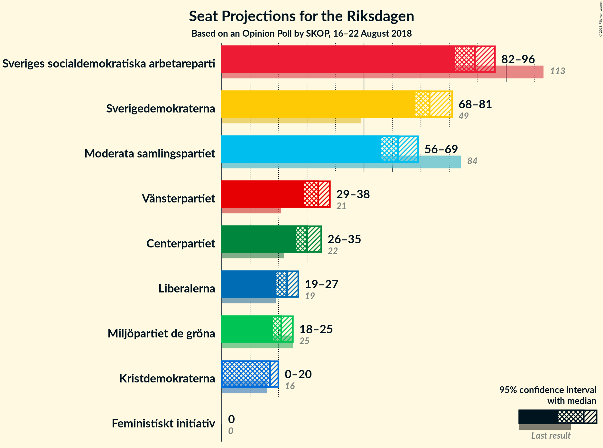
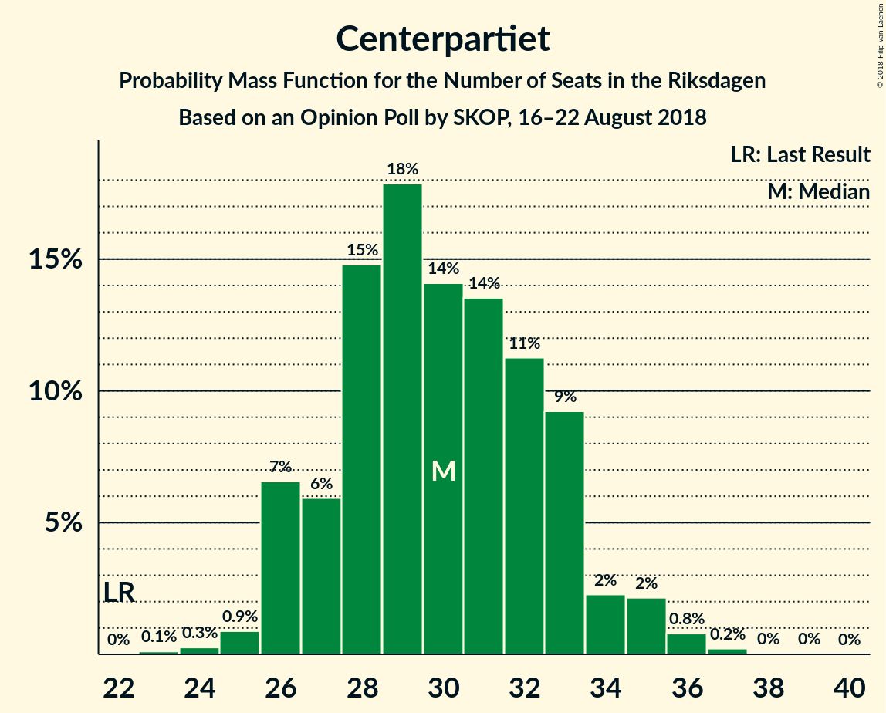

# Opinion Poll by SKOP, 16–22 August 2018

<a href="#voting-intentions">Voting Intentions</a> | <a href="#seats">Seats</a> | <a href="#coalitions">Coalitions</a> | <a href="#technical-information">Technical Information</a>

## Voting Intentions

### Confidence Intervals

| Party | Last Result | Poll Result | 80% Confidence Interval | 90% Confidence Interval | 95% Confidence Interval | 99% Confidence Interval |
|:-----:|:-----------:|:-----------:|:-----------------------:|:-----------------------:|:-----------------------:|:-----------------------:|
| Sveriges socialdemokratiska arbetareparti | 31.0% | 24.5% | 23.4–25.8% |23.0–26.1% |22.7–26.4% |22.2–27.0% |
| Sverigedemokraterna | 12.9% | 20.1% | 19.0–21.3% |18.7–21.6% |18.4–21.9% |17.9–22.4% |
| Moderata samlingspartiet | 23.3% | 17.1% | 16.1–18.2% |15.8–18.5% |15.5–18.8% |15.1–19.3% |
| Vänsterpartiet | 5.7% | 9.2% | 8.4–10.1% |8.2–10.3% |8.0–10.5% |7.7–10.9% |
| Centerpartiet | 6.1% | 8.2% | 7.5–9.0% |7.3–9.3% |7.1–9.4% |6.8–9.9% |
| Liberalerna | 5.4% | 6.3% | 5.7–7.0% |5.5–7.2% |5.3–7.4% |5.0–7.8% |
| Miljöpartiet de gröna | 6.9% | 5.8% | 5.2–6.5% |5.0–6.7% |4.9–6.9% |4.6–7.3% |
| Kristdemokraterna | 4.6% | 4.6% | 4.1–5.3% |3.9–5.5% |3.8–5.6% |3.6–5.9% |
| Feministiskt initiativ | 3.1% | 1.7% | 1.4–2.1% |1.3–2.3% |1.2–2.4% |1.1–2.6% |

*Note:* The poll result column reflects the actual value used in the calculations. Published results may vary slightly, and in addition be rounded to fewer digits.

## Seats

### Confidence Intervals

| Party | Last Result | Median | 80% Confidence Interval | 90% Confidence Interval | 95% Confidence Interval | 99% Confidence Interval |
|:-----:|:-----------:|:------:|:-----------------------:|:-----------------------:|:-----------------------:|:-----------------------:|
| <a href="#sveriges-socialdemokratiska-arbetareparti">Sveriges socialdemokratiska arbetareparti</a> | 113 | 90 | 84–94 |84–96 |83–97 |80–98 |
| <a href="#sverigedemokraterna">Sverigedemokraterna</a> | 49 | 73 | 68–78 |68–81 |67–81 |66–81 |
| <a href="#moderata-samlingspartiet">Moderata samlingspartiet</a> | 84 | 65 | 58–67 |56–67 |54–69 |53–70 |
| <a href="#vänsterpartiet">Vänsterpartiet</a> | 21 | 35 | 32–38 |31–39 |30–39 |28–39 |
| <a href="#centerpartiet">Centerpartiet</a> | 22 | 30 | 27–32 |27–33 |26–34 |25–36 |
| <a href="#liberalerna">Liberalerna</a> | 19 | 22 | 20–27 |20–27 |20–28 |19–28 |
| <a href="#miljöpartiet-de-gröna">Miljöpartiet de gröna</a> | 25 | 20 | 19–23 |19–24 |18–24 |17–26 |
| <a href="#kristdemokraterna">Kristdemokraterna</a> | 16 | 17 | 0–19 |0–20 |0–21 |0–21 |
| <a href="#feministiskt-initiativ">Feministiskt initiativ</a> | 0 | 0 | 0 |0 |0 |0 |

### Sveriges socialdemokratiska arbetareparti

*For a full overview of the results for this party, see the [Sveriges socialdemokratiska arbetareparti](party-sverigessocialdemokratiskaarbetareparti.html) page.*

| Number of Seats | Probability | Accumulated | Special Marks |
|:---------------:|:-----------:|:-----------:|:-------------:|
| 80 | 0.6% | 100% |  |
| 81 | 0.1% | 99.3% |  |
| 82 | 2% | 99.2% |  |
| 83 | 0.7% | 98% |  |
| 84 | 8% | 97% |  |
| 85 | 8% | 89% |  |
| 86 | 5% | 81% |  |
| 87 | 3% | 76% |  |
| 88 | 14% | 73% |  |
| 89 | 9% | 59% |  |
| 90 | 4% | 51% | Median |
| 91 | 5% | 46% |  |
| 92 | 25% | 41% |  |
| 93 | 0.7% | 17% |  |
| 94 | 10% | 16% |  |
| 95 | 0.3% | 6% |  |
| 96 | 3% | 6% |  |
| 97 | 0.7% | 3% |  |
| 98 | 1.5% | 2% |  |
| 99 | 0.1% | 0.4% |  |
| 100 | 0.1% | 0.3% |  |
| 101 | 0% | 0.2% |  |
| 102 | 0.1% | 0.2% |  |
| 103 | 0% | 0.1% |  |
| 104 | 0.1% | 0.1% |  |
| 105 | 0% | 0% |  |
| 106 | 0% | 0% |  |
| 107 | 0% | 0% |  |
| 108 | 0% | 0% |  |
| 109 | 0% | 0% |  |
| 110 | 0% | 0% |  |
| 111 | 0% | 0% |  |
| 112 | 0% | 0% |  |
| 113 | 0% | 0% | Last Result |

### Sverigedemokraterna

*For a full overview of the results for this party, see the [Sverigedemokraterna](party-sverigedemokraterna.html) page.*

| Number of Seats | Probability | Accumulated | Special Marks |
|:---------------:|:-----------:|:-----------:|:-------------:|
| 49 | 0% | 100% | Last Result |
| 50 | 0% | 100% |  |
| 51 | 0% | 100% |  |
| 52 | 0% | 100% |  |
| 53 | 0% | 100% |  |
| 54 | 0% | 100% |  |
| 55 | 0% | 100% |  |
| 56 | 0% | 100% |  |
| 57 | 0% | 100% |  |
| 58 | 0% | 100% |  |
| 59 | 0% | 100% |  |
| 60 | 0% | 100% |  |
| 61 | 0% | 100% |  |
| 62 | 0% | 100% |  |
| 63 | 0% | 100% |  |
| 64 | 0.1% | 99.9% |  |
| 65 | 0.3% | 99.9% |  |
| 66 | 1.0% | 99.5% |  |
| 67 | 2% | 98.5% |  |
| 68 | 21% | 97% |  |
| 69 | 8% | 76% |  |
| 70 | 4% | 67% |  |
| 71 | 8% | 63% |  |
| 72 | 3% | 55% |  |
| 73 | 8% | 52% | Median |
| 74 | 13% | 44% |  |
| 75 | 11% | 32% |  |
| 76 | 7% | 20% |  |
| 77 | 3% | 13% |  |
| 78 | 1.4% | 11% |  |
| 79 | 0.9% | 9% |  |
| 80 | 3% | 8% |  |
| 81 | 5% | 6% |  |
| 82 | 0.1% | 0.3% |  |
| 83 | 0.1% | 0.1% |  |
| 84 | 0% | 0% |  |

### Moderata samlingspartiet

*For a full overview of the results for this party, see the [Moderata samlingspartiet](party-moderatasamlingspartiet.html) page.*

| Number of Seats | Probability | Accumulated | Special Marks |
|:---------------:|:-----------:|:-----------:|:-------------:|
| 53 | 2% | 100% |  |
| 54 | 0.3% | 98% |  |
| 55 | 0.1% | 97% |  |
| 56 | 3% | 97% |  |
| 57 | 0.3% | 95% |  |
| 58 | 5% | 94% |  |
| 59 | 2% | 89% |  |
| 60 | 6% | 87% |  |
| 61 | 12% | 81% |  |
| 62 | 0.7% | 69% |  |
| 63 | 16% | 69% |  |
| 64 | 1.3% | 53% |  |
| 65 | 35% | 51% | Median |
| 66 | 2% | 17% |  |
| 67 | 11% | 15% |  |
| 68 | 0.3% | 4% |  |
| 69 | 3% | 4% |  |
| 70 | 0.8% | 1.2% |  |
| 71 | 0.1% | 0.4% |  |
| 72 | 0.2% | 0.3% |  |
| 73 | 0% | 0.1% |  |
| 74 | 0% | 0.1% |  |
| 75 | 0% | 0% |  |
| 76 | 0% | 0% |  |
| 77 | 0% | 0% |  |
| 78 | 0% | 0% |  |
| 79 | 0% | 0% |  |
| 80 | 0% | 0% |  |
| 81 | 0% | 0% |  |
| 82 | 0% | 0% |  |
| 83 | 0% | 0% |  |
| 84 | 0% | 0% | Last Result |

### Vänsterpartiet

*For a full overview of the results for this party, see the [Vänsterpartiet](party-vänsterpartiet.html) page.*

| Number of Seats | Probability | Accumulated | Special Marks |
|:---------------:|:-----------:|:-----------:|:-------------:|
| 21 | 0% | 100% | Last Result |
| 22 | 0% | 100% |  |
| 23 | 0% | 100% |  |
| 24 | 0% | 100% |  |
| 25 | 0% | 100% |  |
| 26 | 0% | 100% |  |
| 27 | 0% | 100% |  |
| 28 | 0.8% | 99.9% |  |
| 29 | 0.5% | 99.2% |  |
| 30 | 3% | 98.6% |  |
| 31 | 2% | 96% |  |
| 32 | 14% | 94% |  |
| 33 | 4% | 80% |  |
| 34 | 4% | 76% |  |
| 35 | 46% | 71% | Median |
| 36 | 4% | 26% |  |
| 37 | 5% | 22% |  |
| 38 | 10% | 17% |  |
| 39 | 6% | 6% |  |
| 40 | 0.1% | 0.2% |  |
| 41 | 0.1% | 0.1% |  |
| 42 | 0% | 0% |  |

### Centerpartiet

*For a full overview of the results for this party, see the [Centerpartiet](party-centerpartiet.html) page.*

| Number of Seats | Probability | Accumulated | Special Marks |
|:---------------:|:-----------:|:-----------:|:-------------:|
| 22 | 0% | 100% | Last Result |
| 23 | 0% | 100% |  |
| 24 | 0.3% | 99.9% |  |
| 25 | 0.5% | 99.7% |  |
| 26 | 3% | 99.2% |  |
| 27 | 9% | 97% |  |
| 28 | 16% | 87% |  |
| 29 | 5% | 71% |  |
| 30 | 26% | 66% | Median |
| 31 | 15% | 40% |  |
| 32 | 16% | 25% |  |
| 33 | 6% | 9% |  |
| 34 | 2% | 3% |  |
| 35 | 1.1% | 2% |  |
| 36 | 0.3% | 0.5% |  |
| 37 | 0.2% | 0.2% |  |
| 38 | 0% | 0% |  |

### Liberalerna

*For a full overview of the results for this party, see the [Liberalerna](party-liberalerna.html) page.*

| Number of Seats | Probability | Accumulated | Special Marks |
|:---------------:|:-----------:|:-----------:|:-------------:|
| 18 | 0.3% | 100% |  |
| 19 | 0.3% | 99.7% | Last Result |
| 20 | 23% | 99.4% |  |
| 21 | 14% | 76% |  |
| 22 | 31% | 63% | Median |
| 23 | 11% | 32% |  |
| 24 | 2% | 22% |  |
| 25 | 5% | 20% |  |
| 26 | 0.4% | 15% |  |
| 27 | 10% | 14% |  |
| 28 | 4% | 5% |  |
| 29 | 0.1% | 0.4% |  |
| 30 | 0.3% | 0.3% |  |
| 31 | 0% | 0% |  |

### Miljöpartiet de gröna

*For a full overview of the results for this party, see the [Miljöpartiet de gröna](party-miljöpartietdegröna.html) page.*

| Number of Seats | Probability | Accumulated | Special Marks |
|:---------------:|:-----------:|:-----------:|:-------------:|
| 16 | 0.3% | 100% |  |
| 17 | 0.2% | 99.7% |  |
| 18 | 3% | 99.5% |  |
| 19 | 7% | 96% |  |
| 20 | 47% | 89% | Median |
| 21 | 14% | 43% |  |
| 22 | 8% | 28% |  |
| 23 | 13% | 20% |  |
| 24 | 6% | 7% |  |
| 25 | 0.3% | 1.2% | Last Result |
| 26 | 0.6% | 0.9% |  |
| 27 | 0.2% | 0.3% |  |
| 28 | 0% | 0.1% |  |
| 29 | 0.1% | 0.1% |  |
| 30 | 0% | 0% |  |

### Kristdemokraterna

*For a full overview of the results for this party, see the [Kristdemokraterna](party-kristdemokraterna.html) page.*

| Number of Seats | Probability | Accumulated | Special Marks |
|:---------------:|:-----------:|:-----------:|:-------------:|
| 0 | 12% | 100% |  |
| 1 | 0% | 88% |  |
| 2 | 0% | 88% |  |
| 3 | 0% | 88% |  |
| 4 | 0% | 88% |  |
| 5 | 0% | 88% |  |
| 6 | 0% | 88% |  |
| 7 | 0% | 88% |  |
| 8 | 0% | 88% |  |
| 9 | 0% | 88% |  |
| 10 | 0% | 88% |  |
| 11 | 0% | 88% |  |
| 12 | 0% | 88% |  |
| 13 | 0% | 88% |  |
| 14 | 0% | 88% |  |
| 15 | 3% | 88% |  |
| 16 | 19% | 85% | Last Result |
| 17 | 34% | 66% | Median |
| 18 | 8% | 33% |  |
| 19 | 16% | 25% |  |
| 20 | 6% | 9% |  |
| 21 | 3% | 3% |  |
| 22 | 0% | 0.3% |  |
| 23 | 0.3% | 0.3% |  |
| 24 | 0% | 0% |  |

### Feministiskt initiativ

*For a full overview of the results for this party, see the [Feministiskt initiativ](party-feministisktinitiativ.html) page.*

| Number of Seats | Probability | Accumulated | Special Marks |
|:---------------:|:-----------:|:-----------:|:-------------:|
| 0 | 100% | 100% | Last Result, Median |

## Coalitions

### Confidence Intervals

| Coalition | Last Result | Median | Majority? | 80% Confidence Interval | 90% Confidence Interval | 95% Confidence Interval | 99% Confidence Interval |
|:---------:|:-----------:|:------:|:---------:|:-----------------------:|:-----------------------:|:-----------------------:|:-----------------------:|
| Sveriges socialdemokratiska arbetareparti – Moderata samlingspartiet | 197 | 153 | 0% | 145–161 | 145–161 | 144–161 | 143–164 |
| Sverigedemokraterna – Moderata samlingspartiet – Kristdemokraterna | 149 | 151 | 0% | 142–158 | 142–158 | 142–158 | 139–160 |
| Sveriges socialdemokratiska arbetareparti – Vänsterpartiet – Miljöpartiet de gröna – Feministiskt initiativ | 159 | 145 | 0% | 141–149 | 140–150 | 139–153 | 135–158 |
| Sveriges socialdemokratiska arbetareparti – Vänsterpartiet – Miljöpartiet de gröna | 159 | 145 | 0% | 141–149 | 140–150 | 139–153 | 135–158 |
| Sverigedemokraterna – Moderata samlingspartiet | 133 | 134 | 0% | 131–142 | 128–142 | 127–142 | 127–145 |
| Moderata samlingspartiet – Centerpartiet – Liberalerna – Kristdemokraterna | 141 | 132 | 0% | 123–135 | 122–139 | 120–140 | 117–140 |
| Sveriges socialdemokratiska arbetareparti – Vänsterpartiet | 134 | 125 | 0% | 120–129 | 118–132 | 117–132 | 113–134 |
| Moderata samlingspartiet – Centerpartiet – Liberalerna | 125 | 117 | 0% | 108–123 | 107–125 | 106–125 | 106–126 |
| Sveriges socialdemokratiska arbetareparti – Miljöpartiet de gröna | 138 | 111 | 0% | 104–114 | 104–115 | 103–119 | 102–121 |
| Moderata samlingspartiet – Centerpartiet – Kristdemokraterna | 122 | 112 | 0% | 98–112 | 98–113 | 98–115 | 92–119 |
| Moderata samlingspartiet – Centerpartiet | 106 | 94 | 0% | 87–98 | 86–98 | 86–99 | 84–101 |

### Sveriges socialdemokratiska arbetareparti – Moderata samlingspartiet

| Number of Seats | Probability | Accumulated | Special Marks |
|:---------------:|:-----------:|:-----------:|:-------------:|
| 138 | 0% | 100% |  |
| 139 | 0% | 99.9% |  |
| 140 | 0.1% | 99.9% |  |
| 141 | 0% | 99.8% |  |
| 142 | 0% | 99.8% |  |
| 143 | 0.4% | 99.8% |  |
| 144 | 3% | 99.3% |  |
| 145 | 7% | 96% |  |
| 146 | 3% | 89% |  |
| 147 | 4% | 87% |  |
| 148 | 9% | 83% |  |
| 149 | 15% | 74% |  |
| 150 | 0.2% | 59% |  |
| 151 | 2% | 58% |  |
| 152 | 4% | 56% |  |
| 153 | 11% | 53% |  |
| 154 | 1.1% | 42% |  |
| 155 | 0.4% | 41% | Median |
| 156 | 0.1% | 40% |  |
| 157 | 22% | 40% |  |
| 158 | 1.4% | 19% |  |
| 159 | 4% | 17% |  |
| 160 | 0.2% | 13% |  |
| 161 | 11% | 13% |  |
| 162 | 1.4% | 2% |  |
| 163 | 0.2% | 0.7% |  |
| 164 | 0% | 0.5% |  |
| 165 | 0.2% | 0.5% |  |
| 166 | 0.2% | 0.3% |  |
| 167 | 0% | 0.1% |  |
| 168 | 0% | 0% |  |
| 169 | 0% | 0% |  |
| 170 | 0% | 0% |  |
| 171 | 0% | 0% |  |
| 172 | 0% | 0% |  |
| 173 | 0% | 0% |  |
| 174 | 0% | 0% |  |
| 175 | 0% | 0% | Majority |
| 176 | 0% | 0% |  |
| 177 | 0% | 0% |  |
| 178 | 0% | 0% |  |
| 179 | 0% | 0% |  |
| 180 | 0% | 0% |  |
| 181 | 0% | 0% |  |
| 182 | 0% | 0% |  |
| 183 | 0% | 0% |  |
| 184 | 0% | 0% |  |
| 185 | 0% | 0% |  |
| 186 | 0% | 0% |  |
| 187 | 0% | 0% |  |
| 188 | 0% | 0% |  |
| 189 | 0% | 0% |  |
| 190 | 0% | 0% |  |
| 191 | 0% | 0% |  |
| 192 | 0% | 0% |  |
| 193 | 0% | 0% |  |
| 194 | 0% | 0% |  |
| 195 | 0% | 0% |  |
| 196 | 0% | 0% |  |
| 197 | 0% | 0% | Last Result |

### Sverigedemokraterna – Moderata samlingspartiet – Kristdemokraterna

| Number of Seats | Probability | Accumulated | Special Marks |
|:---------------:|:-----------:|:-----------:|:-------------:|
| 133 | 0.1% | 100% |  |
| 134 | 0% | 99.9% |  |
| 135 | 0% | 99.8% |  |
| 136 | 0% | 99.8% |  |
| 137 | 0.1% | 99.8% |  |
| 138 | 0% | 99.8% |  |
| 139 | 2% | 99.7% |  |
| 140 | 0.4% | 98% |  |
| 141 | 0.1% | 98% |  |
| 142 | 9% | 98% |  |
| 143 | 0.3% | 88% |  |
| 144 | 0.7% | 88% |  |
| 145 | 3% | 87% |  |
| 146 | 2% | 84% |  |
| 147 | 0.8% | 82% |  |
| 148 | 0.9% | 81% |  |
| 149 | 1.3% | 80% | Last Result |
| 150 | 27% | 79% |  |
| 151 | 7% | 52% |  |
| 152 | 5% | 45% |  |
| 153 | 7% | 40% |  |
| 154 | 5% | 33% |  |
| 155 | 5% | 27% | Median |
| 156 | 1.0% | 22% |  |
| 157 | 6% | 21% |  |
| 158 | 13% | 15% |  |
| 159 | 1.4% | 2% |  |
| 160 | 0.4% | 0.8% |  |
| 161 | 0.1% | 0.4% |  |
| 162 | 0.1% | 0.3% |  |
| 163 | 0.1% | 0.2% |  |
| 164 | 0% | 0.1% |  |
| 165 | 0% | 0.1% |  |
| 166 | 0% | 0% |  |

### Sveriges socialdemokratiska arbetareparti – Vänsterpartiet – Miljöpartiet de gröna – Feministiskt initiativ

| Number of Seats | Probability | Accumulated | Special Marks |
|:---------------:|:-----------:|:-----------:|:-------------:|
| 130 | 0% | 100% |  |
| 131 | 0% | 99.9% |  |
| 132 | 0% | 99.9% |  |
| 133 | 0% | 99.9% |  |
| 134 | 0.4% | 99.9% |  |
| 135 | 0.2% | 99.5% |  |
| 136 | 0.1% | 99.4% |  |
| 137 | 0.3% | 99.3% |  |
| 138 | 0.6% | 99.0% |  |
| 139 | 2% | 98% |  |
| 140 | 5% | 97% |  |
| 141 | 3% | 91% |  |
| 142 | 1.0% | 89% |  |
| 143 | 24% | 88% |  |
| 144 | 6% | 64% |  |
| 145 | 11% | 58% | Median |
| 146 | 4% | 47% |  |
| 147 | 24% | 44% |  |
| 148 | 2% | 20% |  |
| 149 | 11% | 18% |  |
| 150 | 4% | 7% |  |
| 151 | 0.3% | 3% |  |
| 152 | 0.1% | 3% |  |
| 153 | 0.3% | 3% |  |
| 154 | 1.3% | 2% |  |
| 155 | 0.3% | 1.1% |  |
| 156 | 0% | 0.8% |  |
| 157 | 0% | 0.7% |  |
| 158 | 0.5% | 0.7% |  |
| 159 | 0.2% | 0.2% | Last Result |
| 160 | 0% | 0% |  |

### Sveriges socialdemokratiska arbetareparti – Vänsterpartiet – Miljöpartiet de gröna

| Number of Seats | Probability | Accumulated | Special Marks |
|:---------------:|:-----------:|:-----------:|:-------------:|
| 130 | 0% | 100% |  |
| 131 | 0% | 99.9% |  |
| 132 | 0% | 99.9% |  |
| 133 | 0% | 99.9% |  |
| 134 | 0.4% | 99.9% |  |
| 135 | 0.2% | 99.5% |  |
| 136 | 0.1% | 99.4% |  |
| 137 | 0.3% | 99.3% |  |
| 138 | 0.6% | 99.0% |  |
| 139 | 2% | 98% |  |
| 140 | 5% | 97% |  |
| 141 | 3% | 91% |  |
| 142 | 1.0% | 89% |  |
| 143 | 24% | 88% |  |
| 144 | 6% | 64% |  |
| 145 | 11% | 58% | Median |
| 146 | 4% | 47% |  |
| 147 | 24% | 44% |  |
| 148 | 2% | 20% |  |
| 149 | 11% | 18% |  |
| 150 | 4% | 7% |  |
| 151 | 0.3% | 3% |  |
| 152 | 0.1% | 3% |  |
| 153 | 0.3% | 3% |  |
| 154 | 1.3% | 2% |  |
| 155 | 0.3% | 1.1% |  |
| 156 | 0% | 0.8% |  |
| 157 | 0% | 0.7% |  |
| 158 | 0.5% | 0.7% |  |
| 159 | 0.2% | 0.2% | Last Result |
| 160 | 0% | 0% |  |

### Sverigedemokraterna – Moderata samlingspartiet

| Number of Seats | Probability | Accumulated | Special Marks |
|:---------------:|:-----------:|:-----------:|:-------------:|
| 123 | 0% | 100% |  |
| 124 | 0.1% | 99.9% |  |
| 125 | 0.3% | 99.9% |  |
| 126 | 0.1% | 99.6% |  |
| 127 | 4% | 99.5% |  |
| 128 | 1.2% | 96% |  |
| 129 | 3% | 95% |  |
| 130 | 0.2% | 92% |  |
| 131 | 4% | 92% |  |
| 132 | 3% | 88% |  |
| 133 | 24% | 85% | Last Result |
| 134 | 12% | 62% |  |
| 135 | 2% | 50% |  |
| 136 | 3% | 47% |  |
| 137 | 9% | 44% |  |
| 138 | 4% | 35% | Median |
| 139 | 10% | 31% |  |
| 140 | 2% | 21% |  |
| 141 | 6% | 19% |  |
| 142 | 10% | 13% |  |
| 143 | 1.1% | 2% |  |
| 144 | 0.5% | 1.4% |  |
| 145 | 0.4% | 0.9% |  |
| 146 | 0.1% | 0.5% |  |
| 147 | 0.1% | 0.4% |  |
| 148 | 0.2% | 0.4% |  |
| 149 | 0.1% | 0.1% |  |
| 150 | 0.1% | 0.1% |  |
| 151 | 0% | 0% |  |

### Moderata samlingspartiet – Centerpartiet – Liberalerna – Kristdemokraterna

| Number of Seats | Probability | Accumulated | Special Marks |
|:---------------:|:-----------:|:-----------:|:-------------:|
| 112 | 0% | 100% |  |
| 113 | 0% | 99.9% |  |
| 114 | 0% | 99.9% |  |
| 115 | 0.1% | 99.9% |  |
| 116 | 0.3% | 99.8% |  |
| 117 | 0.7% | 99.6% |  |
| 118 | 0.2% | 98.8% |  |
| 119 | 0.1% | 98.6% |  |
| 120 | 1.3% | 98.5% |  |
| 121 | 0.1% | 97% |  |
| 122 | 3% | 97% |  |
| 123 | 5% | 95% |  |
| 124 | 0.1% | 89% |  |
| 125 | 9% | 89% |  |
| 126 | 3% | 80% |  |
| 127 | 0.7% | 78% |  |
| 128 | 0.1% | 77% |  |
| 129 | 0.4% | 77% |  |
| 130 | 14% | 76% |  |
| 131 | 2% | 62% |  |
| 132 | 15% | 60% |  |
| 133 | 0.7% | 46% |  |
| 134 | 26% | 45% | Median |
| 135 | 10% | 19% |  |
| 136 | 0.9% | 9% |  |
| 137 | 0% | 8% |  |
| 138 | 2% | 8% |  |
| 139 | 4% | 6% |  |
| 140 | 2% | 3% |  |
| 141 | 0% | 0.3% | Last Result |
| 142 | 0% | 0.2% |  |
| 143 | 0% | 0.2% |  |
| 144 | 0.1% | 0.2% |  |
| 145 | 0.1% | 0.1% |  |
| 146 | 0% | 0% |  |

### Sveriges socialdemokratiska arbetareparti – Vänsterpartiet

| Number of Seats | Probability | Accumulated | Special Marks |
|:---------------:|:-----------:|:-----------:|:-------------:|
| 111 | 0.1% | 100% |  |
| 112 | 0.3% | 99.9% |  |
| 113 | 0.1% | 99.5% |  |
| 114 | 0% | 99.4% |  |
| 115 | 0.2% | 99.4% |  |
| 116 | 1.0% | 99.2% |  |
| 117 | 1.2% | 98% |  |
| 118 | 4% | 97% |  |
| 119 | 2% | 93% |  |
| 120 | 13% | 90% |  |
| 121 | 0.9% | 77% |  |
| 122 | 5% | 76% |  |
| 123 | 13% | 71% |  |
| 124 | 8% | 58% |  |
| 125 | 3% | 50% | Median |
| 126 | 9% | 48% |  |
| 127 | 23% | 39% |  |
| 128 | 0.7% | 16% |  |
| 129 | 9% | 15% |  |
| 130 | 0.1% | 7% |  |
| 131 | 1.1% | 7% |  |
| 132 | 4% | 5% |  |
| 133 | 1.4% | 2% |  |
| 134 | 0.1% | 0.5% | Last Result |
| 135 | 0% | 0.4% |  |
| 136 | 0.4% | 0.4% |  |
| 137 | 0% | 0% |  |

### Moderata samlingspartiet – Centerpartiet – Liberalerna

| Number of Seats | Probability | Accumulated | Special Marks |
|:---------------:|:-----------:|:-----------:|:-------------:|
| 103 | 0.1% | 100% |  |
| 104 | 0.1% | 99.9% |  |
| 105 | 0.2% | 99.8% |  |
| 106 | 3% | 99.6% |  |
| 107 | 5% | 97% |  |
| 108 | 3% | 92% |  |
| 109 | 0.3% | 89% |  |
| 110 | 0.6% | 89% |  |
| 111 | 4% | 88% |  |
| 112 | 7% | 85% |  |
| 113 | 11% | 77% |  |
| 114 | 7% | 66% |  |
| 115 | 3% | 59% |  |
| 116 | 3% | 56% |  |
| 117 | 24% | 53% | Median |
| 118 | 11% | 29% |  |
| 119 | 0.4% | 18% |  |
| 120 | 5% | 18% |  |
| 121 | 0.8% | 12% |  |
| 122 | 0.6% | 12% |  |
| 123 | 2% | 11% |  |
| 124 | 0.5% | 10% |  |
| 125 | 8% | 9% | Last Result |
| 126 | 0.4% | 0.7% |  |
| 127 | 0.3% | 0.4% |  |
| 128 | 0% | 0.1% |  |
| 129 | 0% | 0% |  |

### Sveriges socialdemokratiska arbetareparti – Miljöpartiet de gröna

| Number of Seats | Probability | Accumulated | Special Marks |
|:---------------:|:-----------:|:-----------:|:-------------:|
| 99 | 0% | 100% |  |
| 100 | 0.3% | 99.9% |  |
| 101 | 0% | 99.7% |  |
| 102 | 0.4% | 99.7% |  |
| 103 | 2% | 99.3% |  |
| 104 | 8% | 97% |  |
| 105 | 7% | 90% |  |
| 106 | 0.1% | 83% |  |
| 107 | 4% | 82% |  |
| 108 | 4% | 78% |  |
| 109 | 4% | 74% |  |
| 110 | 8% | 71% | Median |
| 111 | 13% | 63% |  |
| 112 | 29% | 50% |  |
| 113 | 3% | 21% |  |
| 114 | 14% | 19% |  |
| 115 | 1.2% | 5% |  |
| 116 | 0.6% | 4% |  |
| 117 | 0.3% | 3% |  |
| 118 | 0.4% | 3% |  |
| 119 | 1.5% | 3% |  |
| 120 | 0.6% | 1.2% |  |
| 121 | 0.2% | 0.6% |  |
| 122 | 0.2% | 0.4% |  |
| 123 | 0% | 0.2% |  |
| 124 | 0.1% | 0.2% |  |
| 125 | 0% | 0.1% |  |
| 126 | 0% | 0% |  |
| 127 | 0% | 0% |  |
| 128 | 0% | 0% |  |
| 129 | 0% | 0% |  |
| 130 | 0% | 0% |  |
| 131 | 0% | 0% |  |
| 132 | 0% | 0% |  |
| 133 | 0% | 0% |  |
| 134 | 0% | 0% |  |
| 135 | 0% | 0% |  |
| 136 | 0% | 0% |  |
| 137 | 0% | 0% |  |
| 138 | 0% | 0% | Last Result |

### Moderata samlingspartiet – Centerpartiet – Kristdemokraterna

| Number of Seats | Probability | Accumulated | Special Marks |
|:---------------:|:-----------:|:-----------:|:-------------:|
| 91 | 0.2% | 100% |  |
| 92 | 0.3% | 99.7% |  |
| 93 | 0.7% | 99.4% |  |
| 94 | 0.1% | 98.7% |  |
| 95 | 0% | 98.6% |  |
| 96 | 0% | 98.6% |  |
| 97 | 0% | 98.6% |  |
| 98 | 10% | 98.6% |  |
| 99 | 0.2% | 89% |  |
| 100 | 0.2% | 89% |  |
| 101 | 0.1% | 89% |  |
| 102 | 3% | 88% |  |
| 103 | 6% | 86% |  |
| 104 | 3% | 80% |  |
| 105 | 4% | 77% |  |
| 106 | 0.4% | 72% |  |
| 107 | 0.4% | 72% |  |
| 108 | 0.2% | 72% |  |
| 109 | 9% | 71% |  |
| 110 | 4% | 62% |  |
| 111 | 7% | 58% |  |
| 112 | 45% | 51% | Median |
| 113 | 3% | 6% |  |
| 114 | 0.1% | 3% |  |
| 115 | 0.3% | 3% |  |
| 116 | 0.1% | 2% |  |
| 117 | 0.1% | 2% |  |
| 118 | 0.3% | 2% |  |
| 119 | 2% | 2% |  |
| 120 | 0% | 0% |  |
| 121 | 0% | 0% |  |
| 122 | 0% | 0% | Last Result |

### Moderata samlingspartiet – Centerpartiet

| Number of Seats | Probability | Accumulated | Special Marks |
|:---------------:|:-----------:|:-----------:|:-------------:|
| 79 | 0.1% | 100% |  |
| 80 | 0% | 99.9% |  |
| 81 | 0% | 99.9% |  |
| 82 | 0% | 99.9% |  |
| 83 | 0.2% | 99.9% |  |
| 84 | 0.3% | 99.7% |  |
| 85 | 0.4% | 99.4% |  |
| 86 | 8% | 99.0% |  |
| 87 | 6% | 91% |  |
| 88 | 0.7% | 85% |  |
| 89 | 0.2% | 85% |  |
| 90 | 2% | 84% |  |
| 91 | 6% | 83% |  |
| 92 | 7% | 77% |  |
| 93 | 16% | 69% |  |
| 94 | 6% | 53% |  |
| 95 | 29% | 47% | Median |
| 96 | 4% | 18% |  |
| 97 | 0.4% | 13% |  |
| 98 | 10% | 13% |  |
| 99 | 2% | 3% |  |
| 100 | 0.9% | 2% |  |
| 101 | 0.2% | 0.7% |  |
| 102 | 0% | 0.5% |  |
| 103 | 0.3% | 0.4% |  |
| 104 | 0% | 0.2% |  |
| 105 | 0% | 0.1% |  |
| 106 | 0% | 0.1% | Last Result |
| 107 | 0.1% | 0.1% |  |
| 108 | 0% | 0% |  |

## Technical Information

### Opinion Poll

+ **Polling firm:** SKOP
+ **Commissioner(s):** —
+ **Fieldwork period:** 16–22 August 2018

### Calculations

+ **Sample size:** 2100
+ **Simulations done:** 65,536
+ **Error estimate:** 1.04%

