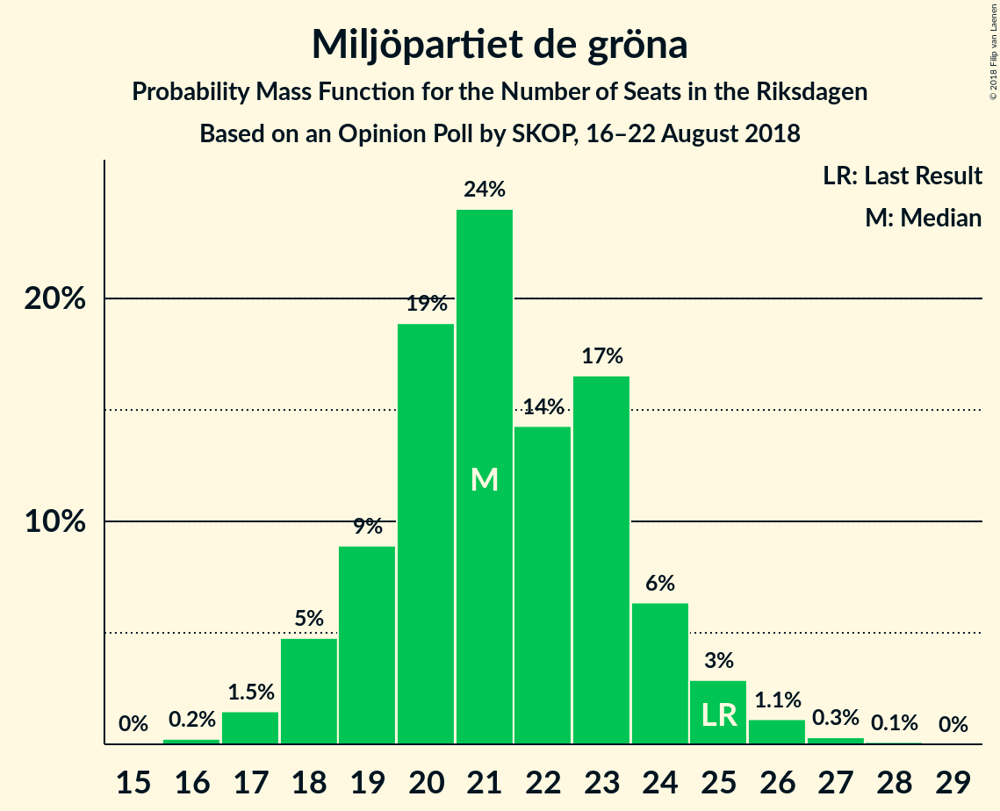

# Opinion Poll by SKOP, 16–22 August 2018

<a href="#voting-intentions">Voting Intentions</a> | <a href="#seats">Seats</a> | <a href="#coalitions">Coalitions</a> | <a href="#technical-information">Technical Information</a>

## Voting Intentions

### Confidence Intervals

| Party | Last Result | Poll Result | 80% Confidence Interval | 90% Confidence Interval | 95% Confidence Interval | 99% Confidence Interval |
|:-----:|:-----------:|:-----------:|:-----------------------:|:-----------------------:|:-----------------------:|:-----------------------:|
| Sveriges socialdemokratiska arbetareparti | 31.0% | 24.5% | 23.4–25.8% |23.0–26.1% |22.7–26.4% |22.2–27.0% |
| Sverigedemokraterna | 12.9% | 20.1% | 19.0–21.3% |18.7–21.6% |18.4–21.9% |17.9–22.4% |
| Moderata samlingspartiet | 23.3% | 17.1% | 16.1–18.2% |15.8–18.5% |15.5–18.8% |15.1–19.3% |
| Vänsterpartiet | 5.7% | 9.2% | 8.4–10.1% |8.2–10.3% |8.0–10.5% |7.7–10.9% |
| Centerpartiet | 6.1% | 8.2% | 7.5–9.0% |7.3–9.3% |7.1–9.4% |6.8–9.9% |
| Liberalerna | 5.4% | 6.3% | 5.7–7.0% |5.5–7.2% |5.3–7.4% |5.0–7.8% |
| Miljöpartiet de gröna | 6.9% | 5.8% | 5.2–6.5% |5.0–6.7% |4.9–6.9% |4.6–7.3% |
| Kristdemokraterna | 4.6% | 4.6% | 4.1–5.3% |3.9–5.5% |3.8–5.6% |3.6–5.9% |
| Feministiskt initiativ | 3.1% | 1.7% | 1.4–2.1% |1.3–2.3% |1.2–2.4% |1.1–2.6% |

*Note:* The poll result column reflects the actual value used in the calculations. Published results may vary slightly, and in addition be rounded to fewer digits.

## Seats

### Confidence Intervals

| Party | Last Result | Median | 80% Confidence Interval | 90% Confidence Interval | 95% Confidence Interval | 99% Confidence Interval |
|:-----:|:-----------:|:------:|:-----------------------:|:-----------------------:|:-----------------------:|:-----------------------:|
| <a href="#sveriges-socialdemokratiska-arbetareparti">Sveriges socialdemokratiska arbetareparti</a> | 113 | 102 | 84–102 |84–102 |82–102 |77–102 |
| <a href="#sverigedemokraterna">Sverigedemokraterna</a> | 49 | 71 | 70–73 |70–73 |70–78 |70–78 |
| <a href="#moderata-samlingspartiet">Moderata samlingspartiet</a> | 84 | 58 | 58–66 |58–66 |58–69 |54–71 |
| <a href="#vänsterpartiet">Vänsterpartiet</a> | 21 | 30 | 30–36 |30–42 |29–42 |28–42 |
| <a href="#centerpartiet">Centerpartiet</a> | 22 | 30 | 30 |30–31 |27–31 |27–35 |
| <a href="#liberalerna">Liberalerna</a> | 19 | 21 | 21–25 |21–25 |21–25 |21–25 |
| <a href="#miljöpartiet-de-gröna">Miljöpartiet de gröna</a> | 25 | 22 | 19–22 |19–22 |19–22 |16–22 |
| <a href="#kristdemokraterna">Kristdemokraterna</a> | 16 | 15 | 15–19 |15–19 |15–19 |15–22 |
| <a href="#feministiskt-initiativ">Feministiskt initiativ</a> | 0 | 0 | 0 |0 |0 |0 |

### Sveriges socialdemokratiska arbetareparti

*For a full overview of the results for this party, see the [Sveriges socialdemokratiska arbetareparti](party-sverigessocialdemokratiskaarbetareparti.html) page.*

| Number of Seats | Probability | Accumulated | Special Marks |
|:---------------:|:-----------:|:-----------:|:-------------:|
| 77 | 0.9% | 100% |  |
| 78 | 0% | 99.1% |  |
| 79 | 0% | 99.1% |  |
| 80 | 0% | 99.1% |  |
| 81 | 0% | 99.1% |  |
| 82 | 3% | 99.0% |  |
| 83 | 0.1% | 96% |  |
| 84 | 9% | 96% |  |
| 85 | 0.1% | 88% |  |
| 86 | 22% | 88% |  |
| 87 | 0% | 66% |  |
| 88 | 0% | 66% |  |
| 89 | 0.9% | 66% |  |
| 90 | 0% | 65% |  |
| 91 | 0% | 65% |  |
| 92 | 0.1% | 65% |  |
| 93 | 0% | 65% |  |
| 94 | 0% | 65% |  |
| 95 | 0% | 65% |  |
| 96 | 0% | 65% |  |
| 97 | 1.0% | 65% |  |
| 98 | 0% | 64% |  |
| 99 | 0% | 64% |  |
| 100 | 0% | 64% |  |
| 101 | 0% | 64% |  |
| 102 | 64% | 64% | Median |
| 103 | 0% | 0% |  |
| 104 | 0% | 0% |  |
| 105 | 0% | 0% |  |
| 106 | 0% | 0% |  |
| 107 | 0% | 0% |  |
| 108 | 0% | 0% |  |
| 109 | 0% | 0% |  |
| 110 | 0% | 0% |  |
| 111 | 0% | 0% |  |
| 112 | 0% | 0% |  |
| 113 | 0% | 0% | Last Result |

### Sverigedemokraterna

*For a full overview of the results for this party, see the [Sverigedemokraterna](party-sverigedemokraterna.html) page.*

| Number of Seats | Probability | Accumulated | Special Marks |
|:---------------:|:-----------:|:-----------:|:-------------:|
| 49 | 0% | 100% | Last Result |
| 50 | 0% | 100% |  |
| 51 | 0% | 100% |  |
| 52 | 0% | 100% |  |
| 53 | 0% | 100% |  |
| 54 | 0% | 100% |  |
| 55 | 0% | 100% |  |
| 56 | 0% | 100% |  |
| 57 | 0% | 100% |  |
| 58 | 0% | 100% |  |
| 59 | 0% | 100% |  |
| 60 | 0% | 100% |  |
| 61 | 0% | 100% |  |
| 62 | 0% | 100% |  |
| 63 | 0% | 100% |  |
| 64 | 0% | 100% |  |
| 65 | 0% | 100% |  |
| 66 | 0% | 100% |  |
| 67 | 0% | 100% |  |
| 68 | 0% | 100% |  |
| 69 | 0.2% | 100% |  |
| 70 | 23% | 99.8% |  |
| 71 | 65% | 77% | Median |
| 72 | 0% | 12% |  |
| 73 | 9% | 12% |  |
| 74 | 0% | 4% |  |
| 75 | 0% | 4% |  |
| 76 | 0.1% | 4% |  |
| 77 | 0% | 4% |  |
| 78 | 3% | 3% |  |
| 79 | 0% | 0.2% |  |
| 80 | 0% | 0.2% |  |
| 81 | 0% | 0.2% |  |
| 82 | 0% | 0.1% |  |
| 83 | 0% | 0.1% |  |
| 84 | 0% | 0.1% |  |
| 85 | 0% | 0.1% |  |
| 86 | 0.1% | 0.1% |  |
| 87 | 0% | 0% |  |

### Moderata samlingspartiet

*For a full overview of the results for this party, see the [Moderata samlingspartiet](party-moderatasamlingspartiet.html) page.*

| Number of Seats | Probability | Accumulated | Special Marks |
|:---------------:|:-----------:|:-----------:|:-------------:|
| 54 | 1.0% | 100% |  |
| 55 | 0% | 98.9% |  |
| 56 | 0% | 98.9% |  |
| 57 | 0% | 98.9% |  |
| 58 | 73% | 98.9% | Median |
| 59 | 0% | 26% |  |
| 60 | 0.1% | 26% |  |
| 61 | 0.2% | 26% |  |
| 62 | 0% | 26% |  |
| 63 | 0% | 26% |  |
| 64 | 0% | 26% |  |
| 65 | 0% | 26% |  |
| 66 | 22% | 26% |  |
| 67 | 0.9% | 4% |  |
| 68 | 0% | 3% |  |
| 69 | 0.9% | 3% |  |
| 70 | 0% | 2% |  |
| 71 | 2% | 2% |  |
| 72 | 0% | 0% |  |
| 73 | 0% | 0% |  |
| 74 | 0% | 0% |  |
| 75 | 0% | 0% |  |
| 76 | 0% | 0% |  |
| 77 | 0% | 0% |  |
| 78 | 0% | 0% |  |
| 79 | 0% | 0% |  |
| 80 | 0% | 0% |  |
| 81 | 0% | 0% |  |
| 82 | 0% | 0% |  |
| 83 | 0% | 0% |  |
| 84 | 0% | 0% | Last Result |

### Vänsterpartiet

*For a full overview of the results for this party, see the [Vänsterpartiet](party-vänsterpartiet.html) page.*

| Number of Seats | Probability | Accumulated | Special Marks |
|:---------------:|:-----------:|:-----------:|:-------------:|
| 21 | 0% | 100% | Last Result |
| 22 | 0% | 100% |  |
| 23 | 0% | 100% |  |
| 24 | 0% | 100% |  |
| 25 | 0% | 100% |  |
| 26 | 0.1% | 100% |  |
| 27 | 0% | 99.9% |  |
| 28 | 0.9% | 99.9% |  |
| 29 | 2% | 99.1% |  |
| 30 | 64% | 97% | Median |
| 31 | 1.0% | 33% |  |
| 32 | 22% | 32% |  |
| 33 | 0% | 10% |  |
| 34 | 0% | 10% |  |
| 35 | 0% | 10% |  |
| 36 | 1.2% | 10% |  |
| 37 | 0% | 9% |  |
| 38 | 0.2% | 9% |  |
| 39 | 0% | 9% |  |
| 40 | 0% | 9% |  |
| 41 | 0% | 9% |  |
| 42 | 9% | 9% |  |
| 43 | 0% | 0% |  |

### Centerpartiet

*For a full overview of the results for this party, see the [Centerpartiet](party-centerpartiet.html) page.*

| Number of Seats | Probability | Accumulated | Special Marks |
|:---------------:|:-----------:|:-----------:|:-------------:|
| 22 | 0% | 100% | Last Result |
| 23 | 0.2% | 100% |  |
| 24 | 0% | 99.8% |  |
| 25 | 0% | 99.8% |  |
| 26 | 0% | 99.8% |  |
| 27 | 2% | 99.8% |  |
| 28 | 0% | 97% |  |
| 29 | 0% | 97% |  |
| 30 | 88% | 97% | Median |
| 31 | 9% | 10% |  |
| 32 | 0% | 1.1% |  |
| 33 | 0% | 1.0% |  |
| 34 | 0.1% | 1.0% |  |
| 35 | 0.9% | 0.9% |  |
| 36 | 0% | 0% |  |

### Liberalerna

*For a full overview of the results for this party, see the [Liberalerna](party-liberalerna.html) page.*

| Number of Seats | Probability | Accumulated | Special Marks |
|:---------------:|:-----------:|:-----------:|:-------------:|
| 19 | 0% | 100% | Last Result |
| 20 | 0% | 100% |  |
| 21 | 64% | 100% | Median |
| 22 | 1.1% | 36% |  |
| 23 | 0% | 35% |  |
| 24 | 24% | 35% |  |
| 25 | 11% | 11% |  |
| 26 | 0.1% | 0.2% |  |
| 27 | 0% | 0.1% |  |
| 28 | 0% | 0.1% |  |
| 29 | 0.1% | 0.1% |  |
| 30 | 0% | 0% |  |

### Miljöpartiet de gröna

*For a full overview of the results for this party, see the [Miljöpartiet de gröna](party-miljöpartietdegröna.html) page.*

| Number of Seats | Probability | Accumulated | Special Marks |
|:---------------:|:-----------:|:-----------:|:-------------:|
| 16 | 0.9% | 100% |  |
| 17 | 0% | 99.1% |  |
| 18 | 0.9% | 99.1% |  |
| 19 | 9% | 98% |  |
| 20 | 0% | 90% |  |
| 21 | 1.2% | 89% |  |
| 22 | 88% | 88% | Median |
| 23 | 0% | 0.2% |  |
| 24 | 0% | 0.1% |  |
| 25 | 0% | 0.1% | Last Result |
| 26 | 0.1% | 0.1% |  |
| 27 | 0% | 0% |  |

### Kristdemokraterna

*For a full overview of the results for this party, see the [Kristdemokraterna](party-kristdemokraterna.html) page.*

| Number of Seats | Probability | Accumulated | Special Marks |
|:---------------:|:-----------:|:-----------:|:-------------:|
| 0 | 0.1% | 100% |  |
| 1 | 0% | 99.9% |  |
| 2 | 0% | 99.9% |  |
| 3 | 0% | 99.9% |  |
| 4 | 0% | 99.9% |  |
| 5 | 0% | 99.9% |  |
| 6 | 0% | 99.9% |  |
| 7 | 0% | 99.9% |  |
| 8 | 0% | 99.9% |  |
| 9 | 0% | 99.9% |  |
| 10 | 0% | 99.9% |  |
| 11 | 0% | 99.9% |  |
| 12 | 0% | 99.9% |  |
| 13 | 0% | 99.9% |  |
| 14 | 0% | 99.9% |  |
| 15 | 66% | 99.9% | Median |
| 16 | 0.1% | 34% | Last Result |
| 17 | 9% | 34% |  |
| 18 | 0% | 25% |  |
| 19 | 24% | 25% |  |
| 20 | 0% | 1.1% |  |
| 21 | 0% | 1.1% |  |
| 22 | 1.1% | 1.1% |  |
| 23 | 0% | 0% |  |

### Feministiskt initiativ

*For a full overview of the results for this party, see the [Feministiskt initiativ](party-feministisktinitiativ.html) page.*

| Number of Seats | Probability | Accumulated | Special Marks |
|:---------------:|:-----------:|:-----------:|:-------------:|
| 0 | 100% | 100% | Last Result, Median |

## Coalitions

### Confidence Intervals

| Coalition | Last Result | Median | Majority? | 80% Confidence Interval | 90% Confidence Interval | 95% Confidence Interval | 99% Confidence Interval |
|:---------:|:-----------:|:------:|:---------:|:-----------------------:|:-----------------------:|:-----------------------:|:-----------------------:|
| Sverigedemokraterna – Moderata samlingspartiet – Kristdemokraterna | 149 | 144 | 0% | 144–155 | 144–155 | 144–164 | 143–164 |
| Sveriges socialdemokratiska arbetareparti – Moderata samlingspartiet | 197 | 160 | 0% | 144–160 | 142–160 | 142–160 | 142–160 |
| Sveriges socialdemokratiska arbetareparti – Vänsterpartiet – Miljöpartiet de gröna – Feministiskt initiativ | 159 | 154 | 0% | 140–154 | 140–154 | 133–154 | 126–154 |
| Sveriges socialdemokratiska arbetareparti – Vänsterpartiet – Miljöpartiet de gröna | 159 | 154 | 0% | 140–154 | 140–154 | 133–154 | 126–154 |
| Sverigedemokraterna – Moderata samlingspartiet | 133 | 129 | 0% | 129–136 | 129–136 | 129–146 | 124–149 |
| Moderata samlingspartiet – Centerpartiet – Liberalerna – Kristdemokraterna | 141 | 124 | 0% | 124–139 | 124–139 | 124–139 | 124–145 |
| Sveriges socialdemokratiska arbetareparti – Vänsterpartiet | 134 | 132 | 0% | 118–132 | 118–132 | 111–132 | 108–133 |
| Sveriges socialdemokratiska arbetareparti – Miljöpartiet de gröna | 138 | 124 | 0% | 104–124 | 103–124 | 103–124 | 95–124 |
| Moderata samlingspartiet – Centerpartiet – Liberalerna | 125 | 109 | 0% | 109–120 | 109–120 | 109–123 | 106–126 |
| Moderata samlingspartiet – Centerpartiet – Kristdemokraterna | 122 | 103 | 0% | 103–115 | 103–115 | 103–115 | 103–121 |
| Moderata samlingspartiet – Centerpartiet | 106 | 88 | 0% | 88–96 | 88–96 | 88–98 | 84–102 |

### Sverigedemokraterna – Moderata samlingspartiet – Kristdemokraterna

| Number of Seats | Probability | Accumulated | Special Marks |
|:---------------:|:-----------:|:-----------:|:-------------:|
| 142 | 0.1% | 100% |  |
| 143 | 1.0% | 99.9% |  |
| 144 | 64% | 98.9% | Median |
| 145 | 0% | 35% |  |
| 146 | 0% | 35% |  |
| 147 | 0% | 35% |  |
| 148 | 9% | 35% |  |
| 149 | 0.1% | 26% | Last Result |
| 150 | 0% | 26% |  |
| 151 | 0% | 26% |  |
| 152 | 0.2% | 26% |  |
| 153 | 0% | 26% |  |
| 154 | 0% | 26% |  |
| 155 | 22% | 26% |  |
| 156 | 0% | 4% |  |
| 157 | 0% | 4% |  |
| 158 | 0% | 4% |  |
| 159 | 0% | 4% |  |
| 160 | 0% | 4% |  |
| 161 | 0% | 4% |  |
| 162 | 1.0% | 4% |  |
| 163 | 0% | 3% |  |
| 164 | 3% | 3% |  |
| 165 | 0% | 0% |  |

### Sveriges socialdemokratiska arbetareparti – Moderata samlingspartiet

| Number of Seats | Probability | Accumulated | Special Marks |
|:---------------:|:-----------:|:-----------:|:-------------:|
| 142 | 9% | 100% |  |
| 143 | 0.4% | 91% |  |
| 144 | 0.9% | 91% |  |
| 145 | 0% | 90% |  |
| 146 | 0% | 90% |  |
| 147 | 0% | 90% |  |
| 148 | 0% | 90% |  |
| 149 | 0% | 90% |  |
| 150 | 0% | 90% |  |
| 151 | 1.0% | 90% |  |
| 152 | 22% | 89% |  |
| 153 | 2% | 67% |  |
| 154 | 0% | 65% |  |
| 155 | 0% | 65% |  |
| 156 | 0% | 65% |  |
| 157 | 0% | 65% |  |
| 158 | 0.9% | 65% |  |
| 159 | 0% | 64% |  |
| 160 | 64% | 64% | Median |
| 161 | 0% | 0% |  |
| 162 | 0% | 0% |  |
| 163 | 0% | 0% |  |
| 164 | 0% | 0% |  |
| 165 | 0% | 0% |  |
| 166 | 0% | 0% |  |
| 167 | 0% | 0% |  |
| 168 | 0% | 0% |  |
| 169 | 0% | 0% |  |
| 170 | 0% | 0% |  |
| 171 | 0% | 0% |  |
| 172 | 0% | 0% |  |
| 173 | 0% | 0% |  |
| 174 | 0% | 0% |  |
| 175 | 0% | 0% | Majority |
| 176 | 0% | 0% |  |
| 177 | 0% | 0% |  |
| 178 | 0% | 0% |  |
| 179 | 0% | 0% |  |
| 180 | 0% | 0% |  |
| 181 | 0% | 0% |  |
| 182 | 0% | 0% |  |
| 183 | 0% | 0% |  |
| 184 | 0% | 0% |  |
| 185 | 0% | 0% |  |
| 186 | 0% | 0% |  |
| 187 | 0% | 0% |  |
| 188 | 0% | 0% |  |
| 189 | 0% | 0% |  |
| 190 | 0% | 0% |  |
| 191 | 0% | 0% |  |
| 192 | 0% | 0% |  |
| 193 | 0% | 0% |  |
| 194 | 0% | 0% |  |
| 195 | 0% | 0% |  |
| 196 | 0% | 0% |  |
| 197 | 0% | 0% | Last Result |

### Sveriges socialdemokratiska arbetareparti – Vänsterpartiet – Miljöpartiet de gröna – Feministiskt initiativ

| Number of Seats | Probability | Accumulated | Special Marks |
|:---------------:|:-----------:|:-----------:|:-------------:|
| 126 | 0.9% | 100% |  |
| 127 | 0% | 99.1% |  |
| 128 | 0% | 99.1% |  |
| 129 | 0% | 99.1% |  |
| 130 | 0% | 99.1% |  |
| 131 | 0% | 99.1% |  |
| 132 | 0% | 99.1% |  |
| 133 | 3% | 99.1% |  |
| 134 | 0% | 96% |  |
| 135 | 0% | 96% |  |
| 136 | 0% | 96% |  |
| 137 | 0.1% | 96% |  |
| 138 | 0% | 96% |  |
| 139 | 0% | 96% |  |
| 140 | 22% | 96% |  |
| 141 | 0% | 74% |  |
| 142 | 0.2% | 74% |  |
| 143 | 0% | 74% |  |
| 144 | 0% | 74% |  |
| 145 | 9% | 74% |  |
| 146 | 0% | 65% |  |
| 147 | 0% | 65% |  |
| 148 | 0% | 65% |  |
| 149 | 0% | 65% |  |
| 150 | 0% | 65% |  |
| 151 | 0% | 65% |  |
| 152 | 0% | 65% |  |
| 153 | 0% | 65% |  |
| 154 | 65% | 65% | Median |
| 155 | 0% | 0.1% |  |
| 156 | 0% | 0.1% |  |
| 157 | 0% | 0.1% |  |
| 158 | 0.1% | 0.1% |  |
| 159 | 0% | 0% | Last Result |

### Sveriges socialdemokratiska arbetareparti – Vänsterpartiet – Miljöpartiet de gröna

| Number of Seats | Probability | Accumulated | Special Marks |
|:---------------:|:-----------:|:-----------:|:-------------:|
| 126 | 0.9% | 100% |  |
| 127 | 0% | 99.1% |  |
| 128 | 0% | 99.1% |  |
| 129 | 0% | 99.1% |  |
| 130 | 0% | 99.1% |  |
| 131 | 0% | 99.1% |  |
| 132 | 0% | 99.1% |  |
| 133 | 3% | 99.1% |  |
| 134 | 0% | 96% |  |
| 135 | 0% | 96% |  |
| 136 | 0% | 96% |  |
| 137 | 0.1% | 96% |  |
| 138 | 0% | 96% |  |
| 139 | 0% | 96% |  |
| 140 | 22% | 96% |  |
| 141 | 0% | 74% |  |
| 142 | 0.2% | 74% |  |
| 143 | 0% | 74% |  |
| 144 | 0% | 74% |  |
| 145 | 9% | 74% |  |
| 146 | 0% | 65% |  |
| 147 | 0% | 65% |  |
| 148 | 0% | 65% |  |
| 149 | 0% | 65% |  |
| 150 | 0% | 65% |  |
| 151 | 0% | 65% |  |
| 152 | 0% | 65% |  |
| 153 | 0% | 65% |  |
| 154 | 65% | 65% | Median |
| 155 | 0% | 0.1% |  |
| 156 | 0% | 0.1% |  |
| 157 | 0% | 0.1% |  |
| 158 | 0.1% | 0.1% |  |
| 159 | 0% | 0% | Last Result |

### Sverigedemokraterna – Moderata samlingspartiet

| Number of Seats | Probability | Accumulated | Special Marks |
|:---------------:|:-----------:|:-----------:|:-------------:|
| 124 | 1.0% | 100% |  |
| 125 | 0% | 99.0% |  |
| 126 | 0% | 99.0% |  |
| 127 | 0% | 99.0% |  |
| 128 | 0% | 98.9% |  |
| 129 | 64% | 98.9% | Median |
| 130 | 0.2% | 35% |  |
| 131 | 9% | 35% |  |
| 132 | 0% | 26% |  |
| 133 | 0% | 26% | Last Result |
| 134 | 0.1% | 26% |  |
| 135 | 0% | 26% |  |
| 136 | 22% | 26% |  |
| 137 | 0% | 4% |  |
| 138 | 0% | 4% |  |
| 139 | 0% | 4% |  |
| 140 | 0.9% | 4% |  |
| 141 | 0% | 3% |  |
| 142 | 0% | 3% |  |
| 143 | 0% | 3% |  |
| 144 | 0% | 3% |  |
| 145 | 0.9% | 3% |  |
| 146 | 0.1% | 3% |  |
| 147 | 0% | 2% |  |
| 148 | 0% | 2% |  |
| 149 | 2% | 2% |  |
| 150 | 0% | 0% |  |

### Moderata samlingspartiet – Centerpartiet – Liberalerna – Kristdemokraterna

| Number of Seats | Probability | Accumulated | Special Marks |
|:---------------:|:-----------:|:-----------:|:-------------:|
| 118 | 0% | 100% |  |
| 119 | 0% | 99.9% |  |
| 120 | 0% | 99.9% |  |
| 121 | 0% | 99.9% |  |
| 122 | 0% | 99.9% |  |
| 123 | 0.2% | 99.9% |  |
| 124 | 64% | 99.8% | Median |
| 125 | 1.0% | 36% |  |
| 126 | 0% | 35% |  |
| 127 | 0% | 35% |  |
| 128 | 0% | 35% |  |
| 129 | 0% | 35% |  |
| 130 | 0% | 35% |  |
| 131 | 9% | 35% |  |
| 132 | 0% | 26% |  |
| 133 | 0% | 26% |  |
| 134 | 0% | 26% |  |
| 135 | 0% | 26% |  |
| 136 | 0.1% | 26% |  |
| 137 | 0% | 26% |  |
| 138 | 3% | 26% |  |
| 139 | 22% | 24% |  |
| 140 | 0% | 2% |  |
| 141 | 0% | 2% | Last Result |
| 142 | 0% | 2% |  |
| 143 | 0% | 2% |  |
| 144 | 0% | 2% |  |
| 145 | 2% | 2% |  |
| 146 | 0% | 0% |  |

### Sveriges socialdemokratiska arbetareparti – Vänsterpartiet

| Number of Seats | Probability | Accumulated | Special Marks |
|:---------------:|:-----------:|:-----------:|:-------------:|
| 108 | 0.9% | 100% |  |
| 109 | 0% | 99.1% |  |
| 110 | 0% | 99.1% |  |
| 111 | 2% | 99.1% |  |
| 112 | 0% | 97% |  |
| 113 | 0% | 97% |  |
| 114 | 0% | 97% |  |
| 115 | 0% | 97% |  |
| 116 | 0% | 97% |  |
| 117 | 0.9% | 97% |  |
| 118 | 22% | 96% |  |
| 119 | 0.1% | 74% |  |
| 120 | 0.2% | 74% |  |
| 121 | 0% | 74% |  |
| 122 | 0% | 74% |  |
| 123 | 0% | 74% |  |
| 124 | 0% | 74% |  |
| 125 | 0% | 74% |  |
| 126 | 9% | 74% |  |
| 127 | 0% | 65% |  |
| 128 | 0% | 65% |  |
| 129 | 0% | 65% |  |
| 130 | 0% | 65% |  |
| 131 | 0% | 65% |  |
| 132 | 64% | 65% | Median |
| 133 | 1.0% | 1.1% |  |
| 134 | 0% | 0% | Last Result |

### Sveriges socialdemokratiska arbetareparti – Miljöpartiet de gröna

| Number of Seats | Probability | Accumulated | Special Marks |
|:---------------:|:-----------:|:-----------:|:-------------:|
| 95 | 0.9% | 100% |  |
| 96 | 0% | 99.1% |  |
| 97 | 0% | 99.1% |  |
| 98 | 0% | 99.1% |  |
| 99 | 0% | 99.1% |  |
| 100 | 0% | 99.1% |  |
| 101 | 0% | 99.1% |  |
| 102 | 0% | 99.1% |  |
| 103 | 9% | 99.1% |  |
| 104 | 3% | 90% |  |
| 105 | 0.9% | 88% |  |
| 106 | 0% | 87% |  |
| 107 | 0% | 87% |  |
| 108 | 22% | 87% |  |
| 109 | 0% | 65% |  |
| 110 | 0% | 65% |  |
| 111 | 0.1% | 65% |  |
| 112 | 0% | 65% |  |
| 113 | 0% | 65% |  |
| 114 | 0% | 65% |  |
| 115 | 0% | 65% |  |
| 116 | 0% | 65% |  |
| 117 | 0% | 65% |  |
| 118 | 1.0% | 65% |  |
| 119 | 0% | 64% |  |
| 120 | 0% | 64% |  |
| 121 | 0% | 64% |  |
| 122 | 0% | 64% |  |
| 123 | 0% | 64% |  |
| 124 | 64% | 64% | Median |
| 125 | 0% | 0% |  |
| 126 | 0% | 0% |  |
| 127 | 0% | 0% |  |
| 128 | 0% | 0% |  |
| 129 | 0% | 0% |  |
| 130 | 0% | 0% |  |
| 131 | 0% | 0% |  |
| 132 | 0% | 0% |  |
| 133 | 0% | 0% |  |
| 134 | 0% | 0% |  |
| 135 | 0% | 0% |  |
| 136 | 0% | 0% |  |
| 137 | 0% | 0% |  |
| 138 | 0% | 0% | Last Result |

### Moderata samlingspartiet – Centerpartiet – Liberalerna

| Number of Seats | Probability | Accumulated | Special Marks |
|:---------------:|:-----------:|:-----------:|:-------------:|
| 106 | 1.0% | 100% |  |
| 107 | 0.2% | 98.9% |  |
| 108 | 0% | 98.8% |  |
| 109 | 64% | 98.8% | Median |
| 110 | 0% | 35% |  |
| 111 | 0% | 35% |  |
| 112 | 0% | 35% |  |
| 113 | 0% | 35% |  |
| 114 | 9% | 35% |  |
| 115 | 0% | 26% |  |
| 116 | 0.2% | 26% |  |
| 117 | 0% | 26% |  |
| 118 | 0% | 26% |  |
| 119 | 0% | 26% |  |
| 120 | 22% | 26% |  |
| 121 | 0.1% | 4% |  |
| 122 | 0% | 4% |  |
| 123 | 3% | 4% |  |
| 124 | 0% | 0.9% |  |
| 125 | 0% | 0.9% | Last Result |
| 126 | 0.9% | 0.9% |  |
| 127 | 0% | 0% |  |

### Moderata samlingspartiet – Centerpartiet – Kristdemokraterna

| Number of Seats | Probability | Accumulated | Special Marks |
|:---------------:|:-----------:|:-----------:|:-------------:|
| 96 | 0% | 100% |  |
| 97 | 0% | 99.9% |  |
| 98 | 0% | 99.9% |  |
| 99 | 0.1% | 99.9% |  |
| 100 | 0% | 99.8% |  |
| 101 | 0% | 99.8% |  |
| 102 | 0% | 99.8% |  |
| 103 | 65% | 99.8% | Median |
| 104 | 0% | 35% |  |
| 105 | 0% | 35% |  |
| 106 | 9% | 35% |  |
| 107 | 0.1% | 26% |  |
| 108 | 0% | 26% |  |
| 109 | 0% | 26% |  |
| 110 | 0% | 26% |  |
| 111 | 0% | 26% |  |
| 112 | 0% | 26% |  |
| 113 | 3% | 26% |  |
| 114 | 0% | 24% |  |
| 115 | 22% | 24% |  |
| 116 | 0% | 2% |  |
| 117 | 0% | 2% |  |
| 118 | 0% | 2% |  |
| 119 | 0% | 2% |  |
| 120 | 0% | 2% |  |
| 121 | 2% | 2% |  |
| 122 | 0% | 0% | Last Result |

### Moderata samlingspartiet – Centerpartiet

| Number of Seats | Probability | Accumulated | Special Marks |
|:---------------:|:-----------:|:-----------:|:-------------:|
| 81 | 0% | 100% |  |
| 82 | 0% | 99.9% |  |
| 83 | 0.1% | 99.9% |  |
| 84 | 1.0% | 99.8% |  |
| 85 | 0% | 98.8% |  |
| 86 | 0% | 98.8% |  |
| 87 | 0% | 98.7% |  |
| 88 | 64% | 98.7% | Median |
| 89 | 9% | 35% |  |
| 90 | 0% | 26% |  |
| 91 | 0.2% | 26% |  |
| 92 | 0.1% | 26% |  |
| 93 | 0% | 26% |  |
| 94 | 0% | 26% |  |
| 95 | 0% | 26% |  |
| 96 | 22% | 26% |  |
| 97 | 0% | 4% |  |
| 98 | 2% | 4% |  |
| 99 | 0.9% | 2% |  |
| 100 | 0% | 0.9% |  |
| 101 | 0% | 0.9% |  |
| 102 | 0.9% | 0.9% |  |
| 103 | 0% | 0% |  |
| 104 | 0% | 0% |  |
| 105 | 0% | 0% |  |
| 106 | 0% | 0% | Last Result |

## Technical Information

### Opinion Poll

+ **Polling firm:** SKOP
+ **Commissioner(s):** —
+ **Fieldwork period:** 16–22 August 2018

### Calculations

+ **Sample size:** 2100
+ **Simulations done:** 1,024
+ **Error estimate:** 4.02%

