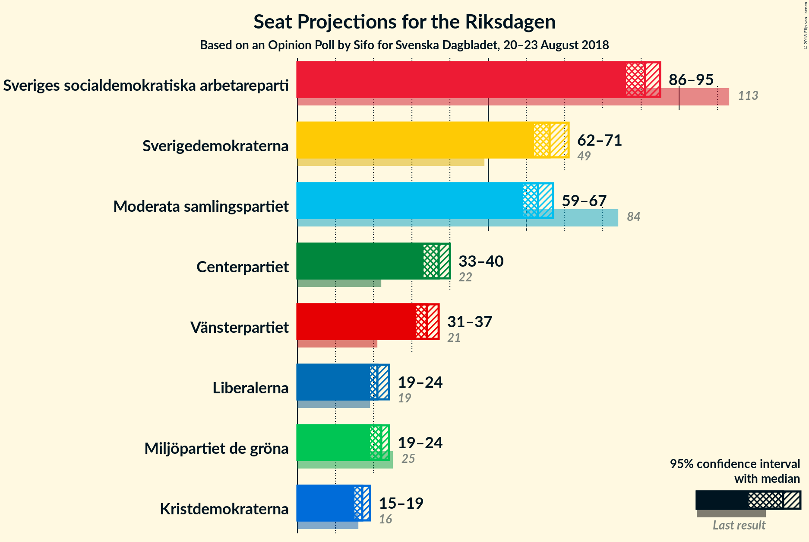
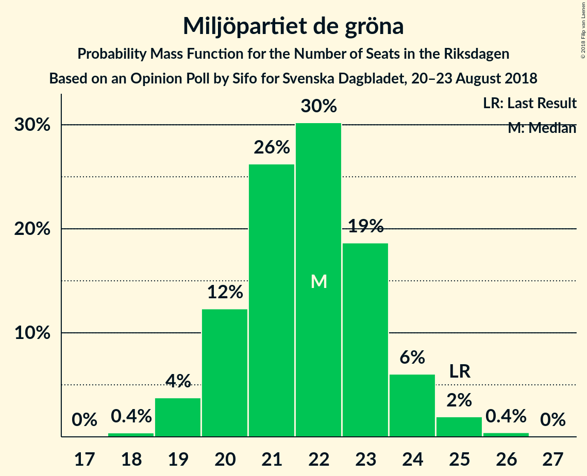

# Opinion Poll by Sifo for Svenska Dagbladet, 20–23 August 2018

<a href="#voting-intentions">Voting Intentions</a> | <a href="#seats">Seats</a> | <a href="#coalitions">Coalitions</a> | <a href="#technical-information">Technical Information</a>

## Voting Intentions

### Confidence Intervals

| Party | Last Result | Poll Result | 80% Confidence Interval | 90% Confidence Interval | 95% Confidence Interval | 99% Confidence Interval |
|:-----:|:-----------:|:-----------:|:-----------------------:|:-----------------------:|:-----------------------:|:-----------------------:|
| Sveriges socialdemokratiska arbetareparti | 31.0% | 25.4% | 24.5–26.3% |24.3–26.5% |24.1–26.7% |23.7–27.2% |
| Sverigedemokraterna | 12.9% | 18.6% | 17.8–19.4% |17.6–19.6% |17.4–19.8% |17.1–20.2% |
| Moderata samlingspartiet | 23.3% | 17.6% | 16.9–18.4% |16.6–18.6% |16.5–18.8% |16.1–19.2% |
| Centerpartiet | 6.1% | 10.3% | 9.7–10.9% |9.5–11.1% |9.4–11.3% |9.1–11.6% |
| Vänsterpartiet | 5.7% | 9.5% | 8.9–10.1% |8.8–10.3% |8.6–10.4% |8.4–10.7% |
| Miljöpartiet de gröna | 6.9% | 6.1% | 5.6–6.6% |5.5–6.8% |5.4–6.9% |5.2–7.1% |
| Liberalerna | 5.4% | 5.9% | 5.5–6.4% |5.3–6.6% |5.2–6.7% |5.0–6.9% |
| Kristdemokraterna | 4.6% | 4.7% | 4.3–5.2% |4.2–5.3% |4.1–5.4% |3.9–5.6% |

*Note:* The poll result column reflects the actual value used in the calculations. Published results may vary slightly, and in addition be rounded to fewer digits.

## Seats

### Confidence Intervals

| Party | Last Result | Median | 80% Confidence Interval | 90% Confidence Interval | 95% Confidence Interval | 99% Confidence Interval |
|:-----:|:-----------:|:------:|:-----------------------:|:-----------------------:|:-----------------------:|:-----------------------:|
| <a href="#sveriges-socialdemokratiska-arbetareparti">Sveriges socialdemokratiska arbetareparti</a> | 113 | 91 | 87–93 |86–94 |86–95 |84–97 |
| <a href="#sverigedemokraterna">Sverigedemokraterna</a> | 49 | 66 | 63–69 |63–70 |62–71 |61–72 |
| <a href="#moderata-samlingspartiet">Moderata samlingspartiet</a> | 84 | 63 | 60–65 |59–66 |59–67 |57–68 |
| <a href="#centerpartiet">Centerpartiet</a> | 22 | 37 | 34–39 |34–39 |33–40 |32–41 |
| <a href="#vänsterpartiet">Vänsterpartiet</a> | 21 | 34 | 32–36 |31–36 |31–37 |30–38 |
| <a href="#miljöpartiet-de-gröna">Miljöpartiet de gröna</a> | 25 | 22 | 20–23 |20–24 |19–24 |19–25 |
| <a href="#liberalerna">Liberalerna</a> | 19 | 21 | 19–23 |19–23 |19–24 |18–25 |
| <a href="#kristdemokraterna">Kristdemokraterna</a> | 16 | 17 | 15–18 |15–19 |15–19 |0–20 |

### Sveriges socialdemokratiska arbetareparti

*For a full overview of the results for this party, see the [Sveriges socialdemokratiska arbetareparti](party-sverigessocialdemokratiskaarbetareparti.html) page.*

| Number of Seats | Probability | Accumulated | Special Marks |
|:---------------:|:-----------:|:-----------:|:-------------:|
| 83 | 0.2% | 100% |  |
| 84 | 0.6% | 99.8% |  |
| 85 | 1.5% | 99.2% |  |
| 86 | 3% | 98% |  |
| 87 | 7% | 94% |  |
| 88 | 13% | 88% |  |
| 89 | 11% | 74% |  |
| 90 | 13% | 63% |  |
| 91 | 19% | 50% | Median |
| 92 | 12% | 31% |  |
| 93 | 10% | 20% |  |
| 94 | 5% | 10% |  |
| 95 | 3% | 5% |  |
| 96 | 1.4% | 2% |  |
| 97 | 0.5% | 0.7% |  |
| 98 | 0.2% | 0.3% |  |
| 99 | 0.1% | 0.1% |  |
| 100 | 0% | 0% |  |
| 101 | 0% | 0% |  |
| 102 | 0% | 0% |  |
| 103 | 0% | 0% |  |
| 104 | 0% | 0% |  |
| 105 | 0% | 0% |  |
| 106 | 0% | 0% |  |
| 107 | 0% | 0% |  |
| 108 | 0% | 0% |  |
| 109 | 0% | 0% |  |
| 110 | 0% | 0% |  |
| 111 | 0% | 0% |  |
| 112 | 0% | 0% |  |
| 113 | 0% | 0% | Last Result |

### Sverigedemokraterna

*For a full overview of the results for this party, see the [Sverigedemokraterna](party-sverigedemokraterna.html) page.*

| Number of Seats | Probability | Accumulated | Special Marks |
|:---------------:|:-----------:|:-----------:|:-------------:|
| 49 | 0% | 100% | Last Result |
| 50 | 0% | 100% |  |
| 51 | 0% | 100% |  |
| 52 | 0% | 100% |  |
| 53 | 0% | 100% |  |
| 54 | 0% | 100% |  |
| 55 | 0% | 100% |  |
| 56 | 0% | 100% |  |
| 57 | 0% | 100% |  |
| 58 | 0% | 100% |  |
| 59 | 0.1% | 100% |  |
| 60 | 0.2% | 99.9% |  |
| 61 | 0.8% | 99.7% |  |
| 62 | 3% | 98.9% |  |
| 63 | 9% | 96% |  |
| 64 | 15% | 88% |  |
| 65 | 17% | 73% |  |
| 66 | 15% | 56% | Median |
| 67 | 12% | 41% |  |
| 68 | 13% | 29% |  |
| 69 | 9% | 16% |  |
| 70 | 4% | 7% |  |
| 71 | 2% | 3% |  |
| 72 | 0.5% | 0.8% |  |
| 73 | 0.2% | 0.3% |  |
| 74 | 0% | 0.1% |  |
| 75 | 0% | 0% |  |

### Moderata samlingspartiet

*For a full overview of the results for this party, see the [Moderata samlingspartiet](party-moderatasamlingspartiet.html) page.*

| Number of Seats | Probability | Accumulated | Special Marks |
|:---------------:|:-----------:|:-----------:|:-------------:|
| 56 | 0.1% | 100% |  |
| 57 | 0.5% | 99.9% |  |
| 58 | 2% | 99.3% |  |
| 59 | 6% | 98% |  |
| 60 | 10% | 91% |  |
| 61 | 12% | 81% |  |
| 62 | 15% | 69% |  |
| 63 | 21% | 54% | Median |
| 64 | 15% | 33% |  |
| 65 | 9% | 18% |  |
| 66 | 5% | 9% |  |
| 67 | 2% | 3% |  |
| 68 | 0.9% | 1.3% |  |
| 69 | 0.2% | 0.4% |  |
| 70 | 0.1% | 0.2% |  |
| 71 | 0% | 0% |  |
| 72 | 0% | 0% |  |
| 73 | 0% | 0% |  |
| 74 | 0% | 0% |  |
| 75 | 0% | 0% |  |
| 76 | 0% | 0% |  |
| 77 | 0% | 0% |  |
| 78 | 0% | 0% |  |
| 79 | 0% | 0% |  |
| 80 | 0% | 0% |  |
| 81 | 0% | 0% |  |
| 82 | 0% | 0% |  |
| 83 | 0% | 0% |  |
| 84 | 0% | 0% | Last Result |

### Centerpartiet

*For a full overview of the results for this party, see the [Centerpartiet](party-centerpartiet.html) page.*

| Number of Seats | Probability | Accumulated | Special Marks |
|:---------------:|:-----------:|:-----------:|:-------------:|
| 22 | 0% | 100% | Last Result |
| 23 | 0% | 100% |  |
| 24 | 0% | 100% |  |
| 25 | 0% | 100% |  |
| 26 | 0% | 100% |  |
| 27 | 0% | 100% |  |
| 28 | 0% | 100% |  |
| 29 | 0% | 100% |  |
| 30 | 0% | 100% |  |
| 31 | 0.1% | 100% |  |
| 32 | 0.5% | 99.9% |  |
| 33 | 2% | 99.4% |  |
| 34 | 8% | 97% |  |
| 35 | 13% | 90% |  |
| 36 | 26% | 77% |  |
| 37 | 20% | 51% | Median |
| 38 | 16% | 31% |  |
| 39 | 11% | 15% |  |
| 40 | 4% | 5% |  |
| 41 | 0.9% | 1.2% |  |
| 42 | 0.2% | 0.3% |  |
| 43 | 0.1% | 0.1% |  |
| 44 | 0% | 0% |  |

### Vänsterpartiet

*For a full overview of the results for this party, see the [Vänsterpartiet](party-vänsterpartiet.html) page.*

| Number of Seats | Probability | Accumulated | Special Marks |
|:---------------:|:-----------:|:-----------:|:-------------:|
| 21 | 0% | 100% | Last Result |
| 22 | 0% | 100% |  |
| 23 | 0% | 100% |  |
| 24 | 0% | 100% |  |
| 25 | 0% | 100% |  |
| 26 | 0% | 100% |  |
| 27 | 0% | 100% |  |
| 28 | 0% | 100% |  |
| 29 | 0.3% | 100% |  |
| 30 | 2% | 99.7% |  |
| 31 | 4% | 98% |  |
| 32 | 12% | 94% |  |
| 33 | 22% | 81% |  |
| 34 | 28% | 59% | Median |
| 35 | 17% | 31% |  |
| 36 | 10% | 15% |  |
| 37 | 3% | 5% |  |
| 38 | 1.2% | 2% |  |
| 39 | 0.3% | 0.3% |  |
| 40 | 0.1% | 0.1% |  |
| 41 | 0% | 0% |  |

### Miljöpartiet de gröna

*For a full overview of the results for this party, see the [Miljöpartiet de gröna](party-miljöpartietdegröna.html) page.*

| Number of Seats | Probability | Accumulated | Special Marks |
|:---------------:|:-----------:|:-----------:|:-------------:|
| 18 | 0.4% | 100% |  |
| 19 | 4% | 99.6% |  |
| 20 | 12% | 96% |  |
| 21 | 26% | 84% |  |
| 22 | 30% | 57% | Median |
| 23 | 19% | 27% |  |
| 24 | 6% | 8% |  |
| 25 | 2% | 2% | Last Result |
| 26 | 0.4% | 0.4% |  |
| 27 | 0% | 0% |  |

### Liberalerna

*For a full overview of the results for this party, see the [Liberalerna](party-liberalerna.html) page.*

| Number of Seats | Probability | Accumulated | Special Marks |
|:---------------:|:-----------:|:-----------:|:-------------:|
| 17 | 0.2% | 100% |  |
| 18 | 2% | 99.8% |  |
| 19 | 9% | 98% | Last Result |
| 20 | 22% | 89% |  |
| 21 | 32% | 67% | Median |
| 22 | 22% | 35% |  |
| 23 | 11% | 14% |  |
| 24 | 3% | 3% |  |
| 25 | 0.5% | 0.5% |  |
| 26 | 0.1% | 0.1% |  |
| 27 | 0% | 0% |  |

### Kristdemokraterna

*For a full overview of the results for this party, see the [Kristdemokraterna](party-kristdemokraterna.html) page.*

| Number of Seats | Probability | Accumulated | Special Marks |
|:---------------:|:-----------:|:-----------:|:-------------:|
| 0 | 1.1% | 100% |  |
| 1 | 0% | 98.9% |  |
| 2 | 0% | 98.9% |  |
| 3 | 0% | 98.9% |  |
| 4 | 0% | 98.9% |  |
| 5 | 0% | 98.9% |  |
| 6 | 0% | 98.9% |  |
| 7 | 0% | 98.9% |  |
| 8 | 0% | 98.9% |  |
| 9 | 0% | 98.9% |  |
| 10 | 0% | 98.9% |  |
| 11 | 0% | 98.9% |  |
| 12 | 0% | 98.9% |  |
| 13 | 0% | 98.9% |  |
| 14 | 0.9% | 98.9% |  |
| 15 | 14% | 98% |  |
| 16 | 23% | 84% | Last Result |
| 17 | 32% | 61% | Median |
| 18 | 21% | 29% |  |
| 19 | 7% | 8% |  |
| 20 | 1.4% | 1.5% |  |
| 21 | 0.1% | 0.1% |  |
| 22 | 0% | 0% |  |

## Coalitions

### Confidence Intervals

| Coalition | Last Result | Median | Majority? | 80% Confidence Interval | 90% Confidence Interval | 95% Confidence Interval | 99% Confidence Interval |
|:---------:|:-----------:|:------:|:---------:|:-----------------------:|:-----------------------:|:-----------------------:|:-----------------------:|
| Sveriges socialdemokratiska arbetareparti – Moderata samlingspartiet – Centerpartiet | 219 | 190 | 100% | 186–193 | 185–194 | 184–195 | 182–199 |
| Sveriges socialdemokratiska arbetareparti – Moderata samlingspartiet | 197 | 153 | 0% | 149–156 | 148–158 | 147–159 | 146–162 |
| Sveriges socialdemokratiska arbetareparti – Vänsterpartiet – Miljöpartiet de gröna | 159 | 146 | 0% | 142–149 | 141–151 | 141–152 | 139–154 |
| Sverigedemokraterna – Moderata samlingspartiet – Kristdemokraterna | 149 | 145 | 0% | 142–149 | 141–150 | 140–151 | 136–152 |
| Moderata samlingspartiet – Centerpartiet – Liberalerna – Kristdemokraterna | 141 | 137 | 0% | 133–141 | 132–142 | 131–143 | 126–144 |
| Sverigedemokraterna – Moderata samlingspartiet | 133 | 129 | 0% | 125–132 | 124–133 | 124–134 | 122–137 |
| Sveriges socialdemokratiska arbetareparti – Vänsterpartiet | 134 | 124 | 0% | 121–128 | 120–129 | 119–130 | 117–132 |
| Moderata samlingspartiet – Centerpartiet – Liberalerna | 125 | 120 | 0% | 117–124 | 116–125 | 115–126 | 113–128 |
| Moderata samlingspartiet – Centerpartiet – Kristdemokraterna | 122 | 116 | 0% | 112–120 | 111–120 | 110–121 | 104–123 |
| Sveriges socialdemokratiska arbetareparti – Miljöpartiet de gröna | 138 | 112 | 0% | 109–115 | 108–116 | 107–117 | 105–119 |
| Moderata samlingspartiet – Centerpartiet | 106 | 99 | 0% | 96–103 | 95–104 | 94–104 | 93–106 |

