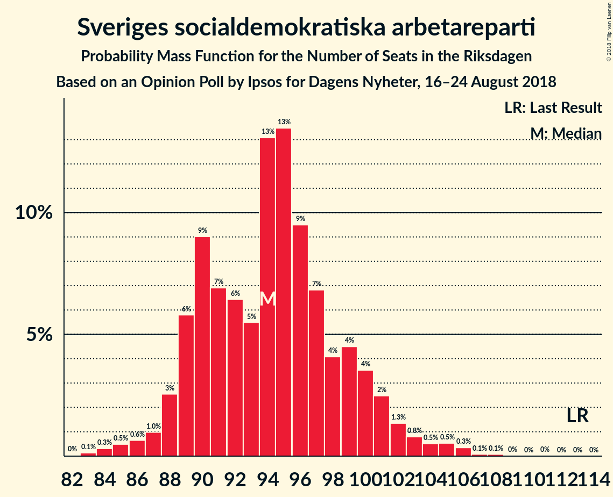
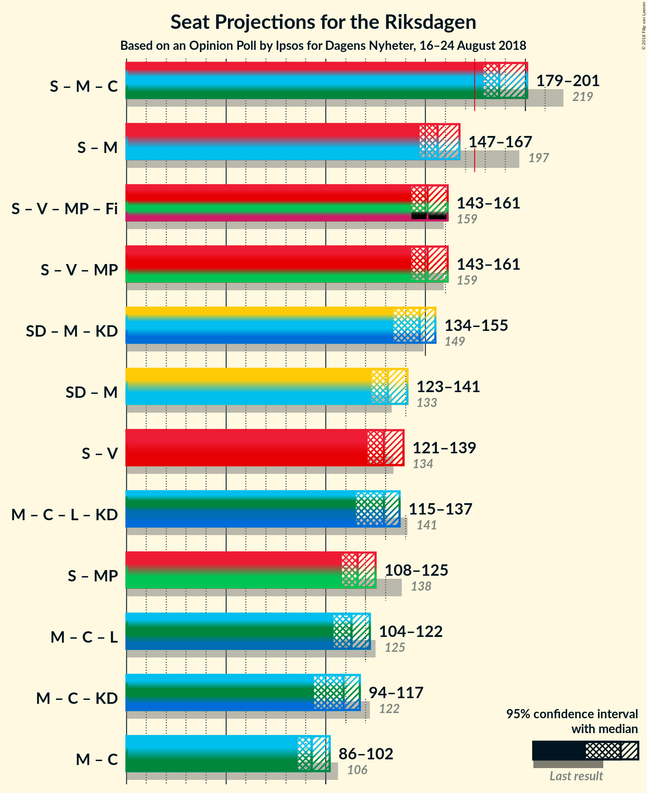

# Opinion Poll by Ipsos for Dagens Nyheter, 16–24 August 2018

<a href="#voting-intentions">Voting Intentions</a> | <a href="#seats">Seats</a> | <a href="#coalitions">Coalitions</a> | <a href="#technical-information">Technical Information</a>

## Voting Intentions

### Confidence Intervals

| Party | Last Result | Poll Result | 80% Confidence Interval | 90% Confidence Interval | 95% Confidence Interval | 99% Confidence Interval |
|:-----:|:-----------:|:-----------:|:-----------------------:|:-----------------------:|:-----------------------:|:-----------------------:|
| Sveriges socialdemokratiska arbetareparti | 31.0% | 26.3% | 25.0–27.6% |24.7–28.0% |24.3–28.3% |23.7–29.0% |
| Sverigedemokraterna | 12.9% | 19.4% | 18.3–20.6% |18.0–21.0% |17.7–21.3% |17.1–21.9% |
| Moderata samlingspartiet | 23.3% | 17.1% | 16.0–18.3% |15.7–18.6% |15.5–18.9% |15.0–19.5% |
| Vänsterpartiet | 5.7% | 9.8% | 9.0–10.8% |8.7–11.0% |8.5–11.2% |8.2–11.7% |
| Centerpartiet | 6.1% | 8.8% | 8.0–9.7% |7.8–10.0% |7.6–10.2% |7.2–10.6% |
| Miljöpartiet de gröna | 6.9% | 6.0% | 5.4–6.8% |5.2–7.0% |5.0–7.2% |4.7–7.6% |
| Liberalerna | 5.4% | 5.4% | 4.8–6.1% |4.6–6.3% |4.5–6.5% |4.2–6.9% |
| Kristdemokraterna | 4.6% | 4.6% | 4.0–5.3% |3.9–5.5% |3.7–5.6% |3.5–6.0% |

*Note:* The poll result column reflects the actual value used in the calculations. Published results may vary slightly, and in addition be rounded to fewer digits.

## Seats

### Confidence Intervals

| Party | Last Result | Median | 80% Confidence Interval | 90% Confidence Interval | 95% Confidence Interval | 99% Confidence Interval |
|:-----:|:-----------:|:------:|:-----------------------:|:-----------------------:|:-----------------------:|:-----------------------:|
| <a href="#sveriges-socialdemokratiska-arbetareparti">Sveriges socialdemokratiska arbetareparti</a> | 113 | 94 | 89–99 |88–101 |87–102 |85–106 |
| <a href="#sverigedemokraterna">Sverigedemokraterna</a> | 49 | 70 | 65–74 |64–76 |63–77 |61–79 |
| <a href="#moderata-samlingspartiet">Moderata samlingspartiet</a> | 84 | 62 | 57–66 |56–67 |55–68 |53–70 |
| <a href="#vänsterpartiet">Vänsterpartiet</a> | 21 | 35 | 32–38 |31–40 |31–40 |29–42 |
| <a href="#centerpartiet">Centerpartiet</a> | 22 | 32 | 29–35 |28–36 |27–37 |26–39 |
| <a href="#miljöpartiet-de-gröna">Miljöpartiet de gröna</a> | 25 | 22 | 19–24 |19–25 |18–26 |17–27 |
| <a href="#liberalerna">Liberalerna</a> | 19 | 20 | 17–22 |16–22 |15–23 |15–24 |
| <a href="#kristdemokraterna">Kristdemokraterna</a> | 16 | 16 | 0–19 |0–20 |0–20 |0–21 |

### Sveriges socialdemokratiska arbetareparti

*For a full overview of the results for this party, see the [Sveriges socialdemokratiska arbetareparti](party-sverigessocialdemokratiskaarbetareparti.html) page.*

| Number of Seats | Probability | Accumulated | Special Marks |
|:---------------:|:-----------:|:-----------:|:-------------:|
| 82 | 0% | 100% |  |
| 83 | 0.1% | 99.9% |  |
| 84 | 0.3% | 99.8% |  |
| 85 | 0.5% | 99.5% |  |
| 86 | 0.6% | 99.0% |  |
| 87 | 1.0% | 98% |  |
| 88 | 3% | 97% |  |
| 89 | 6% | 95% |  |
| 90 | 9% | 89% |  |
| 91 | 7% | 80% |  |
| 92 | 6% | 73% |  |
| 93 | 5% | 67% |  |
| 94 | 13% | 61% | Median |
| 95 | 13% | 48% |  |
| 96 | 9% | 35% |  |
| 97 | 7% | 25% |  |
| 98 | 4% | 18% |  |
| 99 | 4% | 14% |  |
| 100 | 4% | 10% |  |
| 101 | 2% | 6% |  |
| 102 | 1.3% | 4% |  |
| 103 | 0.8% | 2% |  |
| 104 | 0.5% | 2% |  |
| 105 | 0.5% | 1.1% |  |
| 106 | 0.3% | 0.5% |  |
| 107 | 0.1% | 0.2% |  |
| 108 | 0.1% | 0.1% |  |
| 109 | 0% | 0% |  |
| 110 | 0% | 0% |  |
| 111 | 0% | 0% |  |
| 112 | 0% | 0% |  |
| 113 | 0% | 0% | Last Result |

### Sverigedemokraterna

*For a full overview of the results for this party, see the [Sverigedemokraterna](party-sverigedemokraterna.html) page.*

| Number of Seats | Probability | Accumulated | Special Marks |
|:---------------:|:-----------:|:-----------:|:-------------:|
| 49 | 0% | 100% | Last Result |
| 50 | 0% | 100% |  |
| 51 | 0% | 100% |  |
| 52 | 0% | 100% |  |
| 53 | 0% | 100% |  |
| 54 | 0% | 100% |  |
| 55 | 0% | 100% |  |
| 56 | 0% | 100% |  |
| 57 | 0% | 100% |  |
| 58 | 0% | 100% |  |
| 59 | 0.1% | 100% |  |
| 60 | 0.1% | 99.9% |  |
| 61 | 0.3% | 99.8% |  |
| 62 | 0.8% | 99.4% |  |
| 63 | 2% | 98.6% |  |
| 64 | 3% | 97% |  |
| 65 | 4% | 94% |  |
| 66 | 9% | 90% |  |
| 67 | 9% | 81% |  |
| 68 | 13% | 72% |  |
| 69 | 9% | 59% |  |
| 70 | 14% | 51% | Median |
| 71 | 10% | 37% |  |
| 72 | 7% | 26% |  |
| 73 | 7% | 19% |  |
| 74 | 3% | 12% |  |
| 75 | 3% | 8% |  |
| 76 | 2% | 5% |  |
| 77 | 2% | 4% |  |
| 78 | 1.2% | 2% |  |
| 79 | 0.5% | 0.9% |  |
| 80 | 0.3% | 0.5% |  |
| 81 | 0.1% | 0.2% |  |
| 82 | 0.1% | 0.1% |  |
| 83 | 0% | 0% |  |

### Moderata samlingspartiet

*For a full overview of the results for this party, see the [Moderata samlingspartiet](party-moderatasamlingspartiet.html) page.*

| Number of Seats | Probability | Accumulated | Special Marks |
|:---------------:|:-----------:|:-----------:|:-------------:|
| 51 | 0% | 100% |  |
| 52 | 0.1% | 99.9% |  |
| 53 | 0.3% | 99.8% |  |
| 54 | 0.8% | 99.5% |  |
| 55 | 1.5% | 98.7% |  |
| 56 | 4% | 97% |  |
| 57 | 4% | 94% |  |
| 58 | 5% | 89% |  |
| 59 | 9% | 84% |  |
| 60 | 14% | 76% |  |
| 61 | 12% | 62% |  |
| 62 | 11% | 50% | Median |
| 63 | 13% | 39% |  |
| 64 | 9% | 27% |  |
| 65 | 5% | 17% |  |
| 66 | 5% | 12% |  |
| 67 | 3% | 7% |  |
| 68 | 2% | 5% |  |
| 69 | 1.0% | 2% |  |
| 70 | 0.8% | 1.3% |  |
| 71 | 0.3% | 0.5% |  |
| 72 | 0.1% | 0.2% |  |
| 73 | 0% | 0.1% |  |
| 74 | 0% | 0% |  |
| 75 | 0% | 0% |  |
| 76 | 0% | 0% |  |
| 77 | 0% | 0% |  |
| 78 | 0% | 0% |  |
| 79 | 0% | 0% |  |
| 80 | 0% | 0% |  |
| 81 | 0% | 0% |  |
| 82 | 0% | 0% |  |
| 83 | 0% | 0% |  |
| 84 | 0% | 0% | Last Result |

### Vänsterpartiet

*For a full overview of the results for this party, see the [Vänsterpartiet](party-vänsterpartiet.html) page.*

| Number of Seats | Probability | Accumulated | Special Marks |
|:---------------:|:-----------:|:-----------:|:-------------:|
| 21 | 0% | 100% | Last Result |
| 22 | 0% | 100% |  |
| 23 | 0% | 100% |  |
| 24 | 0% | 100% |  |
| 25 | 0% | 100% |  |
| 26 | 0% | 100% |  |
| 27 | 0% | 100% |  |
| 28 | 0.1% | 100% |  |
| 29 | 0.6% | 99.8% |  |
| 30 | 1.5% | 99.2% |  |
| 31 | 4% | 98% |  |
| 32 | 8% | 94% |  |
| 33 | 10% | 86% |  |
| 34 | 15% | 76% |  |
| 35 | 12% | 61% | Median |
| 36 | 16% | 49% |  |
| 37 | 11% | 32% |  |
| 38 | 12% | 22% |  |
| 39 | 4% | 10% |  |
| 40 | 3% | 5% |  |
| 41 | 1.3% | 2% |  |
| 42 | 0.7% | 1.1% |  |
| 43 | 0.2% | 0.4% |  |
| 44 | 0.1% | 0.1% |  |
| 45 | 0% | 0% |  |

### Centerpartiet

*For a full overview of the results for this party, see the [Centerpartiet](party-centerpartiet.html) page.*

| Number of Seats | Probability | Accumulated | Special Marks |
|:---------------:|:-----------:|:-----------:|:-------------:|
| 22 | 0% | 100% | Last Result |
| 23 | 0% | 100% |  |
| 24 | 0.1% | 100% |  |
| 25 | 0.2% | 99.9% |  |
| 26 | 0.8% | 99.7% |  |
| 27 | 3% | 99.0% |  |
| 28 | 5% | 96% |  |
| 29 | 9% | 91% |  |
| 30 | 12% | 82% |  |
| 31 | 17% | 70% |  |
| 32 | 20% | 53% | Median |
| 33 | 10% | 34% |  |
| 34 | 10% | 23% |  |
| 35 | 7% | 14% |  |
| 36 | 4% | 6% |  |
| 37 | 1.5% | 3% |  |
| 38 | 0.5% | 1.1% |  |
| 39 | 0.4% | 0.6% |  |
| 40 | 0.1% | 0.2% |  |
| 41 | 0% | 0% |  |

### Miljöpartiet de gröna

*For a full overview of the results for this party, see the [Miljöpartiet de gröna](party-miljöpartietdegröna.html) page.*

| Number of Seats | Probability | Accumulated | Special Marks |
|:---------------:|:-----------:|:-----------:|:-------------:|
| 16 | 0.2% | 100% |  |
| 17 | 1.0% | 99.8% |  |
| 18 | 3% | 98.9% |  |
| 19 | 6% | 95% |  |
| 20 | 14% | 90% |  |
| 21 | 22% | 75% |  |
| 22 | 21% | 53% | Median |
| 23 | 15% | 32% |  |
| 24 | 8% | 17% |  |
| 25 | 5% | 9% | Last Result |
| 26 | 2% | 3% |  |
| 27 | 0.9% | 1.3% |  |
| 28 | 0.3% | 0.4% |  |
| 29 | 0.1% | 0.1% |  |
| 30 | 0% | 0% |  |

### Liberalerna

*For a full overview of the results for this party, see the [Liberalerna](party-liberalerna.html) page.*

| Number of Seats | Probability | Accumulated | Special Marks |
|:---------------:|:-----------:|:-----------:|:-------------:|
| 0 | 0.2% | 100% |  |
| 1 | 0% | 99.8% |  |
| 2 | 0% | 99.8% |  |
| 3 | 0% | 99.8% |  |
| 4 | 0% | 99.8% |  |
| 5 | 0% | 99.8% |  |
| 6 | 0% | 99.8% |  |
| 7 | 0% | 99.8% |  |
| 8 | 0% | 99.8% |  |
| 9 | 0% | 99.8% |  |
| 10 | 0% | 99.8% |  |
| 11 | 0% | 99.8% |  |
| 12 | 0% | 99.8% |  |
| 13 | 0% | 99.8% |  |
| 14 | 0% | 99.8% |  |
| 15 | 2% | 99.8% |  |
| 16 | 5% | 97% |  |
| 17 | 7% | 93% |  |
| 18 | 16% | 86% |  |
| 19 | 14% | 70% | Last Result |
| 20 | 18% | 56% | Median |
| 21 | 20% | 38% |  |
| 22 | 14% | 19% |  |
| 23 | 3% | 4% |  |
| 24 | 0.9% | 1.4% |  |
| 25 | 0.3% | 0.5% |  |
| 26 | 0.1% | 0.1% |  |
| 27 | 0% | 0.1% |  |
| 28 | 0% | 0% |  |

### Kristdemokraterna

*For a full overview of the results for this party, see the [Kristdemokraterna](party-kristdemokraterna.html) page.*

| Number of Seats | Probability | Accumulated | Special Marks |
|:---------------:|:-----------:|:-----------:|:-------------:|
| 0 | 10% | 100% |  |
| 1 | 0% | 90% |  |
| 2 | 0% | 90% |  |
| 3 | 0% | 90% |  |
| 4 | 0% | 90% |  |
| 5 | 0% | 90% |  |
| 6 | 0% | 90% |  |
| 7 | 0% | 90% |  |
| 8 | 0% | 90% |  |
| 9 | 0% | 90% |  |
| 10 | 0% | 90% |  |
| 11 | 0% | 90% |  |
| 12 | 0% | 90% |  |
| 13 | 0% | 90% |  |
| 14 | 2% | 90% |  |
| 15 | 19% | 87% |  |
| 16 | 21% | 69% | Last Result, Median |
| 17 | 22% | 48% |  |
| 18 | 12% | 26% |  |
| 19 | 8% | 15% |  |
| 20 | 5% | 7% |  |
| 21 | 2% | 2% |  |
| 22 | 0.3% | 0.4% |  |
| 23 | 0.1% | 0.1% |  |
| 24 | 0% | 0% |  |

## Coalitions

### Confidence Intervals

| Coalition | Last Result | Median | Majority? | 80% Confidence Interval | 90% Confidence Interval | 95% Confidence Interval | 99% Confidence Interval |
|:---------:|:-----------:|:------:|:---------:|:-----------------------:|:-----------------------:|:-----------------------:|:-----------------------:|
| Sveriges socialdemokratiska arbetareparti – Moderata samlingspartiet – Centerpartiet | 219 | 187 | 99.9% | 182–194 | 180–198 | 179–201 | 176–202 |
| Sveriges socialdemokratiska arbetareparti – Moderata samlingspartiet | 197 | 156 | 0% | 150–162 | 149–165 | 147–167 | 145–171 |
| Sveriges socialdemokratiska arbetareparti – Vänsterpartiet – Miljöpartiet de gröna | 159 | 151 | 0% | 145–157 | 144–159 | 143–161 | 141–165 |
| Sverigedemokraterna – Moderata samlingspartiet – Kristdemokraterna | 149 | 147 | 0% | 140–152 | 137–154 | 134–155 | 130–158 |
| Sverigedemokraterna – Moderata samlingspartiet | 133 | 131 | 0% | 126–137 | 124–139 | 123–141 | 121–145 |
| Sveriges socialdemokratiska arbetareparti – Vänsterpartiet | 134 | 129 | 0% | 124–135 | 123–137 | 121–139 | 119–142 |
| Moderata samlingspartiet – Centerpartiet – Liberalerna – Kristdemokraterna | 141 | 129 | 0% | 121–133 | 118–136 | 115–137 | 112–140 |
| Sveriges socialdemokratiska arbetareparti – Miljöpartiet de gröna | 138 | 116 | 0% | 111–122 | 109–123 | 108–125 | 106–128 |
| Moderata samlingspartiet – Centerpartiet – Liberalerna | 125 | 113 | 0% | 107–118 | 106–120 | 104–122 | 102–124 |
| Moderata samlingspartiet – Centerpartiet – Kristdemokraterna | 122 | 109 | 0% | 102–114 | 97–116 | 94–117 | 92–119 |
| Moderata samlingspartiet – Centerpartiet | 106 | 93 | 0% | 89–98 | 87–101 | 86–102 | 84–104 |

