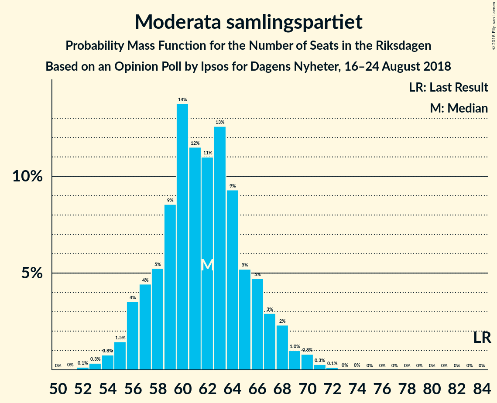

# Opinion Poll by Ipsos for Dagens Nyheter, 16–24 August 2018

<a href="#voting-intentions">Voting Intentions</a> | <a href="#seats">Seats</a> | <a href="#coalitions">Coalitions</a> | <a href="#technical-information">Technical Information</a>

## Voting Intentions

### Confidence Intervals

| Party | Last Result | Poll Result | 80% Confidence Interval | 90% Confidence Interval | 95% Confidence Interval | 99% Confidence Interval |
|:-----:|:-----------:|:-----------:|:-----------------------:|:-----------------------:|:-----------------------:|:-----------------------:|
| Sveriges socialdemokratiska arbetareparti | 31.0% | 26.3% | 25.0–27.6% |24.7–28.0% |24.3–28.3% |23.7–29.0% |
| Sverigedemokraterna | 12.9% | 19.4% | 18.3–20.6% |18.0–21.0% |17.7–21.3% |17.1–21.9% |
| Moderata samlingspartiet | 23.3% | 17.1% | 16.0–18.3% |15.7–18.6% |15.5–18.9% |15.0–19.5% |
| Vänsterpartiet | 5.7% | 9.8% | 9.0–10.8% |8.7–11.0% |8.5–11.2% |8.2–11.7% |
| Centerpartiet | 6.1% | 8.8% | 8.0–9.7% |7.8–10.0% |7.6–10.2% |7.2–10.6% |
| Miljöpartiet de gröna | 6.9% | 6.0% | 5.4–6.8% |5.2–7.0% |5.0–7.2% |4.7–7.6% |
| Liberalerna | 5.4% | 5.4% | 4.8–6.1% |4.6–6.3% |4.5–6.5% |4.2–6.9% |
| Kristdemokraterna | 4.6% | 4.6% | 4.0–5.3% |3.9–5.5% |3.7–5.6% |3.5–6.0% |

*Note:* The poll result column reflects the actual value used in the calculations. Published results may vary slightly, and in addition be rounded to fewer digits.

## Seats

### Confidence Intervals

| Party | Last Result | Median | 80% Confidence Interval | 90% Confidence Interval | 95% Confidence Interval | 99% Confidence Interval |
|:-----:|:-----------:|:------:|:-----------------------:|:-----------------------:|:-----------------------:|:-----------------------:|
| <a href="#sveriges-socialdemokratiska-arbetareparti">Sveriges socialdemokratiska arbetareparti</a> | 113 | 95 | 86–96 |82–96 |82–97 |82–99 |
| <a href="#sverigedemokraterna">Sverigedemokraterna</a> | 49 | 60 | 60–76 |60–80 |60–82 |60–82 |
| <a href="#moderata-samlingspartiet">Moderata samlingspartiet</a> | 84 | 64 | 62–69 |60–69 |60–74 |49–74 |
| <a href="#vänsterpartiet">Vänsterpartiet</a> | 21 | 35 | 30–37 |30–40 |30–40 |28–47 |
| <a href="#centerpartiet">Centerpartiet</a> | 22 | 33 | 29–33 |29–37 |26–37 |26–38 |
| <a href="#miljöpartiet-de-gröna">Miljöpartiet de gröna</a> | 25 | 19 | 19–24 |18–24 |18–26 |17–28 |
| <a href="#liberalerna">Liberalerna</a> | 19 | 24 | 19–24 |17–24 |15–25 |0–25 |
| <a href="#kristdemokraterna">Kristdemokraterna</a> | 16 | 19 | 14–19 |0–19 |0–23 |0–24 |

### Sveriges socialdemokratiska arbetareparti

*For a full overview of the results for this party, see the [Sveriges socialdemokratiska arbetareparti](party-sverigessocialdemokratiskaarbetareparti.html) page.*

| Number of Seats | Probability | Accumulated | Special Marks |
|:---------------:|:-----------:|:-----------:|:-------------:|
| 82 | 5% | 100% |  |
| 83 | 2% | 95% |  |
| 84 | 0% | 93% |  |
| 85 | 2% | 93% |  |
| 86 | 5% | 90% |  |
| 87 | 0% | 86% |  |
| 88 | 0% | 86% |  |
| 89 | 0.4% | 86% |  |
| 90 | 0% | 86% |  |
| 91 | 5% | 86% |  |
| 92 | 0.2% | 81% |  |
| 93 | 3% | 81% |  |
| 94 | 3% | 77% |  |
| 95 | 60% | 74% | Median |
| 96 | 10% | 14% |  |
| 97 | 2% | 4% |  |
| 98 | 0% | 2% |  |
| 99 | 2% | 2% |  |
| 100 | 0% | 0.4% |  |
| 101 | 0% | 0.4% |  |
| 102 | 0.3% | 0.4% |  |
| 103 | 0% | 0.1% |  |
| 104 | 0% | 0.1% |  |
| 105 | 0% | 0.1% |  |
| 106 | 0% | 0.1% |  |
| 107 | 0% | 0.1% |  |
| 108 | 0% | 0.1% |  |
| 109 | 0% | 0.1% |  |
| 110 | 0% | 0.1% |  |
| 111 | 0% | 0% |  |
| 112 | 0% | 0% |  |
| 113 | 0% | 0% | Last Result |

### Sverigedemokraterna

*For a full overview of the results for this party, see the [Sverigedemokraterna](party-sverigedemokraterna.html) page.*

| Number of Seats | Probability | Accumulated | Special Marks |
|:---------------:|:-----------:|:-----------:|:-------------:|
| 49 | 0% | 100% | Last Result |
| 50 | 0% | 100% |  |
| 51 | 0% | 100% |  |
| 52 | 0% | 100% |  |
| 53 | 0% | 100% |  |
| 54 | 0% | 100% |  |
| 55 | 0% | 100% |  |
| 56 | 0% | 100% |  |
| 57 | 0% | 100% |  |
| 58 | 0% | 100% |  |
| 59 | 0.3% | 100% |  |
| 60 | 60% | 99.7% | Median |
| 61 | 0.5% | 40% |  |
| 62 | 4% | 40% |  |
| 63 | 0% | 35% |  |
| 64 | 0.7% | 35% |  |
| 65 | 0% | 35% |  |
| 66 | 12% | 35% |  |
| 67 | 6% | 22% |  |
| 68 | 0.8% | 17% |  |
| 69 | 0.5% | 16% |  |
| 70 | 0.3% | 15% |  |
| 71 | 0.9% | 15% |  |
| 72 | 0.1% | 14% |  |
| 73 | 0.1% | 14% |  |
| 74 | 2% | 14% |  |
| 75 | 2% | 12% |  |
| 76 | 1.1% | 10% |  |
| 77 | 0% | 9% |  |
| 78 | 0% | 9% |  |
| 79 | 2% | 9% |  |
| 80 | 4% | 7% |  |
| 81 | 0.1% | 3% |  |
| 82 | 3% | 3% |  |
| 83 | 0% | 0% |  |

### Moderata samlingspartiet

*For a full overview of the results for this party, see the [Moderata samlingspartiet](party-moderatasamlingspartiet.html) page.*

| Number of Seats | Probability | Accumulated | Special Marks |
|:---------------:|:-----------:|:-----------:|:-------------:|
| 49 | 0.8% | 100% |  |
| 50 | 0% | 99.2% |  |
| 51 | 0% | 99.2% |  |
| 52 | 0% | 99.2% |  |
| 53 | 0% | 99.2% |  |
| 54 | 0% | 99.2% |  |
| 55 | 0% | 99.2% |  |
| 56 | 0.4% | 99.1% |  |
| 57 | 0% | 98.7% |  |
| 58 | 0% | 98.7% |  |
| 59 | 0% | 98.7% |  |
| 60 | 5% | 98.7% |  |
| 61 | 0.7% | 93% |  |
| 62 | 6% | 93% |  |
| 63 | 2% | 87% |  |
| 64 | 60% | 85% | Median |
| 65 | 3% | 25% |  |
| 66 | 0.5% | 21% |  |
| 67 | 3% | 21% |  |
| 68 | 4% | 18% |  |
| 69 | 10% | 14% |  |
| 70 | 0.1% | 5% |  |
| 71 | 0% | 4% |  |
| 72 | 0.3% | 4% |  |
| 73 | 0% | 4% |  |
| 74 | 4% | 4% |  |
| 75 | 0% | 0% |  |
| 76 | 0% | 0% |  |
| 77 | 0% | 0% |  |
| 78 | 0% | 0% |  |
| 79 | 0% | 0% |  |
| 80 | 0% | 0% |  |
| 81 | 0% | 0% |  |
| 82 | 0% | 0% |  |
| 83 | 0% | 0% |  |
| 84 | 0% | 0% | Last Result |

### Vänsterpartiet

*For a full overview of the results for this party, see the [Vänsterpartiet](party-vänsterpartiet.html) page.*

| Number of Seats | Probability | Accumulated | Special Marks |
|:---------------:|:-----------:|:-----------:|:-------------:|
| 21 | 0% | 100% | Last Result |
| 22 | 0% | 100% |  |
| 23 | 0% | 100% |  |
| 24 | 0% | 100% |  |
| 25 | 0.1% | 100% |  |
| 26 | 0.2% | 99.9% |  |
| 27 | 0% | 99.7% |  |
| 28 | 0.3% | 99.7% |  |
| 29 | 0.4% | 99.4% |  |
| 30 | 10% | 99.0% |  |
| 31 | 0.6% | 89% |  |
| 32 | 0.4% | 89% |  |
| 33 | 0% | 88% |  |
| 34 | 4% | 88% |  |
| 35 | 65% | 84% | Median |
| 36 | 7% | 19% |  |
| 37 | 3% | 12% |  |
| 38 | 2% | 9% |  |
| 39 | 0% | 7% |  |
| 40 | 5% | 7% |  |
| 41 | 0.8% | 2% |  |
| 42 | 0% | 1.1% |  |
| 43 | 0% | 1.0% |  |
| 44 | 0% | 1.0% |  |
| 45 | 0% | 1.0% |  |
| 46 | 0.3% | 1.0% |  |
| 47 | 0.7% | 0.7% |  |
| 48 | 0% | 0% |  |

### Centerpartiet

*For a full overview of the results for this party, see the [Centerpartiet](party-centerpartiet.html) page.*

| Number of Seats | Probability | Accumulated | Special Marks |
|:---------------:|:-----------:|:-----------:|:-------------:|
| 22 | 0% | 100% | Last Result |
| 23 | 0.3% | 100% |  |
| 24 | 0% | 99.7% |  |
| 25 | 0% | 99.7% |  |
| 26 | 2% | 99.7% |  |
| 27 | 2% | 97% |  |
| 28 | 0.3% | 96% |  |
| 29 | 13% | 95% |  |
| 30 | 0.8% | 82% |  |
| 31 | 0.7% | 82% |  |
| 32 | 3% | 81% |  |
| 33 | 69% | 78% | Median |
| 34 | 1.1% | 9% |  |
| 35 | 0% | 8% |  |
| 36 | 1.3% | 8% |  |
| 37 | 6% | 7% |  |
| 38 | 0.6% | 0.7% |  |
| 39 | 0% | 0.1% |  |
| 40 | 0% | 0.1% |  |
| 41 | 0% | 0% |  |

### Miljöpartiet de gröna

*For a full overview of the results for this party, see the [Miljöpartiet de gröna](party-miljöpartietdegröna.html) page.*

| Number of Seats | Probability | Accumulated | Special Marks |
|:---------------:|:-----------:|:-----------:|:-------------:|
| 15 | 0.1% | 100% |  |
| 16 | 0.1% | 99.9% |  |
| 17 | 0.6% | 99.8% |  |
| 18 | 7% | 99.3% |  |
| 19 | 60% | 92% | Median |
| 20 | 2% | 32% |  |
| 21 | 7% | 30% |  |
| 22 | 7% | 23% |  |
| 23 | 0.4% | 15% |  |
| 24 | 11% | 15% |  |
| 25 | 0.1% | 4% | Last Result |
| 26 | 2% | 4% |  |
| 27 | 1.4% | 2% |  |
| 28 | 0% | 0.5% |  |
| 29 | 0% | 0.5% |  |
| 30 | 0.5% | 0.5% |  |
| 31 | 0% | 0% |  |

### Liberalerna

*For a full overview of the results for this party, see the [Liberalerna](party-liberalerna.html) page.*

| Number of Seats | Probability | Accumulated | Special Marks |
|:---------------:|:-----------:|:-----------:|:-------------:|
| 0 | 1.1% | 100% |  |
| 1 | 0% | 98.9% |  |
| 2 | 0% | 98.9% |  |
| 3 | 0% | 98.9% |  |
| 4 | 0% | 98.9% |  |
| 5 | 0% | 98.9% |  |
| 6 | 0% | 98.9% |  |
| 7 | 0% | 98.9% |  |
| 8 | 0% | 98.9% |  |
| 9 | 0% | 98.9% |  |
| 10 | 0% | 98.9% |  |
| 11 | 0% | 98.9% |  |
| 12 | 0% | 98.9% |  |
| 13 | 0% | 98.9% |  |
| 14 | 0% | 98.9% |  |
| 15 | 3% | 98.9% |  |
| 16 | 0% | 96% |  |
| 17 | 3% | 96% |  |
| 18 | 0.8% | 93% |  |
| 19 | 7% | 92% | Last Result |
| 20 | 2% | 85% |  |
| 21 | 12% | 83% |  |
| 22 | 3% | 71% |  |
| 23 | 5% | 68% |  |
| 24 | 60% | 63% | Median |
| 25 | 3% | 3% |  |
| 26 | 0% | 0% |  |

### Kristdemokraterna

*For a full overview of the results for this party, see the [Kristdemokraterna](party-kristdemokraterna.html) page.*

| Number of Seats | Probability | Accumulated | Special Marks |
|:---------------:|:-----------:|:-----------:|:-------------:|
| 0 | 6% | 100% |  |
| 1 | 0% | 94% |  |
| 2 | 0% | 94% |  |
| 3 | 0% | 94% |  |
| 4 | 0% | 94% |  |
| 5 | 0% | 94% |  |
| 6 | 0% | 94% |  |
| 7 | 0% | 94% |  |
| 8 | 0% | 94% |  |
| 9 | 0% | 94% |  |
| 10 | 0% | 94% |  |
| 11 | 0% | 94% |  |
| 12 | 0% | 94% |  |
| 13 | 0% | 94% |  |
| 14 | 10% | 94% |  |
| 15 | 6% | 84% |  |
| 16 | 5% | 78% | Last Result |
| 17 | 3% | 73% |  |
| 18 | 7% | 70% |  |
| 19 | 60% | 63% | Median |
| 20 | 0% | 4% |  |
| 21 | 0.3% | 4% |  |
| 22 | 0% | 3% |  |
| 23 | 2% | 3% |  |
| 24 | 0.9% | 0.9% |  |
| 25 | 0% | 0% |  |

## Coalitions

### Confidence Intervals

| Coalition | Last Result | Median | Majority? | 80% Confidence Interval | 90% Confidence Interval | 95% Confidence Interval | 99% Confidence Interval |
|:---------:|:-----------:|:------:|:---------:|:-----------------------:|:-----------------------:|:-----------------------:|:-----------------------:|
| Sveriges socialdemokratiska arbetareparti – Moderata samlingspartiet | 197 | 159 | 0% | 153–165 | 142–165 | 142–165 | 142–165 |
| Sverigedemokraterna – Moderata samlingspartiet – Kristdemokraterna | 149 | 143 | 0% | 143–154 | 142–159 | 140–160 | 133–161 |
| Sveriges socialdemokratiska arbetareparti – Vänsterpartiet – Miljöpartiet de gröna | 159 | 149 | 0% | 144–150 | 142–152 | 141–159 | 138–159 |
| Sverigedemokraterna – Moderata samlingspartiet | 133 | 124 | 0% | 124–140 | 124–144 | 124–144 | 117–146 |
| Moderata samlingspartiet – Centerpartiet – Liberalerna – Kristdemokraterna | 141 | 140 | 0% | 123–140 | 120–142 | 120–142 | 115–142 |
| Sveriges socialdemokratiska arbetareparti – Vänsterpartiet | 134 | 130 | 0% | 122–130 | 120–131 | 120–137 | 115–138 |
| Moderata samlingspartiet – Centerpartiet – Liberalerna | 125 | 121 | 0% | 113–121 | 110–123 | 106–126 | 102–126 |
| Moderata samlingspartiet – Centerpartiet – Kristdemokraterna | 122 | 116 | 0% | 106–116 | 98–123 | 95–123 | 95–126 |
| Sveriges socialdemokratiska arbetareparti – Miljöpartiet de gröna | 138 | 114 | 0% | 106–120 | 104–120 | 104–121 | 104–123 |
| Moderata samlingspartiet – Centerpartiet | 106 | 97 | 0% | 95–98 | 91–102 | 90–107 | 85–107 |

### Sveriges socialdemokratiska arbetareparti – Moderata samlingspartiet

| Number of Seats | Probability | Accumulated | Special Marks |
|:---------------:|:-----------:|:-----------:|:-------------:|
| 142 | 6% | 100% |  |
| 143 | 0% | 94% |  |
| 144 | 0% | 94% |  |
| 145 | 0% | 94% |  |
| 146 | 3% | 94% |  |
| 147 | 0.7% | 92% |  |
| 148 | 0.1% | 91% |  |
| 149 | 0% | 91% |  |
| 150 | 0% | 91% |  |
| 151 | 0% | 91% |  |
| 152 | 0% | 91% |  |
| 153 | 5% | 91% |  |
| 154 | 1.5% | 86% |  |
| 155 | 3% | 85% |  |
| 156 | 3% | 82% |  |
| 157 | 0% | 78% |  |
| 158 | 0.6% | 78% |  |
| 159 | 60% | 78% | Median |
| 160 | 0.3% | 18% |  |
| 161 | 0% | 18% |  |
| 162 | 0.9% | 18% |  |
| 163 | 0.4% | 17% |  |
| 164 | 2% | 16% |  |
| 165 | 14% | 14% |  |
| 166 | 0% | 0.3% |  |
| 167 | 0% | 0.3% |  |
| 168 | 0% | 0.3% |  |
| 169 | 0% | 0.3% |  |
| 170 | 0% | 0.3% |  |
| 171 | 0% | 0.3% |  |
| 172 | 0% | 0.3% |  |
| 173 | 0% | 0.3% |  |
| 174 | 0.3% | 0.3% |  |
| 175 | 0% | 0% | Majority |
| 176 | 0% | 0% |  |
| 177 | 0% | 0% |  |
| 178 | 0% | 0% |  |
| 179 | 0% | 0% |  |
| 180 | 0% | 0% |  |
| 181 | 0% | 0% |  |
| 182 | 0% | 0% |  |
| 183 | 0% | 0% |  |
| 184 | 0% | 0% |  |
| 185 | 0% | 0% |  |
| 186 | 0% | 0% |  |
| 187 | 0% | 0% |  |
| 188 | 0% | 0% |  |
| 189 | 0% | 0% |  |
| 190 | 0% | 0% |  |
| 191 | 0% | 0% |  |
| 192 | 0% | 0% |  |
| 193 | 0% | 0% |  |
| 194 | 0% | 0% |  |
| 195 | 0% | 0% |  |
| 196 | 0% | 0% |  |
| 197 | 0% | 0% | Last Result |

### Sverigedemokraterna – Moderata samlingspartiet – Kristdemokraterna

| Number of Seats | Probability | Accumulated | Special Marks |
|:---------------:|:-----------:|:-----------:|:-------------:|
| 130 | 0% | 100% |  |
| 131 | 0% | 99.9% |  |
| 132 | 0% | 99.9% |  |
| 133 | 0.8% | 99.9% |  |
| 134 | 0% | 99.1% |  |
| 135 | 0% | 99.1% |  |
| 136 | 0% | 99.1% |  |
| 137 | 0% | 99.1% |  |
| 138 | 0% | 99.1% |  |
| 139 | 0% | 99.1% |  |
| 140 | 2% | 99.1% |  |
| 141 | 0.4% | 97% |  |
| 142 | 3% | 97% |  |
| 143 | 61% | 93% | Median |
| 144 | 1.1% | 33% |  |
| 145 | 5% | 32% |  |
| 146 | 0% | 26% |  |
| 147 | 0% | 26% |  |
| 148 | 0% | 26% |  |
| 149 | 10% | 26% | Last Result |
| 150 | 0.3% | 17% |  |
| 151 | 0% | 16% |  |
| 152 | 5% | 16% |  |
| 153 | 0.6% | 12% |  |
| 154 | 2% | 11% |  |
| 155 | 0.1% | 9% |  |
| 156 | 0.3% | 9% |  |
| 157 | 2% | 9% |  |
| 158 | 0% | 6% |  |
| 159 | 3% | 6% |  |
| 160 | 1.0% | 3% |  |
| 161 | 2% | 2% |  |
| 162 | 0% | 0% |  |

### Sveriges socialdemokratiska arbetareparti – Vänsterpartiet – Miljöpartiet de gröna

| Number of Seats | Probability | Accumulated | Special Marks |
|:---------------:|:-----------:|:-----------:|:-------------:|
| 135 | 0.1% | 100% |  |
| 136 | 0% | 99.9% |  |
| 137 | 0% | 99.9% |  |
| 138 | 0.4% | 99.9% |  |
| 139 | 0.2% | 99.5% |  |
| 140 | 0.1% | 99.3% |  |
| 141 | 2% | 99.2% |  |
| 142 | 2% | 97% |  |
| 143 | 0% | 94% |  |
| 144 | 5% | 94% |  |
| 145 | 4% | 89% |  |
| 146 | 5% | 85% |  |
| 147 | 0% | 80% |  |
| 148 | 0% | 80% |  |
| 149 | 63% | 80% | Median |
| 150 | 11% | 17% |  |
| 151 | 0% | 6% |  |
| 152 | 2% | 6% |  |
| 153 | 0% | 5% |  |
| 154 | 0.5% | 5% |  |
| 155 | 0.6% | 4% |  |
| 156 | 0% | 4% |  |
| 157 | 0.7% | 4% |  |
| 158 | 0% | 3% |  |
| 159 | 3% | 3% | Last Result |
| 160 | 0% | 0.1% |  |
| 161 | 0% | 0.1% |  |
| 162 | 0% | 0.1% |  |
| 163 | 0% | 0.1% |  |
| 164 | 0% | 0.1% |  |
| 165 | 0% | 0% |  |

### Sverigedemokraterna – Moderata samlingspartiet

| Number of Seats | Probability | Accumulated | Special Marks |
|:---------------:|:-----------:|:-----------:|:-------------:|
| 117 | 0.8% | 100% |  |
| 118 | 0% | 99.2% |  |
| 119 | 0% | 99.2% |  |
| 120 | 0% | 99.2% |  |
| 121 | 0% | 99.2% |  |
| 122 | 0% | 99.2% |  |
| 123 | 0.3% | 99.2% |  |
| 124 | 60% | 98.8% | Median |
| 125 | 0.7% | 39% |  |
| 126 | 0.5% | 39% |  |
| 127 | 5% | 38% |  |
| 128 | 0% | 33% |  |
| 129 | 0% | 33% |  |
| 130 | 0% | 33% |  |
| 131 | 0.1% | 33% |  |
| 132 | 0% | 33% |  |
| 133 | 0.4% | 33% | Last Result |
| 134 | 3% | 32% |  |
| 135 | 10% | 30% |  |
| 136 | 6% | 19% |  |
| 137 | 2% | 14% |  |
| 138 | 0% | 12% |  |
| 139 | 0.3% | 12% |  |
| 140 | 2% | 12% |  |
| 141 | 0% | 10% |  |
| 142 | 3% | 10% |  |
| 143 | 0% | 7% |  |
| 144 | 4% | 7% |  |
| 145 | 0% | 2% |  |
| 146 | 2% | 2% |  |
| 147 | 0.1% | 0.1% |  |
| 148 | 0% | 0% |  |

### Moderata samlingspartiet – Centerpartiet – Liberalerna – Kristdemokraterna

| Number of Seats | Probability | Accumulated | Special Marks |
|:---------------:|:-----------:|:-----------:|:-------------:|
| 115 | 2% | 100% |  |
| 116 | 0% | 98% |  |
| 117 | 0% | 98% |  |
| 118 | 0% | 98% |  |
| 119 | 0% | 98% |  |
| 120 | 3% | 98% |  |
| 121 | 3% | 95% |  |
| 122 | 0.8% | 92% |  |
| 123 | 1.1% | 91% |  |
| 124 | 0% | 90% |  |
| 125 | 0.1% | 90% |  |
| 126 | 0.9% | 90% |  |
| 127 | 0.3% | 89% |  |
| 128 | 3% | 89% |  |
| 129 | 2% | 85% |  |
| 130 | 0.3% | 83% |  |
| 131 | 0.4% | 83% |  |
| 132 | 0% | 83% |  |
| 133 | 10% | 83% |  |
| 134 | 0.5% | 73% |  |
| 135 | 0.3% | 72% |  |
| 136 | 0.2% | 72% |  |
| 137 | 0% | 72% |  |
| 138 | 5% | 72% |  |
| 139 | 0% | 66% |  |
| 140 | 60% | 66% | Median |
| 141 | 0% | 7% | Last Result |
| 142 | 7% | 7% |  |
| 143 | 0% | 0% |  |

### Sveriges socialdemokratiska arbetareparti – Vänsterpartiet

| Number of Seats | Probability | Accumulated | Special Marks |
|:---------------:|:-----------:|:-----------:|:-------------:|
| 113 | 0.1% | 100% |  |
| 114 | 0% | 99.9% |  |
| 115 | 0.4% | 99.9% |  |
| 116 | 0% | 99.5% |  |
| 117 | 0% | 99.5% |  |
| 118 | 0.1% | 99.5% |  |
| 119 | 0.3% | 99.4% |  |
| 120 | 4% | 99.0% |  |
| 121 | 0% | 95% |  |
| 122 | 7% | 95% |  |
| 123 | 1.1% | 87% |  |
| 124 | 0.6% | 86% |  |
| 125 | 0.1% | 86% |  |
| 126 | 10% | 86% |  |
| 127 | 4% | 76% |  |
| 128 | 6% | 72% |  |
| 129 | 0% | 65% |  |
| 130 | 60% | 65% | Median |
| 131 | 1.2% | 5% |  |
| 132 | 0% | 4% |  |
| 133 | 0.7% | 4% |  |
| 134 | 0% | 3% | Last Result |
| 135 | 0.3% | 3% |  |
| 136 | 0% | 3% |  |
| 137 | 2% | 3% |  |
| 138 | 1.0% | 1.1% |  |
| 139 | 0% | 0.1% |  |
| 140 | 0% | 0.1% |  |
| 141 | 0% | 0.1% |  |
| 142 | 0% | 0.1% |  |
| 143 | 0% | 0.1% |  |
| 144 | 0% | 0.1% |  |
| 145 | 0% | 0.1% |  |
| 146 | 0% | 0% |  |

### Moderata samlingspartiet – Centerpartiet – Liberalerna

| Number of Seats | Probability | Accumulated | Special Marks |
|:---------------:|:-----------:|:-----------:|:-------------:|
| 102 | 0.9% | 100% |  |
| 103 | 0% | 99.1% |  |
| 104 | 0% | 99.1% |  |
| 105 | 0.1% | 99.1% |  |
| 106 | 4% | 99.1% |  |
| 107 | 0% | 95% |  |
| 108 | 0.1% | 95% |  |
| 109 | 0% | 95% |  |
| 110 | 0.9% | 95% |  |
| 111 | 0% | 94% |  |
| 112 | 2% | 94% |  |
| 113 | 3% | 92% |  |
| 114 | 0.4% | 89% |  |
| 115 | 2% | 89% |  |
| 116 | 0.1% | 87% |  |
| 117 | 0.8% | 87% |  |
| 118 | 0.1% | 86% |  |
| 119 | 12% | 86% |  |
| 120 | 8% | 74% |  |
| 121 | 60% | 65% | Median |
| 122 | 0.1% | 5% |  |
| 123 | 1.1% | 5% |  |
| 124 | 0% | 4% |  |
| 125 | 0% | 4% | Last Result |
| 126 | 4% | 4% |  |
| 127 | 0% | 0% |  |

### Moderata samlingspartiet – Centerpartiet – Kristdemokraterna

| Number of Seats | Probability | Accumulated | Special Marks |
|:---------------:|:-----------:|:-----------:|:-------------:|
| 95 | 3% | 100% |  |
| 96 | 0% | 97% |  |
| 97 | 0% | 97% |  |
| 98 | 2% | 97% |  |
| 99 | 0% | 95% |  |
| 100 | 0.1% | 95% |  |
| 101 | 0.8% | 95% |  |
| 102 | 1.1% | 94% |  |
| 103 | 0.1% | 93% |  |
| 104 | 0% | 93% |  |
| 105 | 0% | 93% |  |
| 106 | 3% | 93% |  |
| 107 | 2% | 90% |  |
| 108 | 3% | 88% |  |
| 109 | 0.4% | 85% |  |
| 110 | 0.7% | 85% |  |
| 111 | 0.3% | 84% |  |
| 112 | 11% | 84% |  |
| 113 | 0% | 73% |  |
| 114 | 0% | 73% |  |
| 115 | 5% | 73% |  |
| 116 | 60% | 68% | Median |
| 117 | 0.2% | 8% |  |
| 118 | 0.1% | 8% |  |
| 119 | 0% | 8% |  |
| 120 | 0.3% | 8% |  |
| 121 | 0% | 8% |  |
| 122 | 0% | 8% | Last Result |
| 123 | 7% | 8% |  |
| 124 | 0% | 1.2% |  |
| 125 | 0% | 1.1% |  |
| 126 | 0.9% | 1.1% |  |
| 127 | 0.3% | 0.3% |  |
| 128 | 0% | 0% |  |

### Sveriges socialdemokratiska arbetareparti – Miljöpartiet de gröna

| Number of Seats | Probability | Accumulated | Special Marks |
|:---------------:|:-----------:|:-----------:|:-------------:|
| 100 | 0% | 100% |  |
| 101 | 0% | 99.9% |  |
| 102 | 0% | 99.9% |  |
| 103 | 0% | 99.9% |  |
| 104 | 5% | 99.9% |  |
| 105 | 0% | 95% |  |
| 106 | 5% | 95% |  |
| 107 | 0% | 90% |  |
| 108 | 0.1% | 90% |  |
| 109 | 6% | 89% |  |
| 110 | 0.7% | 83% |  |
| 111 | 3% | 82% |  |
| 112 | 0% | 80% |  |
| 113 | 1.1% | 80% |  |
| 114 | 60% | 78% | Median |
| 115 | 3% | 19% |  |
| 116 | 0% | 15% |  |
| 117 | 0% | 15% |  |
| 118 | 2% | 15% |  |
| 119 | 0.3% | 13% |  |
| 120 | 10% | 13% |  |
| 121 | 2% | 3% |  |
| 122 | 0% | 0.6% |  |
| 123 | 0.5% | 0.6% |  |
| 124 | 0% | 0.1% |  |
| 125 | 0% | 0.1% |  |
| 126 | 0% | 0.1% |  |
| 127 | 0% | 0.1% |  |
| 128 | 0% | 0.1% |  |
| 129 | 0% | 0.1% |  |
| 130 | 0% | 0% |  |
| 131 | 0% | 0% |  |
| 132 | 0% | 0% |  |
| 133 | 0% | 0% |  |
| 134 | 0% | 0% |  |
| 135 | 0% | 0% |  |
| 136 | 0% | 0% |  |
| 137 | 0% | 0% |  |
| 138 | 0% | 0% | Last Result |

### Moderata samlingspartiet – Centerpartiet

| Number of Seats | Probability | Accumulated | Special Marks |
|:---------------:|:-----------:|:-----------:|:-------------:|
| 85 | 0.8% | 100% |  |
| 86 | 0% | 99.2% |  |
| 87 | 0% | 99.2% |  |
| 88 | 0% | 99.2% |  |
| 89 | 0% | 99.1% |  |
| 90 | 2% | 99.1% |  |
| 91 | 3% | 97% |  |
| 92 | 1.1% | 94% |  |
| 93 | 2% | 93% |  |
| 94 | 0% | 90% |  |
| 95 | 4% | 90% |  |
| 96 | 0.4% | 87% |  |
| 97 | 65% | 86% | Median |
| 98 | 12% | 21% |  |
| 99 | 0.1% | 10% |  |
| 100 | 3% | 10% |  |
| 101 | 0% | 7% |  |
| 102 | 2% | 7% |  |
| 103 | 0% | 5% |  |
| 104 | 0% | 5% |  |
| 105 | 0% | 4% |  |
| 106 | 0% | 4% | Last Result |
| 107 | 4% | 4% |  |
| 108 | 0% | 0.3% |  |
| 109 | 0% | 0.3% |  |
| 110 | 0.3% | 0.3% |  |
| 111 | 0% | 0% |  |

## Technical Information

### Opinion Poll

+ **Polling firm:** Ipsos
+ **Commissioner(s):** Dagens Nyheter
+ **Fieldwork period:** 16–24 August 2018

### Calculations

+ **Sample size:** 1875
+ **Simulations done:** 1,024
+ **Error estimate:** 3.61%

