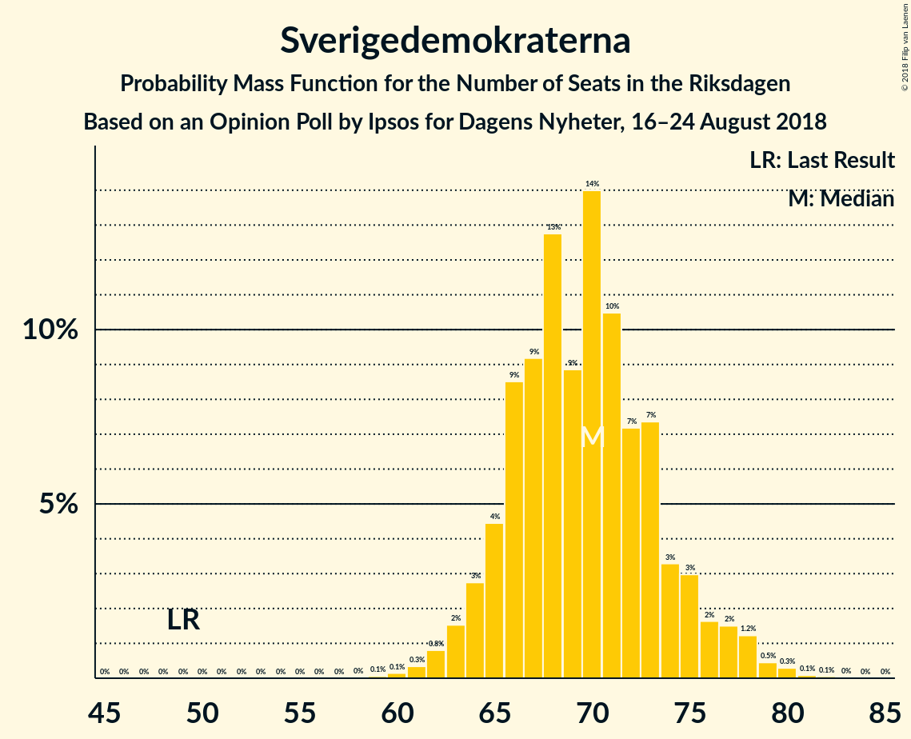

# Opinion Poll by Ipsos for Dagens Nyheter, 16–24 August 2018

<a href="#voting-intentions">Voting Intentions</a> | <a href="#seats">Seats</a> | <a href="#coalitions">Coalitions</a> | <a href="#technical-information">Technical Information</a>

## Voting Intentions

### Confidence Intervals

| Party | Last Result | Poll Result | 80% Confidence Interval | 90% Confidence Interval | 95% Confidence Interval | 99% Confidence Interval |
|:-----:|:-----------:|:-----------:|:-----------------------:|:-----------------------:|:-----------------------:|:-----------------------:|
| Sveriges socialdemokratiska arbetareparti | 31.0% | 26.3% | 25.0–27.6% |24.7–28.0% |24.3–28.3% |23.7–29.0% |
| Sverigedemokraterna | 12.9% | 19.4% | 18.3–20.6% |18.0–21.0% |17.7–21.3% |17.1–21.9% |
| Moderata samlingspartiet | 23.3% | 17.1% | 16.0–18.3% |15.7–18.6% |15.5–18.9% |15.0–19.5% |
| Vänsterpartiet | 5.7% | 9.8% | 9.0–10.8% |8.7–11.0% |8.5–11.2% |8.2–11.7% |
| Centerpartiet | 6.1% | 8.8% | 8.0–9.7% |7.8–10.0% |7.6–10.2% |7.2–10.6% |
| Miljöpartiet de gröna | 6.9% | 6.0% | 5.4–6.8% |5.2–7.0% |5.0–7.2% |4.7–7.6% |
| Liberalerna | 5.4% | 5.4% | 4.8–6.1% |4.6–6.3% |4.5–6.5% |4.2–6.9% |
| Kristdemokraterna | 4.6% | 4.6% | 4.0–5.3% |3.9–5.5% |3.7–5.6% |3.5–6.0% |

*Note:* The poll result column reflects the actual value used in the calculations. Published results may vary slightly, and in addition be rounded to fewer digits.

## Seats

### Confidence Intervals

| Party | Last Result | Median | 80% Confidence Interval | 90% Confidence Interval | 95% Confidence Interval | 99% Confidence Interval |
|:-----:|:-----------:|:------:|:-----------------------:|:-----------------------:|:-----------------------:|:-----------------------:|
| <a href="#sveriges-socialdemokratiska-arbetareparti">Sveriges socialdemokratiska arbetareparti</a> | 113 | 95 | 90–98 |88–100 |88–103 |85–104 |
| <a href="#sverigedemokraterna">Sverigedemokraterna</a> | 49 | 68 | 66–73 |65–74 |63–76 |62–80 |
| <a href="#moderata-samlingspartiet">Moderata samlingspartiet</a> | 84 | 60 | 58–65 |57–67 |56–68 |53–69 |
| <a href="#vänsterpartiet">Vänsterpartiet</a> | 21 | 38 | 33–38 |31–39 |30–41 |30–43 |
| <a href="#centerpartiet">Centerpartiet</a> | 22 | 32 | 29–34 |28–34 |27–35 |27–38 |
| <a href="#miljöpartiet-de-gröna">Miljöpartiet de gröna</a> | 25 | 21 | 20–24 |18–25 |18–26 |17–27 |
| <a href="#liberalerna">Liberalerna</a> | 19 | 18 | 17–22 |16–22 |16–23 |15–24 |
| <a href="#kristdemokraterna">Kristdemokraterna</a> | 16 | 17 | 15–18 |14–19 |0–20 |0–21 |

### Sveriges socialdemokratiska arbetareparti

*For a full overview of the results for this party, see the [Sveriges socialdemokratiska arbetareparti](party-sverigessocialdemokratiskaarbetareparti.html) page.*

| Number of Seats | Probability | Accumulated | Special Marks |
|:---------------:|:-----------:|:-----------:|:-------------:|
| 83 | 0.2% | 100% |  |
| 84 | 0.1% | 99.7% |  |
| 85 | 0.3% | 99.7% |  |
| 86 | 0.3% | 99.4% |  |
| 87 | 0.5% | 99.1% |  |
| 88 | 4% | 98.6% |  |
| 89 | 0.4% | 95% |  |
| 90 | 6% | 94% |  |
| 91 | 3% | 88% |  |
| 92 | 5% | 85% |  |
| 93 | 6% | 80% |  |
| 94 | 2% | 74% |  |
| 95 | 48% | 72% | Median |
| 96 | 11% | 25% |  |
| 97 | 3% | 13% |  |
| 98 | 2% | 10% |  |
| 99 | 0.3% | 8% |  |
| 100 | 3% | 7% |  |
| 101 | 0.7% | 4% |  |
| 102 | 0.8% | 4% |  |
| 103 | 2% | 3% |  |
| 104 | 0.5% | 0.7% |  |
| 105 | 0.1% | 0.2% |  |
| 106 | 0% | 0.1% |  |
| 107 | 0% | 0.1% |  |
| 108 | 0% | 0.1% |  |
| 109 | 0% | 0.1% |  |
| 110 | 0.1% | 0.1% |  |
| 111 | 0% | 0% |  |
| 112 | 0% | 0% |  |
| 113 | 0% | 0% | Last Result |

### Sverigedemokraterna

*For a full overview of the results for this party, see the [Sverigedemokraterna](party-sverigedemokraterna.html) page.*

| Number of Seats | Probability | Accumulated | Special Marks |
|:---------------:|:-----------:|:-----------:|:-------------:|
| 49 | 0% | 100% | Last Result |
| 50 | 0% | 100% |  |
| 51 | 0% | 100% |  |
| 52 | 0% | 100% |  |
| 53 | 0% | 100% |  |
| 54 | 0% | 100% |  |
| 55 | 0% | 100% |  |
| 56 | 0% | 100% |  |
| 57 | 0% | 100% |  |
| 58 | 0% | 100% |  |
| 59 | 0% | 100% |  |
| 60 | 0.1% | 99.9% |  |
| 61 | 0.2% | 99.8% |  |
| 62 | 0.4% | 99.7% |  |
| 63 | 3% | 99.3% |  |
| 64 | 0.8% | 97% |  |
| 65 | 5% | 96% |  |
| 66 | 4% | 91% |  |
| 67 | 7% | 87% |  |
| 68 | 42% | 80% | Median |
| 69 | 10% | 38% |  |
| 70 | 7% | 28% |  |
| 71 | 6% | 21% |  |
| 72 | 3% | 14% |  |
| 73 | 2% | 12% |  |
| 74 | 5% | 10% |  |
| 75 | 1.3% | 5% |  |
| 76 | 2% | 3% |  |
| 77 | 0.7% | 2% |  |
| 78 | 0.3% | 1.1% |  |
| 79 | 0.2% | 0.8% |  |
| 80 | 0.3% | 0.6% |  |
| 81 | 0.1% | 0.3% |  |
| 82 | 0.2% | 0.2% |  |
| 83 | 0% | 0% |  |

### Moderata samlingspartiet

*For a full overview of the results for this party, see the [Moderata samlingspartiet](party-moderatasamlingspartiet.html) page.*

| Number of Seats | Probability | Accumulated | Special Marks |
|:---------------:|:-----------:|:-----------:|:-------------:|
| 52 | 0.1% | 100% |  |
| 53 | 0.5% | 99.9% |  |
| 54 | 0.3% | 99.4% |  |
| 55 | 0.7% | 99.1% |  |
| 56 | 3% | 98% |  |
| 57 | 1.5% | 96% |  |
| 58 | 5% | 94% |  |
| 59 | 2% | 89% |  |
| 60 | 46% | 87% | Median |
| 61 | 6% | 41% |  |
| 62 | 7% | 35% |  |
| 63 | 7% | 28% |  |
| 64 | 8% | 21% |  |
| 65 | 3% | 13% |  |
| 66 | 0.7% | 10% |  |
| 67 | 5% | 9% |  |
| 68 | 2% | 4% |  |
| 69 | 2% | 2% |  |
| 70 | 0.1% | 0.4% |  |
| 71 | 0.2% | 0.3% |  |
| 72 | 0.1% | 0.1% |  |
| 73 | 0% | 0% |  |
| 74 | 0% | 0% |  |
| 75 | 0% | 0% |  |
| 76 | 0% | 0% |  |
| 77 | 0% | 0% |  |
| 78 | 0% | 0% |  |
| 79 | 0% | 0% |  |
| 80 | 0% | 0% |  |
| 81 | 0% | 0% |  |
| 82 | 0% | 0% |  |
| 83 | 0% | 0% |  |
| 84 | 0% | 0% | Last Result |

### Vänsterpartiet

*For a full overview of the results for this party, see the [Vänsterpartiet](party-vänsterpartiet.html) page.*

| Number of Seats | Probability | Accumulated | Special Marks |
|:---------------:|:-----------:|:-----------:|:-------------:|
| 21 | 0% | 100% | Last Result |
| 22 | 0% | 100% |  |
| 23 | 0% | 100% |  |
| 24 | 0% | 100% |  |
| 25 | 0% | 100% |  |
| 26 | 0% | 100% |  |
| 27 | 0% | 100% |  |
| 28 | 0.1% | 100% |  |
| 29 | 0.4% | 99.9% |  |
| 30 | 4% | 99.5% |  |
| 31 | 3% | 96% |  |
| 32 | 0.7% | 93% |  |
| 33 | 12% | 92% |  |
| 34 | 6% | 81% |  |
| 35 | 6% | 75% |  |
| 36 | 11% | 69% |  |
| 37 | 7% | 58% |  |
| 38 | 46% | 51% | Median |
| 39 | 1.0% | 5% |  |
| 40 | 1.5% | 4% |  |
| 41 | 0.8% | 3% |  |
| 42 | 1.4% | 2% |  |
| 43 | 0.3% | 0.6% |  |
| 44 | 0.3% | 0.3% |  |
| 45 | 0% | 0% |  |

### Centerpartiet

*For a full overview of the results for this party, see the [Centerpartiet](party-centerpartiet.html) page.*

| Number of Seats | Probability | Accumulated | Special Marks |
|:---------------:|:-----------:|:-----------:|:-------------:|
| 22 | 0% | 100% | Last Result |
| 23 | 0% | 100% |  |
| 24 | 0.1% | 100% |  |
| 25 | 0% | 99.9% |  |
| 26 | 0.2% | 99.9% |  |
| 27 | 3% | 99.7% |  |
| 28 | 5% | 97% |  |
| 29 | 10% | 92% |  |
| 30 | 8% | 82% |  |
| 31 | 3% | 74% |  |
| 32 | 47% | 71% | Median |
| 33 | 12% | 25% |  |
| 34 | 8% | 12% |  |
| 35 | 2% | 4% |  |
| 36 | 0.8% | 2% |  |
| 37 | 0.5% | 1.2% |  |
| 38 | 0.4% | 0.7% |  |
| 39 | 0.3% | 0.3% |  |
| 40 | 0% | 0% |  |

### Miljöpartiet de gröna

*For a full overview of the results for this party, see the [Miljöpartiet de gröna](party-miljöpartietdegröna.html) page.*

| Number of Seats | Probability | Accumulated | Special Marks |
|:---------------:|:-----------:|:-----------:|:-------------:|
| 16 | 0.1% | 100% |  |
| 17 | 0.7% | 99.9% |  |
| 18 | 4% | 99.2% |  |
| 19 | 5% | 95% |  |
| 20 | 5% | 90% |  |
| 21 | 53% | 85% | Median |
| 22 | 15% | 32% |  |
| 23 | 5% | 17% |  |
| 24 | 4% | 12% |  |
| 25 | 4% | 8% | Last Result |
| 26 | 3% | 4% |  |
| 27 | 0.4% | 0.6% |  |
| 28 | 0.2% | 0.2% |  |
| 29 | 0% | 0.1% |  |
| 30 | 0% | 0% |  |

### Liberalerna

*For a full overview of the results for this party, see the [Liberalerna](party-liberalerna.html) page.*

| Number of Seats | Probability | Accumulated | Special Marks |
|:---------------:|:-----------:|:-----------:|:-------------:|
| 0 | 0.1% | 100% |  |
| 1 | 0% | 99.9% |  |
| 2 | 0% | 99.9% |  |
| 3 | 0% | 99.9% |  |
| 4 | 0% | 99.9% |  |
| 5 | 0% | 99.9% |  |
| 6 | 0% | 99.9% |  |
| 7 | 0% | 99.9% |  |
| 8 | 0% | 99.9% |  |
| 9 | 0% | 99.9% |  |
| 10 | 0% | 99.9% |  |
| 11 | 0% | 99.9% |  |
| 12 | 0% | 99.9% |  |
| 13 | 0% | 99.9% |  |
| 14 | 0% | 99.9% |  |
| 15 | 0.7% | 99.9% |  |
| 16 | 9% | 99.2% |  |
| 17 | 3% | 90% |  |
| 18 | 43% | 88% | Median |
| 19 | 12% | 44% | Last Result |
| 20 | 9% | 32% |  |
| 21 | 9% | 23% |  |
| 22 | 10% | 14% |  |
| 23 | 2% | 3% |  |
| 24 | 0.5% | 0.9% |  |
| 25 | 0.3% | 0.4% |  |
| 26 | 0% | 0.1% |  |
| 27 | 0% | 0% |  |

### Kristdemokraterna

*For a full overview of the results for this party, see the [Kristdemokraterna](party-kristdemokraterna.html) page.*

| Number of Seats | Probability | Accumulated | Special Marks |
|:---------------:|:-----------:|:-----------:|:-------------:|
| 0 | 5% | 100% |  |
| 1 | 0% | 95% |  |
| 2 | 0% | 95% |  |
| 3 | 0% | 95% |  |
| 4 | 0% | 95% |  |
| 5 | 0% | 95% |  |
| 6 | 0% | 95% |  |
| 7 | 0% | 95% |  |
| 8 | 0% | 95% |  |
| 9 | 0% | 95% |  |
| 10 | 0% | 95% |  |
| 11 | 0% | 95% |  |
| 12 | 0% | 95% |  |
| 13 | 0% | 95% |  |
| 14 | 2% | 95% |  |
| 15 | 10% | 93% |  |
| 16 | 18% | 83% | Last Result |
| 17 | 45% | 65% | Median |
| 18 | 13% | 20% |  |
| 19 | 3% | 7% |  |
| 20 | 2% | 4% |  |
| 21 | 2% | 2% |  |
| 22 | 0.2% | 0.3% |  |
| 23 | 0.1% | 0.1% |  |
| 24 | 0% | 0% |  |

## Coalitions

### Confidence Intervals

| Coalition | Last Result | Median | Majority? | 80% Confidence Interval | 90% Confidence Interval | 95% Confidence Interval | 99% Confidence Interval |
|:---------:|:-----------:|:------:|:---------:|:-----------------------:|:-----------------------:|:-----------------------:|:-----------------------:|
| Sveriges socialdemokratiska arbetareparti – Moderata samlingspartiet | 197 | 155 | 0% | 151–161 | 150–163 | 148–164 | 145–169 |
| Sveriges socialdemokratiska arbetareparti – Vänsterpartiet – Miljöpartiet de gröna | 159 | 154 | 0% | 146–156 | 145–160 | 142–160 | 141–165 |
| Sverigedemokraterna – Moderata samlingspartiet | 133 | 128 | 0% | 126–135 | 124–138 | 123–140 | 121–144 |
| Sveriges socialdemokratiska arbetareparti – Vänsterpartiet | 134 | 133 | 0% | 126–135 | 123–137 | 121–138 | 120–142 |
| Moderata samlingspartiet – Centerpartiet – Liberalerna – Kristdemokraterna | 141 | 127 | 0% | 124–134 | 120–134 | 118–137 | 112–140 |
| Sveriges socialdemokratiska arbetareparti – Miljöpartiet de gröna | 138 | 116 | 0% | 111–120 | 110–123 | 109–125 | 107–129 |
| Moderata samlingspartiet – Centerpartiet – Liberalerna | 125 | 110 | 0% | 109–118 | 106–119 | 104–122 | 103–124 |
| Moderata samlingspartiet – Centerpartiet – Kristdemokraterna | 122 | 109 | 0% | 104–113 | 102–115 | 99–117 | 92–120 |
| Moderata samlingspartiet – Centerpartiet | 106 | 92 | 0% | 89–97 | 88–100 | 85–101 | 85–104 |

### Sveriges socialdemokratiska arbetareparti – Moderata samlingspartiet

| Number of Seats | Probability | Accumulated | Special Marks |
|:---------------:|:-----------:|:-----------:|:-------------:|
| 142 | 0.1% | 100% |  |
| 143 | 0% | 99.9% |  |
| 144 | 0.3% | 99.9% |  |
| 145 | 0.5% | 99.6% |  |
| 146 | 0.4% | 99.1% |  |
| 147 | 0.7% | 98.7% |  |
| 148 | 1.0% | 98% |  |
| 149 | 1.0% | 97% |  |
| 150 | 2% | 96% |  |
| 151 | 6% | 94% |  |
| 152 | 3% | 89% |  |
| 153 | 4% | 86% |  |
| 154 | 5% | 82% |  |
| 155 | 42% | 78% | Median |
| 156 | 1.5% | 36% |  |
| 157 | 9% | 35% |  |
| 158 | 3% | 26% |  |
| 159 | 8% | 22% |  |
| 160 | 4% | 14% |  |
| 161 | 3% | 10% |  |
| 162 | 0.2% | 7% |  |
| 163 | 3% | 7% |  |
| 164 | 1.2% | 4% |  |
| 165 | 0.7% | 2% |  |
| 166 | 0.8% | 2% |  |
| 167 | 0.1% | 0.8% |  |
| 168 | 0.2% | 0.7% |  |
| 169 | 0% | 0.5% |  |
| 170 | 0.3% | 0.5% |  |
| 171 | 0.1% | 0.2% |  |
| 172 | 0% | 0.1% |  |
| 173 | 0% | 0.1% |  |
| 174 | 0% | 0% |  |
| 175 | 0% | 0% | Majority |
| 176 | 0% | 0% |  |
| 177 | 0% | 0% |  |
| 178 | 0% | 0% |  |
| 179 | 0% | 0% |  |
| 180 | 0% | 0% |  |
| 181 | 0% | 0% |  |
| 182 | 0% | 0% |  |
| 183 | 0% | 0% |  |
| 184 | 0% | 0% |  |
| 185 | 0% | 0% |  |
| 186 | 0% | 0% |  |
| 187 | 0% | 0% |  |
| 188 | 0% | 0% |  |
| 189 | 0% | 0% |  |
| 190 | 0% | 0% |  |
| 191 | 0% | 0% |  |
| 192 | 0% | 0% |  |
| 193 | 0% | 0% |  |
| 194 | 0% | 0% |  |
| 195 | 0% | 0% |  |
| 196 | 0% | 0% |  |
| 197 | 0% | 0% | Last Result |

### Sveriges socialdemokratiska arbetareparti – Vänsterpartiet – Miljöpartiet de gröna

| Number of Seats | Probability | Accumulated | Special Marks |
|:---------------:|:-----------:|:-----------:|:-------------:|
| 138 | 0.1% | 100% |  |
| 139 | 0% | 99.9% |  |
| 140 | 0.1% | 99.9% |  |
| 141 | 0.9% | 99.8% |  |
| 142 | 2% | 98.9% |  |
| 143 | 1.1% | 97% |  |
| 144 | 0.4% | 96% |  |
| 145 | 1.1% | 95% |  |
| 146 | 6% | 94% |  |
| 147 | 1.5% | 88% |  |
| 148 | 5% | 87% |  |
| 149 | 4% | 82% |  |
| 150 | 6% | 78% |  |
| 151 | 8% | 72% |  |
| 152 | 6% | 65% |  |
| 153 | 3% | 58% |  |
| 154 | 41% | 56% | Median |
| 155 | 0.8% | 14% |  |
| 156 | 4% | 14% |  |
| 157 | 0.7% | 9% |  |
| 158 | 0.9% | 9% |  |
| 159 | 3% | 8% | Last Result |
| 160 | 3% | 5% |  |
| 161 | 0.4% | 2% |  |
| 162 | 0% | 2% |  |
| 163 | 0.7% | 2% |  |
| 164 | 0.1% | 0.9% |  |
| 165 | 0.7% | 0.8% |  |
| 166 | 0.1% | 0.1% |  |
| 167 | 0% | 0.1% |  |
| 168 | 0% | 0% |  |

### Sverigedemokraterna – Moderata samlingspartiet

| Number of Seats | Probability | Accumulated | Special Marks |
|:---------------:|:-----------:|:-----------:|:-------------:|
| 117 | 0.1% | 100% |  |
| 118 | 0% | 99.9% |  |
| 119 | 0.1% | 99.9% |  |
| 120 | 0.2% | 99.9% |  |
| 121 | 0.3% | 99.7% |  |
| 122 | 0.2% | 99.4% |  |
| 123 | 3% | 99.1% |  |
| 124 | 2% | 96% |  |
| 125 | 2% | 95% |  |
| 126 | 3% | 93% |  |
| 127 | 4% | 90% |  |
| 128 | 43% | 86% | Median |
| 129 | 3% | 42% |  |
| 130 | 5% | 39% |  |
| 131 | 0.9% | 34% |  |
| 132 | 2% | 33% |  |
| 133 | 12% | 31% | Last Result |
| 134 | 4% | 19% |  |
| 135 | 5% | 15% |  |
| 136 | 3% | 10% |  |
| 137 | 0.5% | 7% |  |
| 138 | 2% | 7% |  |
| 139 | 1.4% | 4% |  |
| 140 | 1.2% | 3% |  |
| 141 | 0.5% | 2% |  |
| 142 | 0.2% | 1.2% |  |
| 143 | 0.1% | 1.0% |  |
| 144 | 0.7% | 1.0% |  |
| 145 | 0% | 0.3% |  |
| 146 | 0.2% | 0.3% |  |
| 147 | 0% | 0.1% |  |
| 148 | 0% | 0.1% |  |
| 149 | 0% | 0% |  |

### Sveriges socialdemokratiska arbetareparti – Vänsterpartiet

| Number of Seats | Probability | Accumulated | Special Marks |
|:---------------:|:-----------:|:-----------:|:-------------:|
| 116 | 0.1% | 100% |  |
| 117 | 0.1% | 99.9% |  |
| 118 | 0.2% | 99.9% |  |
| 119 | 0.2% | 99.7% |  |
| 120 | 0.2% | 99.5% |  |
| 121 | 2% | 99.4% |  |
| 122 | 2% | 97% |  |
| 123 | 0.3% | 95% |  |
| 124 | 4% | 95% |  |
| 125 | 0.7% | 91% |  |
| 126 | 6% | 90% |  |
| 127 | 2% | 84% |  |
| 128 | 7% | 82% |  |
| 129 | 12% | 75% |  |
| 130 | 3% | 64% |  |
| 131 | 2% | 61% |  |
| 132 | 2% | 58% |  |
| 133 | 46% | 57% | Median |
| 134 | 0.7% | 11% | Last Result |
| 135 | 3% | 10% |  |
| 136 | 2% | 7% |  |
| 137 | 1.0% | 5% |  |
| 138 | 3% | 4% |  |
| 139 | 0.3% | 2% |  |
| 140 | 0.4% | 1.3% |  |
| 141 | 0.1% | 0.9% |  |
| 142 | 0.6% | 0.8% |  |
| 143 | 0.1% | 0.2% |  |
| 144 | 0.1% | 0.1% |  |
| 145 | 0% | 0.1% |  |
| 146 | 0% | 0% |  |

### Moderata samlingspartiet – Centerpartiet – Liberalerna – Kristdemokraterna

| Number of Seats | Probability | Accumulated | Special Marks |
|:---------------:|:-----------:|:-----------:|:-------------:|
| 109 | 0% | 100% |  |
| 110 | 0% | 99.9% |  |
| 111 | 0% | 99.9% |  |
| 112 | 0.5% | 99.9% |  |
| 113 | 0% | 99.3% |  |
| 114 | 0% | 99.3% |  |
| 115 | 0.4% | 99.3% |  |
| 116 | 0.1% | 98.9% |  |
| 117 | 0.2% | 98.8% |  |
| 118 | 1.1% | 98.5% |  |
| 119 | 1.2% | 97% |  |
| 120 | 2% | 96% |  |
| 121 | 2% | 94% |  |
| 122 | 0.4% | 92% |  |
| 123 | 0.8% | 91% |  |
| 124 | 0.6% | 91% |  |
| 125 | 2% | 90% |  |
| 126 | 5% | 88% |  |
| 127 | 50% | 83% | Median |
| 128 | 0.8% | 33% |  |
| 129 | 10% | 32% |  |
| 130 | 0.2% | 22% |  |
| 131 | 2% | 22% |  |
| 132 | 8% | 20% |  |
| 133 | 1.5% | 12% |  |
| 134 | 7% | 11% |  |
| 135 | 0.8% | 4% |  |
| 136 | 0.1% | 3% |  |
| 137 | 0.5% | 3% |  |
| 138 | 0% | 2% |  |
| 139 | 1.0% | 2% |  |
| 140 | 1.2% | 1.2% |  |
| 141 | 0% | 0.1% | Last Result |
| 142 | 0% | 0% |  |

### Sveriges socialdemokratiska arbetareparti – Miljöpartiet de gröna

| Number of Seats | Probability | Accumulated | Special Marks |
|:---------------:|:-----------:|:-----------:|:-------------:|
| 104 | 0% | 100% |  |
| 105 | 0.2% | 99.9% |  |
| 106 | 0.3% | 99.8% |  |
| 107 | 1.1% | 99.5% |  |
| 108 | 0.4% | 98% |  |
| 109 | 2% | 98% |  |
| 110 | 3% | 96% |  |
| 111 | 5% | 92% |  |
| 112 | 1.0% | 87% |  |
| 113 | 3% | 86% |  |
| 114 | 2% | 83% |  |
| 115 | 9% | 81% |  |
| 116 | 41% | 73% | Median |
| 117 | 11% | 31% |  |
| 118 | 4% | 20% |  |
| 119 | 6% | 16% |  |
| 120 | 0.8% | 10% |  |
| 121 | 4% | 10% |  |
| 122 | 0.7% | 6% |  |
| 123 | 1.1% | 5% |  |
| 124 | 0.5% | 4% |  |
| 125 | 2% | 3% |  |
| 126 | 0.4% | 1.0% |  |
| 127 | 0.1% | 0.7% |  |
| 128 | 0.1% | 0.6% |  |
| 129 | 0.4% | 0.5% |  |
| 130 | 0.1% | 0.1% |  |
| 131 | 0% | 0% |  |
| 132 | 0% | 0% |  |
| 133 | 0% | 0% |  |
| 134 | 0% | 0% |  |
| 135 | 0% | 0% |  |
| 136 | 0% | 0% |  |
| 137 | 0% | 0% |  |
| 138 | 0% | 0% | Last Result |

### Moderata samlingspartiet – Centerpartiet – Liberalerna

| Number of Seats | Probability | Accumulated | Special Marks |
|:---------------:|:-----------:|:-----------:|:-------------:|
| 100 | 0% | 100% |  |
| 101 | 0.1% | 99.9% |  |
| 102 | 0.3% | 99.9% |  |
| 103 | 0.3% | 99.6% |  |
| 104 | 3% | 99.3% |  |
| 105 | 1.2% | 97% |  |
| 106 | 0.5% | 95% |  |
| 107 | 0.9% | 95% |  |
| 108 | 4% | 94% |  |
| 109 | 5% | 90% |  |
| 110 | 40% | 85% | Median |
| 111 | 11% | 45% |  |
| 112 | 5% | 34% |  |
| 113 | 7% | 30% |  |
| 114 | 0.8% | 23% |  |
| 115 | 2% | 22% |  |
| 116 | 2% | 21% |  |
| 117 | 8% | 19% |  |
| 118 | 4% | 10% |  |
| 119 | 2% | 6% |  |
| 120 | 0.9% | 4% |  |
| 121 | 0.2% | 3% |  |
| 122 | 1.1% | 3% |  |
| 123 | 0.7% | 2% |  |
| 124 | 1.1% | 1.3% |  |
| 125 | 0.1% | 0.2% | Last Result |
| 126 | 0.1% | 0.1% |  |
| 127 | 0% | 0% |  |

### Moderata samlingspartiet – Centerpartiet – Kristdemokraterna

| Number of Seats | Probability | Accumulated | Special Marks |
|:---------------:|:-----------:|:-----------:|:-------------:|
| 90 | 0% | 100% |  |
| 91 | 0% | 99.9% |  |
| 92 | 0.5% | 99.9% |  |
| 93 | 0.1% | 99.4% |  |
| 94 | 0.1% | 99.2% |  |
| 95 | 0.1% | 99.1% |  |
| 96 | 0.5% | 99.0% |  |
| 97 | 0.5% | 98.5% |  |
| 98 | 0.1% | 98% |  |
| 99 | 0.5% | 98% |  |
| 100 | 1.0% | 97% |  |
| 101 | 1.1% | 96% |  |
| 102 | 2% | 95% |  |
| 103 | 1.2% | 93% |  |
| 104 | 3% | 92% |  |
| 105 | 4% | 89% |  |
| 106 | 2% | 84% |  |
| 107 | 4% | 82% |  |
| 108 | 2% | 78% |  |
| 109 | 46% | 76% | Median |
| 110 | 4% | 30% |  |
| 111 | 9% | 26% |  |
| 112 | 2% | 17% |  |
| 113 | 8% | 16% |  |
| 114 | 0.8% | 7% |  |
| 115 | 2% | 7% |  |
| 116 | 2% | 5% |  |
| 117 | 1.0% | 3% |  |
| 118 | 0.4% | 2% |  |
| 119 | 0.6% | 2% |  |
| 120 | 1.2% | 1.3% |  |
| 121 | 0% | 0.1% |  |
| 122 | 0% | 0% | Last Result |

### Moderata samlingspartiet – Centerpartiet

| Number of Seats | Probability | Accumulated | Special Marks |
|:---------------:|:-----------:|:-----------:|:-------------:|
| 82 | 0.1% | 100% |  |
| 83 | 0.1% | 99.8% |  |
| 84 | 0.1% | 99.7% |  |
| 85 | 2% | 99.6% |  |
| 86 | 1.1% | 97% |  |
| 87 | 0.8% | 96% |  |
| 88 | 1.3% | 96% |  |
| 89 | 7% | 94% |  |
| 90 | 6% | 88% |  |
| 91 | 2% | 81% |  |
| 92 | 41% | 79% | Median |
| 93 | 8% | 38% |  |
| 94 | 3% | 30% |  |
| 95 | 10% | 27% |  |
| 96 | 5% | 17% |  |
| 97 | 4% | 12% |  |
| 98 | 0.4% | 8% |  |
| 99 | 2% | 8% |  |
| 100 | 3% | 6% |  |
| 101 | 1.5% | 4% |  |
| 102 | 0.9% | 2% |  |
| 103 | 0.1% | 1.3% |  |
| 104 | 1.1% | 1.2% |  |
| 105 | 0% | 0.1% |  |
| 106 | 0% | 0.1% | Last Result |
| 107 | 0.1% | 0.1% |  |
| 108 | 0% | 0% |  |

## Technical Information

### Opinion Poll

+ **Polling firm:** Ipsos
+ **Commissioner(s):** Dagens Nyheter
+ **Fieldwork period:** 16–24 August 2018

### Calculations

+ **Sample size:** 1875
+ **Simulations done:** 65,536
+ **Error estimate:** 1.36%

