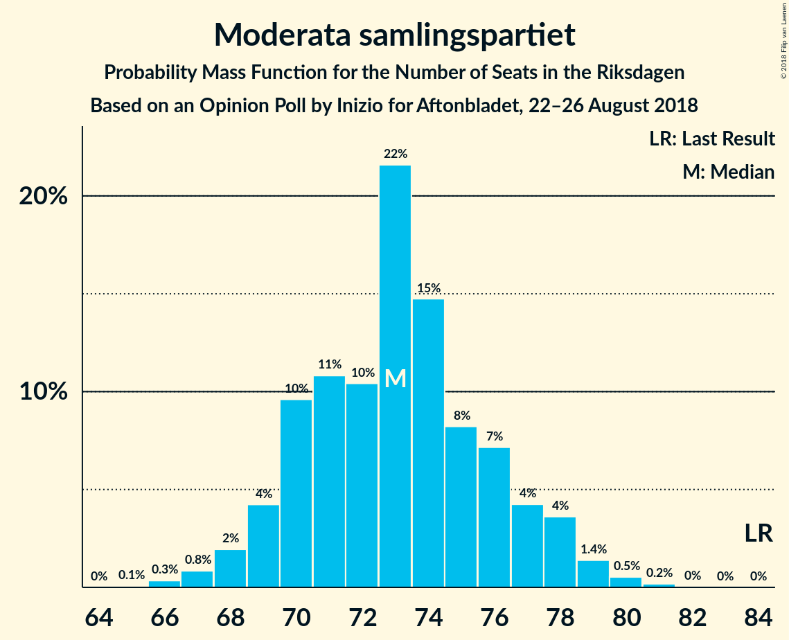
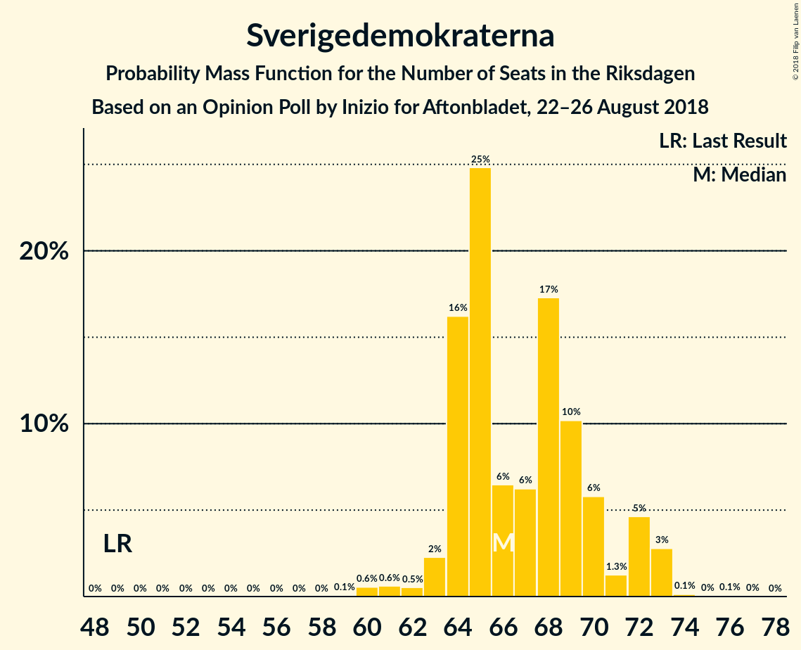
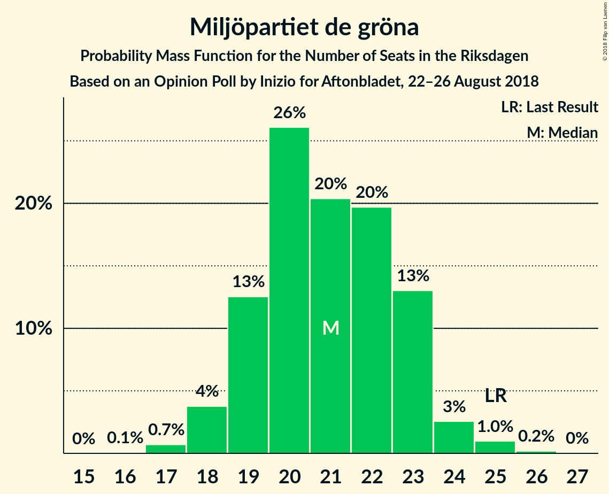
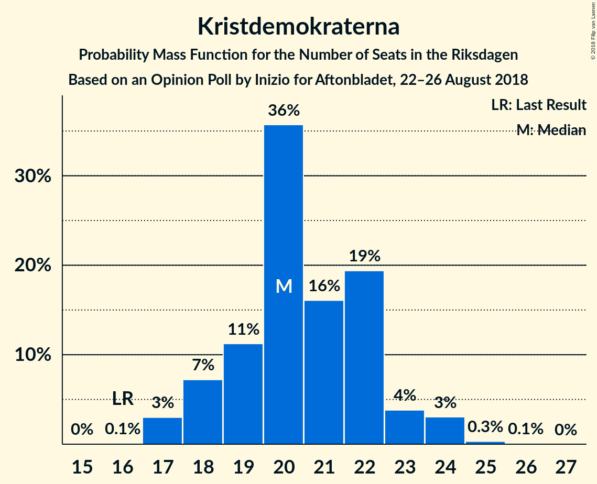

# Opinion Poll by Inizio for Aftonbladet, 22–26 August 2018

<a href="#voting-intentions">Voting Intentions</a> | <a href="#seats">Seats</a> | <a href="#coalitions">Coalitions</a> | <a href="#technical-information">Technical Information</a>

## Voting Intentions

### Confidence Intervals

| Party | Last Result | Poll Result | 80% Confidence Interval | 90% Confidence Interval | 95% Confidence Interval | 99% Confidence Interval |
|:-----:|:-----------:|:-----------:|:-----------------------:|:-----------------------:|:-----------------------:|:-----------------------:|
| Sveriges socialdemokratiska arbetareparti | 31.0% | 24.0% | 23.0–25.0% |22.8–25.2% |22.5–25.5% |22.1–26.0% |
| Moderata samlingspartiet | 23.3% | 20.3% | 19.4–21.2% |19.1–21.5% |18.9–21.7% |18.5–22.2% |
| Sverigedemokraterna | 12.9% | 18.7% | 17.8–19.6% |17.6–19.8% |17.4–20.1% |17.0–20.5% |
| Vänsterpartiet | 5.7% | 8.8% | 8.2–9.5% |8.0–9.6% |7.8–9.8% |7.6–10.2% |
| Centerpartiet | 6.1% | 8.7% | 8.1–9.4% |7.9–9.6% |7.8–9.7% |7.5–10.0% |
| Miljöpartiet de gröna | 6.9% | 5.8% | 5.3–6.4% |5.2–6.5% |5.0–6.7% |4.8–6.9% |
| Kristdemokraterna | 4.6% | 5.7% | 5.2–6.3% |5.1–6.4% |4.9–6.6% |4.7–6.8% |
| Liberalerna | 5.4% | 5.1% | 4.6–5.6% |4.5–5.8% |4.4–5.9% |4.2–6.2% |
| Feministiskt initiativ | 3.1% | 1.4% | 1.2–1.7% |1.1–1.8% |1.0–1.9% |0.9–2.0% |

*Note:* The poll result column reflects the actual value used in the calculations. Published results may vary slightly, and in addition be rounded to fewer digits.

## Seats

### Confidence Intervals

| Party | Last Result | Median | 80% Confidence Interval | 90% Confidence Interval | 95% Confidence Interval | 99% Confidence Interval |
|:-----:|:-----------:|:------:|:-----------------------:|:-----------------------:|:-----------------------:|:-----------------------:|
| <a href="#sveriges-socialdemokratiska-arbetareparti">Sveriges socialdemokratiska arbetareparti</a> | 113 | 87 | 82–90 |81–91 |81–92 |79–93 |
| <a href="#moderata-samlingspartiet">Moderata samlingspartiet</a> | 84 | 73 | 70–76 |69–78 |68–78 |67–80 |
| <a href="#sverigedemokraterna">Sverigedemokraterna</a> | 49 | 66 | 64–70 |64–72 |63–73 |60–73 |
| <a href="#vänsterpartiet">Vänsterpartiet</a> | 21 | 32 | 29–34 |28–35 |28–35 |27–36 |
| <a href="#centerpartiet">Centerpartiet</a> | 22 | 31 | 29–33 |28–34 |28–35 |27–36 |
| <a href="#miljöpartiet-de-gröna">Miljöpartiet de gröna</a> | 25 | 21 | 19–23 |19–23 |18–24 |17–25 |
| <a href="#kristdemokraterna">Kristdemokraterna</a> | 16 | 20 | 18–22 |18–23 |17–24 |17–24 |
| <a href="#liberalerna">Liberalerna</a> | 19 | 19 | 17–20 |16–21 |16–21 |15–22 |
| <a href="#feministiskt-initiativ">Feministiskt initiativ</a> | 0 | 0 | 0 |0 |0 |0 |

### Sveriges socialdemokratiska arbetareparti

*For a full overview of the results for this party, see the [Sveriges socialdemokratiska arbetareparti](party-sverigessocialdemokratiskaarbetareparti.html) page.*

| Number of Seats | Probability | Accumulated | Special Marks |
|:---------------:|:-----------:|:-----------:|:-------------:|
| 77 | 0% | 100% |  |
| 78 | 0.1% | 99.9% |  |
| 79 | 0.7% | 99.9% |  |
| 80 | 2% | 99.2% |  |
| 81 | 3% | 98% |  |
| 82 | 5% | 95% |  |
| 83 | 7% | 89% |  |
| 84 | 13% | 82% |  |
| 85 | 9% | 69% |  |
| 86 | 10% | 60% |  |
| 87 | 14% | 50% | Median |
| 88 | 12% | 36% |  |
| 89 | 7% | 24% |  |
| 90 | 9% | 17% |  |
| 91 | 5% | 8% |  |
| 92 | 3% | 4% |  |
| 93 | 0.6% | 1.1% |  |
| 94 | 0.3% | 0.5% |  |
| 95 | 0.1% | 0.2% |  |
| 96 | 0.1% | 0.1% |  |
| 97 | 0% | 0% |  |
| 98 | 0% | 0% |  |
| 99 | 0% | 0% |  |
| 100 | 0% | 0% |  |
| 101 | 0% | 0% |  |
| 102 | 0% | 0% |  |
| 103 | 0% | 0% |  |
| 104 | 0% | 0% |  |
| 105 | 0% | 0% |  |
| 106 | 0% | 0% |  |
| 107 | 0% | 0% |  |
| 108 | 0% | 0% |  |
| 109 | 0% | 0% |  |
| 110 | 0% | 0% |  |
| 111 | 0% | 0% |  |
| 112 | 0% | 0% |  |
| 113 | 0% | 0% | Last Result |

### Moderata samlingspartiet

*For a full overview of the results for this party, see the [Moderata samlingspartiet](party-moderatasamlingspartiet.html) page.*

| Number of Seats | Probability | Accumulated | Special Marks |
|:---------------:|:-----------:|:-----------:|:-------------:|
| 65 | 0.1% | 100% |  |
| 66 | 0.3% | 99.9% |  |
| 67 | 0.8% | 99.6% |  |
| 68 | 2% | 98.7% |  |
| 69 | 4% | 97% |  |
| 70 | 10% | 93% |  |
| 71 | 11% | 83% |  |
| 72 | 10% | 72% |  |
| 73 | 22% | 62% | Median |
| 74 | 15% | 40% |  |
| 75 | 8% | 25% |  |
| 76 | 7% | 17% |  |
| 77 | 4% | 10% |  |
| 78 | 4% | 6% |  |
| 79 | 1.4% | 2% |  |
| 80 | 0.5% | 0.8% |  |
| 81 | 0.2% | 0.2% |  |
| 82 | 0% | 0% |  |
| 83 | 0% | 0% |  |
| 84 | 0% | 0% | Last Result |

### Sverigedemokraterna

*For a full overview of the results for this party, see the [Sverigedemokraterna](party-sverigedemokraterna.html) page.*

| Number of Seats | Probability | Accumulated | Special Marks |
|:---------------:|:-----------:|:-----------:|:-------------:|
| 49 | 0% | 100% | Last Result |
| 50 | 0% | 100% |  |
| 51 | 0% | 100% |  |
| 52 | 0% | 100% |  |
| 53 | 0% | 100% |  |
| 54 | 0% | 100% |  |
| 55 | 0% | 100% |  |
| 56 | 0% | 100% |  |
| 57 | 0% | 100% |  |
| 58 | 0% | 100% |  |
| 59 | 0.1% | 100% |  |
| 60 | 0.6% | 99.9% |  |
| 61 | 0.6% | 99.4% |  |
| 62 | 0.5% | 98.8% |  |
| 63 | 2% | 98% |  |
| 64 | 16% | 96% |  |
| 65 | 25% | 80% |  |
| 66 | 6% | 55% | Median |
| 67 | 6% | 48% |  |
| 68 | 17% | 42% |  |
| 69 | 10% | 25% |  |
| 70 | 6% | 15% |  |
| 71 | 1.3% | 9% |  |
| 72 | 5% | 8% |  |
| 73 | 3% | 3% |  |
| 74 | 0.1% | 0.2% |  |
| 75 | 0% | 0.1% |  |
| 76 | 0.1% | 0.1% |  |
| 77 | 0% | 0% |  |

### Vänsterpartiet

*For a full overview of the results for this party, see the [Vänsterpartiet](party-vänsterpartiet.html) page.*

| Number of Seats | Probability | Accumulated | Special Marks |
|:---------------:|:-----------:|:-----------:|:-------------:|
| 21 | 0% | 100% | Last Result |
| 22 | 0% | 100% |  |
| 23 | 0% | 100% |  |
| 24 | 0% | 100% |  |
| 25 | 0% | 100% |  |
| 26 | 0.1% | 100% |  |
| 27 | 1.4% | 99.9% |  |
| 28 | 4% | 98.5% |  |
| 29 | 6% | 95% |  |
| 30 | 15% | 89% |  |
| 31 | 16% | 74% |  |
| 32 | 25% | 58% | Median |
| 33 | 17% | 33% |  |
| 34 | 7% | 16% |  |
| 35 | 7% | 9% |  |
| 36 | 1.3% | 2% |  |
| 37 | 0.3% | 0.4% |  |
| 38 | 0.1% | 0.1% |  |
| 39 | 0% | 0% |  |

### Centerpartiet

*For a full overview of the results for this party, see the [Centerpartiet](party-centerpartiet.html) page.*

| Number of Seats | Probability | Accumulated | Special Marks |
|:---------------:|:-----------:|:-----------:|:-------------:|
| 22 | 0% | 100% | Last Result |
| 23 | 0% | 100% |  |
| 24 | 0% | 100% |  |
| 25 | 0% | 100% |  |
| 26 | 0.3% | 100% |  |
| 27 | 1.4% | 99.7% |  |
| 28 | 4% | 98% |  |
| 29 | 12% | 94% |  |
| 30 | 20% | 82% |  |
| 31 | 27% | 62% | Median |
| 32 | 20% | 35% |  |
| 33 | 7% | 15% |  |
| 34 | 5% | 8% |  |
| 35 | 2% | 3% |  |
| 36 | 0.9% | 1.0% |  |
| 37 | 0.1% | 0.1% |  |
| 38 | 0% | 0% |  |

### Miljöpartiet de gröna

*For a full overview of the results for this party, see the [Miljöpartiet de gröna](party-miljöpartietdegröna.html) page.*

| Number of Seats | Probability | Accumulated | Special Marks |
|:---------------:|:-----------:|:-----------:|:-------------:|
| 16 | 0.1% | 100% |  |
| 17 | 0.7% | 99.9% |  |
| 18 | 4% | 99.2% |  |
| 19 | 13% | 95% |  |
| 20 | 26% | 83% |  |
| 21 | 20% | 57% | Median |
| 22 | 20% | 36% |  |
| 23 | 13% | 17% |  |
| 24 | 3% | 4% |  |
| 25 | 1.0% | 1.2% | Last Result |
| 26 | 0.2% | 0.2% |  |
| 27 | 0% | 0% |  |

### Kristdemokraterna

*For a full overview of the results for this party, see the [Kristdemokraterna](party-kristdemokraterna.html) page.*

| Number of Seats | Probability | Accumulated | Special Marks |
|:---------------:|:-----------:|:-----------:|:-------------:|
| 16 | 0.1% | 100% | Last Result |
| 17 | 3% | 99.9% |  |
| 18 | 7% | 97% |  |
| 19 | 11% | 90% |  |
| 20 | 36% | 78% | Median |
| 21 | 16% | 43% |  |
| 22 | 19% | 27% |  |
| 23 | 4% | 7% |  |
| 24 | 3% | 3% |  |
| 25 | 0.3% | 0.4% |  |
| 26 | 0.1% | 0.1% |  |
| 27 | 0% | 0% |  |

### Liberalerna

*For a full overview of the results for this party, see the [Liberalerna](party-liberalerna.html) page.*

| Number of Seats | Probability | Accumulated | Special Marks |
|:---------------:|:-----------:|:-----------:|:-------------:|
| 0 | 0.1% | 100% |  |
| 1 | 0% | 99.9% |  |
| 2 | 0% | 99.9% |  |
| 3 | 0% | 99.9% |  |
| 4 | 0% | 99.9% |  |
| 5 | 0% | 99.9% |  |
| 6 | 0% | 99.9% |  |
| 7 | 0% | 99.9% |  |
| 8 | 0% | 99.9% |  |
| 9 | 0% | 99.9% |  |
| 10 | 0% | 99.9% |  |
| 11 | 0% | 99.9% |  |
| 12 | 0% | 99.9% |  |
| 13 | 0% | 99.9% |  |
| 14 | 0.1% | 99.9% |  |
| 15 | 2% | 99.8% |  |
| 16 | 4% | 98% |  |
| 17 | 15% | 95% |  |
| 18 | 19% | 80% |  |
| 19 | 29% | 60% | Last Result, Median |
| 20 | 23% | 31% |  |
| 21 | 6% | 8% |  |
| 22 | 2% | 2% |  |
| 23 | 0.2% | 0.2% |  |
| 24 | 0% | 0% |  |

### Feministiskt initiativ

*For a full overview of the results for this party, see the [Feministiskt initiativ](party-feministisktinitiativ.html) page.*

| Number of Seats | Probability | Accumulated | Special Marks |
|:---------------:|:-----------:|:-----------:|:-------------:|
| 0 | 100% | 100% | Last Result, Median |

## Coalitions

### Confidence Intervals

| Coalition | Last Result | Median | Majority? | 80% Confidence Interval | 90% Confidence Interval | 95% Confidence Interval | 99% Confidence Interval |
|:---------:|:-----------:|:------:|:---------:|:-----------------------:|:-----------------------:|:-----------------------:|:-----------------------:|
| Sveriges socialdemokratiska arbetareparti – Moderata samlingspartiet – Centerpartiet | 219 | 191 | 100% | 186–194 | 184–195 | 184–196 | 182–199 |
| Moderata samlingspartiet – Sverigedemokraterna – Kristdemokraterna | 149 | 160 | 0% | 156–165 | 155–166 | 153–166 | 152–168 |
| Sveriges socialdemokratiska arbetareparti – Moderata samlingspartiet | 197 | 159 | 0% | 155–163 | 154–165 | 153–165 | 151–168 |
| Moderata samlingspartiet – Centerpartiet – Kristdemokraterna – Liberalerna | 141 | 143 | 0% | 139–148 | 138–149 | 138–150 | 135–152 |
| Moderata samlingspartiet – Sverigedemokraterna | 133 | 140 | 0% | 136–144 | 134–145 | 134–146 | 131–148 |
| Sveriges socialdemokratiska arbetareparti – Vänsterpartiet – Miljöpartiet de gröna – Feministiskt initiativ | 159 | 139 | 0% | 135–144 | 134–144 | 133–145 | 131–147 |
| Sveriges socialdemokratiska arbetareparti – Vänsterpartiet – Miljöpartiet de gröna | 159 | 139 | 0% | 135–144 | 134–144 | 133–145 | 131–147 |
| Moderata samlingspartiet – Centerpartiet – Kristdemokraterna | 122 | 124 | 0% | 121–129 | 120–130 | 119–131 | 117–133 |
| Moderata samlingspartiet – Centerpartiet – Liberalerna | 125 | 123 | 0% | 119–127 | 118–128 | 117–129 | 115–131 |
| Sveriges socialdemokratiska arbetareparti – Vänsterpartiet | 134 | 118 | 0% | 114–122 | 113–123 | 112–124 | 110–126 |
| Sveriges socialdemokratiska arbetareparti – Miljöpartiet de gröna | 138 | 108 | 0% | 103–111 | 102–112 | 101–113 | 99–115 |
| Moderata samlingspartiet – Centerpartiet | 106 | 104 | 0% | 100–108 | 100–109 | 99–110 | 97–112 |

### Sveriges socialdemokratiska arbetareparti – Moderata samlingspartiet – Centerpartiet

| Number of Seats | Probability | Accumulated | Special Marks |
|:---------------:|:-----------:|:-----------:|:-------------:|
| 180 | 0.2% | 100% |  |
| 181 | 0.1% | 99.8% |  |
| 182 | 0.6% | 99.7% |  |
| 183 | 1.0% | 99.0% |  |
| 184 | 4% | 98% |  |
| 185 | 3% | 94% |  |
| 186 | 5% | 91% |  |
| 187 | 6% | 87% |  |
| 188 | 11% | 81% |  |
| 189 | 7% | 70% |  |
| 190 | 8% | 63% |  |
| 191 | 15% | 55% | Median |
| 192 | 8% | 40% |  |
| 193 | 18% | 32% |  |
| 194 | 6% | 14% |  |
| 195 | 4% | 8% |  |
| 196 | 2% | 4% |  |
| 197 | 0.9% | 2% |  |
| 198 | 0.4% | 1.0% |  |
| 199 | 0.4% | 0.6% |  |
| 200 | 0.2% | 0.3% |  |
| 201 | 0.1% | 0.1% |  |
| 202 | 0% | 0.1% |  |
| 203 | 0% | 0% |  |
| 204 | 0% | 0% |  |
| 205 | 0% | 0% |  |
| 206 | 0% | 0% |  |
| 207 | 0% | 0% |  |
| 208 | 0% | 0% |  |
| 209 | 0% | 0% |  |
| 210 | 0% | 0% |  |
| 211 | 0% | 0% |  |
| 212 | 0% | 0% |  |
| 213 | 0% | 0% |  |
| 214 | 0% | 0% |  |
| 215 | 0% | 0% |  |
| 216 | 0% | 0% |  |
| 217 | 0% | 0% |  |
| 218 | 0% | 0% |  |
| 219 | 0% | 0% | Last Result |

### Moderata samlingspartiet – Sverigedemokraterna – Kristdemokraterna

| Number of Seats | Probability | Accumulated | Special Marks |
|:---------------:|:-----------:|:-----------:|:-------------:|
| 149 | 0% | 100% | Last Result |
| 150 | 0.1% | 100% |  |
| 151 | 0.2% | 99.9% |  |
| 152 | 0.7% | 99.7% |  |
| 153 | 2% | 99.0% |  |
| 154 | 2% | 97% |  |
| 155 | 2% | 95% |  |
| 156 | 4% | 93% |  |
| 157 | 9% | 89% |  |
| 158 | 14% | 80% |  |
| 159 | 11% | 66% | Median |
| 160 | 12% | 55% |  |
| 161 | 6% | 43% |  |
| 162 | 8% | 37% |  |
| 163 | 6% | 29% |  |
| 164 | 10% | 23% |  |
| 165 | 7% | 14% |  |
| 166 | 5% | 6% |  |
| 167 | 0.9% | 2% |  |
| 168 | 0.3% | 0.8% |  |
| 169 | 0.2% | 0.5% |  |
| 170 | 0.2% | 0.3% |  |
| 171 | 0.1% | 0.1% |  |
| 172 | 0% | 0% |  |

### Sveriges socialdemokratiska arbetareparti – Moderata samlingspartiet

| Number of Seats | Probability | Accumulated | Special Marks |
|:---------------:|:-----------:|:-----------:|:-------------:|
| 149 | 0.1% | 100% |  |
| 150 | 0.3% | 99.9% |  |
| 151 | 0.8% | 99.6% |  |
| 152 | 0.8% | 98.8% |  |
| 153 | 2% | 98% |  |
| 154 | 3% | 96% |  |
| 155 | 6% | 93% |  |
| 156 | 5% | 87% |  |
| 157 | 9% | 82% |  |
| 158 | 11% | 73% |  |
| 159 | 12% | 62% |  |
| 160 | 11% | 50% | Median |
| 161 | 13% | 38% |  |
| 162 | 7% | 25% |  |
| 163 | 10% | 18% |  |
| 164 | 3% | 9% |  |
| 165 | 3% | 5% |  |
| 166 | 0.8% | 2% |  |
| 167 | 0.8% | 1.3% |  |
| 168 | 0.4% | 0.5% |  |
| 169 | 0.1% | 0.2% |  |
| 170 | 0% | 0.1% |  |
| 171 | 0% | 0% |  |
| 172 | 0% | 0% |  |
| 173 | 0% | 0% |  |
| 174 | 0% | 0% |  |
| 175 | 0% | 0% | Majority |
| 176 | 0% | 0% |  |
| 177 | 0% | 0% |  |
| 178 | 0% | 0% |  |
| 179 | 0% | 0% |  |
| 180 | 0% | 0% |  |
| 181 | 0% | 0% |  |
| 182 | 0% | 0% |  |
| 183 | 0% | 0% |  |
| 184 | 0% | 0% |  |
| 185 | 0% | 0% |  |
| 186 | 0% | 0% |  |
| 187 | 0% | 0% |  |
| 188 | 0% | 0% |  |
| 189 | 0% | 0% |  |
| 190 | 0% | 0% |  |
| 191 | 0% | 0% |  |
| 192 | 0% | 0% |  |
| 193 | 0% | 0% |  |
| 194 | 0% | 0% |  |
| 195 | 0% | 0% |  |
| 196 | 0% | 0% |  |
| 197 | 0% | 0% | Last Result |

### Moderata samlingspartiet – Centerpartiet – Kristdemokraterna – Liberalerna

| Number of Seats | Probability | Accumulated | Special Marks |
|:---------------:|:-----------:|:-----------:|:-------------:|
| 131 | 0% | 100% |  |
| 132 | 0% | 99.9% |  |
| 133 | 0% | 99.9% |  |
| 134 | 0.1% | 99.9% |  |
| 135 | 0.4% | 99.8% |  |
| 136 | 0.5% | 99.4% |  |
| 137 | 1.1% | 98.9% |  |
| 138 | 3% | 98% |  |
| 139 | 10% | 94% |  |
| 140 | 7% | 85% |  |
| 141 | 10% | 78% | Last Result |
| 142 | 8% | 68% |  |
| 143 | 10% | 60% | Median |
| 144 | 11% | 50% |  |
| 145 | 18% | 38% |  |
| 146 | 6% | 21% |  |
| 147 | 5% | 15% |  |
| 148 | 5% | 10% |  |
| 149 | 3% | 5% |  |
| 150 | 1.5% | 3% |  |
| 151 | 0.5% | 1.1% |  |
| 152 | 0.3% | 0.6% |  |
| 153 | 0.2% | 0.3% |  |
| 154 | 0% | 0.1% |  |
| 155 | 0% | 0% |  |

### Moderata samlingspartiet – Sverigedemokraterna

| Number of Seats | Probability | Accumulated | Special Marks |
|:---------------:|:-----------:|:-----------:|:-------------:|
| 130 | 0.1% | 100% |  |
| 131 | 0.5% | 99.9% |  |
| 132 | 0.4% | 99.4% |  |
| 133 | 1.5% | 99.0% | Last Result |
| 134 | 3% | 98% |  |
| 135 | 3% | 95% |  |
| 136 | 9% | 92% |  |
| 137 | 8% | 83% |  |
| 138 | 16% | 76% |  |
| 139 | 7% | 59% | Median |
| 140 | 10% | 53% |  |
| 141 | 12% | 43% |  |
| 142 | 8% | 31% |  |
| 143 | 6% | 22% |  |
| 144 | 7% | 16% |  |
| 145 | 5% | 9% |  |
| 146 | 3% | 5% |  |
| 147 | 1.1% | 2% |  |
| 148 | 0.5% | 0.8% |  |
| 149 | 0.2% | 0.3% |  |
| 150 | 0.1% | 0.1% |  |
| 151 | 0% | 0% |  |

### Sveriges socialdemokratiska arbetareparti – Vänsterpartiet – Miljöpartiet de gröna – Feministiskt initiativ

| Number of Seats | Probability | Accumulated | Special Marks |
|:---------------:|:-----------:|:-----------:|:-------------:|
| 129 | 0.1% | 100% |  |
| 130 | 0.3% | 99.9% |  |
| 131 | 0.4% | 99.7% |  |
| 132 | 1.3% | 99.2% |  |
| 133 | 2% | 98% |  |
| 134 | 5% | 95% |  |
| 135 | 8% | 90% |  |
| 136 | 8% | 82% |  |
| 137 | 8% | 74% |  |
| 138 | 8% | 66% |  |
| 139 | 14% | 58% |  |
| 140 | 14% | 45% | Median |
| 141 | 5% | 30% |  |
| 142 | 8% | 25% |  |
| 143 | 7% | 17% |  |
| 144 | 5% | 10% |  |
| 145 | 3% | 5% |  |
| 146 | 1.4% | 2% |  |
| 147 | 0.2% | 0.7% |  |
| 148 | 0.3% | 0.5% |  |
| 149 | 0.1% | 0.2% |  |
| 150 | 0% | 0% |  |
| 151 | 0% | 0% |  |
| 152 | 0% | 0% |  |
| 153 | 0% | 0% |  |
| 154 | 0% | 0% |  |
| 155 | 0% | 0% |  |
| 156 | 0% | 0% |  |
| 157 | 0% | 0% |  |
| 158 | 0% | 0% |  |
| 159 | 0% | 0% | Last Result |

### Sveriges socialdemokratiska arbetareparti – Vänsterpartiet – Miljöpartiet de gröna

| Number of Seats | Probability | Accumulated | Special Marks |
|:---------------:|:-----------:|:-----------:|:-------------:|
| 129 | 0.1% | 100% |  |
| 130 | 0.3% | 99.9% |  |
| 131 | 0.4% | 99.7% |  |
| 132 | 1.3% | 99.2% |  |
| 133 | 2% | 98% |  |
| 134 | 5% | 95% |  |
| 135 | 8% | 90% |  |
| 136 | 8% | 82% |  |
| 137 | 8% | 74% |  |
| 138 | 8% | 66% |  |
| 139 | 14% | 58% |  |
| 140 | 14% | 45% | Median |
| 141 | 5% | 30% |  |
| 142 | 8% | 25% |  |
| 143 | 7% | 17% |  |
| 144 | 5% | 10% |  |
| 145 | 3% | 5% |  |
| 146 | 1.4% | 2% |  |
| 147 | 0.2% | 0.7% |  |
| 148 | 0.3% | 0.5% |  |
| 149 | 0.1% | 0.2% |  |
| 150 | 0% | 0% |  |
| 151 | 0% | 0% |  |
| 152 | 0% | 0% |  |
| 153 | 0% | 0% |  |
| 154 | 0% | 0% |  |
| 155 | 0% | 0% |  |
| 156 | 0% | 0% |  |
| 157 | 0% | 0% |  |
| 158 | 0% | 0% |  |
| 159 | 0% | 0% | Last Result |

### Moderata samlingspartiet – Centerpartiet – Kristdemokraterna

| Number of Seats | Probability | Accumulated | Special Marks |
|:---------------:|:-----------:|:-----------:|:-------------:|
| 115 | 0.1% | 100% |  |
| 116 | 0.1% | 99.9% |  |
| 117 | 0.4% | 99.8% |  |
| 118 | 0.6% | 99.4% |  |
| 119 | 2% | 98.8% |  |
| 120 | 5% | 97% |  |
| 121 | 9% | 93% |  |
| 122 | 11% | 83% | Last Result |
| 123 | 11% | 72% |  |
| 124 | 11% | 61% | Median |
| 125 | 18% | 50% |  |
| 126 | 11% | 32% |  |
| 127 | 5% | 21% |  |
| 128 | 5% | 17% |  |
| 129 | 3% | 12% |  |
| 130 | 5% | 8% |  |
| 131 | 1.4% | 3% |  |
| 132 | 1.4% | 2% |  |
| 133 | 0.3% | 0.5% |  |
| 134 | 0.1% | 0.3% |  |
| 135 | 0.1% | 0.1% |  |
| 136 | 0% | 0% |  |

### Moderata samlingspartiet – Centerpartiet – Liberalerna

| Number of Seats | Probability | Accumulated | Special Marks |
|:---------------:|:-----------:|:-----------:|:-------------:|
| 110 | 0% | 100% |  |
| 111 | 0% | 99.9% |  |
| 112 | 0% | 99.9% |  |
| 113 | 0.1% | 99.9% |  |
| 114 | 0.1% | 99.8% |  |
| 115 | 0.7% | 99.7% |  |
| 116 | 0.7% | 99.0% |  |
| 117 | 1.3% | 98% |  |
| 118 | 5% | 97% |  |
| 119 | 7% | 92% |  |
| 120 | 10% | 85% |  |
| 121 | 10% | 74% |  |
| 122 | 8% | 64% |  |
| 123 | 13% | 56% | Median |
| 124 | 13% | 43% |  |
| 125 | 11% | 30% | Last Result |
| 126 | 7% | 19% |  |
| 127 | 5% | 12% |  |
| 128 | 4% | 6% |  |
| 129 | 2% | 3% |  |
| 130 | 0.6% | 1.1% |  |
| 131 | 0.3% | 0.5% |  |
| 132 | 0.1% | 0.2% |  |
| 133 | 0.1% | 0.1% |  |
| 134 | 0% | 0% |  |

### Sveriges socialdemokratiska arbetareparti – Vänsterpartiet

| Number of Seats | Probability | Accumulated | Special Marks |
|:---------------:|:-----------:|:-----------:|:-------------:|
| 108 | 0.1% | 100% |  |
| 109 | 0.2% | 99.9% |  |
| 110 | 0.4% | 99.8% |  |
| 111 | 0.9% | 99.4% |  |
| 112 | 2% | 98% |  |
| 113 | 3% | 96% |  |
| 114 | 7% | 93% |  |
| 115 | 11% | 86% |  |
| 116 | 12% | 75% |  |
| 117 | 10% | 64% |  |
| 118 | 10% | 54% |  |
| 119 | 7% | 43% | Median |
| 120 | 10% | 36% |  |
| 121 | 9% | 27% |  |
| 122 | 9% | 18% |  |
| 123 | 6% | 9% |  |
| 124 | 1.5% | 3% |  |
| 125 | 0.7% | 2% |  |
| 126 | 1.0% | 1.3% |  |
| 127 | 0.2% | 0.3% |  |
| 128 | 0% | 0.1% |  |
| 129 | 0% | 0% |  |
| 130 | 0% | 0% |  |
| 131 | 0% | 0% |  |
| 132 | 0% | 0% |  |
| 133 | 0% | 0% |  |
| 134 | 0% | 0% | Last Result |

### Sveriges socialdemokratiska arbetareparti – Miljöpartiet de gröna

| Number of Seats | Probability | Accumulated | Special Marks |
|:---------------:|:-----------:|:-----------:|:-------------:|
| 98 | 0.1% | 100% |  |
| 99 | 0.5% | 99.9% |  |
| 100 | 0.7% | 99.4% |  |
| 101 | 2% | 98.6% |  |
| 102 | 4% | 97% |  |
| 103 | 9% | 92% |  |
| 104 | 5% | 83% |  |
| 105 | 6% | 79% |  |
| 106 | 9% | 72% |  |
| 107 | 12% | 63% |  |
| 108 | 17% | 52% | Median |
| 109 | 11% | 35% |  |
| 110 | 9% | 24% |  |
| 111 | 6% | 15% |  |
| 112 | 5% | 9% |  |
| 113 | 3% | 4% |  |
| 114 | 0.8% | 1.4% |  |
| 115 | 0.3% | 0.6% |  |
| 116 | 0.2% | 0.3% |  |
| 117 | 0.1% | 0.1% |  |
| 118 | 0% | 0% |  |
| 119 | 0% | 0% |  |
| 120 | 0% | 0% |  |
| 121 | 0% | 0% |  |
| 122 | 0% | 0% |  |
| 123 | 0% | 0% |  |
| 124 | 0% | 0% |  |
| 125 | 0% | 0% |  |
| 126 | 0% | 0% |  |
| 127 | 0% | 0% |  |
| 128 | 0% | 0% |  |
| 129 | 0% | 0% |  |
| 130 | 0% | 0% |  |
| 131 | 0% | 0% |  |
| 132 | 0% | 0% |  |
| 133 | 0% | 0% |  |
| 134 | 0% | 0% |  |
| 135 | 0% | 0% |  |
| 136 | 0% | 0% |  |
| 137 | 0% | 0% |  |
| 138 | 0% | 0% | Last Result |

### Moderata samlingspartiet – Centerpartiet

| Number of Seats | Probability | Accumulated | Special Marks |
|:---------------:|:-----------:|:-----------:|:-------------:|
| 95 | 0.1% | 100% |  |
| 96 | 0.2% | 99.9% |  |
| 97 | 0.5% | 99.7% |  |
| 98 | 0.8% | 99.2% |  |
| 99 | 2% | 98% |  |
| 100 | 9% | 96% |  |
| 101 | 9% | 87% |  |
| 102 | 6% | 78% |  |
| 103 | 16% | 72% |  |
| 104 | 13% | 57% | Median |
| 105 | 18% | 44% |  |
| 106 | 7% | 26% | Last Result |
| 107 | 4% | 19% |  |
| 108 | 7% | 14% |  |
| 109 | 3% | 8% |  |
| 110 | 3% | 4% |  |
| 111 | 0.6% | 1.4% |  |
| 112 | 0.5% | 0.8% |  |
| 113 | 0.2% | 0.3% |  |
| 114 | 0.1% | 0.1% |  |
| 115 | 0% | 0% |  |

## Technical Information

### Opinion Poll

+ **Polling firm:** Inizio
+ **Commissioner(s):** Aftonbladet
+ **Fieldwork period:** 22–26 August 2018

### Calculations

+ **Sample size:** 3212
+ **Simulations done:** 1,048,576
+ **Error estimate:** 0.64%

