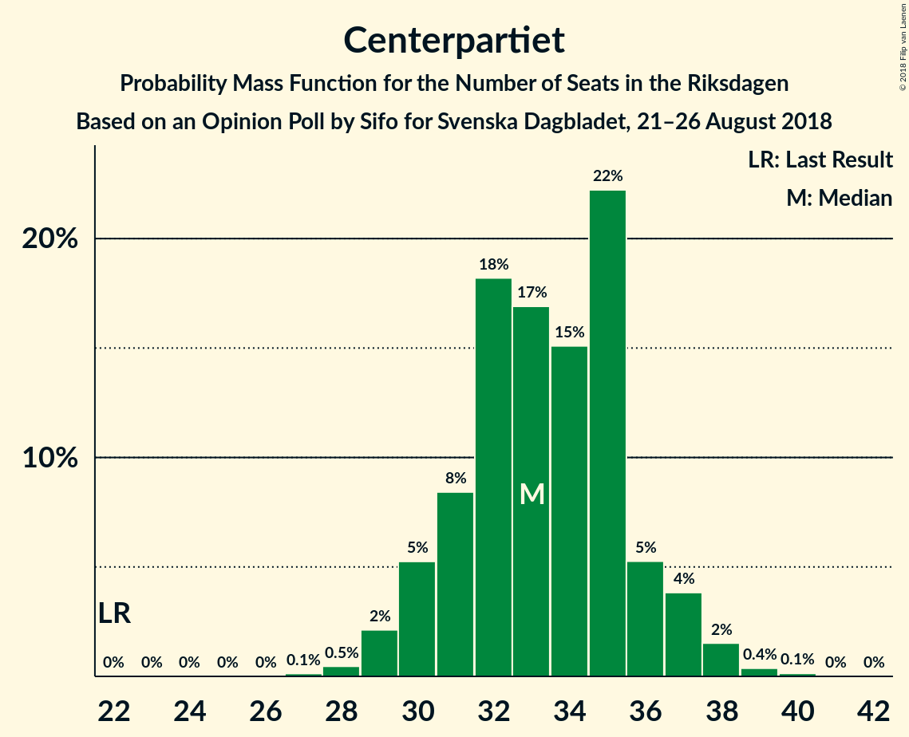
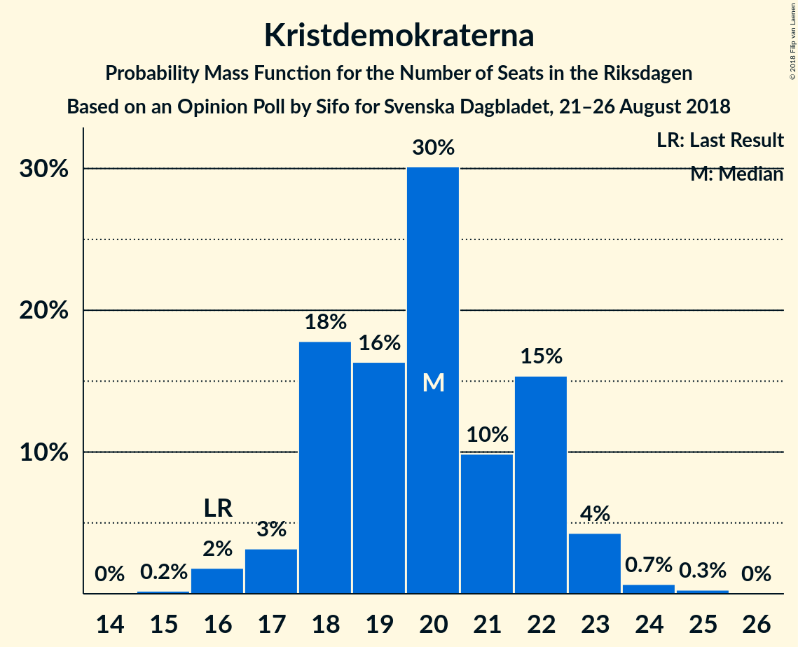
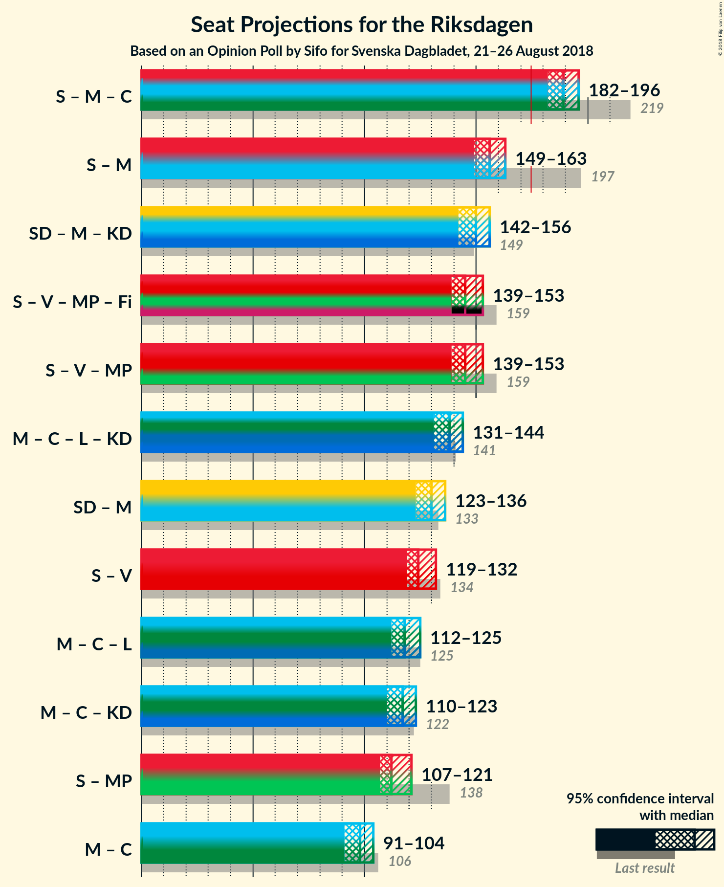

# Opinion Poll by Sifo for Svenska Dagbladet, 21–26 August 2018

<a href="#voting-intentions">Voting Intentions</a> | <a href="#seats">Seats</a> | <a href="#coalitions">Coalitions</a> | <a href="#technical-information">Technical Information</a>

## Voting Intentions

### Confidence Intervals

| Party | Last Result | Poll Result | 80% Confidence Interval | 90% Confidence Interval | 95% Confidence Interval | 99% Confidence Interval |
|:-----:|:-----------:|:-----------:|:-----------------------:|:-----------------------:|:-----------------------:|:-----------------------:|
| Sveriges socialdemokratiska arbetareparti | 31.0% | 26.2% | 25.1–27.3% |24.8–27.6% |24.6–27.9% |24.1–28.4% |
| Sverigedemokraterna | 12.9% | 18.5% | 17.6–19.5% |17.3–19.8% |17.1–20.0% |16.6–20.5% |
| Moderata samlingspartiet | 23.3% | 17.9% | 17.0–18.9% |16.7–19.2% |16.5–19.4% |16.0–19.9% |
| Centerpartiet | 6.1% | 9.3% | 8.6–10.1% |8.4–10.3% |8.3–10.5% |7.9–10.8% |
| Vänsterpartiet | 5.7% | 9.1% | 8.4–9.9% |8.2–10.1% |8.1–10.3% |7.8–10.6% |
| Miljöpartiet de gröna | 6.9% | 5.8% | 5.3–6.4% |5.1–6.6% |5.0–6.8% |4.7–7.1% |
| Liberalerna | 5.4% | 5.8% | 5.3–6.4% |5.1–6.6% |5.0–6.8% |4.7–7.1% |
| Kristdemokraterna | 4.6% | 5.5% | 5.0–6.1% |4.8–6.3% |4.7–6.4% |4.4–6.7% |

*Note:* The poll result column reflects the actual value used in the calculations. Published results may vary slightly, and in addition be rounded to fewer digits.

## Seats

### Confidence Intervals

| Party | Last Result | Median | 80% Confidence Interval | 90% Confidence Interval | 95% Confidence Interval | 99% Confidence Interval |
|:-----:|:-----------:|:------:|:-----------------------:|:-----------------------:|:-----------------------:|:-----------------------:|
| <a href="#sveriges-socialdemokratiska-arbetareparti">Sveriges socialdemokratiska arbetareparti</a> | 113 | 90 | 88–99 |87–99 |86–99 |85–100 |
| <a href="#sverigedemokraterna">Sverigedemokraterna</a> | 49 | 66 | 62–70 |61–71 |61–71 |59–73 |
| <a href="#moderata-samlingspartiet">Moderata samlingspartiet</a> | 84 | 63 | 59–67 |59–69 |59–69 |58–71 |
| <a href="#centerpartiet">Centerpartiet</a> | 22 | 32 | 30–35 |29–37 |29–37 |28–39 |
| <a href="#vänsterpartiet">Vänsterpartiet</a> | 21 | 32 | 30–35 |29–36 |28–36 |27–38 |
| <a href="#miljöpartiet-de-gröna">Miljöpartiet de gröna</a> | 25 | 21 | 19–23 |18–24 |18–25 |17–25 |
| <a href="#liberalerna">Liberalerna</a> | 19 | 21 | 19–22 |19–23 |19–24 |17–24 |
| <a href="#kristdemokraterna">Kristdemokraterna</a> | 16 | 20 | 18–23 |17–23 |16–23 |16–24 |

### Sveriges socialdemokratiska arbetareparti

*For a full overview of the results for this party, see the [Sveriges socialdemokratiska arbetareparti](party-sverigessocialdemokratiskaarbetareparti.html) page.*

| Number of Seats | Probability | Accumulated | Special Marks |
|:---------------:|:-----------:|:-----------:|:-------------:|
| 84 | 0.1% | 100% |  |
| 85 | 0.9% | 99.9% |  |
| 86 | 2% | 99.0% |  |
| 87 | 6% | 97% |  |
| 88 | 18% | 91% |  |
| 89 | 14% | 73% |  |
| 90 | 9% | 59% | Median |
| 91 | 1.3% | 50% |  |
| 92 | 0.7% | 48% |  |
| 93 | 0.4% | 48% |  |
| 94 | 2% | 47% |  |
| 95 | 3% | 45% |  |
| 96 | 8% | 43% |  |
| 97 | 19% | 35% |  |
| 98 | 5% | 16% |  |
| 99 | 10% | 11% |  |
| 100 | 0.8% | 1.0% |  |
| 101 | 0.1% | 0.2% |  |
| 102 | 0.1% | 0.1% |  |
| 103 | 0% | 0% |  |
| 104 | 0% | 0% |  |
| 105 | 0% | 0% |  |
| 106 | 0% | 0% |  |
| 107 | 0% | 0% |  |
| 108 | 0% | 0% |  |
| 109 | 0% | 0% |  |
| 110 | 0% | 0% |  |
| 111 | 0% | 0% |  |
| 112 | 0% | 0% |  |
| 113 | 0% | 0% | Last Result |

### Sverigedemokraterna

*For a full overview of the results for this party, see the [Sverigedemokraterna](party-sverigedemokraterna.html) page.*

| Number of Seats | Probability | Accumulated | Special Marks |
|:---------------:|:-----------:|:-----------:|:-------------:|
| 49 | 0% | 100% | Last Result |
| 50 | 0% | 100% |  |
| 51 | 0% | 100% |  |
| 52 | 0% | 100% |  |
| 53 | 0% | 100% |  |
| 54 | 0% | 100% |  |
| 55 | 0% | 100% |  |
| 56 | 0% | 100% |  |
| 57 | 0.1% | 100% |  |
| 58 | 0.1% | 99.9% |  |
| 59 | 0.9% | 99.8% |  |
| 60 | 1.2% | 98.9% |  |
| 61 | 3% | 98% |  |
| 62 | 5% | 94% |  |
| 63 | 3% | 89% |  |
| 64 | 8% | 86% |  |
| 65 | 21% | 77% |  |
| 66 | 13% | 56% | Median |
| 67 | 10% | 43% |  |
| 68 | 16% | 33% |  |
| 69 | 3% | 17% |  |
| 70 | 9% | 14% |  |
| 71 | 3% | 5% |  |
| 72 | 2% | 2% |  |
| 73 | 0.3% | 0.6% |  |
| 74 | 0.2% | 0.3% |  |
| 75 | 0% | 0.1% |  |
| 76 | 0.1% | 0.1% |  |
| 77 | 0% | 0% |  |

### Moderata samlingspartiet

*For a full overview of the results for this party, see the [Moderata samlingspartiet](party-moderatasamlingspartiet.html) page.*

| Number of Seats | Probability | Accumulated | Special Marks |
|:---------------:|:-----------:|:-----------:|:-------------:|
| 55 | 0% | 100% |  |
| 56 | 0.1% | 99.9% |  |
| 57 | 0.2% | 99.8% |  |
| 58 | 0.8% | 99.6% |  |
| 59 | 16% | 98.8% |  |
| 60 | 9% | 83% |  |
| 61 | 4% | 74% |  |
| 62 | 11% | 70% |  |
| 63 | 12% | 59% | Median |
| 64 | 19% | 47% |  |
| 65 | 11% | 28% |  |
| 66 | 3% | 18% |  |
| 67 | 5% | 15% |  |
| 68 | 4% | 9% |  |
| 69 | 3% | 6% |  |
| 70 | 0.7% | 2% |  |
| 71 | 1.3% | 2% |  |
| 72 | 0.3% | 0.3% |  |
| 73 | 0% | 0% |  |
| 74 | 0% | 0% |  |
| 75 | 0% | 0% |  |
| 76 | 0% | 0% |  |
| 77 | 0% | 0% |  |
| 78 | 0% | 0% |  |
| 79 | 0% | 0% |  |
| 80 | 0% | 0% |  |
| 81 | 0% | 0% |  |
| 82 | 0% | 0% |  |
| 83 | 0% | 0% |  |
| 84 | 0% | 0% | Last Result |

### Centerpartiet

*For a full overview of the results for this party, see the [Centerpartiet](party-centerpartiet.html) page.*

| Number of Seats | Probability | Accumulated | Special Marks |
|:---------------:|:-----------:|:-----------:|:-------------:|
| 22 | 0% | 100% | Last Result |
| 23 | 0% | 100% |  |
| 24 | 0% | 100% |  |
| 25 | 0% | 100% |  |
| 26 | 0% | 100% |  |
| 27 | 0.3% | 100% |  |
| 28 | 0.3% | 99.7% |  |
| 29 | 8% | 99.4% |  |
| 30 | 9% | 91% |  |
| 31 | 3% | 82% |  |
| 32 | 34% | 79% | Median |
| 33 | 14% | 45% |  |
| 34 | 12% | 31% |  |
| 35 | 10% | 19% |  |
| 36 | 4% | 9% |  |
| 37 | 3% | 5% |  |
| 38 | 1.0% | 2% |  |
| 39 | 1.0% | 1.1% |  |
| 40 | 0% | 0.1% |  |
| 41 | 0% | 0% |  |

### Vänsterpartiet

*For a full overview of the results for this party, see the [Vänsterpartiet](party-vänsterpartiet.html) page.*

| Number of Seats | Probability | Accumulated | Special Marks |
|:---------------:|:-----------:|:-----------:|:-------------:|
| 21 | 0% | 100% | Last Result |
| 22 | 0% | 100% |  |
| 23 | 0% | 100% |  |
| 24 | 0% | 100% |  |
| 25 | 0% | 100% |  |
| 26 | 0% | 100% |  |
| 27 | 0.6% | 100% |  |
| 28 | 2% | 99.3% |  |
| 29 | 5% | 97% |  |
| 30 | 8% | 93% |  |
| 31 | 17% | 84% |  |
| 32 | 20% | 67% | Median |
| 33 | 23% | 47% |  |
| 34 | 7% | 24% |  |
| 35 | 12% | 17% |  |
| 36 | 3% | 5% |  |
| 37 | 0.9% | 2% |  |
| 38 | 0.7% | 1.0% |  |
| 39 | 0.2% | 0.3% |  |
| 40 | 0.1% | 0.1% |  |
| 41 | 0% | 0% |  |

### Miljöpartiet de gröna

*For a full overview of the results for this party, see the [Miljöpartiet de gröna](party-miljöpartietdegröna.html) page.*

| Number of Seats | Probability | Accumulated | Special Marks |
|:---------------:|:-----------:|:-----------:|:-------------:|
| 16 | 0% | 100% |  |
| 17 | 1.4% | 99.9% |  |
| 18 | 5% | 98.5% |  |
| 19 | 13% | 94% |  |
| 20 | 13% | 81% |  |
| 21 | 23% | 68% | Median |
| 22 | 25% | 45% |  |
| 23 | 14% | 20% |  |
| 24 | 3% | 6% |  |
| 25 | 3% | 3% | Last Result |
| 26 | 0.1% | 0.1% |  |
| 27 | 0% | 0% |  |

### Liberalerna

*For a full overview of the results for this party, see the [Liberalerna](party-liberalerna.html) page.*

| Number of Seats | Probability | Accumulated | Special Marks |
|:---------------:|:-----------:|:-----------:|:-------------:|
| 16 | 0.3% | 100% |  |
| 17 | 0.4% | 99.7% |  |
| 18 | 0.7% | 99.3% |  |
| 19 | 11% | 98.6% | Last Result |
| 20 | 25% | 88% |  |
| 21 | 21% | 63% | Median |
| 22 | 33% | 42% |  |
| 23 | 7% | 9% |  |
| 24 | 2% | 3% |  |
| 25 | 0.3% | 0.4% |  |
| 26 | 0.1% | 0.1% |  |
| 27 | 0% | 0% |  |

### Kristdemokraterna

*For a full overview of the results for this party, see the [Kristdemokraterna](party-kristdemokraterna.html) page.*

| Number of Seats | Probability | Accumulated | Special Marks |
|:---------------:|:-----------:|:-----------:|:-------------:|
| 15 | 0.5% | 100% |  |
| 16 | 3% | 99.5% | Last Result |
| 17 | 2% | 96% |  |
| 18 | 15% | 94% |  |
| 19 | 13% | 79% |  |
| 20 | 37% | 66% | Median |
| 21 | 14% | 30% |  |
| 22 | 3% | 15% |  |
| 23 | 12% | 12% |  |
| 24 | 0.5% | 0.6% |  |
| 25 | 0.1% | 0.1% |  |
| 26 | 0% | 0% |  |

## Coalitions

### Confidence Intervals

| Coalition | Last Result | Median | Majority? | 80% Confidence Interval | 90% Confidence Interval | 95% Confidence Interval | 99% Confidence Interval |
|:---------:|:-----------:|:------:|:---------:|:-----------------------:|:-----------------------:|:-----------------------:|:-----------------------:|
| Sveriges socialdemokratiska arbetareparti – Moderata samlingspartiet – Centerpartiet | 219 | 188 | 100% | 184–194 | 184–194 | 184–196 | 181–198 |
| Sveriges socialdemokratiska arbetareparti – Moderata samlingspartiet | 197 | 156 | 0% | 151–161 | 150–163 | 149–165 | 148–166 |
| Sverigedemokraterna – Moderata samlingspartiet – Kristdemokraterna | 149 | 149 | 0% | 144–154 | 142–155 | 142–157 | 140–159 |
| Sveriges socialdemokratiska arbetareparti – Vänsterpartiet – Miljöpartiet de gröna | 159 | 146 | 0% | 141–152 | 139–153 | 136–153 | 136–157 |
| Moderata samlingspartiet – Centerpartiet – Liberalerna – Kristdemokraterna | 141 | 137 | 0% | 132–142 | 131–143 | 129–146 | 128–147 |
| Sverigedemokraterna – Moderata samlingspartiet | 133 | 130 | 0% | 124–133 | 124–135 | 123–137 | 121–139 |
| Sveriges socialdemokratiska arbetareparti – Vänsterpartiet | 134 | 124 | 0% | 119–131 | 119–132 | 117–133 | 117–136 |
| Moderata samlingspartiet – Centerpartiet – Liberalerna | 125 | 117 | 0% | 113–122 | 112–125 | 111–126 | 110–127 |
| Moderata samlingspartiet – Centerpartiet – Kristdemokraterna | 122 | 116 | 0% | 110–120 | 110–123 | 108–124 | 107–126 |
| Sveriges socialdemokratiska arbetareparti – Miljöpartiet de gröna | 138 | 112 | 0% | 107–119 | 107–121 | 106–122 | 105–122 |
| Moderata samlingspartiet – Centerpartiet | 106 | 96 | 0% | 91–101 | 91–104 | 90–104 | 89–105 |

### Sveriges socialdemokratiska arbetareparti – Moderata samlingspartiet – Centerpartiet

| Number of Seats | Probability | Accumulated | Special Marks |
|:---------------:|:-----------:|:-----------:|:-------------:|
| 179 | 0.3% | 100% |  |
| 180 | 0.1% | 99.7% |  |
| 181 | 0.5% | 99.6% |  |
| 182 | 0.5% | 99.1% |  |
| 183 | 0.8% | 98.6% |  |
| 184 | 9% | 98% |  |
| 185 | 11% | 88% | Median |
| 186 | 12% | 77% |  |
| 187 | 10% | 66% |  |
| 188 | 16% | 55% |  |
| 189 | 2% | 39% |  |
| 190 | 10% | 37% |  |
| 191 | 11% | 28% |  |
| 192 | 4% | 16% |  |
| 193 | 1.2% | 12% |  |
| 194 | 6% | 11% |  |
| 195 | 2% | 5% |  |
| 196 | 1.0% | 3% |  |
| 197 | 0.5% | 2% |  |
| 198 | 2% | 2% |  |
| 199 | 0.1% | 0.2% |  |
| 200 | 0% | 0.1% |  |
| 201 | 0% | 0.1% |  |
| 202 | 0% | 0.1% |  |
| 203 | 0% | 0% |  |
| 204 | 0% | 0% |  |
| 205 | 0% | 0% |  |
| 206 | 0% | 0% |  |
| 207 | 0% | 0% |  |
| 208 | 0% | 0% |  |
| 209 | 0% | 0% |  |
| 210 | 0% | 0% |  |
| 211 | 0% | 0% |  |
| 212 | 0% | 0% |  |
| 213 | 0% | 0% |  |
| 214 | 0% | 0% |  |
| 215 | 0% | 0% |  |
| 216 | 0% | 0% |  |
| 217 | 0% | 0% |  |
| 218 | 0% | 0% |  |
| 219 | 0% | 0% | Last Result |

### Sveriges socialdemokratiska arbetareparti – Moderata samlingspartiet

| Number of Seats | Probability | Accumulated | Special Marks |
|:---------------:|:-----------:|:-----------:|:-------------:|
| 145 | 0.1% | 100% |  |
| 146 | 0.1% | 99.9% |  |
| 147 | 0.1% | 99.7% |  |
| 148 | 2% | 99.6% |  |
| 149 | 1.0% | 98% |  |
| 150 | 4% | 97% |  |
| 151 | 8% | 92% |  |
| 152 | 9% | 84% |  |
| 153 | 2% | 75% | Median |
| 154 | 17% | 73% |  |
| 155 | 3% | 57% |  |
| 156 | 20% | 53% |  |
| 157 | 4% | 33% |  |
| 158 | 4% | 29% |  |
| 159 | 5% | 25% |  |
| 160 | 5% | 20% |  |
| 161 | 7% | 15% |  |
| 162 | 3% | 8% |  |
| 163 | 2% | 5% |  |
| 164 | 0.3% | 3% |  |
| 165 | 2% | 3% |  |
| 166 | 0.3% | 0.6% |  |
| 167 | 0.3% | 0.3% |  |
| 168 | 0% | 0.1% |  |
| 169 | 0% | 0% |  |
| 170 | 0% | 0% |  |
| 171 | 0% | 0% |  |
| 172 | 0% | 0% |  |
| 173 | 0% | 0% |  |
| 174 | 0% | 0% |  |
| 175 | 0% | 0% | Majority |
| 176 | 0% | 0% |  |
| 177 | 0% | 0% |  |
| 178 | 0% | 0% |  |
| 179 | 0% | 0% |  |
| 180 | 0% | 0% |  |
| 181 | 0% | 0% |  |
| 182 | 0% | 0% |  |
| 183 | 0% | 0% |  |
| 184 | 0% | 0% |  |
| 185 | 0% | 0% |  |
| 186 | 0% | 0% |  |
| 187 | 0% | 0% |  |
| 188 | 0% | 0% |  |
| 189 | 0% | 0% |  |
| 190 | 0% | 0% |  |
| 191 | 0% | 0% |  |
| 192 | 0% | 0% |  |
| 193 | 0% | 0% |  |
| 194 | 0% | 0% |  |
| 195 | 0% | 0% |  |
| 196 | 0% | 0% |  |
| 197 | 0% | 0% | Last Result |

### Sverigedemokraterna – Moderata samlingspartiet – Kristdemokraterna

| Number of Seats | Probability | Accumulated | Special Marks |
|:---------------:|:-----------:|:-----------:|:-------------:|
| 137 | 0.1% | 100% |  |
| 138 | 0.1% | 99.9% |  |
| 139 | 0.2% | 99.8% |  |
| 140 | 0.2% | 99.6% |  |
| 141 | 0.9% | 99.4% |  |
| 142 | 4% | 98% |  |
| 143 | 3% | 95% |  |
| 144 | 18% | 91% |  |
| 145 | 1.1% | 73% |  |
| 146 | 2% | 72% |  |
| 147 | 4% | 70% |  |
| 148 | 10% | 66% |  |
| 149 | 7% | 56% | Last Result, Median |
| 150 | 6% | 49% |  |
| 151 | 4% | 43% |  |
| 152 | 14% | 39% |  |
| 153 | 3% | 25% |  |
| 154 | 15% | 22% |  |
| 155 | 2% | 7% |  |
| 156 | 1.1% | 4% |  |
| 157 | 1.1% | 3% |  |
| 158 | 1.0% | 2% |  |
| 159 | 1.1% | 1.2% |  |
| 160 | 0.1% | 0.1% |  |
| 161 | 0% | 0% |  |

### Sveriges socialdemokratiska arbetareparti – Vänsterpartiet – Miljöpartiet de gröna

| Number of Seats | Probability | Accumulated | Special Marks |
|:---------------:|:-----------:|:-----------:|:-------------:|
| 135 | 0.2% | 100% |  |
| 136 | 2% | 99.8% |  |
| 137 | 0.1% | 97% |  |
| 138 | 1.2% | 97% |  |
| 139 | 3% | 96% |  |
| 140 | 2% | 93% |  |
| 141 | 7% | 91% |  |
| 142 | 13% | 84% |  |
| 143 | 3% | 71% | Median |
| 144 | 11% | 68% |  |
| 145 | 3% | 57% |  |
| 146 | 8% | 54% |  |
| 147 | 3% | 46% |  |
| 148 | 4% | 43% |  |
| 149 | 5% | 38% |  |
| 150 | 8% | 33% |  |
| 151 | 15% | 25% |  |
| 152 | 4% | 11% |  |
| 153 | 4% | 6% |  |
| 154 | 0.5% | 2% |  |
| 155 | 0.7% | 2% |  |
| 156 | 0.1% | 0.9% |  |
| 157 | 0.7% | 0.8% |  |
| 158 | 0% | 0% |  |
| 159 | 0% | 0% | Last Result |

### Moderata samlingspartiet – Centerpartiet – Liberalerna – Kristdemokraterna

| Number of Seats | Probability | Accumulated | Special Marks |
|:---------------:|:-----------:|:-----------:|:-------------:|
| 126 | 0.2% | 100% |  |
| 127 | 0.1% | 99.8% |  |
| 128 | 0.9% | 99.7% |  |
| 129 | 3% | 98.8% |  |
| 130 | 0.6% | 96% |  |
| 131 | 2% | 96% |  |
| 132 | 7% | 93% |  |
| 133 | 18% | 86% |  |
| 134 | 3% | 68% |  |
| 135 | 8% | 66% |  |
| 136 | 3% | 57% | Median |
| 137 | 12% | 54% |  |
| 138 | 9% | 42% |  |
| 139 | 8% | 33% |  |
| 140 | 3% | 26% |  |
| 141 | 12% | 22% | Last Result |
| 142 | 0.6% | 10% |  |
| 143 | 5% | 10% |  |
| 144 | 0.9% | 5% |  |
| 145 | 1.0% | 4% |  |
| 146 | 2% | 3% |  |
| 147 | 0.4% | 0.8% |  |
| 148 | 0.2% | 0.4% |  |
| 149 | 0% | 0.2% |  |
| 150 | 0.2% | 0.2% |  |
| 151 | 0% | 0% |  |

### Sverigedemokraterna – Moderata samlingspartiet

| Number of Seats | Probability | Accumulated | Special Marks |
|:---------------:|:-----------:|:-----------:|:-------------:|
| 118 | 0.2% | 100% |  |
| 119 | 0% | 99.8% |  |
| 120 | 0.2% | 99.8% |  |
| 121 | 0.2% | 99.6% |  |
| 122 | 0.3% | 99.4% |  |
| 123 | 3% | 99.1% |  |
| 124 | 19% | 97% |  |
| 125 | 4% | 77% |  |
| 126 | 4% | 73% |  |
| 127 | 4% | 69% |  |
| 128 | 4% | 65% |  |
| 129 | 8% | 62% | Median |
| 130 | 5% | 54% |  |
| 131 | 13% | 49% |  |
| 132 | 17% | 36% |  |
| 133 | 11% | 19% | Last Result |
| 134 | 1.5% | 8% |  |
| 135 | 2% | 7% |  |
| 136 | 1.2% | 5% |  |
| 137 | 2% | 3% |  |
| 138 | 1.1% | 2% |  |
| 139 | 0.4% | 0.6% |  |
| 140 | 0.1% | 0.2% |  |
| 141 | 0.1% | 0.1% |  |
| 142 | 0% | 0% |  |

### Sveriges socialdemokratiska arbetareparti – Vänsterpartiet

| Number of Seats | Probability | Accumulated | Special Marks |
|:---------------:|:-----------:|:-----------:|:-------------:|
| 115 | 0.1% | 100% |  |
| 116 | 0.2% | 99.9% |  |
| 117 | 3% | 99.7% |  |
| 118 | 0.5% | 97% |  |
| 119 | 11% | 96% |  |
| 120 | 11% | 86% |  |
| 121 | 2% | 75% |  |
| 122 | 12% | 73% | Median |
| 123 | 9% | 61% |  |
| 124 | 5% | 52% |  |
| 125 | 2% | 47% |  |
| 126 | 3% | 45% |  |
| 127 | 4% | 42% |  |
| 128 | 3% | 38% |  |
| 129 | 7% | 34% |  |
| 130 | 14% | 27% |  |
| 131 | 6% | 13% |  |
| 132 | 3% | 7% |  |
| 133 | 3% | 5% |  |
| 134 | 0.3% | 1.1% | Last Result |
| 135 | 0.2% | 0.8% |  |
| 136 | 0.5% | 0.6% |  |
| 137 | 0% | 0% |  |

### Moderata samlingspartiet – Centerpartiet – Liberalerna

| Number of Seats | Probability | Accumulated | Special Marks |
|:---------------:|:-----------:|:-----------:|:-------------:|
| 107 | 0% | 100% |  |
| 108 | 0.1% | 99.9% |  |
| 109 | 0.2% | 99.9% |  |
| 110 | 0.7% | 99.7% |  |
| 111 | 3% | 99.1% |  |
| 112 | 3% | 96% |  |
| 113 | 19% | 93% |  |
| 114 | 8% | 74% |  |
| 115 | 8% | 66% |  |
| 116 | 4% | 59% | Median |
| 117 | 20% | 55% |  |
| 118 | 13% | 35% |  |
| 119 | 2% | 22% |  |
| 120 | 3% | 21% |  |
| 121 | 3% | 17% |  |
| 122 | 5% | 14% |  |
| 123 | 2% | 9% |  |
| 124 | 0.9% | 7% |  |
| 125 | 3% | 6% | Last Result |
| 126 | 2% | 3% |  |
| 127 | 1.1% | 1.3% |  |
| 128 | 0.2% | 0.2% |  |
| 129 | 0% | 0% |  |

### Moderata samlingspartiet – Centerpartiet – Kristdemokraterna

| Number of Seats | Probability | Accumulated | Special Marks |
|:---------------:|:-----------:|:-----------:|:-------------:|
| 105 | 0% | 100% |  |
| 106 | 0% | 99.9% |  |
| 107 | 0.9% | 99.9% |  |
| 108 | 3% | 99.0% |  |
| 109 | 0.5% | 96% |  |
| 110 | 7% | 96% |  |
| 111 | 17% | 89% |  |
| 112 | 4% | 72% |  |
| 113 | 4% | 69% |  |
| 114 | 1.4% | 64% |  |
| 115 | 3% | 63% | Median |
| 116 | 12% | 60% |  |
| 117 | 11% | 47% |  |
| 118 | 10% | 36% |  |
| 119 | 6% | 26% |  |
| 120 | 11% | 20% |  |
| 121 | 0.4% | 10% |  |
| 122 | 3% | 9% | Last Result |
| 123 | 3% | 6% |  |
| 124 | 2% | 3% |  |
| 125 | 0.3% | 0.9% |  |
| 126 | 0.4% | 0.6% |  |
| 127 | 0.2% | 0.2% |  |
| 128 | 0% | 0% |  |

### Sveriges socialdemokratiska arbetareparti – Miljöpartiet de gröna

| Number of Seats | Probability | Accumulated | Special Marks |
|:---------------:|:-----------:|:-----------:|:-------------:|
| 104 | 0.1% | 100% |  |
| 105 | 0.9% | 99.9% |  |
| 106 | 3% | 99.1% |  |
| 107 | 7% | 96% |  |
| 108 | 3% | 89% |  |
| 109 | 2% | 87% |  |
| 110 | 11% | 84% |  |
| 111 | 15% | 74% | Median |
| 112 | 10% | 59% |  |
| 113 | 1.2% | 49% |  |
| 114 | 2% | 48% |  |
| 115 | 2% | 45% |  |
| 116 | 4% | 43% |  |
| 117 | 5% | 39% |  |
| 118 | 18% | 34% |  |
| 119 | 8% | 15% |  |
| 120 | 2% | 7% |  |
| 121 | 3% | 6% |  |
| 122 | 2% | 3% |  |
| 123 | 0.4% | 0.4% |  |
| 124 | 0.1% | 0.1% |  |
| 125 | 0% | 0% |  |
| 126 | 0% | 0% |  |
| 127 | 0% | 0% |  |
| 128 | 0% | 0% |  |
| 129 | 0% | 0% |  |
| 130 | 0% | 0% |  |
| 131 | 0% | 0% |  |
| 132 | 0% | 0% |  |
| 133 | 0% | 0% |  |
| 134 | 0% | 0% |  |
| 135 | 0% | 0% |  |
| 136 | 0% | 0% |  |
| 137 | 0% | 0% |  |
| 138 | 0% | 0% | Last Result |

### Moderata samlingspartiet – Centerpartiet

| Number of Seats | Probability | Accumulated | Special Marks |
|:---------------:|:-----------:|:-----------:|:-------------:|
| 86 | 0% | 100% |  |
| 87 | 0% | 99.9% |  |
| 88 | 0% | 99.9% |  |
| 89 | 0.4% | 99.9% |  |
| 90 | 3% | 99.5% |  |
| 91 | 19% | 96% |  |
| 92 | 5% | 77% |  |
| 93 | 3% | 71% |  |
| 94 | 6% | 69% |  |
| 95 | 3% | 62% | Median |
| 96 | 11% | 60% |  |
| 97 | 26% | 49% |  |
| 98 | 4% | 23% |  |
| 99 | 5% | 19% |  |
| 100 | 4% | 15% |  |
| 101 | 1.1% | 11% |  |
| 102 | 2% | 10% |  |
| 103 | 0.9% | 7% |  |
| 104 | 5% | 6% |  |
| 105 | 1.2% | 1.4% |  |
| 106 | 0.1% | 0.1% | Last Result |
| 107 | 0% | 0.1% |  |
| 108 | 0% | 0% |  |

## Technical Information

### Opinion Poll

+ **Polling firm:** Sifo
+ **Commissioner(s):** Svenska Dagbladet
+ **Fieldwork period:** 21–26 August 2018

### Calculations

+ **Sample size:** 2699
+ **Simulations done:** 65,536
+ **Error estimate:** 2.07%

