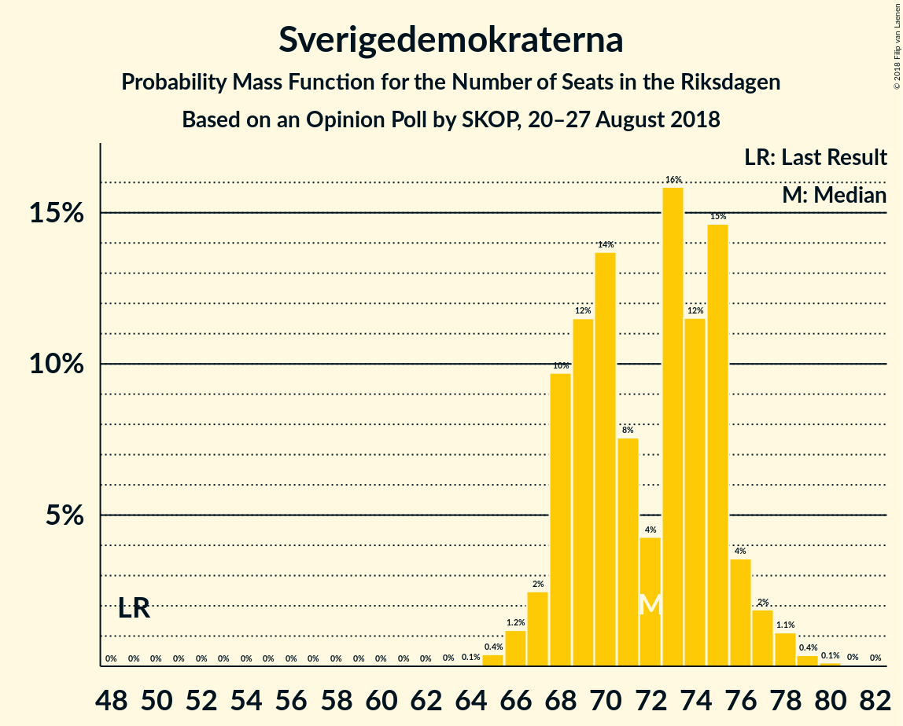

# Opinion Poll by SKOP, 20–27 August 2018

<a href="#voting-intentions">Voting Intentions</a> | <a href="#seats">Seats</a> | <a href="#coalitions">Coalitions</a> | <a href="#technical-information">Technical Information</a>

## Voting Intentions

### Confidence Intervals

| Party | Last Result | Poll Result | 80% Confidence Interval | 90% Confidence Interval | 95% Confidence Interval | 99% Confidence Interval |
|:-----:|:-----------:|:-----------:|:-----------------------:|:-----------------------:|:-----------------------:|:-----------------------:|
| Sveriges socialdemokratiska arbetareparti | 31.0% | 24.8% | 23.8–25.9% |23.5–26.2% |23.3–26.4% |22.8–26.9% |
| Sverigedemokraterna | 12.9% | 20.1% | 19.1–21.1% |18.9–21.4% |18.7–21.6% |18.2–22.1% |
| Moderata samlingspartiet | 23.3% | 16.5% | 15.6–17.4% |15.4–17.7% |15.2–17.9% |14.8–18.4% |
| Centerpartiet | 6.1% | 9.2% | 8.5–9.9% |8.3–10.1% |8.2–10.3% |7.9–10.7% |
| Vänsterpartiet | 5.7% | 8.9% | 8.3–9.6% |8.1–9.8% |7.9–10.0% |7.6–10.4% |
| Liberalerna | 5.4% | 6.8% | 6.2–7.4% |6.1–7.6% |5.9–7.8% |5.7–8.1% |
| Kristdemokraterna | 4.6% | 5.7% | 5.2–6.3% |5.0–6.5% |4.9–6.6% |4.7–6.9% |
| Miljöpartiet de gröna | 6.9% | 5.0% | 4.5–5.6% |4.4–5.7% |4.3–5.9% |4.0–6.2% |
| Feministiskt initiativ | 3.1% | 1.3% | 1.1–1.6% |1.0–1.7% |0.9–1.8% |0.8–1.9% |

*Note:* The poll result column reflects the actual value used in the calculations. Published results may vary slightly, and in addition be rounded to fewer digits.

## Seats

### Confidence Intervals

| Party | Last Result | Median | 80% Confidence Interval | 90% Confidence Interval | 95% Confidence Interval | 99% Confidence Interval |
|:-----:|:-----------:|:------:|:-----------------------:|:-----------------------:|:-----------------------:|:-----------------------:|
| <a href="#sveriges-socialdemokratiska-arbetareparti">Sveriges socialdemokratiska arbetareparti</a> | 113 | 89 | 86–91 |85–93 |84–94 |83–96 |
| <a href="#sverigedemokraterna">Sverigedemokraterna</a> | 49 | 71 | 68–75 |68–76 |67–77 |66–78 |
| <a href="#moderata-samlingspartiet">Moderata samlingspartiet</a> | 84 | 60 | 57–63 |54–64 |54–64 |54–65 |
| <a href="#centerpartiet">Centerpartiet</a> | 22 | 33 | 32–36 |31–36 |31–37 |29–38 |
| <a href="#vänsterpartiet">Vänsterpartiet</a> | 21 | 32 | 30–35 |29–35 |28–36 |28–37 |
| <a href="#liberalerna">Liberalerna</a> | 19 | 24 | 22–26 |22–26 |22–27 |21–28 |
| <a href="#kristdemokraterna">Kristdemokraterna</a> | 16 | 22 | 19–23 |18–23 |18–24 |17–24 |
| <a href="#miljöpartiet-de-gröna">Miljöpartiet de gröna</a> | 25 | 18 | 16–19 |16–20 |16–20 |15–22 |
| <a href="#feministiskt-initiativ">Feministiskt initiativ</a> | 0 | 0 | 0 |0 |0 |0 |

### Sveriges socialdemokratiska arbetareparti

*For a full overview of the results for this party, see the [Sveriges socialdemokratiska arbetareparti](party-sverigessocialdemokratiskaarbetareparti.html) page.*

| Number of Seats | Probability | Accumulated | Special Marks |
|:---------------:|:-----------:|:-----------:|:-------------:|
| 79 | 0% | 100% |  |
| 80 | 0.1% | 99.9% |  |
| 81 | 0.1% | 99.8% |  |
| 82 | 0.1% | 99.7% |  |
| 83 | 0.4% | 99.6% |  |
| 84 | 2% | 99.2% |  |
| 85 | 3% | 97% |  |
| 86 | 15% | 94% |  |
| 87 | 8% | 80% |  |
| 88 | 12% | 71% |  |
| 89 | 15% | 59% | Median |
| 90 | 9% | 44% |  |
| 91 | 26% | 35% |  |
| 92 | 4% | 10% |  |
| 93 | 2% | 6% |  |
| 94 | 1.2% | 3% |  |
| 95 | 0.3% | 2% |  |
| 96 | 1.3% | 2% |  |
| 97 | 0% | 0.2% |  |
| 98 | 0.1% | 0.2% |  |
| 99 | 0.1% | 0.1% |  |
| 100 | 0% | 0% |  |
| 101 | 0% | 0% |  |
| 102 | 0% | 0% |  |
| 103 | 0% | 0% |  |
| 104 | 0% | 0% |  |
| 105 | 0% | 0% |  |
| 106 | 0% | 0% |  |
| 107 | 0% | 0% |  |
| 108 | 0% | 0% |  |
| 109 | 0% | 0% |  |
| 110 | 0% | 0% |  |
| 111 | 0% | 0% |  |
| 112 | 0% | 0% |  |
| 113 | 0% | 0% | Last Result |

### Sverigedemokraterna

*For a full overview of the results for this party, see the [Sverigedemokraterna](party-sverigedemokraterna.html) page.*

| Number of Seats | Probability | Accumulated | Special Marks |
|:---------------:|:-----------:|:-----------:|:-------------:|
| 49 | 0% | 100% | Last Result |
| 50 | 0% | 100% |  |
| 51 | 0% | 100% |  |
| 52 | 0% | 100% |  |
| 53 | 0% | 100% |  |
| 54 | 0% | 100% |  |
| 55 | 0% | 100% |  |
| 56 | 0% | 100% |  |
| 57 | 0% | 100% |  |
| 58 | 0% | 100% |  |
| 59 | 0% | 100% |  |
| 60 | 0% | 100% |  |
| 61 | 0% | 100% |  |
| 62 | 0% | 100% |  |
| 63 | 0% | 100% |  |
| 64 | 0% | 100% |  |
| 65 | 0.1% | 99.9% |  |
| 66 | 2% | 99.9% |  |
| 67 | 3% | 98% |  |
| 68 | 26% | 95% |  |
| 69 | 2% | 69% |  |
| 70 | 17% | 67% |  |
| 71 | 4% | 50% | Median |
| 72 | 5% | 46% |  |
| 73 | 5% | 42% |  |
| 74 | 23% | 37% |  |
| 75 | 6% | 13% |  |
| 76 | 4% | 7% |  |
| 77 | 2% | 3% |  |
| 78 | 0.6% | 0.9% |  |
| 79 | 0.1% | 0.3% |  |
| 80 | 0.1% | 0.2% |  |
| 81 | 0% | 0.1% |  |
| 82 | 0% | 0% |  |

### Moderata samlingspartiet

*For a full overview of the results for this party, see the [Moderata samlingspartiet](party-moderatasamlingspartiet.html) page.*

| Number of Seats | Probability | Accumulated | Special Marks |
|:---------------:|:-----------:|:-----------:|:-------------:|
| 51 | 0.1% | 100% |  |
| 52 | 0.1% | 99.9% |  |
| 53 | 0.3% | 99.9% |  |
| 54 | 5% | 99.6% |  |
| 55 | 3% | 95% |  |
| 56 | 0.6% | 92% |  |
| 57 | 26% | 91% |  |
| 58 | 7% | 65% |  |
| 59 | 3% | 58% |  |
| 60 | 13% | 55% | Median |
| 61 | 26% | 42% |  |
| 62 | 6% | 16% |  |
| 63 | 0.9% | 10% |  |
| 64 | 8% | 9% |  |
| 65 | 2% | 2% |  |
| 66 | 0.1% | 0.3% |  |
| 67 | 0.1% | 0.2% |  |
| 68 | 0.1% | 0.1% |  |
| 69 | 0% | 0% |  |
| 70 | 0% | 0% |  |
| 71 | 0% | 0% |  |
| 72 | 0% | 0% |  |
| 73 | 0% | 0% |  |
| 74 | 0% | 0% |  |
| 75 | 0% | 0% |  |
| 76 | 0% | 0% |  |
| 77 | 0% | 0% |  |
| 78 | 0% | 0% |  |
| 79 | 0% | 0% |  |
| 80 | 0% | 0% |  |
| 81 | 0% | 0% |  |
| 82 | 0% | 0% |  |
| 83 | 0% | 0% |  |
| 84 | 0% | 0% | Last Result |

### Centerpartiet

*For a full overview of the results for this party, see the [Centerpartiet](party-centerpartiet.html) page.*

| Number of Seats | Probability | Accumulated | Special Marks |
|:---------------:|:-----------:|:-----------:|:-------------:|
| 22 | 0% | 100% | Last Result |
| 23 | 0% | 100% |  |
| 24 | 0% | 100% |  |
| 25 | 0% | 100% |  |
| 26 | 0% | 100% |  |
| 27 | 0% | 100% |  |
| 28 | 0.2% | 100% |  |
| 29 | 1.1% | 99.8% |  |
| 30 | 1.0% | 98.7% |  |
| 31 | 3% | 98% |  |
| 32 | 27% | 95% |  |
| 33 | 22% | 68% | Median |
| 34 | 11% | 46% |  |
| 35 | 23% | 35% |  |
| 36 | 9% | 13% |  |
| 37 | 3% | 4% |  |
| 38 | 1.0% | 1.1% |  |
| 39 | 0% | 0.1% |  |
| 40 | 0.1% | 0.1% |  |
| 41 | 0% | 0% |  |

### Vänsterpartiet

*For a full overview of the results for this party, see the [Vänsterpartiet](party-vänsterpartiet.html) page.*

| Number of Seats | Probability | Accumulated | Special Marks |
|:---------------:|:-----------:|:-----------:|:-------------:|
| 21 | 0% | 100% | Last Result |
| 22 | 0% | 100% |  |
| 23 | 0% | 100% |  |
| 24 | 0% | 100% |  |
| 25 | 0% | 100% |  |
| 26 | 0.1% | 100% |  |
| 27 | 0.2% | 99.9% |  |
| 28 | 4% | 99.8% |  |
| 29 | 2% | 96% |  |
| 30 | 13% | 94% |  |
| 31 | 15% | 81% |  |
| 32 | 24% | 66% | Median |
| 33 | 16% | 41% |  |
| 34 | 5% | 25% |  |
| 35 | 17% | 20% |  |
| 36 | 0.9% | 3% |  |
| 37 | 2% | 2% |  |
| 38 | 0% | 0.1% |  |
| 39 | 0% | 0% |  |

### Liberalerna

*For a full overview of the results for this party, see the [Liberalerna](party-liberalerna.html) page.*

| Number of Seats | Probability | Accumulated | Special Marks |
|:---------------:|:-----------:|:-----------:|:-------------:|
| 19 | 0% | 100% | Last Result |
| 20 | 0.1% | 100% |  |
| 21 | 2% | 99.9% |  |
| 22 | 13% | 98% |  |
| 23 | 21% | 85% |  |
| 24 | 15% | 64% | Median |
| 25 | 25% | 49% |  |
| 26 | 21% | 24% |  |
| 27 | 3% | 3% |  |
| 28 | 0.4% | 0.8% |  |
| 29 | 0.2% | 0.4% |  |
| 30 | 0.1% | 0.1% |  |
| 31 | 0% | 0% |  |

### Kristdemokraterna

*For a full overview of the results for this party, see the [Kristdemokraterna](party-kristdemokraterna.html) page.*

| Number of Seats | Probability | Accumulated | Special Marks |
|:---------------:|:-----------:|:-----------:|:-------------:|
| 16 | 0% | 100% | Last Result |
| 17 | 2% | 99.9% |  |
| 18 | 6% | 98% |  |
| 19 | 11% | 92% |  |
| 20 | 4% | 82% |  |
| 21 | 27% | 78% |  |
| 22 | 38% | 51% | Median |
| 23 | 10% | 13% |  |
| 24 | 3% | 3% |  |
| 25 | 0.1% | 0.2% |  |
| 26 | 0.1% | 0.1% |  |
| 27 | 0% | 0% |  |

### Miljöpartiet de gröna

*For a full overview of the results for this party, see the [Miljöpartiet de gröna](party-miljöpartietdegröna.html) page.*

| Number of Seats | Probability | Accumulated | Special Marks |
|:---------------:|:-----------:|:-----------:|:-------------:|
| 0 | 0.1% | 100% |  |
| 1 | 0% | 99.9% |  |
| 2 | 0% | 99.9% |  |
| 3 | 0% | 99.9% |  |
| 4 | 0% | 99.9% |  |
| 5 | 0% | 99.9% |  |
| 6 | 0% | 99.9% |  |
| 7 | 0% | 99.9% |  |
| 8 | 0% | 99.9% |  |
| 9 | 0% | 99.9% |  |
| 10 | 0% | 99.9% |  |
| 11 | 0% | 99.9% |  |
| 12 | 0% | 99.9% |  |
| 13 | 0% | 99.9% |  |
| 14 | 0.1% | 99.9% |  |
| 15 | 0.9% | 99.9% |  |
| 16 | 12% | 99.0% |  |
| 17 | 20% | 87% |  |
| 18 | 19% | 67% | Median |
| 19 | 43% | 48% |  |
| 20 | 3% | 5% |  |
| 21 | 0.7% | 2% |  |
| 22 | 0.7% | 0.9% |  |
| 23 | 0.2% | 0.2% |  |
| 24 | 0% | 0% |  |
| 25 | 0% | 0% | Last Result |

### Feministiskt initiativ

*For a full overview of the results for this party, see the [Feministiskt initiativ](party-feministisktinitiativ.html) page.*

| Number of Seats | Probability | Accumulated | Special Marks |
|:---------------:|:-----------:|:-----------:|:-------------:|
| 0 | 100% | 100% | Last Result, Median |

## Coalitions

### Confidence Intervals

| Coalition | Last Result | Median | Majority? | 80% Confidence Interval | 90% Confidence Interval | 95% Confidence Interval | 99% Confidence Interval |
|:---------:|:-----------:|:------:|:---------:|:-----------------------:|:-----------------------:|:-----------------------:|:-----------------------:|
| Sveriges socialdemokratiska arbetareparti – Moderata samlingspartiet – Centerpartiet | 219 | 181 | 99.5% | 178–188 | 176–188 | 175–189 | 174–190 |
| Sverigedemokraterna – Moderata samlingspartiet – Kristdemokraterna | 149 | 152 | 0% | 148–156 | 148–157 | 146–158 | 145–159 |
| Sveriges socialdemokratiska arbetareparti – Moderata samlingspartiet | 197 | 148 | 0% | 143–153 | 143–154 | 143–155 | 140–157 |
| Moderata samlingspartiet – Centerpartiet – Liberalerna – Kristdemokraterna | 141 | 138 | 0% | 133–145 | 133–145 | 133–145 | 130–146 |
| Sveriges socialdemokratiska arbetareparti – Vänsterpartiet – Miljöpartiet de gröna – Feministiskt initiativ | 159 | 141 | 0% | 135–143 | 134–143 | 133–145 | 132–148 |
| Sveriges socialdemokratiska arbetareparti – Vänsterpartiet – Miljöpartiet de gröna | 159 | 141 | 0% | 135–143 | 134–143 | 133–145 | 132–148 |
| Sverigedemokraterna – Moderata samlingspartiet | 133 | 131 | 0% | 127–134 | 127–135 | 125–136 | 124–139 |
| Sveriges socialdemokratiska arbetareparti – Vänsterpartiet | 134 | 122 | 0% | 117–124 | 116–125 | 116–127 | 115–130 |
| Moderata samlingspartiet – Centerpartiet – Liberalerna | 125 | 117 | 0% | 111–123 | 111–123 | 111–124 | 110–125 |
| Moderata samlingspartiet – Centerpartiet – Kristdemokraterna | 122 | 114 | 0% | 110–119 | 109–120 | 109–120 | 107–120 |
| Sveriges socialdemokratiska arbetareparti – Miljöpartiet de gröna | 138 | 106 | 0% | 104–110 | 103–111 | 101–112 | 100–114 |
| Moderata samlingspartiet – Centerpartiet | 106 | 92 | 0% | 89–97 | 89–98 | 87–99 | 86–100 |

### Sveriges socialdemokratiska arbetareparti – Moderata samlingspartiet – Centerpartiet

| Number of Seats | Probability | Accumulated | Special Marks |
|:---------------:|:-----------:|:-----------:|:-------------:|
| 172 | 0% | 100% |  |
| 173 | 0.1% | 99.9% |  |
| 174 | 0.4% | 99.9% |  |
| 175 | 3% | 99.5% | Majority |
| 176 | 2% | 97% |  |
| 177 | 2% | 94% |  |
| 178 | 9% | 92% |  |
| 179 | 8% | 83% |  |
| 180 | 18% | 75% |  |
| 181 | 8% | 57% |  |
| 182 | 2% | 48% | Median |
| 183 | 10% | 46% |  |
| 184 | 8% | 37% |  |
| 185 | 16% | 28% |  |
| 186 | 0.8% | 12% |  |
| 187 | 0.4% | 11% |  |
| 188 | 7% | 11% |  |
| 189 | 2% | 3% |  |
| 190 | 1.3% | 2% |  |
| 191 | 0.2% | 0.3% |  |
| 192 | 0.1% | 0.1% |  |
| 193 | 0% | 0% |  |
| 194 | 0% | 0% |  |
| 195 | 0% | 0% |  |
| 196 | 0% | 0% |  |
| 197 | 0% | 0% |  |
| 198 | 0% | 0% |  |
| 199 | 0% | 0% |  |
| 200 | 0% | 0% |  |
| 201 | 0% | 0% |  |
| 202 | 0% | 0% |  |
| 203 | 0% | 0% |  |
| 204 | 0% | 0% |  |
| 205 | 0% | 0% |  |
| 206 | 0% | 0% |  |
| 207 | 0% | 0% |  |
| 208 | 0% | 0% |  |
| 209 | 0% | 0% |  |
| 210 | 0% | 0% |  |
| 211 | 0% | 0% |  |
| 212 | 0% | 0% |  |
| 213 | 0% | 0% |  |
| 214 | 0% | 0% |  |
| 215 | 0% | 0% |  |
| 216 | 0% | 0% |  |
| 217 | 0% | 0% |  |
| 218 | 0% | 0% |  |
| 219 | 0% | 0% | Last Result |

### Sverigedemokraterna – Moderata samlingspartiet – Kristdemokraterna

| Number of Seats | Probability | Accumulated | Special Marks |
|:---------------:|:-----------:|:-----------:|:-------------:|
| 142 | 0.1% | 100% |  |
| 143 | 0% | 99.9% |  |
| 144 | 0.3% | 99.8% |  |
| 145 | 0.8% | 99.6% |  |
| 146 | 1.4% | 98.7% |  |
| 147 | 1.2% | 97% |  |
| 148 | 8% | 96% |  |
| 149 | 4% | 88% | Last Result |
| 150 | 20% | 84% |  |
| 151 | 10% | 64% |  |
| 152 | 12% | 54% |  |
| 153 | 23% | 42% | Median |
| 154 | 2% | 19% |  |
| 155 | 7% | 17% |  |
| 156 | 2% | 10% |  |
| 157 | 5% | 8% |  |
| 158 | 2% | 3% |  |
| 159 | 0.4% | 0.9% |  |
| 160 | 0.2% | 0.5% |  |
| 161 | 0.1% | 0.2% |  |
| 162 | 0.1% | 0.1% |  |
| 163 | 0% | 0% |  |

### Sveriges socialdemokratiska arbetareparti – Moderata samlingspartiet

| Number of Seats | Probability | Accumulated | Special Marks |
|:---------------:|:-----------:|:-----------:|:-------------:|
| 138 | 0% | 100% |  |
| 139 | 0.4% | 99.9% |  |
| 140 | 0.3% | 99.6% |  |
| 141 | 0.6% | 99.3% |  |
| 142 | 0.9% | 98.7% |  |
| 143 | 10% | 98% |  |
| 144 | 5% | 88% |  |
| 145 | 8% | 82% |  |
| 146 | 4% | 74% |  |
| 147 | 11% | 70% |  |
| 148 | 12% | 59% |  |
| 149 | 9% | 47% | Median |
| 150 | 5% | 38% |  |
| 151 | 7% | 33% |  |
| 152 | 16% | 26% |  |
| 153 | 2% | 10% |  |
| 154 | 5% | 8% |  |
| 155 | 1.0% | 3% |  |
| 156 | 1.5% | 2% |  |
| 157 | 0.2% | 0.7% |  |
| 158 | 0.2% | 0.5% |  |
| 159 | 0.1% | 0.3% |  |
| 160 | 0.2% | 0.2% |  |
| 161 | 0% | 0% |  |
| 162 | 0% | 0% |  |
| 163 | 0% | 0% |  |
| 164 | 0% | 0% |  |
| 165 | 0% | 0% |  |
| 166 | 0% | 0% |  |
| 167 | 0% | 0% |  |
| 168 | 0% | 0% |  |
| 169 | 0% | 0% |  |
| 170 | 0% | 0% |  |
| 171 | 0% | 0% |  |
| 172 | 0% | 0% |  |
| 173 | 0% | 0% |  |
| 174 | 0% | 0% |  |
| 175 | 0% | 0% | Majority |
| 176 | 0% | 0% |  |
| 177 | 0% | 0% |  |
| 178 | 0% | 0% |  |
| 179 | 0% | 0% |  |
| 180 | 0% | 0% |  |
| 181 | 0% | 0% |  |
| 182 | 0% | 0% |  |
| 183 | 0% | 0% |  |
| 184 | 0% | 0% |  |
| 185 | 0% | 0% |  |
| 186 | 0% | 0% |  |
| 187 | 0% | 0% |  |
| 188 | 0% | 0% |  |
| 189 | 0% | 0% |  |
| 190 | 0% | 0% |  |
| 191 | 0% | 0% |  |
| 192 | 0% | 0% |  |
| 193 | 0% | 0% |  |
| 194 | 0% | 0% |  |
| 195 | 0% | 0% |  |
| 196 | 0% | 0% |  |
| 197 | 0% | 0% | Last Result |

### Moderata samlingspartiet – Centerpartiet – Liberalerna – Kristdemokraterna

| Number of Seats | Probability | Accumulated | Special Marks |
|:---------------:|:-----------:|:-----------:|:-------------:|
| 127 | 0% | 100% |  |
| 128 | 0.2% | 99.9% |  |
| 129 | 0.2% | 99.8% |  |
| 130 | 0.1% | 99.6% |  |
| 131 | 0.8% | 99.5% |  |
| 132 | 1.2% | 98.7% |  |
| 133 | 16% | 98% |  |
| 134 | 0.9% | 82% |  |
| 135 | 6% | 81% |  |
| 136 | 2% | 75% |  |
| 137 | 2% | 73% |  |
| 138 | 29% | 71% |  |
| 139 | 8% | 43% | Median |
| 140 | 13% | 34% |  |
| 141 | 1.5% | 22% | Last Result |
| 142 | 6% | 20% |  |
| 143 | 0.9% | 14% |  |
| 144 | 1.4% | 13% |  |
| 145 | 11% | 12% |  |
| 146 | 0.7% | 0.8% |  |
| 147 | 0% | 0.2% |  |
| 148 | 0.1% | 0.1% |  |
| 149 | 0% | 0.1% |  |
| 150 | 0% | 0% |  |

### Sveriges socialdemokratiska arbetareparti – Vänsterpartiet – Miljöpartiet de gröna – Feministiskt initiativ

| Number of Seats | Probability | Accumulated | Special Marks |
|:---------------:|:-----------:|:-----------:|:-------------:|
| 129 | 0% | 100% |  |
| 130 | 0.1% | 99.9% |  |
| 131 | 0.1% | 99.8% |  |
| 132 | 0.9% | 99.8% |  |
| 133 | 2% | 98.8% |  |
| 134 | 2% | 97% |  |
| 135 | 13% | 95% |  |
| 136 | 15% | 82% |  |
| 137 | 4% | 67% |  |
| 138 | 2% | 63% |  |
| 139 | 4% | 61% | Median |
| 140 | 5% | 57% |  |
| 141 | 20% | 52% |  |
| 142 | 13% | 32% |  |
| 143 | 15% | 19% |  |
| 144 | 2% | 5% |  |
| 145 | 2% | 3% |  |
| 146 | 0.3% | 1.3% |  |
| 147 | 0.2% | 1.1% |  |
| 148 | 0.7% | 0.8% |  |
| 149 | 0.1% | 0.1% |  |
| 150 | 0% | 0.1% |  |
| 151 | 0% | 0% |  |
| 152 | 0% | 0% |  |
| 153 | 0% | 0% |  |
| 154 | 0% | 0% |  |
| 155 | 0% | 0% |  |
| 156 | 0% | 0% |  |
| 157 | 0% | 0% |  |
| 158 | 0% | 0% |  |
| 159 | 0% | 0% | Last Result |

### Sveriges socialdemokratiska arbetareparti – Vänsterpartiet – Miljöpartiet de gröna

| Number of Seats | Probability | Accumulated | Special Marks |
|:---------------:|:-----------:|:-----------:|:-------------:|
| 129 | 0% | 100% |  |
| 130 | 0.1% | 99.9% |  |
| 131 | 0.1% | 99.8% |  |
| 132 | 0.9% | 99.8% |  |
| 133 | 2% | 98.8% |  |
| 134 | 2% | 97% |  |
| 135 | 13% | 95% |  |
| 136 | 15% | 82% |  |
| 137 | 4% | 67% |  |
| 138 | 2% | 63% |  |
| 139 | 4% | 61% | Median |
| 140 | 5% | 57% |  |
| 141 | 20% | 52% |  |
| 142 | 13% | 32% |  |
| 143 | 15% | 19% |  |
| 144 | 2% | 5% |  |
| 145 | 2% | 3% |  |
| 146 | 0.3% | 1.3% |  |
| 147 | 0.2% | 1.1% |  |
| 148 | 0.7% | 0.8% |  |
| 149 | 0.1% | 0.1% |  |
| 150 | 0% | 0.1% |  |
| 151 | 0% | 0% |  |
| 152 | 0% | 0% |  |
| 153 | 0% | 0% |  |
| 154 | 0% | 0% |  |
| 155 | 0% | 0% |  |
| 156 | 0% | 0% |  |
| 157 | 0% | 0% |  |
| 158 | 0% | 0% |  |
| 159 | 0% | 0% | Last Result |

### Sverigedemokraterna – Moderata samlingspartiet

| Number of Seats | Probability | Accumulated | Special Marks |
|:---------------:|:-----------:|:-----------:|:-------------:|
| 121 | 0.1% | 100% |  |
| 122 | 0.1% | 99.9% |  |
| 123 | 0.3% | 99.9% |  |
| 124 | 0.7% | 99.6% |  |
| 125 | 2% | 98.9% |  |
| 126 | 0.8% | 97% |  |
| 127 | 9% | 96% |  |
| 128 | 2% | 87% |  |
| 129 | 25% | 85% |  |
| 130 | 10% | 60% |  |
| 131 | 20% | 50% | Median |
| 132 | 8% | 31% |  |
| 133 | 3% | 23% | Last Result |
| 134 | 12% | 20% |  |
| 135 | 3% | 8% |  |
| 136 | 3% | 5% |  |
| 137 | 1.0% | 2% |  |
| 138 | 0.4% | 0.9% |  |
| 139 | 0.1% | 0.5% |  |
| 140 | 0.2% | 0.4% |  |
| 141 | 0.1% | 0.1% |  |
| 142 | 0% | 0.1% |  |
| 143 | 0% | 0% |  |

### Sveriges socialdemokratiska arbetareparti – Vänsterpartiet

| Number of Seats | Probability | Accumulated | Special Marks |
|:---------------:|:-----------:|:-----------:|:-------------:|
| 112 | 0.1% | 100% |  |
| 113 | 0.2% | 99.9% |  |
| 114 | 0.1% | 99.7% |  |
| 115 | 0.9% | 99.6% |  |
| 116 | 7% | 98.7% |  |
| 117 | 14% | 92% |  |
| 118 | 7% | 78% |  |
| 119 | 3% | 71% |  |
| 120 | 4% | 68% |  |
| 121 | 4% | 64% | Median |
| 122 | 10% | 60% |  |
| 123 | 19% | 50% |  |
| 124 | 25% | 31% |  |
| 125 | 1.3% | 6% |  |
| 126 | 0.6% | 5% |  |
| 127 | 2% | 4% |  |
| 128 | 1.0% | 2% |  |
| 129 | 0.1% | 0.9% |  |
| 130 | 0.7% | 0.8% |  |
| 131 | 0% | 0.1% |  |
| 132 | 0% | 0.1% |  |
| 133 | 0% | 0% |  |
| 134 | 0% | 0% | Last Result |

### Moderata samlingspartiet – Centerpartiet – Liberalerna

| Number of Seats | Probability | Accumulated | Special Marks |
|:---------------:|:-----------:|:-----------:|:-------------:|
| 107 | 0% | 100% |  |
| 108 | 0.2% | 99.9% |  |
| 109 | 0.1% | 99.8% |  |
| 110 | 0.8% | 99.6% |  |
| 111 | 13% | 98.8% |  |
| 112 | 4% | 86% |  |
| 113 | 0.9% | 82% |  |
| 114 | 3% | 81% |  |
| 115 | 2% | 78% |  |
| 116 | 10% | 76% |  |
| 117 | 26% | 65% | Median |
| 118 | 9% | 39% |  |
| 119 | 2% | 30% |  |
| 120 | 7% | 27% |  |
| 121 | 2% | 20% |  |
| 122 | 5% | 18% |  |
| 123 | 10% | 13% |  |
| 124 | 1.2% | 3% |  |
| 125 | 2% | 2% | Last Result |
| 126 | 0.3% | 0.3% |  |
| 127 | 0.1% | 0.1% |  |
| 128 | 0% | 0% |  |

### Moderata samlingspartiet – Centerpartiet – Kristdemokraterna

| Number of Seats | Probability | Accumulated | Special Marks |
|:---------------:|:-----------:|:-----------:|:-------------:|
| 104 | 0.1% | 100% |  |
| 105 | 0.1% | 99.9% |  |
| 106 | 0.3% | 99.8% |  |
| 107 | 0.4% | 99.5% |  |
| 108 | 1.2% | 99.1% |  |
| 109 | 3% | 98% |  |
| 110 | 5% | 95% |  |
| 111 | 14% | 90% |  |
| 112 | 2% | 76% |  |
| 113 | 11% | 74% |  |
| 114 | 20% | 63% |  |
| 115 | 20% | 43% | Median |
| 116 | 3% | 23% |  |
| 117 | 5% | 19% |  |
| 118 | 1.1% | 14% |  |
| 119 | 8% | 13% |  |
| 120 | 5% | 5% |  |
| 121 | 0.2% | 0.3% |  |
| 122 | 0% | 0.1% | Last Result |
| 123 | 0% | 0.1% |  |
| 124 | 0% | 0% |  |

### Sveriges socialdemokratiska arbetareparti – Miljöpartiet de gröna

| Number of Seats | Probability | Accumulated | Special Marks |
|:---------------:|:-----------:|:-----------:|:-------------:|
| 94 | 0.1% | 100% |  |
| 95 | 0% | 99.9% |  |
| 96 | 0% | 99.9% |  |
| 97 | 0% | 99.9% |  |
| 98 | 0.1% | 99.9% |  |
| 99 | 0.1% | 99.8% |  |
| 100 | 0.3% | 99.7% |  |
| 101 | 2% | 99.3% |  |
| 102 | 0.6% | 97% |  |
| 103 | 3% | 96% |  |
| 104 | 4% | 94% |  |
| 105 | 25% | 89% |  |
| 106 | 18% | 65% |  |
| 107 | 5% | 46% | Median |
| 108 | 5% | 41% |  |
| 109 | 4% | 36% |  |
| 110 | 25% | 32% |  |
| 111 | 2% | 7% |  |
| 112 | 3% | 5% |  |
| 113 | 0.9% | 2% |  |
| 114 | 0.3% | 0.6% |  |
| 115 | 0.2% | 0.4% |  |
| 116 | 0.1% | 0.2% |  |
| 117 | 0.1% | 0.1% |  |
| 118 | 0.1% | 0.1% |  |
| 119 | 0% | 0% |  |
| 120 | 0% | 0% |  |
| 121 | 0% | 0% |  |
| 122 | 0% | 0% |  |
| 123 | 0% | 0% |  |
| 124 | 0% | 0% |  |
| 125 | 0% | 0% |  |
| 126 | 0% | 0% |  |
| 127 | 0% | 0% |  |
| 128 | 0% | 0% |  |
| 129 | 0% | 0% |  |
| 130 | 0% | 0% |  |
| 131 | 0% | 0% |  |
| 132 | 0% | 0% |  |
| 133 | 0% | 0% |  |
| 134 | 0% | 0% |  |
| 135 | 0% | 0% |  |
| 136 | 0% | 0% |  |
| 137 | 0% | 0% |  |
| 138 | 0% | 0% | Last Result |

### Moderata samlingspartiet – Centerpartiet

| Number of Seats | Probability | Accumulated | Special Marks |
|:---------------:|:-----------:|:-----------:|:-------------:|
| 84 | 0.1% | 100% |  |
| 85 | 0.1% | 99.9% |  |
| 86 | 1.1% | 99.8% |  |
| 87 | 3% | 98.7% |  |
| 88 | 1.0% | 96% |  |
| 89 | 16% | 95% |  |
| 90 | 3% | 79% |  |
| 91 | 2% | 76% |  |
| 92 | 25% | 74% |  |
| 93 | 4% | 49% | Median |
| 94 | 16% | 44% |  |
| 95 | 6% | 29% |  |
| 96 | 3% | 23% |  |
| 97 | 13% | 20% |  |
| 98 | 3% | 6% |  |
| 99 | 2% | 4% |  |
| 100 | 1.5% | 2% |  |
| 101 | 0% | 0.1% |  |
| 102 | 0.1% | 0.1% |  |
| 103 | 0% | 0% |  |
| 104 | 0% | 0% |  |
| 105 | 0% | 0% |  |
| 106 | 0% | 0% | Last Result |

## Technical Information

### Opinion Poll

+ **Polling firm:** SKOP
+ **Commissioner(s):** —
+ **Fieldwork period:** 20–27 August 2018

### Calculations

+ **Sample size:** 2873
+ **Simulations done:** 131,072
+ **Error estimate:** 1.62%

