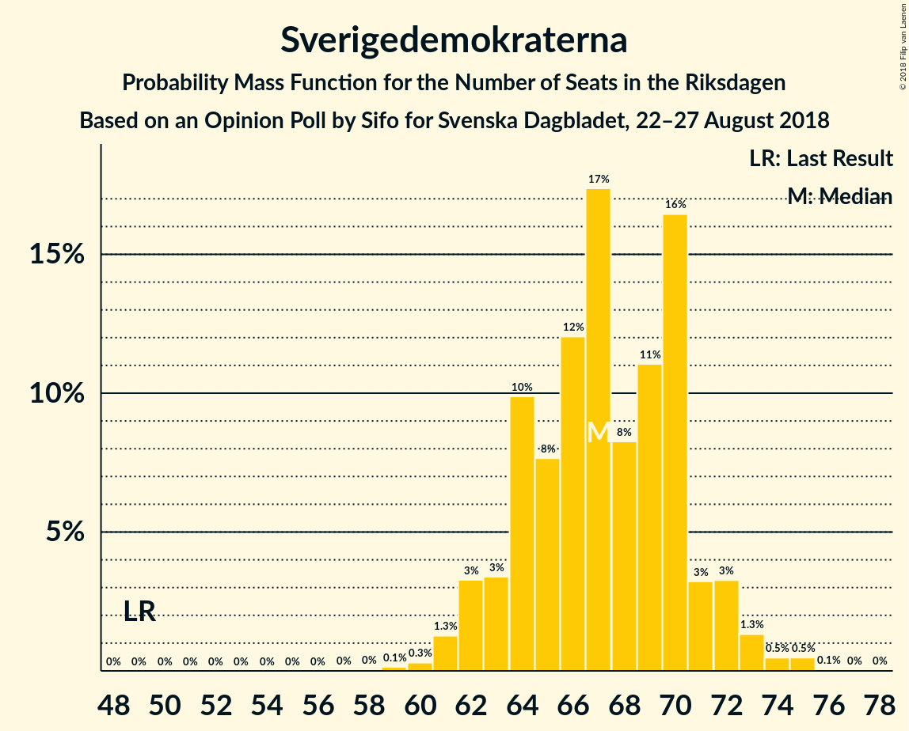

# Opinion Poll by Sifo for Svenska Dagbladet, 22–27 August 2018

<a href="#voting-intentions">Voting Intentions</a> | <a href="#seats">Seats</a> | <a href="#coalitions">Coalitions</a> | <a href="#technical-information">Technical Information</a>

## Voting Intentions

### Confidence Intervals

| Party | Last Result | Poll Result | 80% Confidence Interval | 90% Confidence Interval | 95% Confidence Interval | 99% Confidence Interval |
|:-----:|:-----------:|:-----------:|:-----------------------:|:-----------------------:|:-----------------------:|:-----------------------:|
| Sveriges socialdemokratiska arbetareparti | 31.0% | 25.9% | 24.8–27.0% |24.5–27.3% |24.3–27.6% |23.8–28.2% |
| Sverigedemokraterna | 12.9% | 18.8% | 17.9–19.8% |17.6–20.1% |17.4–20.3% |16.9–20.8% |
| Moderata samlingspartiet | 23.3% | 18.3% | 17.4–19.3% |17.1–19.6% |16.9–19.8% |16.4–20.3% |
| Vänsterpartiet | 5.7% | 9.5% | 8.8–10.3% |8.6–10.5% |8.4–10.7% |8.1–11.1% |
| Centerpartiet | 6.1% | 8.5% | 7.8–9.2% |7.6–9.4% |7.5–9.6% |7.2–10.0% |
| Kristdemokraterna | 4.6% | 6.1% | 5.5–6.8% |5.4–6.9% |5.3–7.1% |5.0–7.4% |
| Miljöpartiet de gröna | 6.9% | 5.5% | 5.0–6.1% |4.8–6.3% |4.7–6.5% |4.5–6.8% |
| Liberalerna | 5.4% | 5.3% | 4.8–5.9% |4.6–6.1% |4.5–6.2% |4.3–6.5% |

*Note:* The poll result column reflects the actual value used in the calculations. Published results may vary slightly, and in addition be rounded to fewer digits.

## Seats

### Confidence Intervals

| Party | Last Result | Median | 80% Confidence Interval | 90% Confidence Interval | 95% Confidence Interval | 99% Confidence Interval |
|:-----:|:-----------:|:------:|:-----------------------:|:-----------------------:|:-----------------------:|:-----------------------:|
| <a href="#sveriges-socialdemokratiska-arbetareparti">Sveriges socialdemokratiska arbetareparti</a> | 113 | 93 | 90–96 |89–97 |87–99 |85–100 |
| <a href="#sverigedemokraterna">Sverigedemokraterna</a> | 49 | 67 | 64–71 |63–72 |62–73 |61–74 |
| <a href="#moderata-samlingspartiet">Moderata samlingspartiet</a> | 84 | 66 | 62–69 |61–69 |61–70 |59–72 |
| <a href="#vänsterpartiet">Vänsterpartiet</a> | 21 | 33 | 32–35 |31–36 |30–37 |29–39 |
| <a href="#centerpartiet">Centerpartiet</a> | 22 | 29 | 28–31 |27–33 |27–34 |27–35 |
| <a href="#kristdemokraterna">Kristdemokraterna</a> | 16 | 21 | 19–24 |19–25 |19–26 |18–26 |
| <a href="#miljöpartiet-de-gröna">Miljöpartiet de gröna</a> | 25 | 20 | 18–21 |17–22 |17–23 |16–23 |
| <a href="#liberalerna">Liberalerna</a> | 19 | 19 | 17–21 |17–21 |16–22 |16–23 |

### Sveriges socialdemokratiska arbetareparti

*For a full overview of the results for this party, see the [Sveriges socialdemokratiska arbetareparti](party-sverigessocialdemokratiskaarbetareparti.html) page.*

| Number of Seats | Probability | Accumulated | Special Marks |
|:---------------:|:-----------:|:-----------:|:-------------:|
| 83 | 0.1% | 100% |  |
| 84 | 0.1% | 99.9% |  |
| 85 | 0.8% | 99.7% |  |
| 86 | 0.7% | 99.0% |  |
| 87 | 1.1% | 98% |  |
| 88 | 2% | 97% |  |
| 89 | 3% | 95% |  |
| 90 | 4% | 92% |  |
| 91 | 9% | 88% |  |
| 92 | 18% | 80% |  |
| 93 | 17% | 62% | Median |
| 94 | 17% | 45% |  |
| 95 | 6% | 27% |  |
| 96 | 15% | 21% |  |
| 97 | 1.4% | 6% |  |
| 98 | 2% | 4% |  |
| 99 | 2% | 3% |  |
| 100 | 0.4% | 0.6% |  |
| 101 | 0.1% | 0.1% |  |
| 102 | 0% | 0% |  |
| 103 | 0% | 0% |  |
| 104 | 0% | 0% |  |
| 105 | 0% | 0% |  |
| 106 | 0% | 0% |  |
| 107 | 0% | 0% |  |
| 108 | 0% | 0% |  |
| 109 | 0% | 0% |  |
| 110 | 0% | 0% |  |
| 111 | 0% | 0% |  |
| 112 | 0% | 0% |  |
| 113 | 0% | 0% | Last Result |

### Sverigedemokraterna

*For a full overview of the results for this party, see the [Sverigedemokraterna](party-sverigedemokraterna.html) page.*

| Number of Seats | Probability | Accumulated | Special Marks |
|:---------------:|:-----------:|:-----------:|:-------------:|
| 49 | 0% | 100% | Last Result |
| 50 | 0% | 100% |  |
| 51 | 0% | 100% |  |
| 52 | 0% | 100% |  |
| 53 | 0% | 100% |  |
| 54 | 0% | 100% |  |
| 55 | 0% | 100% |  |
| 56 | 0% | 100% |  |
| 57 | 0% | 100% |  |
| 58 | 0% | 100% |  |
| 59 | 0.1% | 100% |  |
| 60 | 0.2% | 99.9% |  |
| 61 | 2% | 99.7% |  |
| 62 | 2% | 98% |  |
| 63 | 3% | 96% |  |
| 64 | 6% | 93% |  |
| 65 | 5% | 87% |  |
| 66 | 21% | 82% |  |
| 67 | 19% | 61% | Median |
| 68 | 6% | 42% |  |
| 69 | 15% | 36% |  |
| 70 | 9% | 20% |  |
| 71 | 5% | 11% |  |
| 72 | 3% | 6% |  |
| 73 | 3% | 3% |  |
| 74 | 0.6% | 0.7% |  |
| 75 | 0.1% | 0.1% |  |
| 76 | 0% | 0% |  |

### Moderata samlingspartiet

*For a full overview of the results for this party, see the [Moderata samlingspartiet](party-moderatasamlingspartiet.html) page.*

| Number of Seats | Probability | Accumulated | Special Marks |
|:---------------:|:-----------:|:-----------:|:-------------:|
| 57 | 0% | 100% |  |
| 58 | 0.2% | 99.9% |  |
| 59 | 0.4% | 99.8% |  |
| 60 | 2% | 99.4% |  |
| 61 | 3% | 98% |  |
| 62 | 10% | 94% |  |
| 63 | 7% | 85% |  |
| 64 | 17% | 78% |  |
| 65 | 7% | 60% |  |
| 66 | 17% | 53% | Median |
| 67 | 21% | 37% |  |
| 68 | 5% | 16% |  |
| 69 | 8% | 11% |  |
| 70 | 2% | 3% |  |
| 71 | 0.9% | 1.5% |  |
| 72 | 0.4% | 0.6% |  |
| 73 | 0.1% | 0.2% |  |
| 74 | 0% | 0.1% |  |
| 75 | 0% | 0% |  |
| 76 | 0% | 0% |  |
| 77 | 0% | 0% |  |
| 78 | 0% | 0% |  |
| 79 | 0% | 0% |  |
| 80 | 0% | 0% |  |
| 81 | 0% | 0% |  |
| 82 | 0% | 0% |  |
| 83 | 0% | 0% |  |
| 84 | 0% | 0% | Last Result |

### Vänsterpartiet

*For a full overview of the results for this party, see the [Vänsterpartiet](party-vänsterpartiet.html) page.*

| Number of Seats | Probability | Accumulated | Special Marks |
|:---------------:|:-----------:|:-----------:|:-------------:|
| 21 | 0% | 100% | Last Result |
| 22 | 0% | 100% |  |
| 23 | 0% | 100% |  |
| 24 | 0% | 100% |  |
| 25 | 0% | 100% |  |
| 26 | 0% | 100% |  |
| 27 | 0% | 100% |  |
| 28 | 0.2% | 100% |  |
| 29 | 0.6% | 99.7% |  |
| 30 | 2% | 99.2% |  |
| 31 | 5% | 97% |  |
| 32 | 18% | 92% |  |
| 33 | 28% | 74% | Median |
| 34 | 16% | 45% |  |
| 35 | 21% | 29% |  |
| 36 | 5% | 8% |  |
| 37 | 1.4% | 3% |  |
| 38 | 1.3% | 2% |  |
| 39 | 0.6% | 0.8% |  |
| 40 | 0.1% | 0.2% |  |
| 41 | 0.1% | 0.1% |  |
| 42 | 0% | 0% |  |

### Centerpartiet

*For a full overview of the results for this party, see the [Centerpartiet](party-centerpartiet.html) page.*

| Number of Seats | Probability | Accumulated | Special Marks |
|:---------------:|:-----------:|:-----------:|:-------------:|
| 22 | 0% | 100% | Last Result |
| 23 | 0% | 100% |  |
| 24 | 0% | 100% |  |
| 25 | 0.1% | 100% |  |
| 26 | 0.3% | 99.9% |  |
| 27 | 5% | 99.6% |  |
| 28 | 20% | 95% |  |
| 29 | 36% | 75% | Median |
| 30 | 26% | 39% |  |
| 31 | 3% | 12% |  |
| 32 | 2% | 9% |  |
| 33 | 3% | 7% |  |
| 34 | 3% | 4% |  |
| 35 | 0.7% | 1.0% |  |
| 36 | 0.3% | 0.4% |  |
| 37 | 0.1% | 0.1% |  |
| 38 | 0% | 0% |  |

### Kristdemokraterna

*For a full overview of the results for this party, see the [Kristdemokraterna](party-kristdemokraterna.html) page.*

| Number of Seats | Probability | Accumulated | Special Marks |
|:---------------:|:-----------:|:-----------:|:-------------:|
| 16 | 0% | 100% | Last Result |
| 17 | 0% | 100% |  |
| 18 | 0.8% | 99.9% |  |
| 19 | 14% | 99.1% |  |
| 20 | 13% | 85% |  |
| 21 | 38% | 72% | Median |
| 22 | 12% | 33% |  |
| 23 | 9% | 21% |  |
| 24 | 5% | 12% |  |
| 25 | 4% | 8% |  |
| 26 | 3% | 3% |  |
| 27 | 0.3% | 0.4% |  |
| 28 | 0.1% | 0.1% |  |
| 29 | 0% | 0% |  |

### Miljöpartiet de gröna

*For a full overview of the results for this party, see the [Miljöpartiet de gröna](party-miljöpartietdegröna.html) page.*

| Number of Seats | Probability | Accumulated | Special Marks |
|:---------------:|:-----------:|:-----------:|:-------------:|
| 15 | 0.1% | 100% |  |
| 16 | 0.5% | 99.9% |  |
| 17 | 5% | 99.4% |  |
| 18 | 20% | 94% |  |
| 19 | 24% | 74% |  |
| 20 | 32% | 50% | Median |
| 21 | 11% | 19% |  |
| 22 | 4% | 7% |  |
| 23 | 2% | 3% |  |
| 24 | 0.3% | 0.4% |  |
| 25 | 0.1% | 0.1% | Last Result |
| 26 | 0% | 0% |  |

### Liberalerna

*For a full overview of the results for this party, see the [Liberalerna](party-liberalerna.html) page.*

| Number of Seats | Probability | Accumulated | Special Marks |
|:---------------:|:-----------:|:-----------:|:-------------:|
| 14 | 0% | 100% |  |
| 15 | 0.3% | 99.9% |  |
| 16 | 4% | 99.6% |  |
| 17 | 12% | 96% |  |
| 18 | 13% | 85% |  |
| 19 | 26% | 72% | Last Result, Median |
| 20 | 10% | 46% |  |
| 21 | 33% | 36% |  |
| 22 | 2% | 3% |  |
| 23 | 1.1% | 1.3% |  |
| 24 | 0.2% | 0.2% |  |
| 25 | 0% | 0% |  |

## Coalitions

### Confidence Intervals

| Coalition | Last Result | Median | Majority? | 80% Confidence Interval | 90% Confidence Interval | 95% Confidence Interval | 99% Confidence Interval |
|:---------:|:-----------:|:------:|:---------:|:-----------------------:|:-----------------------:|:-----------------------:|:-----------------------:|
| Sveriges socialdemokratiska arbetareparti – Moderata samlingspartiet – Centerpartiet | 219 | 188 | 100% | 184–191 | 184–192 | 183–194 | 180–196 |
| Sveriges socialdemokratiska arbetareparti – Moderata samlingspartiet | 197 | 159 | 0% | 156–161 | 154–162 | 153–163 | 150–165 |
| Sverigedemokraterna – Moderata samlingspartiet – Kristdemokraterna | 149 | 154 | 0% | 150–159 | 149–159 | 148–162 | 145–163 |
| Sveriges socialdemokratiska arbetareparti – Vänsterpartiet – Miljöpartiet de gröna | 159 | 146 | 0% | 142–151 | 141–151 | 140–153 | 137–154 |
| Moderata samlingspartiet – Centerpartiet – Kristdemokraterna – Liberalerna | 141 | 135 | 0% | 132–139 | 130–141 | 129–142 | 127–145 |
| Sverigedemokraterna – Moderata samlingspartiet | 133 | 132 | 0% | 129–136 | 128–138 | 126–140 | 124–141 |
| Sveriges socialdemokratiska arbetareparti – Vänsterpartiet | 134 | 127 | 0% | 123–130 | 121–131 | 121–133 | 119–135 |
| Moderata samlingspartiet – Centerpartiet – Kristdemokraterna | 122 | 116 | 0% | 112–120 | 111–122 | 111–123 | 109–125 |
| Moderata samlingspartiet – Centerpartiet – Liberalerna | 125 | 114 | 0% | 110–117 | 109–120 | 108–121 | 106–123 |
| Sveriges socialdemokratiska arbetareparti – Miljöpartiet de gröna | 138 | 112 | 0% | 109–116 | 108–117 | 106–118 | 103–119 |
| Moderata samlingspartiet – Centerpartiet | 106 | 94 | 0% | 91–98 | 91–100 | 90–101 | 88–103 |

### Sveriges socialdemokratiska arbetareparti – Moderata samlingspartiet – Centerpartiet

| Number of Seats | Probability | Accumulated | Special Marks |
|:---------------:|:-----------:|:-----------:|:-------------:|
| 177 | 0% | 100% |  |
| 178 | 0.1% | 99.9% |  |
| 179 | 0.1% | 99.9% |  |
| 180 | 0.3% | 99.7% |  |
| 181 | 0.7% | 99.5% |  |
| 182 | 0.2% | 98.7% |  |
| 183 | 3% | 98% |  |
| 184 | 6% | 96% |  |
| 185 | 12% | 89% |  |
| 186 | 11% | 78% |  |
| 187 | 7% | 66% |  |
| 188 | 10% | 60% | Median |
| 189 | 18% | 49% |  |
| 190 | 19% | 31% |  |
| 191 | 5% | 12% |  |
| 192 | 2% | 7% |  |
| 193 | 2% | 4% |  |
| 194 | 1.1% | 3% |  |
| 195 | 0.7% | 2% |  |
| 196 | 0.7% | 1.0% |  |
| 197 | 0.1% | 0.2% |  |
| 198 | 0.1% | 0.1% |  |
| 199 | 0% | 0% |  |
| 200 | 0% | 0% |  |
| 201 | 0% | 0% |  |
| 202 | 0% | 0% |  |
| 203 | 0% | 0% |  |
| 204 | 0% | 0% |  |
| 205 | 0% | 0% |  |
| 206 | 0% | 0% |  |
| 207 | 0% | 0% |  |
| 208 | 0% | 0% |  |
| 209 | 0% | 0% |  |
| 210 | 0% | 0% |  |
| 211 | 0% | 0% |  |
| 212 | 0% | 0% |  |
| 213 | 0% | 0% |  |
| 214 | 0% | 0% |  |
| 215 | 0% | 0% |  |
| 216 | 0% | 0% |  |
| 217 | 0% | 0% |  |
| 218 | 0% | 0% |  |
| 219 | 0% | 0% | Last Result |

### Sveriges socialdemokratiska arbetareparti – Moderata samlingspartiet

| Number of Seats | Probability | Accumulated | Special Marks |
|:---------------:|:-----------:|:-----------:|:-------------:|
| 147 | 0% | 100% |  |
| 148 | 0.1% | 99.9% |  |
| 149 | 0.2% | 99.8% |  |
| 150 | 0.3% | 99.6% |  |
| 151 | 0.4% | 99.3% |  |
| 152 | 1.2% | 99.0% |  |
| 153 | 0.9% | 98% |  |
| 154 | 2% | 97% |  |
| 155 | 2% | 94% |  |
| 156 | 15% | 92% |  |
| 157 | 6% | 77% |  |
| 158 | 20% | 71% |  |
| 159 | 4% | 51% | Median |
| 160 | 32% | 47% |  |
| 161 | 9% | 15% |  |
| 162 | 2% | 6% |  |
| 163 | 1.4% | 3% |  |
| 164 | 1.1% | 2% |  |
| 165 | 0.6% | 1.0% |  |
| 166 | 0.2% | 0.4% |  |
| 167 | 0.1% | 0.2% |  |
| 168 | 0.1% | 0.1% |  |
| 169 | 0% | 0% |  |
| 170 | 0% | 0% |  |
| 171 | 0% | 0% |  |
| 172 | 0% | 0% |  |
| 173 | 0% | 0% |  |
| 174 | 0% | 0% |  |
| 175 | 0% | 0% | Majority |
| 176 | 0% | 0% |  |
| 177 | 0% | 0% |  |
| 178 | 0% | 0% |  |
| 179 | 0% | 0% |  |
| 180 | 0% | 0% |  |
| 181 | 0% | 0% |  |
| 182 | 0% | 0% |  |
| 183 | 0% | 0% |  |
| 184 | 0% | 0% |  |
| 185 | 0% | 0% |  |
| 186 | 0% | 0% |  |
| 187 | 0% | 0% |  |
| 188 | 0% | 0% |  |
| 189 | 0% | 0% |  |
| 190 | 0% | 0% |  |
| 191 | 0% | 0% |  |
| 192 | 0% | 0% |  |
| 193 | 0% | 0% |  |
| 194 | 0% | 0% |  |
| 195 | 0% | 0% |  |
| 196 | 0% | 0% |  |
| 197 | 0% | 0% | Last Result |

### Sverigedemokraterna – Moderata samlingspartiet – Kristdemokraterna

| Number of Seats | Probability | Accumulated | Special Marks |
|:---------------:|:-----------:|:-----------:|:-------------:|
| 143 | 0.1% | 100% |  |
| 144 | 0% | 99.9% |  |
| 145 | 0.7% | 99.9% |  |
| 146 | 0.8% | 99.2% |  |
| 147 | 0.5% | 98% |  |
| 148 | 0.9% | 98% |  |
| 149 | 3% | 97% | Last Result |
| 150 | 12% | 94% |  |
| 151 | 3% | 82% |  |
| 152 | 9% | 78% |  |
| 153 | 11% | 69% |  |
| 154 | 20% | 58% | Median |
| 155 | 8% | 38% |  |
| 156 | 7% | 30% |  |
| 157 | 3% | 23% |  |
| 158 | 9% | 20% |  |
| 159 | 7% | 11% |  |
| 160 | 0.7% | 4% |  |
| 161 | 0.5% | 3% |  |
| 162 | 2% | 3% |  |
| 163 | 0.7% | 0.8% |  |
| 164 | 0.1% | 0.2% |  |
| 165 | 0.1% | 0.1% |  |
| 166 | 0% | 0% |  |

### Sveriges socialdemokratiska arbetareparti – Vänsterpartiet – Miljöpartiet de gröna

| Number of Seats | Probability | Accumulated | Special Marks |
|:---------------:|:-----------:|:-----------:|:-------------:|
| 135 | 0% | 100% |  |
| 136 | 0.1% | 99.9% |  |
| 137 | 0.3% | 99.8% |  |
| 138 | 0.3% | 99.4% |  |
| 139 | 1.4% | 99.2% |  |
| 140 | 1.3% | 98% |  |
| 141 | 3% | 96% |  |
| 142 | 9% | 94% |  |
| 143 | 8% | 85% |  |
| 144 | 6% | 76% |  |
| 145 | 17% | 70% |  |
| 146 | 4% | 53% | Median |
| 147 | 17% | 49% |  |
| 148 | 10% | 32% |  |
| 149 | 2% | 22% |  |
| 150 | 10% | 20% |  |
| 151 | 6% | 10% |  |
| 152 | 0.4% | 4% |  |
| 153 | 3% | 4% |  |
| 154 | 0.8% | 1.1% |  |
| 155 | 0.1% | 0.3% |  |
| 156 | 0% | 0.2% |  |
| 157 | 0.1% | 0.1% |  |
| 158 | 0% | 0% |  |
| 159 | 0% | 0% | Last Result |

### Moderata samlingspartiet – Centerpartiet – Kristdemokraterna – Liberalerna

| Number of Seats | Probability | Accumulated | Special Marks |
|:---------------:|:-----------:|:-----------:|:-------------:|
| 125 | 0.1% | 100% |  |
| 126 | 0% | 99.9% |  |
| 127 | 1.1% | 99.9% |  |
| 128 | 0.3% | 98.8% |  |
| 129 | 2% | 98% |  |
| 130 | 2% | 96% |  |
| 131 | 3% | 95% |  |
| 132 | 10% | 91% |  |
| 133 | 13% | 81% |  |
| 134 | 9% | 68% |  |
| 135 | 10% | 59% | Median |
| 136 | 8% | 50% |  |
| 137 | 10% | 41% |  |
| 138 | 14% | 31% |  |
| 139 | 8% | 17% |  |
| 140 | 3% | 9% |  |
| 141 | 3% | 6% | Last Result |
| 142 | 2% | 3% |  |
| 143 | 0.5% | 2% |  |
| 144 | 0.8% | 1.3% |  |
| 145 | 0.3% | 0.5% |  |
| 146 | 0.1% | 0.2% |  |
| 147 | 0% | 0.1% |  |
| 148 | 0% | 0.1% |  |
| 149 | 0% | 0% |  |

### Sverigedemokraterna – Moderata samlingspartiet

| Number of Seats | Probability | Accumulated | Special Marks |
|:---------------:|:-----------:|:-----------:|:-------------:|
| 122 | 0.1% | 100% |  |
| 123 | 0.2% | 99.9% |  |
| 124 | 0.2% | 99.7% |  |
| 125 | 2% | 99.5% |  |
| 126 | 1.4% | 98% |  |
| 127 | 0.9% | 96% |  |
| 128 | 4% | 95% |  |
| 129 | 4% | 92% |  |
| 130 | 8% | 88% |  |
| 131 | 19% | 81% |  |
| 132 | 12% | 62% |  |
| 133 | 14% | 50% | Last Result, Median |
| 134 | 4% | 36% |  |
| 135 | 11% | 33% |  |
| 136 | 13% | 22% |  |
| 137 | 4% | 9% |  |
| 138 | 2% | 5% |  |
| 139 | 0.7% | 4% |  |
| 140 | 2% | 3% |  |
| 141 | 0.7% | 0.9% |  |
| 142 | 0.1% | 0.2% |  |
| 143 | 0% | 0% |  |

### Sveriges socialdemokratiska arbetareparti – Vänsterpartiet

| Number of Seats | Probability | Accumulated | Special Marks |
|:---------------:|:-----------:|:-----------:|:-------------:|
| 116 | 0% | 100% |  |
| 117 | 0.2% | 99.9% |  |
| 118 | 0.2% | 99.7% |  |
| 119 | 0.5% | 99.5% |  |
| 120 | 1.1% | 99.0% |  |
| 121 | 3% | 98% |  |
| 122 | 2% | 95% |  |
| 123 | 9% | 93% |  |
| 124 | 10% | 84% |  |
| 125 | 7% | 74% |  |
| 126 | 14% | 67% | Median |
| 127 | 17% | 54% |  |
| 128 | 7% | 37% |  |
| 129 | 11% | 30% |  |
| 130 | 10% | 19% |  |
| 131 | 5% | 9% |  |
| 132 | 0.8% | 4% |  |
| 133 | 3% | 4% |  |
| 134 | 0.2% | 1.0% | Last Result |
| 135 | 0.7% | 0.8% |  |
| 136 | 0.1% | 0.1% |  |
| 137 | 0.1% | 0.1% |  |
| 138 | 0% | 0% |  |

### Moderata samlingspartiet – Centerpartiet – Kristdemokraterna

| Number of Seats | Probability | Accumulated | Special Marks |
|:---------------:|:-----------:|:-----------:|:-------------:|
| 107 | 0.1% | 100% |  |
| 108 | 0.1% | 99.9% |  |
| 109 | 1.2% | 99.9% |  |
| 110 | 0.5% | 98.7% |  |
| 111 | 4% | 98% |  |
| 112 | 7% | 94% |  |
| 113 | 13% | 87% |  |
| 114 | 3% | 73% |  |
| 115 | 18% | 70% |  |
| 116 | 8% | 53% | Median |
| 117 | 15% | 45% |  |
| 118 | 3% | 30% |  |
| 119 | 9% | 27% |  |
| 120 | 12% | 18% |  |
| 121 | 1.3% | 6% |  |
| 122 | 2% | 5% | Last Result |
| 123 | 1.1% | 3% |  |
| 124 | 0.6% | 2% |  |
| 125 | 0.8% | 1.2% |  |
| 126 | 0.2% | 0.5% |  |
| 127 | 0.2% | 0.3% |  |
| 128 | 0% | 0.1% |  |
| 129 | 0% | 0.1% |  |
| 130 | 0% | 0% |  |

### Moderata samlingspartiet – Centerpartiet – Liberalerna

| Number of Seats | Probability | Accumulated | Special Marks |
|:---------------:|:-----------:|:-----------:|:-------------:|
| 104 | 0% | 100% |  |
| 105 | 0.3% | 99.9% |  |
| 106 | 0.3% | 99.7% |  |
| 107 | 1.3% | 99.4% |  |
| 108 | 0.9% | 98% |  |
| 109 | 4% | 97% |  |
| 110 | 5% | 94% |  |
| 111 | 3% | 88% |  |
| 112 | 10% | 85% |  |
| 113 | 23% | 75% |  |
| 114 | 9% | 52% | Median |
| 115 | 10% | 43% |  |
| 116 | 6% | 33% |  |
| 117 | 19% | 27% |  |
| 118 | 2% | 8% |  |
| 119 | 1.0% | 6% |  |
| 120 | 2% | 5% |  |
| 121 | 2% | 3% |  |
| 122 | 0.3% | 1.0% |  |
| 123 | 0.4% | 0.6% |  |
| 124 | 0.1% | 0.3% |  |
| 125 | 0.2% | 0.2% | Last Result |
| 126 | 0% | 0% |  |

### Sveriges socialdemokratiska arbetareparti – Miljöpartiet de gröna

| Number of Seats | Probability | Accumulated | Special Marks |
|:---------------:|:-----------:|:-----------:|:-------------:|
| 102 | 0.2% | 100% |  |
| 103 | 0.8% | 99.8% |  |
| 104 | 0.2% | 99.0% |  |
| 105 | 0.2% | 98.8% |  |
| 106 | 1.3% | 98.6% |  |
| 107 | 1.2% | 97% |  |
| 108 | 2% | 96% |  |
| 109 | 4% | 94% |  |
| 110 | 7% | 89% |  |
| 111 | 15% | 83% |  |
| 112 | 30% | 68% |  |
| 113 | 2% | 38% | Median |
| 114 | 3% | 37% |  |
| 115 | 11% | 33% |  |
| 116 | 16% | 22% |  |
| 117 | 4% | 6% |  |
| 118 | 2% | 3% |  |
| 119 | 0.1% | 0.5% |  |
| 120 | 0.1% | 0.4% |  |
| 121 | 0.2% | 0.3% |  |
| 122 | 0% | 0.1% |  |
| 123 | 0.1% | 0.1% |  |
| 124 | 0% | 0% |  |
| 125 | 0% | 0% |  |
| 126 | 0% | 0% |  |
| 127 | 0% | 0% |  |
| 128 | 0% | 0% |  |
| 129 | 0% | 0% |  |
| 130 | 0% | 0% |  |
| 131 | 0% | 0% |  |
| 132 | 0% | 0% |  |
| 133 | 0% | 0% |  |
| 134 | 0% | 0% |  |
| 135 | 0% | 0% |  |
| 136 | 0% | 0% |  |
| 137 | 0% | 0% |  |
| 138 | 0% | 0% | Last Result |

### Moderata samlingspartiet – Centerpartiet

| Number of Seats | Probability | Accumulated | Special Marks |
|:---------------:|:-----------:|:-----------:|:-------------:|
| 86 | 0.1% | 100% |  |
| 87 | 0.1% | 99.9% |  |
| 88 | 0.3% | 99.8% |  |
| 89 | 1.3% | 99.5% |  |
| 90 | 3% | 98% |  |
| 91 | 11% | 96% |  |
| 92 | 9% | 85% |  |
| 93 | 5% | 76% |  |
| 94 | 22% | 71% |  |
| 95 | 6% | 49% | Median |
| 96 | 21% | 43% |  |
| 97 | 5% | 22% |  |
| 98 | 9% | 17% |  |
| 99 | 3% | 8% |  |
| 100 | 2% | 6% |  |
| 101 | 2% | 3% |  |
| 102 | 0.7% | 2% |  |
| 103 | 0.8% | 1.2% |  |
| 104 | 0.2% | 0.4% |  |
| 105 | 0.2% | 0.2% |  |
| 106 | 0% | 0.1% | Last Result |
| 107 | 0% | 0% |  |

## Technical Information

### Opinion Poll

+ **Polling firm:** Sifo
+ **Commissioner(s):** Svenska Dagbladet
+ **Fieldwork period:** 22–27 August 2018

### Calculations

+ **Sample size:** 2664
+ **Simulations done:** 131,072
+ **Error estimate:** 1.27%

