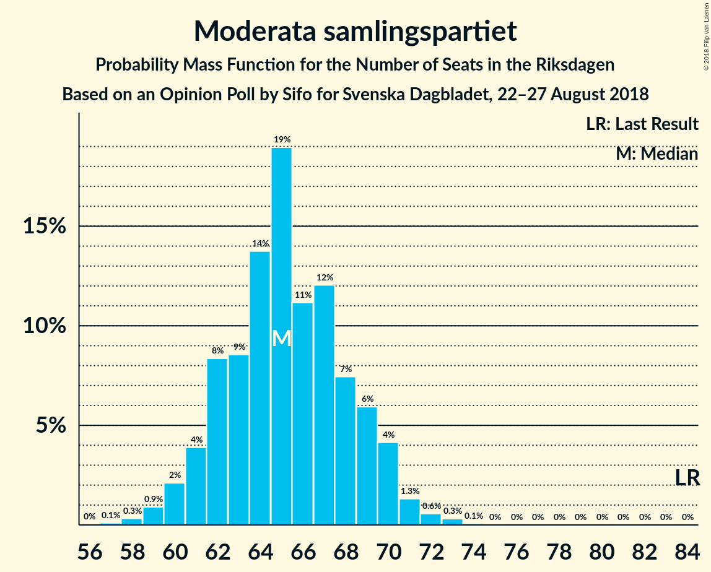
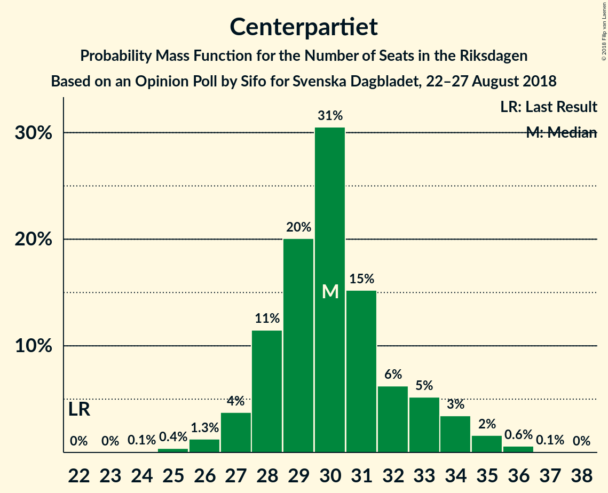
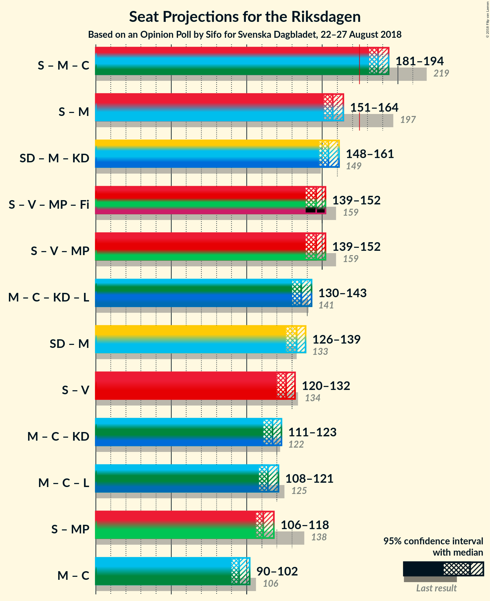

# Opinion Poll by Sifo for Svenska Dagbladet, 22–27 August 2018

<a href="#voting-intentions">Voting Intentions</a> | <a href="#seats">Seats</a> | <a href="#coalitions">Coalitions</a> | <a href="#technical-information">Technical Information</a>

## Voting Intentions

### Confidence Intervals

| Party | Last Result | Poll Result | 80% Confidence Interval | 90% Confidence Interval | 95% Confidence Interval | 99% Confidence Interval |
|:-----:|:-----------:|:-----------:|:-----------------------:|:-----------------------:|:-----------------------:|:-----------------------:|
| Sveriges socialdemokratiska arbetareparti | 31.0% | 25.9% | 24.8–27.0% |24.5–27.3% |24.3–27.6% |23.8–28.2% |
| Sverigedemokraterna | 12.9% | 18.8% | 17.9–19.8% |17.6–20.1% |17.4–20.3% |16.9–20.8% |
| Moderata samlingspartiet | 23.3% | 18.3% | 17.4–19.3% |17.1–19.6% |16.9–19.8% |16.4–20.3% |
| Vänsterpartiet | 5.7% | 9.5% | 8.8–10.3% |8.6–10.5% |8.4–10.7% |8.1–11.1% |
| Centerpartiet | 6.1% | 8.5% | 7.8–9.2% |7.6–9.4% |7.5–9.6% |7.2–10.0% |
| Kristdemokraterna | 4.6% | 6.1% | 5.5–6.8% |5.4–6.9% |5.3–7.1% |5.0–7.4% |
| Miljöpartiet de gröna | 6.9% | 5.5% | 5.0–6.1% |4.8–6.3% |4.7–6.5% |4.5–6.8% |
| Liberalerna | 5.4% | 5.3% | 4.8–5.9% |4.6–6.1% |4.5–6.2% |4.3–6.5% |

*Note:* The poll result column reflects the actual value used in the calculations. Published results may vary slightly, and in addition be rounded to fewer digits.

## Seats

### Confidence Intervals

| Party | Last Result | Median | 80% Confidence Interval | 90% Confidence Interval | 95% Confidence Interval | 99% Confidence Interval |
|:-----:|:-----------:|:------:|:-----------------------:|:-----------------------:|:-----------------------:|:-----------------------:|
| <a href="#sveriges-socialdemokratiska-arbetareparti">Sveriges socialdemokratiska arbetareparti</a> | 113 | 92 | 89–96 |88–97 |87–98 |85–100 |
| <a href="#sverigedemokraterna">Sverigedemokraterna</a> | 49 | 67 | 64–70 |62–72 |62–72 |61–75 |
| <a href="#moderata-samlingspartiet">Moderata samlingspartiet</a> | 84 | 65 | 62–69 |61–70 |60–70 |59–72 |
| <a href="#vänsterpartiet">Vänsterpartiet</a> | 21 | 34 | 31–36 |31–37 |30–38 |29–39 |
| <a href="#centerpartiet">Centerpartiet</a> | 22 | 30 | 28–33 |27–34 |27–34 |26–36 |
| <a href="#kristdemokraterna">Kristdemokraterna</a> | 16 | 22 | 20–24 |19–25 |19–25 |18–26 |
| <a href="#miljöpartiet-de-gröna">Miljöpartiet de gröna</a> | 25 | 20 | 18–22 |17–22 |17–23 |16–24 |
| <a href="#liberalerna">Liberalerna</a> | 19 | 19 | 17–21 |16–21 |16–22 |15–23 |

### Sveriges socialdemokratiska arbetareparti

*For a full overview of the results for this party, see the [Sveriges socialdemokratiska arbetareparti](party-sverigessocialdemokratiskaarbetareparti.html) page.*

| Number of Seats | Probability | Accumulated | Special Marks |
|:---------------:|:-----------:|:-----------:|:-------------:|
| 83 | 0.1% | 100% |  |
| 84 | 0.3% | 99.8% |  |
| 85 | 0.6% | 99.6% |  |
| 86 | 1.3% | 98.9% |  |
| 87 | 3% | 98% |  |
| 88 | 4% | 95% |  |
| 89 | 10% | 91% |  |
| 90 | 13% | 81% |  |
| 91 | 9% | 68% |  |
| 92 | 18% | 59% | Median |
| 93 | 10% | 41% |  |
| 94 | 12% | 31% |  |
| 95 | 7% | 19% |  |
| 96 | 7% | 13% |  |
| 97 | 3% | 6% |  |
| 98 | 1.4% | 3% |  |
| 99 | 1.0% | 2% |  |
| 100 | 0.3% | 0.6% |  |
| 101 | 0.2% | 0.3% |  |
| 102 | 0.1% | 0.1% |  |
| 103 | 0% | 0% |  |
| 104 | 0% | 0% |  |
| 105 | 0% | 0% |  |
| 106 | 0% | 0% |  |
| 107 | 0% | 0% |  |
| 108 | 0% | 0% |  |
| 109 | 0% | 0% |  |
| 110 | 0% | 0% |  |
| 111 | 0% | 0% |  |
| 112 | 0% | 0% |  |
| 113 | 0% | 0% | Last Result |

### Sverigedemokraterna

*For a full overview of the results for this party, see the [Sverigedemokraterna](party-sverigedemokraterna.html) page.*

| Number of Seats | Probability | Accumulated | Special Marks |
|:---------------:|:-----------:|:-----------:|:-------------:|
| 49 | 0% | 100% | Last Result |
| 50 | 0% | 100% |  |
| 51 | 0% | 100% |  |
| 52 | 0% | 100% |  |
| 53 | 0% | 100% |  |
| 54 | 0% | 100% |  |
| 55 | 0% | 100% |  |
| 56 | 0% | 100% |  |
| 57 | 0% | 100% |  |
| 58 | 0% | 100% |  |
| 59 | 0.1% | 100% |  |
| 60 | 0.3% | 99.8% |  |
| 61 | 1.3% | 99.5% |  |
| 62 | 3% | 98% |  |
| 63 | 3% | 95% |  |
| 64 | 10% | 92% |  |
| 65 | 8% | 82% |  |
| 66 | 12% | 74% |  |
| 67 | 17% | 62% | Median |
| 68 | 8% | 45% |  |
| 69 | 11% | 36% |  |
| 70 | 16% | 25% |  |
| 71 | 3% | 9% |  |
| 72 | 3% | 6% |  |
| 73 | 1.3% | 2% |  |
| 74 | 0.5% | 1.0% |  |
| 75 | 0.5% | 0.6% |  |
| 76 | 0.1% | 0.1% |  |
| 77 | 0% | 0% |  |

### Moderata samlingspartiet

*For a full overview of the results for this party, see the [Moderata samlingspartiet](party-moderatasamlingspartiet.html) page.*

| Number of Seats | Probability | Accumulated | Special Marks |
|:---------------:|:-----------:|:-----------:|:-------------:|
| 57 | 0.1% | 100% |  |
| 58 | 0.3% | 99.9% |  |
| 59 | 0.9% | 99.5% |  |
| 60 | 2% | 98.6% |  |
| 61 | 4% | 97% |  |
| 62 | 8% | 93% |  |
| 63 | 9% | 84% |  |
| 64 | 14% | 76% |  |
| 65 | 19% | 62% | Median |
| 66 | 11% | 43% |  |
| 67 | 12% | 32% |  |
| 68 | 7% | 20% |  |
| 69 | 6% | 12% |  |
| 70 | 4% | 6% |  |
| 71 | 1.3% | 2% |  |
| 72 | 0.6% | 1.0% |  |
| 73 | 0.3% | 0.4% |  |
| 74 | 0.1% | 0.1% |  |
| 75 | 0% | 0% |  |
| 76 | 0% | 0% |  |
| 77 | 0% | 0% |  |
| 78 | 0% | 0% |  |
| 79 | 0% | 0% |  |
| 80 | 0% | 0% |  |
| 81 | 0% | 0% |  |
| 82 | 0% | 0% |  |
| 83 | 0% | 0% |  |
| 84 | 0% | 0% | Last Result |

### Vänsterpartiet

*For a full overview of the results for this party, see the [Vänsterpartiet](party-vänsterpartiet.html) page.*

| Number of Seats | Probability | Accumulated | Special Marks |
|:---------------:|:-----------:|:-----------:|:-------------:|
| 21 | 0% | 100% | Last Result |
| 22 | 0% | 100% |  |
| 23 | 0% | 100% |  |
| 24 | 0% | 100% |  |
| 25 | 0% | 100% |  |
| 26 | 0% | 100% |  |
| 27 | 0% | 100% |  |
| 28 | 0.3% | 100% |  |
| 29 | 0.9% | 99.7% |  |
| 30 | 4% | 98.8% |  |
| 31 | 6% | 95% |  |
| 32 | 11% | 89% |  |
| 33 | 21% | 78% |  |
| 34 | 20% | 57% | Median |
| 35 | 17% | 37% |  |
| 36 | 11% | 20% |  |
| 37 | 5% | 10% |  |
| 38 | 3% | 4% |  |
| 39 | 1.0% | 1.4% |  |
| 40 | 0.3% | 0.4% |  |
| 41 | 0.1% | 0.1% |  |
| 42 | 0% | 0% |  |

### Centerpartiet

*For a full overview of the results for this party, see the [Centerpartiet](party-centerpartiet.html) page.*

| Number of Seats | Probability | Accumulated | Special Marks |
|:---------------:|:-----------:|:-----------:|:-------------:|
| 22 | 0% | 100% | Last Result |
| 23 | 0% | 100% |  |
| 24 | 0.1% | 100% |  |
| 25 | 0.4% | 99.9% |  |
| 26 | 1.3% | 99.5% |  |
| 27 | 4% | 98% |  |
| 28 | 11% | 94% |  |
| 29 | 20% | 83% |  |
| 30 | 31% | 63% | Median |
| 31 | 15% | 32% |  |
| 32 | 6% | 17% |  |
| 33 | 5% | 11% |  |
| 34 | 3% | 6% |  |
| 35 | 2% | 2% |  |
| 36 | 0.6% | 0.7% |  |
| 37 | 0.1% | 0.1% |  |
| 38 | 0% | 0% |  |

### Kristdemokraterna

*For a full overview of the results for this party, see the [Kristdemokraterna](party-kristdemokraterna.html) page.*

| Number of Seats | Probability | Accumulated | Special Marks |
|:---------------:|:-----------:|:-----------:|:-------------:|
| 16 | 0% | 100% | Last Result |
| 17 | 0.2% | 100% |  |
| 18 | 1.4% | 99.8% |  |
| 19 | 7% | 98% |  |
| 20 | 13% | 92% |  |
| 21 | 27% | 79% |  |
| 22 | 22% | 52% | Median |
| 23 | 16% | 30% |  |
| 24 | 8% | 14% |  |
| 25 | 4% | 6% |  |
| 26 | 2% | 2% |  |
| 27 | 0.4% | 0.4% |  |
| 28 | 0.1% | 0.1% |  |
| 29 | 0% | 0% |  |

### Miljöpartiet de gröna

*For a full overview of the results for this party, see the [Miljöpartiet de gröna](party-miljöpartietdegröna.html) page.*

| Number of Seats | Probability | Accumulated | Special Marks |
|:---------------:|:-----------:|:-----------:|:-------------:|
| 15 | 0.2% | 100% |  |
| 16 | 1.3% | 99.8% |  |
| 17 | 6% | 98% |  |
| 18 | 16% | 93% |  |
| 19 | 25% | 77% |  |
| 20 | 24% | 52% | Median |
| 21 | 16% | 28% |  |
| 22 | 8% | 12% |  |
| 23 | 3% | 4% |  |
| 24 | 0.8% | 1.0% |  |
| 25 | 0.2% | 0.2% | Last Result |
| 26 | 0% | 0% |  |

### Liberalerna

*For a full overview of the results for this party, see the [Liberalerna](party-liberalerna.html) page.*

| Number of Seats | Probability | Accumulated | Special Marks |
|:---------------:|:-----------:|:-----------:|:-------------:|
| 0 | 0.1% | 100% |  |
| 1 | 0% | 99.9% |  |
| 2 | 0% | 99.9% |  |
| 3 | 0% | 99.9% |  |
| 4 | 0% | 99.9% |  |
| 5 | 0% | 99.9% |  |
| 6 | 0% | 99.9% |  |
| 7 | 0% | 99.9% |  |
| 8 | 0% | 99.9% |  |
| 9 | 0% | 99.9% |  |
| 10 | 0% | 99.9% |  |
| 11 | 0% | 99.9% |  |
| 12 | 0% | 99.9% |  |
| 13 | 0% | 99.9% |  |
| 14 | 0.1% | 99.9% |  |
| 15 | 0.6% | 99.9% |  |
| 16 | 5% | 99.3% |  |
| 17 | 11% | 94% |  |
| 18 | 14% | 83% |  |
| 19 | 36% | 70% | Last Result, Median |
| 20 | 14% | 33% |  |
| 21 | 14% | 19% |  |
| 22 | 3% | 4% |  |
| 23 | 0.7% | 1.0% |  |
| 24 | 0.3% | 0.3% |  |
| 25 | 0% | 0% |  |

## Coalitions

### Confidence Intervals

| Coalition | Last Result | Median | Majority? | 80% Confidence Interval | 90% Confidence Interval | 95% Confidence Interval | 99% Confidence Interval |
|:---------:|:-----------:|:------:|:---------:|:-----------------------:|:-----------------------:|:-----------------------:|:-----------------------:|
| Sveriges socialdemokratiska arbetareparti – Moderata samlingspartiet – Centerpartiet | 219 | 187 | 100% | 183–192 | 182–193 | 181–194 | 179–197 |
| Sveriges socialdemokratiska arbetareparti – Moderata samlingspartiet | 197 | 157 | 0% | 153–161 | 152–163 | 151–164 | 149–166 |
| Sverigedemokraterna – Moderata samlingspartiet – Kristdemokraterna | 149 | 154 | 0% | 150–159 | 149–159 | 148–161 | 145–163 |
| Sveriges socialdemokratiska arbetareparti – Vänsterpartiet – Miljöpartiet de gröna | 159 | 146 | 0% | 141–150 | 140–151 | 139–152 | 137–154 |
| Moderata samlingspartiet – Centerpartiet – Kristdemokraterna – Liberalerna | 141 | 136 | 0% | 132–141 | 131–142 | 130–143 | 127–145 |
| Sverigedemokraterna – Moderata samlingspartiet | 133 | 133 | 0% | 128–136 | 126–138 | 126–139 | 124–141 |
| Sveriges socialdemokratiska arbetareparti – Vänsterpartiet | 134 | 126 | 0% | 122–130 | 121–131 | 120–132 | 118–135 |
| Moderata samlingspartiet – Centerpartiet – Kristdemokraterna | 122 | 117 | 0% | 113–122 | 112–123 | 111–123 | 109–126 |
| Moderata samlingspartiet – Centerpartiet – Liberalerna | 125 | 114 | 0% | 110–119 | 109–120 | 108–121 | 106–123 |
| Sveriges socialdemokratiska arbetareparti – Miljöpartiet de gröna | 138 | 111 | 0% | 108–116 | 107–117 | 106–118 | 103–120 |
| Moderata samlingspartiet – Centerpartiet | 106 | 95 | 0% | 91–99 | 91–100 | 90–102 | 88–103 |

### Sveriges socialdemokratiska arbetareparti – Moderata samlingspartiet – Centerpartiet

| Number of Seats | Probability | Accumulated | Special Marks |
|:---------------:|:-----------:|:-----------:|:-------------:|
| 176 | 0% | 100% |  |
| 177 | 0.1% | 99.9% |  |
| 178 | 0.2% | 99.9% |  |
| 179 | 0.4% | 99.7% |  |
| 180 | 1.2% | 99.3% |  |
| 181 | 2% | 98% |  |
| 182 | 3% | 96% |  |
| 183 | 6% | 94% |  |
| 184 | 6% | 88% |  |
| 185 | 12% | 81% |  |
| 186 | 9% | 70% |  |
| 187 | 14% | 60% | Median |
| 188 | 10% | 46% |  |
| 189 | 10% | 37% |  |
| 190 | 9% | 27% |  |
| 191 | 7% | 18% |  |
| 192 | 4% | 11% |  |
| 193 | 3% | 7% |  |
| 194 | 1.4% | 4% |  |
| 195 | 0.7% | 2% |  |
| 196 | 0.9% | 2% |  |
| 197 | 0.5% | 0.7% |  |
| 198 | 0.1% | 0.2% |  |
| 199 | 0.1% | 0.1% |  |
| 200 | 0% | 0% |  |
| 201 | 0% | 0% |  |
| 202 | 0% | 0% |  |
| 203 | 0% | 0% |  |
| 204 | 0% | 0% |  |
| 205 | 0% | 0% |  |
| 206 | 0% | 0% |  |
| 207 | 0% | 0% |  |
| 208 | 0% | 0% |  |
| 209 | 0% | 0% |  |
| 210 | 0% | 0% |  |
| 211 | 0% | 0% |  |
| 212 | 0% | 0% |  |
| 213 | 0% | 0% |  |
| 214 | 0% | 0% |  |
| 215 | 0% | 0% |  |
| 216 | 0% | 0% |  |
| 217 | 0% | 0% |  |
| 218 | 0% | 0% |  |
| 219 | 0% | 0% | Last Result |

### Sveriges socialdemokratiska arbetareparti – Moderata samlingspartiet

| Number of Seats | Probability | Accumulated | Special Marks |
|:---------------:|:-----------:|:-----------:|:-------------:|
| 146 | 0% | 100% |  |
| 147 | 0.1% | 99.9% |  |
| 148 | 0.2% | 99.8% |  |
| 149 | 0.5% | 99.6% |  |
| 150 | 0.9% | 99.0% |  |
| 151 | 2% | 98% |  |
| 152 | 3% | 96% |  |
| 153 | 4% | 93% |  |
| 154 | 9% | 89% |  |
| 155 | 7% | 80% |  |
| 156 | 10% | 73% |  |
| 157 | 16% | 63% | Median |
| 158 | 14% | 47% |  |
| 159 | 7% | 34% |  |
| 160 | 12% | 27% |  |
| 161 | 7% | 15% |  |
| 162 | 2% | 8% |  |
| 163 | 2% | 5% |  |
| 164 | 1.2% | 3% |  |
| 165 | 1.3% | 2% |  |
| 166 | 0.3% | 0.7% |  |
| 167 | 0.3% | 0.4% |  |
| 168 | 0.1% | 0.1% |  |
| 169 | 0.1% | 0.1% |  |
| 170 | 0% | 0% |  |
| 171 | 0% | 0% |  |
| 172 | 0% | 0% |  |
| 173 | 0% | 0% |  |
| 174 | 0% | 0% |  |
| 175 | 0% | 0% | Majority |
| 176 | 0% | 0% |  |
| 177 | 0% | 0% |  |
| 178 | 0% | 0% |  |
| 179 | 0% | 0% |  |
| 180 | 0% | 0% |  |
| 181 | 0% | 0% |  |
| 182 | 0% | 0% |  |
| 183 | 0% | 0% |  |
| 184 | 0% | 0% |  |
| 185 | 0% | 0% |  |
| 186 | 0% | 0% |  |
| 187 | 0% | 0% |  |
| 188 | 0% | 0% |  |
| 189 | 0% | 0% |  |
| 190 | 0% | 0% |  |
| 191 | 0% | 0% |  |
| 192 | 0% | 0% |  |
| 193 | 0% | 0% |  |
| 194 | 0% | 0% |  |
| 195 | 0% | 0% |  |
| 196 | 0% | 0% |  |
| 197 | 0% | 0% | Last Result |

### Sverigedemokraterna – Moderata samlingspartiet – Kristdemokraterna

| Number of Seats | Probability | Accumulated | Special Marks |
|:---------------:|:-----------:|:-----------:|:-------------:|
| 143 | 0.1% | 100% |  |
| 144 | 0.1% | 99.9% |  |
| 145 | 0.5% | 99.8% |  |
| 146 | 0.7% | 99.3% |  |
| 147 | 0.9% | 98.6% |  |
| 148 | 3% | 98% |  |
| 149 | 2% | 95% | Last Result |
| 150 | 9% | 93% |  |
| 151 | 4% | 84% |  |
| 152 | 12% | 80% |  |
| 153 | 7% | 68% |  |
| 154 | 11% | 60% | Median |
| 155 | 13% | 50% |  |
| 156 | 9% | 37% |  |
| 157 | 13% | 28% |  |
| 158 | 4% | 15% |  |
| 159 | 7% | 11% |  |
| 160 | 1.0% | 5% |  |
| 161 | 2% | 3% |  |
| 162 | 1.0% | 2% |  |
| 163 | 0.4% | 0.7% |  |
| 164 | 0.2% | 0.3% |  |
| 165 | 0.1% | 0.1% |  |
| 166 | 0% | 0.1% |  |
| 167 | 0% | 0% |  |

### Sveriges socialdemokratiska arbetareparti – Vänsterpartiet – Miljöpartiet de gröna

| Number of Seats | Probability | Accumulated | Special Marks |
|:---------------:|:-----------:|:-----------:|:-------------:|
| 134 | 0% | 100% |  |
| 135 | 0.1% | 99.9% |  |
| 136 | 0.2% | 99.9% |  |
| 137 | 0.4% | 99.7% |  |
| 138 | 0.6% | 99.4% |  |
| 139 | 2% | 98.8% |  |
| 140 | 2% | 97% |  |
| 141 | 5% | 95% |  |
| 142 | 5% | 89% |  |
| 143 | 10% | 84% |  |
| 144 | 13% | 74% |  |
| 145 | 10% | 60% |  |
| 146 | 14% | 51% | Median |
| 147 | 9% | 37% |  |
| 148 | 8% | 28% |  |
| 149 | 6% | 20% |  |
| 150 | 6% | 14% |  |
| 151 | 4% | 8% |  |
| 152 | 1.4% | 4% |  |
| 153 | 1.3% | 2% |  |
| 154 | 0.6% | 1.0% |  |
| 155 | 0.2% | 0.4% |  |
| 156 | 0.1% | 0.2% |  |
| 157 | 0.1% | 0.1% |  |
| 158 | 0% | 0% |  |
| 159 | 0% | 0% | Last Result |

### Moderata samlingspartiet – Centerpartiet – Kristdemokraterna – Liberalerna

| Number of Seats | Probability | Accumulated | Special Marks |
|:---------------:|:-----------:|:-----------:|:-------------:|
| 124 | 0% | 100% |  |
| 125 | 0% | 99.9% |  |
| 126 | 0.1% | 99.9% |  |
| 127 | 0.4% | 99.8% |  |
| 128 | 0.6% | 99.4% |  |
| 129 | 1.3% | 98.8% |  |
| 130 | 2% | 98% |  |
| 131 | 3% | 96% |  |
| 132 | 6% | 93% |  |
| 133 | 10% | 87% |  |
| 134 | 12% | 78% |  |
| 135 | 13% | 66% |  |
| 136 | 7% | 53% | Median |
| 137 | 12% | 46% |  |
| 138 | 9% | 34% |  |
| 139 | 9% | 25% |  |
| 140 | 5% | 16% |  |
| 141 | 6% | 11% | Last Result |
| 142 | 3% | 5% |  |
| 143 | 1.3% | 3% |  |
| 144 | 0.7% | 1.5% |  |
| 145 | 0.4% | 0.7% |  |
| 146 | 0.2% | 0.3% |  |
| 147 | 0.1% | 0.1% |  |
| 148 | 0% | 0.1% |  |
| 149 | 0% | 0% |  |

### Sverigedemokraterna – Moderata samlingspartiet

| Number of Seats | Probability | Accumulated | Special Marks |
|:---------------:|:-----------:|:-----------:|:-------------:|
| 121 | 0% | 100% |  |
| 122 | 0.1% | 99.9% |  |
| 123 | 0.2% | 99.8% |  |
| 124 | 0.6% | 99.6% |  |
| 125 | 1.1% | 99.0% |  |
| 126 | 3% | 98% |  |
| 127 | 3% | 95% |  |
| 128 | 4% | 92% |  |
| 129 | 5% | 88% |  |
| 130 | 10% | 83% |  |
| 131 | 12% | 73% |  |
| 132 | 8% | 60% | Median |
| 133 | 9% | 52% | Last Result |
| 134 | 11% | 43% |  |
| 135 | 15% | 32% |  |
| 136 | 7% | 17% |  |
| 137 | 4% | 10% |  |
| 138 | 3% | 6% |  |
| 139 | 1.4% | 3% |  |
| 140 | 0.7% | 2% |  |
| 141 | 0.6% | 0.9% |  |
| 142 | 0.1% | 0.2% |  |
| 143 | 0% | 0.1% |  |
| 144 | 0% | 0% |  |

### Sveriges socialdemokratiska arbetareparti – Vänsterpartiet

| Number of Seats | Probability | Accumulated | Special Marks |
|:---------------:|:-----------:|:-----------:|:-------------:|
| 115 | 0% | 100% |  |
| 116 | 0.1% | 99.9% |  |
| 117 | 0.2% | 99.8% |  |
| 118 | 0.6% | 99.6% |  |
| 119 | 0.9% | 99.1% |  |
| 120 | 2% | 98% |  |
| 121 | 4% | 96% |  |
| 122 | 6% | 92% |  |
| 123 | 8% | 86% |  |
| 124 | 9% | 78% |  |
| 125 | 14% | 69% |  |
| 126 | 15% | 56% | Median |
| 127 | 9% | 40% |  |
| 128 | 10% | 31% |  |
| 129 | 8% | 21% |  |
| 130 | 6% | 13% |  |
| 131 | 3% | 8% |  |
| 132 | 2% | 5% |  |
| 133 | 1.4% | 2% |  |
| 134 | 0.4% | 1.0% | Last Result |
| 135 | 0.3% | 0.6% |  |
| 136 | 0.1% | 0.2% |  |
| 137 | 0% | 0.1% |  |
| 138 | 0% | 0% |  |

### Moderata samlingspartiet – Centerpartiet – Kristdemokraterna

| Number of Seats | Probability | Accumulated | Special Marks |
|:---------------:|:-----------:|:-----------:|:-------------:|
| 107 | 0.1% | 100% |  |
| 108 | 0.1% | 99.9% |  |
| 109 | 0.5% | 99.8% |  |
| 110 | 1.2% | 99.3% |  |
| 111 | 2% | 98% |  |
| 112 | 4% | 97% |  |
| 113 | 7% | 93% |  |
| 114 | 7% | 86% |  |
| 115 | 12% | 79% |  |
| 116 | 14% | 66% |  |
| 117 | 9% | 53% | Median |
| 118 | 8% | 43% |  |
| 119 | 11% | 36% |  |
| 120 | 10% | 25% |  |
| 121 | 5% | 15% |  |
| 122 | 5% | 10% | Last Result |
| 123 | 3% | 5% |  |
| 124 | 0.9% | 2% |  |
| 125 | 0.8% | 1.5% |  |
| 126 | 0.3% | 0.7% |  |
| 127 | 0.2% | 0.4% |  |
| 128 | 0.1% | 0.1% |  |
| 129 | 0% | 0% |  |

### Moderata samlingspartiet – Centerpartiet – Liberalerna

| Number of Seats | Probability | Accumulated | Special Marks |
|:---------------:|:-----------:|:-----------:|:-------------:|
| 102 | 0% | 100% |  |
| 103 | 0% | 99.9% |  |
| 104 | 0.1% | 99.9% |  |
| 105 | 0.2% | 99.9% |  |
| 106 | 0.4% | 99.6% |  |
| 107 | 0.8% | 99.2% |  |
| 108 | 2% | 98% |  |
| 109 | 3% | 97% |  |
| 110 | 5% | 94% |  |
| 111 | 5% | 89% |  |
| 112 | 13% | 84% |  |
| 113 | 12% | 70% |  |
| 114 | 14% | 59% | Median |
| 115 | 8% | 45% |  |
| 116 | 10% | 36% |  |
| 117 | 9% | 26% |  |
| 118 | 5% | 17% |  |
| 119 | 7% | 12% |  |
| 120 | 2% | 5% |  |
| 121 | 2% | 3% |  |
| 122 | 0.8% | 1.4% |  |
| 123 | 0.3% | 0.6% |  |
| 124 | 0.2% | 0.3% |  |
| 125 | 0.1% | 0.1% | Last Result |
| 126 | 0% | 0% |  |

### Sveriges socialdemokratiska arbetareparti – Miljöpartiet de gröna

| Number of Seats | Probability | Accumulated | Special Marks |
|:---------------:|:-----------:|:-----------:|:-------------:|
| 102 | 0.1% | 100% |  |
| 103 | 0.3% | 99.8% |  |
| 104 | 0.4% | 99.5% |  |
| 105 | 0.9% | 99.1% |  |
| 106 | 1.3% | 98% |  |
| 107 | 2% | 97% |  |
| 108 | 9% | 95% |  |
| 109 | 10% | 86% |  |
| 110 | 13% | 76% |  |
| 111 | 17% | 63% |  |
| 112 | 12% | 46% | Median |
| 113 | 5% | 34% |  |
| 114 | 6% | 29% |  |
| 115 | 9% | 23% |  |
| 116 | 7% | 14% |  |
| 117 | 3% | 7% |  |
| 118 | 2% | 3% |  |
| 119 | 0.5% | 1.2% |  |
| 120 | 0.2% | 0.7% |  |
| 121 | 0.3% | 0.5% |  |
| 122 | 0.1% | 0.2% |  |
| 123 | 0.1% | 0.1% |  |
| 124 | 0% | 0% |  |
| 125 | 0% | 0% |  |
| 126 | 0% | 0% |  |
| 127 | 0% | 0% |  |
| 128 | 0% | 0% |  |
| 129 | 0% | 0% |  |
| 130 | 0% | 0% |  |
| 131 | 0% | 0% |  |
| 132 | 0% | 0% |  |
| 133 | 0% | 0% |  |
| 134 | 0% | 0% |  |
| 135 | 0% | 0% |  |
| 136 | 0% | 0% |  |
| 137 | 0% | 0% |  |
| 138 | 0% | 0% | Last Result |

### Moderata samlingspartiet – Centerpartiet

| Number of Seats | Probability | Accumulated | Special Marks |
|:---------------:|:-----------:|:-----------:|:-------------:|
| 86 | 0.1% | 100% |  |
| 87 | 0.3% | 99.9% |  |
| 88 | 0.5% | 99.6% |  |
| 89 | 1.3% | 99.0% |  |
| 90 | 3% | 98% |  |
| 91 | 5% | 95% |  |
| 92 | 7% | 90% |  |
| 93 | 13% | 83% |  |
| 94 | 9% | 70% |  |
| 95 | 16% | 61% | Median |
| 96 | 11% | 45% |  |
| 97 | 10% | 34% |  |
| 98 | 9% | 24% |  |
| 99 | 6% | 16% |  |
| 100 | 5% | 10% |  |
| 101 | 2% | 5% |  |
| 102 | 2% | 3% |  |
| 103 | 0.7% | 1.1% |  |
| 104 | 0.3% | 0.5% |  |
| 105 | 0.1% | 0.2% |  |
| 106 | 0% | 0.1% | Last Result |
| 107 | 0% | 0% |  |

## Technical Information

### Opinion Poll

+ **Polling firm:** Sifo
+ **Commissioner(s):** Svenska Dagbladet
+ **Fieldwork period:** 22–27 August 2018

### Calculations

+ **Sample size:** 2664
+ **Simulations done:** 1,048,576
+ **Error estimate:** 0.93%

