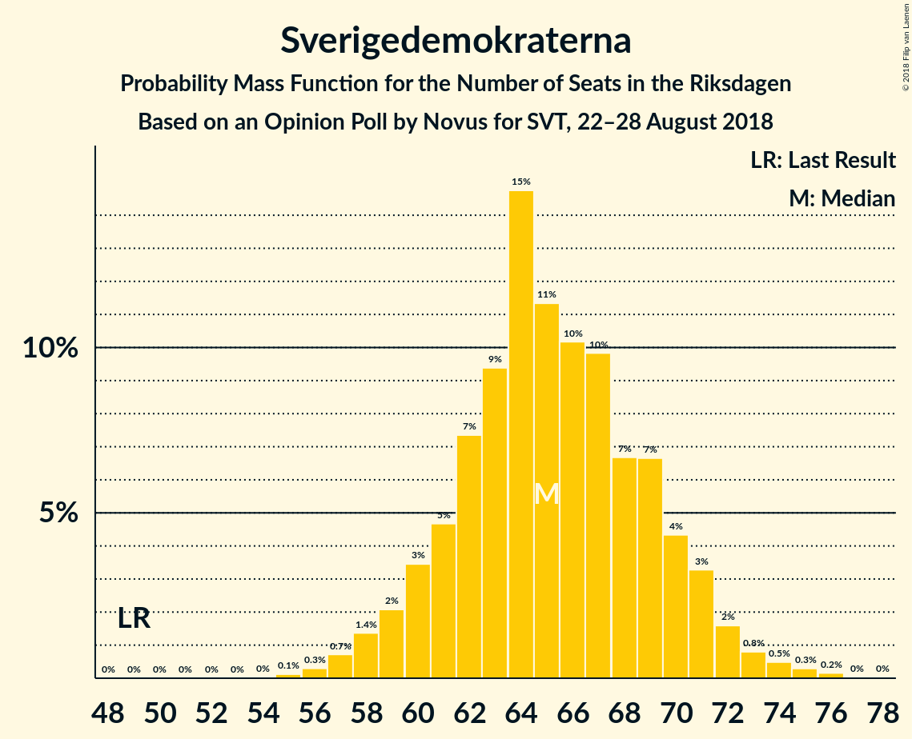
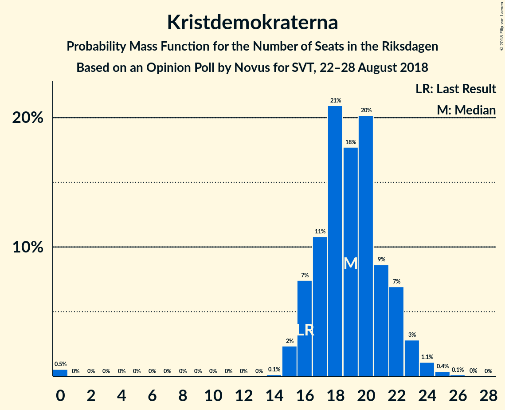

# Opinion Poll by Novus for SVT, 22–28 August 2018

<a href="#voting-intentions">Voting Intentions</a> | <a href="#seats">Seats</a> | <a href="#coalitions">Coalitions</a> | <a href="#technical-information">Technical Information</a>

## Voting Intentions

### Confidence Intervals

| Party | Last Result | Poll Result | 80% Confidence Interval | 90% Confidence Interval | 95% Confidence Interval | 99% Confidence Interval |
|:-----:|:-----------:|:-----------:|:-----------------------:|:-----------------------:|:-----------------------:|:-----------------------:|
| Sveriges socialdemokratiska arbetareparti | 31.0% | 24.3% | 22.9–25.7% |22.6–26.1% |22.2–26.4% |21.6–27.1% |
| Moderata samlingspartiet | 23.3% | 19.4% | 18.2–20.7% |17.9–21.1% |17.6–21.4% |17.0–22.1% |
| Sverigedemokraterna | 12.9% | 18.2% | 17.0–19.5% |16.7–19.8% |16.4–20.1% |15.8–20.8% |
| Vänsterpartiet | 5.7% | 10.1% | 9.2–11.1% |8.9–11.4% |8.7–11.7% |8.3–12.2% |
| Centerpartiet | 6.1% | 8.0% | 7.2–8.9% |7.0–9.2% |6.8–9.4% |6.4–9.9% |
| Liberalerna | 5.4% | 6.2% | 5.5–7.1% |5.3–7.3% |5.1–7.5% |4.8–7.9% |
| Miljöpartiet de gröna | 6.9% | 5.7% | 5.0–6.5% |4.8–6.8% |4.7–7.0% |4.4–7.4% |
| Kristdemokraterna | 4.6% | 5.3% | 4.6–6.1% |4.4–6.3% |4.3–6.5% |4.0–6.9% |

*Note:* The poll result column reflects the actual value used in the calculations. Published results may vary slightly, and in addition be rounded to fewer digits.

## Seats

### Confidence Intervals

| Party | Last Result | Median | 80% Confidence Interval | 90% Confidence Interval | 95% Confidence Interval | 99% Confidence Interval |
|:-----:|:-----------:|:------:|:-----------------------:|:-----------------------:|:-----------------------:|:-----------------------:|
| <a href="#sveriges-socialdemokratiska-arbetareparti">Sveriges socialdemokratiska arbetareparti</a> | 113 | 88 | 82–92 |80–93 |79–94 |77–97 |
| <a href="#moderata-samlingspartiet">Moderata samlingspartiet</a> | 84 | 69 | 65–74 |64–76 |63–77 |61–79 |
| <a href="#sverigedemokraterna">Sverigedemokraterna</a> | 49 | 65 | 61–70 |60–71 |58–72 |57–75 |
| <a href="#vänsterpartiet">Vänsterpartiet</a> | 21 | 36 | 33–40 |32–41 |31–42 |30–44 |
| <a href="#centerpartiet">Centerpartiet</a> | 22 | 29 | 26–32 |25–33 |24–34 |23–36 |
| <a href="#liberalerna">Liberalerna</a> | 19 | 22 | 19–25 |19–26 |18–27 |17–29 |
| <a href="#miljöpartiet-de-gröna">Miljöpartiet de gröna</a> | 25 | 21 | 18–23 |17–24 |17–25 |16–26 |
| <a href="#kristdemokraterna">Kristdemokraterna</a> | 16 | 19 | 16–22 |16–22 |15–23 |0–25 |

### Sveriges socialdemokratiska arbetareparti

*For a full overview of the results for this party, see the [Sveriges socialdemokratiska arbetareparti](party-sverigessocialdemokratiskaarbetareparti.html) page.*

| Number of Seats | Probability | Accumulated | Special Marks |
|:---------------:|:-----------:|:-----------:|:-------------:|
| 75 | 0.1% | 100% |  |
| 76 | 0.2% | 99.8% |  |
| 77 | 0.3% | 99.7% |  |
| 78 | 1.1% | 99.4% |  |
| 79 | 1.2% | 98% |  |
| 80 | 2% | 97% |  |
| 81 | 3% | 95% |  |
| 82 | 3% | 91% |  |
| 83 | 5% | 88% |  |
| 84 | 6% | 83% |  |
| 85 | 6% | 77% |  |
| 86 | 7% | 70% |  |
| 87 | 12% | 63% |  |
| 88 | 8% | 51% | Median |
| 89 | 11% | 43% |  |
| 90 | 8% | 32% |  |
| 91 | 11% | 23% |  |
| 92 | 4% | 12% |  |
| 93 | 4% | 8% |  |
| 94 | 2% | 5% |  |
| 95 | 1.0% | 2% |  |
| 96 | 0.7% | 1.5% |  |
| 97 | 0.4% | 0.8% |  |
| 98 | 0.2% | 0.3% |  |
| 99 | 0.1% | 0.2% |  |
| 100 | 0% | 0.1% |  |
| 101 | 0% | 0% |  |
| 102 | 0% | 0% |  |
| 103 | 0% | 0% |  |
| 104 | 0% | 0% |  |
| 105 | 0% | 0% |  |
| 106 | 0% | 0% |  |
| 107 | 0% | 0% |  |
| 108 | 0% | 0% |  |
| 109 | 0% | 0% |  |
| 110 | 0% | 0% |  |
| 111 | 0% | 0% |  |
| 112 | 0% | 0% |  |
| 113 | 0% | 0% | Last Result |

### Moderata samlingspartiet

*For a full overview of the results for this party, see the [Moderata samlingspartiet](party-moderatasamlingspartiet.html) page.*

| Number of Seats | Probability | Accumulated | Special Marks |
|:---------------:|:-----------:|:-----------:|:-------------:|
| 58 | 0% | 100% |  |
| 59 | 0.1% | 99.9% |  |
| 60 | 0.2% | 99.9% |  |
| 61 | 0.6% | 99.6% |  |
| 62 | 1.3% | 99.0% |  |
| 63 | 2% | 98% |  |
| 64 | 5% | 96% |  |
| 65 | 7% | 91% |  |
| 66 | 6% | 84% |  |
| 67 | 10% | 78% |  |
| 68 | 16% | 68% |  |
| 69 | 11% | 53% | Median |
| 70 | 9% | 42% |  |
| 71 | 7% | 33% |  |
| 72 | 8% | 26% |  |
| 73 | 5% | 18% |  |
| 74 | 5% | 13% |  |
| 75 | 3% | 8% |  |
| 76 | 2% | 6% |  |
| 77 | 2% | 4% |  |
| 78 | 1.0% | 2% |  |
| 79 | 0.4% | 0.8% |  |
| 80 | 0.2% | 0.4% |  |
| 81 | 0.1% | 0.2% |  |
| 82 | 0% | 0.1% |  |
| 83 | 0% | 0% |  |
| 84 | 0% | 0% | Last Result |

### Sverigedemokraterna

*For a full overview of the results for this party, see the [Sverigedemokraterna](party-sverigedemokraterna.html) page.*

| Number of Seats | Probability | Accumulated | Special Marks |
|:---------------:|:-----------:|:-----------:|:-------------:|
| 49 | 0% | 100% | Last Result |
| 50 | 0% | 100% |  |
| 51 | 0% | 100% |  |
| 52 | 0% | 100% |  |
| 53 | 0% | 100% |  |
| 54 | 0% | 100% |  |
| 55 | 0.1% | 99.9% |  |
| 56 | 0.3% | 99.8% |  |
| 57 | 0.7% | 99.5% |  |
| 58 | 1.4% | 98.8% |  |
| 59 | 2% | 97% |  |
| 60 | 3% | 95% |  |
| 61 | 5% | 92% |  |
| 62 | 7% | 87% |  |
| 63 | 9% | 80% |  |
| 64 | 15% | 70% |  |
| 65 | 11% | 56% | Median |
| 66 | 10% | 44% |  |
| 67 | 10% | 34% |  |
| 68 | 7% | 24% |  |
| 69 | 7% | 18% |  |
| 70 | 4% | 11% |  |
| 71 | 3% | 7% |  |
| 72 | 2% | 3% |  |
| 73 | 0.8% | 2% |  |
| 74 | 0.5% | 1.0% |  |
| 75 | 0.3% | 0.5% |  |
| 76 | 0.2% | 0.2% |  |
| 77 | 0% | 0.1% |  |
| 78 | 0% | 0% |  |

### Vänsterpartiet

*For a full overview of the results for this party, see the [Vänsterpartiet](party-vänsterpartiet.html) page.*

| Number of Seats | Probability | Accumulated | Special Marks |
|:---------------:|:-----------:|:-----------:|:-------------:|
| 21 | 0% | 100% | Last Result |
| 22 | 0% | 100% |  |
| 23 | 0% | 100% |  |
| 24 | 0% | 100% |  |
| 25 | 0% | 100% |  |
| 26 | 0% | 100% |  |
| 27 | 0% | 100% |  |
| 28 | 0.1% | 100% |  |
| 29 | 0.2% | 99.9% |  |
| 30 | 0.8% | 99.6% |  |
| 31 | 2% | 98.9% |  |
| 32 | 5% | 97% |  |
| 33 | 6% | 92% |  |
| 34 | 9% | 86% |  |
| 35 | 14% | 77% |  |
| 36 | 14% | 64% | Median |
| 37 | 11% | 49% |  |
| 38 | 13% | 38% |  |
| 39 | 13% | 25% |  |
| 40 | 6% | 12% |  |
| 41 | 3% | 7% |  |
| 42 | 2% | 4% |  |
| 43 | 0.9% | 2% |  |
| 44 | 0.4% | 0.6% |  |
| 45 | 0.1% | 0.2% |  |
| 46 | 0.1% | 0.1% |  |
| 47 | 0% | 0% |  |

### Centerpartiet

*For a full overview of the results for this party, see the [Centerpartiet](party-centerpartiet.html) page.*

| Number of Seats | Probability | Accumulated | Special Marks |
|:---------------:|:-----------:|:-----------:|:-------------:|
| 21 | 0% | 100% |  |
| 22 | 0.2% | 99.9% | Last Result |
| 23 | 0.9% | 99.7% |  |
| 24 | 3% | 98.9% |  |
| 25 | 5% | 96% |  |
| 26 | 8% | 91% |  |
| 27 | 15% | 83% |  |
| 28 | 16% | 69% |  |
| 29 | 17% | 53% | Median |
| 30 | 12% | 36% |  |
| 31 | 11% | 24% |  |
| 32 | 8% | 13% |  |
| 33 | 3% | 6% |  |
| 34 | 2% | 3% |  |
| 35 | 0.6% | 1.1% |  |
| 36 | 0.3% | 0.5% |  |
| 37 | 0.1% | 0.2% |  |
| 38 | 0% | 0% |  |

### Liberalerna

*For a full overview of the results for this party, see the [Liberalerna](party-liberalerna.html) page.*

| Number of Seats | Probability | Accumulated | Special Marks |
|:---------------:|:-----------:|:-----------:|:-------------:|
| 16 | 0.2% | 100% |  |
| 17 | 0.8% | 99.8% |  |
| 18 | 2% | 99.0% |  |
| 19 | 7% | 97% | Last Result |
| 20 | 13% | 90% |  |
| 21 | 15% | 77% |  |
| 22 | 21% | 62% | Median |
| 23 | 13% | 41% |  |
| 24 | 10% | 28% |  |
| 25 | 8% | 18% |  |
| 26 | 6% | 10% |  |
| 27 | 2% | 4% |  |
| 28 | 1.2% | 2% |  |
| 29 | 0.4% | 0.5% |  |
| 30 | 0.1% | 0.1% |  |
| 31 | 0% | 0% |  |

### Miljöpartiet de gröna

*For a full overview of the results for this party, see the [Miljöpartiet de gröna](party-miljöpartietdegröna.html) page.*

| Number of Seats | Probability | Accumulated | Special Marks |
|:---------------:|:-----------:|:-----------:|:-------------:|
| 14 | 0% | 100% |  |
| 15 | 0.4% | 99.9% |  |
| 16 | 1.2% | 99.6% |  |
| 17 | 5% | 98% |  |
| 18 | 9% | 94% |  |
| 19 | 13% | 84% |  |
| 20 | 20% | 71% |  |
| 21 | 20% | 51% | Median |
| 22 | 13% | 31% |  |
| 23 | 10% | 19% |  |
| 24 | 5% | 9% |  |
| 25 | 2% | 3% | Last Result |
| 26 | 0.9% | 1.3% |  |
| 27 | 0.3% | 0.4% |  |
| 28 | 0.1% | 0.1% |  |
| 29 | 0% | 0% |  |

### Kristdemokraterna

*For a full overview of the results for this party, see the [Kristdemokraterna](party-kristdemokraterna.html) page.*

| Number of Seats | Probability | Accumulated | Special Marks |
|:---------------:|:-----------:|:-----------:|:-------------:|
| 0 | 0.5% | 100% |  |
| 1 | 0% | 99.5% |  |
| 2 | 0% | 99.5% |  |
| 3 | 0% | 99.5% |  |
| 4 | 0% | 99.5% |  |
| 5 | 0% | 99.5% |  |
| 6 | 0% | 99.5% |  |
| 7 | 0% | 99.5% |  |
| 8 | 0% | 99.5% |  |
| 9 | 0% | 99.5% |  |
| 10 | 0% | 99.5% |  |
| 11 | 0% | 99.5% |  |
| 12 | 0% | 99.5% |  |
| 13 | 0% | 99.5% |  |
| 14 | 0.1% | 99.5% |  |
| 15 | 2% | 99.3% |  |
| 16 | 7% | 97% | Last Result |
| 17 | 11% | 90% |  |
| 18 | 21% | 79% |  |
| 19 | 18% | 58% | Median |
| 20 | 20% | 40% |  |
| 21 | 9% | 20% |  |
| 22 | 7% | 11% |  |
| 23 | 3% | 4% |  |
| 24 | 1.1% | 2% |  |
| 25 | 0.4% | 0.5% |  |
| 26 | 0.1% | 0.2% |  |
| 27 | 0% | 0% |  |

## Coalitions

### Confidence Intervals

| Coalition | Last Result | Median | Majority? | 80% Confidence Interval | 90% Confidence Interval | 95% Confidence Interval | 99% Confidence Interval |
|:---------:|:-----------:|:------:|:---------:|:-----------------------:|:-----------------------:|:-----------------------:|:-----------------------:|
| Sveriges socialdemokratiska arbetareparti – Moderata samlingspartiet – Centerpartiet | 219 | 186 | 99.1% | 180–191 | 178–192 | 176–194 | 174–197 |
| Sveriges socialdemokratiska arbetareparti – Moderata samlingspartiet | 197 | 157 | 0% | 151–162 | 149–164 | 148–165 | 145–168 |
| Moderata samlingspartiet – Sverigedemokraterna – Kristdemokraterna | 149 | 152 | 0% | 149–160 | 147–162 | 145–163 | 141–164 |
| Sveriges socialdemokratiska arbetareparti – Vänsterpartiet – Miljöpartiet de gröna | 159 | 146 | 0% | 138–149 | 136–151 | 135–153 | 133–155 |
| Moderata samlingspartiet – Centerpartiet – Liberalerna – Kristdemokraterna | 141 | 138 | 0% | 133–146 | 132–148 | 131–149 | 128–151 |
| Moderata samlingspartiet – Sverigedemokraterna | 133 | 134 | 0% | 129–141 | 127–142 | 127–144 | 124–146 |
| Sveriges socialdemokratiska arbetareparti – Vänsterpartiet | 134 | 125 | 0% | 117–129 | 115–130 | 114–131 | 112–134 |
| Moderata samlingspartiet – Centerpartiet – Liberalerna | 125 | 119 | 0% | 115–127 | 114–129 | 113–130 | 111–132 |
| Moderata samlingspartiet – Centerpartiet – Kristdemokraterna | 122 | 116 | 0% | 111–123 | 110–124 | 109–126 | 105–129 |
| Sveriges socialdemokratiska arbetareparti – Miljöpartiet de gröna | 138 | 109 | 0% | 102–112 | 100–113 | 99–116 | 97–119 |
| Moderata samlingspartiet – Centerpartiet | 106 | 97 | 0% | 93–104 | 91–105 | 90–106 | 88–109 |

### Sveriges socialdemokratiska arbetareparti – Moderata samlingspartiet – Centerpartiet

| Number of Seats | Probability | Accumulated | Special Marks |
|:---------------:|:-----------:|:-----------:|:-------------:|
| 170 | 0% | 100% |  |
| 171 | 0.1% | 99.9% |  |
| 172 | 0.1% | 99.9% |  |
| 173 | 0.2% | 99.7% |  |
| 174 | 0.4% | 99.5% |  |
| 175 | 0.7% | 99.1% | Majority |
| 176 | 1.1% | 98% |  |
| 177 | 1.3% | 97% |  |
| 178 | 2% | 96% |  |
| 179 | 2% | 94% |  |
| 180 | 4% | 91% |  |
| 181 | 8% | 87% |  |
| 182 | 5% | 79% |  |
| 183 | 7% | 74% |  |
| 184 | 10% | 67% |  |
| 185 | 4% | 57% |  |
| 186 | 13% | 53% | Median |
| 187 | 10% | 40% |  |
| 188 | 7% | 31% |  |
| 189 | 7% | 23% |  |
| 190 | 5% | 17% |  |
| 191 | 3% | 11% |  |
| 192 | 4% | 8% |  |
| 193 | 2% | 5% |  |
| 194 | 1.2% | 3% |  |
| 195 | 0.7% | 2% |  |
| 196 | 0.7% | 1.3% |  |
| 197 | 0.2% | 0.6% |  |
| 198 | 0.1% | 0.4% |  |
| 199 | 0.1% | 0.3% |  |
| 200 | 0.1% | 0.2% |  |
| 201 | 0.1% | 0.1% |  |
| 202 | 0% | 0.1% |  |
| 203 | 0% | 0% |  |
| 204 | 0% | 0% |  |
| 205 | 0% | 0% |  |
| 206 | 0% | 0% |  |
| 207 | 0% | 0% |  |
| 208 | 0% | 0% |  |
| 209 | 0% | 0% |  |
| 210 | 0% | 0% |  |
| 211 | 0% | 0% |  |
| 212 | 0% | 0% |  |
| 213 | 0% | 0% |  |
| 214 | 0% | 0% |  |
| 215 | 0% | 0% |  |
| 216 | 0% | 0% |  |
| 217 | 0% | 0% |  |
| 218 | 0% | 0% |  |
| 219 | 0% | 0% | Last Result |

### Sveriges socialdemokratiska arbetareparti – Moderata samlingspartiet

| Number of Seats | Probability | Accumulated | Special Marks |
|:---------------:|:-----------:|:-----------:|:-------------:|
| 142 | 0% | 100% |  |
| 143 | 0.1% | 99.9% |  |
| 144 | 0.1% | 99.8% |  |
| 145 | 0.4% | 99.7% |  |
| 146 | 0.6% | 99.3% |  |
| 147 | 0.7% | 98.7% |  |
| 148 | 1.4% | 98% |  |
| 149 | 2% | 97% |  |
| 150 | 3% | 95% |  |
| 151 | 4% | 92% |  |
| 152 | 5% | 88% |  |
| 153 | 6% | 84% |  |
| 154 | 9% | 77% |  |
| 155 | 6% | 68% |  |
| 156 | 11% | 62% |  |
| 157 | 12% | 52% | Median |
| 158 | 7% | 40% |  |
| 159 | 9% | 33% |  |
| 160 | 7% | 24% |  |
| 161 | 4% | 17% |  |
| 162 | 5% | 13% |  |
| 163 | 3% | 8% |  |
| 164 | 2% | 6% |  |
| 165 | 2% | 4% |  |
| 166 | 1.0% | 2% |  |
| 167 | 0.5% | 1.3% |  |
| 168 | 0.3% | 0.7% |  |
| 169 | 0.2% | 0.4% |  |
| 170 | 0.1% | 0.2% |  |
| 171 | 0.1% | 0.2% |  |
| 172 | 0% | 0.1% |  |
| 173 | 0% | 0% |  |
| 174 | 0% | 0% |  |
| 175 | 0% | 0% | Majority |
| 176 | 0% | 0% |  |
| 177 | 0% | 0% |  |
| 178 | 0% | 0% |  |
| 179 | 0% | 0% |  |
| 180 | 0% | 0% |  |
| 181 | 0% | 0% |  |
| 182 | 0% | 0% |  |
| 183 | 0% | 0% |  |
| 184 | 0% | 0% |  |
| 185 | 0% | 0% |  |
| 186 | 0% | 0% |  |
| 187 | 0% | 0% |  |
| 188 | 0% | 0% |  |
| 189 | 0% | 0% |  |
| 190 | 0% | 0% |  |
| 191 | 0% | 0% |  |
| 192 | 0% | 0% |  |
| 193 | 0% | 0% |  |
| 194 | 0% | 0% |  |
| 195 | 0% | 0% |  |
| 196 | 0% | 0% |  |
| 197 | 0% | 0% | Last Result |

### Moderata samlingspartiet – Sverigedemokraterna – Kristdemokraterna

| Number of Seats | Probability | Accumulated | Special Marks |
|:---------------:|:-----------:|:-----------:|:-------------:|
| 137 | 0% | 100% |  |
| 138 | 0% | 99.9% |  |
| 139 | 0% | 99.9% |  |
| 140 | 0.2% | 99.8% |  |
| 141 | 0.2% | 99.6% |  |
| 142 | 0.3% | 99.4% |  |
| 143 | 0.5% | 99.1% |  |
| 144 | 0.8% | 98.7% |  |
| 145 | 0.5% | 98% |  |
| 146 | 1.1% | 97% |  |
| 147 | 2% | 96% |  |
| 148 | 4% | 95% |  |
| 149 | 6% | 91% | Last Result |
| 150 | 14% | 85% |  |
| 151 | 8% | 71% |  |
| 152 | 17% | 63% |  |
| 153 | 5% | 47% | Median |
| 154 | 8% | 41% |  |
| 155 | 4% | 34% |  |
| 156 | 5% | 30% |  |
| 157 | 5% | 24% |  |
| 158 | 4% | 20% |  |
| 159 | 4% | 16% |  |
| 160 | 3% | 11% |  |
| 161 | 3% | 8% |  |
| 162 | 3% | 5% |  |
| 163 | 2% | 3% |  |
| 164 | 0.8% | 1.3% |  |
| 165 | 0.2% | 0.5% |  |
| 166 | 0.1% | 0.3% |  |
| 167 | 0% | 0.2% |  |
| 168 | 0% | 0.1% |  |
| 169 | 0% | 0.1% |  |
| 170 | 0% | 0% |  |

### Sveriges socialdemokratiska arbetareparti – Vänsterpartiet – Miljöpartiet de gröna

| Number of Seats | Probability | Accumulated | Special Marks |
|:---------------:|:-----------:|:-----------:|:-------------:|
| 129 | 0% | 100% |  |
| 130 | 0% | 99.9% |  |
| 131 | 0.1% | 99.9% |  |
| 132 | 0.2% | 99.8% |  |
| 133 | 0.5% | 99.5% |  |
| 134 | 1.4% | 99.1% |  |
| 135 | 2% | 98% |  |
| 136 | 2% | 96% |  |
| 137 | 3% | 94% |  |
| 138 | 4% | 91% |  |
| 139 | 3% | 87% |  |
| 140 | 5% | 84% |  |
| 141 | 4% | 79% |  |
| 142 | 6% | 75% |  |
| 143 | 9% | 69% |  |
| 144 | 5% | 60% |  |
| 145 | 5% | 55% | Median |
| 146 | 6% | 50% |  |
| 147 | 12% | 44% |  |
| 148 | 14% | 32% |  |
| 149 | 8% | 18% |  |
| 150 | 4% | 10% |  |
| 151 | 2% | 6% |  |
| 152 | 1.0% | 4% |  |
| 153 | 0.9% | 3% |  |
| 154 | 0.8% | 2% |  |
| 155 | 0.4% | 0.9% |  |
| 156 | 0.2% | 0.5% |  |
| 157 | 0.1% | 0.3% |  |
| 158 | 0.1% | 0.2% |  |
| 159 | 0% | 0.1% | Last Result |
| 160 | 0% | 0% |  |

### Moderata samlingspartiet – Centerpartiet – Liberalerna – Kristdemokraterna

| Number of Seats | Probability | Accumulated | Special Marks |
|:---------------:|:-----------:|:-----------:|:-------------:|
| 122 | 0% | 100% |  |
| 123 | 0% | 99.9% |  |
| 124 | 0% | 99.9% |  |
| 125 | 0.1% | 99.9% |  |
| 126 | 0.1% | 99.8% |  |
| 127 | 0.1% | 99.7% |  |
| 128 | 0.2% | 99.7% |  |
| 129 | 0.3% | 99.5% |  |
| 130 | 0.8% | 99.2% |  |
| 131 | 1.0% | 98% |  |
| 132 | 3% | 97% |  |
| 133 | 5% | 94% |  |
| 134 | 6% | 89% |  |
| 135 | 7% | 83% |  |
| 136 | 10% | 77% |  |
| 137 | 9% | 67% |  |
| 138 | 10% | 58% |  |
| 139 | 7% | 48% | Median |
| 140 | 5% | 41% |  |
| 141 | 5% | 36% | Last Result |
| 142 | 5% | 31% |  |
| 143 | 5% | 26% |  |
| 144 | 5% | 21% |  |
| 145 | 4% | 16% |  |
| 146 | 4% | 12% |  |
| 147 | 4% | 9% |  |
| 148 | 2% | 5% |  |
| 149 | 1.4% | 3% |  |
| 150 | 1.1% | 2% |  |
| 151 | 0.6% | 1.0% |  |
| 152 | 0.2% | 0.4% |  |
| 153 | 0.1% | 0.1% |  |
| 154 | 0% | 0.1% |  |
| 155 | 0% | 0% |  |

### Moderata samlingspartiet – Sverigedemokraterna

| Number of Seats | Probability | Accumulated | Special Marks |
|:---------------:|:-----------:|:-----------:|:-------------:|
| 120 | 0% | 100% |  |
| 121 | 0% | 99.9% |  |
| 122 | 0.2% | 99.9% |  |
| 123 | 0.1% | 99.7% |  |
| 124 | 0.3% | 99.5% |  |
| 125 | 0.8% | 99.2% |  |
| 126 | 0.3% | 98% |  |
| 127 | 4% | 98% |  |
| 128 | 1.1% | 94% |  |
| 129 | 4% | 93% |  |
| 130 | 7% | 89% |  |
| 131 | 4% | 82% |  |
| 132 | 21% | 78% |  |
| 133 | 3% | 58% | Last Result |
| 134 | 10% | 55% | Median |
| 135 | 9% | 45% |  |
| 136 | 6% | 36% |  |
| 137 | 7% | 31% |  |
| 138 | 4% | 23% |  |
| 139 | 6% | 19% |  |
| 140 | 2% | 13% |  |
| 141 | 4% | 11% |  |
| 142 | 3% | 7% |  |
| 143 | 1.2% | 4% |  |
| 144 | 2% | 3% |  |
| 145 | 0.3% | 1.1% |  |
| 146 | 0.4% | 0.8% |  |
| 147 | 0.1% | 0.3% |  |
| 148 | 0.1% | 0.2% |  |
| 149 | 0% | 0.1% |  |
| 150 | 0% | 0.1% |  |
| 151 | 0% | 0% |  |

### Sveriges socialdemokratiska arbetareparti – Vänsterpartiet

| Number of Seats | Probability | Accumulated | Special Marks |
|:---------------:|:-----------:|:-----------:|:-------------:|
| 109 | 0% | 100% |  |
| 110 | 0.1% | 99.9% |  |
| 111 | 0.1% | 99.9% |  |
| 112 | 0.3% | 99.8% |  |
| 113 | 0.6% | 99.5% |  |
| 114 | 2% | 98.9% |  |
| 115 | 2% | 97% |  |
| 116 | 3% | 95% |  |
| 117 | 4% | 92% |  |
| 118 | 3% | 88% |  |
| 119 | 4% | 85% |  |
| 120 | 4% | 82% |  |
| 121 | 7% | 77% |  |
| 122 | 7% | 70% |  |
| 123 | 6% | 63% |  |
| 124 | 5% | 57% | Median |
| 125 | 7% | 52% |  |
| 126 | 7% | 45% |  |
| 127 | 15% | 38% |  |
| 128 | 9% | 23% |  |
| 129 | 7% | 14% |  |
| 130 | 2% | 7% |  |
| 131 | 2% | 5% |  |
| 132 | 0.8% | 2% |  |
| 133 | 0.7% | 2% |  |
| 134 | 0.6% | 1.1% | Last Result |
| 135 | 0.2% | 0.5% |  |
| 136 | 0.1% | 0.3% |  |
| 137 | 0% | 0.1% |  |
| 138 | 0% | 0.1% |  |
| 139 | 0% | 0% |  |

### Moderata samlingspartiet – Centerpartiet – Liberalerna

| Number of Seats | Probability | Accumulated | Special Marks |
|:---------------:|:-----------:|:-----------:|:-------------:|
| 107 | 0% | 100% |  |
| 108 | 0% | 99.9% |  |
| 109 | 0.1% | 99.9% |  |
| 110 | 0.2% | 99.8% |  |
| 111 | 0.3% | 99.6% |  |
| 112 | 1.4% | 99.3% |  |
| 113 | 2% | 98% |  |
| 114 | 4% | 96% |  |
| 115 | 7% | 92% |  |
| 116 | 8% | 85% |  |
| 117 | 9% | 77% |  |
| 118 | 12% | 67% |  |
| 119 | 9% | 56% |  |
| 120 | 6% | 47% | Median |
| 121 | 5% | 40% |  |
| 122 | 4% | 35% |  |
| 123 | 4% | 31% |  |
| 124 | 4% | 27% |  |
| 125 | 6% | 23% | Last Result |
| 126 | 5% | 17% |  |
| 127 | 5% | 13% |  |
| 128 | 3% | 8% |  |
| 129 | 3% | 5% |  |
| 130 | 1.2% | 3% |  |
| 131 | 0.7% | 2% |  |
| 132 | 0.5% | 0.9% |  |
| 133 | 0.2% | 0.3% |  |
| 134 | 0.1% | 0.2% |  |
| 135 | 0.1% | 0.1% |  |
| 136 | 0% | 0.1% |  |
| 137 | 0% | 0% |  |

### Moderata samlingspartiet – Centerpartiet – Kristdemokraterna

| Number of Seats | Probability | Accumulated | Special Marks |
|:---------------:|:-----------:|:-----------:|:-------------:|
| 99 | 0% | 100% |  |
| 100 | 0% | 99.9% |  |
| 101 | 0% | 99.9% |  |
| 102 | 0% | 99.9% |  |
| 103 | 0% | 99.8% |  |
| 104 | 0.2% | 99.8% |  |
| 105 | 0.2% | 99.6% |  |
| 106 | 0.2% | 99.4% |  |
| 107 | 0.5% | 99.2% |  |
| 108 | 0.9% | 98.7% |  |
| 109 | 1.4% | 98% |  |
| 110 | 2% | 96% |  |
| 111 | 4% | 94% |  |
| 112 | 6% | 90% |  |
| 113 | 5% | 84% |  |
| 114 | 8% | 79% |  |
| 115 | 10% | 70% |  |
| 116 | 12% | 61% |  |
| 117 | 7% | 48% | Median |
| 118 | 9% | 42% |  |
| 119 | 6% | 33% |  |
| 120 | 5% | 27% |  |
| 121 | 6% | 22% |  |
| 122 | 4% | 16% | Last Result |
| 123 | 4% | 11% |  |
| 124 | 2% | 7% |  |
| 125 | 2% | 5% |  |
| 126 | 1.1% | 3% |  |
| 127 | 0.7% | 2% |  |
| 128 | 0.7% | 1.3% |  |
| 129 | 0.2% | 0.5% |  |
| 130 | 0.2% | 0.3% |  |
| 131 | 0.1% | 0.1% |  |
| 132 | 0% | 0.1% |  |
| 133 | 0% | 0% |  |

### Sveriges socialdemokratiska arbetareparti – Miljöpartiet de gröna

| Number of Seats | Probability | Accumulated | Special Marks |
|:---------------:|:-----------:|:-----------:|:-------------:|
| 94 | 0% | 100% |  |
| 95 | 0.1% | 99.9% |  |
| 96 | 0.2% | 99.9% |  |
| 97 | 0.5% | 99.7% |  |
| 98 | 1.1% | 99.2% |  |
| 99 | 2% | 98% |  |
| 100 | 2% | 96% |  |
| 101 | 3% | 94% |  |
| 102 | 3% | 91% |  |
| 103 | 2% | 88% |  |
| 104 | 4% | 86% |  |
| 105 | 5% | 82% |  |
| 106 | 6% | 78% |  |
| 107 | 9% | 71% |  |
| 108 | 11% | 63% |  |
| 109 | 11% | 52% | Median |
| 110 | 14% | 41% |  |
| 111 | 12% | 27% |  |
| 112 | 7% | 15% |  |
| 113 | 3% | 8% |  |
| 114 | 1.2% | 5% |  |
| 115 | 0.8% | 4% |  |
| 116 | 0.8% | 3% |  |
| 117 | 0.7% | 2% |  |
| 118 | 0.7% | 1.4% |  |
| 119 | 0.3% | 0.7% |  |
| 120 | 0.2% | 0.3% |  |
| 121 | 0.1% | 0.1% |  |
| 122 | 0% | 0.1% |  |
| 123 | 0% | 0% |  |
| 124 | 0% | 0% |  |
| 125 | 0% | 0% |  |
| 126 | 0% | 0% |  |
| 127 | 0% | 0% |  |
| 128 | 0% | 0% |  |
| 129 | 0% | 0% |  |
| 130 | 0% | 0% |  |
| 131 | 0% | 0% |  |
| 132 | 0% | 0% |  |
| 133 | 0% | 0% |  |
| 134 | 0% | 0% |  |
| 135 | 0% | 0% |  |
| 136 | 0% | 0% |  |
| 137 | 0% | 0% |  |
| 138 | 0% | 0% | Last Result |

### Moderata samlingspartiet – Centerpartiet

| Number of Seats | Probability | Accumulated | Special Marks |
|:---------------:|:-----------:|:-----------:|:-------------:|
| 86 | 0.1% | 100% |  |
| 87 | 0.2% | 99.9% |  |
| 88 | 0.3% | 99.7% |  |
| 89 | 0.8% | 99.4% |  |
| 90 | 1.3% | 98.6% |  |
| 91 | 2% | 97% |  |
| 92 | 4% | 95% |  |
| 93 | 4% | 91% |  |
| 94 | 8% | 87% |  |
| 95 | 7% | 79% |  |
| 96 | 10% | 72% |  |
| 97 | 12% | 62% |  |
| 98 | 9% | 50% | Median |
| 99 | 7% | 40% |  |
| 100 | 8% | 33% |  |
| 101 | 6% | 26% |  |
| 102 | 4% | 20% |  |
| 103 | 5% | 16% |  |
| 104 | 4% | 11% |  |
| 105 | 3% | 7% |  |
| 106 | 2% | 4% | Last Result |
| 107 | 0.9% | 2% |  |
| 108 | 0.6% | 2% |  |
| 109 | 0.5% | 0.9% |  |
| 110 | 0.3% | 0.5% |  |
| 111 | 0.1% | 0.2% |  |
| 112 | 0.1% | 0.1% |  |
| 113 | 0% | 0.1% |  |
| 114 | 0% | 0% |  |

## Technical Information

### Opinion Poll

+ **Polling firm:** Novus
+ **Commissioner(s):** SVT
+ **Fieldwork period:** 22–28 August 2018

### Calculations

+ **Sample size:** 1611
+ **Simulations done:** 1,048,576
+ **Error estimate:** 0.78%

