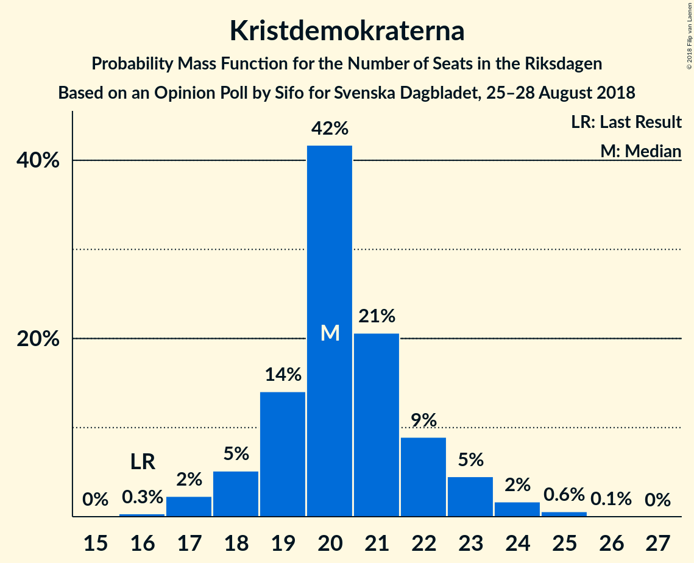
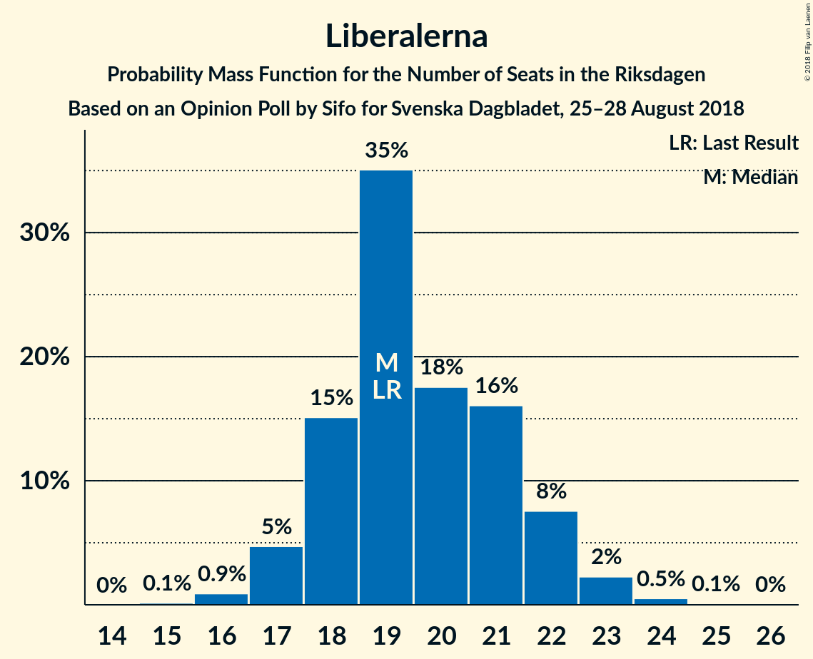

# Opinion Poll by Sifo for Svenska Dagbladet, 25–28 August 2018

<a href="#voting-intentions">Voting Intentions</a> | <a href="#seats">Seats</a> | <a href="#coalitions">Coalitions</a> | <a href="#technical-information">Technical Information</a>

## Voting Intentions

### Confidence Intervals

| Party | Last Result | Poll Result | 80% Confidence Interval | 90% Confidence Interval | 95% Confidence Interval | 99% Confidence Interval |
|:-----:|:-----------:|:-----------:|:-----------------------:|:-----------------------:|:-----------------------:|:-----------------------:|
| Sveriges socialdemokratiska arbetareparti | 31.0% | 25.2% | 24.2–26.3% |23.9–26.6% |23.7–26.8% |23.2–27.3% |
| Sverigedemokraterna | 12.9% | 19.2% | 18.3–20.2% |18.0–20.4% |17.8–20.7% |17.4–21.1% |
| Moderata samlingspartiet | 23.3% | 17.6% | 16.7–18.5% |16.5–18.8% |16.2–19.0% |15.8–19.5% |
| Vänsterpartiet | 5.7% | 10.5% | 9.8–11.2% |9.6–11.5% |9.4–11.7% |9.1–12.0% |
| Centerpartiet | 6.1% | 8.9% | 8.3–9.6% |8.1–9.8% |7.9–10.0% |7.6–10.4% |
| Kristdemokraterna | 4.6% | 5.7% | 5.2–6.3% |5.0–6.5% |4.9–6.6% |4.7–6.9% |
| Liberalerna | 5.4% | 5.5% | 5.0–6.1% |4.8–6.2% |4.7–6.4% |4.5–6.7% |
| Miljöpartiet de gröna | 6.9% | 5.2% | 4.7–5.8% |4.6–5.9% |4.4–6.1% |4.2–6.3% |
| Feministiskt initiativ | 3.1% | 1.0% | 0.8–1.3% |0.7–1.4% |0.7–1.4% |0.6–1.6% |

*Note:* The poll result column reflects the actual value used in the calculations. Published results may vary slightly, and in addition be rounded to fewer digits.

## Seats

### Confidence Intervals

| Party | Last Result | Median | 80% Confidence Interval | 90% Confidence Interval | 95% Confidence Interval | 99% Confidence Interval |
|:-----:|:-----------:|:------:|:-----------------------:|:-----------------------:|:-----------------------:|:-----------------------:|
| <a href="#sveriges-socialdemokratiska-arbetareparti">Sveriges socialdemokratiska arbetareparti</a> | 113 | 89 | 89 |82–89 |82–89 |82–89 |
| <a href="#sverigedemokraterna">Sverigedemokraterna</a> | 49 | 70 | 70 |70–71 |70–71 |70–71 |
| <a href="#moderata-samlingspartiet">Moderata samlingspartiet</a> | 84 | 57 | 57 |57–65 |57–65 |57–65 |
| <a href="#vänsterpartiet">Vänsterpartiet</a> | 21 | 39 | 39 |35–39 |35–39 |35–39 |
| <a href="#centerpartiet">Centerpartiet</a> | 22 | 30 | 30 |30–34 |30–34 |30–34 |
| <a href="#kristdemokraterna">Kristdemokraterna</a> | 16 | 23 | 23 |23–24 |23–24 |21–24 |
| <a href="#liberalerna">Liberalerna</a> | 19 | 20 | 20 |18–20 |18–20 |18–20 |
| <a href="#miljöpartiet-de-gröna">Miljöpartiet de gröna</a> | 25 | 21 | 21 |20–21 |20–21 |17–21 |
| <a href="#feministiskt-initiativ">Feministiskt initiativ</a> | 0 | 0 | 0 |0 |0 |0 |

### Sveriges socialdemokratiska arbetareparti

*For a full overview of the results for this party, see the [Sveriges socialdemokratiska arbetareparti](party-sverigessocialdemokratiskaarbetareparti.html) page.*

| Number of Seats | Probability | Accumulated | Special Marks |
|:---------------:|:-----------:|:-----------:|:-------------:|
| 82 | 6% | 100% |  |
| 83 | 0% | 94% |  |
| 84 | 0% | 94% |  |
| 85 | 0% | 94% |  |
| 86 | 0% | 94% |  |
| 87 | 0.4% | 94% |  |
| 88 | 0% | 93% |  |
| 89 | 93% | 93% | Median |
| 90 | 0% | 0.3% |  |
| 91 | 0% | 0.3% |  |
| 92 | 0.1% | 0.3% |  |
| 93 | 0% | 0.2% |  |
| 94 | 0.1% | 0.2% |  |
| 95 | 0% | 0.1% |  |
| 96 | 0% | 0.1% |  |
| 97 | 0% | 0% |  |
| 98 | 0% | 0% |  |
| 99 | 0% | 0% |  |
| 100 | 0% | 0% |  |
| 101 | 0% | 0% |  |
| 102 | 0% | 0% |  |
| 103 | 0% | 0% |  |
| 104 | 0% | 0% |  |
| 105 | 0% | 0% |  |
| 106 | 0% | 0% |  |
| 107 | 0% | 0% |  |
| 108 | 0% | 0% |  |
| 109 | 0% | 0% |  |
| 110 | 0% | 0% |  |
| 111 | 0% | 0% |  |
| 112 | 0% | 0% |  |
| 113 | 0% | 0% | Last Result |

### Sverigedemokraterna

*For a full overview of the results for this party, see the [Sverigedemokraterna](party-sverigedemokraterna.html) page.*

| Number of Seats | Probability | Accumulated | Special Marks |
|:---------------:|:-----------:|:-----------:|:-------------:|
| 49 | 0% | 100% | Last Result |
| 50 | 0% | 100% |  |
| 51 | 0% | 100% |  |
| 52 | 0% | 100% |  |
| 53 | 0% | 100% |  |
| 54 | 0% | 100% |  |
| 55 | 0% | 100% |  |
| 56 | 0% | 100% |  |
| 57 | 0% | 100% |  |
| 58 | 0% | 100% |  |
| 59 | 0% | 100% |  |
| 60 | 0% | 100% |  |
| 61 | 0% | 100% |  |
| 62 | 0% | 100% |  |
| 63 | 0% | 100% |  |
| 64 | 0% | 100% |  |
| 65 | 0.1% | 100% |  |
| 66 | 0% | 99.8% |  |
| 67 | 0% | 99.8% |  |
| 68 | 0% | 99.8% |  |
| 69 | 0% | 99.8% |  |
| 70 | 93% | 99.8% | Median |
| 71 | 6% | 7% |  |
| 72 | 0.1% | 0.5% |  |
| 73 | 0% | 0.4% |  |
| 74 | 0% | 0.4% |  |
| 75 | 0.1% | 0.4% |  |
| 76 | 0% | 0.3% |  |
| 77 | 0% | 0.3% |  |
| 78 | 0% | 0.3% |  |
| 79 | 0.3% | 0.3% |  |
| 80 | 0% | 0% |  |

### Moderata samlingspartiet

*For a full overview of the results for this party, see the [Moderata samlingspartiet](party-moderatasamlingspartiet.html) page.*

| Number of Seats | Probability | Accumulated | Special Marks |
|:---------------:|:-----------:|:-----------:|:-------------:|
| 53 | 0.1% | 100% |  |
| 54 | 0% | 99.9% |  |
| 55 | 0% | 99.9% |  |
| 56 | 0% | 99.9% |  |
| 57 | 93% | 99.9% | Median |
| 58 | 0% | 7% |  |
| 59 | 0% | 7% |  |
| 60 | 0% | 7% |  |
| 61 | 0.1% | 7% |  |
| 62 | 0% | 7% |  |
| 63 | 0% | 7% |  |
| 64 | 0.4% | 7% |  |
| 65 | 6% | 6% |  |
| 66 | 0% | 0% |  |
| 67 | 0% | 0% |  |
| 68 | 0% | 0% |  |
| 69 | 0% | 0% |  |
| 70 | 0% | 0% |  |
| 71 | 0% | 0% |  |
| 72 | 0% | 0% |  |
| 73 | 0% | 0% |  |
| 74 | 0% | 0% |  |
| 75 | 0% | 0% |  |
| 76 | 0% | 0% |  |
| 77 | 0% | 0% |  |
| 78 | 0% | 0% |  |
| 79 | 0% | 0% |  |
| 80 | 0% | 0% |  |
| 81 | 0% | 0% |  |
| 82 | 0% | 0% |  |
| 83 | 0% | 0% |  |
| 84 | 0% | 0% | Last Result |

### Vänsterpartiet

*For a full overview of the results for this party, see the [Vänsterpartiet](party-vänsterpartiet.html) page.*

| Number of Seats | Probability | Accumulated | Special Marks |
|:---------------:|:-----------:|:-----------:|:-------------:|
| 21 | 0% | 100% | Last Result |
| 22 | 0% | 100% |  |
| 23 | 0% | 100% |  |
| 24 | 0% | 100% |  |
| 25 | 0% | 100% |  |
| 26 | 0% | 100% |  |
| 27 | 0% | 100% |  |
| 28 | 0% | 100% |  |
| 29 | 0% | 100% |  |
| 30 | 0% | 100% |  |
| 31 | 0% | 100% |  |
| 32 | 0% | 100% |  |
| 33 | 0.3% | 100% |  |
| 34 | 0% | 99.7% |  |
| 35 | 6% | 99.7% |  |
| 36 | 0.2% | 93% |  |
| 37 | 0% | 93% |  |
| 38 | 0% | 93% |  |
| 39 | 93% | 93% | Median |
| 40 | 0.1% | 0.2% |  |
| 41 | 0% | 0% |  |

### Centerpartiet

*For a full overview of the results for this party, see the [Centerpartiet](party-centerpartiet.html) page.*

| Number of Seats | Probability | Accumulated | Special Marks |
|:---------------:|:-----------:|:-----------:|:-------------:|
| 22 | 0% | 100% | Last Result |
| 23 | 0% | 100% |  |
| 24 | 0% | 100% |  |
| 25 | 0% | 100% |  |
| 26 | 0% | 100% |  |
| 27 | 0% | 100% |  |
| 28 | 0% | 100% |  |
| 29 | 0% | 100% |  |
| 30 | 93% | 100% | Median |
| 31 | 0.3% | 7% |  |
| 32 | 0% | 7% |  |
| 33 | 0.1% | 7% |  |
| 34 | 6% | 6% |  |
| 35 | 0% | 0.2% |  |
| 36 | 0.2% | 0.2% |  |
| 37 | 0% | 0% |  |

### Kristdemokraterna

*For a full overview of the results for this party, see the [Kristdemokraterna](party-kristdemokraterna.html) page.*

| Number of Seats | Probability | Accumulated | Special Marks |
|:---------------:|:-----------:|:-----------:|:-------------:|
| 16 | 0% | 100% | Last Result |
| 17 | 0% | 100% |  |
| 18 | 0% | 100% |  |
| 19 | 0.3% | 100% |  |
| 20 | 0.1% | 99.7% |  |
| 21 | 0.1% | 99.6% |  |
| 22 | 0% | 99.5% |  |
| 23 | 93% | 99.5% | Median |
| 24 | 6% | 6% |  |
| 25 | 0.1% | 0.1% |  |
| 26 | 0% | 0% |  |

### Liberalerna

*For a full overview of the results for this party, see the [Liberalerna](party-liberalerna.html) page.*

| Number of Seats | Probability | Accumulated | Special Marks |
|:---------------:|:-----------:|:-----------:|:-------------:|
| 16 | 0.2% | 100% |  |
| 17 | 0% | 99.8% |  |
| 18 | 6% | 99.8% |  |
| 19 | 0.4% | 93% | Last Result |
| 20 | 93% | 93% | Median |
| 21 | 0% | 0% |  |

### Miljöpartiet de gröna

*For a full overview of the results for this party, see the [Miljöpartiet de gröna](party-miljöpartietdegröna.html) page.*

| Number of Seats | Probability | Accumulated | Special Marks |
|:---------------:|:-----------:|:-----------:|:-------------:|
| 16 | 0.2% | 100% |  |
| 17 | 0.3% | 99.8% |  |
| 18 | 0.1% | 99.5% |  |
| 19 | 0% | 99.4% |  |
| 20 | 6% | 99.3% |  |
| 21 | 93% | 93% | Median |
| 22 | 0% | 0% |  |
| 23 | 0% | 0% |  |
| 24 | 0% | 0% |  |
| 25 | 0% | 0% | Last Result |

### Feministiskt initiativ

*For a full overview of the results for this party, see the [Feministiskt initiativ](party-feministisktinitiativ.html) page.*

| Number of Seats | Probability | Accumulated | Special Marks |
|:---------------:|:-----------:|:-----------:|:-------------:|
| 0 | 100% | 100% | Last Result, Median |

## Coalitions

### Confidence Intervals

| Coalition | Last Result | Median | Majority? | 80% Confidence Interval | 90% Confidence Interval | 95% Confidence Interval | 99% Confidence Interval |
|:---------:|:-----------:|:------:|:---------:|:-----------------------:|:-----------------------:|:-----------------------:|:-----------------------:|
| Sveriges socialdemokratiska arbetareparti – Moderata samlingspartiet – Centerpartiet | 219 | 176 | 100% | 176 | 176–181 | 176–181 | 176–182 |
| Sverigedemokraterna – Moderata samlingspartiet – Kristdemokraterna | 149 | 150 | 0% | 150 | 150–160 | 150–160 | 150–160 |
| Sveriges socialdemokratiska arbetareparti – Vänsterpartiet – Miljöpartiet de gröna – Feministiskt initiativ | 159 | 149 | 0% | 149 | 137–149 | 137–149 | 137–149 |
| Sveriges socialdemokratiska arbetareparti – Vänsterpartiet – Miljöpartiet de gröna | 159 | 149 | 0% | 149 | 137–149 | 137–149 | 137–149 |
| Sveriges socialdemokratiska arbetareparti – Moderata samlingspartiet | 197 | 146 | 0% | 146 | 146–147 | 146–147 | 146–151 |
| Moderata samlingspartiet – Centerpartiet – Kristdemokraterna – Liberalerna | 141 | 130 | 0% | 130 | 130–141 | 130–141 | 130–141 |
| Sverigedemokraterna – Moderata samlingspartiet | 133 | 127 | 0% | 127 | 127–136 | 127–136 | 127–136 |
| Sveriges socialdemokratiska arbetareparti – Vänsterpartiet | 134 | 128 | 0% | 128 | 117–128 | 117–128 | 117–128 |
| Moderata samlingspartiet – Centerpartiet – Kristdemokraterna | 122 | 110 | 0% | 110 | 110–123 | 110–123 | 110–123 |
| Moderata samlingspartiet – Centerpartiet – Liberalerna | 125 | 107 | 0% | 107 | 107–117 | 107–117 | 107–117 |
| Sveriges socialdemokratiska arbetareparti – Miljöpartiet de gröna | 138 | 110 | 0% | 110 | 102–110 | 102–110 | 102–110 |
| Moderata samlingspartiet – Centerpartiet | 106 | 87 | 0% | 87 | 87–99 | 87–99 | 87–99 |

### Sveriges socialdemokratiska arbetareparti – Moderata samlingspartiet – Centerpartiet

| Number of Seats | Probability | Accumulated | Special Marks |
|:---------------:|:-----------:|:-----------:|:-------------:|
| 176 | 93% | 100% | Median |
| 177 | 0% | 7% |  |
| 178 | 0% | 7% |  |
| 179 | 0% | 7% |  |
| 180 | 0% | 7% |  |
| 181 | 6% | 7% |  |
| 182 | 0.3% | 0.6% |  |
| 183 | 0% | 0.3% |  |
| 184 | 0.1% | 0.3% |  |
| 185 | 0% | 0.2% |  |
| 186 | 0% | 0.2% |  |
| 187 | 0% | 0.2% |  |
| 188 | 0% | 0.2% |  |
| 189 | 0% | 0.2% |  |
| 190 | 0% | 0.2% |  |
| 191 | 0.1% | 0.2% |  |
| 192 | 0% | 0% |  |
| 193 | 0% | 0% |  |
| 194 | 0% | 0% |  |
| 195 | 0% | 0% |  |
| 196 | 0% | 0% |  |
| 197 | 0% | 0% |  |
| 198 | 0% | 0% |  |
| 199 | 0% | 0% |  |
| 200 | 0% | 0% |  |
| 201 | 0% | 0% |  |
| 202 | 0% | 0% |  |
| 203 | 0% | 0% |  |
| 204 | 0% | 0% |  |
| 205 | 0% | 0% |  |
| 206 | 0% | 0% |  |
| 207 | 0% | 0% |  |
| 208 | 0% | 0% |  |
| 209 | 0% | 0% |  |
| 210 | 0% | 0% |  |
| 211 | 0% | 0% |  |
| 212 | 0% | 0% |  |
| 213 | 0% | 0% |  |
| 214 | 0% | 0% |  |
| 215 | 0% | 0% |  |
| 216 | 0% | 0% |  |
| 217 | 0% | 0% |  |
| 218 | 0% | 0% |  |
| 219 | 0% | 0% | Last Result |

### Sverigedemokraterna – Moderata samlingspartiet – Kristdemokraterna

| Number of Seats | Probability | Accumulated | Special Marks |
|:---------------:|:-----------:|:-----------:|:-------------:|
| 147 | 0.1% | 100% |  |
| 148 | 0.1% | 99.9% |  |
| 149 | 0% | 99.8% | Last Result |
| 150 | 93% | 99.8% | Median |
| 151 | 0% | 7% |  |
| 152 | 0% | 7% |  |
| 153 | 0% | 7% |  |
| 154 | 0% | 7% |  |
| 155 | 0% | 7% |  |
| 156 | 0% | 7% |  |
| 157 | 0% | 7% |  |
| 158 | 0% | 7% |  |
| 159 | 0% | 7% |  |
| 160 | 6% | 7% |  |
| 161 | 0.1% | 0.4% |  |
| 162 | 0.3% | 0.3% |  |
| 163 | 0% | 0% |  |

### Sveriges socialdemokratiska arbetareparti – Vänsterpartiet – Miljöpartiet de gröna – Feministiskt initiativ

| Number of Seats | Probability | Accumulated | Special Marks |
|:---------------:|:-----------:|:-----------:|:-------------:|
| 137 | 7% | 100% |  |
| 138 | 0% | 93% |  |
| 139 | 0.1% | 93% |  |
| 140 | 0% | 93% |  |
| 141 | 0% | 93% |  |
| 142 | 0% | 93% |  |
| 143 | 0% | 93% |  |
| 144 | 0% | 93% |  |
| 145 | 0% | 93% |  |
| 146 | 0.1% | 93% |  |
| 147 | 0% | 93% |  |
| 148 | 0% | 93% |  |
| 149 | 93% | 93% | Median |
| 150 | 0.1% | 0.2% |  |
| 151 | 0% | 0.1% |  |
| 152 | 0% | 0% |  |
| 153 | 0% | 0% |  |
| 154 | 0% | 0% |  |
| 155 | 0% | 0% |  |
| 156 | 0% | 0% |  |
| 157 | 0% | 0% |  |
| 158 | 0% | 0% |  |
| 159 | 0% | 0% | Last Result |

### Sveriges socialdemokratiska arbetareparti – Vänsterpartiet – Miljöpartiet de gröna

| Number of Seats | Probability | Accumulated | Special Marks |
|:---------------:|:-----------:|:-----------:|:-------------:|
| 137 | 7% | 100% |  |
| 138 | 0% | 93% |  |
| 139 | 0.1% | 93% |  |
| 140 | 0% | 93% |  |
| 141 | 0% | 93% |  |
| 142 | 0% | 93% |  |
| 143 | 0% | 93% |  |
| 144 | 0% | 93% |  |
| 145 | 0% | 93% |  |
| 146 | 0.1% | 93% |  |
| 147 | 0% | 93% |  |
| 148 | 0% | 93% |  |
| 149 | 93% | 93% | Median |
| 150 | 0.1% | 0.2% |  |
| 151 | 0% | 0.1% |  |
| 152 | 0% | 0% |  |
| 153 | 0% | 0% |  |
| 154 | 0% | 0% |  |
| 155 | 0% | 0% |  |
| 156 | 0% | 0% |  |
| 157 | 0% | 0% |  |
| 158 | 0% | 0% |  |
| 159 | 0% | 0% | Last Result |

### Sveriges socialdemokratiska arbetareparti – Moderata samlingspartiet

| Number of Seats | Probability | Accumulated | Special Marks |
|:---------------:|:-----------:|:-----------:|:-------------:|
| 145 | 0.1% | 100% |  |
| 146 | 93% | 99.9% | Median |
| 147 | 6% | 7% |  |
| 148 | 0% | 0.6% |  |
| 149 | 0% | 0.6% |  |
| 150 | 0% | 0.6% |  |
| 151 | 0.4% | 0.6% |  |
| 152 | 0% | 0.2% |  |
| 153 | 0% | 0.2% |  |
| 154 | 0% | 0.2% |  |
| 155 | 0.1% | 0.2% |  |
| 156 | 0% | 0.1% |  |
| 157 | 0% | 0.1% |  |
| 158 | 0% | 0.1% |  |
| 159 | 0% | 0% |  |
| 160 | 0% | 0% |  |
| 161 | 0% | 0% |  |
| 162 | 0% | 0% |  |
| 163 | 0% | 0% |  |
| 164 | 0% | 0% |  |
| 165 | 0% | 0% |  |
| 166 | 0% | 0% |  |
| 167 | 0% | 0% |  |
| 168 | 0% | 0% |  |
| 169 | 0% | 0% |  |
| 170 | 0% | 0% |  |
| 171 | 0% | 0% |  |
| 172 | 0% | 0% |  |
| 173 | 0% | 0% |  |
| 174 | 0% | 0% |  |
| 175 | 0% | 0% | Majority |
| 176 | 0% | 0% |  |
| 177 | 0% | 0% |  |
| 178 | 0% | 0% |  |
| 179 | 0% | 0% |  |
| 180 | 0% | 0% |  |
| 181 | 0% | 0% |  |
| 182 | 0% | 0% |  |
| 183 | 0% | 0% |  |
| 184 | 0% | 0% |  |
| 185 | 0% | 0% |  |
| 186 | 0% | 0% |  |
| 187 | 0% | 0% |  |
| 188 | 0% | 0% |  |
| 189 | 0% | 0% |  |
| 190 | 0% | 0% |  |
| 191 | 0% | 0% |  |
| 192 | 0% | 0% |  |
| 193 | 0% | 0% |  |
| 194 | 0% | 0% |  |
| 195 | 0% | 0% |  |
| 196 | 0% | 0% |  |
| 197 | 0% | 0% | Last Result |

### Moderata samlingspartiet – Centerpartiet – Kristdemokraterna – Liberalerna

| Number of Seats | Probability | Accumulated | Special Marks |
|:---------------:|:-----------:|:-----------:|:-------------:|
| 128 | 0.1% | 100% |  |
| 129 | 0% | 99.9% |  |
| 130 | 93% | 99.9% | Median |
| 131 | 0% | 7% |  |
| 132 | 0% | 7% |  |
| 133 | 0.3% | 7% |  |
| 134 | 0.1% | 7% |  |
| 135 | 0% | 6% |  |
| 136 | 0% | 6% |  |
| 137 | 0% | 6% |  |
| 138 | 0.1% | 6% |  |
| 139 | 0% | 6% |  |
| 140 | 0% | 6% |  |
| 141 | 6% | 6% | Last Result |
| 142 | 0% | 0% |  |

### Sverigedemokraterna – Moderata samlingspartiet

| Number of Seats | Probability | Accumulated | Special Marks |
|:---------------:|:-----------:|:-----------:|:-------------:|
| 126 | 0.1% | 100% |  |
| 127 | 93% | 99.9% | Median |
| 128 | 0.1% | 7% |  |
| 129 | 0% | 7% |  |
| 130 | 0% | 7% |  |
| 131 | 0% | 7% |  |
| 132 | 0% | 7% |  |
| 133 | 0% | 7% | Last Result |
| 134 | 0% | 7% |  |
| 135 | 0% | 7% |  |
| 136 | 6% | 7% |  |
| 137 | 0% | 0.3% |  |
| 138 | 0% | 0.3% |  |
| 139 | 0% | 0.3% |  |
| 140 | 0% | 0.3% |  |
| 141 | 0% | 0.3% |  |
| 142 | 0% | 0.3% |  |
| 143 | 0.3% | 0.3% |  |
| 144 | 0% | 0% |  |

### Sveriges socialdemokratiska arbetareparti – Vänsterpartiet

| Number of Seats | Probability | Accumulated | Special Marks |
|:---------------:|:-----------:|:-----------:|:-------------:|
| 117 | 6% | 100% |  |
| 118 | 0% | 94% |  |
| 119 | 0% | 94% |  |
| 120 | 0.3% | 94% |  |
| 121 | 0% | 93% |  |
| 122 | 0% | 93% |  |
| 123 | 0.1% | 93% |  |
| 124 | 0% | 93% |  |
| 125 | 0% | 93% |  |
| 126 | 0% | 93% |  |
| 127 | 0% | 93% |  |
| 128 | 93% | 93% | Median |
| 129 | 0% | 0.2% |  |
| 130 | 0% | 0.2% |  |
| 131 | 0% | 0.2% |  |
| 132 | 0% | 0.2% |  |
| 133 | 0% | 0.2% |  |
| 134 | 0.1% | 0.2% | Last Result |
| 135 | 0% | 0% |  |

### Moderata samlingspartiet – Centerpartiet – Kristdemokraterna

| Number of Seats | Probability | Accumulated | Special Marks |
|:---------------:|:-----------:|:-----------:|:-------------:|
| 109 | 0.1% | 100% |  |
| 110 | 93% | 99.9% | Median |
| 111 | 0% | 7% |  |
| 112 | 0% | 7% |  |
| 113 | 0% | 7% |  |
| 114 | 0.3% | 7% |  |
| 115 | 0% | 7% |  |
| 116 | 0% | 7% |  |
| 117 | 0% | 7% |  |
| 118 | 0.1% | 7% |  |
| 119 | 0% | 6% |  |
| 120 | 0% | 6% |  |
| 121 | 0% | 6% |  |
| 122 | 0.1% | 6% | Last Result |
| 123 | 6% | 6% |  |
| 124 | 0% | 0% |  |

### Moderata samlingspartiet – Centerpartiet – Liberalerna

| Number of Seats | Probability | Accumulated | Special Marks |
|:---------------:|:-----------:|:-----------:|:-------------:|
| 107 | 93% | 100% | Median |
| 108 | 0.1% | 7% |  |
| 109 | 0% | 7% |  |
| 110 | 0% | 7% |  |
| 111 | 0% | 7% |  |
| 112 | 0% | 7% |  |
| 113 | 0.2% | 7% |  |
| 114 | 0.3% | 7% |  |
| 115 | 0% | 6% |  |
| 116 | 0% | 6% |  |
| 117 | 6% | 6% |  |
| 118 | 0% | 0% |  |
| 119 | 0% | 0% |  |
| 120 | 0% | 0% |  |
| 121 | 0% | 0% |  |
| 122 | 0% | 0% |  |
| 123 | 0% | 0% |  |
| 124 | 0% | 0% |  |
| 125 | 0% | 0% | Last Result |

### Sveriges socialdemokratiska arbetareparti – Miljöpartiet de gröna

| Number of Seats | Probability | Accumulated | Special Marks |
|:---------------:|:-----------:|:-----------:|:-------------:|
| 102 | 6% | 100% |  |
| 103 | 0.1% | 94% |  |
| 104 | 0.3% | 94% |  |
| 105 | 0% | 93% |  |
| 106 | 0% | 93% |  |
| 107 | 0% | 93% |  |
| 108 | 0% | 93% |  |
| 109 | 0% | 93% |  |
| 110 | 93% | 93% | Median |
| 111 | 0% | 0.1% |  |
| 112 | 0% | 0% |  |
| 113 | 0% | 0% |  |
| 114 | 0% | 0% |  |
| 115 | 0% | 0% |  |
| 116 | 0% | 0% |  |
| 117 | 0% | 0% |  |
| 118 | 0% | 0% |  |
| 119 | 0% | 0% |  |
| 120 | 0% | 0% |  |
| 121 | 0% | 0% |  |
| 122 | 0% | 0% |  |
| 123 | 0% | 0% |  |
| 124 | 0% | 0% |  |
| 125 | 0% | 0% |  |
| 126 | 0% | 0% |  |
| 127 | 0% | 0% |  |
| 128 | 0% | 0% |  |
| 129 | 0% | 0% |  |
| 130 | 0% | 0% |  |
| 131 | 0% | 0% |  |
| 132 | 0% | 0% |  |
| 133 | 0% | 0% |  |
| 134 | 0% | 0% |  |
| 135 | 0% | 0% |  |
| 136 | 0% | 0% |  |
| 137 | 0% | 0% |  |
| 138 | 0% | 0% | Last Result |

### Moderata samlingspartiet – Centerpartiet

| Number of Seats | Probability | Accumulated | Special Marks |
|:---------------:|:-----------:|:-----------:|:-------------:|
| 87 | 93% | 100% | Median |
| 88 | 0% | 7% |  |
| 89 | 0.1% | 7% |  |
| 90 | 0% | 7% |  |
| 91 | 0% | 7% |  |
| 92 | 0% | 7% |  |
| 93 | 0% | 7% |  |
| 94 | 0% | 7% |  |
| 95 | 0.3% | 7% |  |
| 96 | 0% | 6% |  |
| 97 | 0.2% | 6% |  |
| 98 | 0% | 6% |  |
| 99 | 6% | 6% |  |
| 100 | 0% | 0% |  |
| 101 | 0% | 0% |  |
| 102 | 0% | 0% |  |
| 103 | 0% | 0% |  |
| 104 | 0% | 0% |  |
| 105 | 0% | 0% |  |
| 106 | 0% | 0% | Last Result |

## Technical Information

### Opinion Poll

+ **Polling firm:** Sifo
+ **Commissioner(s):** Svenska Dagbladet
+ **Fieldwork period:** 25–28 August 2018

### Calculations

+ **Sample size:** 2928
+ **Simulations done:** 1,024
+ **Error estimate:** 2.55%

