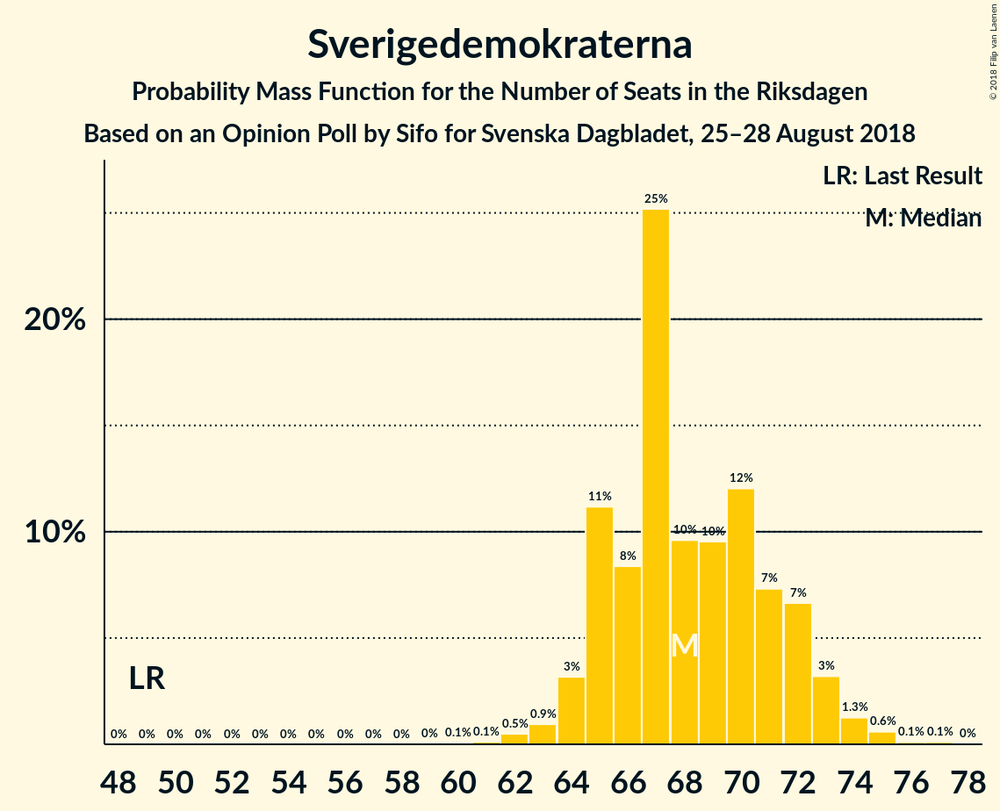
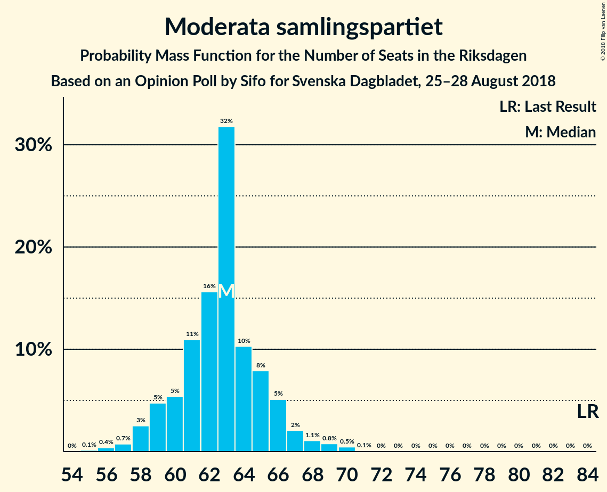

# Opinion Poll by Sifo for Svenska Dagbladet, 25–28 August 2018

<a href="#voting-intentions">Voting Intentions</a> | <a href="#seats">Seats</a> | <a href="#coalitions">Coalitions</a> | <a href="#technical-information">Technical Information</a>

## Voting Intentions

### Confidence Intervals

| Party | Last Result | Poll Result | 80% Confidence Interval | 90% Confidence Interval | 95% Confidence Interval | 99% Confidence Interval |
|:-----:|:-----------:|:-----------:|:-----------------------:|:-----------------------:|:-----------------------:|:-----------------------:|
| Sveriges socialdemokratiska arbetareparti | 31.0% | 25.2% | 24.2–26.3% |23.9–26.6% |23.7–26.8% |23.2–27.3% |
| Sverigedemokraterna | 12.9% | 19.2% | 18.3–20.2% |18.0–20.4% |17.8–20.7% |17.4–21.1% |
| Moderata samlingspartiet | 23.3% | 17.6% | 16.7–18.5% |16.5–18.8% |16.2–19.0% |15.8–19.5% |
| Vänsterpartiet | 5.7% | 10.5% | 9.8–11.2% |9.6–11.5% |9.4–11.7% |9.1–12.0% |
| Centerpartiet | 6.1% | 8.9% | 8.3–9.6% |8.1–9.8% |7.9–10.0% |7.6–10.4% |
| Kristdemokraterna | 4.6% | 5.7% | 5.2–6.3% |5.0–6.5% |4.9–6.6% |4.7–6.9% |
| Liberalerna | 5.4% | 5.5% | 5.0–6.1% |4.8–6.2% |4.7–6.4% |4.5–6.7% |
| Miljöpartiet de gröna | 6.9% | 5.2% | 4.7–5.8% |4.6–5.9% |4.4–6.1% |4.2–6.3% |
| Feministiskt initiativ | 3.1% | 1.0% | 0.8–1.3% |0.7–1.4% |0.7–1.4% |0.6–1.6% |

*Note:* The poll result column reflects the actual value used in the calculations. Published results may vary slightly, and in addition be rounded to fewer digits.

## Seats

### Confidence Intervals

| Party | Last Result | Median | 80% Confidence Interval | 90% Confidence Interval | 95% Confidence Interval | 99% Confidence Interval |
|:-----:|:-----------:|:------:|:-----------------------:|:-----------------------:|:-----------------------:|:-----------------------:|
| <a href="#sveriges-socialdemokratiska-arbetareparti">Sveriges socialdemokratiska arbetareparti</a> | 113 | 90 | 86–94 |85–95 |84–95 |83–97 |
| <a href="#sverigedemokraterna">Sverigedemokraterna</a> | 49 | 68 | 65–72 |65–73 |64–73 |62–75 |
| <a href="#moderata-samlingspartiet">Moderata samlingspartiet</a> | 84 | 63 | 60–65 |59–66 |58–67 |56–70 |
| <a href="#vänsterpartiet">Vänsterpartiet</a> | 21 | 37 | 35–40 |34–41 |34–41 |32–43 |
| <a href="#centerpartiet">Centerpartiet</a> | 22 | 32 | 29–34 |29–35 |28–35 |27–37 |
| <a href="#kristdemokraterna">Kristdemokraterna</a> | 16 | 20 | 19–22 |18–23 |17–23 |17–25 |
| <a href="#liberalerna">Liberalerna</a> | 19 | 19 | 18–22 |17–22 |17–23 |16–24 |
| <a href="#miljöpartiet-de-gröna">Miljöpartiet de gröna</a> | 25 | 18 | 17–20 |16–21 |16–21 |15–23 |
| <a href="#feministiskt-initiativ">Feministiskt initiativ</a> | 0 | 0 | 0 |0 |0 |0 |

### Sveriges socialdemokratiska arbetareparti

*For a full overview of the results for this party, see the [Sveriges socialdemokratiska arbetareparti](party-sverigessocialdemokratiskaarbetareparti.html) page.*

| Number of Seats | Probability | Accumulated | Special Marks |
|:---------------:|:-----------:|:-----------:|:-------------:|
| 81 | 0.1% | 100% |  |
| 82 | 0.4% | 99.9% |  |
| 83 | 0.8% | 99.5% |  |
| 84 | 2% | 98.8% |  |
| 85 | 4% | 96% |  |
| 86 | 8% | 93% |  |
| 87 | 7% | 85% |  |
| 88 | 8% | 78% |  |
| 89 | 9% | 70% |  |
| 90 | 12% | 62% | Median |
| 91 | 5% | 50% |  |
| 92 | 6% | 44% |  |
| 93 | 28% | 38% |  |
| 94 | 4% | 10% |  |
| 95 | 4% | 6% |  |
| 96 | 0.8% | 2% |  |
| 97 | 0.5% | 1.0% |  |
| 98 | 0.2% | 0.4% |  |
| 99 | 0.1% | 0.2% |  |
| 100 | 0% | 0.1% |  |
| 101 | 0% | 0% |  |
| 102 | 0% | 0% |  |
| 103 | 0% | 0% |  |
| 104 | 0% | 0% |  |
| 105 | 0% | 0% |  |
| 106 | 0% | 0% |  |
| 107 | 0% | 0% |  |
| 108 | 0% | 0% |  |
| 109 | 0% | 0% |  |
| 110 | 0% | 0% |  |
| 111 | 0% | 0% |  |
| 112 | 0% | 0% |  |
| 113 | 0% | 0% | Last Result |

### Sverigedemokraterna

*For a full overview of the results for this party, see the [Sverigedemokraterna](party-sverigedemokraterna.html) page.*

| Number of Seats | Probability | Accumulated | Special Marks |
|:---------------:|:-----------:|:-----------:|:-------------:|
| 49 | 0% | 100% | Last Result |
| 50 | 0% | 100% |  |
| 51 | 0% | 100% |  |
| 52 | 0% | 100% |  |
| 53 | 0% | 100% |  |
| 54 | 0% | 100% |  |
| 55 | 0% | 100% |  |
| 56 | 0% | 100% |  |
| 57 | 0% | 100% |  |
| 58 | 0% | 100% |  |
| 59 | 0% | 100% |  |
| 60 | 0.1% | 100% |  |
| 61 | 0.1% | 99.9% |  |
| 62 | 0.5% | 99.8% |  |
| 63 | 0.9% | 99.3% |  |
| 64 | 3% | 98% |  |
| 65 | 11% | 95% |  |
| 66 | 8% | 84% |  |
| 67 | 25% | 76% |  |
| 68 | 10% | 50% | Median |
| 69 | 10% | 41% |  |
| 70 | 12% | 31% |  |
| 71 | 7% | 19% |  |
| 72 | 7% | 12% |  |
| 73 | 3% | 5% |  |
| 74 | 1.3% | 2% |  |
| 75 | 0.6% | 0.8% |  |
| 76 | 0.1% | 0.2% |  |
| 77 | 0.1% | 0.1% |  |
| 78 | 0% | 0% |  |

### Moderata samlingspartiet

*For a full overview of the results for this party, see the [Moderata samlingspartiet](party-moderatasamlingspartiet.html) page.*

| Number of Seats | Probability | Accumulated | Special Marks |
|:---------------:|:-----------:|:-----------:|:-------------:|
| 55 | 0.1% | 100% |  |
| 56 | 0.4% | 99.8% |  |
| 57 | 0.7% | 99.5% |  |
| 58 | 3% | 98.7% |  |
| 59 | 5% | 96% |  |
| 60 | 5% | 91% |  |
| 61 | 11% | 86% |  |
| 62 | 16% | 75% |  |
| 63 | 32% | 60% | Median |
| 64 | 10% | 28% |  |
| 65 | 8% | 17% |  |
| 66 | 5% | 10% |  |
| 67 | 2% | 4% |  |
| 68 | 1.1% | 2% |  |
| 69 | 0.8% | 1.3% |  |
| 70 | 0.5% | 0.6% |  |
| 71 | 0.1% | 0.1% |  |
| 72 | 0% | 0% |  |
| 73 | 0% | 0% |  |
| 74 | 0% | 0% |  |
| 75 | 0% | 0% |  |
| 76 | 0% | 0% |  |
| 77 | 0% | 0% |  |
| 78 | 0% | 0% |  |
| 79 | 0% | 0% |  |
| 80 | 0% | 0% |  |
| 81 | 0% | 0% |  |
| 82 | 0% | 0% |  |
| 83 | 0% | 0% |  |
| 84 | 0% | 0% | Last Result |

### Vänsterpartiet

*For a full overview of the results for this party, see the [Vänsterpartiet](party-vänsterpartiet.html) page.*

| Number of Seats | Probability | Accumulated | Special Marks |
|:---------------:|:-----------:|:-----------:|:-------------:|
| 21 | 0% | 100% | Last Result |
| 22 | 0% | 100% |  |
| 23 | 0% | 100% |  |
| 24 | 0% | 100% |  |
| 25 | 0% | 100% |  |
| 26 | 0% | 100% |  |
| 27 | 0% | 100% |  |
| 28 | 0% | 100% |  |
| 29 | 0% | 100% |  |
| 30 | 0% | 100% |  |
| 31 | 0% | 100% |  |
| 32 | 0.7% | 99.9% |  |
| 33 | 1.5% | 99.3% |  |
| 34 | 5% | 98% |  |
| 35 | 6% | 93% |  |
| 36 | 13% | 86% |  |
| 37 | 32% | 73% | Median |
| 38 | 12% | 41% |  |
| 39 | 16% | 29% |  |
| 40 | 6% | 13% |  |
| 41 | 5% | 7% |  |
| 42 | 1.3% | 2% |  |
| 43 | 0.4% | 0.7% |  |
| 44 | 0.3% | 0.3% |  |
| 45 | 0% | 0% |  |

### Centerpartiet

*For a full overview of the results for this party, see the [Centerpartiet](party-centerpartiet.html) page.*

| Number of Seats | Probability | Accumulated | Special Marks |
|:---------------:|:-----------:|:-----------:|:-------------:|
| 22 | 0% | 100% | Last Result |
| 23 | 0% | 100% |  |
| 24 | 0% | 100% |  |
| 25 | 0% | 100% |  |
| 26 | 0.1% | 100% |  |
| 27 | 0.4% | 99.9% |  |
| 28 | 2% | 99.4% |  |
| 29 | 8% | 97% |  |
| 30 | 9% | 89% |  |
| 31 | 12% | 81% |  |
| 32 | 34% | 69% | Median |
| 33 | 14% | 35% |  |
| 34 | 15% | 21% |  |
| 35 | 3% | 6% |  |
| 36 | 1.4% | 2% |  |
| 37 | 0.6% | 0.8% |  |
| 38 | 0.1% | 0.1% |  |
| 39 | 0% | 0% |  |

### Kristdemokraterna

*For a full overview of the results for this party, see the [Kristdemokraterna](party-kristdemokraterna.html) page.*

| Number of Seats | Probability | Accumulated | Special Marks |
|:---------------:|:-----------:|:-----------:|:-------------:|
| 16 | 0.3% | 100% | Last Result |
| 17 | 2% | 99.6% |  |
| 18 | 5% | 97% |  |
| 19 | 14% | 92% |  |
| 20 | 42% | 78% | Median |
| 21 | 21% | 36% |  |
| 22 | 9% | 16% |  |
| 23 | 5% | 7% |  |
| 24 | 2% | 2% |  |
| 25 | 0.6% | 0.7% |  |
| 26 | 0.1% | 0.1% |  |
| 27 | 0% | 0% |  |

### Liberalerna

*For a full overview of the results for this party, see the [Liberalerna](party-liberalerna.html) page.*

| Number of Seats | Probability | Accumulated | Special Marks |
|:---------------:|:-----------:|:-----------:|:-------------:|
| 15 | 0.1% | 100% |  |
| 16 | 0.9% | 99.8% |  |
| 17 | 5% | 98.9% |  |
| 18 | 15% | 94% |  |
| 19 | 35% | 79% | Last Result, Median |
| 20 | 18% | 44% |  |
| 21 | 16% | 27% |  |
| 22 | 8% | 10% |  |
| 23 | 2% | 3% |  |
| 24 | 0.5% | 0.6% |  |
| 25 | 0.1% | 0.1% |  |
| 26 | 0% | 0% |  |

### Miljöpartiet de gröna

*For a full overview of the results for this party, see the [Miljöpartiet de gröna](party-miljöpartietdegröna.html) page.*

| Number of Seats | Probability | Accumulated | Special Marks |
|:---------------:|:-----------:|:-----------:|:-------------:|
| 0 | 0.1% | 100% |  |
| 1 | 0% | 99.9% |  |
| 2 | 0% | 99.9% |  |
| 3 | 0% | 99.9% |  |
| 4 | 0% | 99.9% |  |
| 5 | 0% | 99.9% |  |
| 6 | 0% | 99.9% |  |
| 7 | 0% | 99.9% |  |
| 8 | 0% | 99.9% |  |
| 9 | 0% | 99.9% |  |
| 10 | 0% | 99.9% |  |
| 11 | 0% | 99.9% |  |
| 12 | 0% | 99.9% |  |
| 13 | 0% | 99.9% |  |
| 14 | 0% | 99.9% |  |
| 15 | 2% | 99.9% |  |
| 16 | 5% | 98% |  |
| 17 | 12% | 93% |  |
| 18 | 37% | 81% | Median |
| 19 | 18% | 44% |  |
| 20 | 17% | 26% |  |
| 21 | 6% | 9% |  |
| 22 | 2% | 2% |  |
| 23 | 0.6% | 0.6% |  |
| 24 | 0.1% | 0.1% |  |
| 25 | 0% | 0% | Last Result |

### Feministiskt initiativ

*For a full overview of the results for this party, see the [Feministiskt initiativ](party-feministisktinitiativ.html) page.*

| Number of Seats | Probability | Accumulated | Special Marks |
|:---------------:|:-----------:|:-----------:|:-------------:|
| 0 | 100% | 100% | Last Result, Median |

## Coalitions

### Confidence Intervals

| Coalition | Last Result | Median | Majority? | 80% Confidence Interval | 90% Confidence Interval | 95% Confidence Interval | 99% Confidence Interval |
|:---------:|:-----------:|:------:|:---------:|:-----------------------:|:-----------------------:|:-----------------------:|:-----------------------:|
| Sveriges socialdemokratiska arbetareparti – Moderata samlingspartiet – Centerpartiet | 219 | 185 | 99.9% | 180–189 | 179–190 | 178–191 | 176–193 |
| Sveriges socialdemokratiska arbetareparti – Moderata samlingspartiet | 197 | 153 | 0% | 148–157 | 147–158 | 146–159 | 144–161 |
| Sverigedemokraterna – Moderata samlingspartiet – Kristdemokraterna | 149 | 151 | 0% | 147–155 | 146–157 | 146–158 | 143–160 |
| Sveriges socialdemokratiska arbetareparti – Vänsterpartiet – Miljöpartiet de gröna – Feministiskt initiativ | 159 | 147 | 0% | 142–150 | 141–151 | 140–152 | 137–155 |
| Sveriges socialdemokratiska arbetareparti – Vänsterpartiet – Miljöpartiet de gröna | 159 | 147 | 0% | 142–150 | 141–151 | 140–152 | 137–155 |
| Moderata samlingspartiet – Centerpartiet – Kristdemokraterna – Liberalerna | 141 | 134 | 0% | 131–137 | 129–139 | 128–141 | 127–143 |
| Sverigedemokraterna – Moderata samlingspartiet | 133 | 130 | 0% | 127–135 | 126–136 | 125–137 | 123–140 |
| Sveriges socialdemokratiska arbetareparti – Vänsterpartiet | 134 | 129 | 0% | 123–131 | 123–132 | 121–133 | 119–135 |
| Moderata samlingspartiet – Centerpartiet – Kristdemokraterna | 122 | 115 | 0% | 111–118 | 110–120 | 108–121 | 107–123 |
| Moderata samlingspartiet – Centerpartiet – Liberalerna | 125 | 114 | 0% | 110–117 | 109–119 | 108–121 | 107–123 |
| Sveriges socialdemokratiska arbetareparti – Miljöpartiet de gröna | 138 | 109 | 0% | 105–113 | 103–114 | 103–114 | 100–116 |
| Moderata samlingspartiet – Centerpartiet | 106 | 95 | 0% | 91–97 | 89–98 | 88–101 | 87–102 |

