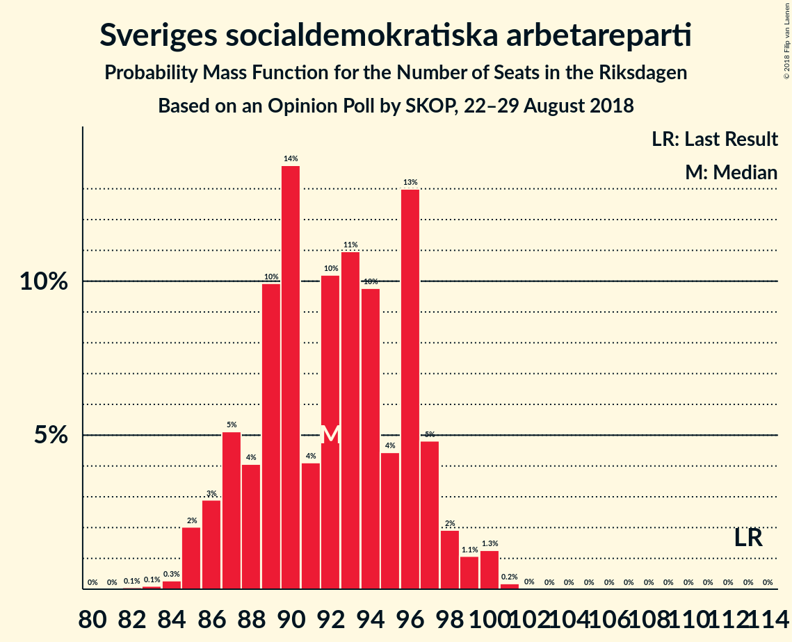
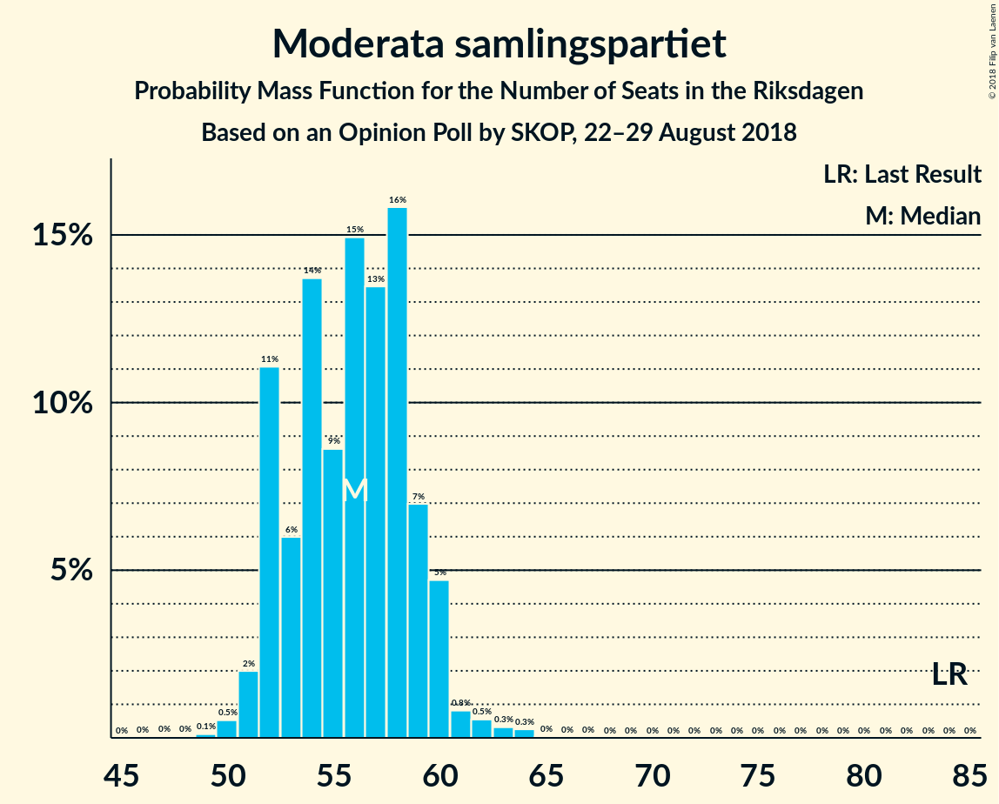
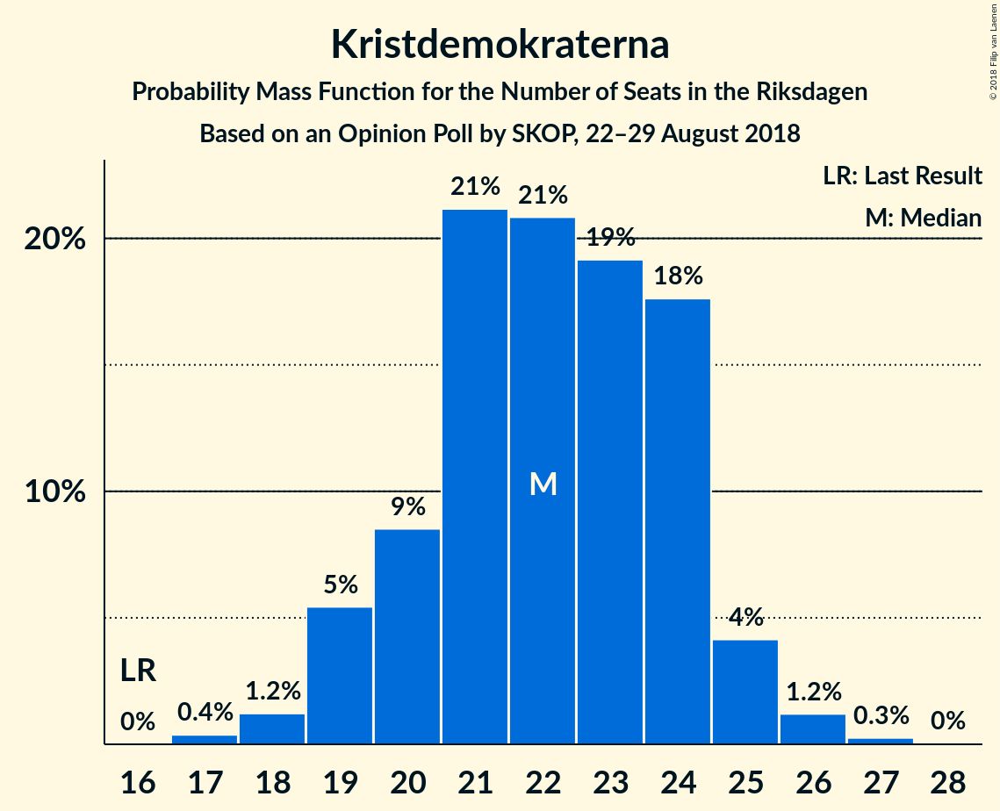

# Opinion Poll by SKOP, 22–29 August 2018

<a href="#voting-intentions">Voting Intentions</a> | <a href="#seats">Seats</a> | <a href="#coalitions">Coalitions</a> | <a href="#technical-information">Technical Information</a>

## Voting Intentions

### Confidence Intervals

| Party | Last Result | Poll Result | 80% Confidence Interval | 90% Confidence Interval | 95% Confidence Interval | 99% Confidence Interval |
|:-----:|:-----------:|:-----------:|:-----------------------:|:-----------------------:|:-----------------------:|:-----------------------:|
| Sveriges socialdemokratiska arbetareparti | 31.0% | 25.7% | 24.6–26.8% |24.4–27.1% |24.1–27.4% |23.6–27.9% |
| Sverigedemokraterna | 12.9% | 20.6% | 19.6–21.6% |19.3–21.9% |19.1–22.1% |18.6–22.6% |
| Moderata samlingspartiet | 23.3% | 15.7% | 14.8–16.6% |14.6–16.9% |14.4–17.1% |14.0–17.5% |
| Vänsterpartiet | 5.7% | 9.6% | 8.9–10.4% |8.7–10.6% |8.6–10.8% |8.3–11.2% |
| Centerpartiet | 6.1% | 8.1% | 7.5–8.8% |7.3–9.0% |7.1–9.2% |6.8–9.5% |
| Liberalerna | 5.4% | 6.3% | 5.7–6.9% |5.5–7.1% |5.4–7.2% |5.2–7.5% |
| Kristdemokraterna | 4.6% | 6.1% | 5.5–6.7% |5.4–6.9% |5.2–7.0% |5.0–7.3% |
| Miljöpartiet de gröna | 6.9% | 5.6% | 5.0–6.2% |4.9–6.4% |4.8–6.5% |4.5–6.8% |
| Feministiskt initiativ | 3.1% | 0.9% | 0.7–1.2% |0.7–1.3% |0.6–1.3% |0.5–1.5% |

*Note:* The poll result column reflects the actual value used in the calculations. Published results may vary slightly, and in addition be rounded to fewer digits.

## Seats

### Confidence Intervals

| Party | Last Result | Median | 80% Confidence Interval | 90% Confidence Interval | 95% Confidence Interval | 99% Confidence Interval |
|:-----:|:-----------:|:------:|:-----------------------:|:-----------------------:|:-----------------------:|:-----------------------:|
| <a href="#sveriges-socialdemokratiska-arbetareparti">Sveriges socialdemokratiska arbetareparti</a> | 113 | 92 | 87–96 |86–97 |86–99 |85–100 |
| <a href="#sverigedemokraterna">Sverigedemokraterna</a> | 49 | 73 | 70–76 |68–78 |68–79 |66–81 |
| <a href="#moderata-samlingspartiet">Moderata samlingspartiet</a> | 84 | 56 | 52–59 |52–60 |51–60 |50–63 |
| <a href="#vänsterpartiet">Vänsterpartiet</a> | 21 | 34 | 32–37 |32–38 |31–38 |29–40 |
| <a href="#centerpartiet">Centerpartiet</a> | 22 | 29 | 27–31 |26–32 |25–33 |25–34 |
| <a href="#liberalerna">Liberalerna</a> | 19 | 22 | 20–25 |20–25 |19–26 |18–27 |
| <a href="#kristdemokraterna">Kristdemokraterna</a> | 16 | 22 | 20–24 |19–25 |19–25 |18–26 |
| <a href="#miljöpartiet-de-gröna">Miljöpartiet de gröna</a> | 25 | 20 | 18–23 |18–23 |17–23 |17–24 |
| <a href="#feministiskt-initiativ">Feministiskt initiativ</a> | 0 | 0 | 0 |0 |0 |0 |

### Sveriges socialdemokratiska arbetareparti

*For a full overview of the results for this party, see the [Sveriges socialdemokratiska arbetareparti](party-sverigessocialdemokratiskaarbetareparti.html) page.*

| Number of Seats | Probability | Accumulated | Special Marks |
|:---------------:|:-----------:|:-----------:|:-------------:|
| 82 | 0.1% | 100% |  |
| 83 | 0.1% | 99.9% |  |
| 84 | 0.3% | 99.8% |  |
| 85 | 2% | 99.6% |  |
| 86 | 3% | 98% |  |
| 87 | 5% | 95% |  |
| 88 | 4% | 90% |  |
| 89 | 10% | 85% |  |
| 90 | 14% | 76% |  |
| 91 | 4% | 62% |  |
| 92 | 10% | 58% | Median |
| 93 | 11% | 47% |  |
| 94 | 10% | 36% |  |
| 95 | 4% | 27% |  |
| 96 | 13% | 22% |  |
| 97 | 5% | 9% |  |
| 98 | 2% | 4% |  |
| 99 | 1.1% | 3% |  |
| 100 | 1.3% | 1.5% |  |
| 101 | 0.2% | 0.2% |  |
| 102 | 0% | 0% |  |
| 103 | 0% | 0% |  |
| 104 | 0% | 0% |  |
| 105 | 0% | 0% |  |
| 106 | 0% | 0% |  |
| 107 | 0% | 0% |  |
| 108 | 0% | 0% |  |
| 109 | 0% | 0% |  |
| 110 | 0% | 0% |  |
| 111 | 0% | 0% |  |
| 112 | 0% | 0% |  |
| 113 | 0% | 0% | Last Result |

### Sverigedemokraterna

*For a full overview of the results for this party, see the [Sverigedemokraterna](party-sverigedemokraterna.html) page.*

| Number of Seats | Probability | Accumulated | Special Marks |
|:---------------:|:-----------:|:-----------:|:-------------:|
| 49 | 0% | 100% | Last Result |
| 50 | 0% | 100% |  |
| 51 | 0% | 100% |  |
| 52 | 0% | 100% |  |
| 53 | 0% | 100% |  |
| 54 | 0% | 100% |  |
| 55 | 0% | 100% |  |
| 56 | 0% | 100% |  |
| 57 | 0% | 100% |  |
| 58 | 0% | 100% |  |
| 59 | 0% | 100% |  |
| 60 | 0% | 100% |  |
| 61 | 0% | 100% |  |
| 62 | 0% | 100% |  |
| 63 | 0% | 100% |  |
| 64 | 0% | 100% |  |
| 65 | 0.1% | 100% |  |
| 66 | 0.4% | 99.8% |  |
| 67 | 0.9% | 99.4% |  |
| 68 | 4% | 98.5% |  |
| 69 | 5% | 95% |  |
| 70 | 9% | 90% |  |
| 71 | 6% | 81% |  |
| 72 | 20% | 75% |  |
| 73 | 14% | 55% | Median |
| 74 | 14% | 41% |  |
| 75 | 6% | 27% |  |
| 76 | 10% | 20% |  |
| 77 | 3% | 10% |  |
| 78 | 4% | 7% |  |
| 79 | 1.4% | 3% |  |
| 80 | 0.6% | 1.2% |  |
| 81 | 0.5% | 0.6% |  |
| 82 | 0.1% | 0.2% |  |
| 83 | 0.1% | 0.1% |  |
| 84 | 0% | 0% |  |

### Moderata samlingspartiet

*For a full overview of the results for this party, see the [Moderata samlingspartiet](party-moderatasamlingspartiet.html) page.*

| Number of Seats | Probability | Accumulated | Special Marks |
|:---------------:|:-----------:|:-----------:|:-------------:|
| 48 | 0% | 100% |  |
| 49 | 0.1% | 99.9% |  |
| 50 | 0.5% | 99.8% |  |
| 51 | 2% | 99.3% |  |
| 52 | 11% | 97% |  |
| 53 | 6% | 86% |  |
| 54 | 14% | 80% |  |
| 55 | 9% | 67% |  |
| 56 | 15% | 58% | Median |
| 57 | 13% | 43% |  |
| 58 | 16% | 30% |  |
| 59 | 7% | 14% |  |
| 60 | 5% | 7% |  |
| 61 | 0.8% | 2% |  |
| 62 | 0.5% | 1.2% |  |
| 63 | 0.3% | 0.6% |  |
| 64 | 0.3% | 0.3% |  |
| 65 | 0% | 0.1% |  |
| 66 | 0% | 0% |  |
| 67 | 0% | 0% |  |
| 68 | 0% | 0% |  |
| 69 | 0% | 0% |  |
| 70 | 0% | 0% |  |
| 71 | 0% | 0% |  |
| 72 | 0% | 0% |  |
| 73 | 0% | 0% |  |
| 74 | 0% | 0% |  |
| 75 | 0% | 0% |  |
| 76 | 0% | 0% |  |
| 77 | 0% | 0% |  |
| 78 | 0% | 0% |  |
| 79 | 0% | 0% |  |
| 80 | 0% | 0% |  |
| 81 | 0% | 0% |  |
| 82 | 0% | 0% |  |
| 83 | 0% | 0% |  |
| 84 | 0% | 0% | Last Result |

### Vänsterpartiet

*For a full overview of the results for this party, see the [Vänsterpartiet](party-vänsterpartiet.html) page.*

| Number of Seats | Probability | Accumulated | Special Marks |
|:---------------:|:-----------:|:-----------:|:-------------:|
| 21 | 0% | 100% | Last Result |
| 22 | 0% | 100% |  |
| 23 | 0% | 100% |  |
| 24 | 0% | 100% |  |
| 25 | 0% | 100% |  |
| 26 | 0% | 100% |  |
| 27 | 0% | 100% |  |
| 28 | 0% | 100% |  |
| 29 | 0.5% | 99.9% |  |
| 30 | 1.3% | 99.4% |  |
| 31 | 3% | 98% |  |
| 32 | 12% | 95% |  |
| 33 | 13% | 84% |  |
| 34 | 24% | 71% | Median |
| 35 | 21% | 47% |  |
| 36 | 10% | 26% |  |
| 37 | 10% | 16% |  |
| 38 | 4% | 6% |  |
| 39 | 1.2% | 2% |  |
| 40 | 0.5% | 0.7% |  |
| 41 | 0.2% | 0.2% |  |
| 42 | 0% | 0% |  |

### Centerpartiet

*For a full overview of the results for this party, see the [Centerpartiet](party-centerpartiet.html) page.*

| Number of Seats | Probability | Accumulated | Special Marks |
|:---------------:|:-----------:|:-----------:|:-------------:|
| 22 | 0% | 100% | Last Result |
| 23 | 0.1% | 100% |  |
| 24 | 0.4% | 99.9% |  |
| 25 | 3% | 99.5% |  |
| 26 | 4% | 97% |  |
| 27 | 13% | 93% |  |
| 28 | 19% | 80% |  |
| 29 | 17% | 61% | Median |
| 30 | 25% | 44% |  |
| 31 | 11% | 19% |  |
| 32 | 4% | 8% |  |
| 33 | 3% | 4% |  |
| 34 | 0.6% | 0.9% |  |
| 35 | 0.2% | 0.2% |  |
| 36 | 0.1% | 0.1% |  |
| 37 | 0% | 0% |  |

### Liberalerna

*For a full overview of the results for this party, see the [Liberalerna](party-liberalerna.html) page.*

| Number of Seats | Probability | Accumulated | Special Marks |
|:---------------:|:-----------:|:-----------:|:-------------:|
| 18 | 0.8% | 100% |  |
| 19 | 2% | 99.2% | Last Result |
| 20 | 10% | 97% |  |
| 21 | 12% | 87% |  |
| 22 | 39% | 75% | Median |
| 23 | 16% | 37% |  |
| 24 | 10% | 20% |  |
| 25 | 6% | 11% |  |
| 26 | 3% | 4% |  |
| 27 | 0.6% | 0.7% |  |
| 28 | 0.1% | 0.1% |  |
| 29 | 0% | 0% |  |

### Kristdemokraterna

*For a full overview of the results for this party, see the [Kristdemokraterna](party-kristdemokraterna.html) page.*

| Number of Seats | Probability | Accumulated | Special Marks |
|:---------------:|:-----------:|:-----------:|:-------------:|
| 16 | 0% | 100% | Last Result |
| 17 | 0.4% | 100% |  |
| 18 | 1.2% | 99.6% |  |
| 19 | 5% | 98% |  |
| 20 | 9% | 93% |  |
| 21 | 21% | 84% |  |
| 22 | 21% | 63% | Median |
| 23 | 19% | 42% |  |
| 24 | 18% | 23% |  |
| 25 | 4% | 6% |  |
| 26 | 1.2% | 2% |  |
| 27 | 0.3% | 0.3% |  |
| 28 | 0% | 0% |  |

### Miljöpartiet de gröna

*For a full overview of the results for this party, see the [Miljöpartiet de gröna](party-miljöpartietdegröna.html) page.*

| Number of Seats | Probability | Accumulated | Special Marks |
|:---------------:|:-----------:|:-----------:|:-------------:|
| 15 | 0% | 100% |  |
| 16 | 0.1% | 99.9% |  |
| 17 | 4% | 99.8% |  |
| 18 | 17% | 96% |  |
| 19 | 28% | 79% |  |
| 20 | 13% | 51% | Median |
| 21 | 6% | 38% |  |
| 22 | 21% | 32% |  |
| 23 | 9% | 11% |  |
| 24 | 1.4% | 1.5% |  |
| 25 | 0.1% | 0.1% | Last Result |
| 26 | 0% | 0% |  |

### Feministiskt initiativ

*For a full overview of the results for this party, see the [Feministiskt initiativ](party-feministisktinitiativ.html) page.*

| Number of Seats | Probability | Accumulated | Special Marks |
|:---------------:|:-----------:|:-----------:|:-------------:|
| 0 | 100% | 100% | Last Result, Median |

## Coalitions

### Confidence Intervals

| Coalition | Last Result | Median | Majority? | 80% Confidence Interval | 90% Confidence Interval | 95% Confidence Interval | 99% Confidence Interval |
|:---------:|:-----------:|:------:|:---------:|:-----------------------:|:-----------------------:|:-----------------------:|:-----------------------:|
| Sveriges socialdemokratiska arbetareparti – Moderata samlingspartiet – Centerpartiet | 219 | 177 | 80% | 172–181 | 171–183 | 170–184 | 168–185 |
| Sverigedemokraterna – Moderata samlingspartiet – Kristdemokraterna | 149 | 151 | 0% | 146–155 | 146–157 | 144–158 | 142–159 |
| Sveriges socialdemokratiska arbetareparti – Moderata samlingspartiet | 197 | 148 | 0% | 143–152 | 142–154 | 141–155 | 139–156 |
| Sveriges socialdemokratiska arbetareparti – Vänsterpartiet – Miljöpartiet de gröna – Feministiskt initiativ | 159 | 146 | 0% | 142–151 | 141–152 | 140–153 | 138–155 |
| Sveriges socialdemokratiska arbetareparti – Vänsterpartiet – Miljöpartiet de gröna | 159 | 146 | 0% | 142–151 | 141–152 | 140–153 | 138–155 |
| Moderata samlingspartiet – Centerpartiet – Liberalerna – Kristdemokraterna | 141 | 129 | 0% | 125–133 | 124–134 | 123–136 | 121–137 |
| Sverigedemokraterna – Moderata samlingspartiet | 133 | 129 | 0% | 124–134 | 124–135 | 123–136 | 121–138 |
| Sveriges socialdemokratiska arbetareparti – Vänsterpartiet | 134 | 127 | 0% | 122–131 | 120–133 | 119–133 | 118–135 |
| Sveriges socialdemokratiska arbetareparti – Miljöpartiet de gröna | 138 | 112 | 0% | 108–116 | 107–117 | 106–118 | 103–120 |
| Moderata samlingspartiet – Centerpartiet – Liberalerna | 125 | 107 | 0% | 103–111 | 102–112 | 102–114 | 100–115 |
| Moderata samlingspartiet – Centerpartiet – Kristdemokraterna | 122 | 107 | 0% | 103–111 | 102–112 | 101–113 | 99–115 |
| Moderata samlingspartiet – Centerpartiet | 106 | 85 | 0% | 81–88 | 80–90 | 79–91 | 78–92 |

