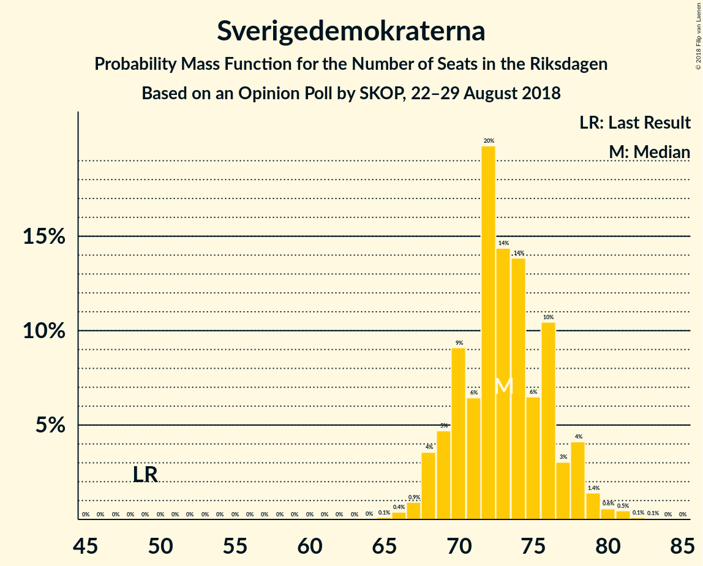
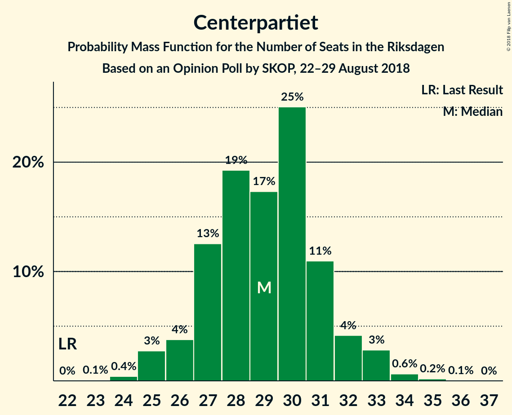
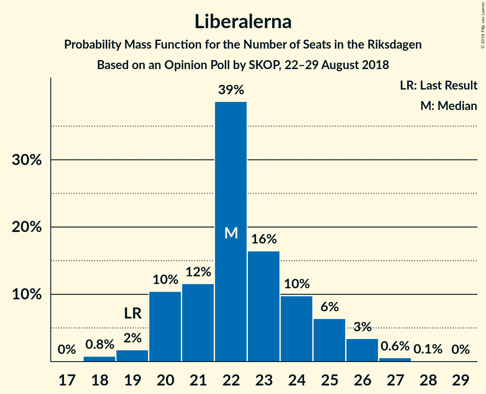
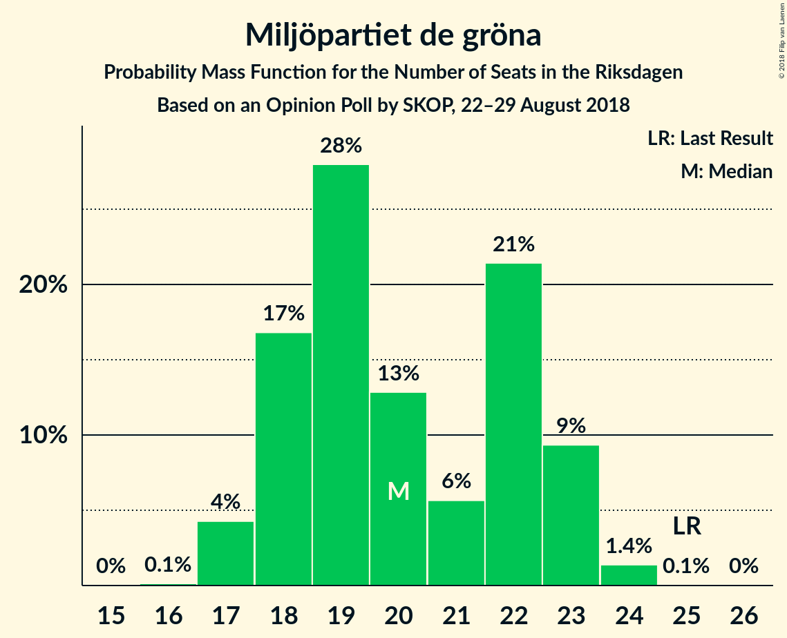
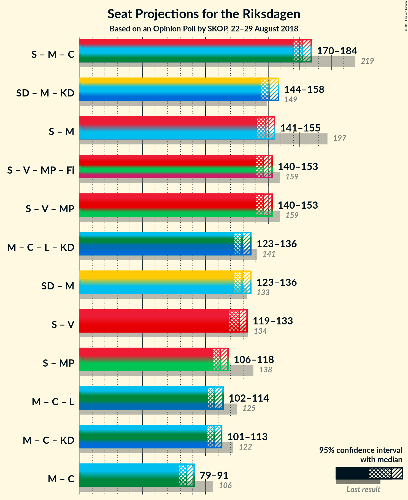

# Opinion Poll by SKOP, 22–29 August 2018

<a href="#voting-intentions">Voting Intentions</a> | <a href="#seats">Seats</a> | <a href="#coalitions">Coalitions</a> | <a href="#technical-information">Technical Information</a>

## Voting Intentions

### Confidence Intervals

| Party | Last Result | Poll Result | 80% Confidence Interval | 90% Confidence Interval | 95% Confidence Interval | 99% Confidence Interval |
|:-----:|:-----------:|:-----------:|:-----------------------:|:-----------------------:|:-----------------------:|:-----------------------:|
| Sveriges socialdemokratiska arbetareparti | 31.0% | 25.7% | 24.6–26.8% |24.4–27.1% |24.1–27.4% |23.6–27.9% |
| Sverigedemokraterna | 12.9% | 20.6% | 19.6–21.6% |19.3–21.9% |19.1–22.1% |18.6–22.6% |
| Moderata samlingspartiet | 23.3% | 15.7% | 14.8–16.6% |14.6–16.9% |14.4–17.1% |14.0–17.5% |
| Vänsterpartiet | 5.7% | 9.6% | 8.9–10.4% |8.7–10.6% |8.6–10.8% |8.3–11.2% |
| Centerpartiet | 6.1% | 8.1% | 7.5–8.8% |7.3–9.0% |7.1–9.2% |6.8–9.5% |
| Liberalerna | 5.4% | 6.3% | 5.7–6.9% |5.5–7.1% |5.4–7.2% |5.2–7.5% |
| Kristdemokraterna | 4.6% | 6.1% | 5.5–6.7% |5.4–6.9% |5.2–7.0% |5.0–7.3% |
| Miljöpartiet de gröna | 6.9% | 5.6% | 5.0–6.2% |4.9–6.4% |4.8–6.5% |4.5–6.8% |
| Feministiskt initiativ | 3.1% | 0.9% | 0.7–1.2% |0.7–1.3% |0.6–1.3% |0.5–1.5% |

*Note:* The poll result column reflects the actual value used in the calculations. Published results may vary slightly, and in addition be rounded to fewer digits.

## Seats

### Confidence Intervals

| Party | Last Result | Median | 80% Confidence Interval | 90% Confidence Interval | 95% Confidence Interval | 99% Confidence Interval |
|:-----:|:-----------:|:------:|:-----------------------:|:-----------------------:|:-----------------------:|:-----------------------:|
| <a href="#sveriges-socialdemokratiska-arbetareparti">Sveriges socialdemokratiska arbetareparti</a> | 113 | 93 | 87–97 |87–97 |87–98 |85–100 |
| <a href="#sverigedemokraterna">Sverigedemokraterna</a> | 49 | 73 | 68–76 |68–76 |68–78 |68–81 |
| <a href="#moderata-samlingspartiet">Moderata samlingspartiet</a> | 84 | 56 | 54–58 |53–58 |52–60 |51–62 |
| <a href="#vänsterpartiet">Vänsterpartiet</a> | 21 | 34 | 33–36 |32–37 |32–38 |31–39 |
| <a href="#centerpartiet">Centerpartiet</a> | 22 | 29 | 27–31 |27–32 |26–33 |25–33 |
| <a href="#liberalerna">Liberalerna</a> | 19 | 22 | 20–24 |20–26 |20–26 |19–26 |
| <a href="#kristdemokraterna">Kristdemokraterna</a> | 16 | 23 | 20–24 |20–25 |19–25 |17–26 |
| <a href="#miljöpartiet-de-gröna">Miljöpartiet de gröna</a> | 25 | 19 | 18–22 |18–22 |17–23 |17–23 |
| <a href="#feministiskt-initiativ">Feministiskt initiativ</a> | 0 | 0 | 0 |0 |0 |0 |

### Sveriges socialdemokratiska arbetareparti

*For a full overview of the results for this party, see the [Sveriges socialdemokratiska arbetareparti](party-sverigessocialdemokratiskaarbetareparti.html) page.*

| Number of Seats | Probability | Accumulated | Special Marks |
|:---------------:|:-----------:|:-----------:|:-------------:|
| 83 | 0.1% | 100% |  |
| 84 | 0.3% | 99.9% |  |
| 85 | 0.6% | 99.6% |  |
| 86 | 0.3% | 99.0% |  |
| 87 | 12% | 98.7% |  |
| 88 | 3% | 87% |  |
| 89 | 6% | 84% |  |
| 90 | 6% | 78% |  |
| 91 | 3% | 72% |  |
| 92 | 5% | 69% |  |
| 93 | 31% | 65% | Median |
| 94 | 21% | 34% |  |
| 95 | 2% | 13% |  |
| 96 | 0.9% | 12% |  |
| 97 | 7% | 11% |  |
| 98 | 1.4% | 3% |  |
| 99 | 0.3% | 2% |  |
| 100 | 1.3% | 2% |  |
| 101 | 0.2% | 0.2% |  |
| 102 | 0% | 0% |  |
| 103 | 0% | 0% |  |
| 104 | 0% | 0% |  |
| 105 | 0% | 0% |  |
| 106 | 0% | 0% |  |
| 107 | 0% | 0% |  |
| 108 | 0% | 0% |  |
| 109 | 0% | 0% |  |
| 110 | 0% | 0% |  |
| 111 | 0% | 0% |  |
| 112 | 0% | 0% |  |
| 113 | 0% | 0% | Last Result |

### Sverigedemokraterna

*For a full overview of the results for this party, see the [Sverigedemokraterna](party-sverigedemokraterna.html) page.*

| Number of Seats | Probability | Accumulated | Special Marks |
|:---------------:|:-----------:|:-----------:|:-------------:|
| 49 | 0% | 100% | Last Result |
| 50 | 0% | 100% |  |
| 51 | 0% | 100% |  |
| 52 | 0% | 100% |  |
| 53 | 0% | 100% |  |
| 54 | 0% | 100% |  |
| 55 | 0% | 100% |  |
| 56 | 0% | 100% |  |
| 57 | 0% | 100% |  |
| 58 | 0% | 100% |  |
| 59 | 0% | 100% |  |
| 60 | 0% | 100% |  |
| 61 | 0% | 100% |  |
| 62 | 0% | 100% |  |
| 63 | 0% | 100% |  |
| 64 | 0% | 100% |  |
| 65 | 0.1% | 100% |  |
| 66 | 0.1% | 99.9% |  |
| 67 | 0.1% | 99.8% |  |
| 68 | 11% | 99.7% |  |
| 69 | 2% | 89% |  |
| 70 | 8% | 87% |  |
| 71 | 9% | 79% |  |
| 72 | 2% | 70% |  |
| 73 | 23% | 68% | Median |
| 74 | 24% | 45% |  |
| 75 | 4% | 21% |  |
| 76 | 13% | 17% |  |
| 77 | 0.3% | 4% |  |
| 78 | 2% | 4% |  |
| 79 | 0.5% | 2% |  |
| 80 | 0.1% | 1.2% |  |
| 81 | 1.0% | 1.1% |  |
| 82 | 0% | 0.1% |  |
| 83 | 0% | 0% |  |

### Moderata samlingspartiet

*For a full overview of the results for this party, see the [Moderata samlingspartiet](party-moderatasamlingspartiet.html) page.*

| Number of Seats | Probability | Accumulated | Special Marks |
|:---------------:|:-----------:|:-----------:|:-------------:|
| 49 | 0% | 100% |  |
| 50 | 0.1% | 99.9% |  |
| 51 | 2% | 99.9% |  |
| 52 | 1.4% | 98% |  |
| 53 | 4% | 97% |  |
| 54 | 7% | 92% |  |
| 55 | 3% | 85% |  |
| 56 | 36% | 82% | Median |
| 57 | 29% | 46% |  |
| 58 | 12% | 17% |  |
| 59 | 1.1% | 5% |  |
| 60 | 3% | 4% |  |
| 61 | 0.8% | 1.3% |  |
| 62 | 0.2% | 0.5% |  |
| 63 | 0.1% | 0.3% |  |
| 64 | 0.1% | 0.1% |  |
| 65 | 0% | 0% |  |
| 66 | 0% | 0% |  |
| 67 | 0% | 0% |  |
| 68 | 0% | 0% |  |
| 69 | 0% | 0% |  |
| 70 | 0% | 0% |  |
| 71 | 0% | 0% |  |
| 72 | 0% | 0% |  |
| 73 | 0% | 0% |  |
| 74 | 0% | 0% |  |
| 75 | 0% | 0% |  |
| 76 | 0% | 0% |  |
| 77 | 0% | 0% |  |
| 78 | 0% | 0% |  |
| 79 | 0% | 0% |  |
| 80 | 0% | 0% |  |
| 81 | 0% | 0% |  |
| 82 | 0% | 0% |  |
| 83 | 0% | 0% |  |
| 84 | 0% | 0% | Last Result |

### Vänsterpartiet

*For a full overview of the results for this party, see the [Vänsterpartiet](party-vänsterpartiet.html) page.*

| Number of Seats | Probability | Accumulated | Special Marks |
|:---------------:|:-----------:|:-----------:|:-------------:|
| 21 | 0% | 100% | Last Result |
| 22 | 0% | 100% |  |
| 23 | 0% | 100% |  |
| 24 | 0% | 100% |  |
| 25 | 0% | 100% |  |
| 26 | 0% | 100% |  |
| 27 | 0% | 100% |  |
| 28 | 0% | 100% |  |
| 29 | 0.2% | 100% |  |
| 30 | 0.3% | 99.8% |  |
| 31 | 1.2% | 99.5% |  |
| 32 | 3% | 98% |  |
| 33 | 10% | 95% |  |
| 34 | 37% | 85% | Median |
| 35 | 29% | 49% |  |
| 36 | 10% | 20% |  |
| 37 | 7% | 10% |  |
| 38 | 2% | 3% |  |
| 39 | 0.8% | 1.0% |  |
| 40 | 0.2% | 0.3% |  |
| 41 | 0% | 0.1% |  |
| 42 | 0% | 0% |  |

### Centerpartiet

*For a full overview of the results for this party, see the [Centerpartiet](party-centerpartiet.html) page.*

| Number of Seats | Probability | Accumulated | Special Marks |
|:---------------:|:-----------:|:-----------:|:-------------:|
| 22 | 0% | 100% | Last Result |
| 23 | 0% | 100% |  |
| 24 | 0.3% | 99.9% |  |
| 25 | 0.9% | 99.7% |  |
| 26 | 3% | 98.8% |  |
| 27 | 30% | 96% |  |
| 28 | 14% | 66% |  |
| 29 | 30% | 52% | Median |
| 30 | 9% | 22% |  |
| 31 | 7% | 13% |  |
| 32 | 0.8% | 6% |  |
| 33 | 4% | 5% |  |
| 34 | 0.3% | 0.3% |  |
| 35 | 0% | 0.1% |  |
| 36 | 0% | 0% |  |

### Liberalerna

*For a full overview of the results for this party, see the [Liberalerna](party-liberalerna.html) page.*

| Number of Seats | Probability | Accumulated | Special Marks |
|:---------------:|:-----------:|:-----------:|:-------------:|
| 18 | 0.2% | 100% |  |
| 19 | 1.0% | 99.8% | Last Result |
| 20 | 20% | 98.8% |  |
| 21 | 5% | 78% |  |
| 22 | 46% | 74% | Median |
| 23 | 9% | 27% |  |
| 24 | 9% | 19% |  |
| 25 | 2% | 9% |  |
| 26 | 7% | 7% |  |
| 27 | 0.3% | 0.4% |  |
| 28 | 0.1% | 0.1% |  |
| 29 | 0% | 0% |  |

### Kristdemokraterna

*For a full overview of the results for this party, see the [Kristdemokraterna](party-kristdemokraterna.html) page.*

| Number of Seats | Probability | Accumulated | Special Marks |
|:---------------:|:-----------:|:-----------:|:-------------:|
| 16 | 0% | 100% | Last Result |
| 17 | 0.7% | 100% |  |
| 18 | 0.6% | 99.3% |  |
| 19 | 3% | 98.7% |  |
| 20 | 7% | 96% |  |
| 21 | 9% | 89% |  |
| 22 | 12% | 80% |  |
| 23 | 38% | 68% | Median |
| 24 | 24% | 30% |  |
| 25 | 5% | 6% |  |
| 26 | 1.2% | 1.4% |  |
| 27 | 0.2% | 0.2% |  |
| 28 | 0% | 0% |  |

### Miljöpartiet de gröna

*For a full overview of the results for this party, see the [Miljöpartiet de gröna](party-miljöpartietdegröna.html) page.*

| Number of Seats | Probability | Accumulated | Special Marks |
|:---------------:|:-----------:|:-----------:|:-------------:|
| 15 | 0.1% | 100% |  |
| 16 | 0.1% | 99.9% |  |
| 17 | 4% | 99.9% |  |
| 18 | 25% | 96% |  |
| 19 | 41% | 71% | Median |
| 20 | 3% | 31% |  |
| 21 | 3% | 28% |  |
| 22 | 21% | 25% |  |
| 23 | 3% | 4% |  |
| 24 | 0.5% | 0.5% |  |
| 25 | 0% | 0% | Last Result |

### Feministiskt initiativ

*For a full overview of the results for this party, see the [Feministiskt initiativ](party-feministisktinitiativ.html) page.*

| Number of Seats | Probability | Accumulated | Special Marks |
|:---------------:|:-----------:|:-----------:|:-------------:|
| 0 | 100% | 100% | Last Result, Median |

## Coalitions

### Confidence Intervals

| Coalition | Last Result | Median | Majority? | 80% Confidence Interval | 90% Confidence Interval | 95% Confidence Interval | 99% Confidence Interval |
|:---------:|:-----------:|:------:|:---------:|:-----------------------:|:-----------------------:|:-----------------------:|:-----------------------:|
| Sveriges socialdemokratiska arbetareparti – Moderata samlingspartiet – Centerpartiet | 219 | 177 | 83% | 171–182 | 171–182 | 171–182 | 169–184 |
| Sverigedemokraterna – Moderata samlingspartiet – Kristdemokraterna | 149 | 153 | 0% | 148–155 | 147–155 | 145–157 | 143–159 |
| Sveriges socialdemokratiska arbetareparti – Moderata samlingspartiet | 197 | 150 | 0% | 143–152 | 143–155 | 143–155 | 140–155 |
| Sveriges socialdemokratiska arbetareparti – Vänsterpartiet – Miljöpartiet de gröna – Feministiskt initiativ | 159 | 146 | 0% | 144–151 | 142–152 | 141–152 | 140–154 |
| Sveriges socialdemokratiska arbetareparti – Vänsterpartiet – Miljöpartiet de gröna | 159 | 146 | 0% | 144–151 | 142–152 | 141–152 | 140–154 |
| Moderata samlingspartiet – Centerpartiet – Liberalerna – Kristdemokraterna | 141 | 129 | 0% | 127–134 | 125–135 | 124–135 | 123–136 |
| Sverigedemokraterna – Moderata samlingspartiet | 133 | 129 | 0% | 124–132 | 124–134 | 124–135 | 123–137 |
| Sveriges socialdemokratiska arbetareparti – Vänsterpartiet | 134 | 127 | 0% | 122–131 | 122–133 | 122–133 | 119–134 |
| Sveriges socialdemokratiska arbetareparti – Miljöpartiet de gröna | 138 | 112 | 0% | 109–116 | 109–116 | 108–117 | 104–120 |
| Moderata samlingspartiet – Centerpartiet – Kristdemokraterna | 122 | 107 | 0% | 105–111 | 103–111 | 102–112 | 101–113 |
| Moderata samlingspartiet – Centerpartiet – Liberalerna | 125 | 106 | 0% | 105–112 | 104–112 | 102–112 | 101–114 |
| Moderata samlingspartiet – Centerpartiet | 106 | 84 | 0% | 83–88 | 81–89 | 81–90 | 79–90 |

### Sveriges socialdemokratiska arbetareparti – Moderata samlingspartiet – Centerpartiet

| Number of Seats | Probability | Accumulated | Special Marks |
|:---------------:|:-----------:|:-----------:|:-------------:|
| 167 | 0.3% | 100% |  |
| 168 | 0.1% | 99.7% |  |
| 169 | 0.1% | 99.6% |  |
| 170 | 0.7% | 99.5% |  |
| 171 | 11% | 98.7% |  |
| 172 | 2% | 88% |  |
| 173 | 1.2% | 86% |  |
| 174 | 2% | 85% |  |
| 175 | 7% | 83% | Majority |
| 176 | 8% | 76% |  |
| 177 | 25% | 68% |  |
| 178 | 3% | 43% | Median |
| 179 | 23% | 40% |  |
| 180 | 2% | 17% |  |
| 181 | 2% | 15% |  |
| 182 | 12% | 14% |  |
| 183 | 0.7% | 1.3% |  |
| 184 | 0.4% | 0.6% |  |
| 185 | 0.1% | 0.2% |  |
| 186 | 0.1% | 0.1% |  |
| 187 | 0% | 0.1% |  |
| 188 | 0% | 0% |  |
| 189 | 0% | 0% |  |
| 190 | 0% | 0% |  |
| 191 | 0% | 0% |  |
| 192 | 0% | 0% |  |
| 193 | 0% | 0% |  |
| 194 | 0% | 0% |  |
| 195 | 0% | 0% |  |
| 196 | 0% | 0% |  |
| 197 | 0% | 0% |  |
| 198 | 0% | 0% |  |
| 199 | 0% | 0% |  |
| 200 | 0% | 0% |  |
| 201 | 0% | 0% |  |
| 202 | 0% | 0% |  |
| 203 | 0% | 0% |  |
| 204 | 0% | 0% |  |
| 205 | 0% | 0% |  |
| 206 | 0% | 0% |  |
| 207 | 0% | 0% |  |
| 208 | 0% | 0% |  |
| 209 | 0% | 0% |  |
| 210 | 0% | 0% |  |
| 211 | 0% | 0% |  |
| 212 | 0% | 0% |  |
| 213 | 0% | 0% |  |
| 214 | 0% | 0% |  |
| 215 | 0% | 0% |  |
| 216 | 0% | 0% |  |
| 217 | 0% | 0% |  |
| 218 | 0% | 0% |  |
| 219 | 0% | 0% | Last Result |

### Sverigedemokraterna – Moderata samlingspartiet – Kristdemokraterna

| Number of Seats | Probability | Accumulated | Special Marks |
|:---------------:|:-----------:|:-----------:|:-------------:|
| 141 | 0.1% | 100% |  |
| 142 | 0.1% | 99.9% |  |
| 143 | 0.3% | 99.8% |  |
| 144 | 1.4% | 99.5% |  |
| 145 | 1.4% | 98% |  |
| 146 | 0.9% | 97% |  |
| 147 | 2% | 96% |  |
| 148 | 18% | 94% |  |
| 149 | 7% | 76% | Last Result |
| 150 | 6% | 69% |  |
| 151 | 0.7% | 62% |  |
| 152 | 0.9% | 62% | Median |
| 153 | 17% | 61% |  |
| 154 | 27% | 44% |  |
| 155 | 13% | 17% |  |
| 156 | 1.0% | 4% |  |
| 157 | 2% | 3% |  |
| 158 | 0.7% | 2% |  |
| 159 | 0.8% | 1.1% |  |
| 160 | 0.1% | 0.3% |  |
| 161 | 0% | 0.2% |  |
| 162 | 0.1% | 0.1% |  |
| 163 | 0% | 0% |  |

### Sveriges socialdemokratiska arbetareparti – Moderata samlingspartiet

| Number of Seats | Probability | Accumulated | Special Marks |
|:---------------:|:-----------:|:-----------:|:-------------:|
| 138 | 0.1% | 100% |  |
| 139 | 0.2% | 99.9% |  |
| 140 | 0.8% | 99.7% |  |
| 141 | 0.2% | 98.9% |  |
| 142 | 1.0% | 98.7% |  |
| 143 | 11% | 98% |  |
| 144 | 3% | 87% |  |
| 145 | 0.9% | 84% |  |
| 146 | 10% | 83% |  |
| 147 | 7% | 73% |  |
| 148 | 9% | 66% |  |
| 149 | 2% | 57% | Median |
| 150 | 39% | 55% |  |
| 151 | 2% | 17% |  |
| 152 | 5% | 14% |  |
| 153 | 2% | 10% |  |
| 154 | 0.3% | 7% |  |
| 155 | 7% | 7% |  |
| 156 | 0.1% | 0.2% |  |
| 157 | 0% | 0.1% |  |
| 158 | 0% | 0.1% |  |
| 159 | 0% | 0% |  |
| 160 | 0% | 0% |  |
| 161 | 0% | 0% |  |
| 162 | 0% | 0% |  |
| 163 | 0% | 0% |  |
| 164 | 0% | 0% |  |
| 165 | 0% | 0% |  |
| 166 | 0% | 0% |  |
| 167 | 0% | 0% |  |
| 168 | 0% | 0% |  |
| 169 | 0% | 0% |  |
| 170 | 0% | 0% |  |
| 171 | 0% | 0% |  |
| 172 | 0% | 0% |  |
| 173 | 0% | 0% |  |
| 174 | 0% | 0% |  |
| 175 | 0% | 0% | Majority |
| 176 | 0% | 0% |  |
| 177 | 0% | 0% |  |
| 178 | 0% | 0% |  |
| 179 | 0% | 0% |  |
| 180 | 0% | 0% |  |
| 181 | 0% | 0% |  |
| 182 | 0% | 0% |  |
| 183 | 0% | 0% |  |
| 184 | 0% | 0% |  |
| 185 | 0% | 0% |  |
| 186 | 0% | 0% |  |
| 187 | 0% | 0% |  |
| 188 | 0% | 0% |  |
| 189 | 0% | 0% |  |
| 190 | 0% | 0% |  |
| 191 | 0% | 0% |  |
| 192 | 0% | 0% |  |
| 193 | 0% | 0% |  |
| 194 | 0% | 0% |  |
| 195 | 0% | 0% |  |
| 196 | 0% | 0% |  |
| 197 | 0% | 0% | Last Result |

### Sveriges socialdemokratiska arbetareparti – Vänsterpartiet – Miljöpartiet de gröna – Feministiskt initiativ

| Number of Seats | Probability | Accumulated | Special Marks |
|:---------------:|:-----------:|:-----------:|:-------------:|
| 136 | 0% | 100% |  |
| 137 | 0.1% | 99.9% |  |
| 138 | 0% | 99.9% |  |
| 139 | 0.3% | 99.8% |  |
| 140 | 1.0% | 99.5% |  |
| 141 | 2% | 98% |  |
| 142 | 3% | 96% |  |
| 143 | 2% | 93% |  |
| 144 | 17% | 91% |  |
| 145 | 0.9% | 74% |  |
| 146 | 34% | 73% | Median |
| 147 | 17% | 39% |  |
| 148 | 2% | 22% |  |
| 149 | 8% | 20% |  |
| 150 | 0.8% | 12% |  |
| 151 | 2% | 11% |  |
| 152 | 8% | 10% |  |
| 153 | 0.2% | 2% |  |
| 154 | 1.4% | 2% |  |
| 155 | 0.2% | 0.3% |  |
| 156 | 0.1% | 0.1% |  |
| 157 | 0% | 0% |  |
| 158 | 0% | 0% |  |
| 159 | 0% | 0% | Last Result |

### Sveriges socialdemokratiska arbetareparti – Vänsterpartiet – Miljöpartiet de gröna

| Number of Seats | Probability | Accumulated | Special Marks |
|:---------------:|:-----------:|:-----------:|:-------------:|
| 136 | 0% | 100% |  |
| 137 | 0.1% | 99.9% |  |
| 138 | 0% | 99.9% |  |
| 139 | 0.3% | 99.8% |  |
| 140 | 1.0% | 99.5% |  |
| 141 | 2% | 98% |  |
| 142 | 3% | 96% |  |
| 143 | 2% | 93% |  |
| 144 | 17% | 91% |  |
| 145 | 0.9% | 74% |  |
| 146 | 34% | 73% | Median |
| 147 | 17% | 39% |  |
| 148 | 2% | 22% |  |
| 149 | 8% | 20% |  |
| 150 | 0.8% | 12% |  |
| 151 | 2% | 11% |  |
| 152 | 8% | 10% |  |
| 153 | 0.2% | 2% |  |
| 154 | 1.4% | 2% |  |
| 155 | 0.2% | 0.3% |  |
| 156 | 0.1% | 0.1% |  |
| 157 | 0% | 0% |  |
| 158 | 0% | 0% |  |
| 159 | 0% | 0% | Last Result |

### Moderata samlingspartiet – Centerpartiet – Liberalerna – Kristdemokraterna

| Number of Seats | Probability | Accumulated | Special Marks |
|:---------------:|:-----------:|:-----------:|:-------------:|
| 119 | 0% | 100% |  |
| 120 | 0% | 99.9% |  |
| 121 | 0% | 99.9% |  |
| 122 | 0.3% | 99.9% |  |
| 123 | 0.3% | 99.6% |  |
| 124 | 4% | 99.2% |  |
| 125 | 1.4% | 95% |  |
| 126 | 2% | 94% |  |
| 127 | 3% | 92% |  |
| 128 | 2% | 89% |  |
| 129 | 60% | 87% |  |
| 130 | 0.9% | 27% | Median |
| 131 | 4% | 27% |  |
| 132 | 5% | 23% |  |
| 133 | 7% | 18% |  |
| 134 | 5% | 10% |  |
| 135 | 4% | 6% |  |
| 136 | 1.1% | 1.4% |  |
| 137 | 0.2% | 0.3% |  |
| 138 | 0.1% | 0.2% |  |
| 139 | 0% | 0% |  |
| 140 | 0% | 0% |  |
| 141 | 0% | 0% | Last Result |

### Sverigedemokraterna – Moderata samlingspartiet

| Number of Seats | Probability | Accumulated | Special Marks |
|:---------------:|:-----------:|:-----------:|:-------------:|
| 119 | 0.1% | 100% |  |
| 120 | 0.1% | 99.9% |  |
| 121 | 0.1% | 99.8% |  |
| 122 | 0.2% | 99.7% |  |
| 123 | 1.1% | 99.6% |  |
| 124 | 9% | 98% |  |
| 125 | 2% | 89% |  |
| 126 | 12% | 87% |  |
| 127 | 5% | 76% |  |
| 128 | 4% | 70% |  |
| 129 | 19% | 66% | Median |
| 130 | 4% | 47% |  |
| 131 | 24% | 43% |  |
| 132 | 12% | 19% |  |
| 133 | 2% | 8% | Last Result |
| 134 | 1.2% | 5% |  |
| 135 | 2% | 4% |  |
| 136 | 1.1% | 2% |  |
| 137 | 0.2% | 0.6% |  |
| 138 | 0.2% | 0.4% |  |
| 139 | 0% | 0.2% |  |
| 140 | 0.1% | 0.1% |  |
| 141 | 0% | 0% |  |

### Sveriges socialdemokratiska arbetareparti – Vänsterpartiet

| Number of Seats | Probability | Accumulated | Special Marks |
|:---------------:|:-----------:|:-----------:|:-------------:|
| 117 | 0.2% | 100% |  |
| 118 | 0.2% | 99.8% |  |
| 119 | 0.9% | 99.6% |  |
| 120 | 0.4% | 98.7% |  |
| 121 | 0.2% | 98% |  |
| 122 | 17% | 98% |  |
| 123 | 3% | 82% |  |
| 124 | 0.9% | 78% |  |
| 125 | 4% | 78% |  |
| 126 | 3% | 73% |  |
| 127 | 33% | 71% | Median |
| 128 | 7% | 37% |  |
| 129 | 17% | 30% |  |
| 130 | 3% | 14% |  |
| 131 | 1.2% | 11% |  |
| 132 | 2% | 10% |  |
| 133 | 7% | 8% |  |
| 134 | 1.5% | 2% | Last Result |
| 135 | 0.1% | 0.2% |  |
| 136 | 0.1% | 0.1% |  |
| 137 | 0% | 0% |  |

### Sveriges socialdemokratiska arbetareparti – Miljöpartiet de gröna

| Number of Seats | Probability | Accumulated | Special Marks |
|:---------------:|:-----------:|:-----------:|:-------------:|
| 102 | 0.1% | 100% |  |
| 103 | 0.3% | 99.9% |  |
| 104 | 0.5% | 99.6% |  |
| 105 | 0.2% | 99.0% |  |
| 106 | 0.3% | 98.8% |  |
| 107 | 0.9% | 98.6% |  |
| 108 | 2% | 98% |  |
| 109 | 18% | 95% |  |
| 110 | 0.2% | 78% |  |
| 111 | 6% | 78% |  |
| 112 | 55% | 71% | Median |
| 113 | 1.3% | 16% |  |
| 114 | 0.5% | 15% |  |
| 115 | 3% | 14% |  |
| 116 | 8% | 12% |  |
| 117 | 2% | 4% |  |
| 118 | 0.6% | 2% |  |
| 119 | 0% | 2% |  |
| 120 | 1.4% | 2% |  |
| 121 | 0.2% | 0.2% |  |
| 122 | 0.1% | 0.1% |  |
| 123 | 0% | 0% |  |
| 124 | 0% | 0% |  |
| 125 | 0% | 0% |  |
| 126 | 0% | 0% |  |
| 127 | 0% | 0% |  |
| 128 | 0% | 0% |  |
| 129 | 0% | 0% |  |
| 130 | 0% | 0% |  |
| 131 | 0% | 0% |  |
| 132 | 0% | 0% |  |
| 133 | 0% | 0% |  |
| 134 | 0% | 0% |  |
| 135 | 0% | 0% |  |
| 136 | 0% | 0% |  |
| 137 | 0% | 0% |  |
| 138 | 0% | 0% | Last Result |

### Moderata samlingspartiet – Centerpartiet – Kristdemokraterna

| Number of Seats | Probability | Accumulated | Special Marks |
|:---------------:|:-----------:|:-----------:|:-------------:|
| 98 | 0% | 100% |  |
| 99 | 0.3% | 99.9% |  |
| 100 | 0.1% | 99.6% |  |
| 101 | 2% | 99.5% |  |
| 102 | 2% | 98% |  |
| 103 | 3% | 96% |  |
| 104 | 2% | 93% |  |
| 105 | 4% | 91% |  |
| 106 | 5% | 87% |  |
| 107 | 46% | 82% |  |
| 108 | 2% | 37% | Median |
| 109 | 16% | 35% |  |
| 110 | 6% | 18% |  |
| 111 | 8% | 13% |  |
| 112 | 4% | 5% |  |
| 113 | 0.2% | 0.6% |  |
| 114 | 0.3% | 0.4% |  |
| 115 | 0.1% | 0.2% |  |
| 116 | 0.1% | 0.1% |  |
| 117 | 0% | 0% |  |
| 118 | 0% | 0% |  |
| 119 | 0% | 0% |  |
| 120 | 0% | 0% |  |
| 121 | 0% | 0% |  |
| 122 | 0% | 0% | Last Result |

### Moderata samlingspartiet – Centerpartiet – Liberalerna

| Number of Seats | Probability | Accumulated | Special Marks |
|:---------------:|:-----------:|:-----------:|:-------------:|
| 99 | 0.1% | 100% |  |
| 100 | 0.1% | 99.9% |  |
| 101 | 0.2% | 99.7% |  |
| 102 | 2% | 99.5% |  |
| 103 | 0.7% | 97% |  |
| 104 | 3% | 96% |  |
| 105 | 17% | 93% |  |
| 106 | 34% | 76% |  |
| 107 | 10% | 42% | Median |
| 108 | 7% | 32% |  |
| 109 | 12% | 25% |  |
| 110 | 0.8% | 13% |  |
| 111 | 0.9% | 12% |  |
| 112 | 10% | 11% |  |
| 113 | 1.0% | 2% |  |
| 114 | 0.2% | 0.5% |  |
| 115 | 0.1% | 0.3% |  |
| 116 | 0.1% | 0.2% |  |
| 117 | 0% | 0.1% |  |
| 118 | 0% | 0% |  |
| 119 | 0% | 0% |  |
| 120 | 0% | 0% |  |
| 121 | 0% | 0% |  |
| 122 | 0% | 0% |  |
| 123 | 0% | 0% |  |
| 124 | 0% | 0% |  |
| 125 | 0% | 0% | Last Result |

### Moderata samlingspartiet – Centerpartiet

| Number of Seats | Probability | Accumulated | Special Marks |
|:---------------:|:-----------:|:-----------:|:-------------:|
| 77 | 0% | 100% |  |
| 78 | 0.1% | 99.9% |  |
| 79 | 2% | 99.8% |  |
| 80 | 0.5% | 98% |  |
| 81 | 3% | 98% |  |
| 82 | 2% | 95% |  |
| 83 | 8% | 93% |  |
| 84 | 35% | 84% |  |
| 85 | 27% | 50% | Median |
| 86 | 3% | 22% |  |
| 87 | 5% | 19% |  |
| 88 | 6% | 14% |  |
| 89 | 3% | 8% |  |
| 90 | 4% | 5% |  |
| 91 | 0.2% | 0.5% |  |
| 92 | 0.1% | 0.3% |  |
| 93 | 0% | 0.1% |  |
| 94 | 0.1% | 0.1% |  |
| 95 | 0% | 0% |  |
| 96 | 0% | 0% |  |
| 97 | 0% | 0% |  |
| 98 | 0% | 0% |  |
| 99 | 0% | 0% |  |
| 100 | 0% | 0% |  |
| 101 | 0% | 0% |  |
| 102 | 0% | 0% |  |
| 103 | 0% | 0% |  |
| 104 | 0% | 0% |  |
| 105 | 0% | 0% |  |
| 106 | 0% | 0% | Last Result |

## Technical Information

### Opinion Poll

+ **Polling firm:** SKOP
+ **Commissioner(s):** —
+ **Fieldwork period:** 22–29 August 2018

### Calculations

+ **Sample size:** 2763
+ **Simulations done:** 131,072
+ **Error estimate:** 0.55%

