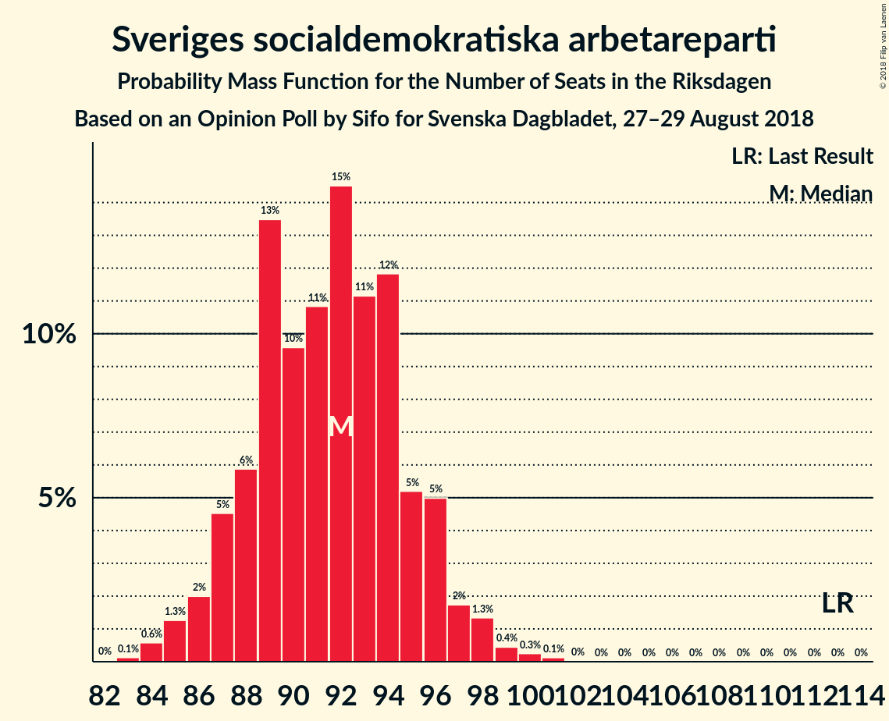
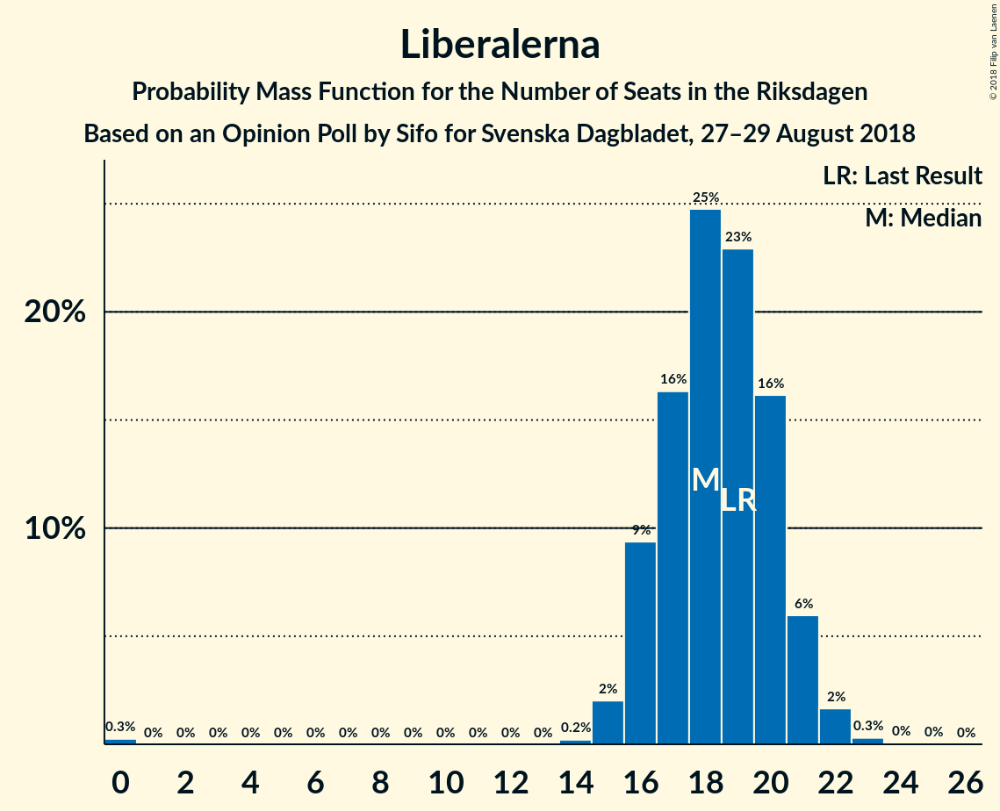

# Opinion Poll by Sifo for Svenska Dagbladet, 27–29 August 2018

<a href="#voting-intentions">Voting Intentions</a> | <a href="#seats">Seats</a> | <a href="#coalitions">Coalitions</a> | <a href="#technical-information">Technical Information</a>

## Voting Intentions

### Confidence Intervals

| Party | Last Result | Poll Result | 80% Confidence Interval | 90% Confidence Interval | 95% Confidence Interval | 99% Confidence Interval |
|:-----:|:-----------:|:-----------:|:-----------------------:|:-----------------------:|:-----------------------:|:-----------------------:|
| Sveriges socialdemokratiska arbetareparti | 31.0% | 25.6% | 24.6–26.7% |24.3–27.0% |24.0–27.2% |23.5–27.8% |
| Moderata samlingspartiet | 23.3% | 17.7% | 16.8–18.6% |16.5–18.9% |16.3–19.1% |15.9–19.6% |
| Sverigedemokraterna | 12.9% | 17.6% | 16.7–18.5% |16.4–18.8% |16.2–19.0% |15.8–19.5% |
| Vänsterpartiet | 5.7% | 11.3% | 10.6–12.1% |10.3–12.3% |10.2–12.5% |9.8–12.9% |
| Centerpartiet | 6.1% | 8.9% | 8.2–9.6% |8.0–9.8% |7.9–10.0% |7.6–10.4% |
| Miljöpartiet de gröna | 6.9% | 5.9% | 5.3–6.5% |5.2–6.7% |5.1–6.8% |4.8–7.1% |
| Kristdemokraterna | 4.6% | 5.4% | 4.9–6.0% |4.7–6.2% |4.6–6.3% |4.4–6.6% |
| Liberalerna | 5.4% | 5.1% | 4.6–5.7% |4.5–5.8% |4.3–6.0% |4.1–6.2% |

*Note:* The poll result column reflects the actual value used in the calculations. Published results may vary slightly, and in addition be rounded to fewer digits.

## Seats

### Confidence Intervals

| Party | Last Result | Median | 80% Confidence Interval | 90% Confidence Interval | 95% Confidence Interval | 99% Confidence Interval |
|:-----:|:-----------:|:------:|:-----------------------:|:-----------------------:|:-----------------------:|:-----------------------:|
| <a href="#sveriges-socialdemokratiska-arbetareparti">Sveriges socialdemokratiska arbetareparti</a> | 113 | 92 | 88–95 |87–96 |86–97 |84–99 |
| <a href="#moderata-samlingspartiet">Moderata samlingspartiet</a> | 84 | 64 | 60–67 |59–68 |58–68 |57–70 |
| <a href="#sverigedemokraterna">Sverigedemokraterna</a> | 49 | 62 | 60–66 |59–67 |58–68 |57–70 |
| <a href="#vänsterpartiet">Vänsterpartiet</a> | 21 | 40 | 38–43 |37–44 |37–45 |35–46 |
| <a href="#centerpartiet">Centerpartiet</a> | 22 | 32 | 29–34 |29–35 |28–36 |27–37 |
| <a href="#miljöpartiet-de-gröna">Miljöpartiet de gröna</a> | 25 | 21 | 19–23 |19–24 |18–24 |17–26 |
| <a href="#kristdemokraterna">Kristdemokraterna</a> | 16 | 20 | 18–21 |17–22 |17–22 |16–23 |
| <a href="#liberalerna">Liberalerna</a> | 19 | 18 | 16–20 |16–21 |16–21 |15–22 |

### Sveriges socialdemokratiska arbetareparti

*For a full overview of the results for this party, see the [Sveriges socialdemokratiska arbetareparti](party-sverigessocialdemokratiskaarbetareparti.html) page.*

| Number of Seats | Probability | Accumulated | Special Marks |
|:---------------:|:-----------:|:-----------:|:-------------:|
| 82 | 0% | 100% |  |
| 83 | 0.1% | 99.9% |  |
| 84 | 0.6% | 99.8% |  |
| 85 | 1.3% | 99.2% |  |
| 86 | 2% | 98% |  |
| 87 | 5% | 96% |  |
| 88 | 6% | 91% |  |
| 89 | 13% | 86% |  |
| 90 | 10% | 72% |  |
| 91 | 11% | 62% |  |
| 92 | 15% | 52% | Median |
| 93 | 11% | 37% |  |
| 94 | 12% | 26% |  |
| 95 | 5% | 14% |  |
| 96 | 5% | 9% |  |
| 97 | 2% | 4% |  |
| 98 | 1.3% | 2% |  |
| 99 | 0.4% | 0.9% |  |
| 100 | 0.3% | 0.4% |  |
| 101 | 0.1% | 0.2% |  |
| 102 | 0% | 0% |  |
| 103 | 0% | 0% |  |
| 104 | 0% | 0% |  |
| 105 | 0% | 0% |  |
| 106 | 0% | 0% |  |
| 107 | 0% | 0% |  |
| 108 | 0% | 0% |  |
| 109 | 0% | 0% |  |
| 110 | 0% | 0% |  |
| 111 | 0% | 0% |  |
| 112 | 0% | 0% |  |
| 113 | 0% | 0% | Last Result |

### Moderata samlingspartiet

*For a full overview of the results for this party, see the [Moderata samlingspartiet](party-moderatasamlingspartiet.html) page.*

| Number of Seats | Probability | Accumulated | Special Marks |
|:---------------:|:-----------:|:-----------:|:-------------:|
| 55 | 0.1% | 100% |  |
| 56 | 0.2% | 99.9% |  |
| 57 | 0.7% | 99.7% |  |
| 58 | 2% | 99.0% |  |
| 59 | 4% | 97% |  |
| 60 | 7% | 93% |  |
| 61 | 11% | 86% |  |
| 62 | 10% | 75% |  |
| 63 | 14% | 66% |  |
| 64 | 21% | 52% | Median |
| 65 | 11% | 31% |  |
| 66 | 9% | 20% |  |
| 67 | 4% | 11% |  |
| 68 | 4% | 7% |  |
| 69 | 1.4% | 2% |  |
| 70 | 0.7% | 1.0% |  |
| 71 | 0.2% | 0.3% |  |
| 72 | 0.1% | 0.1% |  |
| 73 | 0% | 0% |  |
| 74 | 0% | 0% |  |
| 75 | 0% | 0% |  |
| 76 | 0% | 0% |  |
| 77 | 0% | 0% |  |
| 78 | 0% | 0% |  |
| 79 | 0% | 0% |  |
| 80 | 0% | 0% |  |
| 81 | 0% | 0% |  |
| 82 | 0% | 0% |  |
| 83 | 0% | 0% |  |
| 84 | 0% | 0% | Last Result |

### Sverigedemokraterna

*For a full overview of the results for this party, see the [Sverigedemokraterna](party-sverigedemokraterna.html) page.*

| Number of Seats | Probability | Accumulated | Special Marks |
|:---------------:|:-----------:|:-----------:|:-------------:|
| 49 | 0% | 100% | Last Result |
| 50 | 0% | 100% |  |
| 51 | 0% | 100% |  |
| 52 | 0% | 100% |  |
| 53 | 0% | 100% |  |
| 54 | 0% | 100% |  |
| 55 | 0.1% | 100% |  |
| 56 | 0.3% | 99.9% |  |
| 57 | 1.5% | 99.6% |  |
| 58 | 3% | 98% |  |
| 59 | 4% | 95% |  |
| 60 | 6% | 91% |  |
| 61 | 13% | 85% |  |
| 62 | 26% | 73% | Median |
| 63 | 11% | 47% |  |
| 64 | 7% | 36% |  |
| 65 | 12% | 29% |  |
| 66 | 10% | 17% |  |
| 67 | 4% | 7% |  |
| 68 | 1.1% | 3% |  |
| 69 | 0.9% | 2% |  |
| 70 | 0.6% | 0.8% |  |
| 71 | 0.2% | 0.2% |  |
| 72 | 0% | 0% |  |

### Vänsterpartiet

*For a full overview of the results for this party, see the [Vänsterpartiet](party-vänsterpartiet.html) page.*

| Number of Seats | Probability | Accumulated | Special Marks |
|:---------------:|:-----------:|:-----------:|:-------------:|
| 21 | 0% | 100% | Last Result |
| 22 | 0% | 100% |  |
| 23 | 0% | 100% |  |
| 24 | 0% | 100% |  |
| 25 | 0% | 100% |  |
| 26 | 0% | 100% |  |
| 27 | 0% | 100% |  |
| 28 | 0% | 100% |  |
| 29 | 0% | 100% |  |
| 30 | 0% | 100% |  |
| 31 | 0% | 100% |  |
| 32 | 0% | 100% |  |
| 33 | 0% | 100% |  |
| 34 | 0.1% | 100% |  |
| 35 | 0.6% | 99.9% |  |
| 36 | 2% | 99.3% |  |
| 37 | 5% | 98% |  |
| 38 | 10% | 92% |  |
| 39 | 18% | 82% |  |
| 40 | 19% | 65% | Median |
| 41 | 15% | 46% |  |
| 42 | 14% | 31% |  |
| 43 | 8% | 17% |  |
| 44 | 6% | 9% |  |
| 45 | 2% | 3% |  |
| 46 | 1.0% | 1.3% |  |
| 47 | 0.3% | 0.3% |  |
| 48 | 0% | 0.1% |  |
| 49 | 0% | 0% |  |

### Centerpartiet

*For a full overview of the results for this party, see the [Centerpartiet](party-centerpartiet.html) page.*

| Number of Seats | Probability | Accumulated | Special Marks |
|:---------------:|:-----------:|:-----------:|:-------------:|
| 22 | 0% | 100% | Last Result |
| 23 | 0% | 100% |  |
| 24 | 0% | 100% |  |
| 25 | 0% | 100% |  |
| 26 | 0.1% | 100% |  |
| 27 | 0.7% | 99.9% |  |
| 28 | 3% | 99.2% |  |
| 29 | 8% | 97% |  |
| 30 | 12% | 88% |  |
| 31 | 20% | 77% |  |
| 32 | 17% | 56% | Median |
| 33 | 21% | 39% |  |
| 34 | 9% | 18% |  |
| 35 | 6% | 9% |  |
| 36 | 2% | 3% |  |
| 37 | 0.7% | 1.0% |  |
| 38 | 0.2% | 0.2% |  |
| 39 | 0% | 0.1% |  |
| 40 | 0% | 0% |  |

### Miljöpartiet de gröna

*For a full overview of the results for this party, see the [Miljöpartiet de gröna](party-miljöpartietdegröna.html) page.*

| Number of Seats | Probability | Accumulated | Special Marks |
|:---------------:|:-----------:|:-----------:|:-------------:|
| 16 | 0.1% | 100% |  |
| 17 | 0.8% | 99.9% |  |
| 18 | 4% | 99.2% |  |
| 19 | 10% | 95% |  |
| 20 | 22% | 85% |  |
| 21 | 24% | 63% | Median |
| 22 | 19% | 39% |  |
| 23 | 13% | 21% |  |
| 24 | 5% | 7% |  |
| 25 | 2% | 2% | Last Result |
| 26 | 0.5% | 0.6% |  |
| 27 | 0.1% | 0.1% |  |
| 28 | 0% | 0% |  |

### Kristdemokraterna

*For a full overview of the results for this party, see the [Kristdemokraterna](party-kristdemokraterna.html) page.*

| Number of Seats | Probability | Accumulated | Special Marks |
|:---------------:|:-----------:|:-----------:|:-------------:|
| 15 | 0.3% | 100% |  |
| 16 | 2% | 99.7% | Last Result |
| 17 | 7% | 98% |  |
| 18 | 15% | 91% |  |
| 19 | 25% | 76% |  |
| 20 | 27% | 51% | Median |
| 21 | 16% | 24% |  |
| 22 | 7% | 8% |  |
| 23 | 1.4% | 2% |  |
| 24 | 0.4% | 0.5% |  |
| 25 | 0.1% | 0.1% |  |
| 26 | 0% | 0% |  |

### Liberalerna

*For a full overview of the results for this party, see the [Liberalerna](party-liberalerna.html) page.*

| Number of Seats | Probability | Accumulated | Special Marks |
|:---------------:|:-----------:|:-----------:|:-------------:|
| 0 | 0.3% | 100% |  |
| 1 | 0% | 99.7% |  |
| 2 | 0% | 99.7% |  |
| 3 | 0% | 99.7% |  |
| 4 | 0% | 99.7% |  |
| 5 | 0% | 99.7% |  |
| 6 | 0% | 99.7% |  |
| 7 | 0% | 99.7% |  |
| 8 | 0% | 99.7% |  |
| 9 | 0% | 99.7% |  |
| 10 | 0% | 99.7% |  |
| 11 | 0% | 99.7% |  |
| 12 | 0% | 99.7% |  |
| 13 | 0% | 99.7% |  |
| 14 | 0.2% | 99.7% |  |
| 15 | 2% | 99.5% |  |
| 16 | 9% | 98% |  |
| 17 | 16% | 88% |  |
| 18 | 25% | 72% | Median |
| 19 | 23% | 47% | Last Result |
| 20 | 16% | 24% |  |
| 21 | 6% | 8% |  |
| 22 | 2% | 2% |  |
| 23 | 0.3% | 0.3% |  |
| 24 | 0% | 0.1% |  |
| 25 | 0% | 0% |  |

## Coalitions

### Confidence Intervals

| Coalition | Last Result | Median | Majority? | 80% Confidence Interval | 90% Confidence Interval | 95% Confidence Interval | 99% Confidence Interval |
|:---------:|:-----------:|:------:|:---------:|:-----------------------:|:-----------------------:|:-----------------------:|:-----------------------:|
| Sveriges socialdemokratiska arbetareparti – Moderata samlingspartiet – Centerpartiet | 219 | 186 | 100% | 183–191 | 181–192 | 180–193 | 178–196 |
| Sveriges socialdemokratiska arbetareparti – Moderata samlingspartiet | 197 | 155 | 0% | 151–159 | 150–160 | 148–161 | 146–164 |
| Sveriges socialdemokratiska arbetareparti – Vänsterpartiet – Miljöpartiet de gröna | 159 | 153 | 0% | 149–157 | 148–159 | 147–160 | 145–162 |
| Moderata samlingspartiet – Sverigedemokraterna – Kristdemokraterna | 149 | 146 | 0% | 141–150 | 140–151 | 139–152 | 137–155 |
| Moderata samlingspartiet – Centerpartiet – Kristdemokraterna – Liberalerna | 141 | 133 | 0% | 129–137 | 128–138 | 126–139 | 124–141 |
| Sveriges socialdemokratiska arbetareparti – Vänsterpartiet | 134 | 132 | 0% | 128–136 | 127–137 | 126–138 | 124–141 |
| Moderata samlingspartiet – Sverigedemokraterna | 133 | 126 | 0% | 122–130 | 121–131 | 120–133 | 118–135 |
| Moderata samlingspartiet – Centerpartiet – Kristdemokraterna | 122 | 115 | 0% | 111–119 | 110–120 | 108–121 | 107–123 |
| Moderata samlingspartiet – Centerpartiet – Liberalerna | 125 | 114 | 0% | 109–117 | 108–119 | 107–120 | 105–122 |
| Sveriges socialdemokratiska arbetareparti – Miljöpartiet de gröna | 138 | 113 | 0% | 109–117 | 107–118 | 107–119 | 105–121 |
| Moderata samlingspartiet – Centerpartiet | 106 | 95 | 0% | 92–99 | 90–100 | 89–101 | 88–103 |

