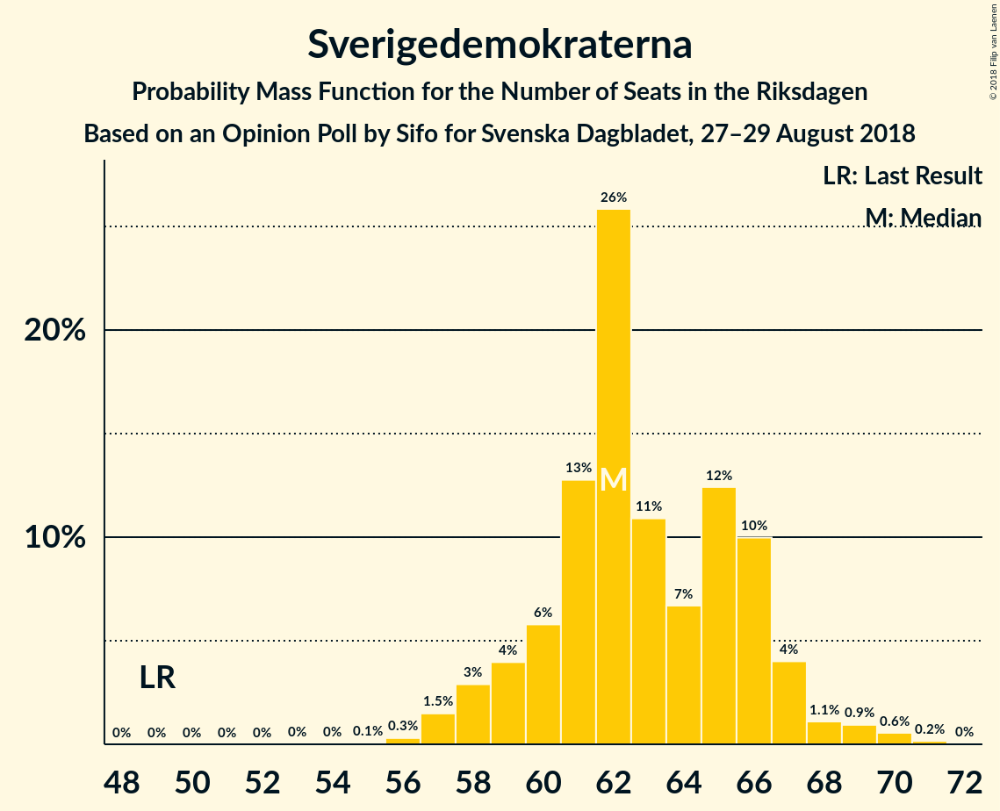
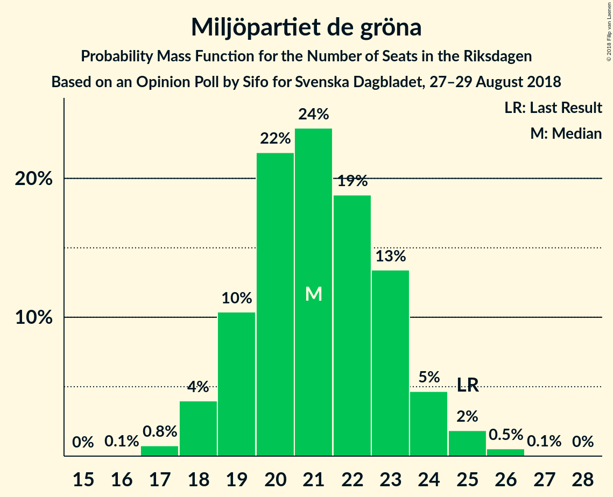

# Opinion Poll by Sifo for Svenska Dagbladet, 27–29 August 2018

<a href="#voting-intentions">Voting Intentions</a> | <a href="#seats">Seats</a> | <a href="#coalitions">Coalitions</a> | <a href="#technical-information">Technical Information</a>

## Voting Intentions

### Confidence Intervals

| Party | Last Result | Poll Result | 80% Confidence Interval | 90% Confidence Interval | 95% Confidence Interval | 99% Confidence Interval |
|:-----:|:-----------:|:-----------:|:-----------------------:|:-----------------------:|:-----------------------:|:-----------------------:|
| Sveriges socialdemokratiska arbetareparti | 31.0% | 25.6% | 24.6–26.7% |24.3–27.0% |24.0–27.2% |23.5–27.8% |
| Moderata samlingspartiet | 23.3% | 17.7% | 16.8–18.6% |16.5–18.9% |16.3–19.1% |15.9–19.6% |
| Sverigedemokraterna | 12.9% | 17.6% | 16.7–18.5% |16.4–18.8% |16.2–19.0% |15.8–19.5% |
| Vänsterpartiet | 5.7% | 11.3% | 10.6–12.1% |10.3–12.3% |10.2–12.5% |9.8–12.9% |
| Centerpartiet | 6.1% | 8.9% | 8.2–9.6% |8.0–9.8% |7.9–10.0% |7.6–10.4% |
| Miljöpartiet de gröna | 6.9% | 5.9% | 5.3–6.5% |5.2–6.7% |5.1–6.8% |4.8–7.1% |
| Kristdemokraterna | 4.6% | 5.4% | 4.9–6.0% |4.7–6.2% |4.6–6.3% |4.4–6.6% |
| Liberalerna | 5.4% | 5.1% | 4.6–5.7% |4.5–5.8% |4.3–6.0% |4.1–6.2% |

*Note:* The poll result column reflects the actual value used in the calculations. Published results may vary slightly, and in addition be rounded to fewer digits.

## Seats

### Confidence Intervals

| Party | Last Result | Median | 80% Confidence Interval | 90% Confidence Interval | 95% Confidence Interval | 99% Confidence Interval |
|:-----:|:-----------:|:------:|:-----------------------:|:-----------------------:|:-----------------------:|:-----------------------:|
| <a href="#sveriges-socialdemokratiska-arbetareparti">Sveriges socialdemokratiska arbetareparti</a> | 113 | 91 | 88–95 |87–96 |86–97 |84–99 |
| <a href="#moderata-samlingspartiet">Moderata samlingspartiet</a> | 84 | 63 | 60–67 |59–67 |58–69 |57–70 |
| <a href="#sverigedemokraterna">Sverigedemokraterna</a> | 49 | 62 | 61–66 |59–67 |58–69 |57–70 |
| <a href="#vänsterpartiet">Vänsterpartiet</a> | 21 | 40 | 38–43 |37–44 |36–45 |35–46 |
| <a href="#centerpartiet">Centerpartiet</a> | 22 | 32 | 29–35 |29–35 |28–36 |27–37 |
| <a href="#miljöpartiet-de-gröna">Miljöpartiet de gröna</a> | 25 | 21 | 19–23 |18–24 |18–24 |17–25 |
| <a href="#kristdemokraterna">Kristdemokraterna</a> | 16 | 20 | 18–21 |17–22 |17–22 |16–23 |
| <a href="#liberalerna">Liberalerna</a> | 19 | 18 | 16–21 |16–21 |16–22 |14–22 |

### Sveriges socialdemokratiska arbetareparti

*For a full overview of the results for this party, see the [Sveriges socialdemokratiska arbetareparti](party-sverigessocialdemokratiskaarbetareparti.html) page.*

| Number of Seats | Probability | Accumulated | Special Marks |
|:---------------:|:-----------:|:-----------:|:-------------:|
| 83 | 0.1% | 100% |  |
| 84 | 0.6% | 99.8% |  |
| 85 | 0.3% | 99.2% |  |
| 86 | 3% | 98.8% |  |
| 87 | 4% | 96% |  |
| 88 | 8% | 92% |  |
| 89 | 20% | 84% |  |
| 90 | 2% | 64% |  |
| 91 | 17% | 62% | Median |
| 92 | 3% | 45% |  |
| 93 | 22% | 42% |  |
| 94 | 5% | 20% |  |
| 95 | 6% | 15% |  |
| 96 | 6% | 9% |  |
| 97 | 0.8% | 3% |  |
| 98 | 1.5% | 2% |  |
| 99 | 0.5% | 0.9% |  |
| 100 | 0.2% | 0.3% |  |
| 101 | 0.1% | 0.2% |  |
| 102 | 0% | 0.1% |  |
| 103 | 0% | 0% |  |
| 104 | 0% | 0% |  |
| 105 | 0% | 0% |  |
| 106 | 0% | 0% |  |
| 107 | 0% | 0% |  |
| 108 | 0% | 0% |  |
| 109 | 0% | 0% |  |
| 110 | 0% | 0% |  |
| 111 | 0% | 0% |  |
| 112 | 0% | 0% |  |
| 113 | 0% | 0% | Last Result |

### Moderata samlingspartiet

*For a full overview of the results for this party, see the [Moderata samlingspartiet](party-moderatasamlingspartiet.html) page.*

| Number of Seats | Probability | Accumulated | Special Marks |
|:---------------:|:-----------:|:-----------:|:-------------:|
| 55 | 0.1% | 100% |  |
| 56 | 0.2% | 99.9% |  |
| 57 | 2% | 99.7% |  |
| 58 | 1.3% | 98% |  |
| 59 | 6% | 97% |  |
| 60 | 5% | 91% |  |
| 61 | 11% | 85% |  |
| 62 | 10% | 74% |  |
| 63 | 17% | 64% | Median |
| 64 | 13% | 47% |  |
| 65 | 15% | 34% |  |
| 66 | 8% | 19% |  |
| 67 | 5% | 10% |  |
| 68 | 2% | 5% |  |
| 69 | 1.3% | 3% |  |
| 70 | 0.9% | 1.3% |  |
| 71 | 0.3% | 0.4% |  |
| 72 | 0.1% | 0.1% |  |
| 73 | 0% | 0% |  |
| 74 | 0% | 0% |  |
| 75 | 0% | 0% |  |
| 76 | 0% | 0% |  |
| 77 | 0% | 0% |  |
| 78 | 0% | 0% |  |
| 79 | 0% | 0% |  |
| 80 | 0% | 0% |  |
| 81 | 0% | 0% |  |
| 82 | 0% | 0% |  |
| 83 | 0% | 0% |  |
| 84 | 0% | 0% | Last Result |

### Sverigedemokraterna

*For a full overview of the results for this party, see the [Sverigedemokraterna](party-sverigedemokraterna.html) page.*

| Number of Seats | Probability | Accumulated | Special Marks |
|:---------------:|:-----------:|:-----------:|:-------------:|
| 49 | 0% | 100% | Last Result |
| 50 | 0% | 100% |  |
| 51 | 0% | 100% |  |
| 52 | 0% | 100% |  |
| 53 | 0% | 100% |  |
| 54 | 0% | 100% |  |
| 55 | 0.1% | 100% |  |
| 56 | 0.4% | 99.9% |  |
| 57 | 2% | 99.6% |  |
| 58 | 2% | 98% |  |
| 59 | 2% | 96% |  |
| 60 | 4% | 94% |  |
| 61 | 24% | 90% |  |
| 62 | 17% | 66% | Median |
| 63 | 6% | 48% |  |
| 64 | 10% | 42% |  |
| 65 | 17% | 33% |  |
| 66 | 10% | 15% |  |
| 67 | 1.3% | 6% |  |
| 68 | 2% | 5% |  |
| 69 | 2% | 3% |  |
| 70 | 0.6% | 0.8% |  |
| 71 | 0.1% | 0.1% |  |
| 72 | 0% | 0% |  |

### Vänsterpartiet

*For a full overview of the results for this party, see the [Vänsterpartiet](party-vänsterpartiet.html) page.*

| Number of Seats | Probability | Accumulated | Special Marks |
|:---------------:|:-----------:|:-----------:|:-------------:|
| 21 | 0% | 100% | Last Result |
| 22 | 0% | 100% |  |
| 23 | 0% | 100% |  |
| 24 | 0% | 100% |  |
| 25 | 0% | 100% |  |
| 26 | 0% | 100% |  |
| 27 | 0% | 100% |  |
| 28 | 0% | 100% |  |
| 29 | 0% | 100% |  |
| 30 | 0% | 100% |  |
| 31 | 0% | 100% |  |
| 32 | 0% | 100% |  |
| 33 | 0% | 100% |  |
| 34 | 0.1% | 100% |  |
| 35 | 0.7% | 99.9% |  |
| 36 | 2% | 99.2% |  |
| 37 | 7% | 97% |  |
| 38 | 10% | 90% |  |
| 39 | 17% | 80% |  |
| 40 | 16% | 64% | Median |
| 41 | 17% | 47% |  |
| 42 | 12% | 31% |  |
| 43 | 8% | 18% |  |
| 44 | 6% | 10% |  |
| 45 | 2% | 4% |  |
| 46 | 1.1% | 1.5% |  |
| 47 | 0.3% | 0.4% |  |
| 48 | 0.1% | 0.1% |  |
| 49 | 0% | 0% |  |

### Centerpartiet

*For a full overview of the results for this party, see the [Centerpartiet](party-centerpartiet.html) page.*

| Number of Seats | Probability | Accumulated | Special Marks |
|:---------------:|:-----------:|:-----------:|:-------------:|
| 22 | 0% | 100% | Last Result |
| 23 | 0% | 100% |  |
| 24 | 0% | 100% |  |
| 25 | 0% | 100% |  |
| 26 | 0.1% | 100% |  |
| 27 | 0.6% | 99.9% |  |
| 28 | 3% | 99.3% |  |
| 29 | 8% | 96% |  |
| 30 | 7% | 88% |  |
| 31 | 18% | 81% |  |
| 32 | 18% | 63% | Median |
| 33 | 24% | 45% |  |
| 34 | 11% | 21% |  |
| 35 | 7% | 10% |  |
| 36 | 2% | 3% |  |
| 37 | 0.7% | 0.9% |  |
| 38 | 0.2% | 0.2% |  |
| 39 | 0% | 0% |  |

### Miljöpartiet de gröna

*For a full overview of the results for this party, see the [Miljöpartiet de gröna](party-miljöpartietdegröna.html) page.*

| Number of Seats | Probability | Accumulated | Special Marks |
|:---------------:|:-----------:|:-----------:|:-------------:|
| 16 | 0.1% | 100% |  |
| 17 | 0.5% | 99.9% |  |
| 18 | 5% | 99.4% |  |
| 19 | 15% | 95% |  |
| 20 | 15% | 80% |  |
| 21 | 27% | 64% | Median |
| 22 | 14% | 37% |  |
| 23 | 15% | 23% |  |
| 24 | 7% | 9% |  |
| 25 | 1.5% | 2% | Last Result |
| 26 | 0.4% | 0.5% |  |
| 27 | 0% | 0.1% |  |
| 28 | 0% | 0% |  |

### Kristdemokraterna

*For a full overview of the results for this party, see the [Kristdemokraterna](party-kristdemokraterna.html) page.*

| Number of Seats | Probability | Accumulated | Special Marks |
|:---------------:|:-----------:|:-----------:|:-------------:|
| 14 | 0% | 100% |  |
| 15 | 0.2% | 99.9% |  |
| 16 | 1.4% | 99.7% | Last Result |
| 17 | 6% | 98% |  |
| 18 | 15% | 93% |  |
| 19 | 24% | 78% |  |
| 20 | 31% | 54% | Median |
| 21 | 16% | 24% |  |
| 22 | 6% | 8% |  |
| 23 | 1.1% | 1.5% |  |
| 24 | 0.4% | 0.4% |  |
| 25 | 0.1% | 0.1% |  |
| 26 | 0% | 0% |  |

### Liberalerna

*For a full overview of the results for this party, see the [Liberalerna](party-liberalerna.html) page.*

| Number of Seats | Probability | Accumulated | Special Marks |
|:---------------:|:-----------:|:-----------:|:-------------:|
| 0 | 0.4% | 100% |  |
| 1 | 0% | 99.6% |  |
| 2 | 0% | 99.6% |  |
| 3 | 0% | 99.6% |  |
| 4 | 0% | 99.6% |  |
| 5 | 0% | 99.6% |  |
| 6 | 0% | 99.6% |  |
| 7 | 0% | 99.6% |  |
| 8 | 0% | 99.6% |  |
| 9 | 0% | 99.6% |  |
| 10 | 0% | 99.6% |  |
| 11 | 0% | 99.6% |  |
| 12 | 0% | 99.6% |  |
| 13 | 0% | 99.6% |  |
| 14 | 0.5% | 99.6% |  |
| 15 | 1.2% | 99.1% |  |
| 16 | 17% | 98% |  |
| 17 | 11% | 81% |  |
| 18 | 27% | 69% | Median |
| 19 | 12% | 42% | Last Result |
| 20 | 19% | 31% |  |
| 21 | 9% | 11% |  |
| 22 | 2% | 3% |  |
| 23 | 0.4% | 0.5% |  |
| 24 | 0.1% | 0.1% |  |
| 25 | 0% | 0% |  |

## Coalitions

### Confidence Intervals

| Coalition | Last Result | Median | Majority? | 80% Confidence Interval | 90% Confidence Interval | 95% Confidence Interval | 99% Confidence Interval |
|:---------:|:-----------:|:------:|:---------:|:-----------------------:|:-----------------------:|:-----------------------:|:-----------------------:|
| Sveriges socialdemokratiska arbetareparti – Moderata samlingspartiet – Centerpartiet | 219 | 186 | 100% | 182–191 | 181–192 | 180–192 | 179–196 |
| Sveriges socialdemokratiska arbetareparti – Moderata samlingspartiet | 197 | 154 | 0% | 151–159 | 149–160 | 149–161 | 147–164 |
| Sveriges socialdemokratiska arbetareparti – Vänsterpartiet – Miljöpartiet de gröna | 159 | 153 | 0% | 149–158 | 148–159 | 147–159 | 145–161 |
| Moderata samlingspartiet – Sverigedemokraterna – Kristdemokraterna | 149 | 146 | 0% | 141–150 | 139–151 | 139–153 | 138–155 |
| Moderata samlingspartiet – Centerpartiet – Kristdemokraterna – Liberalerna | 141 | 133 | 0% | 129–137 | 127–139 | 126–140 | 124–141 |
| Sveriges socialdemokratiska arbetareparti – Vänsterpartiet | 134 | 132 | 0% | 128–136 | 127–138 | 126–138 | 124–141 |
| Moderata samlingspartiet – Sverigedemokraterna | 133 | 126 | 0% | 122–131 | 120–132 | 120–133 | 118–135 |
| Moderata samlingspartiet – Centerpartiet – Kristdemokraterna | 122 | 115 | 0% | 111–119 | 110–120 | 108–121 | 106–123 |
| Moderata samlingspartiet – Centerpartiet – Liberalerna | 125 | 114 | 0% | 109–117 | 108–119 | 106–120 | 105–122 |
| Sveriges socialdemokratiska arbetareparti – Miljöpartiet de gröna | 138 | 112 | 0% | 108–116 | 108–117 | 106–118 | 105–121 |
| Moderata samlingspartiet – Centerpartiet | 106 | 96 | 0% | 92–99 | 90–101 | 89–101 | 88–103 |

### Sveriges socialdemokratiska arbetareparti – Moderata samlingspartiet – Centerpartiet

| Number of Seats | Probability | Accumulated | Special Marks |
|:---------------:|:-----------:|:-----------:|:-------------:|
| 176 | 0.1% | 100% |  |
| 177 | 0% | 99.9% |  |
| 178 | 0.3% | 99.9% |  |
| 179 | 0.9% | 99.6% |  |
| 180 | 2% | 98.7% |  |
| 181 | 5% | 97% |  |
| 182 | 3% | 92% |  |
| 183 | 3% | 89% |  |
| 184 | 5% | 86% |  |
| 185 | 19% | 81% |  |
| 186 | 17% | 62% | Median |
| 187 | 10% | 46% |  |
| 188 | 6% | 36% |  |
| 189 | 5% | 30% |  |
| 190 | 11% | 25% |  |
| 191 | 8% | 14% |  |
| 192 | 4% | 6% |  |
| 193 | 0.9% | 2% |  |
| 194 | 0.4% | 1.2% |  |
| 195 | 0.2% | 0.8% |  |
| 196 | 0.2% | 0.6% |  |
| 197 | 0.1% | 0.4% |  |
| 198 | 0.1% | 0.3% |  |
| 199 | 0.1% | 0.2% |  |
| 200 | 0.1% | 0.1% |  |
| 201 | 0% | 0% |  |
| 202 | 0% | 0% |  |
| 203 | 0% | 0% |  |
| 204 | 0% | 0% |  |
| 205 | 0% | 0% |  |
| 206 | 0% | 0% |  |
| 207 | 0% | 0% |  |
| 208 | 0% | 0% |  |
| 209 | 0% | 0% |  |
| 210 | 0% | 0% |  |
| 211 | 0% | 0% |  |
| 212 | 0% | 0% |  |
| 213 | 0% | 0% |  |
| 214 | 0% | 0% |  |
| 215 | 0% | 0% |  |
| 216 | 0% | 0% |  |
| 217 | 0% | 0% |  |
| 218 | 0% | 0% |  |
| 219 | 0% | 0% | Last Result |

### Sveriges socialdemokratiska arbetareparti – Moderata samlingspartiet

| Number of Seats | Probability | Accumulated | Special Marks |
|:---------------:|:-----------:|:-----------:|:-------------:|
| 144 | 0% | 100% |  |
| 145 | 0.2% | 99.9% |  |
| 146 | 0.2% | 99.8% |  |
| 147 | 0.5% | 99.6% |  |
| 148 | 1.3% | 99.1% |  |
| 149 | 3% | 98% |  |
| 150 | 3% | 95% |  |
| 151 | 5% | 92% |  |
| 152 | 14% | 87% |  |
| 153 | 13% | 73% |  |
| 154 | 16% | 60% | Median |
| 155 | 6% | 45% |  |
| 156 | 9% | 39% |  |
| 157 | 9% | 29% |  |
| 158 | 11% | 21% |  |
| 159 | 4% | 10% |  |
| 160 | 2% | 6% |  |
| 161 | 2% | 4% |  |
| 162 | 0.9% | 2% |  |
| 163 | 0.5% | 1.0% |  |
| 164 | 0.2% | 0.5% |  |
| 165 | 0.1% | 0.3% |  |
| 166 | 0.1% | 0.2% |  |
| 167 | 0% | 0.1% |  |
| 168 | 0% | 0% |  |
| 169 | 0% | 0% |  |
| 170 | 0% | 0% |  |
| 171 | 0% | 0% |  |
| 172 | 0% | 0% |  |
| 173 | 0% | 0% |  |
| 174 | 0% | 0% |  |
| 175 | 0% | 0% | Majority |
| 176 | 0% | 0% |  |
| 177 | 0% | 0% |  |
| 178 | 0% | 0% |  |
| 179 | 0% | 0% |  |
| 180 | 0% | 0% |  |
| 181 | 0% | 0% |  |
| 182 | 0% | 0% |  |
| 183 | 0% | 0% |  |
| 184 | 0% | 0% |  |
| 185 | 0% | 0% |  |
| 186 | 0% | 0% |  |
| 187 | 0% | 0% |  |
| 188 | 0% | 0% |  |
| 189 | 0% | 0% |  |
| 190 | 0% | 0% |  |
| 191 | 0% | 0% |  |
| 192 | 0% | 0% |  |
| 193 | 0% | 0% |  |
| 194 | 0% | 0% |  |
| 195 | 0% | 0% |  |
| 196 | 0% | 0% |  |
| 197 | 0% | 0% | Last Result |

### Sveriges socialdemokratiska arbetareparti – Vänsterpartiet – Miljöpartiet de gröna

| Number of Seats | Probability | Accumulated | Special Marks |
|:---------------:|:-----------:|:-----------:|:-------------:|
| 142 | 0% | 100% |  |
| 143 | 0.1% | 99.9% |  |
| 144 | 0.2% | 99.8% |  |
| 145 | 0.4% | 99.7% |  |
| 146 | 1.1% | 99.2% |  |
| 147 | 1.3% | 98% |  |
| 148 | 4% | 97% |  |
| 149 | 4% | 93% |  |
| 150 | 12% | 89% |  |
| 151 | 18% | 76% |  |
| 152 | 7% | 58% | Median |
| 153 | 11% | 51% |  |
| 154 | 10% | 40% |  |
| 155 | 10% | 29% |  |
| 156 | 5% | 20% |  |
| 157 | 4% | 14% |  |
| 158 | 4% | 11% |  |
| 159 | 5% | 7% | Last Result |
| 160 | 0.9% | 2% |  |
| 161 | 0.5% | 1.0% |  |
| 162 | 0.1% | 0.5% |  |
| 163 | 0.2% | 0.4% |  |
| 164 | 0.1% | 0.2% |  |
| 165 | 0% | 0.1% |  |
| 166 | 0% | 0% |  |

### Moderata samlingspartiet – Sverigedemokraterna – Kristdemokraterna

| Number of Seats | Probability | Accumulated | Special Marks |
|:---------------:|:-----------:|:-----------:|:-------------:|
| 134 | 0% | 100% |  |
| 135 | 0.1% | 99.9% |  |
| 136 | 0.2% | 99.9% |  |
| 137 | 0.2% | 99.7% |  |
| 138 | 0.6% | 99.6% |  |
| 139 | 5% | 99.0% |  |
| 140 | 1.4% | 94% |  |
| 141 | 3% | 93% |  |
| 142 | 7% | 90% |  |
| 143 | 5% | 82% |  |
| 144 | 6% | 77% |  |
| 145 | 16% | 71% | Median |
| 146 | 16% | 55% |  |
| 147 | 10% | 39% |  |
| 148 | 9% | 29% |  |
| 149 | 6% | 20% | Last Result |
| 150 | 4% | 13% |  |
| 151 | 6% | 10% |  |
| 152 | 0.8% | 4% |  |
| 153 | 1.4% | 3% |  |
| 154 | 0.7% | 1.4% |  |
| 155 | 0.4% | 0.7% |  |
| 156 | 0% | 0.3% |  |
| 157 | 0.2% | 0.2% |  |
| 158 | 0% | 0.1% |  |
| 159 | 0% | 0% |  |

### Moderata samlingspartiet – Centerpartiet – Kristdemokraterna – Liberalerna

| Number of Seats | Probability | Accumulated | Special Marks |
|:---------------:|:-----------:|:-----------:|:-------------:|
| 118 | 0.1% | 100% |  |
| 119 | 0% | 99.9% |  |
| 120 | 0% | 99.9% |  |
| 121 | 0% | 99.9% |  |
| 122 | 0.1% | 99.9% |  |
| 123 | 0.1% | 99.7% |  |
| 124 | 0.4% | 99.6% |  |
| 125 | 0.3% | 99.2% |  |
| 126 | 3% | 98.9% |  |
| 127 | 2% | 96% |  |
| 128 | 3% | 95% |  |
| 129 | 7% | 91% |  |
| 130 | 10% | 84% |  |
| 131 | 6% | 74% |  |
| 132 | 10% | 68% |  |
| 133 | 12% | 58% | Median |
| 134 | 9% | 46% |  |
| 135 | 8% | 37% |  |
| 136 | 5% | 30% |  |
| 137 | 16% | 25% |  |
| 138 | 3% | 8% |  |
| 139 | 1.4% | 5% |  |
| 140 | 3% | 4% |  |
| 141 | 0.4% | 0.8% | Last Result |
| 142 | 0.3% | 0.5% |  |
| 143 | 0.1% | 0.1% |  |
| 144 | 0% | 0.1% |  |
| 145 | 0% | 0% |  |

### Sveriges socialdemokratiska arbetareparti – Vänsterpartiet

| Number of Seats | Probability | Accumulated | Special Marks |
|:---------------:|:-----------:|:-----------:|:-------------:|
| 122 | 0.1% | 100% |  |
| 123 | 0.4% | 99.9% |  |
| 124 | 0.3% | 99.6% |  |
| 125 | 0.7% | 99.2% |  |
| 126 | 2% | 98.5% |  |
| 127 | 5% | 96% |  |
| 128 | 3% | 91% |  |
| 129 | 16% | 88% |  |
| 130 | 8% | 72% |  |
| 131 | 10% | 64% | Median |
| 132 | 16% | 54% |  |
| 133 | 13% | 37% |  |
| 134 | 6% | 25% | Last Result |
| 135 | 5% | 19% |  |
| 136 | 4% | 14% |  |
| 137 | 2% | 9% |  |
| 138 | 6% | 7% |  |
| 139 | 0.4% | 1.3% |  |
| 140 | 0.3% | 0.8% |  |
| 141 | 0.3% | 0.5% |  |
| 142 | 0.2% | 0.3% |  |
| 143 | 0.1% | 0.1% |  |
| 144 | 0% | 0% |  |

### Moderata samlingspartiet – Sverigedemokraterna

| Number of Seats | Probability | Accumulated | Special Marks |
|:---------------:|:-----------:|:-----------:|:-------------:|
| 115 | 0% | 100% |  |
| 116 | 0.1% | 99.9% |  |
| 117 | 0.1% | 99.9% |  |
| 118 | 0.8% | 99.7% |  |
| 119 | 0.7% | 98.9% |  |
| 120 | 5% | 98% |  |
| 121 | 2% | 93% |  |
| 122 | 4% | 91% |  |
| 123 | 8% | 87% |  |
| 124 | 7% | 79% |  |
| 125 | 15% | 72% | Median |
| 126 | 14% | 57% |  |
| 127 | 9% | 44% |  |
| 128 | 7% | 34% |  |
| 129 | 11% | 28% |  |
| 130 | 3% | 17% |  |
| 131 | 8% | 13% |  |
| 132 | 1.5% | 5% |  |
| 133 | 2% | 4% | Last Result |
| 134 | 0.9% | 2% |  |
| 135 | 0.2% | 0.7% |  |
| 136 | 0.3% | 0.5% |  |
| 137 | 0.1% | 0.2% |  |
| 138 | 0% | 0.1% |  |
| 139 | 0% | 0% |  |

### Moderata samlingspartiet – Centerpartiet – Kristdemokraterna

| Number of Seats | Probability | Accumulated | Special Marks |
|:---------------:|:-----------:|:-----------:|:-------------:|
| 103 | 0% | 100% |  |
| 104 | 0% | 99.9% |  |
| 105 | 0.1% | 99.9% |  |
| 106 | 0.4% | 99.9% |  |
| 107 | 0.2% | 99.4% |  |
| 108 | 2% | 99.2% |  |
| 109 | 1.5% | 97% |  |
| 110 | 3% | 95% |  |
| 111 | 7% | 92% |  |
| 112 | 9% | 85% |  |
| 113 | 6% | 76% |  |
| 114 | 12% | 70% |  |
| 115 | 14% | 58% | Median |
| 116 | 14% | 43% |  |
| 117 | 10% | 29% |  |
| 118 | 6% | 19% |  |
| 119 | 5% | 13% |  |
| 120 | 2% | 7% |  |
| 121 | 3% | 5% |  |
| 122 | 1.2% | 2% | Last Result |
| 123 | 0.3% | 0.7% |  |
| 124 | 0.2% | 0.4% |  |
| 125 | 0.1% | 0.1% |  |
| 126 | 0% | 0.1% |  |
| 127 | 0% | 0% |  |

### Moderata samlingspartiet – Centerpartiet – Liberalerna

| Number of Seats | Probability | Accumulated | Special Marks |
|:---------------:|:-----------:|:-----------:|:-------------:|
| 98 | 0% | 100% |  |
| 99 | 0% | 99.9% |  |
| 100 | 0% | 99.9% |  |
| 101 | 0.1% | 99.9% |  |
| 102 | 0.1% | 99.8% |  |
| 103 | 0.1% | 99.8% |  |
| 104 | 0.2% | 99.7% |  |
| 105 | 0.2% | 99.5% |  |
| 106 | 2% | 99.3% |  |
| 107 | 1.0% | 97% |  |
| 108 | 4% | 96% |  |
| 109 | 6% | 92% |  |
| 110 | 5% | 86% |  |
| 111 | 11% | 81% |  |
| 112 | 6% | 71% |  |
| 113 | 13% | 65% | Median |
| 114 | 8% | 51% |  |
| 115 | 10% | 43% |  |
| 116 | 4% | 33% |  |
| 117 | 20% | 29% |  |
| 118 | 3% | 9% |  |
| 119 | 2% | 6% |  |
| 120 | 3% | 4% |  |
| 121 | 0.7% | 1.2% |  |
| 122 | 0.3% | 0.5% |  |
| 123 | 0.2% | 0.3% |  |
| 124 | 0.1% | 0.1% |  |
| 125 | 0% | 0% | Last Result |

### Sveriges socialdemokratiska arbetareparti – Miljöpartiet de gröna

| Number of Seats | Probability | Accumulated | Special Marks |
|:---------------:|:-----------:|:-----------:|:-------------:|
| 103 | 0.1% | 100% |  |
| 104 | 0.1% | 99.9% |  |
| 105 | 0.4% | 99.8% |  |
| 106 | 2% | 99.4% |  |
| 107 | 1.3% | 97% |  |
| 108 | 8% | 96% |  |
| 109 | 5% | 88% |  |
| 110 | 14% | 84% |  |
| 111 | 7% | 69% |  |
| 112 | 16% | 62% | Median |
| 113 | 8% | 46% |  |
| 114 | 12% | 38% |  |
| 115 | 6% | 26% |  |
| 116 | 11% | 20% |  |
| 117 | 4% | 9% |  |
| 118 | 2% | 4% |  |
| 119 | 1.0% | 2% |  |
| 120 | 0.6% | 1.4% |  |
| 121 | 0.6% | 0.8% |  |
| 122 | 0.2% | 0.3% |  |
| 123 | 0% | 0.1% |  |
| 124 | 0% | 0.1% |  |
| 125 | 0% | 0% |  |
| 126 | 0% | 0% |  |
| 127 | 0% | 0% |  |
| 128 | 0% | 0% |  |
| 129 | 0% | 0% |  |
| 130 | 0% | 0% |  |
| 131 | 0% | 0% |  |
| 132 | 0% | 0% |  |
| 133 | 0% | 0% |  |
| 134 | 0% | 0% |  |
| 135 | 0% | 0% |  |
| 136 | 0% | 0% |  |
| 137 | 0% | 0% |  |
| 138 | 0% | 0% | Last Result |

### Moderata samlingspartiet – Centerpartiet

| Number of Seats | Probability | Accumulated | Special Marks |
|:---------------:|:-----------:|:-----------:|:-------------:|
| 86 | 0.1% | 100% |  |
| 87 | 0.2% | 99.9% |  |
| 88 | 2% | 99.7% |  |
| 89 | 1.5% | 98% |  |
| 90 | 1.3% | 96% |  |
| 91 | 3% | 95% |  |
| 92 | 10% | 92% |  |
| 93 | 12% | 82% |  |
| 94 | 7% | 70% |  |
| 95 | 9% | 63% | Median |
| 96 | 18% | 55% |  |
| 97 | 19% | 36% |  |
| 98 | 5% | 17% |  |
| 99 | 4% | 12% |  |
| 100 | 3% | 8% |  |
| 101 | 3% | 6% |  |
| 102 | 2% | 2% |  |
| 103 | 0.2% | 0.7% |  |
| 104 | 0.2% | 0.4% |  |
| 105 | 0.1% | 0.2% |  |
| 106 | 0.1% | 0.1% | Last Result |
| 107 | 0% | 0% |  |

## Technical Information

### Opinion Poll

+ **Polling firm:** Sifo
+ **Commissioner(s):** Svenska Dagbladet
+ **Fieldwork period:** 27–29 August 2018

### Calculations

+ **Sample size:** 2833
+ **Simulations done:** 262,144
+ **Error estimate:** 1.08%

