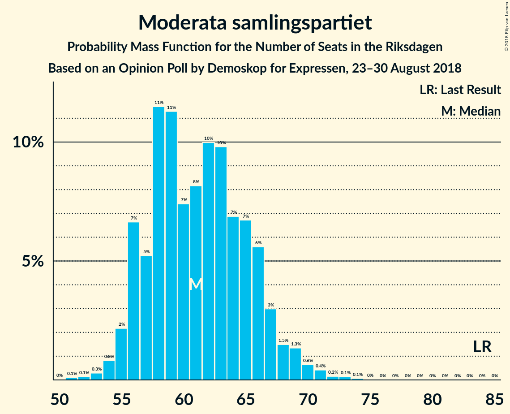
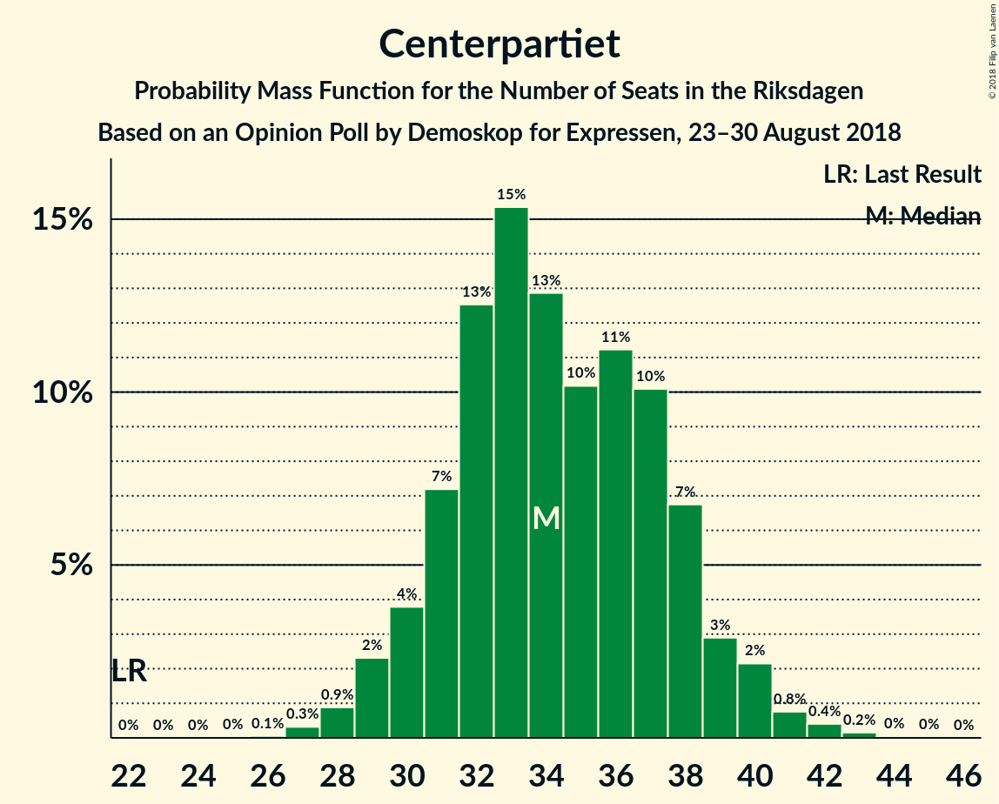
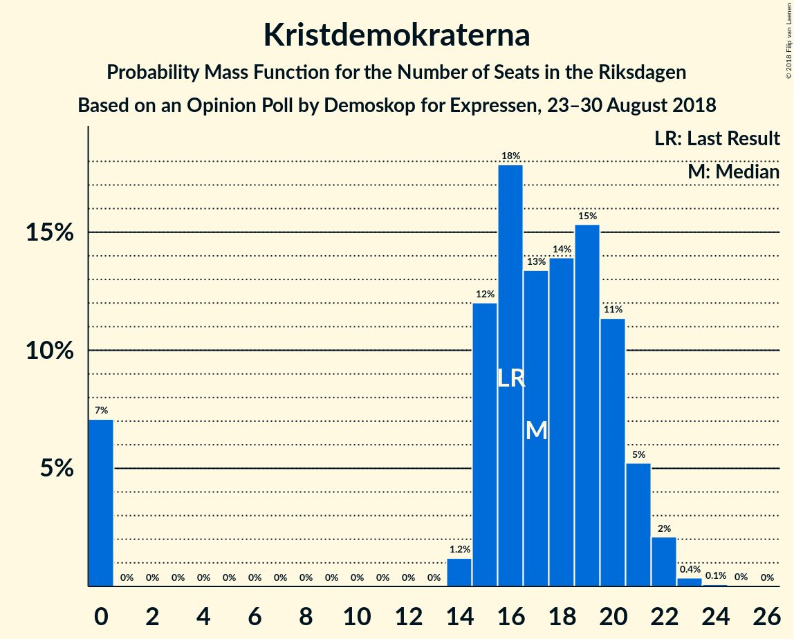

# Opinion Poll by Demoskop for Expressen, 23–30 August 2018

<a href="#voting-intentions">Voting Intentions</a> | <a href="#seats">Seats</a> | <a href="#coalitions">Coalitions</a> | <a href="#technical-information">Technical Information</a>

## Voting Intentions

### Confidence Intervals

| Party | Last Result | Poll Result | 80% Confidence Interval | 90% Confidence Interval | 95% Confidence Interval | 99% Confidence Interval |
|:-----:|:-----------:|:-----------:|:-----------------------:|:-----------------------:|:-----------------------:|:-----------------------:|
| Sveriges socialdemokratiska arbetareparti | 31.0% | 24.6% | 23.2–26.0% |22.8–26.4% |22.5–26.7% |21.9–27.4% |
| Sverigedemokraterna | 12.9% | 19.8% | 18.6–21.1% |18.2–21.5% |17.9–21.8% |17.4–22.5% |
| Moderata samlingspartiet | 23.3% | 17.1% | 16.0–18.4% |15.6–18.7% |15.3–19.0% |14.8–19.6% |
| Centerpartiet | 6.1% | 9.5% | 8.7–10.5% |8.4–10.8% |8.2–11.1% |7.8–11.6% |
| Vänsterpartiet | 5.7% | 9.5% | 8.7–10.5% |8.4–10.8% |8.2–11.1% |7.8–11.6% |
| Liberalerna | 5.4% | 6.8% | 6.1–7.7% |5.9–8.0% |5.7–8.2% |5.4–8.6% |
| Miljöpartiet de gröna | 6.9% | 5.1% | 4.5–5.9% |4.3–6.1% |4.1–6.3% |3.8–6.7% |
| Kristdemokraterna | 4.6% | 4.8% | 4.2–5.6% |4.0–5.8% |3.9–6.0% |3.6–6.3% |
| Feministiskt initiativ | 3.1% | 0.8% | 0.6–1.2% |0.5–1.3% |0.5–1.4% |0.4–1.6% |

*Note:* The poll result column reflects the actual value used in the calculations. Published results may vary slightly, and in addition be rounded to fewer digits.

## Seats

### Confidence Intervals

| Party | Last Result | Median | 80% Confidence Interval | 90% Confidence Interval | 95% Confidence Interval | 99% Confidence Interval |
|:-----:|:-----------:|:------:|:-----------------------:|:-----------------------:|:-----------------------:|:-----------------------:|
| <a href="#sveriges-socialdemokratiska-arbetareparti">Sveriges socialdemokratiska arbetareparti</a> | 113 | 89 | 83–95 |81–96 |79–97 |78–101 |
| <a href="#sverigedemokraterna">Sverigedemokraterna</a> | 49 | 71 | 66–76 |65–78 |64–79 |62–82 |
| <a href="#moderata-samlingspartiet">Moderata samlingspartiet</a> | 84 | 61 | 58–66 |57–68 |56–69 |53–71 |
| <a href="#centerpartiet">Centerpartiet</a> | 22 | 33 | 31–37 |30–38 |29–40 |28–42 |
| <a href="#vänsterpartiet">Vänsterpartiet</a> | 21 | 34 | 31–37 |30–39 |30–40 |28–41 |
| <a href="#liberalerna">Liberalerna</a> | 19 | 25 | 21–27 |21–28 |20–29 |19–31 |
| <a href="#miljöpartiet-de-gröna">Miljöpartiet de gröna</a> | 25 | 20 | 16–23 |15–23 |15–23 |0–24 |
| <a href="#kristdemokraterna">Kristdemokraterna</a> | 16 | 17 | 14–21 |0–22 |0–22 |0–23 |
| <a href="#feministiskt-initiativ">Feministiskt initiativ</a> | 0 | 0 | 0 |0 |0 |0 |

### Sveriges socialdemokratiska arbetareparti

*For a full overview of the results for this party, see the [Sveriges socialdemokratiska arbetareparti](party-sverigessocialdemokratiskaarbetareparti.html) page.*

| Number of Seats | Probability | Accumulated | Special Marks |
|:---------------:|:-----------:|:-----------:|:-------------:|
| 76 | 0.1% | 100% |  |
| 77 | 0.1% | 99.8% |  |
| 78 | 0.4% | 99.8% |  |
| 79 | 2% | 99.3% |  |
| 80 | 0.7% | 97% |  |
| 81 | 2% | 97% |  |
| 82 | 1.0% | 95% |  |
| 83 | 8% | 94% |  |
| 84 | 10% | 86% |  |
| 85 | 5% | 76% |  |
| 86 | 7% | 71% |  |
| 87 | 3% | 64% |  |
| 88 | 6% | 61% |  |
| 89 | 7% | 55% | Median |
| 90 | 8% | 48% |  |
| 91 | 13% | 40% |  |
| 92 | 3% | 27% |  |
| 93 | 4% | 24% |  |
| 94 | 2% | 20% |  |
| 95 | 13% | 18% |  |
| 96 | 0.4% | 5% |  |
| 97 | 2% | 5% |  |
| 98 | 1.0% | 2% |  |
| 99 | 0.2% | 1.3% |  |
| 100 | 0.2% | 1.1% |  |
| 101 | 0.7% | 0.9% |  |
| 102 | 0.1% | 0.2% |  |
| 103 | 0% | 0% |  |
| 104 | 0% | 0% |  |
| 105 | 0% | 0% |  |
| 106 | 0% | 0% |  |
| 107 | 0% | 0% |  |
| 108 | 0% | 0% |  |
| 109 | 0% | 0% |  |
| 110 | 0% | 0% |  |
| 111 | 0% | 0% |  |
| 112 | 0% | 0% |  |
| 113 | 0% | 0% | Last Result |

### Sverigedemokraterna

*For a full overview of the results for this party, see the [Sverigedemokraterna](party-sverigedemokraterna.html) page.*

| Number of Seats | Probability | Accumulated | Special Marks |
|:---------------:|:-----------:|:-----------:|:-------------:|
| 49 | 0% | 100% | Last Result |
| 50 | 0% | 100% |  |
| 51 | 0% | 100% |  |
| 52 | 0% | 100% |  |
| 53 | 0% | 100% |  |
| 54 | 0% | 100% |  |
| 55 | 0% | 100% |  |
| 56 | 0% | 100% |  |
| 57 | 0% | 100% |  |
| 58 | 0% | 100% |  |
| 59 | 0.1% | 100% |  |
| 60 | 0.1% | 99.9% |  |
| 61 | 0.1% | 99.9% |  |
| 62 | 0.4% | 99.7% |  |
| 63 | 0.9% | 99.3% |  |
| 64 | 3% | 98% |  |
| 65 | 4% | 96% |  |
| 66 | 4% | 91% |  |
| 67 | 1.1% | 87% |  |
| 68 | 9% | 86% |  |
| 69 | 17% | 77% |  |
| 70 | 9% | 60% |  |
| 71 | 10% | 52% | Median |
| 72 | 8% | 41% |  |
| 73 | 8% | 33% |  |
| 74 | 4% | 24% |  |
| 75 | 6% | 21% |  |
| 76 | 5% | 15% |  |
| 77 | 4% | 10% |  |
| 78 | 3% | 6% |  |
| 79 | 2% | 3% |  |
| 80 | 0.3% | 1.0% |  |
| 81 | 0.1% | 0.7% |  |
| 82 | 0.3% | 0.5% |  |
| 83 | 0.1% | 0.2% |  |
| 84 | 0% | 0.1% |  |
| 85 | 0.1% | 0.1% |  |
| 86 | 0% | 0% |  |

### Moderata samlingspartiet

*For a full overview of the results for this party, see the [Moderata samlingspartiet](party-moderatasamlingspartiet.html) page.*

| Number of Seats | Probability | Accumulated | Special Marks |
|:---------------:|:-----------:|:-----------:|:-------------:|
| 50 | 0% | 100% |  |
| 51 | 0.1% | 99.9% |  |
| 52 | 0.1% | 99.9% |  |
| 53 | 0.3% | 99.8% |  |
| 54 | 0.9% | 99.4% |  |
| 55 | 0.9% | 98.5% |  |
| 56 | 2% | 98% |  |
| 57 | 6% | 96% |  |
| 58 | 17% | 90% |  |
| 59 | 17% | 73% |  |
| 60 | 6% | 56% |  |
| 61 | 9% | 50% | Median |
| 62 | 10% | 41% |  |
| 63 | 10% | 32% |  |
| 64 | 5% | 22% |  |
| 65 | 6% | 17% |  |
| 66 | 3% | 11% |  |
| 67 | 3% | 8% |  |
| 68 | 2% | 6% |  |
| 69 | 3% | 4% |  |
| 70 | 0.7% | 1.3% |  |
| 71 | 0.3% | 0.6% |  |
| 72 | 0.1% | 0.3% |  |
| 73 | 0.1% | 0.2% |  |
| 74 | 0.1% | 0.2% |  |
| 75 | 0% | 0% |  |
| 76 | 0% | 0% |  |
| 77 | 0% | 0% |  |
| 78 | 0% | 0% |  |
| 79 | 0% | 0% |  |
| 80 | 0% | 0% |  |
| 81 | 0% | 0% |  |
| 82 | 0% | 0% |  |
| 83 | 0% | 0% |  |
| 84 | 0% | 0% | Last Result |

### Centerpartiet

*For a full overview of the results for this party, see the [Centerpartiet](party-centerpartiet.html) page.*

| Number of Seats | Probability | Accumulated | Special Marks |
|:---------------:|:-----------:|:-----------:|:-------------:|
| 22 | 0% | 100% | Last Result |
| 23 | 0% | 100% |  |
| 24 | 0% | 100% |  |
| 25 | 0% | 100% |  |
| 26 | 0.1% | 100% |  |
| 27 | 0.2% | 99.9% |  |
| 28 | 1.1% | 99.7% |  |
| 29 | 2% | 98.6% |  |
| 30 | 2% | 96% |  |
| 31 | 9% | 94% |  |
| 32 | 22% | 85% |  |
| 33 | 13% | 62% | Median |
| 34 | 16% | 50% |  |
| 35 | 8% | 34% |  |
| 36 | 8% | 26% |  |
| 37 | 11% | 18% |  |
| 38 | 3% | 8% |  |
| 39 | 2% | 5% |  |
| 40 | 2% | 3% |  |
| 41 | 0.4% | 1.1% |  |
| 42 | 0.4% | 0.7% |  |
| 43 | 0.2% | 0.3% |  |
| 44 | 0% | 0% |  |

### Vänsterpartiet

*For a full overview of the results for this party, see the [Vänsterpartiet](party-vänsterpartiet.html) page.*

| Number of Seats | Probability | Accumulated | Special Marks |
|:---------------:|:-----------:|:-----------:|:-------------:|
| 21 | 0% | 100% | Last Result |
| 22 | 0% | 100% |  |
| 23 | 0% | 100% |  |
| 24 | 0% | 100% |  |
| 25 | 0% | 100% |  |
| 26 | 0.1% | 100% |  |
| 27 | 0.1% | 99.9% |  |
| 28 | 0.8% | 99.8% |  |
| 29 | 1.1% | 99.0% |  |
| 30 | 5% | 98% |  |
| 31 | 4% | 93% |  |
| 32 | 5% | 88% |  |
| 33 | 15% | 84% |  |
| 34 | 24% | 68% | Median |
| 35 | 15% | 45% |  |
| 36 | 12% | 30% |  |
| 37 | 9% | 18% |  |
| 38 | 4% | 9% |  |
| 39 | 2% | 6% |  |
| 40 | 3% | 4% |  |
| 41 | 0.6% | 0.9% |  |
| 42 | 0.2% | 0.3% |  |
| 43 | 0.1% | 0.2% |  |
| 44 | 0.1% | 0.1% |  |
| 45 | 0% | 0% |  |

### Liberalerna

*For a full overview of the results for this party, see the [Liberalerna](party-liberalerna.html) page.*

| Number of Seats | Probability | Accumulated | Special Marks |
|:---------------:|:-----------:|:-----------:|:-------------:|
| 18 | 0.2% | 100% |  |
| 19 | 0.9% | 99.8% | Last Result |
| 20 | 4% | 98.9% |  |
| 21 | 7% | 95% |  |
| 22 | 7% | 88% |  |
| 23 | 8% | 81% |  |
| 24 | 15% | 73% |  |
| 25 | 23% | 58% | Median |
| 26 | 14% | 35% |  |
| 27 | 12% | 21% |  |
| 28 | 4% | 9% |  |
| 29 | 3% | 5% |  |
| 30 | 1.4% | 2% |  |
| 31 | 0.5% | 0.8% |  |
| 32 | 0.2% | 0.3% |  |
| 33 | 0.1% | 0.1% |  |
| 34 | 0% | 0% |  |

### Miljöpartiet de gröna

*For a full overview of the results for this party, see the [Miljöpartiet de gröna](party-miljöpartietdegröna.html) page.*

| Number of Seats | Probability | Accumulated | Special Marks |
|:---------------:|:-----------:|:-----------:|:-------------:|
| 0 | 2% | 100% |  |
| 1 | 0% | 98% |  |
| 2 | 0% | 98% |  |
| 3 | 0% | 98% |  |
| 4 | 0% | 98% |  |
| 5 | 0% | 98% |  |
| 6 | 0% | 98% |  |
| 7 | 0% | 98% |  |
| 8 | 0% | 98% |  |
| 9 | 0% | 98% |  |
| 10 | 0% | 98% |  |
| 11 | 0% | 98% |  |
| 12 | 0% | 98% |  |
| 13 | 0% | 98% |  |
| 14 | 0.7% | 98% |  |
| 15 | 3% | 98% |  |
| 16 | 9% | 95% |  |
| 17 | 7% | 86% |  |
| 18 | 16% | 79% |  |
| 19 | 13% | 63% |  |
| 20 | 19% | 50% | Median |
| 21 | 15% | 31% |  |
| 22 | 5% | 16% |  |
| 23 | 10% | 11% |  |
| 24 | 0.8% | 1.0% |  |
| 25 | 0.1% | 0.2% | Last Result |
| 26 | 0.1% | 0.1% |  |
| 27 | 0% | 0% |  |

### Kristdemokraterna

*For a full overview of the results for this party, see the [Kristdemokraterna](party-kristdemokraterna.html) page.*

| Number of Seats | Probability | Accumulated | Special Marks |
|:---------------:|:-----------:|:-----------:|:-------------:|
| 0 | 7% | 100% |  |
| 1 | 0% | 93% |  |
| 2 | 0% | 93% |  |
| 3 | 0% | 93% |  |
| 4 | 0% | 93% |  |
| 5 | 0% | 93% |  |
| 6 | 0% | 93% |  |
| 7 | 0% | 93% |  |
| 8 | 0% | 93% |  |
| 9 | 0% | 93% |  |
| 10 | 0% | 93% |  |
| 11 | 0% | 93% |  |
| 12 | 0% | 93% |  |
| 13 | 0% | 93% |  |
| 14 | 3% | 93% |  |
| 15 | 12% | 90% |  |
| 16 | 24% | 77% | Last Result |
| 17 | 18% | 53% | Median |
| 18 | 14% | 35% |  |
| 19 | 5% | 22% |  |
| 20 | 6% | 17% |  |
| 21 | 5% | 11% |  |
| 22 | 5% | 6% |  |
| 23 | 0.6% | 0.6% |  |
| 24 | 0% | 0.1% |  |
| 25 | 0% | 0% |  |

### Feministiskt initiativ

*For a full overview of the results for this party, see the [Feministiskt initiativ](party-feministisktinitiativ.html) page.*

| Number of Seats | Probability | Accumulated | Special Marks |
|:---------------:|:-----------:|:-----------:|:-------------:|
| 0 | 100% | 100% | Last Result, Median |

## Coalitions

### Confidence Intervals

| Coalition | Last Result | Median | Majority? | 80% Confidence Interval | 90% Confidence Interval | 95% Confidence Interval | 99% Confidence Interval |
|:---------:|:-----------:|:------:|:---------:|:-----------------------:|:-----------------------:|:-----------------------:|:-----------------------:|
| Sveriges socialdemokratiska arbetareparti – Moderata samlingspartiet – Centerpartiet | 219 | 185 | 98% | 177–190 | 176–193 | 175–195 | 172–198 |
| Sveriges socialdemokratiska arbetareparti – Moderata samlingspartiet | 197 | 150 | 0% | 143–155 | 142–158 | 141–160 | 138–163 |
| Sverigedemokraterna – Moderata samlingspartiet – Kristdemokraterna | 149 | 149 | 0% | 142–156 | 139–157 | 135–158 | 134–163 |
| Sveriges socialdemokratiska arbetareparti – Vänsterpartiet – Miljöpartiet de gröna – Feministiskt initiativ | 159 | 142 | 0% | 136–149 | 133–150 | 132–153 | 127–155 |
| Sveriges socialdemokratiska arbetareparti – Vänsterpartiet – Miljöpartiet de gröna | 159 | 142 | 0% | 136–149 | 133–150 | 132–153 | 127–155 |
| Moderata samlingspartiet – Centerpartiet – Liberalerna – Kristdemokraterna | 141 | 135 | 0% | 130–144 | 122–147 | 121–147 | 118–149 |
| Sverigedemokraterna – Moderata samlingspartiet | 133 | 132 | 0% | 127–139 | 126–141 | 125–143 | 121–146 |
| Sveriges socialdemokratiska arbetareparti – Vänsterpartiet | 134 | 123 | 0% | 117–129 | 116–131 | 114–134 | 110–138 |
| Moderata samlingspartiet – Centerpartiet – Liberalerna | 125 | 119 | 0% | 115–126 | 113–129 | 112–130 | 110–132 |
| Moderata samlingspartiet – Centerpartiet – Kristdemokraterna | 122 | 110 | 0% | 106–120 | 98–121 | 96–121 | 94–124 |
| Sveriges socialdemokratiska arbetareparti – Miljöpartiet de gröna | 138 | 108 | 0% | 101–115 | 99–115 | 97–116 | 93–118 |
| Moderata samlingspartiet – Centerpartiet | 106 | 94 | 0% | 90–101 | 90–103 | 88–104 | 86–107 |

### Sveriges socialdemokratiska arbetareparti – Moderata samlingspartiet – Centerpartiet

| Number of Seats | Probability | Accumulated | Special Marks |
|:---------------:|:-----------:|:-----------:|:-------------:|
| 168 | 0.1% | 100% |  |
| 169 | 0.1% | 99.9% |  |
| 170 | 0.2% | 99.8% |  |
| 171 | 0.1% | 99.6% |  |
| 172 | 0.6% | 99.6% |  |
| 173 | 0.9% | 99.0% |  |
| 174 | 0.4% | 98% |  |
| 175 | 1.4% | 98% | Majority |
| 176 | 4% | 96% |  |
| 177 | 7% | 93% |  |
| 178 | 1.3% | 86% |  |
| 179 | 5% | 84% |  |
| 180 | 3% | 80% |  |
| 181 | 11% | 76% |  |
| 182 | 4% | 65% |  |
| 183 | 9% | 61% | Median |
| 184 | 2% | 52% |  |
| 185 | 16% | 50% |  |
| 186 | 8% | 34% |  |
| 187 | 9% | 27% |  |
| 188 | 4% | 18% |  |
| 189 | 4% | 14% |  |
| 190 | 0.9% | 10% |  |
| 191 | 2% | 9% |  |
| 192 | 2% | 8% |  |
| 193 | 2% | 6% |  |
| 194 | 0.9% | 4% |  |
| 195 | 1.4% | 3% |  |
| 196 | 0.3% | 1.2% |  |
| 197 | 0.4% | 0.9% |  |
| 198 | 0.1% | 0.6% |  |
| 199 | 0.1% | 0.4% |  |
| 200 | 0% | 0.3% |  |
| 201 | 0.1% | 0.3% |  |
| 202 | 0% | 0.2% |  |
| 203 | 0% | 0.2% |  |
| 204 | 0% | 0.2% |  |
| 205 | 0% | 0.2% |  |
| 206 | 0.1% | 0.1% |  |
| 207 | 0% | 0% |  |
| 208 | 0% | 0% |  |
| 209 | 0% | 0% |  |
| 210 | 0% | 0% |  |
| 211 | 0% | 0% |  |
| 212 | 0% | 0% |  |
| 213 | 0% | 0% |  |
| 214 | 0% | 0% |  |
| 215 | 0% | 0% |  |
| 216 | 0% | 0% |  |
| 217 | 0% | 0% |  |
| 218 | 0% | 0% |  |
| 219 | 0% | 0% | Last Result |

### Sveriges socialdemokratiska arbetareparti – Moderata samlingspartiet

| Number of Seats | Probability | Accumulated | Special Marks |
|:---------------:|:-----------:|:-----------:|:-------------:|
| 135 | 0% | 100% |  |
| 136 | 0.2% | 99.9% |  |
| 137 | 0.1% | 99.8% |  |
| 138 | 0.2% | 99.7% |  |
| 139 | 0.7% | 99.5% |  |
| 140 | 0.7% | 98.8% |  |
| 141 | 0.9% | 98% |  |
| 142 | 5% | 97% |  |
| 143 | 6% | 92% |  |
| 144 | 5% | 86% |  |
| 145 | 4% | 81% |  |
| 146 | 3% | 77% |  |
| 147 | 4% | 74% |  |
| 148 | 8% | 70% |  |
| 149 | 4% | 62% |  |
| 150 | 12% | 59% | Median |
| 151 | 4% | 47% |  |
| 152 | 3% | 43% |  |
| 153 | 20% | 40% |  |
| 154 | 4% | 20% |  |
| 155 | 6% | 16% |  |
| 156 | 3% | 10% |  |
| 157 | 2% | 7% |  |
| 158 | 1.5% | 5% |  |
| 159 | 0.9% | 4% |  |
| 160 | 2% | 3% |  |
| 161 | 0.4% | 1.1% |  |
| 162 | 0.1% | 0.7% |  |
| 163 | 0.2% | 0.6% |  |
| 164 | 0.1% | 0.4% |  |
| 165 | 0.1% | 0.3% |  |
| 166 | 0% | 0.2% |  |
| 167 | 0% | 0.2% |  |
| 168 | 0.1% | 0.2% |  |
| 169 | 0% | 0.1% |  |
| 170 | 0% | 0% |  |
| 171 | 0% | 0% |  |
| 172 | 0% | 0% |  |
| 173 | 0% | 0% |  |
| 174 | 0% | 0% |  |
| 175 | 0% | 0% | Majority |
| 176 | 0% | 0% |  |
| 177 | 0% | 0% |  |
| 178 | 0% | 0% |  |
| 179 | 0% | 0% |  |
| 180 | 0% | 0% |  |
| 181 | 0% | 0% |  |
| 182 | 0% | 0% |  |
| 183 | 0% | 0% |  |
| 184 | 0% | 0% |  |
| 185 | 0% | 0% |  |
| 186 | 0% | 0% |  |
| 187 | 0% | 0% |  |
| 188 | 0% | 0% |  |
| 189 | 0% | 0% |  |
| 190 | 0% | 0% |  |
| 191 | 0% | 0% |  |
| 192 | 0% | 0% |  |
| 193 | 0% | 0% |  |
| 194 | 0% | 0% |  |
| 195 | 0% | 0% |  |
| 196 | 0% | 0% |  |
| 197 | 0% | 0% | Last Result |

### Sverigedemokraterna – Moderata samlingspartiet – Kristdemokraterna

| Number of Seats | Probability | Accumulated | Special Marks |
|:---------------:|:-----------:|:-----------:|:-------------:|
| 128 | 0% | 100% |  |
| 129 | 0% | 99.9% |  |
| 130 | 0% | 99.9% |  |
| 131 | 0% | 99.9% |  |
| 132 | 0.1% | 99.9% |  |
| 133 | 0.1% | 99.8% |  |
| 134 | 2% | 99.6% |  |
| 135 | 0.5% | 98% |  |
| 136 | 0.4% | 97% |  |
| 137 | 0.2% | 97% |  |
| 138 | 0.3% | 97% |  |
| 139 | 2% | 96% |  |
| 140 | 0.4% | 94% |  |
| 141 | 0.9% | 94% |  |
| 142 | 5% | 93% |  |
| 143 | 15% | 88% |  |
| 144 | 1.1% | 72% |  |
| 145 | 7% | 71% |  |
| 146 | 3% | 64% |  |
| 147 | 3% | 61% |  |
| 148 | 5% | 58% |  |
| 149 | 15% | 53% | Last Result, Median |
| 150 | 1.4% | 38% |  |
| 151 | 8% | 37% |  |
| 152 | 10% | 28% |  |
| 153 | 4% | 19% |  |
| 154 | 2% | 15% |  |
| 155 | 0.7% | 13% |  |
| 156 | 6% | 13% |  |
| 157 | 2% | 7% |  |
| 158 | 3% | 5% |  |
| 159 | 0.7% | 2% |  |
| 160 | 0.1% | 1.4% |  |
| 161 | 0.1% | 1.3% |  |
| 162 | 0.6% | 1.2% |  |
| 163 | 0.4% | 0.7% |  |
| 164 | 0.1% | 0.3% |  |
| 165 | 0.1% | 0.2% |  |
| 166 | 0% | 0.1% |  |
| 167 | 0% | 0.1% |  |
| 168 | 0% | 0% |  |

### Sveriges socialdemokratiska arbetareparti – Vänsterpartiet – Miljöpartiet de gröna – Feministiskt initiativ

| Number of Seats | Probability | Accumulated | Special Marks |
|:---------------:|:-----------:|:-----------:|:-------------:|
| 122 | 0% | 100% |  |
| 123 | 0% | 99.9% |  |
| 124 | 0.1% | 99.9% |  |
| 125 | 0% | 99.8% |  |
| 126 | 0.1% | 99.8% |  |
| 127 | 0.3% | 99.6% |  |
| 128 | 0.2% | 99.3% |  |
| 129 | 0.3% | 99.1% |  |
| 130 | 0.7% | 98.8% |  |
| 131 | 0.2% | 98% |  |
| 132 | 2% | 98% |  |
| 133 | 1.2% | 96% |  |
| 134 | 2% | 95% |  |
| 135 | 1.3% | 93% |  |
| 136 | 7% | 91% |  |
| 137 | 3% | 85% |  |
| 138 | 8% | 81% |  |
| 139 | 7% | 74% |  |
| 140 | 12% | 67% |  |
| 141 | 2% | 55% |  |
| 142 | 8% | 53% |  |
| 143 | 5% | 45% | Median |
| 144 | 2% | 41% |  |
| 145 | 6% | 38% |  |
| 146 | 0.5% | 33% |  |
| 147 | 7% | 32% |  |
| 148 | 4% | 26% |  |
| 149 | 14% | 21% |  |
| 150 | 4% | 8% |  |
| 151 | 0.4% | 3% |  |
| 152 | 0.3% | 3% |  |
| 153 | 2% | 3% |  |
| 154 | 0.2% | 0.9% |  |
| 155 | 0.7% | 0.8% |  |
| 156 | 0% | 0.1% |  |
| 157 | 0% | 0% |  |
| 158 | 0% | 0% |  |
| 159 | 0% | 0% | Last Result |

### Sveriges socialdemokratiska arbetareparti – Vänsterpartiet – Miljöpartiet de gröna

| Number of Seats | Probability | Accumulated | Special Marks |
|:---------------:|:-----------:|:-----------:|:-------------:|
| 122 | 0% | 100% |  |
| 123 | 0% | 99.9% |  |
| 124 | 0.1% | 99.9% |  |
| 125 | 0% | 99.8% |  |
| 126 | 0.1% | 99.8% |  |
| 127 | 0.3% | 99.6% |  |
| 128 | 0.2% | 99.3% |  |
| 129 | 0.3% | 99.1% |  |
| 130 | 0.7% | 98.8% |  |
| 131 | 0.2% | 98% |  |
| 132 | 2% | 98% |  |
| 133 | 1.2% | 96% |  |
| 134 | 2% | 95% |  |
| 135 | 1.3% | 93% |  |
| 136 | 7% | 91% |  |
| 137 | 3% | 85% |  |
| 138 | 8% | 81% |  |
| 139 | 7% | 74% |  |
| 140 | 12% | 67% |  |
| 141 | 2% | 55% |  |
| 142 | 8% | 53% |  |
| 143 | 5% | 45% | Median |
| 144 | 2% | 41% |  |
| 145 | 6% | 38% |  |
| 146 | 0.5% | 33% |  |
| 147 | 7% | 32% |  |
| 148 | 4% | 26% |  |
| 149 | 14% | 21% |  |
| 150 | 4% | 8% |  |
| 151 | 0.4% | 3% |  |
| 152 | 0.3% | 3% |  |
| 153 | 2% | 3% |  |
| 154 | 0.2% | 0.9% |  |
| 155 | 0.7% | 0.8% |  |
| 156 | 0% | 0.1% |  |
| 157 | 0% | 0% |  |
| 158 | 0% | 0% |  |
| 159 | 0% | 0% | Last Result |

### Moderata samlingspartiet – Centerpartiet – Liberalerna – Kristdemokraterna

| Number of Seats | Probability | Accumulated | Special Marks |
|:---------------:|:-----------:|:-----------:|:-------------:|
| 118 | 0.6% | 100% |  |
| 119 | 0.1% | 99.3% |  |
| 120 | 0% | 99.2% |  |
| 121 | 2% | 99.2% |  |
| 122 | 2% | 97% |  |
| 123 | 0.1% | 95% |  |
| 124 | 0.7% | 95% |  |
| 125 | 0.2% | 94% |  |
| 126 | 0.5% | 94% |  |
| 127 | 0.4% | 93% |  |
| 128 | 0.4% | 93% |  |
| 129 | 2% | 93% |  |
| 130 | 1.4% | 91% |  |
| 131 | 16% | 89% |  |
| 132 | 2% | 74% |  |
| 133 | 9% | 72% |  |
| 134 | 9% | 63% |  |
| 135 | 9% | 54% |  |
| 136 | 8% | 45% | Median |
| 137 | 3% | 37% |  |
| 138 | 5% | 34% |  |
| 139 | 2% | 29% |  |
| 140 | 5% | 27% |  |
| 141 | 3% | 22% | Last Result |
| 142 | 2% | 18% |  |
| 143 | 3% | 16% |  |
| 144 | 5% | 13% |  |
| 145 | 0.3% | 8% |  |
| 146 | 3% | 8% |  |
| 147 | 3% | 5% |  |
| 148 | 0.9% | 2% |  |
| 149 | 0.8% | 1.1% |  |
| 150 | 0.1% | 0.3% |  |
| 151 | 0.1% | 0.2% |  |
| 152 | 0.1% | 0.1% |  |
| 153 | 0% | 0% |  |

### Sverigedemokraterna – Moderata samlingspartiet

| Number of Seats | Probability | Accumulated | Special Marks |
|:---------------:|:-----------:|:-----------:|:-------------:|
| 118 | 0.1% | 100% |  |
| 119 | 0.1% | 99.9% |  |
| 120 | 0.1% | 99.8% |  |
| 121 | 0.3% | 99.7% |  |
| 122 | 0.1% | 99.5% |  |
| 123 | 1.0% | 99.4% |  |
| 124 | 0.5% | 98% |  |
| 125 | 2% | 98% |  |
| 126 | 2% | 96% |  |
| 127 | 20% | 94% |  |
| 128 | 5% | 74% |  |
| 129 | 2% | 69% |  |
| 130 | 10% | 67% |  |
| 131 | 3% | 57% |  |
| 132 | 11% | 54% | Median |
| 133 | 5% | 42% | Last Result |
| 134 | 9% | 37% |  |
| 135 | 9% | 28% |  |
| 136 | 2% | 19% |  |
| 137 | 1.0% | 17% |  |
| 138 | 3% | 16% |  |
| 139 | 3% | 13% |  |
| 140 | 3% | 10% |  |
| 141 | 3% | 6% |  |
| 142 | 0.3% | 3% |  |
| 143 | 0.6% | 3% |  |
| 144 | 0.1% | 2% |  |
| 145 | 0.6% | 2% |  |
| 146 | 1.2% | 1.5% |  |
| 147 | 0.1% | 0.3% |  |
| 148 | 0% | 0.2% |  |
| 149 | 0% | 0.1% |  |
| 150 | 0% | 0.1% |  |
| 151 | 0% | 0.1% |  |
| 152 | 0% | 0.1% |  |
| 153 | 0% | 0.1% |  |
| 154 | 0% | 0% |  |

### Sveriges socialdemokratiska arbetareparti – Vänsterpartiet

| Number of Seats | Probability | Accumulated | Special Marks |
|:---------------:|:-----------:|:-----------:|:-------------:|
| 106 | 0.1% | 100% |  |
| 107 | 0% | 99.9% |  |
| 108 | 0.1% | 99.9% |  |
| 109 | 0.2% | 99.9% |  |
| 110 | 0.2% | 99.6% |  |
| 111 | 0.1% | 99.5% |  |
| 112 | 0.5% | 99.4% |  |
| 113 | 0.6% | 98.9% |  |
| 114 | 0.9% | 98% |  |
| 115 | 2% | 97% |  |
| 116 | 3% | 95% |  |
| 117 | 6% | 93% |  |
| 118 | 5% | 87% |  |
| 119 | 9% | 81% |  |
| 120 | 6% | 72% |  |
| 121 | 6% | 67% |  |
| 122 | 8% | 60% |  |
| 123 | 8% | 53% | Median |
| 124 | 7% | 45% |  |
| 125 | 4% | 38% |  |
| 126 | 5% | 35% |  |
| 127 | 5% | 29% |  |
| 128 | 1.0% | 25% |  |
| 129 | 14% | 24% |  |
| 130 | 1.3% | 9% |  |
| 131 | 4% | 8% |  |
| 132 | 0.9% | 4% |  |
| 133 | 0.6% | 3% |  |
| 134 | 0.2% | 3% | Last Result |
| 135 | 1.4% | 2% |  |
| 136 | 0.3% | 1.1% |  |
| 137 | 0.1% | 0.8% |  |
| 138 | 0.7% | 0.7% |  |
| 139 | 0% | 0% |  |

### Moderata samlingspartiet – Centerpartiet – Liberalerna

| Number of Seats | Probability | Accumulated | Special Marks |
|:---------------:|:-----------:|:-----------:|:-------------:|
| 107 | 0.1% | 100% |  |
| 108 | 0.2% | 99.9% |  |
| 109 | 0.1% | 99.7% |  |
| 110 | 0.4% | 99.6% |  |
| 111 | 0.4% | 99.2% |  |
| 112 | 1.4% | 98.8% |  |
| 113 | 4% | 97% |  |
| 114 | 1.3% | 93% |  |
| 115 | 18% | 92% |  |
| 116 | 1.0% | 75% |  |
| 117 | 7% | 74% |  |
| 118 | 9% | 67% |  |
| 119 | 14% | 58% | Median |
| 120 | 9% | 44% |  |
| 121 | 6% | 35% |  |
| 122 | 5% | 28% |  |
| 123 | 6% | 23% |  |
| 124 | 5% | 17% |  |
| 125 | 1.4% | 12% | Last Result |
| 126 | 2% | 11% |  |
| 127 | 1.2% | 9% |  |
| 128 | 1.0% | 7% |  |
| 129 | 4% | 6% |  |
| 130 | 0.4% | 3% |  |
| 131 | 1.0% | 2% |  |
| 132 | 1.0% | 1.5% |  |
| 133 | 0.1% | 0.4% |  |
| 134 | 0.1% | 0.3% |  |
| 135 | 0.1% | 0.2% |  |
| 136 | 0.1% | 0.1% |  |
| 137 | 0% | 0% |  |

### Moderata samlingspartiet – Centerpartiet – Kristdemokraterna

| Number of Seats | Probability | Accumulated | Special Marks |
|:---------------:|:-----------:|:-----------:|:-------------:|
| 92 | 0.1% | 100% |  |
| 93 | 0% | 99.9% |  |
| 94 | 0.8% | 99.8% |  |
| 95 | 0.1% | 99.1% |  |
| 96 | 2% | 99.0% |  |
| 97 | 0.4% | 97% |  |
| 98 | 2% | 97% |  |
| 99 | 0.9% | 95% |  |
| 100 | 0.1% | 94% |  |
| 101 | 0.1% | 94% |  |
| 102 | 0.2% | 93% |  |
| 103 | 0.2% | 93% |  |
| 104 | 0.7% | 93% |  |
| 105 | 1.3% | 92% |  |
| 106 | 12% | 91% |  |
| 107 | 6% | 79% |  |
| 108 | 6% | 73% |  |
| 109 | 6% | 67% |  |
| 110 | 11% | 60% |  |
| 111 | 8% | 49% | Median |
| 112 | 6% | 41% |  |
| 113 | 3% | 35% |  |
| 114 | 4% | 32% |  |
| 115 | 5% | 27% |  |
| 116 | 3% | 22% |  |
| 117 | 2% | 19% |  |
| 118 | 2% | 17% |  |
| 119 | 5% | 16% |  |
| 120 | 3% | 11% |  |
| 121 | 5% | 7% |  |
| 122 | 1.2% | 2% | Last Result |
| 123 | 0.5% | 1.2% |  |
| 124 | 0.2% | 0.7% |  |
| 125 | 0.4% | 0.5% |  |
| 126 | 0% | 0.1% |  |
| 127 | 0.1% | 0.1% |  |
| 128 | 0% | 0% |  |

### Sveriges socialdemokratiska arbetareparti – Miljöpartiet de gröna

| Number of Seats | Probability | Accumulated | Special Marks |
|:---------------:|:-----------:|:-----------:|:-------------:|
| 87 | 0% | 100% |  |
| 88 | 0.1% | 99.9% |  |
| 89 | 0% | 99.8% |  |
| 90 | 0.1% | 99.8% |  |
| 91 | 0.1% | 99.7% |  |
| 92 | 0.1% | 99.7% |  |
| 93 | 0.2% | 99.6% |  |
| 94 | 0.1% | 99.4% |  |
| 95 | 0.3% | 99.3% |  |
| 96 | 0.9% | 99.0% |  |
| 97 | 2% | 98% |  |
| 98 | 1.5% | 97% |  |
| 99 | 2% | 95% |  |
| 100 | 3% | 93% |  |
| 101 | 3% | 91% |  |
| 102 | 4% | 88% |  |
| 103 | 6% | 84% |  |
| 104 | 6% | 78% |  |
| 105 | 4% | 72% |  |
| 106 | 8% | 68% |  |
| 107 | 7% | 60% |  |
| 108 | 5% | 53% |  |
| 109 | 5% | 49% | Median |
| 110 | 9% | 43% |  |
| 111 | 3% | 35% |  |
| 112 | 12% | 32% |  |
| 113 | 0.9% | 20% |  |
| 114 | 3% | 20% |  |
| 115 | 14% | 17% |  |
| 116 | 0.8% | 3% |  |
| 117 | 1.1% | 2% |  |
| 118 | 0.8% | 1.2% |  |
| 119 | 0.2% | 0.3% |  |
| 120 | 0.1% | 0.1% |  |
| 121 | 0% | 0% |  |
| 122 | 0% | 0% |  |
| 123 | 0% | 0% |  |
| 124 | 0% | 0% |  |
| 125 | 0% | 0% |  |
| 126 | 0% | 0% |  |
| 127 | 0% | 0% |  |
| 128 | 0% | 0% |  |
| 129 | 0% | 0% |  |
| 130 | 0% | 0% |  |
| 131 | 0% | 0% |  |
| 132 | 0% | 0% |  |
| 133 | 0% | 0% |  |
| 134 | 0% | 0% |  |
| 135 | 0% | 0% |  |
| 136 | 0% | 0% |  |
| 137 | 0% | 0% |  |
| 138 | 0% | 0% | Last Result |

### Moderata samlingspartiet – Centerpartiet

| Number of Seats | Probability | Accumulated | Special Marks |
|:---------------:|:-----------:|:-----------:|:-------------:|
| 83 | 0% | 100% |  |
| 84 | 0.1% | 99.9% |  |
| 85 | 0.3% | 99.9% |  |
| 86 | 0.2% | 99.6% |  |
| 87 | 0.8% | 99.4% |  |
| 88 | 1.4% | 98.6% |  |
| 89 | 2% | 97% |  |
| 90 | 15% | 95% |  |
| 91 | 1.3% | 81% |  |
| 92 | 14% | 79% |  |
| 93 | 8% | 65% |  |
| 94 | 7% | 57% | Median |
| 95 | 6% | 50% |  |
| 96 | 10% | 44% |  |
| 97 | 10% | 33% |  |
| 98 | 5% | 23% |  |
| 99 | 6% | 18% |  |
| 100 | 2% | 13% |  |
| 101 | 2% | 11% |  |
| 102 | 2% | 9% |  |
| 103 | 4% | 7% |  |
| 104 | 1.4% | 3% |  |
| 105 | 0.8% | 2% |  |
| 106 | 0.6% | 1.2% | Last Result |
| 107 | 0.4% | 0.6% |  |
| 108 | 0.1% | 0.2% |  |
| 109 | 0.1% | 0.2% |  |
| 110 | 0% | 0.1% |  |
| 111 | 0% | 0.1% |  |
| 112 | 0% | 0% |  |

## Technical Information

### Opinion Poll

+ **Polling firm:** Demoskop
+ **Commissioner(s):** Expressen
+ **Fieldwork period:** 23–30 August 2018

### Calculations

+ **Sample size:** 1625
+ **Simulations done:** 262,144
+ **Error estimate:** 2.94%

