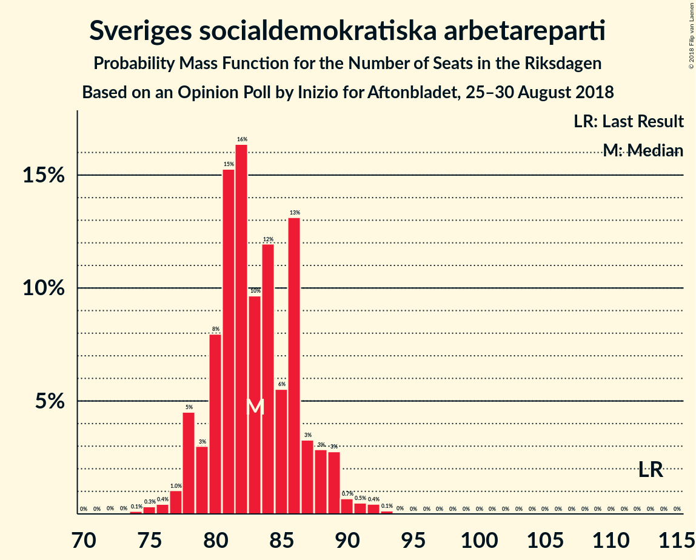
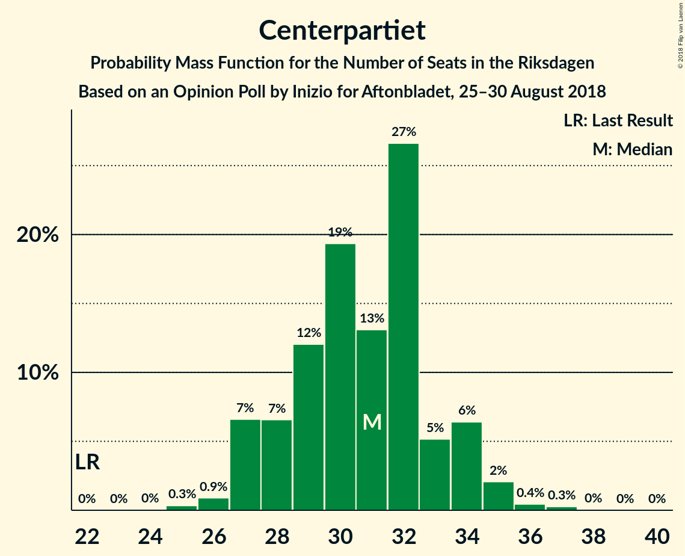
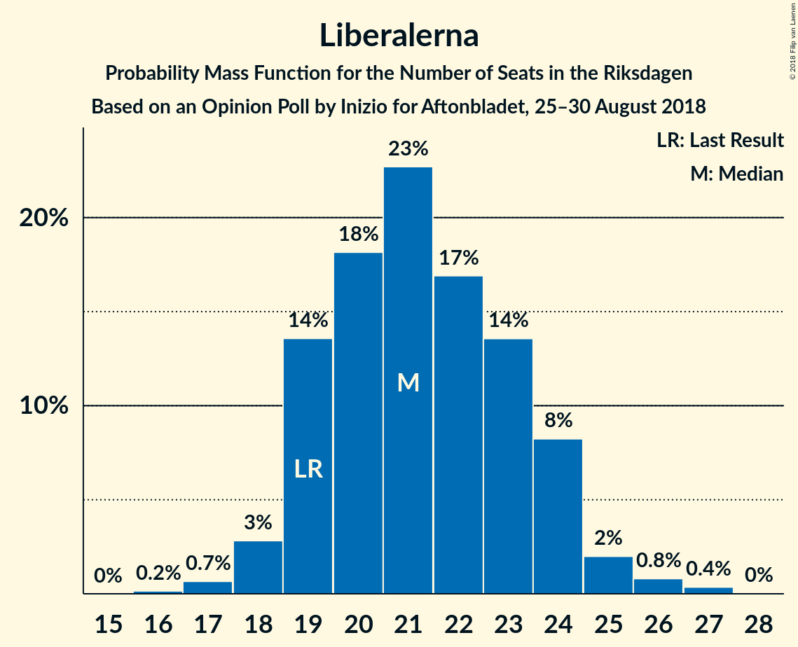
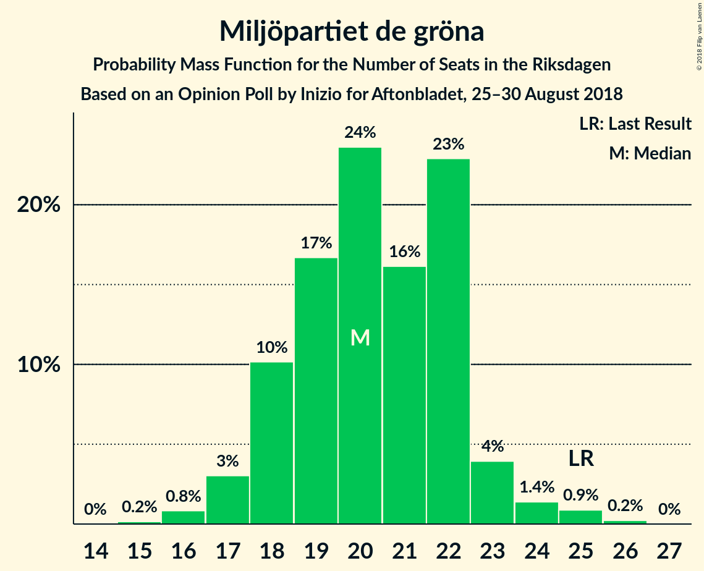

# Opinion Poll by Inizio for Aftonbladet, 25–30 August 2018

<a href="#voting-intentions">Voting Intentions</a> | <a href="#seats">Seats</a> | <a href="#coalitions">Coalitions</a> | <a href="#technical-information">Technical Information</a>

## Voting Intentions

### Confidence Intervals

| Party | Last Result | Poll Result | 80% Confidence Interval | 90% Confidence Interval | 95% Confidence Interval | 99% Confidence Interval |
|:-----:|:-----------:|:-----------:|:-----------------------:|:-----------------------:|:-----------------------:|:-----------------------:|
| Sveriges socialdemokratiska arbetareparti | 31.0% | 23.1% | 22.0–24.3% |21.7–24.6% |21.5–24.9% |20.9–25.4% |
| Moderata samlingspartiet | 23.3% | 19.5% | 18.5–20.6% |18.2–20.9% |18.0–21.2% |17.5–21.7% |
| Sverigedemokraterna | 12.9% | 18.1% | 17.1–19.2% |16.9–19.5% |16.6–19.7% |16.2–20.2% |
| Vänsterpartiet | 5.7% | 10.1% | 9.4–11.0% |9.1–11.2% |9.0–11.4% |8.6–11.8% |
| Centerpartiet | 6.1% | 8.5% | 7.8–9.3% |7.6–9.5% |7.4–9.7% |7.1–10.1% |
| Kristdemokraterna | 4.6% | 6.0% | 5.4–6.7% |5.3–6.9% |5.1–7.1% |4.8–7.4% |
| Liberalerna | 5.4% | 5.9% | 5.3–6.6% |5.1–6.8% |5.0–6.9% |4.7–7.3% |
| Miljöpartiet de gröna | 6.9% | 5.6% | 5.0–6.2% |4.9–6.4% |4.7–6.6% |4.5–6.9% |
| Feministiskt initiativ | 3.1% | 1.7% | 1.4–2.1% |1.3–2.2% |1.2–2.3% |1.1–2.5% |

*Note:* The poll result column reflects the actual value used in the calculations. Published results may vary slightly, and in addition be rounded to fewer digits.

## Seats

### Confidence Intervals

| Party | Last Result | Median | 80% Confidence Interval | 90% Confidence Interval | 95% Confidence Interval | 99% Confidence Interval |
|:-----:|:-----------:|:------:|:-----------------------:|:-----------------------:|:-----------------------:|:-----------------------:|
| <a href="#sveriges-socialdemokratiska-arbetareparti">Sveriges socialdemokratiska arbetareparti</a> | 113 | 82 | 80–86 |79–88 |78–89 |76–92 |
| <a href="#moderata-samlingspartiet">Moderata samlingspartiet</a> | 84 | 71 | 66–74 |65–75 |65–76 |64–78 |
| <a href="#sverigedemokraterna">Sverigedemokraterna</a> | 49 | 64 | 62–68 |61–70 |61–70 |59–73 |
| <a href="#vänsterpartiet">Vänsterpartiet</a> | 21 | 38 | 34–39 |33–41 |33–41 |31–42 |
| <a href="#centerpartiet">Centerpartiet</a> | 22 | 30 | 28–33 |28–34 |28–35 |26–35 |
| <a href="#kristdemokraterna">Kristdemokraterna</a> | 16 | 22 | 20–24 |19–24 |19–25 |18–26 |
| <a href="#liberalerna">Liberalerna</a> | 19 | 21 | 19–24 |19–24 |18–25 |17–27 |
| <a href="#miljöpartiet-de-gröna">Miljöpartiet de gröna</a> | 25 | 21 | 18–22 |18–23 |17–23 |16–24 |
| <a href="#feministiskt-initiativ">Feministiskt initiativ</a> | 0 | 0 | 0 |0 |0 |0 |

### Sveriges socialdemokratiska arbetareparti

*For a full overview of the results for this party, see the [Sveriges socialdemokratiska arbetareparti](party-sverigessocialdemokratiskaarbetareparti.html) page.*

| Number of Seats | Probability | Accumulated | Special Marks |
|:---------------:|:-----------:|:-----------:|:-------------:|
| 74 | 0.1% | 100% |  |
| 75 | 0.3% | 99.9% |  |
| 76 | 0.6% | 99.6% |  |
| 77 | 1.1% | 99.0% |  |
| 78 | 3% | 98% |  |
| 79 | 5% | 95% |  |
| 80 | 4% | 91% |  |
| 81 | 33% | 87% |  |
| 82 | 15% | 54% | Median |
| 83 | 7% | 39% |  |
| 84 | 10% | 32% |  |
| 85 | 6% | 22% |  |
| 86 | 8% | 17% |  |
| 87 | 4% | 9% |  |
| 88 | 0.8% | 5% |  |
| 89 | 3% | 5% |  |
| 90 | 0.4% | 1.2% |  |
| 91 | 0.2% | 0.8% |  |
| 92 | 0.3% | 0.6% |  |
| 93 | 0.3% | 0.3% |  |
| 94 | 0% | 0% |  |
| 95 | 0% | 0% |  |
| 96 | 0% | 0% |  |
| 97 | 0% | 0% |  |
| 98 | 0% | 0% |  |
| 99 | 0% | 0% |  |
| 100 | 0% | 0% |  |
| 101 | 0% | 0% |  |
| 102 | 0% | 0% |  |
| 103 | 0% | 0% |  |
| 104 | 0% | 0% |  |
| 105 | 0% | 0% |  |
| 106 | 0% | 0% |  |
| 107 | 0% | 0% |  |
| 108 | 0% | 0% |  |
| 109 | 0% | 0% |  |
| 110 | 0% | 0% |  |
| 111 | 0% | 0% |  |
| 112 | 0% | 0% |  |
| 113 | 0% | 0% | Last Result |

### Moderata samlingspartiet

*For a full overview of the results for this party, see the [Moderata samlingspartiet](party-moderatasamlingspartiet.html) page.*

| Number of Seats | Probability | Accumulated | Special Marks |
|:---------------:|:-----------:|:-----------:|:-------------:|
| 61 | 0% | 100% |  |
| 62 | 0.2% | 99.9% |  |
| 63 | 0.1% | 99.7% |  |
| 64 | 1.4% | 99.6% |  |
| 65 | 6% | 98% |  |
| 66 | 3% | 92% |  |
| 67 | 3% | 88% |  |
| 68 | 21% | 86% |  |
| 69 | 4% | 64% |  |
| 70 | 8% | 61% |  |
| 71 | 31% | 53% | Median |
| 72 | 7% | 22% |  |
| 73 | 2% | 15% |  |
| 74 | 2% | 12% |  |
| 75 | 7% | 10% |  |
| 76 | 2% | 3% |  |
| 77 | 1.2% | 2% |  |
| 78 | 0.4% | 0.6% |  |
| 79 | 0.1% | 0.2% |  |
| 80 | 0.1% | 0.1% |  |
| 81 | 0% | 0% |  |
| 82 | 0% | 0% |  |
| 83 | 0% | 0% |  |
| 84 | 0% | 0% | Last Result |

### Sverigedemokraterna

*For a full overview of the results for this party, see the [Sverigedemokraterna](party-sverigedemokraterna.html) page.*

| Number of Seats | Probability | Accumulated | Special Marks |
|:---------------:|:-----------:|:-----------:|:-------------:|
| 49 | 0% | 100% | Last Result |
| 50 | 0% | 100% |  |
| 51 | 0% | 100% |  |
| 52 | 0% | 100% |  |
| 53 | 0% | 100% |  |
| 54 | 0% | 100% |  |
| 55 | 0% | 100% |  |
| 56 | 0.1% | 100% |  |
| 57 | 0% | 99.9% |  |
| 58 | 0.2% | 99.9% |  |
| 59 | 0.4% | 99.7% |  |
| 60 | 1.2% | 99.3% |  |
| 61 | 5% | 98% |  |
| 62 | 10% | 93% |  |
| 63 | 6% | 84% |  |
| 64 | 31% | 77% | Median |
| 65 | 21% | 46% |  |
| 66 | 2% | 25% |  |
| 67 | 4% | 23% |  |
| 68 | 11% | 19% |  |
| 69 | 2% | 8% |  |
| 70 | 4% | 5% |  |
| 71 | 0.5% | 2% |  |
| 72 | 0.5% | 1.4% |  |
| 73 | 0.8% | 0.9% |  |
| 74 | 0.1% | 0.1% |  |
| 75 | 0% | 0% |  |

### Vänsterpartiet

*For a full overview of the results for this party, see the [Vänsterpartiet](party-vänsterpartiet.html) page.*

| Number of Seats | Probability | Accumulated | Special Marks |
|:---------------:|:-----------:|:-----------:|:-------------:|
| 21 | 0% | 100% | Last Result |
| 22 | 0% | 100% |  |
| 23 | 0% | 100% |  |
| 24 | 0% | 100% |  |
| 25 | 0% | 100% |  |
| 26 | 0% | 100% |  |
| 27 | 0% | 100% |  |
| 28 | 0% | 100% |  |
| 29 | 0% | 100% |  |
| 30 | 0.4% | 100% |  |
| 31 | 0.3% | 99.6% |  |
| 32 | 2% | 99.3% |  |
| 33 | 4% | 98% |  |
| 34 | 16% | 94% |  |
| 35 | 6% | 78% |  |
| 36 | 8% | 72% |  |
| 37 | 10% | 64% |  |
| 38 | 41% | 54% | Median |
| 39 | 4% | 13% |  |
| 40 | 3% | 9% |  |
| 41 | 5% | 6% |  |
| 42 | 0.8% | 1.0% |  |
| 43 | 0.1% | 0.2% |  |
| 44 | 0% | 0.1% |  |
| 45 | 0.1% | 0.1% |  |
| 46 | 0% | 0% |  |

### Centerpartiet

*For a full overview of the results for this party, see the [Centerpartiet](party-centerpartiet.html) page.*

| Number of Seats | Probability | Accumulated | Special Marks |
|:---------------:|:-----------:|:-----------:|:-------------:|
| 22 | 0% | 100% | Last Result |
| 23 | 0% | 100% |  |
| 24 | 0% | 100% |  |
| 25 | 0.2% | 100% |  |
| 26 | 0.7% | 99.7% |  |
| 27 | 1.4% | 99.0% |  |
| 28 | 11% | 98% |  |
| 29 | 5% | 87% |  |
| 30 | 39% | 82% | Median |
| 31 | 8% | 43% |  |
| 32 | 21% | 36% |  |
| 33 | 8% | 15% |  |
| 34 | 2% | 6% |  |
| 35 | 3% | 4% |  |
| 36 | 0.3% | 0.5% |  |
| 37 | 0.1% | 0.2% |  |
| 38 | 0% | 0% |  |

### Kristdemokraterna

*For a full overview of the results for this party, see the [Kristdemokraterna](party-kristdemokraterna.html) page.*

| Number of Seats | Probability | Accumulated | Special Marks |
|:---------------:|:-----------:|:-----------:|:-------------:|
| 16 | 0% | 100% | Last Result |
| 17 | 0.4% | 100% |  |
| 18 | 1.1% | 99.6% |  |
| 19 | 7% | 98.5% |  |
| 20 | 12% | 91% |  |
| 21 | 9% | 80% |  |
| 22 | 42% | 70% | Median |
| 23 | 9% | 28% |  |
| 24 | 14% | 19% |  |
| 25 | 3% | 5% |  |
| 26 | 2% | 2% |  |
| 27 | 0.2% | 0.4% |  |
| 28 | 0.1% | 0.2% |  |
| 29 | 0% | 0% |  |

### Liberalerna

*For a full overview of the results for this party, see the [Liberalerna](party-liberalerna.html) page.*

| Number of Seats | Probability | Accumulated | Special Marks |
|:---------------:|:-----------:|:-----------:|:-------------:|
| 16 | 0.2% | 100% |  |
| 17 | 0.5% | 99.8% |  |
| 18 | 2% | 99.3% |  |
| 19 | 14% | 97% | Last Result |
| 20 | 4% | 83% |  |
| 21 | 41% | 79% | Median |
| 22 | 12% | 38% |  |
| 23 | 9% | 26% |  |
| 24 | 15% | 18% |  |
| 25 | 0.8% | 3% |  |
| 26 | 1.0% | 2% |  |
| 27 | 1.0% | 1.0% |  |
| 28 | 0% | 0% |  |

### Miljöpartiet de gröna

*For a full overview of the results for this party, see the [Miljöpartiet de gröna](party-miljöpartietdegröna.html) page.*

| Number of Seats | Probability | Accumulated | Special Marks |
|:---------------:|:-----------:|:-----------:|:-------------:|
| 15 | 0.1% | 100% |  |
| 16 | 0.7% | 99.9% |  |
| 17 | 4% | 99.2% |  |
| 18 | 9% | 96% |  |
| 19 | 10% | 87% |  |
| 20 | 23% | 77% |  |
| 21 | 16% | 54% | Median |
| 22 | 31% | 37% |  |
| 23 | 4% | 6% |  |
| 24 | 1.5% | 2% |  |
| 25 | 0.2% | 0.4% | Last Result |
| 26 | 0.1% | 0.1% |  |
| 27 | 0% | 0% |  |

### Feministiskt initiativ

*For a full overview of the results for this party, see the [Feministiskt initiativ](party-feministisktinitiativ.html) page.*

| Number of Seats | Probability | Accumulated | Special Marks |
|:---------------:|:-----------:|:-----------:|:-------------:|
| 0 | 100% | 100% | Last Result, Median |

## Coalitions

### Confidence Intervals

| Coalition | Last Result | Median | Majority? | 80% Confidence Interval | 90% Confidence Interval | 95% Confidence Interval | 99% Confidence Interval |
|:---------:|:-----------:|:------:|:---------:|:-----------------------:|:-----------------------:|:-----------------------:|:-----------------------:|
| Sveriges socialdemokratiska arbetareparti – Moderata samlingspartiet – Centerpartiet | 219 | 182 | 99.4% | 181–189 | 179–190 | 178–191 | 174–192 |
| Moderata samlingspartiet – Sverigedemokraterna – Kristdemokraterna | 149 | 157 | 0% | 152–161 | 151–163 | 151–164 | 149–166 |
| Sveriges socialdemokratiska arbetareparti – Moderata samlingspartiet | 197 | 152 | 0% | 149–157 | 148–159 | 147–160 | 144–162 |
| Moderata samlingspartiet – Centerpartiet – Kristdemokraterna – Liberalerna | 141 | 144 | 0% | 140–149 | 139–150 | 138–150 | 136–152 |
| Sveriges socialdemokratiska arbetareparti – Vänsterpartiet – Miljöpartiet de gröna – Feministiskt initiativ | 159 | 141 | 0% | 136–144 | 135–145 | 133–147 | 131–150 |
| Sveriges socialdemokratiska arbetareparti – Vänsterpartiet – Miljöpartiet de gröna | 159 | 141 | 0% | 136–144 | 135–145 | 133–147 | 131–150 |
| Moderata samlingspartiet – Sverigedemokraterna | 133 | 135 | 0% | 130–139 | 129–140 | 129–141 | 127–145 |
| Moderata samlingspartiet – Centerpartiet – Kristdemokraterna | 122 | 123 | 0% | 119–127 | 117–128 | 117–129 | 115–130 |
| Moderata samlingspartiet – Centerpartiet – Liberalerna | 125 | 122 | 0% | 118–127 | 117–127 | 116–128 | 114–131 |
| Sveriges socialdemokratiska arbetareparti – Vänsterpartiet | 134 | 119 | 0% | 116–124 | 115–125 | 113–126 | 111–129 |
| Sveriges socialdemokratiska arbetareparti – Miljöpartiet de gröna | 138 | 103 | 0% | 100–106 | 100–110 | 98–110 | 95–113 |
| Moderata samlingspartiet – Centerpartiet | 106 | 101 | 0% | 96–104 | 95–106 | 95–107 | 93–110 |

### Sveriges socialdemokratiska arbetareparti – Moderata samlingspartiet – Centerpartiet

| Number of Seats | Probability | Accumulated | Special Marks |
|:---------------:|:-----------:|:-----------:|:-------------:|
| 173 | 0.2% | 100% |  |
| 174 | 0.4% | 99.8% |  |
| 175 | 0.6% | 99.4% | Majority |
| 176 | 0.1% | 98.8% |  |
| 177 | 0.6% | 98.7% |  |
| 178 | 2% | 98% |  |
| 179 | 2% | 96% |  |
| 180 | 2% | 94% |  |
| 181 | 15% | 92% |  |
| 182 | 41% | 77% |  |
| 183 | 2% | 36% | Median |
| 184 | 3% | 34% |  |
| 185 | 7% | 31% |  |
| 186 | 10% | 24% |  |
| 187 | 2% | 14% |  |
| 188 | 1.4% | 12% |  |
| 189 | 2% | 11% |  |
| 190 | 4% | 8% |  |
| 191 | 4% | 5% |  |
| 192 | 0.6% | 1.0% |  |
| 193 | 0.2% | 0.4% |  |
| 194 | 0.1% | 0.3% |  |
| 195 | 0.1% | 0.2% |  |
| 196 | 0% | 0.1% |  |
| 197 | 0% | 0% |  |
| 198 | 0% | 0% |  |
| 199 | 0% | 0% |  |
| 200 | 0% | 0% |  |
| 201 | 0% | 0% |  |
| 202 | 0% | 0% |  |
| 203 | 0% | 0% |  |
| 204 | 0% | 0% |  |
| 205 | 0% | 0% |  |
| 206 | 0% | 0% |  |
| 207 | 0% | 0% |  |
| 208 | 0% | 0% |  |
| 209 | 0% | 0% |  |
| 210 | 0% | 0% |  |
| 211 | 0% | 0% |  |
| 212 | 0% | 0% |  |
| 213 | 0% | 0% |  |
| 214 | 0% | 0% |  |
| 215 | 0% | 0% |  |
| 216 | 0% | 0% |  |
| 217 | 0% | 0% |  |
| 218 | 0% | 0% |  |
| 219 | 0% | 0% | Last Result |

### Moderata samlingspartiet – Sverigedemokraterna – Kristdemokraterna

| Number of Seats | Probability | Accumulated | Special Marks |
|:---------------:|:-----------:|:-----------:|:-------------:|
| 145 | 0% | 100% |  |
| 146 | 0.1% | 99.9% |  |
| 147 | 0.1% | 99.9% |  |
| 148 | 0.2% | 99.8% |  |
| 149 | 0.9% | 99.6% | Last Result |
| 150 | 0.5% | 98.7% |  |
| 151 | 4% | 98% |  |
| 152 | 8% | 94% |  |
| 153 | 8% | 86% |  |
| 154 | 5% | 78% |  |
| 155 | 4% | 73% |  |
| 156 | 9% | 69% |  |
| 157 | 26% | 61% | Median |
| 158 | 4% | 35% |  |
| 159 | 6% | 31% |  |
| 160 | 13% | 25% |  |
| 161 | 5% | 12% |  |
| 162 | 1.2% | 8% |  |
| 163 | 3% | 6% |  |
| 164 | 2% | 4% |  |
| 165 | 0.4% | 1.2% |  |
| 166 | 0.4% | 0.8% |  |
| 167 | 0.2% | 0.4% |  |
| 168 | 0.2% | 0.2% |  |
| 169 | 0.1% | 0.1% |  |
| 170 | 0% | 0% |  |

### Sveriges socialdemokratiska arbetareparti – Moderata samlingspartiet

| Number of Seats | Probability | Accumulated | Special Marks |
|:---------------:|:-----------:|:-----------:|:-------------:|
| 142 | 0.1% | 100% |  |
| 143 | 0.1% | 99.9% |  |
| 144 | 0.3% | 99.8% |  |
| 145 | 0.8% | 99.5% |  |
| 146 | 0.5% | 98.7% |  |
| 147 | 2% | 98% |  |
| 148 | 2% | 96% |  |
| 149 | 8% | 94% |  |
| 150 | 15% | 86% |  |
| 151 | 7% | 71% |  |
| 152 | 26% | 64% |  |
| 153 | 7% | 38% | Median |
| 154 | 5% | 31% |  |
| 155 | 4% | 25% |  |
| 156 | 6% | 21% |  |
| 157 | 6% | 15% |  |
| 158 | 4% | 10% |  |
| 159 | 0.9% | 6% |  |
| 160 | 3% | 5% |  |
| 161 | 0.4% | 1.4% |  |
| 162 | 0.6% | 1.0% |  |
| 163 | 0.2% | 0.4% |  |
| 164 | 0.1% | 0.2% |  |
| 165 | 0.1% | 0.1% |  |
| 166 | 0% | 0% |  |
| 167 | 0% | 0% |  |
| 168 | 0% | 0% |  |
| 169 | 0% | 0% |  |
| 170 | 0% | 0% |  |
| 171 | 0% | 0% |  |
| 172 | 0% | 0% |  |
| 173 | 0% | 0% |  |
| 174 | 0% | 0% |  |
| 175 | 0% | 0% | Majority |
| 176 | 0% | 0% |  |
| 177 | 0% | 0% |  |
| 178 | 0% | 0% |  |
| 179 | 0% | 0% |  |
| 180 | 0% | 0% |  |
| 181 | 0% | 0% |  |
| 182 | 0% | 0% |  |
| 183 | 0% | 0% |  |
| 184 | 0% | 0% |  |
| 185 | 0% | 0% |  |
| 186 | 0% | 0% |  |
| 187 | 0% | 0% |  |
| 188 | 0% | 0% |  |
| 189 | 0% | 0% |  |
| 190 | 0% | 0% |  |
| 191 | 0% | 0% |  |
| 192 | 0% | 0% |  |
| 193 | 0% | 0% |  |
| 194 | 0% | 0% |  |
| 195 | 0% | 0% |  |
| 196 | 0% | 0% |  |
| 197 | 0% | 0% | Last Result |

### Moderata samlingspartiet – Centerpartiet – Kristdemokraterna – Liberalerna

| Number of Seats | Probability | Accumulated | Special Marks |
|:---------------:|:-----------:|:-----------:|:-------------:|
| 132 | 0.1% | 100% |  |
| 133 | 0% | 99.9% |  |
| 134 | 0.1% | 99.9% |  |
| 135 | 0.2% | 99.8% |  |
| 136 | 0.7% | 99.5% |  |
| 137 | 0.7% | 98.9% |  |
| 138 | 2% | 98% |  |
| 139 | 2% | 96% |  |
| 140 | 11% | 94% |  |
| 141 | 5% | 83% | Last Result |
| 142 | 2% | 78% |  |
| 143 | 4% | 76% |  |
| 144 | 33% | 72% | Median |
| 145 | 13% | 39% |  |
| 146 | 4% | 25% |  |
| 147 | 7% | 21% |  |
| 148 | 3% | 15% |  |
| 149 | 5% | 12% |  |
| 150 | 6% | 7% |  |
| 151 | 0.2% | 1.2% |  |
| 152 | 0.5% | 1.0% |  |
| 153 | 0.3% | 0.5% |  |
| 154 | 0% | 0.2% |  |
| 155 | 0% | 0.1% |  |
| 156 | 0.1% | 0.1% |  |
| 157 | 0% | 0% |  |

### Sveriges socialdemokratiska arbetareparti – Vänsterpartiet – Miljöpartiet de gröna – Feministiskt initiativ

| Number of Seats | Probability | Accumulated | Special Marks |
|:---------------:|:-----------:|:-----------:|:-------------:|
| 128 | 0.1% | 100% |  |
| 129 | 0.1% | 99.9% |  |
| 130 | 0.2% | 99.8% |  |
| 131 | 0.4% | 99.7% |  |
| 132 | 1.5% | 99.3% |  |
| 133 | 0.6% | 98% |  |
| 134 | 0.8% | 97% |  |
| 135 | 3% | 96% |  |
| 136 | 14% | 93% |  |
| 137 | 5% | 79% |  |
| 138 | 4% | 74% |  |
| 139 | 4% | 69% |  |
| 140 | 13% | 66% |  |
| 141 | 30% | 53% | Median |
| 142 | 2% | 23% |  |
| 143 | 4% | 21% |  |
| 144 | 11% | 18% |  |
| 145 | 3% | 7% |  |
| 146 | 0.7% | 4% |  |
| 147 | 2% | 3% |  |
| 148 | 0.3% | 0.9% |  |
| 149 | 0.1% | 0.6% |  |
| 150 | 0.3% | 0.5% |  |
| 151 | 0.1% | 0.2% |  |
| 152 | 0.2% | 0.2% |  |
| 153 | 0% | 0% |  |
| 154 | 0% | 0% |  |
| 155 | 0% | 0% |  |
| 156 | 0% | 0% |  |
| 157 | 0% | 0% |  |
| 158 | 0% | 0% |  |
| 159 | 0% | 0% | Last Result |

### Sveriges socialdemokratiska arbetareparti – Vänsterpartiet – Miljöpartiet de gröna

| Number of Seats | Probability | Accumulated | Special Marks |
|:---------------:|:-----------:|:-----------:|:-------------:|
| 128 | 0.1% | 100% |  |
| 129 | 0.1% | 99.9% |  |
| 130 | 0.2% | 99.8% |  |
| 131 | 0.4% | 99.7% |  |
| 132 | 1.5% | 99.3% |  |
| 133 | 0.6% | 98% |  |
| 134 | 0.8% | 97% |  |
| 135 | 3% | 96% |  |
| 136 | 14% | 93% |  |
| 137 | 5% | 79% |  |
| 138 | 4% | 74% |  |
| 139 | 4% | 69% |  |
| 140 | 13% | 66% |  |
| 141 | 30% | 53% | Median |
| 142 | 2% | 23% |  |
| 143 | 4% | 21% |  |
| 144 | 11% | 18% |  |
| 145 | 3% | 7% |  |
| 146 | 0.7% | 4% |  |
| 147 | 2% | 3% |  |
| 148 | 0.3% | 0.9% |  |
| 149 | 0.1% | 0.6% |  |
| 150 | 0.3% | 0.5% |  |
| 151 | 0.1% | 0.2% |  |
| 152 | 0.2% | 0.2% |  |
| 153 | 0% | 0% |  |
| 154 | 0% | 0% |  |
| 155 | 0% | 0% |  |
| 156 | 0% | 0% |  |
| 157 | 0% | 0% |  |
| 158 | 0% | 0% |  |
| 159 | 0% | 0% | Last Result |

### Moderata samlingspartiet – Sverigedemokraterna

| Number of Seats | Probability | Accumulated | Special Marks |
|:---------------:|:-----------:|:-----------:|:-------------:|
| 125 | 0.1% | 100% |  |
| 126 | 0.4% | 99.9% |  |
| 127 | 0.2% | 99.5% |  |
| 128 | 0.6% | 99.3% |  |
| 129 | 5% | 98.7% |  |
| 130 | 5% | 93% |  |
| 131 | 3% | 88% |  |
| 132 | 6% | 86% |  |
| 133 | 11% | 80% | Last Result |
| 134 | 4% | 68% |  |
| 135 | 28% | 65% | Median |
| 136 | 11% | 36% |  |
| 137 | 9% | 25% |  |
| 138 | 3% | 16% |  |
| 139 | 5% | 13% |  |
| 140 | 3% | 8% |  |
| 141 | 2% | 5% |  |
| 142 | 0.6% | 2% |  |
| 143 | 0.6% | 2% |  |
| 144 | 0.8% | 1.3% |  |
| 145 | 0.4% | 0.5% |  |
| 146 | 0% | 0.1% |  |
| 147 | 0% | 0.1% |  |
| 148 | 0% | 0% |  |

### Moderata samlingspartiet – Centerpartiet – Kristdemokraterna

| Number of Seats | Probability | Accumulated | Special Marks |
|:---------------:|:-----------:|:-----------:|:-------------:|
| 111 | 0.1% | 100% |  |
| 112 | 0.1% | 99.9% |  |
| 113 | 0.1% | 99.8% |  |
| 114 | 0.2% | 99.8% |  |
| 115 | 0.5% | 99.6% |  |
| 116 | 0.8% | 99.1% |  |
| 117 | 7% | 98% |  |
| 118 | 1.5% | 92% |  |
| 119 | 5% | 90% |  |
| 120 | 10% | 85% |  |
| 121 | 8% | 75% |  |
| 122 | 4% | 68% | Last Result |
| 123 | 28% | 64% | Median |
| 124 | 13% | 36% |  |
| 125 | 7% | 23% |  |
| 126 | 5% | 16% |  |
| 127 | 3% | 11% |  |
| 128 | 4% | 7% |  |
| 129 | 2% | 3% |  |
| 130 | 1.4% | 2% |  |
| 131 | 0.1% | 0.5% |  |
| 132 | 0.2% | 0.3% |  |
| 133 | 0.1% | 0.1% |  |
| 134 | 0% | 0% |  |

### Moderata samlingspartiet – Centerpartiet – Liberalerna

| Number of Seats | Probability | Accumulated | Special Marks |
|:---------------:|:-----------:|:-----------:|:-------------:|
| 112 | 0.2% | 100% |  |
| 113 | 0.2% | 99.8% |  |
| 114 | 0.2% | 99.5% |  |
| 115 | 0.3% | 99.3% |  |
| 116 | 2% | 99.0% |  |
| 117 | 4% | 97% |  |
| 118 | 9% | 93% |  |
| 119 | 3% | 84% |  |
| 120 | 2% | 82% |  |
| 121 | 15% | 80% |  |
| 122 | 29% | 65% | Median |
| 123 | 5% | 35% |  |
| 124 | 8% | 30% |  |
| 125 | 4% | 21% | Last Result |
| 126 | 6% | 17% |  |
| 127 | 8% | 11% |  |
| 128 | 1.5% | 4% |  |
| 129 | 0.5% | 2% |  |
| 130 | 1.3% | 2% |  |
| 131 | 0.2% | 0.5% |  |
| 132 | 0.2% | 0.3% |  |
| 133 | 0.1% | 0.1% |  |
| 134 | 0% | 0.1% |  |
| 135 | 0% | 0% |  |

### Sveriges socialdemokratiska arbetareparti – Vänsterpartiet

| Number of Seats | Probability | Accumulated | Special Marks |
|:---------------:|:-----------:|:-----------:|:-------------:|
| 109 | 0.2% | 100% |  |
| 110 | 0.1% | 99.8% |  |
| 111 | 0.5% | 99.7% |  |
| 112 | 0.9% | 99.2% |  |
| 113 | 2% | 98% |  |
| 114 | 2% | 97% |  |
| 115 | 4% | 95% |  |
| 116 | 14% | 91% |  |
| 117 | 6% | 77% |  |
| 118 | 2% | 72% |  |
| 119 | 35% | 70% |  |
| 120 | 4% | 35% | Median |
| 121 | 3% | 31% |  |
| 122 | 7% | 28% |  |
| 123 | 6% | 21% |  |
| 124 | 6% | 15% |  |
| 125 | 5% | 9% |  |
| 126 | 3% | 4% |  |
| 127 | 0.3% | 1.2% |  |
| 128 | 0.3% | 1.0% |  |
| 129 | 0.3% | 0.7% |  |
| 130 | 0.3% | 0.4% |  |
| 131 | 0% | 0% |  |
| 132 | 0% | 0% |  |
| 133 | 0% | 0% |  |
| 134 | 0% | 0% | Last Result |

### Sveriges socialdemokratiska arbetareparti – Miljöpartiet de gröna

| Number of Seats | Probability | Accumulated | Special Marks |
|:---------------:|:-----------:|:-----------:|:-------------:|
| 92 | 0% | 100% |  |
| 93 | 0.1% | 99.9% |  |
| 94 | 0% | 99.9% |  |
| 95 | 0.8% | 99.8% |  |
| 96 | 0.3% | 99.1% |  |
| 97 | 0.9% | 98.8% |  |
| 98 | 0.6% | 98% |  |
| 99 | 2% | 97% |  |
| 100 | 10% | 95% |  |
| 101 | 2% | 86% |  |
| 102 | 19% | 83% |  |
| 103 | 41% | 64% | Median |
| 104 | 1.1% | 23% |  |
| 105 | 4% | 22% |  |
| 106 | 10% | 18% |  |
| 107 | 0.6% | 8% |  |
| 108 | 2% | 8% |  |
| 109 | 0.6% | 6% |  |
| 110 | 3% | 5% |  |
| 111 | 1.1% | 2% |  |
| 112 | 0.2% | 0.8% |  |
| 113 | 0.5% | 0.6% |  |
| 114 | 0% | 0% |  |
| 115 | 0% | 0% |  |
| 116 | 0% | 0% |  |
| 117 | 0% | 0% |  |
| 118 | 0% | 0% |  |
| 119 | 0% | 0% |  |
| 120 | 0% | 0% |  |
| 121 | 0% | 0% |  |
| 122 | 0% | 0% |  |
| 123 | 0% | 0% |  |
| 124 | 0% | 0% |  |
| 125 | 0% | 0% |  |
| 126 | 0% | 0% |  |
| 127 | 0% | 0% |  |
| 128 | 0% | 0% |  |
| 129 | 0% | 0% |  |
| 130 | 0% | 0% |  |
| 131 | 0% | 0% |  |
| 132 | 0% | 0% |  |
| 133 | 0% | 0% |  |
| 134 | 0% | 0% |  |
| 135 | 0% | 0% |  |
| 136 | 0% | 0% |  |
| 137 | 0% | 0% |  |
| 138 | 0% | 0% | Last Result |

### Moderata samlingspartiet – Centerpartiet

| Number of Seats | Probability | Accumulated | Special Marks |
|:---------------:|:-----------:|:-----------:|:-------------:|
| 91 | 0% | 100% |  |
| 92 | 0.2% | 99.9% |  |
| 93 | 0.4% | 99.7% |  |
| 94 | 0.6% | 99.3% |  |
| 95 | 5% | 98.7% |  |
| 96 | 4% | 93% |  |
| 97 | 4% | 89% |  |
| 98 | 3% | 85% |  |
| 99 | 4% | 82% |  |
| 100 | 18% | 78% |  |
| 101 | 30% | 60% | Median |
| 102 | 6% | 30% |  |
| 103 | 9% | 23% |  |
| 104 | 5% | 14% |  |
| 105 | 3% | 9% |  |
| 106 | 4% | 6% | Last Result |
| 107 | 0.7% | 3% |  |
| 108 | 0.6% | 2% |  |
| 109 | 0.3% | 1.4% |  |
| 110 | 0.9% | 1.1% |  |
| 111 | 0.1% | 0.2% |  |
| 112 | 0.1% | 0.1% |  |
| 113 | 0% | 0% |  |

## Technical Information

### Opinion Poll

+ **Polling firm:** Inizio
+ **Commissioner(s):** Aftonbladet
+ **Fieldwork period:** 25–30 August 2018

### Calculations

+ **Sample size:** 2362
+ **Simulations done:** 262,144
+ **Error estimate:** 0.93%

