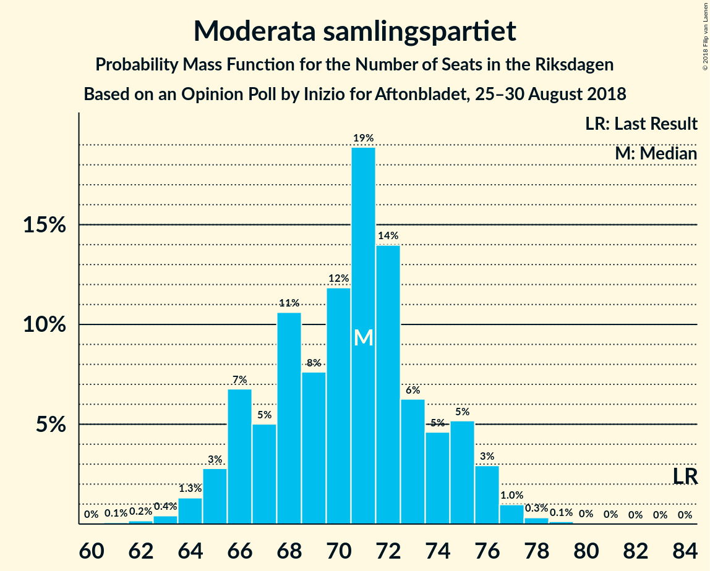

# Opinion Poll by Inizio for Aftonbladet, 25–30 August 2018

<a href="#voting-intentions">Voting Intentions</a> | <a href="#seats">Seats</a> | <a href="#coalitions">Coalitions</a> | <a href="#technical-information">Technical Information</a>

## Voting Intentions

### Confidence Intervals

| Party | Last Result | Poll Result | 80% Confidence Interval | 90% Confidence Interval | 95% Confidence Interval | 99% Confidence Interval |
|:-----:|:-----------:|:-----------:|:-----------------------:|:-----------------------:|:-----------------------:|:-----------------------:|
| Sveriges socialdemokratiska arbetareparti | 31.0% | 23.1% | 22.0–24.3% |21.7–24.6% |21.5–24.9% |20.9–25.4% |
| Moderata samlingspartiet | 23.3% | 19.5% | 18.5–20.6% |18.2–20.9% |18.0–21.2% |17.5–21.7% |
| Sverigedemokraterna | 12.9% | 18.1% | 17.1–19.2% |16.9–19.5% |16.6–19.7% |16.2–20.2% |
| Vänsterpartiet | 5.7% | 10.1% | 9.4–11.0% |9.1–11.2% |9.0–11.4% |8.6–11.8% |
| Centerpartiet | 6.1% | 8.5% | 7.8–9.3% |7.6–9.5% |7.4–9.7% |7.1–10.1% |
| Kristdemokraterna | 4.6% | 6.0% | 5.4–6.7% |5.3–6.9% |5.1–7.1% |4.8–7.4% |
| Liberalerna | 5.4% | 5.9% | 5.3–6.6% |5.1–6.8% |5.0–6.9% |4.7–7.3% |
| Miljöpartiet de gröna | 6.9% | 5.6% | 5.0–6.2% |4.9–6.4% |4.7–6.6% |4.5–6.9% |
| Feministiskt initiativ | 3.1% | 1.7% | 1.4–2.1% |1.3–2.2% |1.2–2.3% |1.1–2.5% |

*Note:* The poll result column reflects the actual value used in the calculations. Published results may vary slightly, and in addition be rounded to fewer digits.

## Seats

### Confidence Intervals

| Party | Last Result | Median | 80% Confidence Interval | 90% Confidence Interval | 95% Confidence Interval | 99% Confidence Interval |
|:-----:|:-----------:|:------:|:-----------------------:|:-----------------------:|:-----------------------:|:-----------------------:|
| <a href="#sveriges-socialdemokratiska-arbetareparti">Sveriges socialdemokratiska arbetareparti</a> | 113 | 83 | 80–87 |78–88 |78–89 |75–92 |
| <a href="#moderata-samlingspartiet">Moderata samlingspartiet</a> | 84 | 71 | 66–74 |66–75 |65–76 |63–78 |
| <a href="#sverigedemokraterna">Sverigedemokraterna</a> | 49 | 65 | 62–68 |61–69 |61–71 |58–73 |
| <a href="#vänsterpartiet">Vänsterpartiet</a> | 21 | 36 | 34–39 |33–40 |33–41 |31–42 |
| <a href="#centerpartiet">Centerpartiet</a> | 22 | 31 | 28–33 |27–34 |27–35 |26–36 |
| <a href="#kristdemokraterna">Kristdemokraterna</a> | 16 | 22 | 20–24 |19–25 |18–25 |18–27 |
| <a href="#liberalerna">Liberalerna</a> | 19 | 21 | 19–24 |19–24 |18–25 |17–26 |
| <a href="#miljöpartiet-de-gröna">Miljöpartiet de gröna</a> | 25 | 20 | 18–22 |18–23 |17–24 |16–25 |
| <a href="#feministiskt-initiativ">Feministiskt initiativ</a> | 0 | 0 | 0 |0 |0 |0 |

### Sveriges socialdemokratiska arbetareparti

*For a full overview of the results for this party, see the [Sveriges socialdemokratiska arbetareparti](party-sverigessocialdemokratiskaarbetareparti.html) page.*

| Number of Seats | Probability | Accumulated | Special Marks |
|:---------------:|:-----------:|:-----------:|:-------------:|
| 73 | 0% | 100% |  |
| 74 | 0.1% | 99.9% |  |
| 75 | 0.3% | 99.8% |  |
| 76 | 0.4% | 99.5% |  |
| 77 | 1.0% | 99.0% |  |
| 78 | 5% | 98% |  |
| 79 | 3% | 94% |  |
| 80 | 8% | 91% |  |
| 81 | 15% | 83% |  |
| 82 | 16% | 67% |  |
| 83 | 10% | 51% | Median |
| 84 | 12% | 41% |  |
| 85 | 6% | 29% |  |
| 86 | 13% | 24% |  |
| 87 | 3% | 11% |  |
| 88 | 3% | 7% |  |
| 89 | 3% | 5% |  |
| 90 | 0.7% | 2% |  |
| 91 | 0.5% | 1.1% |  |
| 92 | 0.4% | 0.6% |  |
| 93 | 0.1% | 0.2% |  |
| 94 | 0% | 0% |  |
| 95 | 0% | 0% |  |
| 96 | 0% | 0% |  |
| 97 | 0% | 0% |  |
| 98 | 0% | 0% |  |
| 99 | 0% | 0% |  |
| 100 | 0% | 0% |  |
| 101 | 0% | 0% |  |
| 102 | 0% | 0% |  |
| 103 | 0% | 0% |  |
| 104 | 0% | 0% |  |
| 105 | 0% | 0% |  |
| 106 | 0% | 0% |  |
| 107 | 0% | 0% |  |
| 108 | 0% | 0% |  |
| 109 | 0% | 0% |  |
| 110 | 0% | 0% |  |
| 111 | 0% | 0% |  |
| 112 | 0% | 0% |  |
| 113 | 0% | 0% | Last Result |

### Moderata samlingspartiet

*For a full overview of the results for this party, see the [Moderata samlingspartiet](party-moderatasamlingspartiet.html) page.*

| Number of Seats | Probability | Accumulated | Special Marks |
|:---------------:|:-----------:|:-----------:|:-------------:|
| 61 | 0.1% | 100% |  |
| 62 | 0.2% | 99.9% |  |
| 63 | 0.4% | 99.7% |  |
| 64 | 1.3% | 99.3% |  |
| 65 | 3% | 98% |  |
| 66 | 7% | 95% |  |
| 67 | 5% | 88% |  |
| 68 | 11% | 83% |  |
| 69 | 8% | 73% |  |
| 70 | 12% | 65% |  |
| 71 | 19% | 53% | Median |
| 72 | 14% | 34% |  |
| 73 | 6% | 20% |  |
| 74 | 5% | 14% |  |
| 75 | 5% | 10% |  |
| 76 | 3% | 4% |  |
| 77 | 1.0% | 2% |  |
| 78 | 0.3% | 0.5% |  |
| 79 | 0.1% | 0.2% |  |
| 80 | 0% | 0.1% |  |
| 81 | 0% | 0% |  |
| 82 | 0% | 0% |  |
| 83 | 0% | 0% |  |
| 84 | 0% | 0% | Last Result |

### Sverigedemokraterna

*For a full overview of the results for this party, see the [Sverigedemokraterna](party-sverigedemokraterna.html) page.*

| Number of Seats | Probability | Accumulated | Special Marks |
|:---------------:|:-----------:|:-----------:|:-------------:|
| 49 | 0% | 100% | Last Result |
| 50 | 0% | 100% |  |
| 51 | 0% | 100% |  |
| 52 | 0% | 100% |  |
| 53 | 0% | 100% |  |
| 54 | 0% | 100% |  |
| 55 | 0% | 100% |  |
| 56 | 0.1% | 100% |  |
| 57 | 0.3% | 99.9% |  |
| 58 | 0.4% | 99.6% |  |
| 59 | 0.4% | 99.3% |  |
| 60 | 1.3% | 98.8% |  |
| 61 | 5% | 98% |  |
| 62 | 6% | 92% |  |
| 63 | 9% | 86% |  |
| 64 | 16% | 77% |  |
| 65 | 26% | 61% | Median |
| 66 | 13% | 35% |  |
| 67 | 8% | 22% |  |
| 68 | 8% | 15% |  |
| 69 | 2% | 7% |  |
| 70 | 2% | 5% |  |
| 71 | 0.9% | 3% |  |
| 72 | 0.8% | 2% |  |
| 73 | 0.7% | 0.8% |  |
| 74 | 0.1% | 0.2% |  |
| 75 | 0% | 0.1% |  |
| 76 | 0% | 0.1% |  |
| 77 | 0% | 0% |  |

### Vänsterpartiet

*For a full overview of the results for this party, see the [Vänsterpartiet](party-vänsterpartiet.html) page.*

| Number of Seats | Probability | Accumulated | Special Marks |
|:---------------:|:-----------:|:-----------:|:-------------:|
| 21 | 0% | 100% | Last Result |
| 22 | 0% | 100% |  |
| 23 | 0% | 100% |  |
| 24 | 0% | 100% |  |
| 25 | 0% | 100% |  |
| 26 | 0% | 100% |  |
| 27 | 0% | 100% |  |
| 28 | 0% | 100% |  |
| 29 | 0% | 100% |  |
| 30 | 0.2% | 99.9% |  |
| 31 | 0.7% | 99.7% |  |
| 32 | 1.2% | 99.0% |  |
| 33 | 4% | 98% |  |
| 34 | 11% | 94% |  |
| 35 | 23% | 83% |  |
| 36 | 11% | 61% | Median |
| 37 | 10% | 50% |  |
| 38 | 25% | 40% |  |
| 39 | 8% | 15% |  |
| 40 | 4% | 7% |  |
| 41 | 2% | 3% |  |
| 42 | 0.7% | 1.1% |  |
| 43 | 0.2% | 0.4% |  |
| 44 | 0.1% | 0.1% |  |
| 45 | 0% | 0% |  |

### Centerpartiet

*For a full overview of the results for this party, see the [Centerpartiet](party-centerpartiet.html) page.*

| Number of Seats | Probability | Accumulated | Special Marks |
|:---------------:|:-----------:|:-----------:|:-------------:|
| 22 | 0% | 100% | Last Result |
| 23 | 0% | 100% |  |
| 24 | 0% | 100% |  |
| 25 | 0.3% | 100% |  |
| 26 | 0.9% | 99.6% |  |
| 27 | 7% | 98.7% |  |
| 28 | 7% | 92% |  |
| 29 | 12% | 86% |  |
| 30 | 19% | 73% |  |
| 31 | 13% | 54% | Median |
| 32 | 27% | 41% |  |
| 33 | 5% | 14% |  |
| 34 | 6% | 9% |  |
| 35 | 2% | 3% |  |
| 36 | 0.4% | 0.8% |  |
| 37 | 0.3% | 0.3% |  |
| 38 | 0% | 0.1% |  |
| 39 | 0% | 0% |  |

### Kristdemokraterna

*For a full overview of the results for this party, see the [Kristdemokraterna](party-kristdemokraterna.html) page.*

| Number of Seats | Probability | Accumulated | Special Marks |
|:---------------:|:-----------:|:-----------:|:-------------:|
| 16 | 0.1% | 100% | Last Result |
| 17 | 0.4% | 99.9% |  |
| 18 | 2% | 99.5% |  |
| 19 | 6% | 97% |  |
| 20 | 13% | 91% |  |
| 21 | 25% | 78% |  |
| 22 | 24% | 53% | Median |
| 23 | 14% | 29% |  |
| 24 | 9% | 15% |  |
| 25 | 5% | 6% |  |
| 26 | 1.3% | 2% |  |
| 27 | 0.3% | 0.5% |  |
| 28 | 0.3% | 0.3% |  |
| 29 | 0% | 0% |  |

### Liberalerna

*For a full overview of the results for this party, see the [Liberalerna](party-liberalerna.html) page.*

| Number of Seats | Probability | Accumulated | Special Marks |
|:---------------:|:-----------:|:-----------:|:-------------:|
| 16 | 0.2% | 100% |  |
| 17 | 0.7% | 99.8% |  |
| 18 | 3% | 99.2% |  |
| 19 | 14% | 96% | Last Result |
| 20 | 18% | 83% |  |
| 21 | 23% | 65% | Median |
| 22 | 17% | 42% |  |
| 23 | 14% | 25% |  |
| 24 | 8% | 11% |  |
| 25 | 2% | 3% |  |
| 26 | 0.8% | 1.2% |  |
| 27 | 0.4% | 0.4% |  |
| 28 | 0% | 0% |  |

### Miljöpartiet de gröna

*For a full overview of the results for this party, see the [Miljöpartiet de gröna](party-miljöpartietdegröna.html) page.*

| Number of Seats | Probability | Accumulated | Special Marks |
|:---------------:|:-----------:|:-----------:|:-------------:|
| 15 | 0.2% | 100% |  |
| 16 | 0.8% | 99.8% |  |
| 17 | 3% | 99.0% |  |
| 18 | 10% | 96% |  |
| 19 | 17% | 86% |  |
| 20 | 24% | 69% | Median |
| 21 | 16% | 46% |  |
| 22 | 23% | 29% |  |
| 23 | 4% | 6% |  |
| 24 | 1.4% | 3% |  |
| 25 | 0.9% | 1.1% | Last Result |
| 26 | 0.2% | 0.3% |  |
| 27 | 0% | 0% |  |

### Feministiskt initiativ

*For a full overview of the results for this party, see the [Feministiskt initiativ](party-feministisktinitiativ.html) page.*

| Number of Seats | Probability | Accumulated | Special Marks |
|:---------------:|:-----------:|:-----------:|:-------------:|
| 0 | 100% | 100% | Last Result, Median |

## Coalitions

### Confidence Intervals

| Coalition | Last Result | Median | Majority? | 80% Confidence Interval | 90% Confidence Interval | 95% Confidence Interval | 99% Confidence Interval |
|:---------:|:-----------:|:------:|:---------:|:-----------------------:|:-----------------------:|:-----------------------:|:-----------------------:|
| Sveriges socialdemokratiska arbetareparti – Moderata samlingspartiet – Centerpartiet | 219 | 184 | 99.4% | 180–188 | 179–191 | 178–191 | 174–193 |
| Moderata samlingspartiet – Sverigedemokraterna – Kristdemokraterna | 149 | 157 | 0% | 152–162 | 151–163 | 151–164 | 148–166 |
| Sveriges socialdemokratiska arbetareparti – Moderata samlingspartiet | 197 | 154 | 0% | 149–158 | 147–159 | 147–160 | 144–162 |
| Moderata samlingspartiet – Centerpartiet – Kristdemokraterna – Liberalerna | 141 | 144 | 0% | 140–149 | 138–150 | 136–151 | 135–153 |
| Sveriges socialdemokratiska arbetareparti – Vänsterpartiet – Miljöpartiet de gröna – Feministiskt initiativ | 159 | 140 | 0% | 135–144 | 134–145 | 134–147 | 131–150 |
| Sveriges socialdemokratiska arbetareparti – Vänsterpartiet – Miljöpartiet de gröna | 159 | 140 | 0% | 135–144 | 134–145 | 134–147 | 131–150 |
| Moderata samlingspartiet – Sverigedemokraterna | 133 | 135 | 0% | 131–140 | 129–141 | 129–142 | 127–145 |
| Moderata samlingspartiet – Centerpartiet – Kristdemokraterna | 122 | 123 | 0% | 118–127 | 117–129 | 116–129 | 114–132 |
| Moderata samlingspartiet – Centerpartiet – Liberalerna | 125 | 122 | 0% | 118–127 | 116–128 | 115–129 | 113–131 |
| Sveriges socialdemokratiska arbetareparti – Vänsterpartiet | 134 | 119 | 0% | 116–124 | 114–125 | 113–127 | 111–129 |
| Sveriges socialdemokratiska arbetareparti – Miljöpartiet de gröna | 138 | 103 | 0% | 99–107 | 98–108 | 97–110 | 95–113 |
| Moderata samlingspartiet – Centerpartiet | 106 | 101 | 0% | 97–105 | 96–106 | 95–107 | 93–110 |

