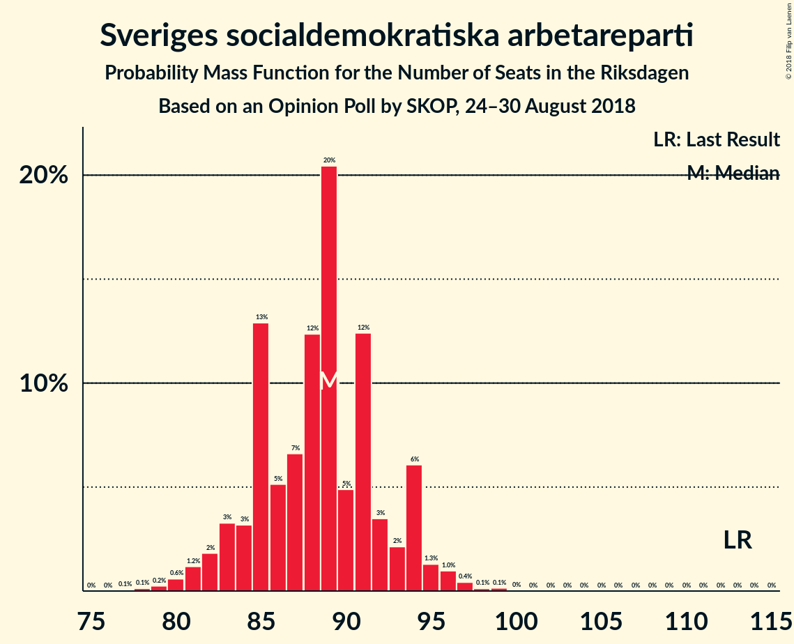
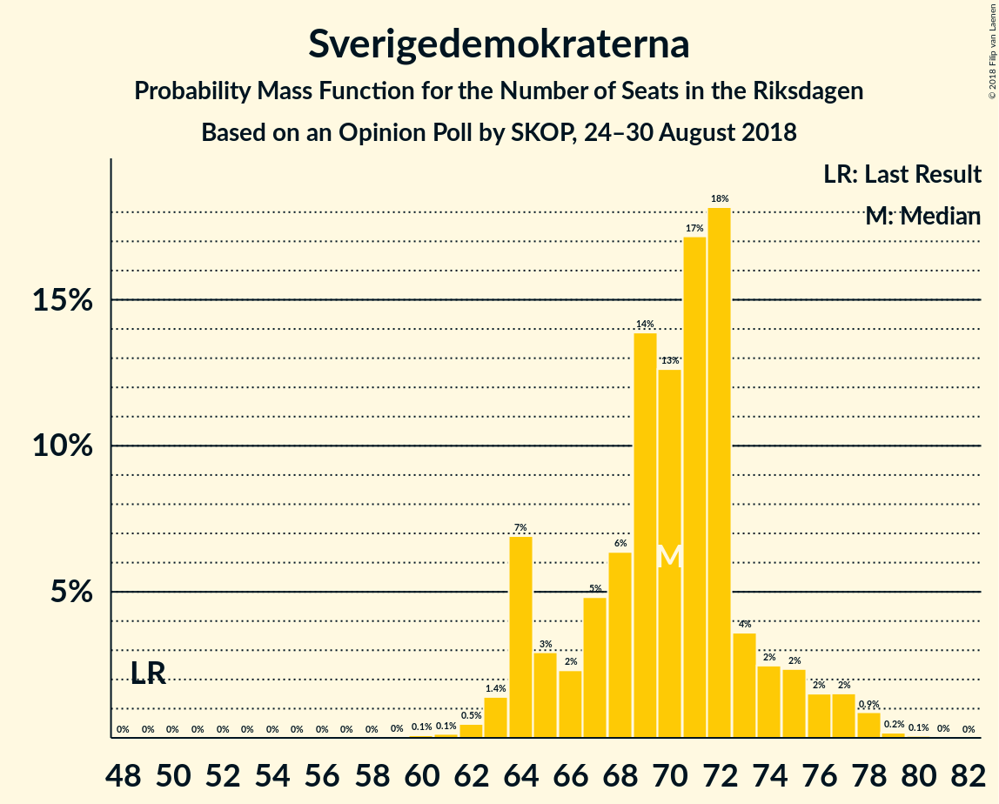
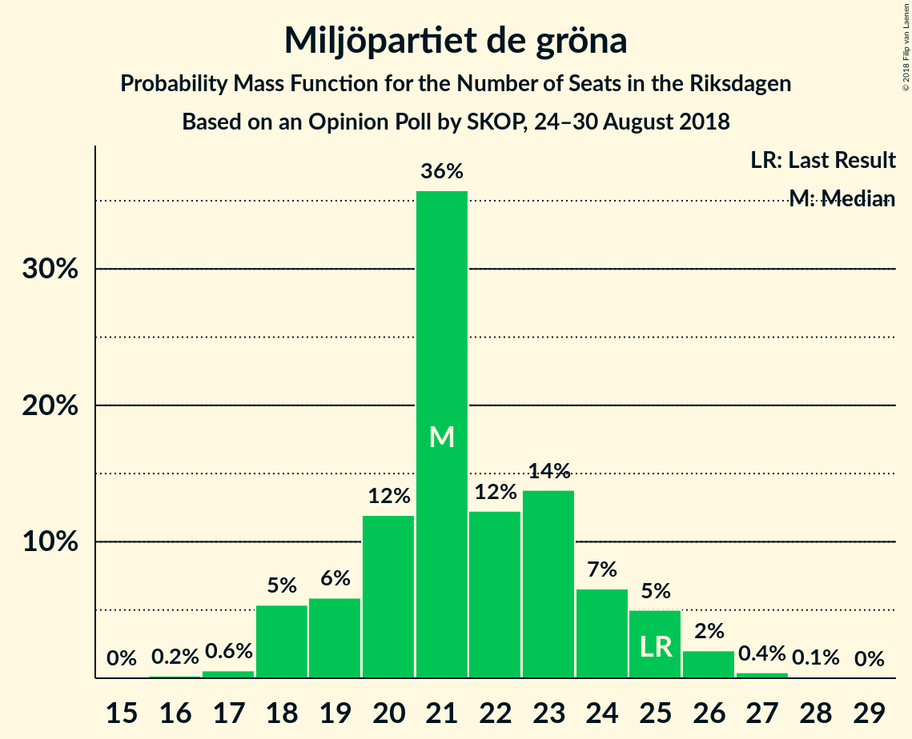

# Opinion Poll by SKOP, 24–30 August 2018

<a href="#voting-intentions">Voting Intentions</a> | <a href="#seats">Seats</a> | <a href="#coalitions">Coalitions</a> | <a href="#technical-information">Technical Information</a>

## Voting Intentions

### Confidence Intervals

| Party | Last Result | Poll Result | 80% Confidence Interval | 90% Confidence Interval | 95% Confidence Interval | 99% Confidence Interval |
|:-----:|:-----------:|:-----------:|:-----------------------:|:-----------------------:|:-----------------------:|:-----------------------:|
| Sveriges socialdemokratiska arbetareparti | 31.0% | 24.7% | 23.5–26.0% |23.1–26.4% |22.8–26.7% |22.2–27.3% |
| Sverigedemokraterna | 12.9% | 19.5% | 18.4–20.7% |18.0–21.0% |17.8–21.3% |17.3–21.9% |
| Moderata samlingspartiet | 23.3% | 16.9% | 15.8–18.0% |15.5–18.4% |15.3–18.6% |14.8–19.2% |
| Vänsterpartiet | 5.7% | 10.3% | 9.4–11.2% |9.2–11.5% |9.0–11.7% |8.6–12.2% |
| Centerpartiet | 6.1% | 8.2% | 7.5–9.1% |7.2–9.3% |7.1–9.5% |6.7–10.0% |
| Kristdemokraterna | 4.6% | 6.1% | 5.4–6.8% |5.2–7.1% |5.1–7.2% |4.8–7.6% |
| Miljöpartiet de gröna | 6.9% | 6.0% | 5.3–6.7% |5.2–7.0% |5.0–7.1% |4.7–7.5% |
| Liberalerna | 5.4% | 5.8% | 5.1–6.5% |5.0–6.7% |4.8–6.9% |4.5–7.3% |
| Feministiskt initiativ | 3.1% | 1.0% | 0.7–1.4% |0.7–1.4% |0.6–1.5% |0.5–1.7% |

*Note:* The poll result column reflects the actual value used in the calculations. Published results may vary slightly, and in addition be rounded to fewer digits.

## Seats

### Confidence Intervals

| Party | Last Result | Median | 80% Confidence Interval | 90% Confidence Interval | 95% Confidence Interval | 99% Confidence Interval |
|:-----:|:-----------:|:------:|:-----------------------:|:-----------------------:|:-----------------------:|:-----------------------:|
| <a href="#sveriges-socialdemokratiska-arbetareparti">Sveriges socialdemokratiska arbetareparti</a> | 113 | 88 | 84–93 |83–94 |81–95 |80–97 |
| <a href="#sverigedemokraterna">Sverigedemokraterna</a> | 49 | 70 | 64–73 |64–76 |64–77 |62–78 |
| <a href="#moderata-samlingspartiet">Moderata samlingspartiet</a> | 84 | 60 | 56–64 |56–65 |55–66 |53–68 |
| <a href="#vänsterpartiet">Vänsterpartiet</a> | 21 | 37 | 34–40 |33–41 |32–42 |31–43 |
| <a href="#centerpartiet">Centerpartiet</a> | 22 | 30 | 27–32 |26–33 |25–34 |24–36 |
| <a href="#kristdemokraterna">Kristdemokraterna</a> | 16 | 22 | 20–25 |19–25 |19–26 |17–28 |
| <a href="#miljöpartiet-de-gröna">Miljöpartiet de gröna</a> | 25 | 22 | 19–25 |18–25 |18–26 |17–27 |
| <a href="#liberalerna">Liberalerna</a> | 19 | 21 | 18–24 |18–24 |17–25 |16–26 |
| <a href="#feministiskt-initiativ">Feministiskt initiativ</a> | 0 | 0 | 0 |0 |0 |0 |

### Sveriges socialdemokratiska arbetareparti

*For a full overview of the results for this party, see the [Sveriges socialdemokratiska arbetareparti](party-sverigessocialdemokratiskaarbetareparti.html) page.*

| Number of Seats | Probability | Accumulated | Special Marks |
|:---------------:|:-----------:|:-----------:|:-------------:|
| 77 | 0.1% | 100% |  |
| 78 | 0.1% | 99.9% |  |
| 79 | 0.2% | 99.8% |  |
| 80 | 0.7% | 99.6% |  |
| 81 | 2% | 98.9% |  |
| 82 | 2% | 97% |  |
| 83 | 2% | 95% |  |
| 84 | 3% | 93% |  |
| 85 | 8% | 90% |  |
| 86 | 8% | 82% |  |
| 87 | 8% | 74% |  |
| 88 | 17% | 66% | Median |
| 89 | 11% | 49% |  |
| 90 | 6% | 38% |  |
| 91 | 15% | 32% |  |
| 92 | 4% | 16% |  |
| 93 | 3% | 12% |  |
| 94 | 6% | 9% |  |
| 95 | 2% | 4% |  |
| 96 | 0.6% | 1.4% |  |
| 97 | 0.4% | 0.7% |  |
| 98 | 0.2% | 0.4% |  |
| 99 | 0.1% | 0.2% |  |
| 100 | 0.1% | 0.1% |  |
| 101 | 0% | 0% |  |
| 102 | 0% | 0% |  |
| 103 | 0% | 0% |  |
| 104 | 0% | 0% |  |
| 105 | 0% | 0% |  |
| 106 | 0% | 0% |  |
| 107 | 0% | 0% |  |
| 108 | 0% | 0% |  |
| 109 | 0% | 0% |  |
| 110 | 0% | 0% |  |
| 111 | 0% | 0% |  |
| 112 | 0% | 0% |  |
| 113 | 0% | 0% | Last Result |

### Sverigedemokraterna

*For a full overview of the results for this party, see the [Sverigedemokraterna](party-sverigedemokraterna.html) page.*

| Number of Seats | Probability | Accumulated | Special Marks |
|:---------------:|:-----------:|:-----------:|:-------------:|
| 49 | 0% | 100% | Last Result |
| 50 | 0% | 100% |  |
| 51 | 0% | 100% |  |
| 52 | 0% | 100% |  |
| 53 | 0% | 100% |  |
| 54 | 0% | 100% |  |
| 55 | 0% | 100% |  |
| 56 | 0% | 100% |  |
| 57 | 0% | 100% |  |
| 58 | 0% | 100% |  |
| 59 | 0.1% | 100% |  |
| 60 | 0.1% | 99.9% |  |
| 61 | 0.1% | 99.8% |  |
| 62 | 0.3% | 99.7% |  |
| 63 | 1.5% | 99.3% |  |
| 64 | 14% | 98% |  |
| 65 | 3% | 84% |  |
| 66 | 2% | 81% |  |
| 67 | 7% | 79% |  |
| 68 | 9% | 72% |  |
| 69 | 12% | 62% |  |
| 70 | 8% | 50% | Median |
| 71 | 7% | 42% |  |
| 72 | 20% | 35% |  |
| 73 | 5% | 15% |  |
| 74 | 2% | 10% |  |
| 75 | 2% | 7% |  |
| 76 | 0.9% | 5% |  |
| 77 | 2% | 4% |  |
| 78 | 2% | 2% |  |
| 79 | 0.3% | 0.4% |  |
| 80 | 0.1% | 0.1% |  |
| 81 | 0% | 0.1% |  |
| 82 | 0% | 0% |  |

### Moderata samlingspartiet

*For a full overview of the results for this party, see the [Moderata samlingspartiet](party-moderatasamlingspartiet.html) page.*

| Number of Seats | Probability | Accumulated | Special Marks |
|:---------------:|:-----------:|:-----------:|:-------------:|
| 51 | 0.2% | 100% |  |
| 52 | 0.1% | 99.8% |  |
| 53 | 0.6% | 99.7% |  |
| 54 | 1.0% | 99.1% |  |
| 55 | 3% | 98% |  |
| 56 | 8% | 95% |  |
| 57 | 16% | 87% |  |
| 58 | 8% | 71% |  |
| 59 | 9% | 63% |  |
| 60 | 12% | 54% | Median |
| 61 | 9% | 43% |  |
| 62 | 5% | 33% |  |
| 63 | 16% | 29% |  |
| 64 | 7% | 12% |  |
| 65 | 1.5% | 6% |  |
| 66 | 2% | 4% |  |
| 67 | 0.9% | 2% |  |
| 68 | 0.4% | 0.9% |  |
| 69 | 0.2% | 0.5% |  |
| 70 | 0.2% | 0.3% |  |
| 71 | 0% | 0% |  |
| 72 | 0% | 0% |  |
| 73 | 0% | 0% |  |
| 74 | 0% | 0% |  |
| 75 | 0% | 0% |  |
| 76 | 0% | 0% |  |
| 77 | 0% | 0% |  |
| 78 | 0% | 0% |  |
| 79 | 0% | 0% |  |
| 80 | 0% | 0% |  |
| 81 | 0% | 0% |  |
| 82 | 0% | 0% |  |
| 83 | 0% | 0% |  |
| 84 | 0% | 0% | Last Result |

### Vänsterpartiet

*For a full overview of the results for this party, see the [Vänsterpartiet](party-vänsterpartiet.html) page.*

| Number of Seats | Probability | Accumulated | Special Marks |
|:---------------:|:-----------:|:-----------:|:-------------:|
| 21 | 0% | 100% | Last Result |
| 22 | 0% | 100% |  |
| 23 | 0% | 100% |  |
| 24 | 0% | 100% |  |
| 25 | 0% | 100% |  |
| 26 | 0% | 100% |  |
| 27 | 0% | 100% |  |
| 28 | 0% | 100% |  |
| 29 | 0.1% | 100% |  |
| 30 | 0.2% | 99.9% |  |
| 31 | 0.5% | 99.7% |  |
| 32 | 4% | 99.2% |  |
| 33 | 2% | 95% |  |
| 34 | 8% | 94% |  |
| 35 | 12% | 85% |  |
| 36 | 19% | 73% |  |
| 37 | 22% | 54% | Median |
| 38 | 7% | 32% |  |
| 39 | 11% | 25% |  |
| 40 | 5% | 14% |  |
| 41 | 6% | 9% |  |
| 42 | 1.2% | 3% |  |
| 43 | 2% | 2% |  |
| 44 | 0.1% | 0.3% |  |
| 45 | 0.1% | 0.1% |  |
| 46 | 0.1% | 0.1% |  |
| 47 | 0% | 0% |  |

### Centerpartiet

*For a full overview of the results for this party, see the [Centerpartiet](party-centerpartiet.html) page.*

| Number of Seats | Probability | Accumulated | Special Marks |
|:---------------:|:-----------:|:-----------:|:-------------:|
| 22 | 0% | 100% | Last Result |
| 23 | 0.3% | 100% |  |
| 24 | 0.4% | 99.7% |  |
| 25 | 2% | 99.3% |  |
| 26 | 4% | 97% |  |
| 27 | 9% | 93% |  |
| 28 | 11% | 84% |  |
| 29 | 12% | 73% |  |
| 30 | 18% | 60% | Median |
| 31 | 24% | 42% |  |
| 32 | 11% | 18% |  |
| 33 | 4% | 7% |  |
| 34 | 1.3% | 3% |  |
| 35 | 0.7% | 1.4% |  |
| 36 | 0.5% | 0.7% |  |
| 37 | 0.2% | 0.2% |  |
| 38 | 0% | 0% |  |

### Kristdemokraterna

*For a full overview of the results for this party, see the [Kristdemokraterna](party-kristdemokraterna.html) page.*

| Number of Seats | Probability | Accumulated | Special Marks |
|:---------------:|:-----------:|:-----------:|:-------------:|
| 16 | 0.2% | 100% | Last Result |
| 17 | 0.5% | 99.8% |  |
| 18 | 2% | 99.3% |  |
| 19 | 5% | 98% |  |
| 20 | 21% | 93% |  |
| 21 | 10% | 71% |  |
| 22 | 27% | 61% | Median |
| 23 | 18% | 34% |  |
| 24 | 6% | 16% |  |
| 25 | 7% | 10% |  |
| 26 | 2% | 3% |  |
| 27 | 1.1% | 2% |  |
| 28 | 0.6% | 0.6% |  |
| 29 | 0% | 0.1% |  |
| 30 | 0% | 0% |  |

### Miljöpartiet de gröna

*For a full overview of the results for this party, see the [Miljöpartiet de gröna](party-miljöpartietdegröna.html) page.*

| Number of Seats | Probability | Accumulated | Special Marks |
|:---------------:|:-----------:|:-----------:|:-------------:|
| 16 | 0.2% | 100% |  |
| 17 | 0.7% | 99.8% |  |
| 18 | 7% | 99.1% |  |
| 19 | 7% | 92% |  |
| 20 | 19% | 86% |  |
| 21 | 9% | 67% |  |
| 22 | 19% | 58% | Median |
| 23 | 20% | 39% |  |
| 24 | 8% | 19% |  |
| 25 | 7% | 11% | Last Result |
| 26 | 4% | 4% |  |
| 27 | 0.4% | 0.6% |  |
| 28 | 0.2% | 0.2% |  |
| 29 | 0% | 0% |  |

### Liberalerna

*For a full overview of the results for this party, see the [Liberalerna](party-liberalerna.html) page.*

| Number of Seats | Probability | Accumulated | Special Marks |
|:---------------:|:-----------:|:-----------:|:-------------:|
| 15 | 0.1% | 100% |  |
| 16 | 0.4% | 99.9% |  |
| 17 | 2% | 99.5% |  |
| 18 | 11% | 97% |  |
| 19 | 13% | 86% | Last Result |
| 20 | 19% | 73% |  |
| 21 | 28% | 54% | Median |
| 22 | 9% | 27% |  |
| 23 | 5% | 18% |  |
| 24 | 10% | 13% |  |
| 25 | 2% | 3% |  |
| 26 | 0.4% | 0.5% |  |
| 27 | 0.1% | 0.2% |  |
| 28 | 0% | 0% |  |

### Feministiskt initiativ

*For a full overview of the results for this party, see the [Feministiskt initiativ](party-feministisktinitiativ.html) page.*

| Number of Seats | Probability | Accumulated | Special Marks |
|:---------------:|:-----------:|:-----------:|:-------------:|
| 0 | 100% | 100% | Last Result, Median |

## Coalitions

### Confidence Intervals

| Coalition | Last Result | Median | Majority? | 80% Confidence Interval | 90% Confidence Interval | 95% Confidence Interval | 99% Confidence Interval |
|:---------:|:-----------:|:------:|:---------:|:-----------------------:|:-----------------------:|:-----------------------:|:-----------------------:|
| Sveriges socialdemokratiska arbetareparti – Moderata samlingspartiet – Centerpartiet | 219 | 178 | 84% | 173–184 | 171–186 | 170–187 | 168–188 |
| Sverigedemokraterna – Moderata samlingspartiet – Kristdemokraterna | 149 | 151 | 0% | 146–157 | 145–159 | 145–160 | 141–163 |
| Sveriges socialdemokratiska arbetareparti – Moderata samlingspartiet | 197 | 148 | 0% | 144–154 | 142–155 | 141–157 | 138–158 |
| Sveriges socialdemokratiska arbetareparti – Vänsterpartiet – Miljöpartiet de gröna – Feministiskt initiativ | 159 | 148 | 0% | 142–152 | 140–153 | 139–154 | 137–157 |
| Sveriges socialdemokratiska arbetareparti – Vänsterpartiet – Miljöpartiet de gröna | 159 | 148 | 0% | 142–152 | 140–153 | 139–154 | 137–157 |
| Moderata samlingspartiet – Centerpartiet – Kristdemokraterna – Liberalerna | 141 | 133 | 0% | 127–137 | 126–139 | 126–141 | 123–143 |
| Sverigedemokraterna – Moderata samlingspartiet | 133 | 129 | 0% | 124–135 | 123–137 | 123–138 | 120–141 |
| Sveriges socialdemokratiska arbetareparti – Vänsterpartiet | 134 | 126 | 0% | 120–131 | 120–131 | 117–132 | 115–136 |
| Moderata samlingspartiet – Centerpartiet – Kristdemokraterna | 122 | 111 | 0% | 107–117 | 105–117 | 105–120 | 102–122 |
| Moderata samlingspartiet – Centerpartiet – Liberalerna | 125 | 110 | 0% | 105–116 | 104–117 | 103–118 | 101–121 |
| Sveriges socialdemokratiska arbetareparti – Miljöpartiet de gröna | 138 | 110 | 0% | 105–115 | 104–116 | 103–117 | 101–119 |
| Moderata samlingspartiet – Centerpartiet | 106 | 89 | 0% | 86–95 | 84–96 | 83–97 | 81–99 |

### Sveriges socialdemokratiska arbetareparti – Moderata samlingspartiet – Centerpartiet

| Number of Seats | Probability | Accumulated | Special Marks |
|:---------------:|:-----------:|:-----------:|:-------------:|
| 165 | 0.1% | 100% |  |
| 166 | 0.1% | 99.8% |  |
| 167 | 0.2% | 99.8% |  |
| 168 | 0.5% | 99.6% |  |
| 169 | 0.8% | 99.1% |  |
| 170 | 2% | 98% |  |
| 171 | 2% | 96% |  |
| 172 | 1.1% | 95% |  |
| 173 | 4% | 94% |  |
| 174 | 6% | 90% |  |
| 175 | 7% | 84% | Majority |
| 176 | 17% | 76% |  |
| 177 | 6% | 59% |  |
| 178 | 6% | 53% | Median |
| 179 | 6% | 47% |  |
| 180 | 13% | 41% |  |
| 181 | 8% | 28% |  |
| 182 | 3% | 20% |  |
| 183 | 5% | 17% |  |
| 184 | 3% | 12% |  |
| 185 | 0.5% | 9% |  |
| 186 | 6% | 9% |  |
| 187 | 1.4% | 3% |  |
| 188 | 0.8% | 1.1% |  |
| 189 | 0.1% | 0.3% |  |
| 190 | 0.1% | 0.2% |  |
| 191 | 0% | 0.1% |  |
| 192 | 0% | 0% |  |
| 193 | 0% | 0% |  |
| 194 | 0% | 0% |  |
| 195 | 0% | 0% |  |
| 196 | 0% | 0% |  |
| 197 | 0% | 0% |  |
| 198 | 0% | 0% |  |
| 199 | 0% | 0% |  |
| 200 | 0% | 0% |  |
| 201 | 0% | 0% |  |
| 202 | 0% | 0% |  |
| 203 | 0% | 0% |  |
| 204 | 0% | 0% |  |
| 205 | 0% | 0% |  |
| 206 | 0% | 0% |  |
| 207 | 0% | 0% |  |
| 208 | 0% | 0% |  |
| 209 | 0% | 0% |  |
| 210 | 0% | 0% |  |
| 211 | 0% | 0% |  |
| 212 | 0% | 0% |  |
| 213 | 0% | 0% |  |
| 214 | 0% | 0% |  |
| 215 | 0% | 0% |  |
| 216 | 0% | 0% |  |
| 217 | 0% | 0% |  |
| 218 | 0% | 0% |  |
| 219 | 0% | 0% | Last Result |

### Sverigedemokraterna – Moderata samlingspartiet – Kristdemokraterna

| Number of Seats | Probability | Accumulated | Special Marks |
|:---------------:|:-----------:|:-----------:|:-------------:|
| 138 | 0.1% | 100% |  |
| 139 | 0% | 99.9% |  |
| 140 | 0.1% | 99.9% |  |
| 141 | 0.3% | 99.8% |  |
| 142 | 0.2% | 99.5% |  |
| 143 | 0.9% | 99.3% |  |
| 144 | 0.7% | 98% |  |
| 145 | 3% | 98% |  |
| 146 | 6% | 94% |  |
| 147 | 0.5% | 88% |  |
| 148 | 8% | 88% |  |
| 149 | 23% | 79% | Last Result |
| 150 | 5% | 56% |  |
| 151 | 7% | 51% |  |
| 152 | 10% | 44% | Median |
| 153 | 9% | 34% |  |
| 154 | 3% | 25% |  |
| 155 | 4% | 22% |  |
| 156 | 4% | 18% |  |
| 157 | 4% | 14% |  |
| 158 | 3% | 10% |  |
| 159 | 3% | 7% |  |
| 160 | 3% | 4% |  |
| 161 | 0.2% | 1.3% |  |
| 162 | 0.2% | 1.1% |  |
| 163 | 0.7% | 0.9% |  |
| 164 | 0.2% | 0.2% |  |
| 165 | 0% | 0.1% |  |
| 166 | 0% | 0% |  |

### Sveriges socialdemokratiska arbetareparti – Moderata samlingspartiet

| Number of Seats | Probability | Accumulated | Special Marks |
|:---------------:|:-----------:|:-----------:|:-------------:|
| 136 | 0.1% | 100% |  |
| 137 | 0.1% | 99.9% |  |
| 138 | 0.3% | 99.8% |  |
| 139 | 0.4% | 99.5% |  |
| 140 | 0.8% | 99.1% |  |
| 141 | 3% | 98% |  |
| 142 | 1.1% | 96% |  |
| 143 | 2% | 95% |  |
| 144 | 3% | 93% |  |
| 145 | 13% | 90% |  |
| 146 | 10% | 76% |  |
| 147 | 9% | 67% |  |
| 148 | 10% | 58% | Median |
| 149 | 7% | 49% |  |
| 150 | 12% | 42% |  |
| 151 | 8% | 30% |  |
| 152 | 6% | 21% |  |
| 153 | 2% | 15% |  |
| 154 | 8% | 13% |  |
| 155 | 2% | 6% |  |
| 156 | 0.8% | 3% |  |
| 157 | 2% | 3% |  |
| 158 | 0.7% | 1.1% |  |
| 159 | 0.1% | 0.5% |  |
| 160 | 0.2% | 0.3% |  |
| 161 | 0.1% | 0.1% |  |
| 162 | 0% | 0.1% |  |
| 163 | 0% | 0% |  |
| 164 | 0% | 0% |  |
| 165 | 0% | 0% |  |
| 166 | 0% | 0% |  |
| 167 | 0% | 0% |  |
| 168 | 0% | 0% |  |
| 169 | 0% | 0% |  |
| 170 | 0% | 0% |  |
| 171 | 0% | 0% |  |
| 172 | 0% | 0% |  |
| 173 | 0% | 0% |  |
| 174 | 0% | 0% |  |
| 175 | 0% | 0% | Majority |
| 176 | 0% | 0% |  |
| 177 | 0% | 0% |  |
| 178 | 0% | 0% |  |
| 179 | 0% | 0% |  |
| 180 | 0% | 0% |  |
| 181 | 0% | 0% |  |
| 182 | 0% | 0% |  |
| 183 | 0% | 0% |  |
| 184 | 0% | 0% |  |
| 185 | 0% | 0% |  |
| 186 | 0% | 0% |  |
| 187 | 0% | 0% |  |
| 188 | 0% | 0% |  |
| 189 | 0% | 0% |  |
| 190 | 0% | 0% |  |
| 191 | 0% | 0% |  |
| 192 | 0% | 0% |  |
| 193 | 0% | 0% |  |
| 194 | 0% | 0% |  |
| 195 | 0% | 0% |  |
| 196 | 0% | 0% |  |
| 197 | 0% | 0% | Last Result |

### Sveriges socialdemokratiska arbetareparti – Vänsterpartiet – Miljöpartiet de gröna – Feministiskt initiativ

| Number of Seats | Probability | Accumulated | Special Marks |
|:---------------:|:-----------:|:-----------:|:-------------:|
| 133 | 0.1% | 100% |  |
| 134 | 0.1% | 99.9% |  |
| 135 | 0.1% | 99.8% |  |
| 136 | 0.1% | 99.8% |  |
| 137 | 1.1% | 99.7% |  |
| 138 | 0.3% | 98.6% |  |
| 139 | 3% | 98% |  |
| 140 | 3% | 96% |  |
| 141 | 2% | 93% |  |
| 142 | 4% | 91% |  |
| 143 | 4% | 87% |  |
| 144 | 3% | 83% |  |
| 145 | 15% | 80% |  |
| 146 | 5% | 65% |  |
| 147 | 4% | 60% | Median |
| 148 | 23% | 56% |  |
| 149 | 4% | 33% |  |
| 150 | 6% | 29% |  |
| 151 | 11% | 23% |  |
| 152 | 6% | 12% |  |
| 153 | 3% | 6% |  |
| 154 | 2% | 4% |  |
| 155 | 0.5% | 2% |  |
| 156 | 0.4% | 1.2% |  |
| 157 | 0.5% | 0.8% |  |
| 158 | 0.2% | 0.4% |  |
| 159 | 0.1% | 0.2% | Last Result |
| 160 | 0% | 0.1% |  |
| 161 | 0% | 0% |  |

### Sveriges socialdemokratiska arbetareparti – Vänsterpartiet – Miljöpartiet de gröna

| Number of Seats | Probability | Accumulated | Special Marks |
|:---------------:|:-----------:|:-----------:|:-------------:|
| 133 | 0.1% | 100% |  |
| 134 | 0.1% | 99.9% |  |
| 135 | 0.1% | 99.8% |  |
| 136 | 0.1% | 99.8% |  |
| 137 | 1.1% | 99.7% |  |
| 138 | 0.3% | 98.6% |  |
| 139 | 3% | 98% |  |
| 140 | 3% | 96% |  |
| 141 | 2% | 93% |  |
| 142 | 4% | 91% |  |
| 143 | 4% | 87% |  |
| 144 | 3% | 83% |  |
| 145 | 15% | 80% |  |
| 146 | 5% | 65% |  |
| 147 | 4% | 60% | Median |
| 148 | 23% | 56% |  |
| 149 | 4% | 33% |  |
| 150 | 6% | 29% |  |
| 151 | 11% | 23% |  |
| 152 | 6% | 12% |  |
| 153 | 3% | 6% |  |
| 154 | 2% | 4% |  |
| 155 | 0.5% | 2% |  |
| 156 | 0.4% | 1.2% |  |
| 157 | 0.5% | 0.8% |  |
| 158 | 0.2% | 0.4% |  |
| 159 | 0.1% | 0.2% | Last Result |
| 160 | 0% | 0.1% |  |
| 161 | 0% | 0% |  |

### Moderata samlingspartiet – Centerpartiet – Kristdemokraterna – Liberalerna

| Number of Seats | Probability | Accumulated | Special Marks |
|:---------------:|:-----------:|:-----------:|:-------------:|
| 119 | 0.1% | 100% |  |
| 120 | 0% | 99.9% |  |
| 121 | 0.1% | 99.9% |  |
| 122 | 0.2% | 99.8% |  |
| 123 | 0.3% | 99.6% |  |
| 124 | 1.0% | 99.3% |  |
| 125 | 0.5% | 98% |  |
| 126 | 6% | 98% |  |
| 127 | 4% | 91% |  |
| 128 | 7% | 87% |  |
| 129 | 12% | 81% |  |
| 130 | 5% | 69% |  |
| 131 | 10% | 64% |  |
| 132 | 4% | 54% |  |
| 133 | 7% | 51% | Median |
| 134 | 9% | 43% |  |
| 135 | 11% | 34% |  |
| 136 | 3% | 23% |  |
| 137 | 11% | 19% |  |
| 138 | 3% | 9% |  |
| 139 | 2% | 5% |  |
| 140 | 0.3% | 3% |  |
| 141 | 1.3% | 3% | Last Result |
| 142 | 1.0% | 2% |  |
| 143 | 0.2% | 0.5% |  |
| 144 | 0.2% | 0.3% |  |
| 145 | 0.1% | 0.2% |  |
| 146 | 0.1% | 0.1% |  |
| 147 | 0% | 0% |  |

### Sverigedemokraterna – Moderata samlingspartiet

| Number of Seats | Probability | Accumulated | Special Marks |
|:---------------:|:-----------:|:-----------:|:-------------:|
| 118 | 0% | 100% |  |
| 119 | 0.3% | 99.9% |  |
| 120 | 0.4% | 99.6% |  |
| 121 | 0.7% | 99.2% |  |
| 122 | 0.7% | 98% |  |
| 123 | 3% | 98% |  |
| 124 | 5% | 95% |  |
| 125 | 7% | 89% |  |
| 126 | 6% | 82% |  |
| 127 | 9% | 76% |  |
| 128 | 7% | 67% |  |
| 129 | 19% | 60% |  |
| 130 | 9% | 42% | Median |
| 131 | 4% | 32% |  |
| 132 | 4% | 28% |  |
| 133 | 6% | 25% | Last Result |
| 134 | 6% | 18% |  |
| 135 | 4% | 12% |  |
| 136 | 3% | 9% |  |
| 137 | 3% | 6% |  |
| 138 | 2% | 3% |  |
| 139 | 0.8% | 2% |  |
| 140 | 0.4% | 0.9% |  |
| 141 | 0.4% | 0.5% |  |
| 142 | 0.1% | 0.2% |  |
| 143 | 0% | 0.1% |  |
| 144 | 0% | 0% |  |

### Sveriges socialdemokratiska arbetareparti – Vänsterpartiet

| Number of Seats | Probability | Accumulated | Special Marks |
|:---------------:|:-----------:|:-----------:|:-------------:|
| 112 | 0% | 100% |  |
| 113 | 0.1% | 99.9% |  |
| 114 | 0% | 99.9% |  |
| 115 | 0.6% | 99.9% |  |
| 116 | 1.1% | 99.3% |  |
| 117 | 1.3% | 98% |  |
| 118 | 0.5% | 97% |  |
| 119 | 1.2% | 96% |  |
| 120 | 6% | 95% |  |
| 121 | 5% | 89% |  |
| 122 | 8% | 83% |  |
| 123 | 2% | 75% |  |
| 124 | 1.0% | 73% |  |
| 125 | 21% | 72% | Median |
| 126 | 17% | 51% |  |
| 127 | 10% | 34% |  |
| 128 | 5% | 25% |  |
| 129 | 3% | 20% |  |
| 130 | 5% | 17% |  |
| 131 | 9% | 12% |  |
| 132 | 1.2% | 3% |  |
| 133 | 0.1% | 2% |  |
| 134 | 0.5% | 2% | Last Result |
| 135 | 0.6% | 1.2% |  |
| 136 | 0.5% | 0.6% |  |
| 137 | 0% | 0.1% |  |
| 138 | 0% | 0% |  |

### Moderata samlingspartiet – Centerpartiet – Kristdemokraterna

| Number of Seats | Probability | Accumulated | Special Marks |
|:---------------:|:-----------:|:-----------:|:-------------:|
| 100 | 0.1% | 100% |  |
| 101 | 0% | 99.8% |  |
| 102 | 0.7% | 99.8% |  |
| 103 | 0.4% | 99.1% |  |
| 104 | 1.2% | 98.7% |  |
| 105 | 3% | 98% |  |
| 106 | 1.4% | 94% |  |
| 107 | 5% | 93% |  |
| 108 | 15% | 88% |  |
| 109 | 9% | 73% |  |
| 110 | 5% | 64% |  |
| 111 | 11% | 59% |  |
| 112 | 8% | 47% | Median |
| 113 | 5% | 39% |  |
| 114 | 5% | 34% |  |
| 115 | 6% | 29% |  |
| 116 | 11% | 23% |  |
| 117 | 8% | 12% |  |
| 118 | 0.9% | 4% |  |
| 119 | 0.6% | 3% |  |
| 120 | 1.1% | 3% |  |
| 121 | 0.8% | 2% |  |
| 122 | 0.7% | 0.9% | Last Result |
| 123 | 0.1% | 0.2% |  |
| 124 | 0.1% | 0.1% |  |
| 125 | 0% | 0% |  |

### Moderata samlingspartiet – Centerpartiet – Liberalerna

| Number of Seats | Probability | Accumulated | Special Marks |
|:---------------:|:-----------:|:-----------:|:-------------:|
| 98 | 0.1% | 100% |  |
| 99 | 0.1% | 99.9% |  |
| 100 | 0.1% | 99.8% |  |
| 101 | 0.4% | 99.7% |  |
| 102 | 0.4% | 99.4% |  |
| 103 | 2% | 99.0% |  |
| 104 | 6% | 97% |  |
| 105 | 5% | 92% |  |
| 106 | 2% | 87% |  |
| 107 | 6% | 85% |  |
| 108 | 7% | 79% |  |
| 109 | 16% | 72% |  |
| 110 | 11% | 56% |  |
| 111 | 8% | 46% | Median |
| 112 | 6% | 38% |  |
| 113 | 9% | 32% |  |
| 114 | 4% | 23% |  |
| 115 | 9% | 20% |  |
| 116 | 5% | 11% |  |
| 117 | 3% | 6% |  |
| 118 | 0.6% | 3% |  |
| 119 | 1.3% | 2% |  |
| 120 | 0.2% | 0.8% |  |
| 121 | 0.3% | 0.5% |  |
| 122 | 0.1% | 0.2% |  |
| 123 | 0% | 0.1% |  |
| 124 | 0% | 0% |  |
| 125 | 0% | 0% | Last Result |

### Sveriges socialdemokratiska arbetareparti – Miljöpartiet de gröna

| Number of Seats | Probability | Accumulated | Special Marks |
|:---------------:|:-----------:|:-----------:|:-------------:|
| 98 | 0% | 100% |  |
| 99 | 0.1% | 99.9% |  |
| 100 | 0.3% | 99.8% |  |
| 101 | 1.0% | 99.6% |  |
| 102 | 1.0% | 98.6% |  |
| 103 | 1.4% | 98% |  |
| 104 | 2% | 96% |  |
| 105 | 5% | 94% |  |
| 106 | 5% | 89% |  |
| 107 | 4% | 84% |  |
| 108 | 5% | 80% |  |
| 109 | 14% | 75% |  |
| 110 | 12% | 61% | Median |
| 111 | 15% | 49% |  |
| 112 | 2% | 34% |  |
| 113 | 14% | 32% |  |
| 114 | 6% | 18% |  |
| 115 | 7% | 12% |  |
| 116 | 2% | 5% |  |
| 117 | 1.3% | 3% |  |
| 118 | 2% | 2% |  |
| 119 | 0.2% | 0.6% |  |
| 120 | 0.1% | 0.4% |  |
| 121 | 0.1% | 0.2% |  |
| 122 | 0.1% | 0.1% |  |
| 123 | 0% | 0% |  |
| 124 | 0% | 0% |  |
| 125 | 0% | 0% |  |
| 126 | 0% | 0% |  |
| 127 | 0% | 0% |  |
| 128 | 0% | 0% |  |
| 129 | 0% | 0% |  |
| 130 | 0% | 0% |  |
| 131 | 0% | 0% |  |
| 132 | 0% | 0% |  |
| 133 | 0% | 0% |  |
| 134 | 0% | 0% |  |
| 135 | 0% | 0% |  |
| 136 | 0% | 0% |  |
| 137 | 0% | 0% |  |
| 138 | 0% | 0% | Last Result |

### Moderata samlingspartiet – Centerpartiet

| Number of Seats | Probability | Accumulated | Special Marks |
|:---------------:|:-----------:|:-----------:|:-------------:|
| 79 | 0.2% | 100% |  |
| 80 | 0% | 99.8% |  |
| 81 | 0.9% | 99.7% |  |
| 82 | 0.4% | 98.9% |  |
| 83 | 3% | 98% |  |
| 84 | 2% | 95% |  |
| 85 | 3% | 93% |  |
| 86 | 7% | 91% |  |
| 87 | 8% | 83% |  |
| 88 | 17% | 75% |  |
| 89 | 15% | 58% |  |
| 90 | 7% | 44% | Median |
| 91 | 7% | 37% |  |
| 92 | 4% | 30% |  |
| 93 | 9% | 27% |  |
| 94 | 3% | 18% |  |
| 95 | 9% | 15% |  |
| 96 | 3% | 6% |  |
| 97 | 2% | 3% |  |
| 98 | 1.0% | 2% |  |
| 99 | 0.3% | 0.5% |  |
| 100 | 0.2% | 0.2% |  |
| 101 | 0% | 0.1% |  |
| 102 | 0% | 0.1% |  |
| 103 | 0% | 0% |  |
| 104 | 0% | 0% |  |
| 105 | 0% | 0% |  |
| 106 | 0% | 0% | Last Result |

## Technical Information

### Opinion Poll

+ **Polling firm:** SKOP
+ **Commissioner(s):** —
+ **Fieldwork period:** 24–30 August 2018

### Calculations

+ **Sample size:** 1924
+ **Simulations done:** 524,288
+ **Error estimate:** 2.09%

