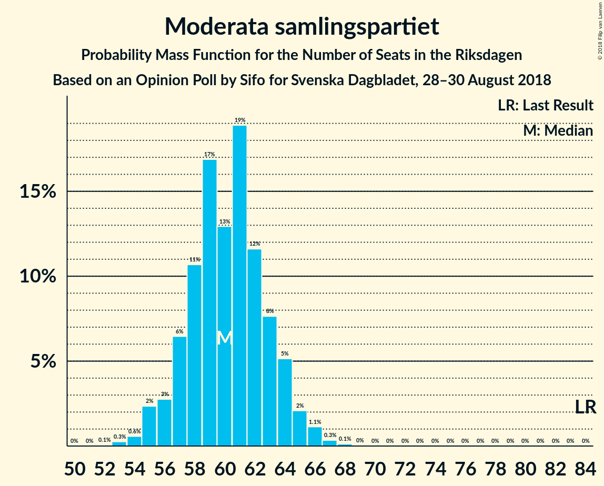
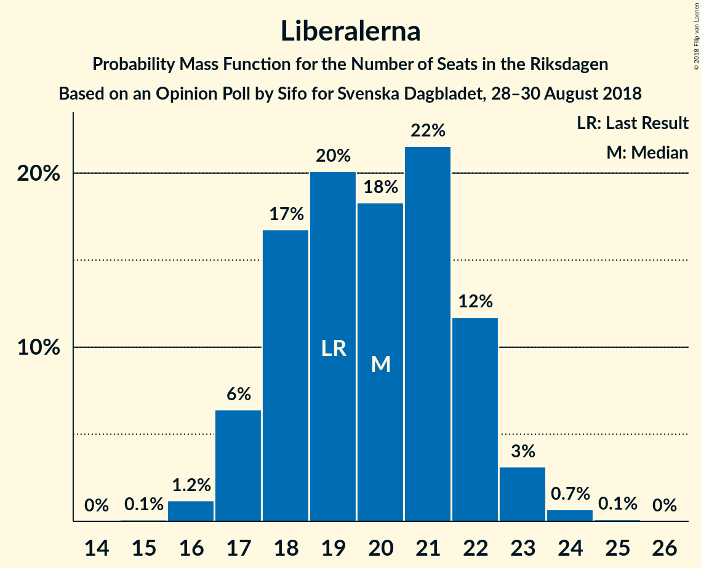

# Opinion Poll by Sifo for Svenska Dagbladet, 28–30 August 2018

<a href="#voting-intentions">Voting Intentions</a> | <a href="#seats">Seats</a> | <a href="#coalitions">Coalitions</a> | <a href="#technical-information">Technical Information</a>

## Voting Intentions

### Confidence Intervals

| Party | Last Result | Poll Result | 80% Confidence Interval | 90% Confidence Interval | 95% Confidence Interval | 99% Confidence Interval |
|:-----:|:-----------:|:-----------:|:-----------------------:|:-----------------------:|:-----------------------:|:-----------------------:|
| Sveriges socialdemokratiska arbetareparti | 31.0% | 25.5% | 24.5–26.6% |24.3–26.9% |24.0–27.1% |23.5–27.6% |
| Sverigedemokraterna | 12.9% | 16.8% | 15.9–17.7% |15.7–18.0% |15.5–18.2% |15.1–18.6% |
| Moderata samlingspartiet | 23.3% | 16.7% | 15.8–17.6% |15.6–17.8% |15.4–18.1% |15.0–18.5% |
| Vänsterpartiet | 5.7% | 10.5% | 9.8–11.2% |9.6–11.4% |9.4–11.6% |9.1–12.0% |
| Centerpartiet | 6.1% | 9.5% | 8.8–10.2% |8.6–10.4% |8.5–10.6% |8.2–10.9% |
| Miljöpartiet de gröna | 6.9% | 6.9% | 6.3–7.5% |6.1–7.7% |6.0–7.8% |5.8–8.1% |
| Liberalerna | 5.4% | 5.5% | 5.0–6.1% |4.8–6.2% |4.7–6.4% |4.5–6.6% |
| Kristdemokraterna | 4.6% | 5.5% | 5.0–6.1% |4.8–6.2% |4.7–6.4% |4.5–6.6% |

*Note:* The poll result column reflects the actual value used in the calculations. Published results may vary slightly, and in addition be rounded to fewer digits.

## Seats

### Confidence Intervals

| Party | Last Result | Median | 80% Confidence Interval | 90% Confidence Interval | 95% Confidence Interval | 99% Confidence Interval |
|:-----:|:-----------:|:------:|:-----------------------:|:-----------------------:|:-----------------------:|:-----------------------:|
| <a href="#sveriges-socialdemokratiska-arbetareparti">Sveriges socialdemokratiska arbetareparti</a> | 113 | 92 | 88–96 |88–97 |87–98 |85–99 |
| <a href="#sverigedemokraterna">Sverigedemokraterna</a> | 49 | 60 | 58–63 |58–63 |57–64 |55–67 |
| <a href="#moderata-samlingspartiet">Moderata samlingspartiet</a> | 84 | 60 | 58–62 |56–63 |55–65 |53–67 |
| <a href="#vänsterpartiet">Vänsterpartiet</a> | 21 | 38 | 36–40 |35–41 |35–42 |33–43 |
| <a href="#centerpartiet">Centerpartiet</a> | 22 | 35 | 32–36 |31–38 |31–38 |30–39 |
| <a href="#miljöpartiet-de-gröna">Miljöpartiet de gröna</a> | 25 | 25 | 22–27 |22–27 |22–28 |21–29 |
| <a href="#liberalerna">Liberalerna</a> | 19 | 19 | 18–21 |17–22 |17–22 |17–23 |
| <a href="#kristdemokraterna">Kristdemokraterna</a> | 16 | 20 | 18–22 |18–22 |18–22 |17–23 |

### Sveriges socialdemokratiska arbetareparti

*For a full overview of the results for this party, see the [Sveriges socialdemokratiska arbetareparti](party-sverigessocialdemokratiskaarbetareparti.html) page.*

| Number of Seats | Probability | Accumulated | Special Marks |
|:---------------:|:-----------:|:-----------:|:-------------:|
| 83 | 0.1% | 100% |  |
| 84 | 0.3% | 99.9% |  |
| 85 | 1.0% | 99.6% |  |
| 86 | 1.0% | 98.6% |  |
| 87 | 2% | 98% |  |
| 88 | 8% | 96% |  |
| 89 | 16% | 88% |  |
| 90 | 10% | 72% |  |
| 91 | 5% | 62% |  |
| 92 | 8% | 57% | Median |
| 93 | 24% | 48% |  |
| 94 | 9% | 24% |  |
| 95 | 4% | 15% |  |
| 96 | 5% | 11% |  |
| 97 | 3% | 6% |  |
| 98 | 2% | 3% |  |
| 99 | 0.6% | 0.8% |  |
| 100 | 0.2% | 0.3% |  |
| 101 | 0% | 0.1% |  |
| 102 | 0% | 0% |  |
| 103 | 0% | 0% |  |
| 104 | 0% | 0% |  |
| 105 | 0% | 0% |  |
| 106 | 0% | 0% |  |
| 107 | 0% | 0% |  |
| 108 | 0% | 0% |  |
| 109 | 0% | 0% |  |
| 110 | 0% | 0% |  |
| 111 | 0% | 0% |  |
| 112 | 0% | 0% |  |
| 113 | 0% | 0% | Last Result |

### Sverigedemokraterna

*For a full overview of the results for this party, see the [Sverigedemokraterna](party-sverigedemokraterna.html) page.*

| Number of Seats | Probability | Accumulated | Special Marks |
|:---------------:|:-----------:|:-----------:|:-------------:|
| 49 | 0% | 100% | Last Result |
| 50 | 0% | 100% |  |
| 51 | 0% | 100% |  |
| 52 | 0% | 100% |  |
| 53 | 0% | 99.9% |  |
| 54 | 0.2% | 99.9% |  |
| 55 | 0.3% | 99.7% |  |
| 56 | 0.8% | 99.4% |  |
| 57 | 3% | 98.6% |  |
| 58 | 11% | 96% |  |
| 59 | 29% | 84% |  |
| 60 | 20% | 56% | Median |
| 61 | 18% | 36% |  |
| 62 | 7% | 18% |  |
| 63 | 6% | 11% |  |
| 64 | 2% | 4% |  |
| 65 | 0.7% | 2% |  |
| 66 | 0.3% | 1.2% |  |
| 67 | 0.6% | 0.9% |  |
| 68 | 0.1% | 0.3% |  |
| 69 | 0.2% | 0.2% |  |
| 70 | 0% | 0% |  |

### Moderata samlingspartiet

*For a full overview of the results for this party, see the [Moderata samlingspartiet](party-moderatasamlingspartiet.html) page.*

| Number of Seats | Probability | Accumulated | Special Marks |
|:---------------:|:-----------:|:-----------:|:-------------:|
| 52 | 0% | 100% |  |
| 53 | 0.5% | 99.9% |  |
| 54 | 0.6% | 99.5% |  |
| 55 | 2% | 98.9% |  |
| 56 | 3% | 97% |  |
| 57 | 3% | 94% |  |
| 58 | 13% | 91% |  |
| 59 | 19% | 78% |  |
| 60 | 18% | 59% | Median |
| 61 | 8% | 41% |  |
| 62 | 24% | 32% |  |
| 63 | 4% | 8% |  |
| 64 | 2% | 4% |  |
| 65 | 0.9% | 3% |  |
| 66 | 1.0% | 2% |  |
| 67 | 0.5% | 0.6% |  |
| 68 | 0.2% | 0.2% |  |
| 69 | 0% | 0% |  |
| 70 | 0% | 0% |  |
| 71 | 0% | 0% |  |
| 72 | 0% | 0% |  |
| 73 | 0% | 0% |  |
| 74 | 0% | 0% |  |
| 75 | 0% | 0% |  |
| 76 | 0% | 0% |  |
| 77 | 0% | 0% |  |
| 78 | 0% | 0% |  |
| 79 | 0% | 0% |  |
| 80 | 0% | 0% |  |
| 81 | 0% | 0% |  |
| 82 | 0% | 0% |  |
| 83 | 0% | 0% |  |
| 84 | 0% | 0% | Last Result |

### Vänsterpartiet

*For a full overview of the results for this party, see the [Vänsterpartiet](party-vänsterpartiet.html) page.*

| Number of Seats | Probability | Accumulated | Special Marks |
|:---------------:|:-----------:|:-----------:|:-------------:|
| 21 | 0% | 100% | Last Result |
| 22 | 0% | 100% |  |
| 23 | 0% | 100% |  |
| 24 | 0% | 100% |  |
| 25 | 0% | 100% |  |
| 26 | 0% | 100% |  |
| 27 | 0% | 100% |  |
| 28 | 0% | 100% |  |
| 29 | 0% | 100% |  |
| 30 | 0% | 100% |  |
| 31 | 0% | 100% |  |
| 32 | 0.2% | 100% |  |
| 33 | 0.7% | 99.8% |  |
| 34 | 2% | 99.1% |  |
| 35 | 7% | 98% |  |
| 36 | 8% | 91% |  |
| 37 | 19% | 82% |  |
| 38 | 14% | 63% | Median |
| 39 | 28% | 49% |  |
| 40 | 13% | 21% |  |
| 41 | 4% | 8% |  |
| 42 | 2% | 4% |  |
| 43 | 1.4% | 1.5% |  |
| 44 | 0.1% | 0.1% |  |
| 45 | 0% | 0% |  |

### Centerpartiet

*For a full overview of the results for this party, see the [Centerpartiet](party-centerpartiet.html) page.*

| Number of Seats | Probability | Accumulated | Special Marks |
|:---------------:|:-----------:|:-----------:|:-------------:|
| 22 | 0% | 100% | Last Result |
| 23 | 0% | 100% |  |
| 24 | 0% | 100% |  |
| 25 | 0% | 100% |  |
| 26 | 0% | 100% |  |
| 27 | 0% | 100% |  |
| 28 | 0.1% | 100% |  |
| 29 | 0.2% | 99.9% |  |
| 30 | 0.6% | 99.7% |  |
| 31 | 6% | 99.1% |  |
| 32 | 6% | 93% |  |
| 33 | 19% | 87% |  |
| 34 | 15% | 68% |  |
| 35 | 28% | 53% | Median |
| 36 | 18% | 25% |  |
| 37 | 2% | 7% |  |
| 38 | 4% | 5% |  |
| 39 | 1.0% | 1.1% |  |
| 40 | 0% | 0.1% |  |
| 41 | 0% | 0% |  |

### Miljöpartiet de gröna

*For a full overview of the results for this party, see the [Miljöpartiet de gröna](party-miljöpartietdegröna.html) page.*

| Number of Seats | Probability | Accumulated | Special Marks |
|:---------------:|:-----------:|:-----------:|:-------------:|
| 20 | 0.5% | 100% |  |
| 21 | 0.3% | 99.5% |  |
| 22 | 12% | 99.2% |  |
| 23 | 6% | 87% |  |
| 24 | 18% | 81% |  |
| 25 | 30% | 63% | Last Result, Median |
| 26 | 6% | 33% |  |
| 27 | 24% | 28% |  |
| 28 | 2% | 4% |  |
| 29 | 2% | 2% |  |
| 30 | 0.4% | 0.4% |  |
| 31 | 0% | 0.1% |  |
| 32 | 0% | 0% |  |

### Liberalerna

*For a full overview of the results for this party, see the [Liberalerna](party-liberalerna.html) page.*

| Number of Seats | Probability | Accumulated | Special Marks |
|:---------------:|:-----------:|:-----------:|:-------------:|
| 16 | 0.4% | 100% |  |
| 17 | 6% | 99.6% |  |
| 18 | 21% | 93% |  |
| 19 | 24% | 72% | Last Result, Median |
| 20 | 19% | 48% |  |
| 21 | 19% | 29% |  |
| 22 | 8% | 10% |  |
| 23 | 1.1% | 1.4% |  |
| 24 | 0.2% | 0.3% |  |
| 25 | 0.1% | 0.1% |  |
| 26 | 0% | 0% |  |

### Kristdemokraterna

*For a full overview of the results for this party, see the [Kristdemokraterna](party-kristdemokraterna.html) page.*

| Number of Seats | Probability | Accumulated | Special Marks |
|:---------------:|:-----------:|:-----------:|:-------------:|
| 15 | 0.1% | 100% |  |
| 16 | 0.3% | 99.9% | Last Result |
| 17 | 2% | 99.6% |  |
| 18 | 9% | 98% |  |
| 19 | 28% | 89% |  |
| 20 | 37% | 61% | Median |
| 21 | 11% | 24% |  |
| 22 | 11% | 13% |  |
| 23 | 1.3% | 2% |  |
| 24 | 0.2% | 0.4% |  |
| 25 | 0.1% | 0.1% |  |
| 26 | 0% | 0% |  |

## Coalitions

### Confidence Intervals

| Coalition | Last Result | Median | Majority? | 80% Confidence Interval | 90% Confidence Interval | 95% Confidence Interval | 99% Confidence Interval |
|:---------:|:-----------:|:------:|:---------:|:-----------------------:|:-----------------------:|:-----------------------:|:-----------------------:|
| Sveriges socialdemokratiska arbetareparti – Moderata samlingspartiet – Centerpartiet | 219 | 186 | 99.9% | 182–191 | 180–192 | 179–193 | 177–196 |
| Sveriges socialdemokratiska arbetareparti – Vänsterpartiet – Miljöpartiet de gröna | 159 | 155 | 0% | 150–159 | 149–160 | 148–161 | 145–163 |
| Sveriges socialdemokratiska arbetareparti – Moderata samlingspartiet | 197 | 152 | 0% | 148–156 | 147–157 | 146–157 | 143–161 |
| Sverigedemokraterna – Moderata samlingspartiet – Kristdemokraterna | 149 | 139 | 0% | 137–144 | 135–146 | 134–146 | 131–149 |
| Moderata samlingspartiet – Centerpartiet – Kristdemokraterna – Liberalerna | 141 | 133 | 0% | 130–138 | 128–138 | 128–140 | 125–142 |
| Sveriges socialdemokratiska arbetareparti – Vänsterpartiet | 134 | 130 | 0% | 124–135 | 124–135 | 124–137 | 122–138 |
| Sverigedemokraterna – Moderata samlingspartiet | 133 | 120 | 0% | 117–124 | 116–124 | 115–126 | 113–128 |
| Sveriges socialdemokratiska arbetareparti – Miljöpartiet de gröna | 138 | 117 | 0% | 113–121 | 112–122 | 111–122 | 108–124 |
| Moderata samlingspartiet – Centerpartiet – Kristdemokraterna | 122 | 114 | 0% | 110–118 | 110–119 | 108–120 | 107–122 |
| Moderata samlingspartiet – Centerpartiet – Liberalerna | 125 | 114 | 0% | 110–118 | 109–119 | 108–120 | 105–121 |
| Moderata samlingspartiet – Centerpartiet | 106 | 95 | 0% | 91–97 | 90–99 | 89–100 | 86–102 |

### Sveriges socialdemokratiska arbetareparti – Moderata samlingspartiet – Centerpartiet

| Number of Seats | Probability | Accumulated | Special Marks |
|:---------------:|:-----------:|:-----------:|:-------------:|
| 173 | 0% | 100% |  |
| 174 | 0% | 99.9% |  |
| 175 | 0.1% | 99.9% | Majority |
| 176 | 0.2% | 99.8% |  |
| 177 | 0.6% | 99.6% |  |
| 178 | 0.5% | 99.0% |  |
| 179 | 1.5% | 98.5% |  |
| 180 | 3% | 97% |  |
| 181 | 2% | 94% |  |
| 182 | 6% | 92% |  |
| 183 | 8% | 86% |  |
| 184 | 5% | 78% |  |
| 185 | 12% | 73% |  |
| 186 | 16% | 61% |  |
| 187 | 5% | 45% | Median |
| 188 | 17% | 39% |  |
| 189 | 5% | 22% |  |
| 190 | 4% | 18% |  |
| 191 | 8% | 13% |  |
| 192 | 2% | 6% |  |
| 193 | 1.3% | 3% |  |
| 194 | 1.5% | 2% |  |
| 195 | 0% | 0.7% |  |
| 196 | 0.5% | 0.6% |  |
| 197 | 0% | 0.1% |  |
| 198 | 0.1% | 0.1% |  |
| 199 | 0% | 0% |  |
| 200 | 0% | 0% |  |
| 201 | 0% | 0% |  |
| 202 | 0% | 0% |  |
| 203 | 0% | 0% |  |
| 204 | 0% | 0% |  |
| 205 | 0% | 0% |  |
| 206 | 0% | 0% |  |
| 207 | 0% | 0% |  |
| 208 | 0% | 0% |  |
| 209 | 0% | 0% |  |
| 210 | 0% | 0% |  |
| 211 | 0% | 0% |  |
| 212 | 0% | 0% |  |
| 213 | 0% | 0% |  |
| 214 | 0% | 0% |  |
| 215 | 0% | 0% |  |
| 216 | 0% | 0% |  |
| 217 | 0% | 0% |  |
| 218 | 0% | 0% |  |
| 219 | 0% | 0% | Last Result |

### Sveriges socialdemokratiska arbetareparti – Vänsterpartiet – Miljöpartiet de gröna

| Number of Seats | Probability | Accumulated | Special Marks |
|:---------------:|:-----------:|:-----------:|:-------------:|
| 143 | 0.1% | 100% |  |
| 144 | 0.3% | 99.9% |  |
| 145 | 0.2% | 99.7% |  |
| 146 | 0.5% | 99.5% |  |
| 147 | 0.6% | 99.0% |  |
| 148 | 1.1% | 98% |  |
| 149 | 5% | 97% |  |
| 150 | 2% | 92% |  |
| 151 | 4% | 90% |  |
| 152 | 13% | 86% |  |
| 153 | 7% | 73% |  |
| 154 | 13% | 66% |  |
| 155 | 4% | 53% | Median |
| 156 | 4% | 49% |  |
| 157 | 27% | 45% |  |
| 158 | 5% | 17% |  |
| 159 | 5% | 12% | Last Result |
| 160 | 4% | 8% |  |
| 161 | 2% | 4% |  |
| 162 | 0.4% | 1.5% |  |
| 163 | 0.7% | 1.1% |  |
| 164 | 0.3% | 0.4% |  |
| 165 | 0.1% | 0.1% |  |
| 166 | 0% | 0.1% |  |
| 167 | 0% | 0% |  |

### Sveriges socialdemokratiska arbetareparti – Moderata samlingspartiet

| Number of Seats | Probability | Accumulated | Special Marks |
|:---------------:|:-----------:|:-----------:|:-------------:|
| 141 | 0.2% | 100% |  |
| 142 | 0.1% | 99.8% |  |
| 143 | 0.4% | 99.7% |  |
| 144 | 0.3% | 99.4% |  |
| 145 | 1.1% | 99.1% |  |
| 146 | 1.2% | 98% |  |
| 147 | 2% | 97% |  |
| 148 | 13% | 95% |  |
| 149 | 5% | 82% |  |
| 150 | 7% | 77% |  |
| 151 | 16% | 70% |  |
| 152 | 14% | 55% | Median |
| 153 | 14% | 41% |  |
| 154 | 7% | 27% |  |
| 155 | 4% | 20% |  |
| 156 | 8% | 15% |  |
| 157 | 4% | 7% |  |
| 158 | 0.6% | 2% |  |
| 159 | 0.9% | 2% |  |
| 160 | 0.1% | 0.8% |  |
| 161 | 0.6% | 0.7% |  |
| 162 | 0% | 0% |  |
| 163 | 0% | 0% |  |
| 164 | 0% | 0% |  |
| 165 | 0% | 0% |  |
| 166 | 0% | 0% |  |
| 167 | 0% | 0% |  |
| 168 | 0% | 0% |  |
| 169 | 0% | 0% |  |
| 170 | 0% | 0% |  |
| 171 | 0% | 0% |  |
| 172 | 0% | 0% |  |
| 173 | 0% | 0% |  |
| 174 | 0% | 0% |  |
| 175 | 0% | 0% | Majority |
| 176 | 0% | 0% |  |
| 177 | 0% | 0% |  |
| 178 | 0% | 0% |  |
| 179 | 0% | 0% |  |
| 180 | 0% | 0% |  |
| 181 | 0% | 0% |  |
| 182 | 0% | 0% |  |
| 183 | 0% | 0% |  |
| 184 | 0% | 0% |  |
| 185 | 0% | 0% |  |
| 186 | 0% | 0% |  |
| 187 | 0% | 0% |  |
| 188 | 0% | 0% |  |
| 189 | 0% | 0% |  |
| 190 | 0% | 0% |  |
| 191 | 0% | 0% |  |
| 192 | 0% | 0% |  |
| 193 | 0% | 0% |  |
| 194 | 0% | 0% |  |
| 195 | 0% | 0% |  |
| 196 | 0% | 0% |  |
| 197 | 0% | 0% | Last Result |

### Sverigedemokraterna – Moderata samlingspartiet – Kristdemokraterna

| Number of Seats | Probability | Accumulated | Special Marks |
|:---------------:|:-----------:|:-----------:|:-------------:|
| 128 | 0% | 100% |  |
| 129 | 0% | 99.9% |  |
| 130 | 0.2% | 99.9% |  |
| 131 | 0.4% | 99.8% |  |
| 132 | 0.3% | 99.4% |  |
| 133 | 0.9% | 99.1% |  |
| 134 | 1.2% | 98% |  |
| 135 | 3% | 97% |  |
| 136 | 3% | 94% |  |
| 137 | 13% | 90% |  |
| 138 | 12% | 78% |  |
| 139 | 16% | 65% |  |
| 140 | 9% | 50% | Median |
| 141 | 3% | 41% |  |
| 142 | 20% | 38% |  |
| 143 | 7% | 18% |  |
| 144 | 2% | 11% |  |
| 145 | 1.0% | 9% |  |
| 146 | 6% | 8% |  |
| 147 | 0.2% | 2% |  |
| 148 | 1.3% | 2% |  |
| 149 | 0.5% | 0.8% | Last Result |
| 150 | 0.3% | 0.4% |  |
| 151 | 0% | 0% |  |

### Moderata samlingspartiet – Centerpartiet – Kristdemokraterna – Liberalerna

| Number of Seats | Probability | Accumulated | Special Marks |
|:---------------:|:-----------:|:-----------:|:-------------:|
| 124 | 0.3% | 100% |  |
| 125 | 0.2% | 99.7% |  |
| 126 | 0.3% | 99.5% |  |
| 127 | 1.3% | 99.2% |  |
| 128 | 4% | 98% |  |
| 129 | 2% | 94% |  |
| 130 | 7% | 92% |  |
| 131 | 6% | 85% |  |
| 132 | 5% | 79% |  |
| 133 | 26% | 73% |  |
| 134 | 7% | 48% | Median |
| 135 | 10% | 41% |  |
| 136 | 6% | 32% |  |
| 137 | 14% | 26% |  |
| 138 | 8% | 12% |  |
| 139 | 1.2% | 4% |  |
| 140 | 1.1% | 3% |  |
| 141 | 0.6% | 1.4% | Last Result |
| 142 | 0.7% | 0.9% |  |
| 143 | 0.1% | 0.2% |  |
| 144 | 0% | 0.1% |  |
| 145 | 0% | 0% |  |

### Sveriges socialdemokratiska arbetareparti – Vänsterpartiet

| Number of Seats | Probability | Accumulated | Special Marks |
|:---------------:|:-----------:|:-----------:|:-------------:|
| 120 | 0.1% | 100% |  |
| 121 | 0.2% | 99.8% |  |
| 122 | 1.0% | 99.6% |  |
| 123 | 1.0% | 98.7% |  |
| 124 | 8% | 98% |  |
| 125 | 2% | 89% |  |
| 126 | 0.9% | 87% |  |
| 127 | 8% | 86% |  |
| 128 | 14% | 79% |  |
| 129 | 1.3% | 65% |  |
| 130 | 22% | 64% | Median |
| 131 | 1.3% | 42% |  |
| 132 | 25% | 40% |  |
| 133 | 2% | 15% |  |
| 134 | 2% | 13% | Last Result |
| 135 | 9% | 11% |  |
| 136 | 0.1% | 3% |  |
| 137 | 1.4% | 3% |  |
| 138 | 1.0% | 1.2% |  |
| 139 | 0% | 0.2% |  |
| 140 | 0.2% | 0.2% |  |
| 141 | 0% | 0% |  |

### Sverigedemokraterna – Moderata samlingspartiet

| Number of Seats | Probability | Accumulated | Special Marks |
|:---------------:|:-----------:|:-----------:|:-------------:|
| 110 | 0% | 100% |  |
| 111 | 0.1% | 99.9% |  |
| 112 | 0.3% | 99.9% |  |
| 113 | 0.7% | 99.5% |  |
| 114 | 1.2% | 98.8% |  |
| 115 | 0.9% | 98% |  |
| 116 | 4% | 97% |  |
| 117 | 4% | 92% |  |
| 118 | 13% | 88% |  |
| 119 | 23% | 75% |  |
| 120 | 8% | 52% | Median |
| 121 | 10% | 44% |  |
| 122 | 19% | 34% |  |
| 123 | 3% | 15% |  |
| 124 | 7% | 12% |  |
| 125 | 1.5% | 5% |  |
| 126 | 1.2% | 3% |  |
| 127 | 0.7% | 2% |  |
| 128 | 0.7% | 1.1% |  |
| 129 | 0.3% | 0.4% |  |
| 130 | 0% | 0.1% |  |
| 131 | 0% | 0.1% |  |
| 132 | 0% | 0% |  |
| 133 | 0% | 0% | Last Result |

### Sveriges socialdemokratiska arbetareparti – Miljöpartiet de gröna

| Number of Seats | Probability | Accumulated | Special Marks |
|:---------------:|:-----------:|:-----------:|:-------------:|
| 107 | 0.4% | 100% |  |
| 108 | 0.4% | 99.6% |  |
| 109 | 0.3% | 99.2% |  |
| 110 | 0.7% | 99.0% |  |
| 111 | 1.3% | 98% |  |
| 112 | 3% | 97% |  |
| 113 | 10% | 94% |  |
| 114 | 11% | 84% |  |
| 115 | 10% | 73% |  |
| 116 | 11% | 64% |  |
| 117 | 10% | 52% | Median |
| 118 | 15% | 43% |  |
| 119 | 2% | 27% |  |
| 120 | 14% | 25% |  |
| 121 | 6% | 11% |  |
| 122 | 3% | 5% |  |
| 123 | 0.8% | 2% |  |
| 124 | 1.2% | 2% |  |
| 125 | 0.1% | 0.3% |  |
| 126 | 0.1% | 0.2% |  |
| 127 | 0% | 0.1% |  |
| 128 | 0% | 0% |  |
| 129 | 0% | 0% |  |
| 130 | 0% | 0% |  |
| 131 | 0% | 0% |  |
| 132 | 0% | 0% |  |
| 133 | 0% | 0% |  |
| 134 | 0% | 0% |  |
| 135 | 0% | 0% |  |
| 136 | 0% | 0% |  |
| 137 | 0% | 0% |  |
| 138 | 0% | 0% | Last Result |

### Moderata samlingspartiet – Centerpartiet – Kristdemokraterna

| Number of Seats | Probability | Accumulated | Special Marks |
|:---------------:|:-----------:|:-----------:|:-------------:|
| 104 | 0% | 100% |  |
| 105 | 0.1% | 99.9% |  |
| 106 | 0.3% | 99.8% |  |
| 107 | 1.0% | 99.5% |  |
| 108 | 1.1% | 98.6% |  |
| 109 | 1.4% | 97% |  |
| 110 | 8% | 96% |  |
| 111 | 3% | 88% |  |
| 112 | 5% | 85% |  |
| 113 | 18% | 79% |  |
| 114 | 18% | 62% |  |
| 115 | 7% | 44% | Median |
| 116 | 12% | 37% |  |
| 117 | 14% | 24% |  |
| 118 | 2% | 10% |  |
| 119 | 5% | 9% |  |
| 120 | 2% | 3% |  |
| 121 | 0.5% | 1.3% |  |
| 122 | 0.5% | 0.8% | Last Result |
| 123 | 0.3% | 0.3% |  |
| 124 | 0% | 0.1% |  |
| 125 | 0% | 0% |  |

### Moderata samlingspartiet – Centerpartiet – Liberalerna

| Number of Seats | Probability | Accumulated | Special Marks |
|:---------------:|:-----------:|:-----------:|:-------------:|
| 104 | 0.2% | 100% |  |
| 105 | 0.3% | 99.8% |  |
| 106 | 0.3% | 99.4% |  |
| 107 | 1.0% | 99.2% |  |
| 108 | 1.4% | 98% |  |
| 109 | 6% | 97% |  |
| 110 | 3% | 91% |  |
| 111 | 8% | 88% |  |
| 112 | 6% | 79% |  |
| 113 | 17% | 74% |  |
| 114 | 14% | 57% | Median |
| 115 | 10% | 43% |  |
| 116 | 10% | 33% |  |
| 117 | 12% | 22% |  |
| 118 | 4% | 10% |  |
| 119 | 3% | 6% |  |
| 120 | 2% | 3% |  |
| 121 | 0.7% | 1.1% |  |
| 122 | 0.3% | 0.4% |  |
| 123 | 0.1% | 0.1% |  |
| 124 | 0% | 0.1% |  |
| 125 | 0% | 0% | Last Result |

### Moderata samlingspartiet – Centerpartiet

| Number of Seats | Probability | Accumulated | Special Marks |
|:---------------:|:-----------:|:-----------:|:-------------:|
| 84 | 0% | 100% |  |
| 85 | 0.1% | 99.9% |  |
| 86 | 0.4% | 99.8% |  |
| 87 | 0.9% | 99.5% |  |
| 88 | 1.0% | 98.5% |  |
| 89 | 2% | 98% |  |
| 90 | 5% | 95% |  |
| 91 | 5% | 90% |  |
| 92 | 5% | 85% |  |
| 93 | 20% | 81% |  |
| 94 | 6% | 61% |  |
| 95 | 17% | 55% | Median |
| 96 | 15% | 38% |  |
| 97 | 15% | 24% |  |
| 98 | 3% | 9% |  |
| 99 | 3% | 6% |  |
| 100 | 0.9% | 3% |  |
| 101 | 1.4% | 2% |  |
| 102 | 0.5% | 0.7% |  |
| 103 | 0.1% | 0.2% |  |
| 104 | 0% | 0.1% |  |
| 105 | 0% | 0% |  |
| 106 | 0% | 0% | Last Result |

## Technical Information

### Opinion Poll

+ **Polling firm:** Sifo
+ **Commissioner(s):** Svenska Dagbladet
+ **Fieldwork period:** 28–30 August 2018

### Calculations

+ **Sample size:** 3014
+ **Simulations done:** 131,072
+ **Error estimate:** 0.76%

