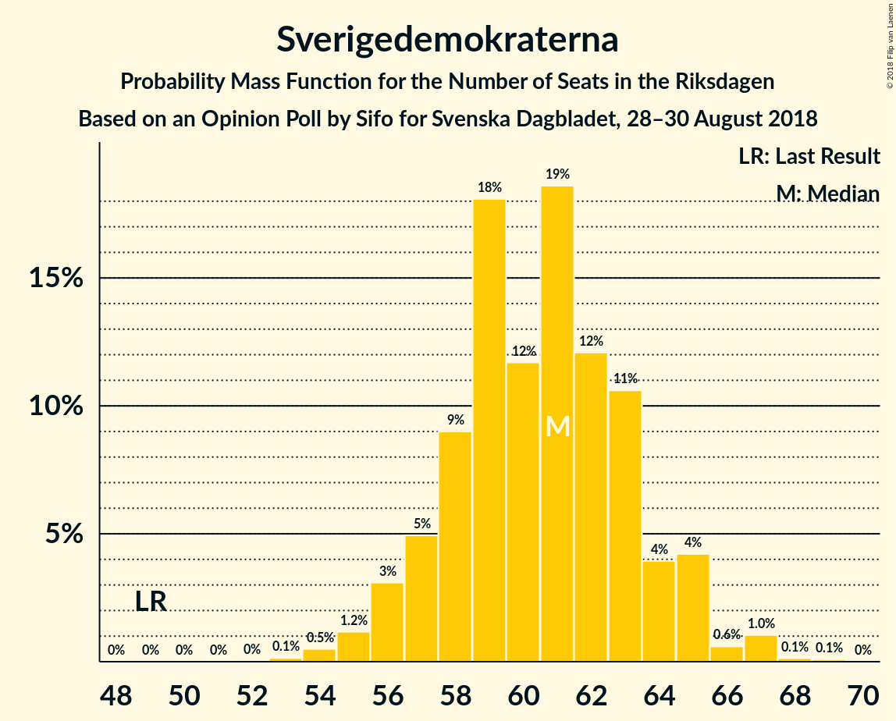
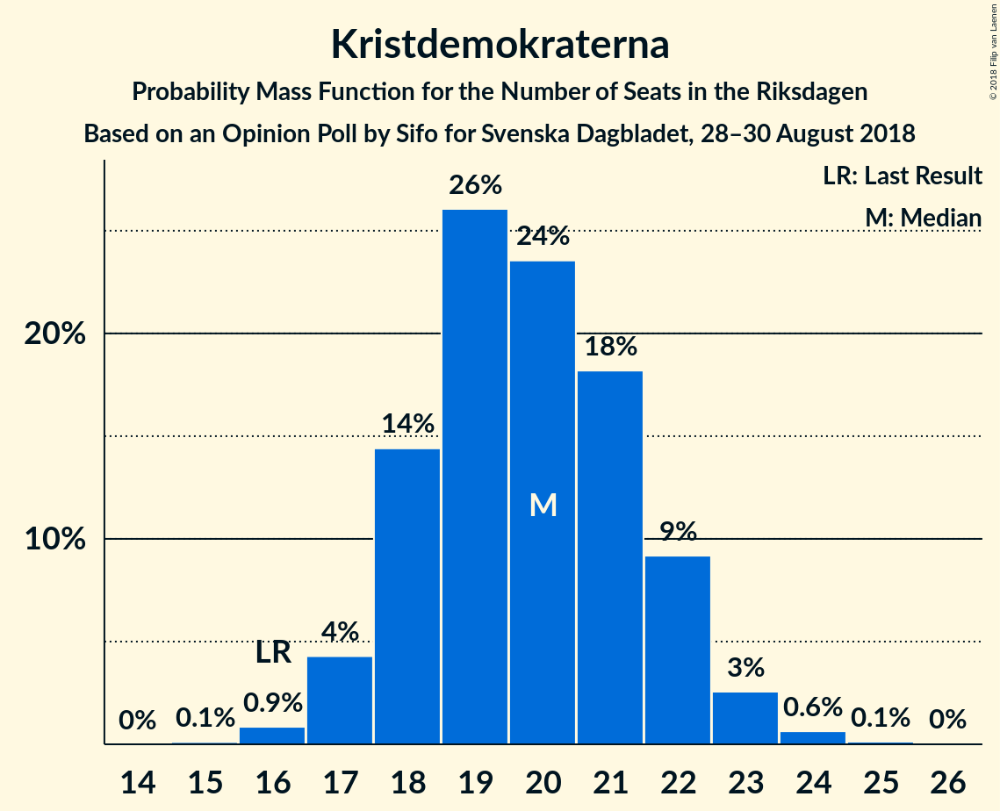

# Opinion Poll by Sifo for Svenska Dagbladet, 28–30 August 2018

<a href="#voting-intentions">Voting Intentions</a> | <a href="#seats">Seats</a> | <a href="#coalitions">Coalitions</a> | <a href="#technical-information">Technical Information</a>

## Voting Intentions

### Confidence Intervals

| Party | Last Result | Poll Result | 80% Confidence Interval | 90% Confidence Interval | 95% Confidence Interval | 99% Confidence Interval |
|:-----:|:-----------:|:-----------:|:-----------------------:|:-----------------------:|:-----------------------:|:-----------------------:|
| Sveriges socialdemokratiska arbetareparti | 31.0% | 25.5% | 24.5–26.6% |24.3–26.9% |24.0–27.1% |23.5–27.6% |
| Sverigedemokraterna | 12.9% | 16.8% | 15.9–17.7% |15.7–18.0% |15.5–18.2% |15.1–18.6% |
| Moderata samlingspartiet | 23.3% | 16.7% | 15.8–17.6% |15.6–17.8% |15.4–18.1% |15.0–18.5% |
| Vänsterpartiet | 5.7% | 10.5% | 9.8–11.2% |9.6–11.4% |9.4–11.6% |9.1–12.0% |
| Centerpartiet | 6.1% | 9.5% | 8.8–10.2% |8.6–10.4% |8.5–10.6% |8.2–10.9% |
| Miljöpartiet de gröna | 6.9% | 6.9% | 6.3–7.5% |6.1–7.7% |6.0–7.8% |5.8–8.1% |
| Liberalerna | 5.4% | 5.5% | 5.0–6.1% |4.8–6.2% |4.7–6.4% |4.5–6.6% |
| Kristdemokraterna | 4.6% | 5.5% | 5.0–6.1% |4.8–6.2% |4.7–6.4% |4.5–6.6% |

*Note:* The poll result column reflects the actual value used in the calculations. Published results may vary slightly, and in addition be rounded to fewer digits.

## Seats

### Confidence Intervals

| Party | Last Result | Median | 80% Confidence Interval | 90% Confidence Interval | 95% Confidence Interval | 99% Confidence Interval |
|:-----:|:-----------:|:------:|:-----------------------:|:-----------------------:|:-----------------------:|:-----------------------:|
| <a href="#sveriges-socialdemokratiska-arbetareparti">Sveriges socialdemokratiska arbetareparti</a> | 113 | 92 | 88–96 |87–97 |86–98 |85–100 |
| <a href="#sverigedemokraterna">Sverigedemokraterna</a> | 49 | 61 | 58–64 |57–65 |56–65 |54–67 |
| <a href="#moderata-samlingspartiet">Moderata samlingspartiet</a> | 84 | 60 | 57–63 |56–64 |55–65 |54–67 |
| <a href="#vänsterpartiet">Vänsterpartiet</a> | 21 | 38 | 35–40 |35–41 |34–42 |33–43 |
| <a href="#centerpartiet">Centerpartiet</a> | 22 | 34 | 31–37 |31–37 |30–38 |29–39 |
| <a href="#miljöpartiet-de-gröna">Miljöpartiet de gröna</a> | 25 | 25 | 23–27 |22–28 |21–28 |21–29 |
| <a href="#liberalerna">Liberalerna</a> | 19 | 20 | 18–22 |17–22 |17–23 |16–24 |
| <a href="#kristdemokraterna">Kristdemokraterna</a> | 16 | 20 | 18–22 |17–22 |17–23 |16–24 |

### Sveriges socialdemokratiska arbetareparti

*For a full overview of the results for this party, see the [Sveriges socialdemokratiska arbetareparti](party-sverigessocialdemokratiskaarbetareparti.html) page.*

| Number of Seats | Probability | Accumulated | Special Marks |
|:---------------:|:-----------:|:-----------:|:-------------:|
| 82 | 0% | 100% |  |
| 83 | 0.1% | 99.9% |  |
| 84 | 0.3% | 99.8% |  |
| 85 | 0.6% | 99.5% |  |
| 86 | 1.5% | 98.9% |  |
| 87 | 3% | 97% |  |
| 88 | 6% | 95% |  |
| 89 | 9% | 89% |  |
| 90 | 14% | 80% |  |
| 91 | 13% | 66% |  |
| 92 | 12% | 53% | Median |
| 93 | 15% | 41% |  |
| 94 | 8% | 26% |  |
| 95 | 6% | 17% |  |
| 96 | 5% | 12% |  |
| 97 | 3% | 6% |  |
| 98 | 1.3% | 3% |  |
| 99 | 1.1% | 2% |  |
| 100 | 0.3% | 0.5% |  |
| 101 | 0.1% | 0.2% |  |
| 102 | 0% | 0% |  |
| 103 | 0% | 0% |  |
| 104 | 0% | 0% |  |
| 105 | 0% | 0% |  |
| 106 | 0% | 0% |  |
| 107 | 0% | 0% |  |
| 108 | 0% | 0% |  |
| 109 | 0% | 0% |  |
| 110 | 0% | 0% |  |
| 111 | 0% | 0% |  |
| 112 | 0% | 0% |  |
| 113 | 0% | 0% | Last Result |

### Sverigedemokraterna

*For a full overview of the results for this party, see the [Sverigedemokraterna](party-sverigedemokraterna.html) page.*

| Number of Seats | Probability | Accumulated | Special Marks |
|:---------------:|:-----------:|:-----------:|:-------------:|
| 49 | 0% | 100% | Last Result |
| 50 | 0% | 100% |  |
| 51 | 0% | 100% |  |
| 52 | 0% | 100% |  |
| 53 | 0.1% | 100% |  |
| 54 | 0.5% | 99.8% |  |
| 55 | 1.2% | 99.3% |  |
| 56 | 3% | 98% |  |
| 57 | 5% | 95% |  |
| 58 | 9% | 90% |  |
| 59 | 18% | 81% |  |
| 60 | 12% | 63% |  |
| 61 | 19% | 51% | Median |
| 62 | 12% | 33% |  |
| 63 | 11% | 21% |  |
| 64 | 4% | 10% |  |
| 65 | 4% | 6% |  |
| 66 | 0.6% | 2% |  |
| 67 | 1.0% | 1.3% |  |
| 68 | 0.1% | 0.2% |  |
| 69 | 0.1% | 0.1% |  |
| 70 | 0% | 0% |  |

### Moderata samlingspartiet

*For a full overview of the results for this party, see the [Moderata samlingspartiet](party-moderatasamlingspartiet.html) page.*

| Number of Seats | Probability | Accumulated | Special Marks |
|:---------------:|:-----------:|:-----------:|:-------------:|
| 52 | 0.1% | 100% |  |
| 53 | 0.3% | 99.9% |  |
| 54 | 0.6% | 99.7% |  |
| 55 | 2% | 99.1% |  |
| 56 | 3% | 97% |  |
| 57 | 6% | 94% |  |
| 58 | 11% | 88% |  |
| 59 | 17% | 77% |  |
| 60 | 13% | 60% | Median |
| 61 | 19% | 47% |  |
| 62 | 12% | 28% |  |
| 63 | 8% | 17% |  |
| 64 | 5% | 9% |  |
| 65 | 2% | 4% |  |
| 66 | 1.1% | 2% |  |
| 67 | 0.3% | 0.5% |  |
| 68 | 0.1% | 0.2% |  |
| 69 | 0% | 0.1% |  |
| 70 | 0% | 0% |  |
| 71 | 0% | 0% |  |
| 72 | 0% | 0% |  |
| 73 | 0% | 0% |  |
| 74 | 0% | 0% |  |
| 75 | 0% | 0% |  |
| 76 | 0% | 0% |  |
| 77 | 0% | 0% |  |
| 78 | 0% | 0% |  |
| 79 | 0% | 0% |  |
| 80 | 0% | 0% |  |
| 81 | 0% | 0% |  |
| 82 | 0% | 0% |  |
| 83 | 0% | 0% |  |
| 84 | 0% | 0% | Last Result |

### Vänsterpartiet

*For a full overview of the results for this party, see the [Vänsterpartiet](party-vänsterpartiet.html) page.*

| Number of Seats | Probability | Accumulated | Special Marks |
|:---------------:|:-----------:|:-----------:|:-------------:|
| 21 | 0% | 100% | Last Result |
| 22 | 0% | 100% |  |
| 23 | 0% | 100% |  |
| 24 | 0% | 100% |  |
| 25 | 0% | 100% |  |
| 26 | 0% | 100% |  |
| 27 | 0% | 100% |  |
| 28 | 0% | 100% |  |
| 29 | 0% | 100% |  |
| 30 | 0% | 100% |  |
| 31 | 0% | 100% |  |
| 32 | 0.4% | 99.9% |  |
| 33 | 1.4% | 99.6% |  |
| 34 | 3% | 98% |  |
| 35 | 10% | 95% |  |
| 36 | 15% | 85% |  |
| 37 | 17% | 70% |  |
| 38 | 19% | 53% | Median |
| 39 | 18% | 34% |  |
| 40 | 8% | 16% |  |
| 41 | 5% | 8% |  |
| 42 | 2% | 3% |  |
| 43 | 0.7% | 1.0% |  |
| 44 | 0.2% | 0.3% |  |
| 45 | 0.1% | 0.1% |  |
| 46 | 0% | 0% |  |

### Centerpartiet

*For a full overview of the results for this party, see the [Centerpartiet](party-centerpartiet.html) page.*

| Number of Seats | Probability | Accumulated | Special Marks |
|:---------------:|:-----------:|:-----------:|:-------------:|
| 22 | 0% | 100% | Last Result |
| 23 | 0% | 100% |  |
| 24 | 0% | 100% |  |
| 25 | 0% | 100% |  |
| 26 | 0% | 100% |  |
| 27 | 0% | 100% |  |
| 28 | 0.1% | 100% |  |
| 29 | 0.5% | 99.9% |  |
| 30 | 2% | 99.4% |  |
| 31 | 7% | 97% |  |
| 32 | 11% | 90% |  |
| 33 | 14% | 79% |  |
| 34 | 20% | 65% | Median |
| 35 | 18% | 44% |  |
| 36 | 16% | 26% |  |
| 37 | 7% | 11% |  |
| 38 | 3% | 4% |  |
| 39 | 1.0% | 1.3% |  |
| 40 | 0.3% | 0.3% |  |
| 41 | 0% | 0% |  |

### Miljöpartiet de gröna

*For a full overview of the results for this party, see the [Miljöpartiet de gröna](party-miljöpartietdegröna.html) page.*

| Number of Seats | Probability | Accumulated | Special Marks |
|:---------------:|:-----------:|:-----------:|:-------------:|
| 20 | 0.3% | 100% |  |
| 21 | 2% | 99.7% |  |
| 22 | 5% | 97% |  |
| 23 | 13% | 92% |  |
| 24 | 20% | 79% |  |
| 25 | 24% | 59% | Last Result, Median |
| 26 | 20% | 35% |  |
| 27 | 9% | 15% |  |
| 28 | 5% | 6% |  |
| 29 | 1.0% | 1.4% |  |
| 30 | 0.3% | 0.4% |  |
| 31 | 0% | 0.1% |  |
| 32 | 0% | 0% |  |

### Liberalerna

*For a full overview of the results for this party, see the [Liberalerna](party-liberalerna.html) page.*

| Number of Seats | Probability | Accumulated | Special Marks |
|:---------------:|:-----------:|:-----------:|:-------------:|
| 15 | 0.1% | 100% |  |
| 16 | 1.2% | 99.9% |  |
| 17 | 6% | 98.7% |  |
| 18 | 17% | 92% |  |
| 19 | 20% | 76% | Last Result |
| 20 | 18% | 55% | Median |
| 21 | 22% | 37% |  |
| 22 | 12% | 16% |  |
| 23 | 3% | 4% |  |
| 24 | 0.7% | 0.8% |  |
| 25 | 0.1% | 0.1% |  |
| 26 | 0% | 0% |  |

### Kristdemokraterna

*For a full overview of the results for this party, see the [Kristdemokraterna](party-kristdemokraterna.html) page.*

| Number of Seats | Probability | Accumulated | Special Marks |
|:---------------:|:-----------:|:-----------:|:-------------:|
| 15 | 0.1% | 100% |  |
| 16 | 0.9% | 99.9% | Last Result |
| 17 | 4% | 99.0% |  |
| 18 | 14% | 95% |  |
| 19 | 26% | 80% |  |
| 20 | 24% | 54% | Median |
| 21 | 18% | 31% |  |
| 22 | 9% | 13% |  |
| 23 | 3% | 3% |  |
| 24 | 0.6% | 0.8% |  |
| 25 | 0.1% | 0.1% |  |
| 26 | 0% | 0% |  |

## Coalitions

### Confidence Intervals

| Coalition | Last Result | Median | Majority? | 80% Confidence Interval | 90% Confidence Interval | 95% Confidence Interval | 99% Confidence Interval |
|:---------:|:-----------:|:------:|:---------:|:-----------------------:|:-----------------------:|:-----------------------:|:-----------------------:|
| Sveriges socialdemokratiska arbetareparti – Moderata samlingspartiet – Centerpartiet | 219 | 186 | 99.9% | 182–191 | 180–192 | 179–193 | 177–195 |
| Sveriges socialdemokratiska arbetareparti – Vänsterpartiet – Miljöpartiet de gröna | 159 | 154 | 0% | 150–159 | 149–160 | 148–161 | 145–163 |
| Sveriges socialdemokratiska arbetareparti – Moderata samlingspartiet | 197 | 152 | 0% | 148–156 | 147–157 | 146–158 | 143–161 |
| Sverigedemokraterna – Moderata samlingspartiet – Kristdemokraterna | 149 | 140 | 0% | 136–145 | 135–146 | 134–147 | 132–149 |
| Moderata samlingspartiet – Centerpartiet – Kristdemokraterna – Liberalerna | 141 | 134 | 0% | 129–138 | 129–139 | 128–140 | 125–142 |
| Sveriges socialdemokratiska arbetareparti – Vänsterpartiet | 134 | 130 | 0% | 126–134 | 124–135 | 123–136 | 121–138 |
| Sverigedemokraterna – Moderata samlingspartiet | 133 | 120 | 0% | 117–125 | 115–126 | 115–127 | 112–129 |
| Sveriges socialdemokratiska arbetareparti – Miljöpartiet de gröna | 138 | 117 | 0% | 113–121 | 112–122 | 111–123 | 109–125 |
| Moderata samlingspartiet – Centerpartiet – Kristdemokraterna | 122 | 114 | 0% | 110–118 | 109–119 | 108–120 | 106–122 |
| Moderata samlingspartiet – Centerpartiet – Liberalerna | 125 | 114 | 0% | 110–118 | 109–119 | 108–120 | 106–122 |
| Moderata samlingspartiet – Centerpartiet | 106 | 95 | 0% | 91–98 | 90–99 | 88–100 | 87–102 |

