# Opinion Poll by SKOP, 25–31 August 2018

<a href="#voting-intentions">Voting Intentions</a> | <a href="#seats">Seats</a> | <a href="#coalitions">Coalitions</a> | <a href="#technical-information">Technical Information</a>

## Voting Intentions

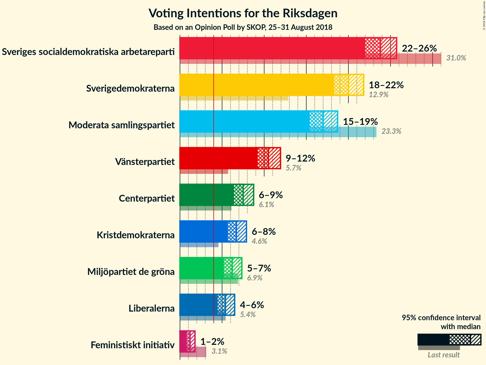

### Confidence Intervals

| Party | Last Result | Poll Result | 80% Confidence Interval | 90% Confidence Interval | 95% Confidence Interval | 99% Confidence Interval |
|:-----:|:-----------:|:-----------:|:-----------------------:|:-----------------------:|:-----------------------:|:-----------------------:|
| Sveriges socialdemokratiska arbetareparti | 31.0% | 23.8% | 22.6–25.1% |22.3–25.4% |22.0–25.7% |21.4–26.3% |
| Sverigedemokraterna | 12.9% | 20.0% | 18.9–21.2% |18.6–21.5% |18.3–21.8% |17.8–22.4% |
| Moderata samlingspartiet | 23.3% | 17.0% | 16.0–18.1% |15.7–18.4% |15.4–18.7% |14.9–19.3% |
| Vänsterpartiet | 5.7% | 10.5% | 9.7–11.4% |9.4–11.7% |9.2–11.9% |8.8–12.4% |
| Centerpartiet | 6.1% | 7.5% | 6.8–8.3% |6.6–8.6% |6.4–8.7% |6.1–9.1% |
| Kristdemokraterna | 4.6% | 6.7% | 6.0–7.5% |5.8–7.7% |5.7–7.9% |5.4–8.3% |
| Miljöpartiet de gröna | 6.9% | 6.2% | 5.5–7.0% |5.4–7.2% |5.2–7.3% |4.9–7.7% |
| Liberalerna | 5.4% | 5.4% | 4.8–6.1% |4.6–6.3% |4.5–6.5% |4.2–6.8% |
| Feministiskt initiativ | 3.1% | 1.2% | 0.9–1.6% |0.9–1.7% |0.8–1.8% |0.7–2.0% |

*Note:* The poll result column reflects the actual value used in the calculations. Published results may vary slightly, and in addition be rounded to fewer digits.

## Seats

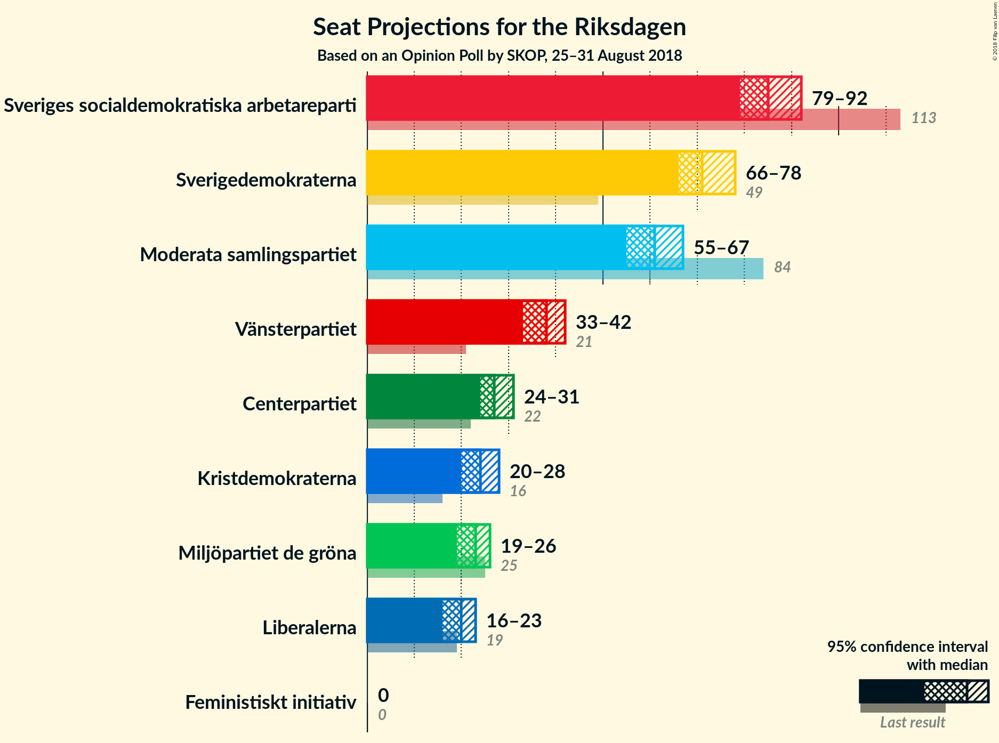

### Confidence Intervals

| Party | Last Result | Median | 80% Confidence Interval | 90% Confidence Interval | 95% Confidence Interval | 99% Confidence Interval |
|:-----:|:-----------:|:------:|:-----------------------:|:-----------------------:|:-----------------------:|:-----------------------:|
| <a href="#sveriges-socialdemokratiska-arbetareparti">Sveriges socialdemokratiska arbetareparti</a> | 113 | 85 | 81–90 |79–91 |79–92 |77–94 |
| <a href="#sverigedemokraterna">Sverigedemokraterna</a> | 49 | 71 | 68–75 |67–77 |66–78 |64–80 |
| <a href="#moderata-samlingspartiet">Moderata samlingspartiet</a> | 84 | 61 | 57–64 |56–66 |55–67 |54–69 |
| <a href="#vänsterpartiet">Vänsterpartiet</a> | 21 | 38 | 35–41 |34–42 |33–42 |32–45 |
| <a href="#centerpartiet">Centerpartiet</a> | 22 | 27 | 25–29 |24–30 |24–31 |23–33 |
| <a href="#kristdemokraterna">Kristdemokraterna</a> | 16 | 24 | 22–27 |21–28 |20–28 |19–30 |
| <a href="#miljöpartiet-de-gröna">Miljöpartiet de gröna</a> | 25 | 23 | 20–25 |20–25 |19–26 |18–27 |
| <a href="#liberalerna">Liberalerna</a> | 19 | 20 | 17–22 |16–22 |16–23 |15–25 |
| <a href="#feministiskt-initiativ">Feministiskt initiativ</a> | 0 | 0 | 0 |0 |0 |0 |

### Sveriges socialdemokratiska arbetareparti

*For a full overview of the results for this party, see the [Sveriges socialdemokratiska arbetareparti](party-sverigessocialdemokratiskaarbetareparti.html) page.*

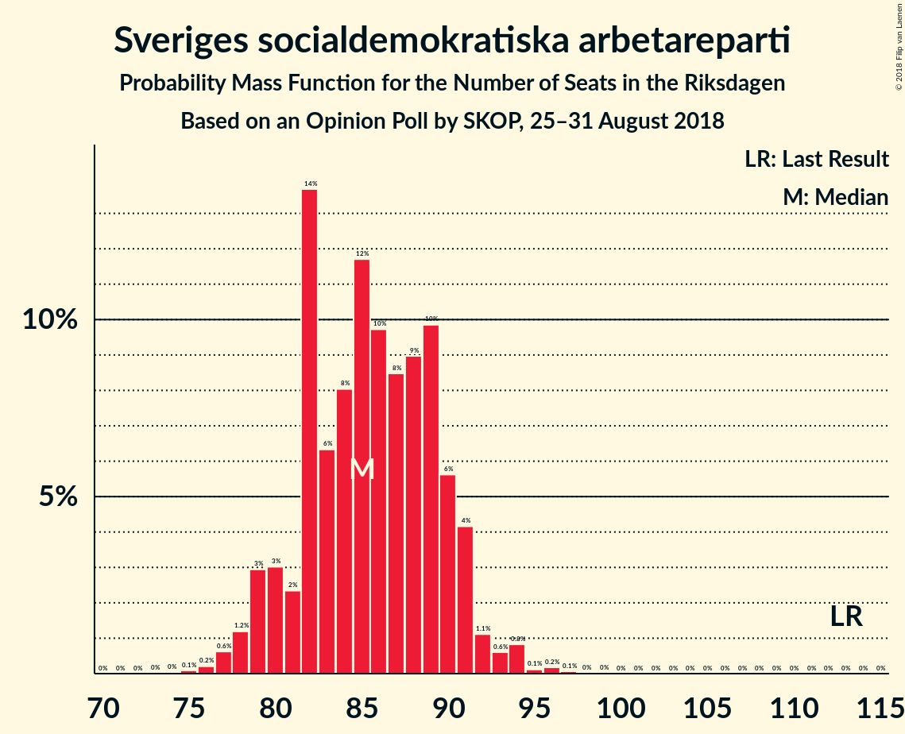

| Number of Seats | Probability | Accumulated | Special Marks |
|:---------------:|:-----------:|:-----------:|:-------------:|
| 75 | 0.1% | 100% |  |
| 76 | 0.2% | 99.9% |  |
| 77 | 0.6% | 99.7% |  |
| 78 | 1.2% | 99.0% |  |
| 79 | 3% | 98% |  |
| 80 | 3% | 95% |  |
| 81 | 2% | 92% |  |
| 82 | 14% | 90% |  |
| 83 | 6% | 76% |  |
| 84 | 8% | 70% |  |
| 85 | 12% | 61% | Median |
| 86 | 10% | 50% |  |
| 87 | 8% | 40% |  |
| 88 | 9% | 32% |  |
| 89 | 10% | 23% |  |
| 90 | 6% | 13% |  |
| 91 | 4% | 7% |  |
| 92 | 1.1% | 3% |  |
| 93 | 0.6% | 2% |  |
| 94 | 0.8% | 1.2% |  |
| 95 | 0.1% | 0.4% |  |
| 96 | 0.2% | 0.3% |  |
| 97 | 0.1% | 0.1% |  |
| 98 | 0% | 0% |  |
| 99 | 0% | 0% |  |
| 100 | 0% | 0% |  |
| 101 | 0% | 0% |  |
| 102 | 0% | 0% |  |
| 103 | 0% | 0% |  |
| 104 | 0% | 0% |  |
| 105 | 0% | 0% |  |
| 106 | 0% | 0% |  |
| 107 | 0% | 0% |  |
| 108 | 0% | 0% |  |
| 109 | 0% | 0% |  |
| 110 | 0% | 0% |  |
| 111 | 0% | 0% |  |
| 112 | 0% | 0% |  |
| 113 | 0% | 0% | Last Result |

### Sverigedemokraterna

*For a full overview of the results for this party, see the [Sverigedemokraterna](party-sverigedemokraterna.html) page.*

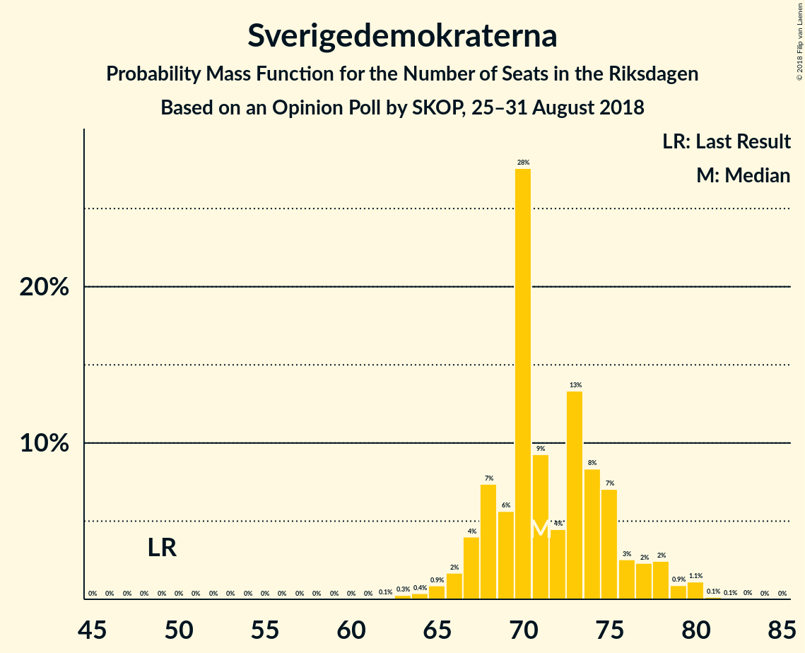

| Number of Seats | Probability | Accumulated | Special Marks |
|:---------------:|:-----------:|:-----------:|:-------------:|
| 49 | 0% | 100% | Last Result |
| 50 | 0% | 100% |  |
| 51 | 0% | 100% |  |
| 52 | 0% | 100% |  |
| 53 | 0% | 100% |  |
| 54 | 0% | 100% |  |
| 55 | 0% | 100% |  |
| 56 | 0% | 100% |  |
| 57 | 0% | 100% |  |
| 58 | 0% | 100% |  |
| 59 | 0% | 100% |  |
| 60 | 0% | 100% |  |
| 61 | 0% | 100% |  |
| 62 | 0.1% | 100% |  |
| 63 | 0.3% | 99.9% |  |
| 64 | 0.4% | 99.6% |  |
| 65 | 0.9% | 99.2% |  |
| 66 | 2% | 98% |  |
| 67 | 4% | 97% |  |
| 68 | 7% | 93% |  |
| 69 | 6% | 85% |  |
| 70 | 28% | 80% |  |
| 71 | 9% | 52% | Median |
| 72 | 4% | 43% |  |
| 73 | 13% | 38% |  |
| 74 | 8% | 25% |  |
| 75 | 7% | 17% |  |
| 76 | 3% | 10% |  |
| 77 | 2% | 7% |  |
| 78 | 2% | 5% |  |
| 79 | 0.9% | 2% |  |
| 80 | 1.1% | 1.4% |  |
| 81 | 0.1% | 0.3% |  |
| 82 | 0.1% | 0.1% |  |
| 83 | 0% | 0% |  |

### Moderata samlingspartiet

*For a full overview of the results for this party, see the [Moderata samlingspartiet](party-moderatasamlingspartiet.html) page.*

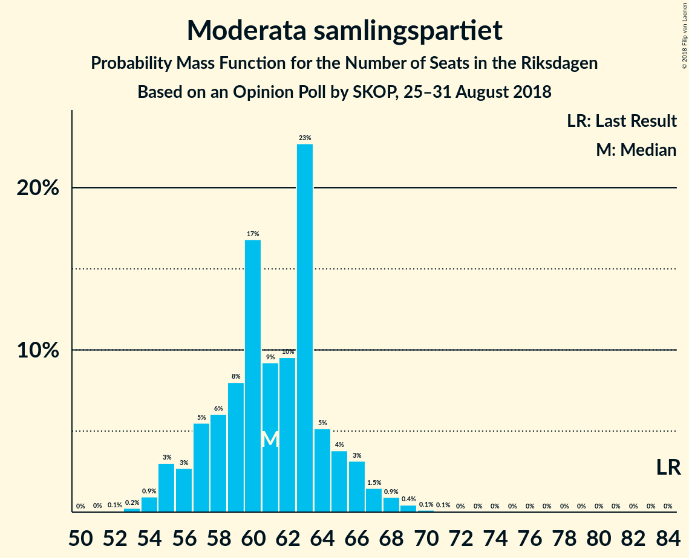

| Number of Seats | Probability | Accumulated | Special Marks |
|:---------------:|:-----------:|:-----------:|:-------------:|
| 52 | 0.1% | 100% |  |
| 53 | 0.2% | 99.9% |  |
| 54 | 0.9% | 99.6% |  |
| 55 | 3% | 98.7% |  |
| 56 | 3% | 96% |  |
| 57 | 5% | 93% |  |
| 58 | 6% | 87% |  |
| 59 | 8% | 81% |  |
| 60 | 17% | 73% |  |
| 61 | 9% | 57% | Median |
| 62 | 10% | 47% |  |
| 63 | 23% | 38% |  |
| 64 | 5% | 15% |  |
| 65 | 4% | 10% |  |
| 66 | 3% | 6% |  |
| 67 | 1.5% | 3% |  |
| 68 | 0.9% | 2% |  |
| 69 | 0.4% | 0.7% |  |
| 70 | 0.1% | 0.2% |  |
| 71 | 0.1% | 0.1% |  |
| 72 | 0% | 0% |  |
| 73 | 0% | 0% |  |
| 74 | 0% | 0% |  |
| 75 | 0% | 0% |  |
| 76 | 0% | 0% |  |
| 77 | 0% | 0% |  |
| 78 | 0% | 0% |  |
| 79 | 0% | 0% |  |
| 80 | 0% | 0% |  |
| 81 | 0% | 0% |  |
| 82 | 0% | 0% |  |
| 83 | 0% | 0% |  |
| 84 | 0% | 0% | Last Result |

### Vänsterpartiet

*For a full overview of the results for this party, see the [Vänsterpartiet](party-vänsterpartiet.html) page.*

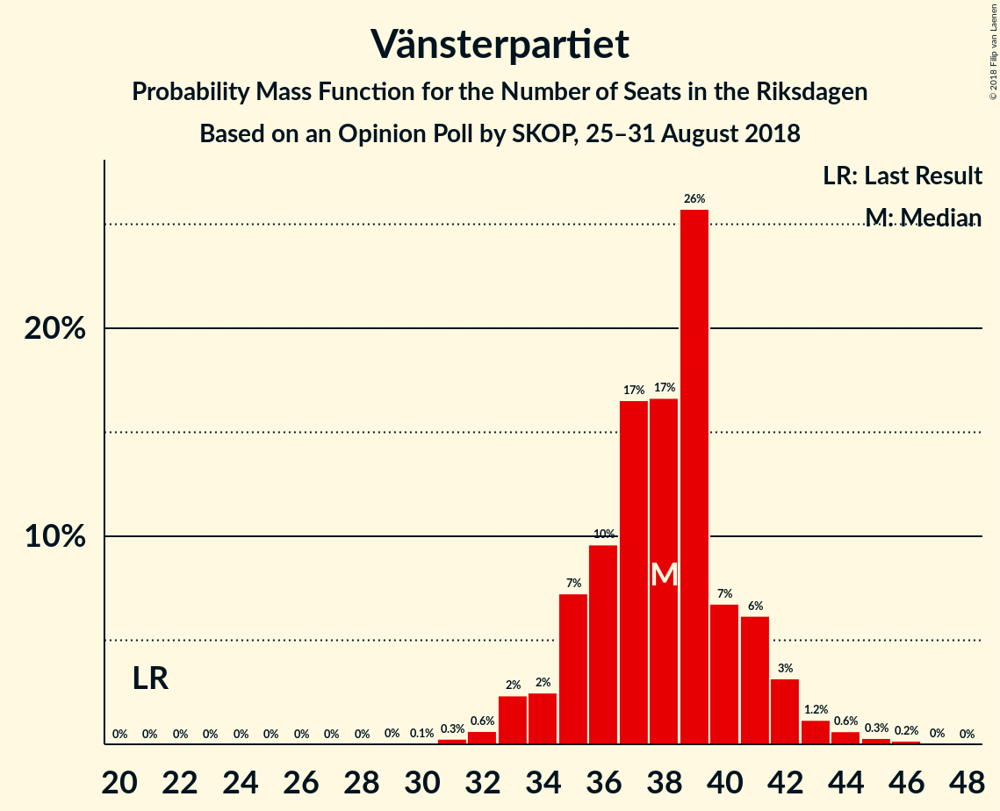

| Number of Seats | Probability | Accumulated | Special Marks |
|:---------------:|:-----------:|:-----------:|:-------------:|
| 21 | 0% | 100% | Last Result |
| 22 | 0% | 100% |  |
| 23 | 0% | 100% |  |
| 24 | 0% | 100% |  |
| 25 | 0% | 100% |  |
| 26 | 0% | 100% |  |
| 27 | 0% | 100% |  |
| 28 | 0% | 100% |  |
| 29 | 0% | 100% |  |
| 30 | 0.1% | 100% |  |
| 31 | 0.3% | 99.9% |  |
| 32 | 0.6% | 99.7% |  |
| 33 | 2% | 99.0% |  |
| 34 | 2% | 97% |  |
| 35 | 7% | 94% |  |
| 36 | 10% | 87% |  |
| 37 | 17% | 77% |  |
| 38 | 17% | 61% | Median |
| 39 | 26% | 44% |  |
| 40 | 7% | 18% |  |
| 41 | 6% | 12% |  |
| 42 | 3% | 5% |  |
| 43 | 1.2% | 2% |  |
| 44 | 0.6% | 1.1% |  |
| 45 | 0.3% | 0.5% |  |
| 46 | 0.2% | 0.2% |  |
| 47 | 0% | 0% |  |

### Centerpartiet

*For a full overview of the results for this party, see the [Centerpartiet](party-centerpartiet.html) page.*

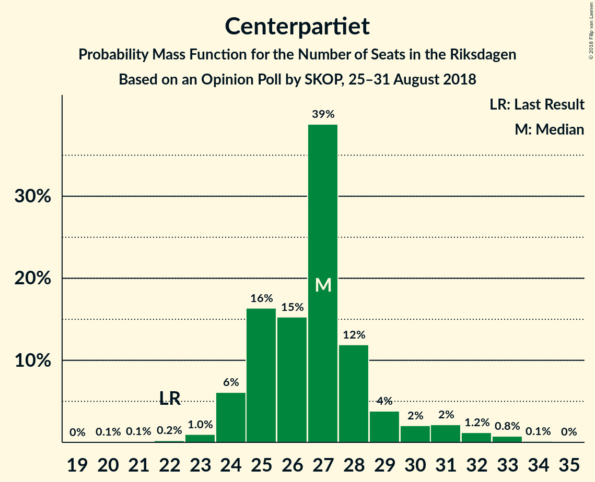

| Number of Seats | Probability | Accumulated | Special Marks |
|:---------------:|:-----------:|:-----------:|:-------------:|
| 20 | 0.1% | 100% |  |
| 21 | 0.1% | 99.9% |  |
| 22 | 0.2% | 99.8% | Last Result |
| 23 | 1.0% | 99.6% |  |
| 24 | 6% | 98.6% |  |
| 25 | 16% | 93% |  |
| 26 | 15% | 76% |  |
| 27 | 39% | 61% | Median |
| 28 | 12% | 22% |  |
| 29 | 4% | 10% |  |
| 30 | 2% | 6% |  |
| 31 | 2% | 4% |  |
| 32 | 1.2% | 2% |  |
| 33 | 0.8% | 0.9% |  |
| 34 | 0.1% | 0.2% |  |
| 35 | 0% | 0% |  |

### Kristdemokraterna

*For a full overview of the results for this party, see the [Kristdemokraterna](party-kristdemokraterna.html) page.*

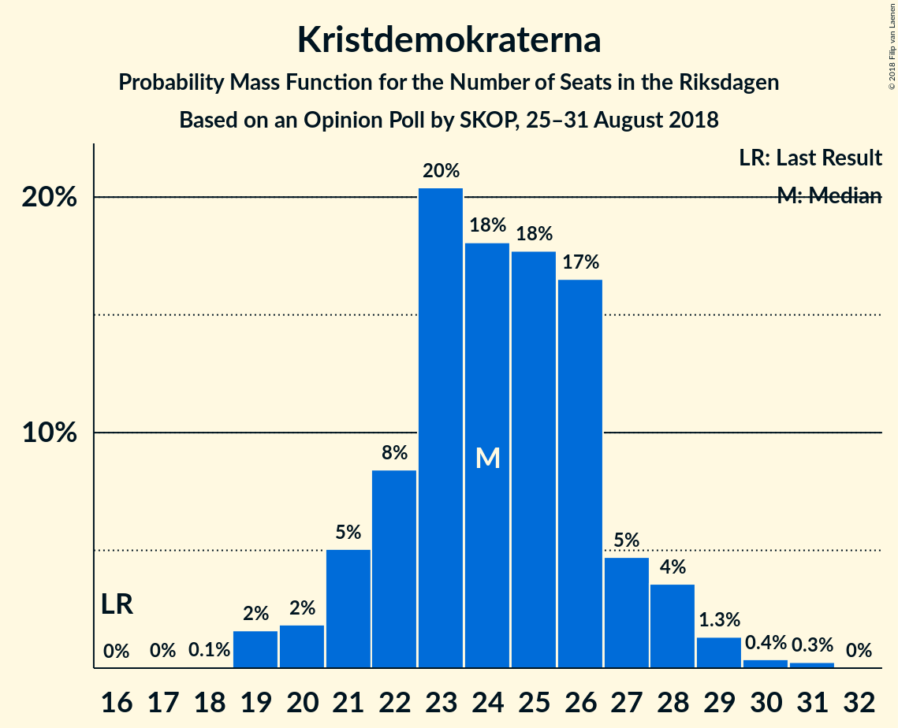

| Number of Seats | Probability | Accumulated | Special Marks |
|:---------------:|:-----------:|:-----------:|:-------------:|
| 16 | 0% | 100% | Last Result |
| 17 | 0% | 100% |  |
| 18 | 0.1% | 100% |  |
| 19 | 2% | 99.9% |  |
| 20 | 2% | 98% |  |
| 21 | 5% | 96% |  |
| 22 | 8% | 91% |  |
| 23 | 20% | 83% |  |
| 24 | 18% | 63% | Median |
| 25 | 18% | 45% |  |
| 26 | 17% | 27% |  |
| 27 | 5% | 10% |  |
| 28 | 4% | 6% |  |
| 29 | 1.3% | 2% |  |
| 30 | 0.4% | 0.7% |  |
| 31 | 0.3% | 0.3% |  |
| 32 | 0% | 0% |  |

### Miljöpartiet de gröna

*For a full overview of the results for this party, see the [Miljöpartiet de gröna](party-miljöpartietdegröna.html) page.*

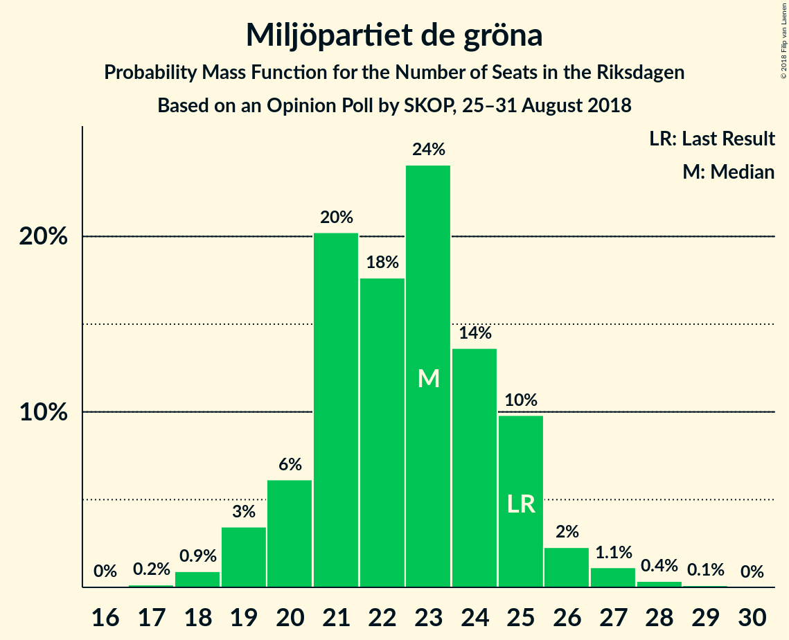

| Number of Seats | Probability | Accumulated | Special Marks |
|:---------------:|:-----------:|:-----------:|:-------------:|
| 17 | 0.2% | 100% |  |
| 18 | 0.9% | 99.8% |  |
| 19 | 3% | 98.9% |  |
| 20 | 6% | 95% |  |
| 21 | 20% | 89% |  |
| 22 | 18% | 69% |  |
| 23 | 24% | 51% | Median |
| 24 | 14% | 27% |  |
| 25 | 10% | 14% | Last Result |
| 26 | 2% | 4% |  |
| 27 | 1.1% | 2% |  |
| 28 | 0.4% | 0.5% |  |
| 29 | 0.1% | 0.1% |  |
| 30 | 0% | 0% |  |

### Liberalerna

*For a full overview of the results for this party, see the [Liberalerna](party-liberalerna.html) page.*

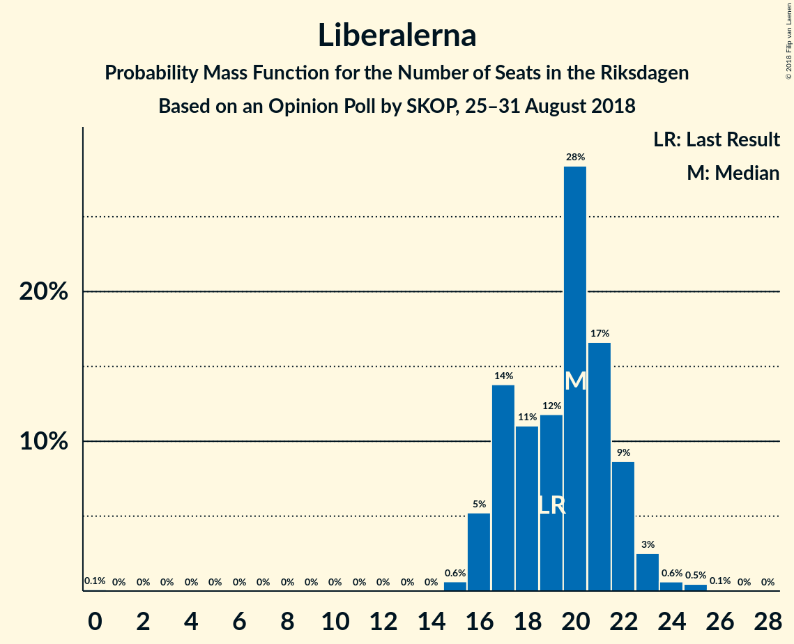

| Number of Seats | Probability | Accumulated | Special Marks |
|:---------------:|:-----------:|:-----------:|:-------------:|
| 0 | 0.1% | 100% |  |
| 1 | 0% | 99.9% |  |
| 2 | 0% | 99.9% |  |
| 3 | 0% | 99.9% |  |
| 4 | 0% | 99.9% |  |
| 5 | 0% | 99.9% |  |
| 6 | 0% | 99.9% |  |
| 7 | 0% | 99.9% |  |
| 8 | 0% | 99.9% |  |
| 9 | 0% | 99.9% |  |
| 10 | 0% | 99.9% |  |
| 11 | 0% | 99.9% |  |
| 12 | 0% | 99.9% |  |
| 13 | 0% | 99.9% |  |
| 14 | 0% | 99.9% |  |
| 15 | 0.6% | 99.9% |  |
| 16 | 5% | 99.2% |  |
| 17 | 14% | 94% |  |
| 18 | 11% | 80% |  |
| 19 | 12% | 69% | Last Result |
| 20 | 28% | 57% | Median |
| 21 | 17% | 29% |  |
| 22 | 9% | 12% |  |
| 23 | 3% | 4% |  |
| 24 | 0.6% | 1.2% |  |
| 25 | 0.5% | 0.6% |  |
| 26 | 0.1% | 0.1% |  |
| 27 | 0% | 0% |  |

### Feministiskt initiativ

*For a full overview of the results for this party, see the [Feministiskt initiativ](party-feministisktinitiativ.html) page.*

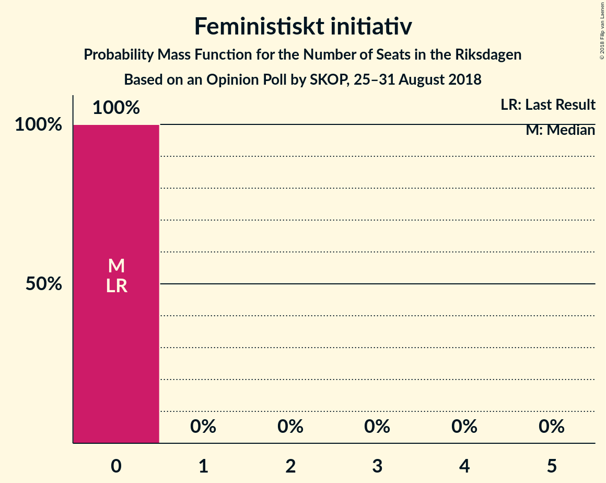

| Number of Seats | Probability | Accumulated | Special Marks |
|:---------------:|:-----------:|:-----------:|:-------------:|
| 0 | 100% | 100% | Last Result, Median |

## Coalitions

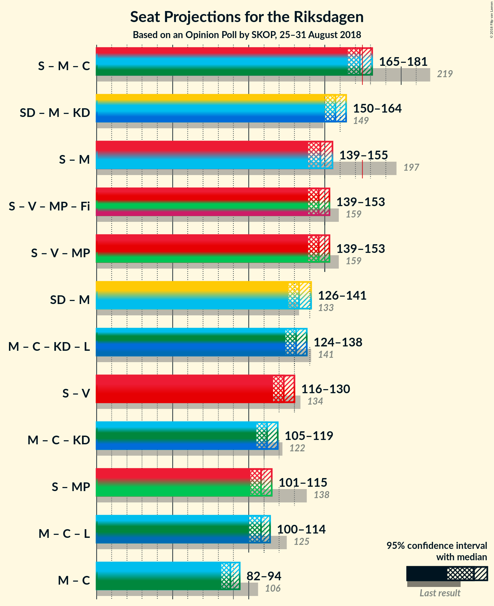

### Confidence Intervals

| Coalition | Last Result | Median | Majority? | 80% Confidence Interval | 90% Confidence Interval | 95% Confidence Interval | 99% Confidence Interval |
|:---------:|:-----------:|:------:|:---------:|:-----------------------:|:-----------------------:|:-----------------------:|:-----------------------:|
| Sveriges socialdemokratiska arbetareparti – Moderata samlingspartiet – Centerpartiet | 219 | 173 | 40% | 168–177 | 167–180 | 165–181 | 164–184 |
| Sverigedemokraterna – Moderata samlingspartiet – Kristdemokraterna | 149 | 157 | 0% | 153–162 | 151–164 | 150–164 | 147–167 |
| Sveriges socialdemokratiska arbetareparti – Moderata samlingspartiet | 197 | 147 | 0% | 141–151 | 140–153 | 139–155 | 136–157 |
| Sveriges socialdemokratiska arbetareparti – Vänsterpartiet – Miljöpartiet de gröna – Feministiskt initiativ | 159 | 146 | 0% | 141–151 | 139–152 | 139–153 | 136–156 |
| Sveriges socialdemokratiska arbetareparti – Vänsterpartiet – Miljöpartiet de gröna | 159 | 146 | 0% | 141–151 | 139–152 | 139–153 | 136–156 |
| Sverigedemokraterna – Moderata samlingspartiet | 133 | 133 | 0% | 128–138 | 127–139 | 126–141 | 123–143 |
| Moderata samlingspartiet – Centerpartiet – Kristdemokraterna – Liberalerna | 141 | 131 | 0% | 127–136 | 126–137 | 124–138 | 122–141 |
| Sveriges socialdemokratiska arbetareparti – Vänsterpartiet | 134 | 123 | 0% | 119–128 | 117–130 | 116–130 | 114–133 |
| Moderata samlingspartiet – Centerpartiet – Kristdemokraterna | 122 | 112 | 0% | 108–116 | 107–117 | 105–119 | 103–121 |
| Sveriges socialdemokratiska arbetareparti – Miljöpartiet de gröna | 138 | 108 | 0% | 103–112 | 102–114 | 101–115 | 99–117 |
| Moderata samlingspartiet – Centerpartiet – Liberalerna | 125 | 108 | 0% | 103–111 | 102–112 | 100–114 | 98–117 |
| Moderata samlingspartiet – Centerpartiet | 106 | 88 | 0% | 84–91 | 83–93 | 82–94 | 79–97 |

