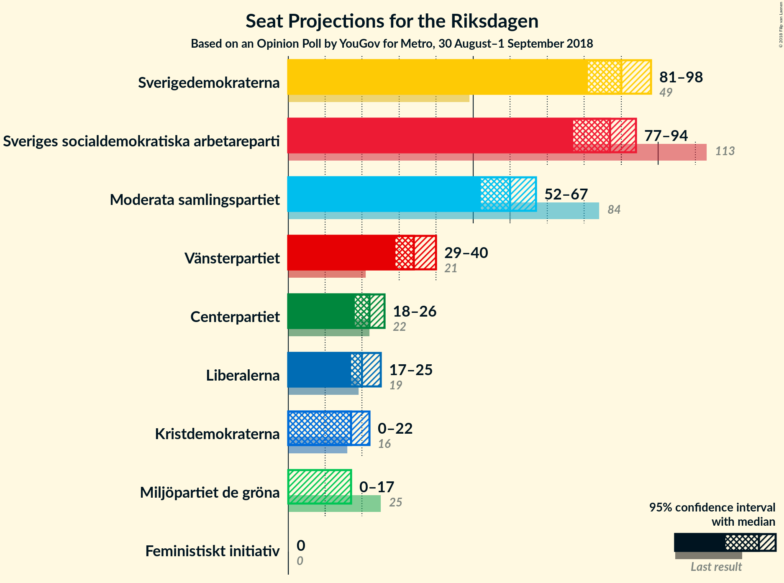
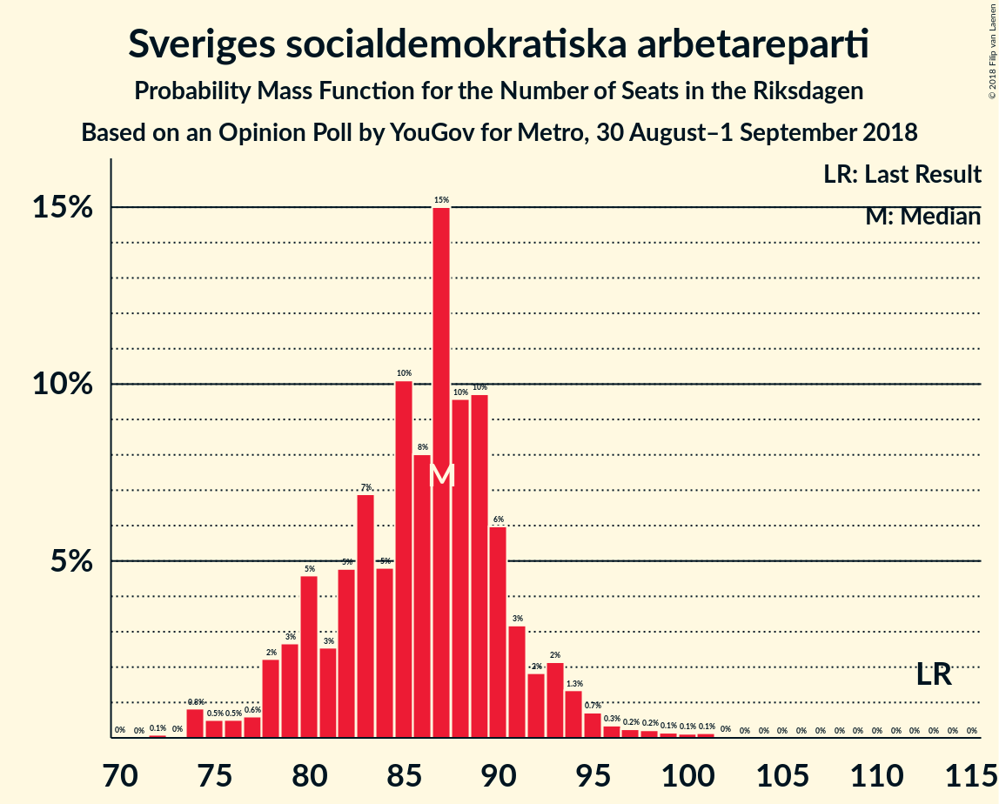
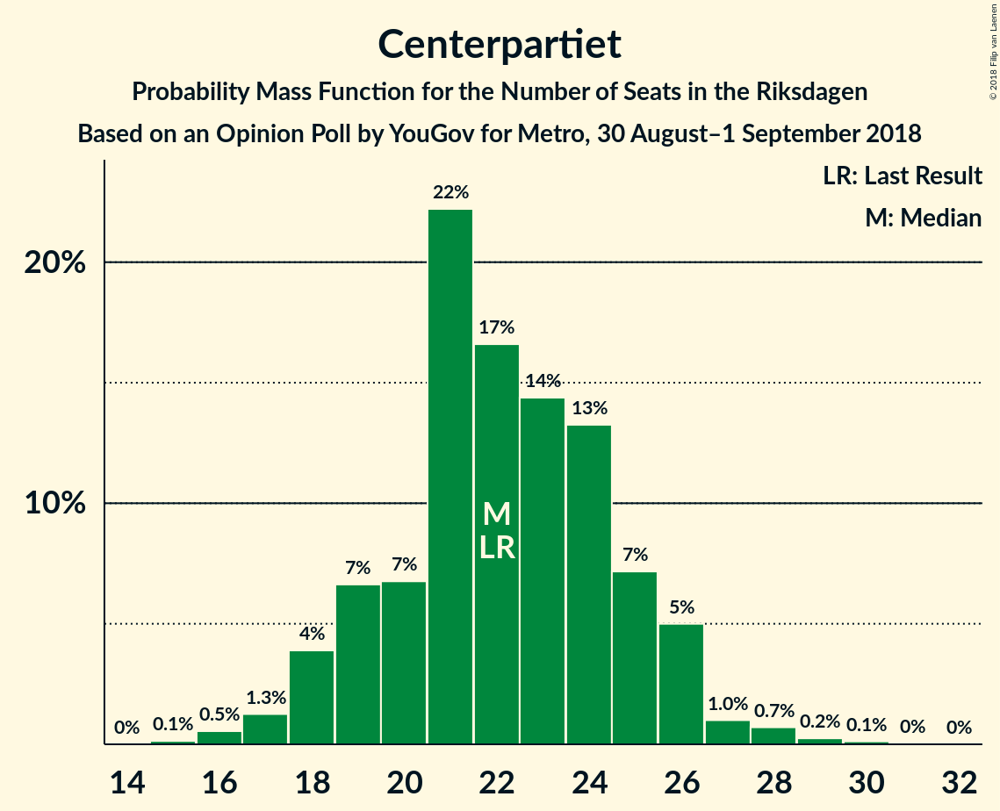

# Opinion Poll by YouGov for Metro, 30 August–1 September 2018

<a href="#voting-intentions">Voting Intentions</a> | <a href="#seats">Seats</a> | <a href="#coalitions">Coalitions</a> | <a href="#technical-information">Technical Information</a>

## Voting Intentions

### Confidence Intervals

| Party | Last Result | Poll Result | 80% Confidence Interval | 90% Confidence Interval | 95% Confidence Interval | 99% Confidence Interval |
|:-----:|:-----------:|:-----------:|:-----------------------:|:-----------------------:|:-----------------------:|:-----------------------:|
| Sverigedemokraterna | 12.9% | 24.8% | 23.3–26.3% |22.9–26.8% |22.6–27.1% |21.9–27.9% |
| Sveriges socialdemokratiska arbetareparti | 31.0% | 23.8% | 22.3–25.3% |21.9–25.7% |21.6–26.1% |20.9–26.8% |
| Moderata samlingspartiet | 23.3% | 16.5% | 15.3–17.8% |14.9–18.2% |14.6–18.6% |14.1–19.2% |
| Vänsterpartiet | 5.7% | 9.4% | 8.4–10.5% |8.2–10.8% |7.9–11.0% |7.5–11.6% |
| Centerpartiet | 6.1% | 6.0% | 5.3–6.9% |5.1–7.2% |4.9–7.4% |4.5–7.9% |
| Liberalerna | 5.4% | 5.7% | 4.9–6.6% |4.7–6.8% |4.6–7.0% |4.2–7.5% |
| Kristdemokraterna | 4.6% | 4.8% | 4.1–5.6% |3.9–5.9% |3.8–6.1% |3.5–6.5% |
| Miljöpartiet de gröna | 6.9% | 3.6% | 3.1–4.4% |2.9–4.6% |2.8–4.8% |2.5–5.1% |
| Feministiskt initiativ | 3.1% | 0.6% | 0.4–0.9% |0.3–1.1% |0.3–1.1% |0.2–1.4% |

*Note:* The poll result column reflects the actual value used in the calculations. Published results may vary slightly, and in addition be rounded to fewer digits.

## Seats

### Confidence Intervals

| Party | Last Result | Median | 80% Confidence Interval | 90% Confidence Interval | 95% Confidence Interval | 99% Confidence Interval |
|:-----:|:-----------:|:------:|:-----------------------:|:-----------------------:|:-----------------------:|:-----------------------:|
| <a href="#sverigedemokraterna">Sverigedemokraterna</a> | 49 | 90 | 84–95 |83–96 |81–98 |79–103 |
| <a href="#sveriges-socialdemokratiska-arbetareparti">Sveriges socialdemokratiska arbetareparti</a> | 113 | 87 | 80–91 |79–93 |77–94 |74–98 |
| <a href="#moderata-samlingspartiet">Moderata samlingspartiet</a> | 84 | 60 | 55–64 |54–66 |52–67 |50–70 |
| <a href="#vänsterpartiet">Vänsterpartiet</a> | 21 | 34 | 30–38 |29–39 |29–40 |27–42 |
| <a href="#centerpartiet">Centerpartiet</a> | 22 | 22 | 19–25 |18–26 |18–26 |16–28 |
| <a href="#liberalerna">Liberalerna</a> | 19 | 20 | 18–23 |17–24 |17–25 |15–27 |
| <a href="#kristdemokraterna">Kristdemokraterna</a> | 16 | 17 | 15–20 |14–21 |0–22 |0–23 |
| <a href="#miljöpartiet-de-gröna">Miljöpartiet de gröna</a> | 25 | 0 | 0–15 |0–16 |0–17 |0–18 |
| <a href="#feministiskt-initiativ">Feministiskt initiativ</a> | 0 | 0 | 0 |0 |0 |0 |

### Sverigedemokraterna

*For a full overview of the results for this party, see the [Sverigedemokraterna](party-sverigedemokraterna.html) page.*

| Number of Seats | Probability | Accumulated | Special Marks |
|:---------------:|:-----------:|:-----------:|:-------------:|
| 49 | 0% | 100% | Last Result |
| 50 | 0% | 100% |  |
| 51 | 0% | 100% |  |
| 52 | 0% | 100% |  |
| 53 | 0% | 100% |  |
| 54 | 0% | 100% |  |
| 55 | 0% | 100% |  |
| 56 | 0% | 100% |  |
| 57 | 0% | 100% |  |
| 58 | 0% | 100% |  |
| 59 | 0% | 100% |  |
| 60 | 0% | 100% |  |
| 61 | 0% | 100% |  |
| 62 | 0% | 100% |  |
| 63 | 0% | 100% |  |
| 64 | 0% | 100% |  |
| 65 | 0% | 100% |  |
| 66 | 0% | 100% |  |
| 67 | 0% | 100% |  |
| 68 | 0% | 100% |  |
| 69 | 0% | 100% |  |
| 70 | 0% | 100% |  |
| 71 | 0% | 100% |  |
| 72 | 0% | 100% |  |
| 73 | 0% | 100% |  |
| 74 | 0% | 100% |  |
| 75 | 0.1% | 100% |  |
| 76 | 0.1% | 99.9% |  |
| 77 | 0.1% | 99.8% |  |
| 78 | 0.1% | 99.7% |  |
| 79 | 0.4% | 99.5% |  |
| 80 | 1.1% | 99.1% |  |
| 81 | 2% | 98% |  |
| 82 | 1.0% | 96% |  |
| 83 | 2% | 95% |  |
| 84 | 4% | 93% |  |
| 85 | 7% | 89% |  |
| 86 | 7% | 81% |  |
| 87 | 2% | 74% |  |
| 88 | 8% | 73% |  |
| 89 | 10% | 64% |  |
| 90 | 12% | 55% | Median |
| 91 | 5% | 43% |  |
| 92 | 3% | 38% |  |
| 93 | 13% | 34% |  |
| 94 | 7% | 22% |  |
| 95 | 9% | 15% |  |
| 96 | 1.4% | 6% |  |
| 97 | 0.8% | 5% |  |
| 98 | 2% | 4% |  |
| 99 | 0.4% | 2% |  |
| 100 | 0.3% | 2% |  |
| 101 | 0.5% | 2% |  |
| 102 | 0.5% | 1.3% |  |
| 103 | 0.6% | 0.8% |  |
| 104 | 0.1% | 0.3% |  |
| 105 | 0% | 0.2% |  |
| 106 | 0.1% | 0.2% |  |
| 107 | 0% | 0.1% |  |
| 108 | 0% | 0.1% |  |
| 109 | 0.1% | 0.1% |  |
| 110 | 0% | 0% |  |

### Sveriges socialdemokratiska arbetareparti

*For a full overview of the results for this party, see the [Sveriges socialdemokratiska arbetareparti](party-sverigessocialdemokratiskaarbetareparti.html) page.*

| Number of Seats | Probability | Accumulated | Special Marks |
|:---------------:|:-----------:|:-----------:|:-------------:|
| 72 | 0.1% | 100% |  |
| 73 | 0% | 99.9% |  |
| 74 | 0.8% | 99.8% |  |
| 75 | 0.5% | 99.0% |  |
| 76 | 0.5% | 98% |  |
| 77 | 0.6% | 98% |  |
| 78 | 2% | 97% |  |
| 79 | 3% | 95% |  |
| 80 | 5% | 92% |  |
| 81 | 3% | 88% |  |
| 82 | 5% | 85% |  |
| 83 | 7% | 81% |  |
| 84 | 5% | 74% |  |
| 85 | 10% | 69% |  |
| 86 | 8% | 59% |  |
| 87 | 15% | 51% | Median |
| 88 | 10% | 36% |  |
| 89 | 10% | 26% |  |
| 90 | 6% | 16% |  |
| 91 | 3% | 10% |  |
| 92 | 2% | 7% |  |
| 93 | 2% | 5% |  |
| 94 | 1.3% | 3% |  |
| 95 | 0.7% | 2% |  |
| 96 | 0.3% | 1.3% |  |
| 97 | 0.2% | 0.9% |  |
| 98 | 0.2% | 0.7% |  |
| 99 | 0.1% | 0.5% |  |
| 100 | 0.1% | 0.3% |  |
| 101 | 0.1% | 0.2% |  |
| 102 | 0% | 0.1% |  |
| 103 | 0% | 0% |  |
| 104 | 0% | 0% |  |
| 105 | 0% | 0% |  |
| 106 | 0% | 0% |  |
| 107 | 0% | 0% |  |
| 108 | 0% | 0% |  |
| 109 | 0% | 0% |  |
| 110 | 0% | 0% |  |
| 111 | 0% | 0% |  |
| 112 | 0% | 0% |  |
| 113 | 0% | 0% | Last Result |

### Moderata samlingspartiet

*For a full overview of the results for this party, see the [Moderata samlingspartiet](party-moderatasamlingspartiet.html) page.*

| Number of Seats | Probability | Accumulated | Special Marks |
|:---------------:|:-----------:|:-----------:|:-------------:|
| 48 | 0.1% | 100% |  |
| 49 | 0.1% | 99.9% |  |
| 50 | 0.4% | 99.8% |  |
| 51 | 0.8% | 99.5% |  |
| 52 | 2% | 98.6% |  |
| 53 | 2% | 97% |  |
| 54 | 2% | 95% |  |
| 55 | 3% | 93% |  |
| 56 | 8% | 90% |  |
| 57 | 7% | 82% |  |
| 58 | 10% | 76% |  |
| 59 | 9% | 66% |  |
| 60 | 12% | 57% | Median |
| 61 | 11% | 45% |  |
| 62 | 12% | 34% |  |
| 63 | 11% | 21% |  |
| 64 | 2% | 10% |  |
| 65 | 2% | 8% |  |
| 66 | 1.4% | 6% |  |
| 67 | 2% | 4% |  |
| 68 | 0.8% | 2% |  |
| 69 | 0.8% | 1.4% |  |
| 70 | 0.2% | 0.6% |  |
| 71 | 0.2% | 0.4% |  |
| 72 | 0.1% | 0.2% |  |
| 73 | 0.1% | 0.1% |  |
| 74 | 0% | 0% |  |
| 75 | 0% | 0% |  |
| 76 | 0% | 0% |  |
| 77 | 0% | 0% |  |
| 78 | 0% | 0% |  |
| 79 | 0% | 0% |  |
| 80 | 0% | 0% |  |
| 81 | 0% | 0% |  |
| 82 | 0% | 0% |  |
| 83 | 0% | 0% |  |
| 84 | 0% | 0% | Last Result |

### Vänsterpartiet

*For a full overview of the results for this party, see the [Vänsterpartiet](party-vänsterpartiet.html) page.*

| Number of Seats | Probability | Accumulated | Special Marks |
|:---------------:|:-----------:|:-----------:|:-------------:|
| 21 | 0% | 100% | Last Result |
| 22 | 0% | 100% |  |
| 23 | 0% | 100% |  |
| 24 | 0% | 100% |  |
| 25 | 0.1% | 100% |  |
| 26 | 0.2% | 99.9% |  |
| 27 | 0.4% | 99.7% |  |
| 28 | 2% | 99.4% |  |
| 29 | 4% | 98% |  |
| 30 | 6% | 94% |  |
| 31 | 8% | 89% |  |
| 32 | 16% | 81% |  |
| 33 | 11% | 65% |  |
| 34 | 14% | 54% | Median |
| 35 | 10% | 40% |  |
| 36 | 13% | 30% |  |
| 37 | 7% | 17% |  |
| 38 | 4% | 11% |  |
| 39 | 4% | 6% |  |
| 40 | 1.2% | 3% |  |
| 41 | 0.7% | 2% |  |
| 42 | 0.6% | 0.9% |  |
| 43 | 0.2% | 0.3% |  |
| 44 | 0.1% | 0.1% |  |
| 45 | 0% | 0.1% |  |
| 46 | 0% | 0% |  |

### Centerpartiet

*For a full overview of the results for this party, see the [Centerpartiet](party-centerpartiet.html) page.*

| Number of Seats | Probability | Accumulated | Special Marks |
|:---------------:|:-----------:|:-----------:|:-------------:|
| 15 | 0.1% | 100% |  |
| 16 | 0.5% | 99.8% |  |
| 17 | 1.3% | 99.3% |  |
| 18 | 4% | 98% |  |
| 19 | 7% | 94% |  |
| 20 | 7% | 88% |  |
| 21 | 22% | 81% |  |
| 22 | 17% | 59% | Last Result, Median |
| 23 | 14% | 42% |  |
| 24 | 13% | 28% |  |
| 25 | 7% | 14% |  |
| 26 | 5% | 7% |  |
| 27 | 1.0% | 2% |  |
| 28 | 0.7% | 1.1% |  |
| 29 | 0.2% | 0.4% |  |
| 30 | 0.1% | 0.2% |  |
| 31 | 0% | 0% |  |

### Liberalerna

*For a full overview of the results for this party, see the [Liberalerna](party-liberalerna.html) page.*

| Number of Seats | Probability | Accumulated | Special Marks |
|:---------------:|:-----------:|:-----------:|:-------------:|
| 0 | 0.1% | 100% |  |
| 1 | 0% | 99.9% |  |
| 2 | 0% | 99.9% |  |
| 3 | 0% | 99.9% |  |
| 4 | 0% | 99.9% |  |
| 5 | 0% | 99.9% |  |
| 6 | 0% | 99.9% |  |
| 7 | 0% | 99.9% |  |
| 8 | 0% | 99.9% |  |
| 9 | 0% | 99.9% |  |
| 10 | 0% | 99.9% |  |
| 11 | 0% | 99.9% |  |
| 12 | 0% | 99.9% |  |
| 13 | 0% | 99.9% |  |
| 14 | 0.1% | 99.9% |  |
| 15 | 0.5% | 99.9% |  |
| 16 | 2% | 99.4% |  |
| 17 | 7% | 98% |  |
| 18 | 8% | 91% |  |
| 19 | 22% | 82% | Last Result |
| 20 | 13% | 60% | Median |
| 21 | 20% | 47% |  |
| 22 | 9% | 28% |  |
| 23 | 10% | 18% |  |
| 24 | 5% | 8% |  |
| 25 | 2% | 4% |  |
| 26 | 1.2% | 2% |  |
| 27 | 0.3% | 0.7% |  |
| 28 | 0.3% | 0.4% |  |
| 29 | 0.1% | 0.1% |  |
| 30 | 0% | 0% |  |

### Kristdemokraterna

*For a full overview of the results for this party, see the [Kristdemokraterna](party-kristdemokraterna.html) page.*

| Number of Seats | Probability | Accumulated | Special Marks |
|:---------------:|:-----------:|:-----------:|:-------------:|
| 0 | 5% | 100% |  |
| 1 | 0% | 95% |  |
| 2 | 0% | 95% |  |
| 3 | 0% | 95% |  |
| 4 | 0% | 95% |  |
| 5 | 0% | 95% |  |
| 6 | 0% | 95% |  |
| 7 | 0% | 95% |  |
| 8 | 0% | 95% |  |
| 9 | 0% | 95% |  |
| 10 | 0% | 95% |  |
| 11 | 0% | 95% |  |
| 12 | 0% | 95% |  |
| 13 | 0% | 95% |  |
| 14 | 0.4% | 95% |  |
| 15 | 5% | 95% |  |
| 16 | 23% | 90% | Last Result |
| 17 | 24% | 67% | Median |
| 18 | 22% | 42% |  |
| 19 | 8% | 20% |  |
| 20 | 4% | 12% |  |
| 21 | 4% | 7% |  |
| 22 | 2% | 3% |  |
| 23 | 1.2% | 2% |  |
| 24 | 0.2% | 0.4% |  |
| 25 | 0.1% | 0.2% |  |
| 26 | 0% | 0% |  |

### Miljöpartiet de gröna

*For a full overview of the results for this party, see the [Miljöpartiet de gröna](party-miljöpartietdegröna.html) page.*

| Number of Seats | Probability | Accumulated | Special Marks |
|:---------------:|:-----------:|:-----------:|:-------------:|
| 0 | 80% | 100% | Median |
| 1 | 0% | 20% |  |
| 2 | 0% | 20% |  |
| 3 | 0% | 20% |  |
| 4 | 0% | 20% |  |
| 5 | 0% | 20% |  |
| 6 | 0% | 20% |  |
| 7 | 0% | 20% |  |
| 8 | 0% | 20% |  |
| 9 | 0% | 20% |  |
| 10 | 0% | 20% |  |
| 11 | 0% | 20% |  |
| 12 | 0% | 20% |  |
| 13 | 0% | 20% |  |
| 14 | 5% | 20% |  |
| 15 | 6% | 14% |  |
| 16 | 5% | 8% |  |
| 17 | 2% | 3% |  |
| 18 | 0.6% | 1.0% |  |
| 19 | 0.3% | 0.4% |  |
| 20 | 0.1% | 0.1% |  |
| 21 | 0% | 0% |  |
| 22 | 0% | 0% |  |
| 23 | 0% | 0% |  |
| 24 | 0% | 0% |  |
| 25 | 0% | 0% | Last Result |

### Feministiskt initiativ

*For a full overview of the results for this party, see the [Feministiskt initiativ](party-feministisktinitiativ.html) page.*

| Number of Seats | Probability | Accumulated | Special Marks |
|:---------------:|:-----------:|:-----------:|:-------------:|
| 0 | 100% | 100% | Last Result, Median |

## Coalitions

### Confidence Intervals

| Coalition | Last Result | Median | Majority? | 80% Confidence Interval | 90% Confidence Interval | 95% Confidence Interval | 99% Confidence Interval |
|:---------:|:-----------:|:------:|:---------:|:-----------------------:|:-----------------------:|:-----------------------:|:-----------------------:|
| Sveriges socialdemokratiska arbetareparti – Moderata samlingspartiet – Centerpartiet | 219 | 169 | 6% | 159–174 | 156–176 | 155–179 | 153–186 |
| Sverigedemokraterna – Moderata samlingspartiet – Kristdemokraterna | 149 | 167 | 5% | 159–172 | 155–174 | 152–177 | 148–182 |
| Sverigedemokraterna – Moderata samlingspartiet | 133 | 151 | 0% | 142–156 | 140–158 | 137–161 | 134–167 |
| Sveriges socialdemokratiska arbetareparti – Moderata samlingspartiet | 197 | 146 | 0% | 138–152 | 136–153 | 134–157 | 130–162 |
| Sveriges socialdemokratiska arbetareparti – Vänsterpartiet – Miljöpartiet de gröna – Feministiskt initiativ | 159 | 123 | 0% | 116–131 | 115–135 | 112–137 | 110–143 |
| Sveriges socialdemokratiska arbetareparti – Vänsterpartiet – Miljöpartiet de gröna | 159 | 123 | 0% | 116–131 | 115–135 | 112–137 | 110–143 |
| Sveriges socialdemokratiska arbetareparti – Vänsterpartiet | 134 | 120 | 0% | 113–126 | 111–127 | 110–130 | 106–135 |
| Moderata samlingspartiet – Centerpartiet – Liberalerna – Kristdemokraterna | 141 | 119 | 0% | 113–126 | 110–128 | 106–130 | 101–134 |
| Moderata samlingspartiet – Centerpartiet – Liberalerna | 125 | 102 | 0% | 96–108 | 95–110 | 94–112 | 90–116 |
| Moderata samlingspartiet – Centerpartiet – Kristdemokraterna | 122 | 99 | 0% | 92–105 | 89–106 | 85–108 | 81–112 |
| Sveriges socialdemokratiska arbetareparti – Miljöpartiet de gröna | 138 | 88 | 0% | 83–97 | 81–102 | 80–104 | 77–109 |
| Moderata samlingspartiet – Centerpartiet | 106 | 82 | 0% | 76–88 | 74–89 | 74–90 | 71–93 |

