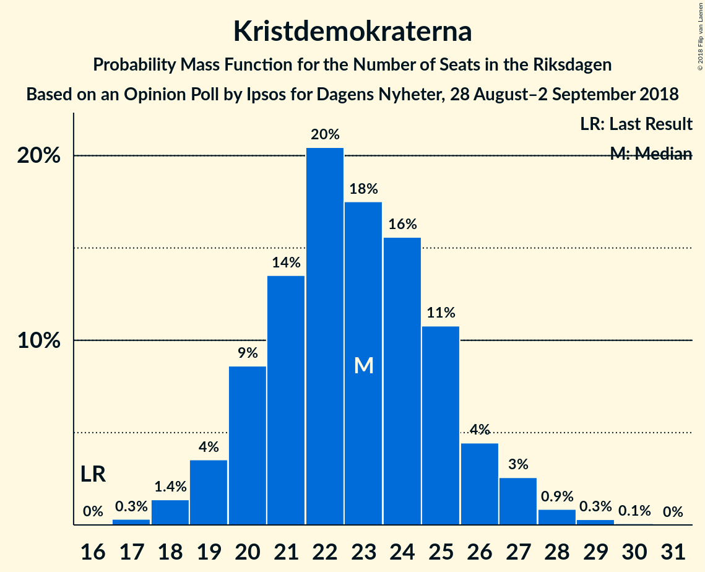
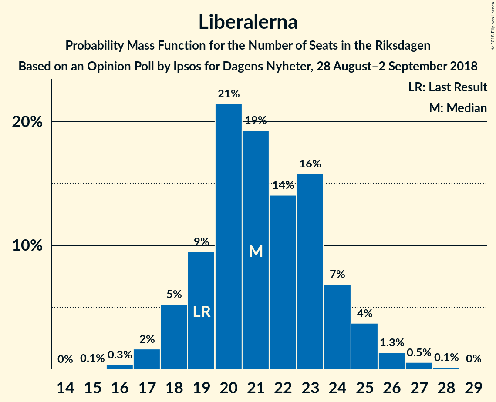

# Opinion Poll by Ipsos for Dagens Nyheter, 28 August–2 September 2018

<a href="#voting-intentions">Voting Intentions</a> | <a href="#seats">Seats</a> | <a href="#coalitions">Coalitions</a> | <a href="#technical-information">Technical Information</a>

## Voting Intentions

### Confidence Intervals

| Party | Last Result | Poll Result | 80% Confidence Interval | 90% Confidence Interval | 95% Confidence Interval | 99% Confidence Interval |
|:-----:|:-----------:|:-----------:|:-----------------------:|:-----------------------:|:-----------------------:|:-----------------------:|
| Sveriges socialdemokratiska arbetareparti | 31.0% | 26.5% | 25.2–27.9% |24.9–28.2% |24.6–28.6% |24.0–29.2% |
| Moderata samlingspartiet | 23.3% | 16.9% | 15.8–18.1% |15.5–18.4% |15.3–18.7% |14.8–19.3% |
| Sverigedemokraterna | 12.9% | 16.3% | 15.2–17.4% |14.9–17.7% |14.7–18.0% |14.2–18.6% |
| Vänsterpartiet | 5.7% | 10.7% | 9.8–11.7% |9.6–12.0% |9.4–12.2% |9.0–12.7% |
| Centerpartiet | 6.1% | 9.6% | 8.8–10.5% |8.6–10.8% |8.4–11.0% |8.0–11.5% |
| Kristdemokraterna | 4.6% | 6.3% | 5.6–7.1% |5.4–7.3% |5.3–7.5% |5.0–7.9% |
| Liberalerna | 5.4% | 5.9% | 5.3–6.7% |5.1–6.9% |4.9–7.1% |4.6–7.5% |
| Miljöpartiet de gröna | 6.9% | 5.0% | 4.4–5.7% |4.3–5.9% |4.1–6.1% |3.8–6.5% |

*Note:* The poll result column reflects the actual value used in the calculations. Published results may vary slightly, and in addition be rounded to fewer digits.

## Seats

### Confidence Intervals

| Party | Last Result | Median | 80% Confidence Interval | 90% Confidence Interval | 95% Confidence Interval | 99% Confidence Interval |
|:-----:|:-----------:|:------:|:-----------------------:|:-----------------------:|:-----------------------:|:-----------------------:|
| <a href="#sveriges-socialdemokratiska-arbetareparti">Sveriges socialdemokratiska arbetareparti</a> | 113 | 95 | 92–99 |90–101 |88–102 |86–104 |
| <a href="#moderata-samlingspartiet">Moderata samlingspartiet</a> | 84 | 62 | 58–64 |57–65 |56–66 |54–68 |
| <a href="#sverigedemokraterna">Sverigedemokraterna</a> | 49 | 58 | 55–61 |53–62 |53–64 |50–66 |
| <a href="#vänsterpartiet">Vänsterpartiet</a> | 21 | 38 | 36–41 |35–43 |34–45 |33–45 |
| <a href="#centerpartiet">Centerpartiet</a> | 22 | 34 | 32–37 |32–37 |30–39 |29–41 |
| <a href="#kristdemokraterna">Kristdemokraterna</a> | 16 | 22 | 20–25 |20–26 |19–27 |18–28 |
| <a href="#liberalerna">Liberalerna</a> | 19 | 21 | 20–23 |18–24 |18–25 |17–26 |
| <a href="#miljöpartiet-de-gröna">Miljöpartiet de gröna</a> | 25 | 18 | 17–19 |15–20 |15–21 |0–22 |

### Sveriges socialdemokratiska arbetareparti

*For a full overview of the results for this party, see the [Sveriges socialdemokratiska arbetareparti](party-sverigessocialdemokratiskaarbetareparti.html) page.*

| Number of Seats | Probability | Accumulated | Special Marks |
|:---------------:|:-----------:|:-----------:|:-------------:|
| 83 | 0% | 100% |  |
| 84 | 0.1% | 99.9% |  |
| 85 | 0.2% | 99.9% |  |
| 86 | 0.3% | 99.7% |  |
| 87 | 0.9% | 99.4% |  |
| 88 | 1.1% | 98.6% |  |
| 89 | 1.0% | 97% |  |
| 90 | 2% | 96% |  |
| 91 | 2% | 94% |  |
| 92 | 12% | 92% |  |
| 93 | 5% | 80% |  |
| 94 | 2% | 75% |  |
| 95 | 31% | 73% | Median |
| 96 | 23% | 42% |  |
| 97 | 5% | 19% |  |
| 98 | 2% | 14% |  |
| 99 | 4% | 12% |  |
| 100 | 2% | 8% |  |
| 101 | 2% | 6% |  |
| 102 | 0.8% | 3% |  |
| 103 | 2% | 2% |  |
| 104 | 0.6% | 0.9% |  |
| 105 | 0.2% | 0.4% |  |
| 106 | 0.1% | 0.1% |  |
| 107 | 0% | 0.1% |  |
| 108 | 0% | 0% |  |
| 109 | 0% | 0% |  |
| 110 | 0% | 0% |  |
| 111 | 0% | 0% |  |
| 112 | 0% | 0% |  |
| 113 | 0% | 0% | Last Result |

### Moderata samlingspartiet

*For a full overview of the results for this party, see the [Moderata samlingspartiet](party-moderatasamlingspartiet.html) page.*

| Number of Seats | Probability | Accumulated | Special Marks |
|:---------------:|:-----------:|:-----------:|:-------------:|
| 51 | 0% | 100% |  |
| 52 | 0.1% | 99.9% |  |
| 53 | 0.3% | 99.8% |  |
| 54 | 0.6% | 99.6% |  |
| 55 | 0.8% | 99.0% |  |
| 56 | 1.5% | 98% |  |
| 57 | 4% | 97% |  |
| 58 | 3% | 93% |  |
| 59 | 15% | 89% |  |
| 60 | 4% | 75% |  |
| 61 | 9% | 71% |  |
| 62 | 23% | 62% | Median |
| 63 | 23% | 39% |  |
| 64 | 10% | 16% |  |
| 65 | 2% | 6% |  |
| 66 | 3% | 5% |  |
| 67 | 0.6% | 1.4% |  |
| 68 | 0.3% | 0.8% |  |
| 69 | 0.3% | 0.5% |  |
| 70 | 0.1% | 0.2% |  |
| 71 | 0% | 0.1% |  |
| 72 | 0% | 0% |  |
| 73 | 0% | 0% |  |
| 74 | 0% | 0% |  |
| 75 | 0% | 0% |  |
| 76 | 0% | 0% |  |
| 77 | 0% | 0% |  |
| 78 | 0% | 0% |  |
| 79 | 0% | 0% |  |
| 80 | 0% | 0% |  |
| 81 | 0% | 0% |  |
| 82 | 0% | 0% |  |
| 83 | 0% | 0% |  |
| 84 | 0% | 0% | Last Result |

### Sverigedemokraterna

*For a full overview of the results for this party, see the [Sverigedemokraterna](party-sverigedemokraterna.html) page.*

| Number of Seats | Probability | Accumulated | Special Marks |
|:---------------:|:-----------:|:-----------:|:-------------:|
| 49 | 0.1% | 100% | Last Result |
| 50 | 0.5% | 99.9% |  |
| 51 | 0.6% | 99.4% |  |
| 52 | 0.8% | 98.8% |  |
| 53 | 4% | 98% |  |
| 54 | 3% | 94% |  |
| 55 | 4% | 91% |  |
| 56 | 5% | 87% |  |
| 57 | 9% | 82% |  |
| 58 | 42% | 73% | Median |
| 59 | 4% | 31% |  |
| 60 | 6% | 27% |  |
| 61 | 13% | 21% |  |
| 62 | 4% | 8% |  |
| 63 | 1.2% | 4% |  |
| 64 | 1.5% | 3% |  |
| 65 | 0.4% | 1.2% |  |
| 66 | 0.5% | 0.8% |  |
| 67 | 0.1% | 0.2% |  |
| 68 | 0.1% | 0.1% |  |
| 69 | 0% | 0.1% |  |
| 70 | 0% | 0% |  |

### Vänsterpartiet

*For a full overview of the results for this party, see the [Vänsterpartiet](party-vänsterpartiet.html) page.*

| Number of Seats | Probability | Accumulated | Special Marks |
|:---------------:|:-----------:|:-----------:|:-------------:|
| 21 | 0% | 100% | Last Result |
| 22 | 0% | 100% |  |
| 23 | 0% | 100% |  |
| 24 | 0% | 100% |  |
| 25 | 0% | 100% |  |
| 26 | 0% | 100% |  |
| 27 | 0% | 100% |  |
| 28 | 0% | 100% |  |
| 29 | 0% | 100% |  |
| 30 | 0% | 100% |  |
| 31 | 0% | 100% |  |
| 32 | 0.4% | 99.9% |  |
| 33 | 2% | 99.5% |  |
| 34 | 2% | 98% |  |
| 35 | 3% | 96% |  |
| 36 | 5% | 93% |  |
| 37 | 14% | 89% |  |
| 38 | 25% | 74% | Median |
| 39 | 1.0% | 50% |  |
| 40 | 35% | 49% |  |
| 41 | 5% | 14% |  |
| 42 | 3% | 8% |  |
| 43 | 1.2% | 5% |  |
| 44 | 1.1% | 4% |  |
| 45 | 3% | 3% |  |
| 46 | 0.1% | 0.2% |  |
| 47 | 0.1% | 0.1% |  |
| 48 | 0% | 0% |  |

### Centerpartiet

*For a full overview of the results for this party, see the [Centerpartiet](party-centerpartiet.html) page.*

| Number of Seats | Probability | Accumulated | Special Marks |
|:---------------:|:-----------:|:-----------:|:-------------:|
| 22 | 0% | 100% | Last Result |
| 23 | 0% | 100% |  |
| 24 | 0% | 100% |  |
| 25 | 0% | 100% |  |
| 26 | 0% | 100% |  |
| 27 | 0% | 100% |  |
| 28 | 0.2% | 100% |  |
| 29 | 0.4% | 99.8% |  |
| 30 | 2% | 99.4% |  |
| 31 | 2% | 97% |  |
| 32 | 23% | 96% |  |
| 33 | 5% | 72% |  |
| 34 | 24% | 67% | Median |
| 35 | 14% | 43% |  |
| 36 | 17% | 29% |  |
| 37 | 7% | 12% |  |
| 38 | 2% | 5% |  |
| 39 | 2% | 3% |  |
| 40 | 0.5% | 1.3% |  |
| 41 | 0.6% | 0.8% |  |
| 42 | 0.1% | 0.2% |  |
| 43 | 0.1% | 0.1% |  |
| 44 | 0% | 0% |  |

### Kristdemokraterna

*For a full overview of the results for this party, see the [Kristdemokraterna](party-kristdemokraterna.html) page.*

| Number of Seats | Probability | Accumulated | Special Marks |
|:---------------:|:-----------:|:-----------:|:-------------:|
| 16 | 0% | 100% | Last Result |
| 17 | 0.3% | 100% |  |
| 18 | 0.9% | 99.6% |  |
| 19 | 4% | 98.7% |  |
| 20 | 13% | 95% |  |
| 21 | 9% | 82% |  |
| 22 | 24% | 73% | Median |
| 23 | 8% | 49% |  |
| 24 | 26% | 41% |  |
| 25 | 10% | 15% |  |
| 26 | 3% | 6% |  |
| 27 | 2% | 3% |  |
| 28 | 0.4% | 0.7% |  |
| 29 | 0.2% | 0.2% |  |
| 30 | 0% | 0.1% |  |
| 31 | 0% | 0% |  |

### Liberalerna

*For a full overview of the results for this party, see the [Liberalerna](party-liberalerna.html) page.*

| Number of Seats | Probability | Accumulated | Special Marks |
|:---------------:|:-----------:|:-----------:|:-------------:|
| 16 | 0.4% | 100% |  |
| 17 | 0.8% | 99.6% |  |
| 18 | 4% | 98.8% |  |
| 19 | 4% | 94% | Last Result |
| 20 | 36% | 90% |  |
| 21 | 28% | 54% | Median |
| 22 | 11% | 25% |  |
| 23 | 7% | 14% |  |
| 24 | 3% | 7% |  |
| 25 | 3% | 4% |  |
| 26 | 1.1% | 1.5% |  |
| 27 | 0.2% | 0.4% |  |
| 28 | 0.1% | 0.2% |  |
| 29 | 0% | 0% |  |

### Miljöpartiet de gröna

*For a full overview of the results for this party, see the [Miljöpartiet de gröna](party-miljöpartietdegröna.html) page.*

| Number of Seats | Probability | Accumulated | Special Marks |
|:---------------:|:-----------:|:-----------:|:-------------:|
| 0 | 1.0% | 100% |  |
| 1 | 0% | 99.0% |  |
| 2 | 0% | 99.0% |  |
| 3 | 0% | 99.0% |  |
| 4 | 0% | 99.0% |  |
| 5 | 0% | 99.0% |  |
| 6 | 0% | 99.0% |  |
| 7 | 0% | 99.0% |  |
| 8 | 0% | 99.0% |  |
| 9 | 0% | 99.0% |  |
| 10 | 0% | 99.0% |  |
| 11 | 0% | 99.0% |  |
| 12 | 0% | 99.0% |  |
| 13 | 0% | 99.0% |  |
| 14 | 0% | 99.0% |  |
| 15 | 5% | 99.0% |  |
| 16 | 3% | 94% |  |
| 17 | 37% | 91% |  |
| 18 | 40% | 54% | Median |
| 19 | 5% | 14% |  |
| 20 | 5% | 9% |  |
| 21 | 3% | 5% |  |
| 22 | 0.8% | 1.3% |  |
| 23 | 0.3% | 0.5% |  |
| 24 | 0.1% | 0.2% |  |
| 25 | 0.1% | 0.1% | Last Result |
| 26 | 0% | 0% |  |

## Coalitions

### Confidence Intervals

| Coalition | Last Result | Median | Majority? | 80% Confidence Interval | 90% Confidence Interval | 95% Confidence Interval | 99% Confidence Interval |
|:---------:|:-----------:|:------:|:---------:|:-----------------------:|:-----------------------:|:-----------------------:|:-----------------------:|
| Sveriges socialdemokratiska arbetareparti – Moderata samlingspartiet – Centerpartiet | 219 | 191 | 100% | 188–194 | 186–195 | 185–196 | 179–199 |
| Sveriges socialdemokratiska arbetareparti – Moderata samlingspartiet | 197 | 157 | 0% | 153–160 | 150–162 | 149–163 | 146–166 |
| Sveriges socialdemokratiska arbetareparti – Vänsterpartiet – Miljöpartiet de gröna | 159 | 152 | 0% | 146–155 | 145–158 | 143–160 | 141–161 |
| Moderata samlingspartiet – Sverigedemokraterna – Kristdemokraterna | 149 | 142 | 0% | 137–146 | 135–147 | 134–151 | 132–152 |
| Moderata samlingspartiet – Centerpartiet – Kristdemokraterna – Liberalerna | 141 | 139 | 0% | 135–146 | 133–146 | 133–147 | 129–149 |
| Sveriges socialdemokratiska arbetareparti – Vänsterpartiet | 134 | 135 | 0% | 129–138 | 128–140 | 127–143 | 124–144 |
| Moderata samlingspartiet – Sverigedemokraterna | 133 | 120 | 0% | 114–122 | 114–125 | 113–126 | 109–128 |
| Moderata samlingspartiet – Centerpartiet – Kristdemokraterna | 122 | 118 | 0% | 115–124 | 113–124 | 112–124 | 109–127 |
| Moderata samlingspartiet – Centerpartiet – Liberalerna | 125 | 117 | 0% | 114–121 | 111–122 | 110–123 | 108–125 |
| Sveriges socialdemokratiska arbetareparti – Miljöpartiet de gröna | 138 | 113 | 0% | 109–117 | 107–119 | 105–120 | 99–122 |
| Moderata samlingspartiet – Centerpartiet | 106 | 96 | 0% | 93–99 | 91–100 | 90–102 | 86–103 |

### Sveriges socialdemokratiska arbetareparti – Moderata samlingspartiet – Centerpartiet

| Number of Seats | Probability | Accumulated | Special Marks |
|:---------------:|:-----------:|:-----------:|:-------------:|
| 177 | 0.1% | 100% |  |
| 178 | 0.2% | 99.9% |  |
| 179 | 0.2% | 99.7% |  |
| 180 | 0.2% | 99.5% |  |
| 181 | 0.2% | 99.3% |  |
| 182 | 0.2% | 99.1% |  |
| 183 | 0.5% | 98.9% |  |
| 184 | 0.5% | 98% |  |
| 185 | 2% | 98% |  |
| 186 | 1.0% | 96% |  |
| 187 | 3% | 95% |  |
| 188 | 3% | 92% |  |
| 189 | 3% | 89% |  |
| 190 | 16% | 86% |  |
| 191 | 49% | 70% | Median |
| 192 | 3% | 21% |  |
| 193 | 5% | 18% |  |
| 194 | 3% | 13% |  |
| 195 | 5% | 10% |  |
| 196 | 2% | 5% |  |
| 197 | 0.6% | 2% |  |
| 198 | 1.1% | 2% |  |
| 199 | 0.2% | 0.5% |  |
| 200 | 0.1% | 0.4% |  |
| 201 | 0.1% | 0.2% |  |
| 202 | 0% | 0.1% |  |
| 203 | 0% | 0.1% |  |
| 204 | 0% | 0.1% |  |
| 205 | 0% | 0.1% |  |
| 206 | 0% | 0.1% |  |
| 207 | 0% | 0.1% |  |
| 208 | 0% | 0% |  |
| 209 | 0% | 0% |  |
| 210 | 0% | 0% |  |
| 211 | 0% | 0% |  |
| 212 | 0% | 0% |  |
| 213 | 0% | 0% |  |
| 214 | 0% | 0% |  |
| 215 | 0% | 0% |  |
| 216 | 0% | 0% |  |
| 217 | 0% | 0% |  |
| 218 | 0% | 0% |  |
| 219 | 0% | 0% | Last Result |

### Sveriges socialdemokratiska arbetareparti – Moderata samlingspartiet

| Number of Seats | Probability | Accumulated | Special Marks |
|:---------------:|:-----------:|:-----------:|:-------------:|
| 143 | 0% | 100% |  |
| 144 | 0.1% | 99.9% |  |
| 145 | 0.2% | 99.9% |  |
| 146 | 0.3% | 99.6% |  |
| 147 | 0.4% | 99.4% |  |
| 148 | 0.7% | 98.9% |  |
| 149 | 1.0% | 98% |  |
| 150 | 2% | 97% |  |
| 151 | 0.7% | 95% |  |
| 152 | 2% | 94% |  |
| 153 | 4% | 92% |  |
| 154 | 15% | 88% |  |
| 155 | 4% | 73% |  |
| 156 | 9% | 69% |  |
| 157 | 21% | 59% | Median |
| 158 | 4% | 39% |  |
| 159 | 24% | 35% |  |
| 160 | 3% | 11% |  |
| 161 | 2% | 8% |  |
| 162 | 3% | 6% |  |
| 163 | 2% | 3% |  |
| 164 | 0.3% | 1.3% |  |
| 165 | 0.4% | 1.0% |  |
| 166 | 0.3% | 0.6% |  |
| 167 | 0.1% | 0.2% |  |
| 168 | 0% | 0.1% |  |
| 169 | 0% | 0.1% |  |
| 170 | 0% | 0.1% |  |
| 171 | 0% | 0% |  |
| 172 | 0% | 0% |  |
| 173 | 0% | 0% |  |
| 174 | 0% | 0% |  |
| 175 | 0% | 0% | Majority |
| 176 | 0% | 0% |  |
| 177 | 0% | 0% |  |
| 178 | 0% | 0% |  |
| 179 | 0% | 0% |  |
| 180 | 0% | 0% |  |
| 181 | 0% | 0% |  |
| 182 | 0% | 0% |  |
| 183 | 0% | 0% |  |
| 184 | 0% | 0% |  |
| 185 | 0% | 0% |  |
| 186 | 0% | 0% |  |
| 187 | 0% | 0% |  |
| 188 | 0% | 0% |  |
| 189 | 0% | 0% |  |
| 190 | 0% | 0% |  |
| 191 | 0% | 0% |  |
| 192 | 0% | 0% |  |
| 193 | 0% | 0% |  |
| 194 | 0% | 0% |  |
| 195 | 0% | 0% |  |
| 196 | 0% | 0% |  |
| 197 | 0% | 0% | Last Result |

### Sveriges socialdemokratiska arbetareparti – Vänsterpartiet – Miljöpartiet de gröna

| Number of Seats | Probability | Accumulated | Special Marks |
|:---------------:|:-----------:|:-----------:|:-------------:|
| 136 | 0% | 100% |  |
| 137 | 0% | 99.9% |  |
| 138 | 0% | 99.9% |  |
| 139 | 0.2% | 99.9% |  |
| 140 | 0.2% | 99.7% |  |
| 141 | 2% | 99.6% |  |
| 142 | 0.4% | 98% |  |
| 143 | 0.3% | 98% |  |
| 144 | 1.4% | 97% |  |
| 145 | 1.2% | 96% |  |
| 146 | 8% | 95% |  |
| 147 | 6% | 86% |  |
| 148 | 1.5% | 81% |  |
| 149 | 2% | 79% |  |
| 150 | 3% | 78% |  |
| 151 | 2% | 74% | Median |
| 152 | 41% | 72% |  |
| 153 | 13% | 31% |  |
| 154 | 5% | 18% |  |
| 155 | 3% | 13% |  |
| 156 | 0.5% | 9% |  |
| 157 | 1.0% | 9% |  |
| 158 | 4% | 8% |  |
| 159 | 1.5% | 4% | Last Result |
| 160 | 1.4% | 3% |  |
| 161 | 1.1% | 2% |  |
| 162 | 0.1% | 0.4% |  |
| 163 | 0% | 0.3% |  |
| 164 | 0.2% | 0.3% |  |
| 165 | 0.1% | 0.1% |  |
| 166 | 0% | 0% |  |

### Moderata samlingspartiet – Sverigedemokraterna – Kristdemokraterna

| Number of Seats | Probability | Accumulated | Special Marks |
|:---------------:|:-----------:|:-----------:|:-------------:|
| 129 | 0.1% | 100% |  |
| 130 | 0.3% | 99.9% |  |
| 131 | 0.1% | 99.6% |  |
| 132 | 0.2% | 99.5% |  |
| 133 | 1.3% | 99.3% |  |
| 134 | 2% | 98% |  |
| 135 | 3% | 96% |  |
| 136 | 1.1% | 93% |  |
| 137 | 4% | 92% |  |
| 138 | 2% | 88% |  |
| 139 | 4% | 86% |  |
| 140 | 14% | 83% |  |
| 141 | 2% | 69% |  |
| 142 | 21% | 67% | Median |
| 143 | 4% | 46% |  |
| 144 | 5% | 42% |  |
| 145 | 22% | 37% |  |
| 146 | 9% | 16% |  |
| 147 | 2% | 7% |  |
| 148 | 0.9% | 5% |  |
| 149 | 0.5% | 4% | Last Result |
| 150 | 0.9% | 3% |  |
| 151 | 2% | 3% |  |
| 152 | 0.4% | 0.8% |  |
| 153 | 0.2% | 0.4% |  |
| 154 | 0.1% | 0.2% |  |
| 155 | 0% | 0.1% |  |
| 156 | 0% | 0.1% |  |
| 157 | 0% | 0% |  |

### Moderata samlingspartiet – Centerpartiet – Kristdemokraterna – Liberalerna

| Number of Seats | Probability | Accumulated | Special Marks |
|:---------------:|:-----------:|:-----------:|:-------------:|
| 127 | 0% | 100% |  |
| 128 | 0.1% | 99.9% |  |
| 129 | 0.5% | 99.9% |  |
| 130 | 0.5% | 99.4% |  |
| 131 | 0.4% | 98.8% |  |
| 132 | 0.5% | 98% |  |
| 133 | 3% | 98% |  |
| 134 | 0.9% | 95% |  |
| 135 | 13% | 94% |  |
| 136 | 1.1% | 81% |  |
| 137 | 3% | 80% |  |
| 138 | 5% | 77% |  |
| 139 | 43% | 72% | Median |
| 140 | 5% | 29% |  |
| 141 | 2% | 24% | Last Result |
| 142 | 4% | 22% |  |
| 143 | 3% | 18% |  |
| 144 | 3% | 15% |  |
| 145 | 1.3% | 12% |  |
| 146 | 8% | 11% |  |
| 147 | 2% | 3% |  |
| 148 | 0.3% | 1.4% |  |
| 149 | 0.8% | 1.1% |  |
| 150 | 0.1% | 0.3% |  |
| 151 | 0.1% | 0.2% |  |
| 152 | 0% | 0.1% |  |
| 153 | 0.1% | 0.1% |  |
| 154 | 0% | 0% |  |

### Sveriges socialdemokratiska arbetareparti – Vänsterpartiet

| Number of Seats | Probability | Accumulated | Special Marks |
|:---------------:|:-----------:|:-----------:|:-------------:|
| 121 | 0.1% | 100% |  |
| 122 | 0.1% | 99.9% |  |
| 123 | 0.2% | 99.8% |  |
| 124 | 0.2% | 99.6% |  |
| 125 | 0.6% | 99.4% |  |
| 126 | 1.1% | 98.8% |  |
| 127 | 1.2% | 98% |  |
| 128 | 2% | 97% |  |
| 129 | 12% | 94% |  |
| 130 | 3% | 82% |  |
| 131 | 2% | 79% |  |
| 132 | 2% | 77% |  |
| 133 | 1.4% | 75% | Median |
| 134 | 24% | 74% | Last Result |
| 135 | 32% | 50% |  |
| 136 | 2% | 18% |  |
| 137 | 5% | 16% |  |
| 138 | 4% | 12% |  |
| 139 | 2% | 8% |  |
| 140 | 2% | 6% |  |
| 141 | 0.9% | 4% |  |
| 142 | 0.7% | 4% |  |
| 143 | 1.3% | 3% |  |
| 144 | 1.1% | 1.4% |  |
| 145 | 0.2% | 0.3% |  |
| 146 | 0% | 0.2% |  |
| 147 | 0.1% | 0.1% |  |
| 148 | 0% | 0% |  |

### Moderata samlingspartiet – Sverigedemokraterna

| Number of Seats | Probability | Accumulated | Special Marks |
|:---------------:|:-----------:|:-----------:|:-------------:|
| 108 | 0.3% | 100% |  |
| 109 | 0.7% | 99.7% |  |
| 110 | 0.3% | 99.0% |  |
| 111 | 0.2% | 98.8% |  |
| 112 | 1.0% | 98.5% |  |
| 113 | 0.5% | 98% |  |
| 114 | 9% | 97% |  |
| 115 | 4% | 89% |  |
| 116 | 2% | 84% |  |
| 117 | 0.2% | 82% |  |
| 118 | 2% | 82% |  |
| 119 | 2% | 80% |  |
| 120 | 34% | 78% | Median |
| 121 | 33% | 44% |  |
| 122 | 2% | 11% |  |
| 123 | 0.4% | 9% |  |
| 124 | 2% | 8% |  |
| 125 | 3% | 7% |  |
| 126 | 3% | 4% |  |
| 127 | 0.7% | 1.4% |  |
| 128 | 0.3% | 0.7% |  |
| 129 | 0% | 0.4% |  |
| 130 | 0.2% | 0.4% |  |
| 131 | 0.1% | 0.2% |  |
| 132 | 0% | 0.1% |  |
| 133 | 0% | 0% | Last Result |

### Moderata samlingspartiet – Centerpartiet – Kristdemokraterna

| Number of Seats | Probability | Accumulated | Special Marks |
|:---------------:|:-----------:|:-----------:|:-------------:|
| 106 | 0.1% | 100% |  |
| 107 | 0.2% | 99.8% |  |
| 108 | 0% | 99.7% |  |
| 109 | 0.3% | 99.6% |  |
| 110 | 0.4% | 99.3% |  |
| 111 | 1.0% | 98.9% |  |
| 112 | 2% | 98% |  |
| 113 | 1.3% | 95% |  |
| 114 | 2% | 94% |  |
| 115 | 14% | 92% |  |
| 116 | 4% | 78% |  |
| 117 | 4% | 74% |  |
| 118 | 21% | 71% | Median |
| 119 | 24% | 50% |  |
| 120 | 5% | 25% |  |
| 121 | 6% | 20% |  |
| 122 | 0.4% | 15% | Last Result |
| 123 | 4% | 14% |  |
| 124 | 8% | 10% |  |
| 125 | 0.5% | 2% |  |
| 126 | 0.6% | 2% |  |
| 127 | 0.7% | 1.0% |  |
| 128 | 0.2% | 0.4% |  |
| 129 | 0% | 0.2% |  |
| 130 | 0.1% | 0.1% |  |
| 131 | 0% | 0.1% |  |
| 132 | 0% | 0% |  |

### Moderata samlingspartiet – Centerpartiet – Liberalerna

| Number of Seats | Probability | Accumulated | Special Marks |
|:---------------:|:-----------:|:-----------:|:-------------:|
| 103 | 0% | 100% |  |
| 104 | 0% | 99.9% |  |
| 105 | 0% | 99.9% |  |
| 106 | 0.2% | 99.9% |  |
| 107 | 0.1% | 99.8% |  |
| 108 | 0.5% | 99.6% |  |
| 109 | 1.0% | 99.1% |  |
| 110 | 2% | 98% |  |
| 111 | 2% | 96% |  |
| 112 | 0.8% | 95% |  |
| 113 | 1.3% | 94% |  |
| 114 | 5% | 93% |  |
| 115 | 33% | 88% |  |
| 116 | 4% | 54% |  |
| 117 | 23% | 50% | Median |
| 118 | 3% | 27% |  |
| 119 | 5% | 24% |  |
| 120 | 2% | 19% |  |
| 121 | 8% | 16% |  |
| 122 | 4% | 8% |  |
| 123 | 2% | 4% |  |
| 124 | 0.8% | 2% |  |
| 125 | 0.4% | 0.8% | Last Result |
| 126 | 0.1% | 0.5% |  |
| 127 | 0.2% | 0.3% |  |
| 128 | 0% | 0.2% |  |
| 129 | 0.1% | 0.1% |  |
| 130 | 0% | 0% |  |

### Sveriges socialdemokratiska arbetareparti – Miljöpartiet de gröna

| Number of Seats | Probability | Accumulated | Special Marks |
|:---------------:|:-----------:|:-----------:|:-------------:|
| 97 | 0% | 100% |  |
| 98 | 0% | 99.9% |  |
| 99 | 0.6% | 99.9% |  |
| 100 | 0.1% | 99.4% |  |
| 101 | 0.2% | 99.3% |  |
| 102 | 0.3% | 99.1% |  |
| 103 | 0.2% | 98.8% |  |
| 104 | 0.3% | 98.6% |  |
| 105 | 0.8% | 98% |  |
| 106 | 2% | 97% |  |
| 107 | 2% | 95% |  |
| 108 | 2% | 94% |  |
| 109 | 9% | 91% |  |
| 110 | 5% | 83% |  |
| 111 | 2% | 78% |  |
| 112 | 21% | 76% |  |
| 113 | 13% | 55% | Median |
| 114 | 25% | 42% |  |
| 115 | 3% | 17% |  |
| 116 | 3% | 14% |  |
| 117 | 5% | 11% |  |
| 118 | 0.6% | 6% |  |
| 119 | 2% | 6% |  |
| 120 | 2% | 4% |  |
| 121 | 1.4% | 2% |  |
| 122 | 0.4% | 0.8% |  |
| 123 | 0.2% | 0.4% |  |
| 124 | 0.1% | 0.2% |  |
| 125 | 0% | 0.1% |  |
| 126 | 0% | 0% |  |
| 127 | 0% | 0% |  |
| 128 | 0% | 0% |  |
| 129 | 0% | 0% |  |
| 130 | 0% | 0% |  |
| 131 | 0% | 0% |  |
| 132 | 0% | 0% |  |
| 133 | 0% | 0% |  |
| 134 | 0% | 0% |  |
| 135 | 0% | 0% |  |
| 136 | 0% | 0% |  |
| 137 | 0% | 0% |  |
| 138 | 0% | 0% | Last Result |

### Moderata samlingspartiet – Centerpartiet

| Number of Seats | Probability | Accumulated | Special Marks |
|:---------------:|:-----------:|:-----------:|:-------------:|
| 83 | 0% | 100% |  |
| 84 | 0% | 99.9% |  |
| 85 | 0.2% | 99.9% |  |
| 86 | 0.2% | 99.7% |  |
| 87 | 0.1% | 99.5% |  |
| 88 | 0.2% | 99.3% |  |
| 89 | 0.9% | 99.1% |  |
| 90 | 2% | 98% |  |
| 91 | 1.4% | 96% |  |
| 92 | 4% | 95% |  |
| 93 | 2% | 91% |  |
| 94 | 4% | 90% |  |
| 95 | 35% | 86% |  |
| 96 | 25% | 51% | Median |
| 97 | 6% | 26% |  |
| 98 | 7% | 20% |  |
| 99 | 7% | 14% |  |
| 100 | 2% | 6% |  |
| 101 | 0.9% | 4% |  |
| 102 | 2% | 3% |  |
| 103 | 0.4% | 0.7% |  |
| 104 | 0.1% | 0.2% |  |
| 105 | 0.1% | 0.2% |  |
| 106 | 0% | 0.1% | Last Result |
| 107 | 0% | 0.1% |  |
| 108 | 0% | 0% |  |

## Technical Information

### Opinion Poll

+ **Polling firm:** Ipsos
+ **Commissioner(s):** Dagens Nyheter
+ **Fieldwork period:** 28 August–2 September 2018

### Calculations

+ **Sample size:** 1874
+ **Simulations done:** 131,072
+ **Error estimate:** 0.58%

