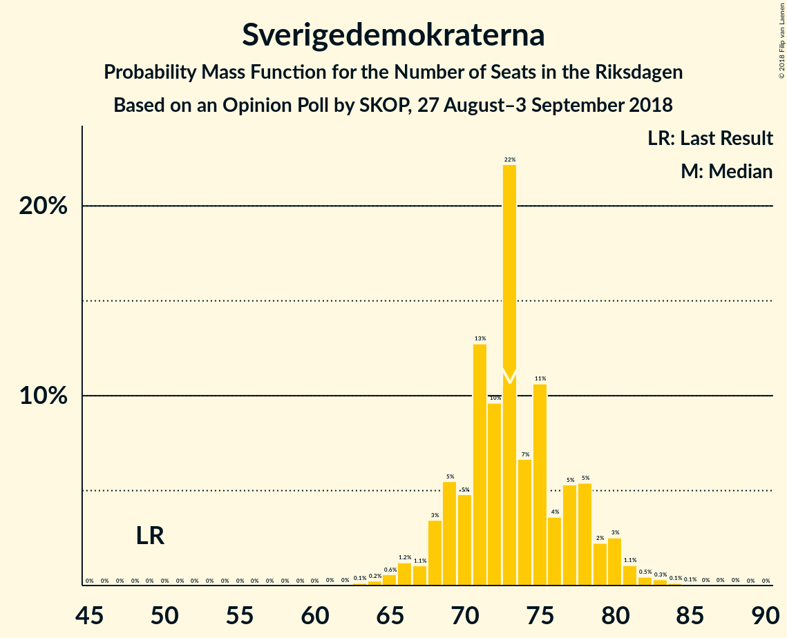
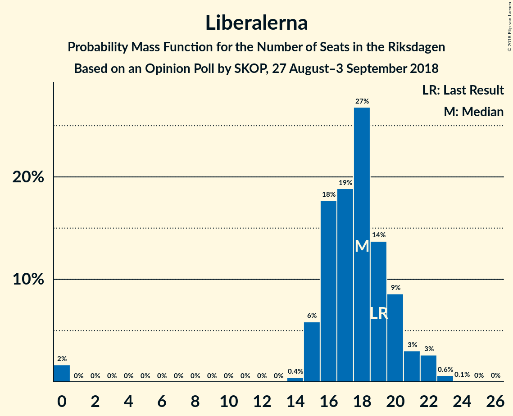
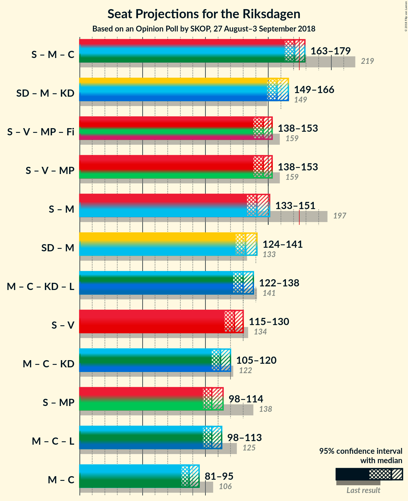

# Opinion Poll by SKOP, 27 August–3 September 2018

<a href="#voting-intentions">Voting Intentions</a> | <a href="#seats">Seats</a> | <a href="#coalitions">Coalitions</a> | <a href="#technical-information">Technical Information</a>

## Voting Intentions

### Confidence Intervals

| Party | Last Result | Poll Result | 80% Confidence Interval | 90% Confidence Interval | 95% Confidence Interval | 99% Confidence Interval |
|:-----:|:-----------:|:-----------:|:-----------------------:|:-----------------------:|:-----------------------:|:-----------------------:|
| Sveriges socialdemokratiska arbetareparti | 31.0% | 22.9% | 21.7–24.3% |21.3–24.6% |21.0–25.0% |20.4–25.6% |
| Sverigedemokraterna | 12.9% | 20.3% | 19.1–21.6% |18.8–21.9% |18.5–22.3% |17.9–22.9% |
| Moderata samlingspartiet | 23.3% | 16.3% | 15.2–17.5% |14.9–17.8% |14.6–18.1% |14.1–18.7% |
| Vänsterpartiet | 5.7% | 11.0% | 10.1–12.0% |9.8–12.3% |9.6–12.6% |9.2–13.1% |
| Centerpartiet | 6.1% | 8.0% | 7.2–8.9% |7.0–9.1% |6.8–9.4% |6.4–9.8% |
| Kristdemokraterna | 4.6% | 6.8% | 6.1–7.6% |5.9–7.9% |5.7–8.1% |5.4–8.5% |
| Miljöpartiet de gröna | 6.9% | 6.2% | 5.5–7.0% |5.3–7.3% |5.2–7.5% |4.9–7.9% |
| Liberalerna | 5.4% | 4.9% | 4.3–5.6% |4.1–5.8% |4.0–6.0% |3.7–6.4% |
| Feministiskt initiativ | 3.1% | 1.1% | 0.8–1.5% |0.7–1.6% |0.7–1.7% |0.6–1.9% |

*Note:* The poll result column reflects the actual value used in the calculations. Published results may vary slightly, and in addition be rounded to fewer digits.

## Seats

### Confidence Intervals

| Party | Last Result | Median | 80% Confidence Interval | 90% Confidence Interval | 95% Confidence Interval | 99% Confidence Interval |
|:-----:|:-----------:|:------:|:-----------------------:|:-----------------------:|:-----------------------:|:-----------------------:|
| <a href="#sveriges-socialdemokratiska-arbetareparti">Sveriges socialdemokratiska arbetareparti</a> | 113 | 76 | 76–82 |76–82 |76–87 |74–93 |
| <a href="#sverigedemokraterna">Sverigedemokraterna</a> | 49 | 74 | 66–74 |66–78 |66–79 |66–79 |
| <a href="#moderata-samlingspartiet">Moderata samlingspartiet</a> | 84 | 62 | 60–67 |55–67 |51–67 |51–67 |
| <a href="#vänsterpartiet">Vänsterpartiet</a> | 21 | 41 | 41–43 |37–43 |34–44 |34–45 |
| <a href="#centerpartiet">Centerpartiet</a> | 22 | 28 | 26–34 |26–35 |26–36 |26–37 |
| <a href="#kristdemokraterna">Kristdemokraterna</a> | 16 | 22 | 22–25 |22–26 |22–27 |22–30 |
| <a href="#miljöpartiet-de-gröna">Miljöpartiet de gröna</a> | 25 | 23 | 23–25 |23–25 |17–25 |16–27 |
| <a href="#liberalerna">Liberalerna</a> | 19 | 23 | 17–23 |16–23 |0–23 |0–23 |
| <a href="#feministiskt-initiativ">Feministiskt initiativ</a> | 0 | 0 | 0 |0 |0 |0 |

### Sveriges socialdemokratiska arbetareparti

*For a full overview of the results for this party, see the [Sveriges socialdemokratiska arbetareparti](party-sverigessocialdemokratiskaarbetareparti.html) page.*

| Number of Seats | Probability | Accumulated | Special Marks |
|:---------------:|:-----------:|:-----------:|:-------------:|
| 73 | 0.4% | 100% |  |
| 74 | 0.1% | 99.6% |  |
| 75 | 0% | 99.5% |  |
| 76 | 69% | 99.5% | Median |
| 77 | 20% | 31% |  |
| 78 | 0% | 10% |  |
| 79 | 0% | 10% |  |
| 80 | 0.3% | 10% |  |
| 81 | 0% | 10% |  |
| 82 | 6% | 10% |  |
| 83 | 0.2% | 4% |  |
| 84 | 0% | 4% |  |
| 85 | 0% | 4% |  |
| 86 | 0% | 4% |  |
| 87 | 2% | 4% |  |
| 88 | 0.1% | 2% |  |
| 89 | 0.1% | 2% |  |
| 90 | 0% | 1.4% |  |
| 91 | 0% | 1.4% |  |
| 92 | 0% | 1.4% |  |
| 93 | 1.4% | 1.4% |  |
| 94 | 0% | 0% |  |
| 95 | 0% | 0% |  |
| 96 | 0% | 0% |  |
| 97 | 0% | 0% |  |
| 98 | 0% | 0% |  |
| 99 | 0% | 0% |  |
| 100 | 0% | 0% |  |
| 101 | 0% | 0% |  |
| 102 | 0% | 0% |  |
| 103 | 0% | 0% |  |
| 104 | 0% | 0% |  |
| 105 | 0% | 0% |  |
| 106 | 0% | 0% |  |
| 107 | 0% | 0% |  |
| 108 | 0% | 0% |  |
| 109 | 0% | 0% |  |
| 110 | 0% | 0% |  |
| 111 | 0% | 0% |  |
| 112 | 0% | 0% |  |
| 113 | 0% | 0% | Last Result |

### Sverigedemokraterna

*For a full overview of the results for this party, see the [Sverigedemokraterna](party-sverigedemokraterna.html) page.*

| Number of Seats | Probability | Accumulated | Special Marks |
|:---------------:|:-----------:|:-----------:|:-------------:|
| 49 | 0% | 100% | Last Result |
| 50 | 0% | 100% |  |
| 51 | 0% | 100% |  |
| 52 | 0% | 100% |  |
| 53 | 0% | 100% |  |
| 54 | 0% | 100% |  |
| 55 | 0% | 100% |  |
| 56 | 0% | 100% |  |
| 57 | 0% | 100% |  |
| 58 | 0% | 100% |  |
| 59 | 0% | 100% |  |
| 60 | 0% | 100% |  |
| 61 | 0% | 100% |  |
| 62 | 0% | 100% |  |
| 63 | 0.1% | 100% |  |
| 64 | 0% | 99.9% |  |
| 65 | 0% | 99.9% |  |
| 66 | 20% | 99.9% |  |
| 67 | 0.2% | 80% |  |
| 68 | 0% | 79% |  |
| 69 | 0% | 79% |  |
| 70 | 0% | 79% |  |
| 71 | 2% | 79% |  |
| 72 | 0.9% | 77% |  |
| 73 | 0.2% | 76% |  |
| 74 | 70% | 76% | Median |
| 75 | 0% | 6% |  |
| 76 | 0% | 6% |  |
| 77 | 0% | 6% |  |
| 78 | 1.4% | 6% |  |
| 79 | 4% | 4% |  |
| 80 | 0% | 0.4% |  |
| 81 | 0% | 0.4% |  |
| 82 | 0.3% | 0.4% |  |
| 83 | 0% | 0.1% |  |
| 84 | 0% | 0.1% |  |
| 85 | 0.1% | 0.1% |  |
| 86 | 0% | 0% |  |

### Moderata samlingspartiet

*For a full overview of the results for this party, see the [Moderata samlingspartiet](party-moderatasamlingspartiet.html) page.*

| Number of Seats | Probability | Accumulated | Special Marks |
|:---------------:|:-----------:|:-----------:|:-------------:|
| 51 | 4% | 100% |  |
| 52 | 0% | 96% |  |
| 53 | 0% | 96% |  |
| 54 | 0% | 96% |  |
| 55 | 1.2% | 96% |  |
| 56 | 0.1% | 95% |  |
| 57 | 2% | 95% |  |
| 58 | 1.2% | 93% |  |
| 59 | 0.2% | 91% |  |
| 60 | 1.4% | 91% |  |
| 61 | 0% | 90% |  |
| 62 | 69% | 90% | Median |
| 63 | 0.2% | 21% |  |
| 64 | 0.1% | 21% |  |
| 65 | 0.2% | 21% |  |
| 66 | 0% | 20% |  |
| 67 | 20% | 20% |  |
| 68 | 0% | 0% |  |
| 69 | 0% | 0% |  |
| 70 | 0% | 0% |  |
| 71 | 0% | 0% |  |
| 72 | 0% | 0% |  |
| 73 | 0% | 0% |  |
| 74 | 0% | 0% |  |
| 75 | 0% | 0% |  |
| 76 | 0% | 0% |  |
| 77 | 0% | 0% |  |
| 78 | 0% | 0% |  |
| 79 | 0% | 0% |  |
| 80 | 0% | 0% |  |
| 81 | 0% | 0% |  |
| 82 | 0% | 0% |  |
| 83 | 0% | 0% |  |
| 84 | 0% | 0% | Last Result |

### Vänsterpartiet

*For a full overview of the results for this party, see the [Vänsterpartiet](party-vänsterpartiet.html) page.*

| Number of Seats | Probability | Accumulated | Special Marks |
|:---------------:|:-----------:|:-----------:|:-------------:|
| 21 | 0% | 100% | Last Result |
| 22 | 0% | 100% |  |
| 23 | 0% | 100% |  |
| 24 | 0% | 100% |  |
| 25 | 0% | 100% |  |
| 26 | 0% | 100% |  |
| 27 | 0% | 100% |  |
| 28 | 0% | 100% |  |
| 29 | 0% | 100% |  |
| 30 | 0% | 100% |  |
| 31 | 0% | 100% |  |
| 32 | 0.1% | 100% |  |
| 33 | 0% | 99.9% |  |
| 34 | 4% | 99.9% |  |
| 35 | 0% | 96% |  |
| 36 | 0% | 96% |  |
| 37 | 1.4% | 96% |  |
| 38 | 0% | 95% |  |
| 39 | 3% | 95% |  |
| 40 | 0.2% | 92% |  |
| 41 | 69% | 92% | Median |
| 42 | 0% | 23% |  |
| 43 | 20% | 23% |  |
| 44 | 0.2% | 3% |  |
| 45 | 2% | 2% |  |
| 46 | 0.1% | 0.1% |  |
| 47 | 0% | 0% |  |

### Centerpartiet

*For a full overview of the results for this party, see the [Centerpartiet](party-centerpartiet.html) page.*

| Number of Seats | Probability | Accumulated | Special Marks |
|:---------------:|:-----------:|:-----------:|:-------------:|
| 22 | 0% | 100% | Last Result |
| 23 | 0% | 100% |  |
| 24 | 0.2% | 100% |  |
| 25 | 0% | 99.8% |  |
| 26 | 20% | 99.8% |  |
| 27 | 0.2% | 79% |  |
| 28 | 69% | 79% | Median |
| 29 | 0% | 10% |  |
| 30 | 0.1% | 10% |  |
| 31 | 0.2% | 10% |  |
| 32 | 0% | 10% |  |
| 33 | 0.1% | 10% |  |
| 34 | 1.2% | 10% |  |
| 35 | 6% | 9% |  |
| 36 | 2% | 3% |  |
| 37 | 0.9% | 0.9% |  |
| 38 | 0% | 0% |  |

### Kristdemokraterna

*For a full overview of the results for this party, see the [Kristdemokraterna](party-kristdemokraterna.html) page.*

| Number of Seats | Probability | Accumulated | Special Marks |
|:---------------:|:-----------:|:-----------:|:-------------:|
| 16 | 0% | 100% | Last Result |
| 17 | 0% | 100% |  |
| 18 | 0.2% | 100% |  |
| 19 | 0% | 99.8% |  |
| 20 | 0% | 99.8% |  |
| 21 | 0% | 99.8% |  |
| 22 | 69% | 99.8% | Median |
| 23 | 0.3% | 31% |  |
| 24 | 0% | 31% |  |
| 25 | 23% | 31% |  |
| 26 | 4% | 8% |  |
| 27 | 2% | 4% |  |
| 28 | 0% | 2% |  |
| 29 | 0% | 2% |  |
| 30 | 1.2% | 2% |  |
| 31 | 0% | 0.3% |  |
| 32 | 0% | 0.3% |  |
| 33 | 0% | 0.3% |  |
| 34 | 0% | 0.3% |  |
| 35 | 0.3% | 0.3% |  |
| 36 | 0% | 0% |  |

### Miljöpartiet de gröna

*For a full overview of the results for this party, see the [Miljöpartiet de gröna](party-miljöpartietdegröna.html) page.*

| Number of Seats | Probability | Accumulated | Special Marks |
|:---------------:|:-----------:|:-----------:|:-------------:|
| 16 | 0.9% | 100% |  |
| 17 | 2% | 99.1% |  |
| 18 | 0% | 97% |  |
| 19 | 1.4% | 97% |  |
| 20 | 0% | 95% |  |
| 21 | 0.2% | 95% |  |
| 22 | 0% | 95% |  |
| 23 | 69% | 95% | Median |
| 24 | 0% | 26% |  |
| 25 | 24% | 26% | Last Result |
| 26 | 0% | 2% |  |
| 27 | 1.5% | 2% |  |
| 28 | 0% | 0.2% |  |
| 29 | 0% | 0.2% |  |
| 30 | 0% | 0.2% |  |
| 31 | 0% | 0.2% |  |
| 32 | 0.2% | 0.2% |  |
| 33 | 0% | 0% |  |

### Liberalerna

*For a full overview of the results for this party, see the [Liberalerna](party-liberalerna.html) page.*

| Number of Seats | Probability | Accumulated | Special Marks |
|:---------------:|:-----------:|:-----------:|:-------------:|
| 0 | 3% | 100% |  |
| 1 | 0% | 97% |  |
| 2 | 0% | 97% |  |
| 3 | 0% | 97% |  |
| 4 | 0% | 97% |  |
| 5 | 0% | 97% |  |
| 6 | 0% | 97% |  |
| 7 | 0% | 97% |  |
| 8 | 0% | 97% |  |
| 9 | 0% | 97% |  |
| 10 | 0% | 97% |  |
| 11 | 0% | 97% |  |
| 12 | 0% | 97% |  |
| 13 | 0% | 97% |  |
| 14 | 0% | 97% |  |
| 15 | 0% | 97% |  |
| 16 | 3% | 97% |  |
| 17 | 4% | 94% |  |
| 18 | 0% | 90% |  |
| 19 | 0% | 90% | Last Result |
| 20 | 21% | 90% |  |
| 21 | 0% | 69% |  |
| 22 | 0.2% | 69% |  |
| 23 | 69% | 69% | Median |
| 24 | 0.1% | 0.4% |  |
| 25 | 0% | 0.2% |  |
| 26 | 0% | 0.2% |  |
| 27 | 0.2% | 0.2% |  |
| 28 | 0% | 0% |  |

### Feministiskt initiativ

*For a full overview of the results for this party, see the [Feministiskt initiativ](party-feministisktinitiativ.html) page.*

| Number of Seats | Probability | Accumulated | Special Marks |
|:---------------:|:-----------:|:-----------:|:-------------:|
| 0 | 100% | 100% | Last Result, Median |

## Coalitions

### Confidence Intervals

| Coalition | Last Result | Median | Majority? | 80% Confidence Interval | 90% Confidence Interval | 95% Confidence Interval | 99% Confidence Interval |
|:---------:|:-----------:|:------:|:---------:|:-----------------------:|:-----------------------:|:-----------------------:|:-----------------------:|
| Sveriges socialdemokratiska arbetareparti – Moderata samlingspartiet – Centerpartiet | 219 | 166 | 6% | 166–170 | 166–175 | 166–179 | 166–188 |
| Sverigedemokraterna – Moderata samlingspartiet – Kristdemokraterna | 149 | 158 | 0% | 158 | 156–158 | 153–162 | 153–165 |
| Sveriges socialdemokratiska arbetareparti – Vänsterpartiet – Miljöpartiet de gröna – Feministiskt initiativ | 159 | 140 | 0% | 140–145 | 140–145 | 140–149 | 140–153 |
| Sveriges socialdemokratiska arbetareparti – Vänsterpartiet – Miljöpartiet de gröna | 159 | 140 | 0% | 140–145 | 140–145 | 140–149 | 140–153 |
| Sveriges socialdemokratiska arbetareparti – Moderata samlingspartiet | 197 | 138 | 0% | 138–144 | 138–144 | 133–145 | 133–153 |
| Moderata samlingspartiet – Centerpartiet – Kristdemokraterna – Liberalerna | 141 | 135 | 0% | 135–138 | 129–138 | 122–138 | 122–138 |
| Sverigedemokraterna – Moderata samlingspartiet | 133 | 136 | 0% | 133–136 | 130–136 | 128–136 | 127–138 |
| Sveriges socialdemokratiska arbetareparti – Vänsterpartiet | 134 | 117 | 0% | 117–120 | 117–126 | 116–127 | 116–130 |
| Moderata samlingspartiet – Centerpartiet – Kristdemokraterna | 122 | 112 | 0% | 112–118 | 112–118 | 112–122 | 112–122 |
| Moderata samlingspartiet – Centerpartiet – Liberalerna | 125 | 113 | 0% | 109–113 | 103–113 | 95–113 | 92–114 |
| Sveriges socialdemokratiska arbetareparti – Miljöpartiet de gröna | 138 | 99 | 0% | 99–102 | 99–107 | 99–112 | 99–114 |
| Moderata samlingspartiet – Centerpartiet | 106 | 90 | 0% | 90–93 | 90–93 | 86–93 | 86–95 |

### Sveriges socialdemokratiska arbetareparti – Moderata samlingspartiet – Centerpartiet

| Number of Seats | Probability | Accumulated | Special Marks |
|:---------------:|:-----------:|:-----------:|:-------------:|
| 160 | 0.2% | 100% |  |
| 161 | 0% | 99.8% |  |
| 162 | 0% | 99.8% |  |
| 163 | 0.2% | 99.8% |  |
| 164 | 0% | 99.6% |  |
| 165 | 0% | 99.6% |  |
| 166 | 69% | 99.6% | Median |
| 167 | 0% | 31% |  |
| 168 | 4% | 31% |  |
| 169 | 0% | 27% |  |
| 170 | 21% | 27% |  |
| 171 | 0% | 6% |  |
| 172 | 0% | 6% |  |
| 173 | 0% | 6% |  |
| 174 | 0% | 6% |  |
| 175 | 2% | 6% | Majority |
| 176 | 0% | 4% |  |
| 177 | 0% | 4% |  |
| 178 | 0.1% | 4% |  |
| 179 | 2% | 4% |  |
| 180 | 0% | 1.5% |  |
| 181 | 0% | 1.5% |  |
| 182 | 0% | 1.5% |  |
| 183 | 0% | 1.5% |  |
| 184 | 0% | 1.4% |  |
| 185 | 0% | 1.4% |  |
| 186 | 0% | 1.4% |  |
| 187 | 0% | 1.4% |  |
| 188 | 1.4% | 1.4% |  |
| 189 | 0% | 0% |  |
| 190 | 0% | 0% |  |
| 191 | 0% | 0% |  |
| 192 | 0% | 0% |  |
| 193 | 0% | 0% |  |
| 194 | 0% | 0% |  |
| 195 | 0% | 0% |  |
| 196 | 0% | 0% |  |
| 197 | 0% | 0% |  |
| 198 | 0% | 0% |  |
| 199 | 0% | 0% |  |
| 200 | 0% | 0% |  |
| 201 | 0% | 0% |  |
| 202 | 0% | 0% |  |
| 203 | 0% | 0% |  |
| 204 | 0% | 0% |  |
| 205 | 0% | 0% |  |
| 206 | 0% | 0% |  |
| 207 | 0% | 0% |  |
| 208 | 0% | 0% |  |
| 209 | 0% | 0% |  |
| 210 | 0% | 0% |  |
| 211 | 0% | 0% |  |
| 212 | 0% | 0% |  |
| 213 | 0% | 0% |  |
| 214 | 0% | 0% |  |
| 215 | 0% | 0% |  |
| 216 | 0% | 0% |  |
| 217 | 0% | 0% |  |
| 218 | 0% | 0% |  |
| 219 | 0% | 0% | Last Result |

### Sverigedemokraterna – Moderata samlingspartiet – Kristdemokraterna

| Number of Seats | Probability | Accumulated | Special Marks |
|:---------------:|:-----------:|:-----------:|:-------------:|
| 149 | 0% | 100% | Last Result |
| 150 | 0.2% | 100% |  |
| 151 | 0% | 99.8% |  |
| 152 | 0.1% | 99.8% |  |
| 153 | 2% | 99.7% |  |
| 154 | 0.9% | 97% |  |
| 155 | 0% | 96% |  |
| 156 | 4% | 96% |  |
| 157 | 0% | 92% |  |
| 158 | 89% | 92% | Median |
| 159 | 0% | 3% |  |
| 160 | 0% | 3% |  |
| 161 | 0.2% | 3% |  |
| 162 | 1.2% | 3% |  |
| 163 | 0% | 2% |  |
| 164 | 0% | 2% |  |
| 165 | 1.5% | 2% |  |
| 166 | 0% | 0.4% |  |
| 167 | 0% | 0.4% |  |
| 168 | 0.1% | 0.4% |  |
| 169 | 0% | 0.3% |  |
| 170 | 0% | 0.3% |  |
| 171 | 0% | 0.3% |  |
| 172 | 0.3% | 0.3% |  |
| 173 | 0% | 0% |  |

### Sveriges socialdemokratiska arbetareparti – Vänsterpartiet – Miljöpartiet de gröna – Feministiskt initiativ

| Number of Seats | Probability | Accumulated | Special Marks |
|:---------------:|:-----------:|:-----------:|:-------------:|
| 138 | 0.2% | 100% |  |
| 139 | 0% | 99.8% |  |
| 140 | 69% | 99.7% | Median |
| 141 | 4% | 31% |  |
| 142 | 1.2% | 27% |  |
| 143 | 0.1% | 26% |  |
| 144 | 2% | 26% |  |
| 145 | 20% | 23% |  |
| 146 | 0% | 3% |  |
| 147 | 0% | 3% |  |
| 148 | 0.1% | 3% |  |
| 149 | 1.4% | 3% |  |
| 150 | 0.2% | 1.5% |  |
| 151 | 0% | 1.3% |  |
| 152 | 0% | 1.2% |  |
| 153 | 1.2% | 1.2% |  |
| 154 | 0% | 0% |  |
| 155 | 0% | 0% |  |
| 156 | 0% | 0% |  |
| 157 | 0% | 0% |  |
| 158 | 0% | 0% |  |
| 159 | 0% | 0% | Last Result |

### Sveriges socialdemokratiska arbetareparti – Vänsterpartiet – Miljöpartiet de gröna

| Number of Seats | Probability | Accumulated | Special Marks |
|:---------------:|:-----------:|:-----------:|:-------------:|
| 138 | 0.2% | 100% |  |
| 139 | 0% | 99.8% |  |
| 140 | 69% | 99.7% | Median |
| 141 | 4% | 31% |  |
| 142 | 1.2% | 27% |  |
| 143 | 0.1% | 26% |  |
| 144 | 2% | 26% |  |
| 145 | 20% | 23% |  |
| 146 | 0% | 3% |  |
| 147 | 0% | 3% |  |
| 148 | 0.1% | 3% |  |
| 149 | 1.4% | 3% |  |
| 150 | 0.2% | 1.5% |  |
| 151 | 0% | 1.3% |  |
| 152 | 0% | 1.2% |  |
| 153 | 1.2% | 1.2% |  |
| 154 | 0% | 0% |  |
| 155 | 0% | 0% |  |
| 156 | 0% | 0% |  |
| 157 | 0% | 0% |  |
| 158 | 0% | 0% |  |
| 159 | 0% | 0% | Last Result |

### Sveriges socialdemokratiska arbetareparti – Moderata samlingspartiet

| Number of Seats | Probability | Accumulated | Special Marks |
|:---------------:|:-----------:|:-----------:|:-------------:|
| 132 | 0.2% | 100% |  |
| 133 | 4% | 99.8% |  |
| 134 | 0% | 96% |  |
| 135 | 0.3% | 96% |  |
| 136 | 0.2% | 96% |  |
| 137 | 0% | 95% |  |
| 138 | 69% | 95% | Median |
| 139 | 2% | 27% |  |
| 140 | 0% | 24% |  |
| 141 | 0% | 24% |  |
| 142 | 0.9% | 24% |  |
| 143 | 0% | 23% |  |
| 144 | 20% | 23% |  |
| 145 | 1.3% | 3% |  |
| 146 | 0% | 2% |  |
| 147 | 0% | 2% |  |
| 148 | 0.2% | 2% |  |
| 149 | 0% | 1.5% |  |
| 150 | 0.1% | 1.5% |  |
| 151 | 0% | 1.4% |  |
| 152 | 0% | 1.4% |  |
| 153 | 1.4% | 1.4% |  |
| 154 | 0% | 0% |  |
| 155 | 0% | 0% |  |
| 156 | 0% | 0% |  |
| 157 | 0% | 0% |  |
| 158 | 0% | 0% |  |
| 159 | 0% | 0% |  |
| 160 | 0% | 0% |  |
| 161 | 0% | 0% |  |
| 162 | 0% | 0% |  |
| 163 | 0% | 0% |  |
| 164 | 0% | 0% |  |
| 165 | 0% | 0% |  |
| 166 | 0% | 0% |  |
| 167 | 0% | 0% |  |
| 168 | 0% | 0% |  |
| 169 | 0% | 0% |  |
| 170 | 0% | 0% |  |
| 171 | 0% | 0% |  |
| 172 | 0% | 0% |  |
| 173 | 0% | 0% |  |
| 174 | 0% | 0% |  |
| 175 | 0% | 0% | Majority |
| 176 | 0% | 0% |  |
| 177 | 0% | 0% |  |
| 178 | 0% | 0% |  |
| 179 | 0% | 0% |  |
| 180 | 0% | 0% |  |
| 181 | 0% | 0% |  |
| 182 | 0% | 0% |  |
| 183 | 0% | 0% |  |
| 184 | 0% | 0% |  |
| 185 | 0% | 0% |  |
| 186 | 0% | 0% |  |
| 187 | 0% | 0% |  |
| 188 | 0% | 0% |  |
| 189 | 0% | 0% |  |
| 190 | 0% | 0% |  |
| 191 | 0% | 0% |  |
| 192 | 0% | 0% |  |
| 193 | 0% | 0% |  |
| 194 | 0% | 0% |  |
| 195 | 0% | 0% |  |
| 196 | 0% | 0% |  |
| 197 | 0% | 0% | Last Result |

### Moderata samlingspartiet – Centerpartiet – Kristdemokraterna – Liberalerna

| Number of Seats | Probability | Accumulated | Special Marks |
|:---------------:|:-----------:|:-----------:|:-------------:|
| 116 | 0.1% | 100% |  |
| 117 | 0% | 99.9% |  |
| 118 | 0% | 99.9% |  |
| 119 | 0% | 99.9% |  |
| 120 | 0% | 99.9% |  |
| 121 | 0% | 99.9% |  |
| 122 | 3% | 99.9% |  |
| 123 | 0% | 97% |  |
| 124 | 0% | 97% |  |
| 125 | 0.3% | 97% |  |
| 126 | 0% | 97% |  |
| 127 | 0% | 97% |  |
| 128 | 0% | 97% |  |
| 129 | 4% | 97% |  |
| 130 | 0% | 93% |  |
| 131 | 0% | 93% |  |
| 132 | 0.4% | 93% |  |
| 133 | 0% | 93% |  |
| 134 | 2% | 93% |  |
| 135 | 70% | 90% | Median |
| 136 | 0% | 21% |  |
| 137 | 0% | 21% |  |
| 138 | 20% | 21% |  |
| 139 | 0% | 0.3% |  |
| 140 | 0.2% | 0.3% |  |
| 141 | 0% | 0.1% | Last Result |
| 142 | 0% | 0.1% |  |
| 143 | 0.1% | 0.1% |  |
| 144 | 0% | 0% |  |

### Sverigedemokraterna – Moderata samlingspartiet

| Number of Seats | Probability | Accumulated | Special Marks |
|:---------------:|:-----------:|:-----------:|:-------------:|
| 127 | 1.0% | 100% |  |
| 128 | 2% | 99.0% |  |
| 129 | 0% | 97% |  |
| 130 | 4% | 97% |  |
| 131 | 0% | 93% |  |
| 132 | 1.4% | 93% |  |
| 133 | 20% | 91% | Last Result |
| 134 | 0% | 71% |  |
| 135 | 0% | 71% |  |
| 136 | 69% | 71% | Median |
| 137 | 0.3% | 2% |  |
| 138 | 1.4% | 2% |  |
| 139 | 0% | 0.1% |  |
| 140 | 0% | 0.1% |  |
| 141 | 0.1% | 0.1% |  |
| 142 | 0% | 0% |  |

### Sveriges socialdemokratiska arbetareparti – Vänsterpartiet

| Number of Seats | Probability | Accumulated | Special Marks |
|:---------------:|:-----------:|:-----------:|:-------------:|
| 112 | 0.2% | 100% |  |
| 113 | 0% | 99.8% |  |
| 114 | 0% | 99.8% |  |
| 115 | 0% | 99.8% |  |
| 116 | 4% | 99.8% |  |
| 117 | 69% | 96% | Median |
| 118 | 0% | 27% |  |
| 119 | 0.3% | 27% |  |
| 120 | 20% | 27% |  |
| 121 | 0.1% | 6% |  |
| 122 | 0% | 6% |  |
| 123 | 0.2% | 6% |  |
| 124 | 0% | 6% |  |
| 125 | 0% | 6% |  |
| 126 | 2% | 6% |  |
| 127 | 2% | 4% |  |
| 128 | 0% | 1.5% |  |
| 129 | 0% | 1.5% |  |
| 130 | 1.4% | 1.5% |  |
| 131 | 0% | 0.1% |  |
| 132 | 0% | 0% |  |
| 133 | 0% | 0% |  |
| 134 | 0% | 0% | Last Result |

### Moderata samlingspartiet – Centerpartiet – Kristdemokraterna

| Number of Seats | Probability | Accumulated | Special Marks |
|:---------------:|:-----------:|:-----------:|:-------------:|
| 110 | 0.2% | 100% |  |
| 111 | 0% | 99.8% |  |
| 112 | 73% | 99.7% | Median |
| 113 | 0.2% | 27% |  |
| 114 | 0% | 27% |  |
| 115 | 0% | 27% |  |
| 116 | 0.1% | 27% |  |
| 117 | 0% | 27% |  |
| 118 | 23% | 27% |  |
| 119 | 1.0% | 4% |  |
| 120 | 0% | 3% |  |
| 121 | 0% | 3% |  |
| 122 | 3% | 3% | Last Result |
| 123 | 0% | 0.3% |  |
| 124 | 0% | 0.3% |  |
| 125 | 0.3% | 0.3% |  |
| 126 | 0% | 0% |  |

### Moderata samlingspartiet – Centerpartiet – Liberalerna

| Number of Seats | Probability | Accumulated | Special Marks |
|:---------------:|:-----------:|:-----------:|:-------------:|
| 89 | 0.1% | 100% |  |
| 90 | 0.3% | 99.9% |  |
| 91 | 0% | 99.6% |  |
| 92 | 1.2% | 99.6% |  |
| 93 | 0% | 98% |  |
| 94 | 0% | 98% |  |
| 95 | 1.5% | 98% |  |
| 96 | 0% | 97% |  |
| 97 | 0% | 97% |  |
| 98 | 0% | 97% |  |
| 99 | 0% | 97% |  |
| 100 | 0% | 97% |  |
| 101 | 0% | 97% |  |
| 102 | 0% | 97% |  |
| 103 | 4% | 97% |  |
| 104 | 0% | 93% |  |
| 105 | 0% | 93% |  |
| 106 | 0% | 93% |  |
| 107 | 0.2% | 93% |  |
| 108 | 0.9% | 93% |  |
| 109 | 2% | 92% |  |
| 110 | 0% | 90% |  |
| 111 | 0% | 90% |  |
| 112 | 0% | 90% |  |
| 113 | 89% | 90% | Median |
| 114 | 0.2% | 0.5% |  |
| 115 | 0% | 0.3% |  |
| 116 | 0% | 0.3% |  |
| 117 | 0.2% | 0.3% |  |
| 118 | 0.1% | 0.1% |  |
| 119 | 0% | 0% |  |
| 120 | 0% | 0% |  |
| 121 | 0% | 0% |  |
| 122 | 0% | 0% |  |
| 123 | 0% | 0% |  |
| 124 | 0% | 0% |  |
| 125 | 0% | 0% | Last Result |

### Sveriges socialdemokratiska arbetareparti – Miljöpartiet de gröna

| Number of Seats | Probability | Accumulated | Special Marks |
|:---------------:|:-----------:|:-----------:|:-------------:|
| 94 | 0.2% | 100% |  |
| 95 | 0% | 99.8% |  |
| 96 | 0% | 99.8% |  |
| 97 | 0.1% | 99.8% |  |
| 98 | 0% | 99.7% |  |
| 99 | 71% | 99.7% | Median |
| 100 | 0% | 29% |  |
| 101 | 0% | 29% |  |
| 102 | 20% | 29% |  |
| 103 | 1.2% | 8% |  |
| 104 | 0% | 7% |  |
| 105 | 0.2% | 7% |  |
| 106 | 0% | 7% |  |
| 107 | 4% | 7% |  |
| 108 | 0% | 3% |  |
| 109 | 0% | 3% |  |
| 110 | 0.2% | 3% |  |
| 111 | 0% | 3% |  |
| 112 | 1.4% | 3% |  |
| 113 | 0% | 1.3% |  |
| 114 | 1.2% | 1.3% |  |
| 115 | 0% | 0.1% |  |
| 116 | 0.1% | 0.1% |  |
| 117 | 0% | 0% |  |
| 118 | 0% | 0% |  |
| 119 | 0% | 0% |  |
| 120 | 0% | 0% |  |
| 121 | 0% | 0% |  |
| 122 | 0% | 0% |  |
| 123 | 0% | 0% |  |
| 124 | 0% | 0% |  |
| 125 | 0% | 0% |  |
| 126 | 0% | 0% |  |
| 127 | 0% | 0% |  |
| 128 | 0% | 0% |  |
| 129 | 0% | 0% |  |
| 130 | 0% | 0% |  |
| 131 | 0% | 0% |  |
| 132 | 0% | 0% |  |
| 133 | 0% | 0% |  |
| 134 | 0% | 0% |  |
| 135 | 0% | 0% |  |
| 136 | 0% | 0% |  |
| 137 | 0% | 0% |  |
| 138 | 0% | 0% | Last Result |

### Moderata samlingspartiet – Centerpartiet

| Number of Seats | Probability | Accumulated | Special Marks |
|:---------------:|:-----------:|:-----------:|:-------------:|
| 86 | 4% | 100% |  |
| 87 | 0.2% | 96% |  |
| 88 | 0% | 96% |  |
| 89 | 0.1% | 96% |  |
| 90 | 69% | 96% | Median |
| 91 | 0% | 27% |  |
| 92 | 2% | 27% |  |
| 93 | 23% | 24% |  |
| 94 | 0.1% | 2% |  |
| 95 | 1.5% | 1.5% |  |
| 96 | 0% | 0% |  |
| 97 | 0% | 0% |  |
| 98 | 0% | 0% |  |
| 99 | 0% | 0% |  |
| 100 | 0% | 0% |  |
| 101 | 0% | 0% |  |
| 102 | 0% | 0% |  |
| 103 | 0% | 0% |  |
| 104 | 0% | 0% |  |
| 105 | 0% | 0% |  |
| 106 | 0% | 0% | Last Result |

## Technical Information

### Opinion Poll

+ **Polling firm:** SKOP
+ **Commissioner(s):** —
+ **Fieldwork period:** 27 August–3 September 2018

### Calculations

+ **Sample size:** 1753
+ **Simulations done:** 1,024
+ **Error estimate:** 2.06%

