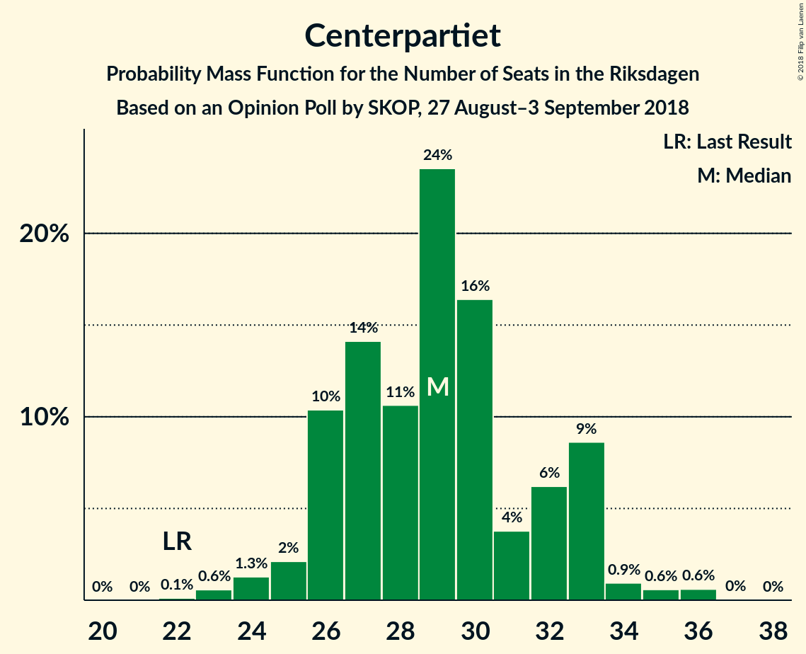
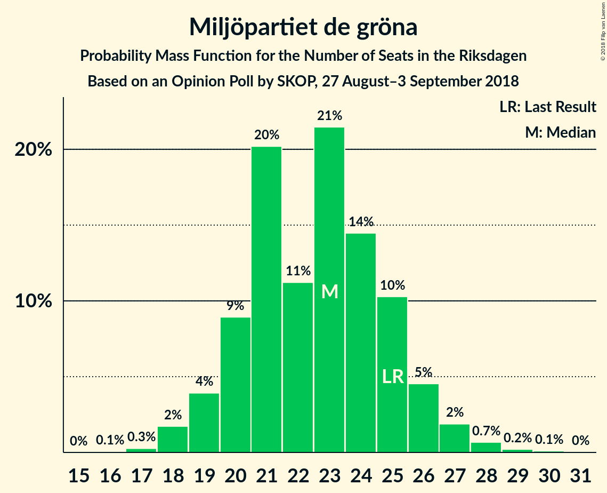

# Opinion Poll by SKOP, 27 August–3 September 2018

<a href="#voting-intentions">Voting Intentions</a> | <a href="#seats">Seats</a> | <a href="#coalitions">Coalitions</a> | <a href="#technical-information">Technical Information</a>

## Voting Intentions

### Confidence Intervals

| Party | Last Result | Poll Result | 80% Confidence Interval | 90% Confidence Interval | 95% Confidence Interval | 99% Confidence Interval |
|:-----:|:-----------:|:-----------:|:-----------------------:|:-----------------------:|:-----------------------:|:-----------------------:|
| Sveriges socialdemokratiska arbetareparti | 31.0% | 22.9% | 21.7–24.3% |21.3–24.6% |21.0–25.0% |20.4–25.6% |
| Sverigedemokraterna | 12.9% | 20.3% | 19.1–21.6% |18.8–21.9% |18.5–22.3% |17.9–22.9% |
| Moderata samlingspartiet | 23.3% | 16.3% | 15.2–17.5% |14.9–17.8% |14.6–18.1% |14.1–18.7% |
| Vänsterpartiet | 5.7% | 11.0% | 10.1–12.0% |9.8–12.3% |9.6–12.6% |9.2–13.1% |
| Centerpartiet | 6.1% | 8.0% | 7.2–8.9% |7.0–9.1% |6.8–9.4% |6.4–9.8% |
| Kristdemokraterna | 4.6% | 6.8% | 6.1–7.6% |5.9–7.9% |5.7–8.1% |5.4–8.5% |
| Miljöpartiet de gröna | 6.9% | 6.2% | 5.5–7.0% |5.3–7.3% |5.2–7.5% |4.9–7.9% |
| Liberalerna | 5.4% | 4.9% | 4.3–5.6% |4.1–5.8% |4.0–6.0% |3.7–6.4% |
| Feministiskt initiativ | 3.1% | 1.1% | 0.8–1.5% |0.7–1.6% |0.7–1.7% |0.6–1.9% |

*Note:* The poll result column reflects the actual value used in the calculations. Published results may vary slightly, and in addition be rounded to fewer digits.

## Seats

### Confidence Intervals

| Party | Last Result | Median | 80% Confidence Interval | 90% Confidence Interval | 95% Confidence Interval | 99% Confidence Interval |
|:-----:|:-----------:|:------:|:-----------------------:|:-----------------------:|:-----------------------:|:-----------------------:|
| <a href="#sveriges-socialdemokratiska-arbetareparti">Sveriges socialdemokratiska arbetareparti</a> | 113 | 83 | 78–88 |77–89 |76–90 |74–92 |
| <a href="#sverigedemokraterna">Sverigedemokraterna</a> | 49 | 73 | 69–78 |68–79 |67–80 |65–83 |
| <a href="#moderata-samlingspartiet">Moderata samlingspartiet</a> | 84 | 59 | 55–63 |54–64 |52–65 |52–68 |
| <a href="#vänsterpartiet">Vänsterpartiet</a> | 21 | 40 | 37–43 |36–44 |35–45 |34–47 |
| <a href="#centerpartiet">Centerpartiet</a> | 22 | 29 | 26–33 |26–33 |25–33 |23–36 |
| <a href="#kristdemokraterna">Kristdemokraterna</a> | 16 | 25 | 22–27 |21–28 |21–29 |19–30 |
| <a href="#miljöpartiet-de-gröna">Miljöpartiet de gröna</a> | 25 | 23 | 20–25 |19–26 |19–27 |18–28 |
| <a href="#liberalerna">Liberalerna</a> | 19 | 18 | 16–20 |15–21 |15–22 |0–23 |
| <a href="#feministiskt-initiativ">Feministiskt initiativ</a> | 0 | 0 | 0 |0 |0 |0 |

### Sveriges socialdemokratiska arbetareparti

*For a full overview of the results for this party, see the [Sveriges socialdemokratiska arbetareparti](party-sverigessocialdemokratiskaarbetareparti.html) page.*

| Number of Seats | Probability | Accumulated | Special Marks |
|:---------------:|:-----------:|:-----------:|:-------------:|
| 72 | 0.2% | 100% |  |
| 73 | 0.2% | 99.8% |  |
| 74 | 0.4% | 99.6% |  |
| 75 | 1.1% | 99.3% |  |
| 76 | 2% | 98% |  |
| 77 | 3% | 96% |  |
| 78 | 4% | 94% |  |
| 79 | 5% | 90% |  |
| 80 | 10% | 85% |  |
| 81 | 4% | 75% |  |
| 82 | 21% | 72% |  |
| 83 | 11% | 50% | Median |
| 84 | 7% | 40% |  |
| 85 | 9% | 33% |  |
| 86 | 7% | 24% |  |
| 87 | 5% | 16% |  |
| 88 | 3% | 11% |  |
| 89 | 4% | 8% |  |
| 90 | 2% | 4% |  |
| 91 | 1.0% | 2% |  |
| 92 | 0.5% | 0.9% |  |
| 93 | 0.2% | 0.4% |  |
| 94 | 0.1% | 0.2% |  |
| 95 | 0.1% | 0.1% |  |
| 96 | 0% | 0.1% |  |
| 97 | 0% | 0% |  |
| 98 | 0% | 0% |  |
| 99 | 0% | 0% |  |
| 100 | 0% | 0% |  |
| 101 | 0% | 0% |  |
| 102 | 0% | 0% |  |
| 103 | 0% | 0% |  |
| 104 | 0% | 0% |  |
| 105 | 0% | 0% |  |
| 106 | 0% | 0% |  |
| 107 | 0% | 0% |  |
| 108 | 0% | 0% |  |
| 109 | 0% | 0% |  |
| 110 | 0% | 0% |  |
| 111 | 0% | 0% |  |
| 112 | 0% | 0% |  |
| 113 | 0% | 0% | Last Result |

### Sverigedemokraterna

*For a full overview of the results for this party, see the [Sverigedemokraterna](party-sverigedemokraterna.html) page.*

| Number of Seats | Probability | Accumulated | Special Marks |
|:---------------:|:-----------:|:-----------:|:-------------:|
| 49 | 0% | 100% | Last Result |
| 50 | 0% | 100% |  |
| 51 | 0% | 100% |  |
| 52 | 0% | 100% |  |
| 53 | 0% | 100% |  |
| 54 | 0% | 100% |  |
| 55 | 0% | 100% |  |
| 56 | 0% | 100% |  |
| 57 | 0% | 100% |  |
| 58 | 0% | 100% |  |
| 59 | 0% | 100% |  |
| 60 | 0% | 100% |  |
| 61 | 0% | 100% |  |
| 62 | 0% | 100% |  |
| 63 | 0.1% | 100% |  |
| 64 | 0.2% | 99.8% |  |
| 65 | 0.6% | 99.6% |  |
| 66 | 1.2% | 99.0% |  |
| 67 | 1.1% | 98% |  |
| 68 | 3% | 97% |  |
| 69 | 5% | 93% |  |
| 70 | 5% | 88% |  |
| 71 | 13% | 83% |  |
| 72 | 10% | 70% |  |
| 73 | 22% | 61% | Median |
| 74 | 7% | 38% |  |
| 75 | 11% | 32% |  |
| 76 | 4% | 21% |  |
| 77 | 5% | 18% |  |
| 78 | 5% | 12% |  |
| 79 | 2% | 7% |  |
| 80 | 3% | 5% |  |
| 81 | 1.1% | 2% |  |
| 82 | 0.5% | 1.0% |  |
| 83 | 0.3% | 0.6% |  |
| 84 | 0.1% | 0.2% |  |
| 85 | 0.1% | 0.1% |  |
| 86 | 0% | 0.1% |  |
| 87 | 0% | 0% |  |

### Moderata samlingspartiet

*For a full overview of the results for this party, see the [Moderata samlingspartiet](party-moderatasamlingspartiet.html) page.*

| Number of Seats | Probability | Accumulated | Special Marks |
|:---------------:|:-----------:|:-----------:|:-------------:|
| 49 | 0% | 100% |  |
| 50 | 0.2% | 99.9% |  |
| 51 | 0.2% | 99.7% |  |
| 52 | 2% | 99.5% |  |
| 53 | 1.4% | 97% |  |
| 54 | 3% | 96% |  |
| 55 | 7% | 93% |  |
| 56 | 10% | 86% |  |
| 57 | 11% | 76% |  |
| 58 | 12% | 65% |  |
| 59 | 20% | 53% | Median |
| 60 | 5% | 33% |  |
| 61 | 9% | 29% |  |
| 62 | 5% | 19% |  |
| 63 | 8% | 14% |  |
| 64 | 2% | 6% |  |
| 65 | 3% | 4% |  |
| 66 | 1.0% | 2% |  |
| 67 | 0.4% | 0.9% |  |
| 68 | 0.2% | 0.5% |  |
| 69 | 0.2% | 0.3% |  |
| 70 | 0% | 0.1% |  |
| 71 | 0% | 0.1% |  |
| 72 | 0% | 0% |  |
| 73 | 0% | 0% |  |
| 74 | 0% | 0% |  |
| 75 | 0% | 0% |  |
| 76 | 0% | 0% |  |
| 77 | 0% | 0% |  |
| 78 | 0% | 0% |  |
| 79 | 0% | 0% |  |
| 80 | 0% | 0% |  |
| 81 | 0% | 0% |  |
| 82 | 0% | 0% |  |
| 83 | 0% | 0% |  |
| 84 | 0% | 0% | Last Result |

### Vänsterpartiet

*For a full overview of the results for this party, see the [Vänsterpartiet](party-vänsterpartiet.html) page.*

| Number of Seats | Probability | Accumulated | Special Marks |
|:---------------:|:-----------:|:-----------:|:-------------:|
| 21 | 0% | 100% | Last Result |
| 22 | 0% | 100% |  |
| 23 | 0% | 100% |  |
| 24 | 0% | 100% |  |
| 25 | 0% | 100% |  |
| 26 | 0% | 100% |  |
| 27 | 0% | 100% |  |
| 28 | 0% | 100% |  |
| 29 | 0% | 100% |  |
| 30 | 0% | 100% |  |
| 31 | 0% | 100% |  |
| 32 | 0.1% | 100% |  |
| 33 | 0.2% | 99.9% |  |
| 34 | 0.8% | 99.6% |  |
| 35 | 3% | 98.8% |  |
| 36 | 4% | 96% |  |
| 37 | 5% | 93% |  |
| 38 | 11% | 88% |  |
| 39 | 9% | 77% |  |
| 40 | 22% | 68% | Median |
| 41 | 15% | 46% |  |
| 42 | 16% | 31% |  |
| 43 | 8% | 14% |  |
| 44 | 3% | 6% |  |
| 45 | 1.3% | 3% |  |
| 46 | 1.1% | 2% |  |
| 47 | 0.3% | 0.6% |  |
| 48 | 0.2% | 0.3% |  |
| 49 | 0.1% | 0.1% |  |
| 50 | 0% | 0% |  |

### Centerpartiet

*For a full overview of the results for this party, see the [Centerpartiet](party-centerpartiet.html) page.*

| Number of Seats | Probability | Accumulated | Special Marks |
|:---------------:|:-----------:|:-----------:|:-------------:|
| 22 | 0.1% | 100% | Last Result |
| 23 | 0.6% | 99.9% |  |
| 24 | 1.3% | 99.3% |  |
| 25 | 2% | 98% |  |
| 26 | 10% | 96% |  |
| 27 | 14% | 86% |  |
| 28 | 11% | 71% |  |
| 29 | 24% | 61% | Median |
| 30 | 16% | 37% |  |
| 31 | 4% | 21% |  |
| 32 | 6% | 17% |  |
| 33 | 9% | 11% |  |
| 34 | 0.9% | 2% |  |
| 35 | 0.6% | 1.3% |  |
| 36 | 0.6% | 0.7% |  |
| 37 | 0% | 0.1% |  |
| 38 | 0% | 0% |  |

### Kristdemokraterna

*For a full overview of the results for this party, see the [Kristdemokraterna](party-kristdemokraterna.html) page.*

| Number of Seats | Probability | Accumulated | Special Marks |
|:---------------:|:-----------:|:-----------:|:-------------:|
| 16 | 0% | 100% | Last Result |
| 17 | 0% | 100% |  |
| 18 | 0.2% | 100% |  |
| 19 | 0.4% | 99.8% |  |
| 20 | 1.5% | 99.5% |  |
| 21 | 3% | 98% |  |
| 22 | 7% | 95% |  |
| 23 | 19% | 88% |  |
| 24 | 17% | 68% |  |
| 25 | 16% | 52% | Median |
| 26 | 15% | 36% |  |
| 27 | 12% | 21% |  |
| 28 | 5% | 9% |  |
| 29 | 3% | 4% |  |
| 30 | 1.2% | 2% |  |
| 31 | 0.4% | 0.5% |  |
| 32 | 0.1% | 0.1% |  |
| 33 | 0% | 0% |  |

### Miljöpartiet de gröna

*For a full overview of the results for this party, see the [Miljöpartiet de gröna](party-miljöpartietdegröna.html) page.*

| Number of Seats | Probability | Accumulated | Special Marks |
|:---------------:|:-----------:|:-----------:|:-------------:|
| 16 | 0.1% | 100% |  |
| 17 | 0.3% | 99.9% |  |
| 18 | 2% | 99.7% |  |
| 19 | 4% | 98% |  |
| 20 | 9% | 94% |  |
| 21 | 20% | 85% |  |
| 22 | 11% | 65% |  |
| 23 | 21% | 54% | Median |
| 24 | 14% | 32% |  |
| 25 | 10% | 18% | Last Result |
| 26 | 5% | 7% |  |
| 27 | 2% | 3% |  |
| 28 | 0.7% | 1.0% |  |
| 29 | 0.2% | 0.3% |  |
| 30 | 0.1% | 0.1% |  |
| 31 | 0% | 0% |  |

### Liberalerna

*For a full overview of the results for this party, see the [Liberalerna](party-liberalerna.html) page.*

| Number of Seats | Probability | Accumulated | Special Marks |
|:---------------:|:-----------:|:-----------:|:-------------:|
| 0 | 2% | 100% |  |
| 1 | 0% | 98% |  |
| 2 | 0% | 98% |  |
| 3 | 0% | 98% |  |
| 4 | 0% | 98% |  |
| 5 | 0% | 98% |  |
| 6 | 0% | 98% |  |
| 7 | 0% | 98% |  |
| 8 | 0% | 98% |  |
| 9 | 0% | 98% |  |
| 10 | 0% | 98% |  |
| 11 | 0% | 98% |  |
| 12 | 0% | 98% |  |
| 13 | 0% | 98% |  |
| 14 | 0.4% | 98% |  |
| 15 | 6% | 98% |  |
| 16 | 18% | 92% |  |
| 17 | 19% | 74% |  |
| 18 | 27% | 56% | Median |
| 19 | 14% | 29% | Last Result |
| 20 | 9% | 15% |  |
| 21 | 3% | 6% |  |
| 22 | 3% | 3% |  |
| 23 | 0.6% | 0.8% |  |
| 24 | 0.1% | 0.2% |  |
| 25 | 0% | 0.1% |  |
| 26 | 0% | 0% |  |

### Feministiskt initiativ

*For a full overview of the results for this party, see the [Feministiskt initiativ](party-feministisktinitiativ.html) page.*

| Number of Seats | Probability | Accumulated | Special Marks |
|:---------------:|:-----------:|:-----------:|:-------------:|
| 0 | 100% | 100% | Last Result, Median |

## Coalitions

### Confidence Intervals

| Coalition | Last Result | Median | Majority? | 80% Confidence Interval | 90% Confidence Interval | 95% Confidence Interval | 99% Confidence Interval |
|:---------:|:-----------:|:------:|:---------:|:-----------------------:|:-----------------------:|:-----------------------:|:-----------------------:|
| Sveriges socialdemokratiska arbetareparti – Moderata samlingspartiet – Centerpartiet | 219 | 171 | 16% | 165–176 | 164–178 | 163–179 | 159–184 |
| Sverigedemokraterna – Moderata samlingspartiet – Kristdemokraterna | 149 | 157 | 0% | 151–162 | 150–164 | 149–166 | 146–170 |
| Sveriges socialdemokratiska arbetareparti – Vänsterpartiet – Miljöpartiet de gröna – Feministiskt initiativ | 159 | 146 | 0% | 141–151 | 139–152 | 138–153 | 135–157 |
| Sveriges socialdemokratiska arbetareparti – Vänsterpartiet – Miljöpartiet de gröna | 159 | 146 | 0% | 141–151 | 139–152 | 138–153 | 135–157 |
| Sveriges socialdemokratiska arbetareparti – Moderata samlingspartiet | 197 | 141 | 0% | 136–148 | 135–149 | 133–151 | 131–153 |
| Sverigedemokraterna – Moderata samlingspartiet | 133 | 132 | 0% | 127–137 | 125–140 | 124–141 | 122–144 |
| Moderata samlingspartiet – Centerpartiet – Kristdemokraterna – Liberalerna | 141 | 130 | 0% | 125–135 | 124–136 | 122–138 | 117–140 |
| Sveriges socialdemokratiska arbetareparti – Vänsterpartiet | 134 | 123 | 0% | 118–127 | 117–129 | 115–130 | 113–134 |
| Moderata samlingspartiet – Centerpartiet – Kristdemokraterna | 122 | 112 | 0% | 107–118 | 106–119 | 105–120 | 103–124 |
| Sveriges socialdemokratiska arbetareparti – Miljöpartiet de gröna | 138 | 105 | 0% | 101–111 | 99–113 | 98–114 | 95–116 |
| Moderata samlingspartiet – Centerpartiet – Liberalerna | 125 | 105 | 0% | 100–110 | 99–112 | 98–113 | 92–116 |
| Moderata samlingspartiet – Centerpartiet | 106 | 87 | 0% | 83–93 | 82–94 | 81–95 | 79–98 |

### Sveriges socialdemokratiska arbetareparti – Moderata samlingspartiet – Centerpartiet

| Number of Seats | Probability | Accumulated | Special Marks |
|:---------------:|:-----------:|:-----------:|:-------------:|
| 157 | 0% | 100% |  |
| 158 | 0.1% | 99.9% |  |
| 159 | 0.4% | 99.8% |  |
| 160 | 0.3% | 99.4% |  |
| 161 | 0.8% | 99.1% |  |
| 162 | 0.5% | 98% |  |
| 163 | 2% | 98% |  |
| 164 | 2% | 96% |  |
| 165 | 4% | 93% |  |
| 166 | 5% | 89% |  |
| 167 | 4% | 84% |  |
| 168 | 12% | 80% |  |
| 169 | 6% | 68% |  |
| 170 | 4% | 61% |  |
| 171 | 18% | 57% | Median |
| 172 | 6% | 39% |  |
| 173 | 11% | 34% |  |
| 174 | 7% | 23% |  |
| 175 | 4% | 16% | Majority |
| 176 | 2% | 12% |  |
| 177 | 3% | 10% |  |
| 178 | 2% | 6% |  |
| 179 | 2% | 4% |  |
| 180 | 0.8% | 2% |  |
| 181 | 0.3% | 2% |  |
| 182 | 0.4% | 1.3% |  |
| 183 | 0.3% | 0.9% |  |
| 184 | 0.2% | 0.6% |  |
| 185 | 0.2% | 0.4% |  |
| 186 | 0.1% | 0.2% |  |
| 187 | 0.1% | 0.1% |  |
| 188 | 0% | 0.1% |  |
| 189 | 0% | 0.1% |  |
| 190 | 0% | 0% |  |
| 191 | 0% | 0% |  |
| 192 | 0% | 0% |  |
| 193 | 0% | 0% |  |
| 194 | 0% | 0% |  |
| 195 | 0% | 0% |  |
| 196 | 0% | 0% |  |
| 197 | 0% | 0% |  |
| 198 | 0% | 0% |  |
| 199 | 0% | 0% |  |
| 200 | 0% | 0% |  |
| 201 | 0% | 0% |  |
| 202 | 0% | 0% |  |
| 203 | 0% | 0% |  |
| 204 | 0% | 0% |  |
| 205 | 0% | 0% |  |
| 206 | 0% | 0% |  |
| 207 | 0% | 0% |  |
| 208 | 0% | 0% |  |
| 209 | 0% | 0% |  |
| 210 | 0% | 0% |  |
| 211 | 0% | 0% |  |
| 212 | 0% | 0% |  |
| 213 | 0% | 0% |  |
| 214 | 0% | 0% |  |
| 215 | 0% | 0% |  |
| 216 | 0% | 0% |  |
| 217 | 0% | 0% |  |
| 218 | 0% | 0% |  |
| 219 | 0% | 0% | Last Result |

### Sverigedemokraterna – Moderata samlingspartiet – Kristdemokraterna

| Number of Seats | Probability | Accumulated | Special Marks |
|:---------------:|:-----------:|:-----------:|:-------------:|
| 144 | 0.1% | 100% |  |
| 145 | 0.1% | 99.8% |  |
| 146 | 0.3% | 99.7% |  |
| 147 | 0.4% | 99.4% |  |
| 148 | 1.3% | 99.0% |  |
| 149 | 1.1% | 98% | Last Result |
| 150 | 5% | 97% |  |
| 151 | 2% | 92% |  |
| 152 | 5% | 90% |  |
| 153 | 6% | 85% |  |
| 154 | 10% | 79% |  |
| 155 | 10% | 68% |  |
| 156 | 5% | 58% |  |
| 157 | 8% | 53% | Median |
| 158 | 12% | 45% |  |
| 159 | 10% | 33% |  |
| 160 | 6% | 23% |  |
| 161 | 4% | 16% |  |
| 162 | 4% | 12% |  |
| 163 | 2% | 8% |  |
| 164 | 2% | 6% |  |
| 165 | 0.8% | 4% |  |
| 166 | 0.7% | 3% |  |
| 167 | 0.5% | 2% |  |
| 168 | 0.6% | 2% |  |
| 169 | 0.4% | 1.0% |  |
| 170 | 0.3% | 0.6% |  |
| 171 | 0% | 0.3% |  |
| 172 | 0.1% | 0.3% |  |
| 173 | 0.1% | 0.2% |  |
| 174 | 0% | 0.1% |  |
| 175 | 0% | 0% | Majority |

### Sveriges socialdemokratiska arbetareparti – Vänsterpartiet – Miljöpartiet de gröna – Feministiskt initiativ

| Number of Seats | Probability | Accumulated | Special Marks |
|:---------------:|:-----------:|:-----------:|:-------------:|
| 132 | 0% | 100% |  |
| 133 | 0.1% | 99.9% |  |
| 134 | 0.1% | 99.8% |  |
| 135 | 0.6% | 99.6% |  |
| 136 | 0.4% | 99.0% |  |
| 137 | 0.8% | 98.6% |  |
| 138 | 1.3% | 98% |  |
| 139 | 4% | 96% |  |
| 140 | 2% | 92% |  |
| 141 | 4% | 90% |  |
| 142 | 4% | 86% |  |
| 143 | 12% | 82% |  |
| 144 | 9% | 70% |  |
| 145 | 8% | 61% |  |
| 146 | 9% | 53% | Median |
| 147 | 11% | 44% |  |
| 148 | 11% | 33% |  |
| 149 | 4% | 22% |  |
| 150 | 5% | 18% |  |
| 151 | 3% | 13% |  |
| 152 | 7% | 10% |  |
| 153 | 1.0% | 3% |  |
| 154 | 0.9% | 2% |  |
| 155 | 0.5% | 1.3% |  |
| 156 | 0.3% | 0.9% |  |
| 157 | 0.3% | 0.6% |  |
| 158 | 0.2% | 0.3% |  |
| 159 | 0% | 0.1% | Last Result |
| 160 | 0% | 0.1% |  |
| 161 | 0% | 0.1% |  |
| 162 | 0% | 0% |  |

### Sveriges socialdemokratiska arbetareparti – Vänsterpartiet – Miljöpartiet de gröna

| Number of Seats | Probability | Accumulated | Special Marks |
|:---------------:|:-----------:|:-----------:|:-------------:|
| 132 | 0% | 100% |  |
| 133 | 0.1% | 99.9% |  |
| 134 | 0.1% | 99.8% |  |
| 135 | 0.6% | 99.6% |  |
| 136 | 0.4% | 99.0% |  |
| 137 | 0.8% | 98.6% |  |
| 138 | 1.3% | 98% |  |
| 139 | 4% | 96% |  |
| 140 | 2% | 92% |  |
| 141 | 4% | 90% |  |
| 142 | 4% | 86% |  |
| 143 | 12% | 82% |  |
| 144 | 9% | 70% |  |
| 145 | 8% | 61% |  |
| 146 | 9% | 53% | Median |
| 147 | 11% | 44% |  |
| 148 | 11% | 33% |  |
| 149 | 4% | 22% |  |
| 150 | 5% | 18% |  |
| 151 | 3% | 13% |  |
| 152 | 7% | 10% |  |
| 153 | 1.0% | 3% |  |
| 154 | 0.9% | 2% |  |
| 155 | 0.5% | 1.3% |  |
| 156 | 0.3% | 0.9% |  |
| 157 | 0.3% | 0.6% |  |
| 158 | 0.2% | 0.3% |  |
| 159 | 0% | 0.1% | Last Result |
| 160 | 0% | 0.1% |  |
| 161 | 0% | 0.1% |  |
| 162 | 0% | 0% |  |

### Sveriges socialdemokratiska arbetareparti – Moderata samlingspartiet

| Number of Seats | Probability | Accumulated | Special Marks |
|:---------------:|:-----------:|:-----------:|:-------------:|
| 128 | 0% | 100% |  |
| 129 | 0.1% | 99.9% |  |
| 130 | 0.2% | 99.9% |  |
| 131 | 0.2% | 99.7% |  |
| 132 | 0.5% | 99.4% |  |
| 133 | 2% | 98.9% |  |
| 134 | 1.1% | 97% |  |
| 135 | 2% | 96% |  |
| 136 | 4% | 94% |  |
| 137 | 4% | 90% |  |
| 138 | 4% | 86% |  |
| 139 | 7% | 82% |  |
| 140 | 7% | 75% |  |
| 141 | 21% | 68% |  |
| 142 | 9% | 48% | Median |
| 143 | 10% | 38% |  |
| 144 | 10% | 28% |  |
| 145 | 3% | 18% |  |
| 146 | 3% | 15% |  |
| 147 | 2% | 12% |  |
| 148 | 4% | 10% |  |
| 149 | 2% | 7% |  |
| 150 | 1.3% | 5% |  |
| 151 | 2% | 3% |  |
| 152 | 0.3% | 1.2% |  |
| 153 | 0.4% | 0.9% |  |
| 154 | 0.2% | 0.5% |  |
| 155 | 0.1% | 0.3% |  |
| 156 | 0% | 0.2% |  |
| 157 | 0.1% | 0.1% |  |
| 158 | 0% | 0.1% |  |
| 159 | 0% | 0% |  |
| 160 | 0% | 0% |  |
| 161 | 0% | 0% |  |
| 162 | 0% | 0% |  |
| 163 | 0% | 0% |  |
| 164 | 0% | 0% |  |
| 165 | 0% | 0% |  |
| 166 | 0% | 0% |  |
| 167 | 0% | 0% |  |
| 168 | 0% | 0% |  |
| 169 | 0% | 0% |  |
| 170 | 0% | 0% |  |
| 171 | 0% | 0% |  |
| 172 | 0% | 0% |  |
| 173 | 0% | 0% |  |
| 174 | 0% | 0% |  |
| 175 | 0% | 0% | Majority |
| 176 | 0% | 0% |  |
| 177 | 0% | 0% |  |
| 178 | 0% | 0% |  |
| 179 | 0% | 0% |  |
| 180 | 0% | 0% |  |
| 181 | 0% | 0% |  |
| 182 | 0% | 0% |  |
| 183 | 0% | 0% |  |
| 184 | 0% | 0% |  |
| 185 | 0% | 0% |  |
| 186 | 0% | 0% |  |
| 187 | 0% | 0% |  |
| 188 | 0% | 0% |  |
| 189 | 0% | 0% |  |
| 190 | 0% | 0% |  |
| 191 | 0% | 0% |  |
| 192 | 0% | 0% |  |
| 193 | 0% | 0% |  |
| 194 | 0% | 0% |  |
| 195 | 0% | 0% |  |
| 196 | 0% | 0% |  |
| 197 | 0% | 0% | Last Result |

### Sverigedemokraterna – Moderata samlingspartiet

| Number of Seats | Probability | Accumulated | Special Marks |
|:---------------:|:-----------:|:-----------:|:-------------:|
| 119 | 0% | 100% |  |
| 120 | 0.1% | 99.9% |  |
| 121 | 0.2% | 99.8% |  |
| 122 | 0.3% | 99.7% |  |
| 123 | 1.4% | 99.4% |  |
| 124 | 2% | 98% |  |
| 125 | 1.4% | 96% |  |
| 126 | 3% | 95% |  |
| 127 | 8% | 92% |  |
| 128 | 3% | 84% |  |
| 129 | 4% | 81% |  |
| 130 | 11% | 76% |  |
| 131 | 8% | 66% |  |
| 132 | 15% | 57% | Median |
| 133 | 8% | 43% | Last Result |
| 134 | 14% | 35% |  |
| 135 | 4% | 20% |  |
| 136 | 4% | 17% |  |
| 137 | 4% | 12% |  |
| 138 | 2% | 8% |  |
| 139 | 1.0% | 6% |  |
| 140 | 2% | 5% |  |
| 141 | 1.3% | 4% |  |
| 142 | 0.6% | 2% |  |
| 143 | 0.7% | 2% |  |
| 144 | 0.6% | 1.0% |  |
| 145 | 0.2% | 0.3% |  |
| 146 | 0.1% | 0.1% |  |
| 147 | 0% | 0.1% |  |
| 148 | 0% | 0% |  |

### Moderata samlingspartiet – Centerpartiet – Kristdemokraterna – Liberalerna

| Number of Seats | Probability | Accumulated | Special Marks |
|:---------------:|:-----------:|:-----------:|:-------------:|
| 112 | 0% | 100% |  |
| 113 | 0.1% | 99.9% |  |
| 114 | 0% | 99.8% |  |
| 115 | 0% | 99.7% |  |
| 116 | 0% | 99.7% |  |
| 117 | 0.2% | 99.7% |  |
| 118 | 0.1% | 99.5% |  |
| 119 | 0.3% | 99.3% |  |
| 120 | 0.3% | 99.0% |  |
| 121 | 0.5% | 98.6% |  |
| 122 | 1.2% | 98% |  |
| 123 | 2% | 97% |  |
| 124 | 2% | 95% |  |
| 125 | 4% | 93% |  |
| 126 | 7% | 89% |  |
| 127 | 5% | 82% |  |
| 128 | 13% | 77% |  |
| 129 | 9% | 64% |  |
| 130 | 11% | 55% |  |
| 131 | 8% | 44% | Median |
| 132 | 9% | 36% |  |
| 133 | 9% | 26% |  |
| 134 | 5% | 17% |  |
| 135 | 3% | 12% |  |
| 136 | 5% | 9% |  |
| 137 | 2% | 4% |  |
| 138 | 1.3% | 3% |  |
| 139 | 0.8% | 2% |  |
| 140 | 0.4% | 0.9% |  |
| 141 | 0.2% | 0.5% | Last Result |
| 142 | 0.1% | 0.3% |  |
| 143 | 0.1% | 0.2% |  |
| 144 | 0% | 0.1% |  |
| 145 | 0% | 0% |  |

### Sveriges socialdemokratiska arbetareparti – Vänsterpartiet

| Number of Seats | Probability | Accumulated | Special Marks |
|:---------------:|:-----------:|:-----------:|:-------------:|
| 110 | 0% | 100% |  |
| 111 | 0.1% | 99.9% |  |
| 112 | 0.3% | 99.8% |  |
| 113 | 0.3% | 99.5% |  |
| 114 | 0.8% | 99.2% |  |
| 115 | 1.2% | 98% |  |
| 116 | 2% | 97% |  |
| 117 | 3% | 95% |  |
| 118 | 3% | 93% |  |
| 119 | 5% | 90% |  |
| 120 | 6% | 84% |  |
| 121 | 6% | 78% |  |
| 122 | 13% | 73% |  |
| 123 | 10% | 59% | Median |
| 124 | 12% | 49% |  |
| 125 | 14% | 37% |  |
| 126 | 2% | 23% |  |
| 127 | 11% | 20% |  |
| 128 | 3% | 9% |  |
| 129 | 3% | 6% |  |
| 130 | 0.9% | 3% |  |
| 131 | 0.7% | 2% |  |
| 132 | 0.4% | 1.2% |  |
| 133 | 0.3% | 0.9% |  |
| 134 | 0.2% | 0.6% | Last Result |
| 135 | 0.1% | 0.3% |  |
| 136 | 0.2% | 0.2% |  |
| 137 | 0% | 0.1% |  |
| 138 | 0% | 0% |  |

### Moderata samlingspartiet – Centerpartiet – Kristdemokraterna

| Number of Seats | Probability | Accumulated | Special Marks |
|:---------------:|:-----------:|:-----------:|:-------------:|
| 99 | 0.1% | 100% |  |
| 100 | 0% | 99.9% |  |
| 101 | 0.1% | 99.9% |  |
| 102 | 0.2% | 99.8% |  |
| 103 | 0.4% | 99.7% |  |
| 104 | 1.5% | 99.3% |  |
| 105 | 1.0% | 98% |  |
| 106 | 4% | 97% |  |
| 107 | 4% | 93% |  |
| 108 | 3% | 89% |  |
| 109 | 7% | 85% |  |
| 110 | 11% | 78% |  |
| 111 | 6% | 67% |  |
| 112 | 13% | 61% |  |
| 113 | 7% | 48% | Median |
| 114 | 10% | 41% |  |
| 115 | 9% | 31% |  |
| 116 | 8% | 22% |  |
| 117 | 4% | 14% |  |
| 118 | 5% | 10% |  |
| 119 | 2% | 6% |  |
| 120 | 1.2% | 4% |  |
| 121 | 1.0% | 2% |  |
| 122 | 0.4% | 1.4% | Last Result |
| 123 | 0.4% | 1.0% |  |
| 124 | 0.2% | 0.5% |  |
| 125 | 0.1% | 0.4% |  |
| 126 | 0.1% | 0.2% |  |
| 127 | 0.1% | 0.1% |  |
| 128 | 0% | 0.1% |  |
| 129 | 0% | 0.1% |  |
| 130 | 0% | 0% |  |

### Sveriges socialdemokratiska arbetareparti – Miljöpartiet de gröna

| Number of Seats | Probability | Accumulated | Special Marks |
|:---------------:|:-----------:|:-----------:|:-------------:|
| 93 | 0% | 100% |  |
| 94 | 0.2% | 99.9% |  |
| 95 | 0.3% | 99.8% |  |
| 96 | 0.5% | 99.5% |  |
| 97 | 1.0% | 98.9% |  |
| 98 | 2% | 98% |  |
| 99 | 2% | 96% |  |
| 100 | 3% | 94% |  |
| 101 | 4% | 91% |  |
| 102 | 5% | 87% |  |
| 103 | 12% | 82% |  |
| 104 | 12% | 70% |  |
| 105 | 14% | 57% |  |
| 106 | 6% | 44% | Median |
| 107 | 8% | 38% |  |
| 108 | 9% | 30% |  |
| 109 | 4% | 21% |  |
| 110 | 3% | 16% |  |
| 111 | 3% | 13% |  |
| 112 | 4% | 10% |  |
| 113 | 3% | 6% |  |
| 114 | 2% | 3% |  |
| 115 | 0.5% | 1.1% |  |
| 116 | 0.3% | 0.6% |  |
| 117 | 0.1% | 0.3% |  |
| 118 | 0% | 0.1% |  |
| 119 | 0% | 0.1% |  |
| 120 | 0% | 0% |  |
| 121 | 0% | 0% |  |
| 122 | 0% | 0% |  |
| 123 | 0% | 0% |  |
| 124 | 0% | 0% |  |
| 125 | 0% | 0% |  |
| 126 | 0% | 0% |  |
| 127 | 0% | 0% |  |
| 128 | 0% | 0% |  |
| 129 | 0% | 0% |  |
| 130 | 0% | 0% |  |
| 131 | 0% | 0% |  |
| 132 | 0% | 0% |  |
| 133 | 0% | 0% |  |
| 134 | 0% | 0% |  |
| 135 | 0% | 0% |  |
| 136 | 0% | 0% |  |
| 137 | 0% | 0% |  |
| 138 | 0% | 0% | Last Result |

### Moderata samlingspartiet – Centerpartiet – Liberalerna

| Number of Seats | Probability | Accumulated | Special Marks |
|:---------------:|:-----------:|:-----------:|:-------------:|
| 85 | 0% | 100% |  |
| 86 | 0.1% | 99.9% |  |
| 87 | 0% | 99.8% |  |
| 88 | 0% | 99.8% |  |
| 89 | 0.1% | 99.8% |  |
| 90 | 0.1% | 99.7% |  |
| 91 | 0.1% | 99.7% |  |
| 92 | 0.2% | 99.5% |  |
| 93 | 0.1% | 99.3% |  |
| 94 | 0.2% | 99.2% |  |
| 95 | 0.3% | 99.0% |  |
| 96 | 0.5% | 98.7% |  |
| 97 | 0.5% | 98% |  |
| 98 | 0.9% | 98% |  |
| 99 | 3% | 97% |  |
| 100 | 5% | 94% |  |
| 101 | 3% | 88% |  |
| 102 | 5% | 85% |  |
| 103 | 15% | 80% |  |
| 104 | 11% | 65% |  |
| 105 | 10% | 54% |  |
| 106 | 6% | 44% | Median |
| 107 | 8% | 38% |  |
| 108 | 5% | 31% |  |
| 109 | 11% | 25% |  |
| 110 | 7% | 15% |  |
| 111 | 2% | 8% |  |
| 112 | 3% | 6% |  |
| 113 | 1.0% | 3% |  |
| 114 | 1.0% | 2% |  |
| 115 | 0.5% | 1.1% |  |
| 116 | 0.5% | 0.7% |  |
| 117 | 0.1% | 0.2% |  |
| 118 | 0.1% | 0.1% |  |
| 119 | 0% | 0% |  |
| 120 | 0% | 0% |  |
| 121 | 0% | 0% |  |
| 122 | 0% | 0% |  |
| 123 | 0% | 0% |  |
| 124 | 0% | 0% |  |
| 125 | 0% | 0% | Last Result |

### Moderata samlingspartiet – Centerpartiet

| Number of Seats | Probability | Accumulated | Special Marks |
|:---------------:|:-----------:|:-----------:|:-------------:|
| 76 | 0% | 100% |  |
| 77 | 0.1% | 99.9% |  |
| 78 | 0.2% | 99.8% |  |
| 79 | 0.4% | 99.6% |  |
| 80 | 0.8% | 99.2% |  |
| 81 | 2% | 98% |  |
| 82 | 4% | 97% |  |
| 83 | 4% | 92% |  |
| 84 | 10% | 89% |  |
| 85 | 6% | 79% |  |
| 86 | 16% | 73% |  |
| 87 | 8% | 57% |  |
| 88 | 7% | 48% | Median |
| 89 | 11% | 41% |  |
| 90 | 5% | 31% |  |
| 91 | 6% | 26% |  |
| 92 | 8% | 19% |  |
| 93 | 5% | 12% |  |
| 94 | 2% | 7% |  |
| 95 | 2% | 4% |  |
| 96 | 1.1% | 2% |  |
| 97 | 0.4% | 1.2% |  |
| 98 | 0.4% | 0.7% |  |
| 99 | 0.2% | 0.4% |  |
| 100 | 0.1% | 0.2% |  |
| 101 | 0.1% | 0.1% |  |
| 102 | 0% | 0.1% |  |
| 103 | 0% | 0% |  |
| 104 | 0% | 0% |  |
| 105 | 0% | 0% |  |
| 106 | 0% | 0% | Last Result |

## Technical Information

### Opinion Poll

+ **Polling firm:** SKOP
+ **Commissioner(s):** —
+ **Fieldwork period:** 27 August–3 September 2018

### Calculations

+ **Sample size:** 1753
+ **Simulations done:** 1,048,576
+ **Error estimate:** 1.30%

