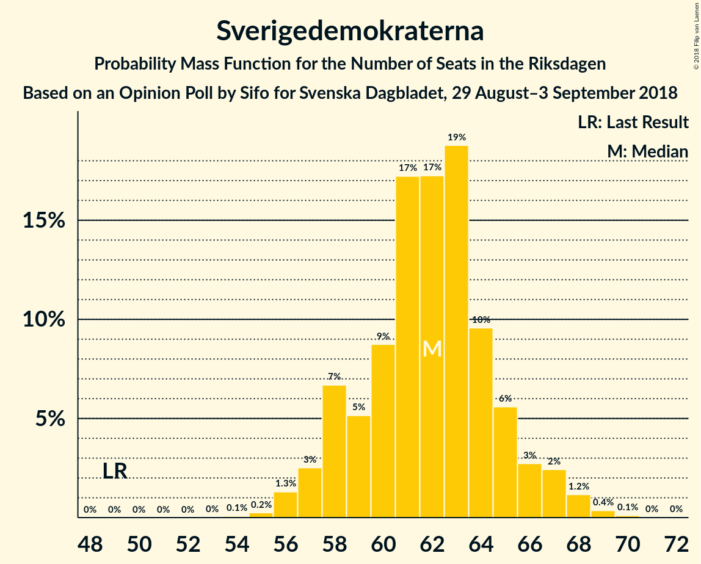

# Opinion Poll by Sifo for Svenska Dagbladet, 29 August–3 September 2018

<a href="#voting-intentions">Voting Intentions</a> | <a href="#seats">Seats</a> | <a href="#coalitions">Coalitions</a> | <a href="#technical-information">Technical Information</a>

## Voting Intentions

### Confidence Intervals

| Party | Last Result | Poll Result | 80% Confidence Interval | 90% Confidence Interval | 95% Confidence Interval | 99% Confidence Interval |
|:-----:|:-----------:|:-----------:|:-----------------------:|:-----------------------:|:-----------------------:|:-----------------------:|
| Sveriges socialdemokratiska arbetareparti | 31.0% | 25.3% | 24.3–26.4% |24.0–26.7% |23.7–26.9% |23.2–27.4% |
| Sverigedemokraterna | 12.9% | 17.2% | 16.3–18.2% |16.1–18.4% |15.9–18.6% |15.5–19.1% |
| Moderata samlingspartiet | 23.3% | 17.0% | 16.1–17.9% |15.9–18.2% |15.7–18.4% |15.3–18.9% |
| Vänsterpartiet | 5.7% | 11.1% | 10.4–11.9% |10.2–12.1% |10.0–12.3% |9.6–12.7% |
| Centerpartiet | 6.1% | 8.4% | 7.8–9.1% |7.6–9.3% |7.5–9.5% |7.2–9.8% |
| Liberalerna | 5.4% | 6.7% | 6.1–7.3% |6.0–7.5% |5.8–7.7% |5.6–8.0% |
| Kristdemokraterna | 4.6% | 6.0% | 5.5–6.6% |5.3–6.8% |5.2–6.9% |4.9–7.2% |
| Miljöpartiet de gröna | 6.9% | 5.4% | 4.9–6.0% |4.8–6.2% |4.6–6.3% |4.4–6.6% |

*Note:* The poll result column reflects the actual value used in the calculations. Published results may vary slightly, and in addition be rounded to fewer digits.

## Seats

### Confidence Intervals

| Party | Last Result | Median | 80% Confidence Interval | 90% Confidence Interval | 95% Confidence Interval | 99% Confidence Interval |
|:-----:|:-----------:|:------:|:-----------------------:|:-----------------------:|:-----------------------:|:-----------------------:|
| <a href="#sveriges-socialdemokratiska-arbetareparti">Sveriges socialdemokratiska arbetareparti</a> | 113 | 91 | 87–94 |86–96 |85–97 |84–98 |
| <a href="#sverigedemokraterna">Sverigedemokraterna</a> | 49 | 62 | 58–65 |58–66 |57–67 |56–68 |
| <a href="#moderata-samlingspartiet">Moderata samlingspartiet</a> | 84 | 61 | 58–64 |57–65 |56–66 |55–68 |
| <a href="#vänsterpartiet">Vänsterpartiet</a> | 21 | 40 | 37–42 |36–43 |36–44 |35–45 |
| <a href="#centerpartiet">Centerpartiet</a> | 22 | 30 | 28–33 |27–34 |27–34 |26–35 |
| <a href="#liberalerna">Liberalerna</a> | 19 | 24 | 22–26 |21–27 |21–28 |20–29 |
| <a href="#kristdemokraterna">Kristdemokraterna</a> | 16 | 21 | 20–24 |19–24 |19–25 |18–26 |
| <a href="#miljöpartiet-de-gröna">Miljöpartiet de gröna</a> | 25 | 19 | 18–21 |17–22 |17–23 |16–24 |

### Sveriges socialdemokratiska arbetareparti

*For a full overview of the results for this party, see the [Sveriges socialdemokratiska arbetareparti](party-sverigessocialdemokratiskaarbetareparti.html) page.*

| Number of Seats | Probability | Accumulated | Special Marks |
|:---------------:|:-----------:|:-----------:|:-------------:|
| 81 | 0% | 100% |  |
| 82 | 0.1% | 99.9% |  |
| 83 | 0.3% | 99.8% |  |
| 84 | 0.8% | 99.5% |  |
| 85 | 3% | 98.7% |  |
| 86 | 4% | 96% |  |
| 87 | 7% | 92% |  |
| 88 | 9% | 85% |  |
| 89 | 7% | 76% |  |
| 90 | 17% | 69% |  |
| 91 | 18% | 52% | Median |
| 92 | 12% | 35% |  |
| 93 | 6% | 23% |  |
| 94 | 7% | 16% |  |
| 95 | 3% | 10% |  |
| 96 | 3% | 7% |  |
| 97 | 3% | 4% |  |
| 98 | 0.5% | 0.9% |  |
| 99 | 0.2% | 0.4% |  |
| 100 | 0.1% | 0.2% |  |
| 101 | 0% | 0% |  |
| 102 | 0% | 0% |  |
| 103 | 0% | 0% |  |
| 104 | 0% | 0% |  |
| 105 | 0% | 0% |  |
| 106 | 0% | 0% |  |
| 107 | 0% | 0% |  |
| 108 | 0% | 0% |  |
| 109 | 0% | 0% |  |
| 110 | 0% | 0% |  |
| 111 | 0% | 0% |  |
| 112 | 0% | 0% |  |
| 113 | 0% | 0% | Last Result |

### Sverigedemokraterna

*For a full overview of the results for this party, see the [Sverigedemokraterna](party-sverigedemokraterna.html) page.*

| Number of Seats | Probability | Accumulated | Special Marks |
|:---------------:|:-----------:|:-----------:|:-------------:|
| 49 | 0% | 100% | Last Result |
| 50 | 0% | 100% |  |
| 51 | 0% | 100% |  |
| 52 | 0% | 100% |  |
| 53 | 0% | 100% |  |
| 54 | 0.1% | 100% |  |
| 55 | 0.2% | 99.9% |  |
| 56 | 1.3% | 99.6% |  |
| 57 | 3% | 98% |  |
| 58 | 7% | 96% |  |
| 59 | 5% | 89% |  |
| 60 | 9% | 84% |  |
| 61 | 17% | 75% |  |
| 62 | 17% | 58% | Median |
| 63 | 19% | 41% |  |
| 64 | 10% | 22% |  |
| 65 | 6% | 12% |  |
| 66 | 3% | 7% |  |
| 67 | 2% | 4% |  |
| 68 | 1.2% | 2% |  |
| 69 | 0.4% | 0.5% |  |
| 70 | 0.1% | 0.1% |  |
| 71 | 0% | 0% |  |

### Moderata samlingspartiet

*For a full overview of the results for this party, see the [Moderata samlingspartiet](party-moderatasamlingspartiet.html) page.*

| Number of Seats | Probability | Accumulated | Special Marks |
|:---------------:|:-----------:|:-----------:|:-------------:|
| 53 | 0.1% | 100% |  |
| 54 | 0.3% | 99.9% |  |
| 55 | 0.8% | 99.6% |  |
| 56 | 2% | 98.9% |  |
| 57 | 3% | 97% |  |
| 58 | 10% | 94% |  |
| 59 | 10% | 84% |  |
| 60 | 14% | 74% |  |
| 61 | 13% | 60% | Median |
| 62 | 18% | 46% |  |
| 63 | 12% | 28% |  |
| 64 | 8% | 16% |  |
| 65 | 4% | 9% |  |
| 66 | 2% | 4% |  |
| 67 | 1.3% | 2% |  |
| 68 | 0.3% | 0.5% |  |
| 69 | 0.1% | 0.2% |  |
| 70 | 0% | 0.1% |  |
| 71 | 0% | 0% |  |
| 72 | 0% | 0% |  |
| 73 | 0% | 0% |  |
| 74 | 0% | 0% |  |
| 75 | 0% | 0% |  |
| 76 | 0% | 0% |  |
| 77 | 0% | 0% |  |
| 78 | 0% | 0% |  |
| 79 | 0% | 0% |  |
| 80 | 0% | 0% |  |
| 81 | 0% | 0% |  |
| 82 | 0% | 0% |  |
| 83 | 0% | 0% |  |
| 84 | 0% | 0% | Last Result |

### Vänsterpartiet

*For a full overview of the results for this party, see the [Vänsterpartiet](party-vänsterpartiet.html) page.*

| Number of Seats | Probability | Accumulated | Special Marks |
|:---------------:|:-----------:|:-----------:|:-------------:|
| 21 | 0% | 100% | Last Result |
| 22 | 0% | 100% |  |
| 23 | 0% | 100% |  |
| 24 | 0% | 100% |  |
| 25 | 0% | 100% |  |
| 26 | 0% | 100% |  |
| 27 | 0% | 100% |  |
| 28 | 0% | 100% |  |
| 29 | 0% | 100% |  |
| 30 | 0% | 100% |  |
| 31 | 0% | 100% |  |
| 32 | 0% | 100% |  |
| 33 | 0.1% | 100% |  |
| 34 | 0.4% | 99.9% |  |
| 35 | 1.1% | 99.6% |  |
| 36 | 4% | 98.5% |  |
| 37 | 8% | 94% |  |
| 38 | 14% | 87% |  |
| 39 | 17% | 73% |  |
| 40 | 18% | 56% | Median |
| 41 | 15% | 38% |  |
| 42 | 13% | 23% |  |
| 43 | 6% | 10% |  |
| 44 | 3% | 4% |  |
| 45 | 1.0% | 1.5% |  |
| 46 | 0.3% | 0.5% |  |
| 47 | 0.1% | 0.1% |  |
| 48 | 0% | 0% |  |

### Centerpartiet

*For a full overview of the results for this party, see the [Centerpartiet](party-centerpartiet.html) page.*

| Number of Seats | Probability | Accumulated | Special Marks |
|:---------------:|:-----------:|:-----------:|:-------------:|
| 22 | 0% | 100% | Last Result |
| 23 | 0% | 100% |  |
| 24 | 0% | 100% |  |
| 25 | 0.3% | 99.9% |  |
| 26 | 2% | 99.6% |  |
| 27 | 4% | 98% |  |
| 28 | 10% | 94% |  |
| 29 | 17% | 84% |  |
| 30 | 20% | 67% | Median |
| 31 | 21% | 47% |  |
| 32 | 14% | 26% |  |
| 33 | 8% | 13% |  |
| 34 | 4% | 5% |  |
| 35 | 1.2% | 2% |  |
| 36 | 0.2% | 0.3% |  |
| 37 | 0.1% | 0.1% |  |
| 38 | 0% | 0% |  |

### Liberalerna

*For a full overview of the results for this party, see the [Liberalerna](party-liberalerna.html) page.*

| Number of Seats | Probability | Accumulated | Special Marks |
|:---------------:|:-----------:|:-----------:|:-------------:|
| 19 | 0.2% | 100% | Last Result |
| 20 | 1.4% | 99.8% |  |
| 21 | 4% | 98% |  |
| 22 | 12% | 94% |  |
| 23 | 22% | 83% |  |
| 24 | 18% | 61% | Median |
| 25 | 23% | 43% |  |
| 26 | 12% | 21% |  |
| 27 | 5% | 8% |  |
| 28 | 2% | 3% |  |
| 29 | 0.7% | 0.8% |  |
| 30 | 0.1% | 0.1% |  |
| 31 | 0% | 0% |  |

### Kristdemokraterna

*For a full overview of the results for this party, see the [Kristdemokraterna](party-kristdemokraterna.html) page.*

| Number of Seats | Probability | Accumulated | Special Marks |
|:---------------:|:-----------:|:-----------:|:-------------:|
| 16 | 0% | 100% | Last Result |
| 17 | 0.4% | 100% |  |
| 18 | 0.9% | 99.5% |  |
| 19 | 7% | 98.7% |  |
| 20 | 20% | 92% |  |
| 21 | 23% | 71% | Median |
| 22 | 21% | 48% |  |
| 23 | 12% | 27% |  |
| 24 | 10% | 15% |  |
| 25 | 4% | 5% |  |
| 26 | 0.4% | 0.6% |  |
| 27 | 0.2% | 0.2% |  |
| 28 | 0% | 0% |  |

### Miljöpartiet de gröna

*For a full overview of the results for this party, see the [Miljöpartiet de gröna](party-miljöpartietdegröna.html) page.*

| Number of Seats | Probability | Accumulated | Special Marks |
|:---------------:|:-----------:|:-----------:|:-------------:|
| 15 | 0.3% | 100% |  |
| 16 | 2% | 99.7% |  |
| 17 | 6% | 98% |  |
| 18 | 20% | 92% |  |
| 19 | 25% | 72% | Median |
| 20 | 22% | 46% |  |
| 21 | 15% | 25% |  |
| 22 | 6% | 9% |  |
| 23 | 2% | 3% |  |
| 24 | 0.5% | 0.6% |  |
| 25 | 0.1% | 0.1% | Last Result |
| 26 | 0% | 0% |  |

## Coalitions

### Confidence Intervals

| Coalition | Last Result | Median | Majority? | 80% Confidence Interval | 90% Confidence Interval | 95% Confidence Interval | 99% Confidence Interval |
|:---------:|:-----------:|:------:|:---------:|:-----------------------:|:-----------------------:|:-----------------------:|:-----------------------:|
| Sveriges socialdemokratiska arbetareparti – Moderata samlingspartiet – Centerpartiet | 219 | 182 | 98.7% | 178–187 | 177–188 | 176–189 | 174–191 |
| Sveriges socialdemokratiska arbetareparti – Moderata samlingspartiet | 197 | 152 | 0% | 148–156 | 146–157 | 145–158 | 143–160 |
| Sveriges socialdemokratiska arbetareparti – Vänsterpartiet – Miljöpartiet de gröna | 159 | 150 | 0% | 146–154 | 145–156 | 144–156 | 142–159 |
| Sverigedemokraterna – Moderata samlingspartiet – Kristdemokraterna | 149 | 145 | 0% | 141–149 | 139–150 | 138–151 | 136–153 |
| Moderata samlingspartiet – Centerpartiet – Liberalerna – Kristdemokraterna | 141 | 137 | 0% | 133–141 | 132–142 | 131–143 | 129–145 |
| Sveriges socialdemokratiska arbetareparti – Vänsterpartiet | 134 | 131 | 0% | 126–135 | 125–136 | 125–137 | 122–139 |
| Sverigedemokraterna – Moderata samlingspartiet | 133 | 123 | 0% | 119–127 | 118–128 | 117–129 | 115–131 |
| Moderata samlingspartiet – Centerpartiet – Liberalerna | 125 | 116 | 0% | 112–119 | 110–120 | 109–121 | 108–123 |
| Moderata samlingspartiet – Centerpartiet – Kristdemokraterna | 122 | 113 | 0% | 109–117 | 108–118 | 107–119 | 105–121 |
| Sveriges socialdemokratiska arbetareparti – Miljöpartiet de gröna | 138 | 110 | 0% | 106–114 | 105–116 | 104–116 | 103–118 |
| Moderata samlingspartiet – Centerpartiet | 106 | 92 | 0% | 88–95 | 87–96 | 86–97 | 84–99 |

### Sveriges socialdemokratiska arbetareparti – Moderata samlingspartiet – Centerpartiet

| Number of Seats | Probability | Accumulated | Special Marks |
|:---------------:|:-----------:|:-----------:|:-------------:|
| 171 | 0.1% | 100% |  |
| 172 | 0.1% | 99.9% |  |
| 173 | 0.2% | 99.8% |  |
| 174 | 0.8% | 99.5% |  |
| 175 | 1.1% | 98.7% | Majority |
| 176 | 2% | 98% |  |
| 177 | 3% | 95% |  |
| 178 | 8% | 92% |  |
| 179 | 6% | 85% |  |
| 180 | 11% | 78% |  |
| 181 | 11% | 67% |  |
| 182 | 10% | 56% | Median |
| 183 | 14% | 47% |  |
| 184 | 8% | 33% |  |
| 185 | 9% | 25% |  |
| 186 | 6% | 17% |  |
| 187 | 4% | 10% |  |
| 188 | 3% | 6% |  |
| 189 | 1.5% | 3% |  |
| 190 | 0.6% | 1.2% |  |
| 191 | 0.4% | 0.6% |  |
| 192 | 0.2% | 0.3% |  |
| 193 | 0.1% | 0.1% |  |
| 194 | 0% | 0% |  |
| 195 | 0% | 0% |  |
| 196 | 0% | 0% |  |
| 197 | 0% | 0% |  |
| 198 | 0% | 0% |  |
| 199 | 0% | 0% |  |
| 200 | 0% | 0% |  |
| 201 | 0% | 0% |  |
| 202 | 0% | 0% |  |
| 203 | 0% | 0% |  |
| 204 | 0% | 0% |  |
| 205 | 0% | 0% |  |
| 206 | 0% | 0% |  |
| 207 | 0% | 0% |  |
| 208 | 0% | 0% |  |
| 209 | 0% | 0% |  |
| 210 | 0% | 0% |  |
| 211 | 0% | 0% |  |
| 212 | 0% | 0% |  |
| 213 | 0% | 0% |  |
| 214 | 0% | 0% |  |
| 215 | 0% | 0% |  |
| 216 | 0% | 0% |  |
| 217 | 0% | 0% |  |
| 218 | 0% | 0% |  |
| 219 | 0% | 0% | Last Result |

### Sveriges socialdemokratiska arbetareparti – Moderata samlingspartiet

| Number of Seats | Probability | Accumulated | Special Marks |
|:---------------:|:-----------:|:-----------:|:-------------:|
| 141 | 0.1% | 100% |  |
| 142 | 0.1% | 99.9% |  |
| 143 | 0.4% | 99.8% |  |
| 144 | 0.5% | 99.4% |  |
| 145 | 2% | 98.9% |  |
| 146 | 3% | 97% |  |
| 147 | 4% | 94% |  |
| 148 | 8% | 90% |  |
| 149 | 9% | 82% |  |
| 150 | 11% | 73% |  |
| 151 | 8% | 62% |  |
| 152 | 14% | 54% | Median |
| 153 | 11% | 40% |  |
| 154 | 7% | 29% |  |
| 155 | 7% | 22% |  |
| 156 | 6% | 15% |  |
| 157 | 4% | 9% |  |
| 158 | 3% | 5% |  |
| 159 | 1.1% | 2% |  |
| 160 | 0.6% | 1.0% |  |
| 161 | 0.2% | 0.4% |  |
| 162 | 0.2% | 0.2% |  |
| 163 | 0% | 0.1% |  |
| 164 | 0% | 0% |  |
| 165 | 0% | 0% |  |
| 166 | 0% | 0% |  |
| 167 | 0% | 0% |  |
| 168 | 0% | 0% |  |
| 169 | 0% | 0% |  |
| 170 | 0% | 0% |  |
| 171 | 0% | 0% |  |
| 172 | 0% | 0% |  |
| 173 | 0% | 0% |  |
| 174 | 0% | 0% |  |
| 175 | 0% | 0% | Majority |
| 176 | 0% | 0% |  |
| 177 | 0% | 0% |  |
| 178 | 0% | 0% |  |
| 179 | 0% | 0% |  |
| 180 | 0% | 0% |  |
| 181 | 0% | 0% |  |
| 182 | 0% | 0% |  |
| 183 | 0% | 0% |  |
| 184 | 0% | 0% |  |
| 185 | 0% | 0% |  |
| 186 | 0% | 0% |  |
| 187 | 0% | 0% |  |
| 188 | 0% | 0% |  |
| 189 | 0% | 0% |  |
| 190 | 0% | 0% |  |
| 191 | 0% | 0% |  |
| 192 | 0% | 0% |  |
| 193 | 0% | 0% |  |
| 194 | 0% | 0% |  |
| 195 | 0% | 0% |  |
| 196 | 0% | 0% |  |
| 197 | 0% | 0% | Last Result |

### Sveriges socialdemokratiska arbetareparti – Vänsterpartiet – Miljöpartiet de gröna

| Number of Seats | Probability | Accumulated | Special Marks |
|:---------------:|:-----------:|:-----------:|:-------------:|
| 139 | 0.1% | 100% |  |
| 140 | 0.1% | 99.9% |  |
| 141 | 0.2% | 99.8% |  |
| 142 | 0.4% | 99.6% |  |
| 143 | 2% | 99.2% |  |
| 144 | 2% | 98% |  |
| 145 | 2% | 96% |  |
| 146 | 7% | 94% |  |
| 147 | 11% | 87% |  |
| 148 | 10% | 76% |  |
| 149 | 10% | 66% |  |
| 150 | 17% | 57% | Median |
| 151 | 12% | 39% |  |
| 152 | 9% | 28% |  |
| 153 | 4% | 19% |  |
| 154 | 5% | 15% |  |
| 155 | 4% | 10% |  |
| 156 | 3% | 6% |  |
| 157 | 0.8% | 2% |  |
| 158 | 1.0% | 2% |  |
| 159 | 0.2% | 0.5% | Last Result |
| 160 | 0.3% | 0.3% |  |
| 161 | 0% | 0.1% |  |
| 162 | 0% | 0% |  |

### Sverigedemokraterna – Moderata samlingspartiet – Kristdemokraterna

| Number of Seats | Probability | Accumulated | Special Marks |
|:---------------:|:-----------:|:-----------:|:-------------:|
| 134 | 0.1% | 100% |  |
| 135 | 0.2% | 99.9% |  |
| 136 | 0.4% | 99.7% |  |
| 137 | 0.9% | 99.4% |  |
| 138 | 2% | 98% |  |
| 139 | 3% | 96% |  |
| 140 | 3% | 94% |  |
| 141 | 7% | 91% |  |
| 142 | 8% | 84% |  |
| 143 | 11% | 75% |  |
| 144 | 13% | 64% | Median |
| 145 | 12% | 51% |  |
| 146 | 15% | 39% |  |
| 147 | 6% | 24% |  |
| 148 | 7% | 18% |  |
| 149 | 5% | 11% | Last Result |
| 150 | 3% | 6% |  |
| 151 | 2% | 3% |  |
| 152 | 0.9% | 1.5% |  |
| 153 | 0.3% | 0.5% |  |
| 154 | 0.1% | 0.3% |  |
| 155 | 0.1% | 0.1% |  |
| 156 | 0% | 0% |  |

### Moderata samlingspartiet – Centerpartiet – Liberalerna – Kristdemokraterna

| Number of Seats | Probability | Accumulated | Special Marks |
|:---------------:|:-----------:|:-----------:|:-------------:|
| 126 | 0% | 100% |  |
| 127 | 0.1% | 99.9% |  |
| 128 | 0.3% | 99.8% |  |
| 129 | 0.4% | 99.5% |  |
| 130 | 1.5% | 99.2% |  |
| 131 | 2% | 98% |  |
| 132 | 4% | 96% |  |
| 133 | 4% | 92% |  |
| 134 | 6% | 88% |  |
| 135 | 11% | 81% |  |
| 136 | 11% | 71% | Median |
| 137 | 16% | 60% |  |
| 138 | 10% | 45% |  |
| 139 | 13% | 35% |  |
| 140 | 6% | 22% |  |
| 141 | 8% | 16% | Last Result |
| 142 | 3% | 8% |  |
| 143 | 3% | 5% |  |
| 144 | 0.7% | 2% |  |
| 145 | 0.8% | 1.2% |  |
| 146 | 0.3% | 0.5% |  |
| 147 | 0.2% | 0.2% |  |
| 148 | 0% | 0.1% |  |
| 149 | 0% | 0% |  |

### Sveriges socialdemokratiska arbetareparti – Vänsterpartiet

| Number of Seats | Probability | Accumulated | Special Marks |
|:---------------:|:-----------:|:-----------:|:-------------:|
| 120 | 0.1% | 100% |  |
| 121 | 0.1% | 99.9% |  |
| 122 | 0.3% | 99.8% |  |
| 123 | 0.7% | 99.5% |  |
| 124 | 1.3% | 98.8% |  |
| 125 | 4% | 98% |  |
| 126 | 4% | 94% |  |
| 127 | 10% | 90% |  |
| 128 | 7% | 79% |  |
| 129 | 9% | 72% |  |
| 130 | 12% | 63% |  |
| 131 | 14% | 51% | Median |
| 132 | 11% | 37% |  |
| 133 | 10% | 26% |  |
| 134 | 4% | 16% | Last Result |
| 135 | 4% | 11% |  |
| 136 | 4% | 8% |  |
| 137 | 2% | 4% |  |
| 138 | 0.9% | 2% |  |
| 139 | 0.3% | 0.6% |  |
| 140 | 0.2% | 0.3% |  |
| 141 | 0.1% | 0.1% |  |
| 142 | 0.1% | 0.1% |  |
| 143 | 0% | 0% |  |

### Sverigedemokraterna – Moderata samlingspartiet

| Number of Seats | Probability | Accumulated | Special Marks |
|:---------------:|:-----------:|:-----------:|:-------------:|
| 113 | 0.1% | 100% |  |
| 114 | 0.2% | 99.9% |  |
| 115 | 0.6% | 99.6% |  |
| 116 | 0.8% | 99.0% |  |
| 117 | 2% | 98% |  |
| 118 | 4% | 96% |  |
| 119 | 4% | 92% |  |
| 120 | 10% | 88% |  |
| 121 | 13% | 78% |  |
| 122 | 9% | 65% |  |
| 123 | 7% | 56% | Median |
| 124 | 14% | 49% |  |
| 125 | 17% | 36% |  |
| 126 | 7% | 18% |  |
| 127 | 4% | 11% |  |
| 128 | 3% | 7% |  |
| 129 | 2% | 4% |  |
| 130 | 0.9% | 2% |  |
| 131 | 0.4% | 0.8% |  |
| 132 | 0.3% | 0.4% |  |
| 133 | 0.1% | 0.1% | Last Result |
| 134 | 0% | 0% |  |

### Moderata samlingspartiet – Centerpartiet – Liberalerna

| Number of Seats | Probability | Accumulated | Special Marks |
|:---------------:|:-----------:|:-----------:|:-------------:|
| 105 | 0.1% | 100% |  |
| 106 | 0.1% | 99.9% |  |
| 107 | 0.2% | 99.8% |  |
| 108 | 0.8% | 99.6% |  |
| 109 | 2% | 98.8% |  |
| 110 | 2% | 97% |  |
| 111 | 4% | 95% |  |
| 112 | 7% | 91% |  |
| 113 | 8% | 84% |  |
| 114 | 9% | 76% |  |
| 115 | 15% | 67% | Median |
| 116 | 14% | 52% |  |
| 117 | 10% | 38% |  |
| 118 | 13% | 28% |  |
| 119 | 6% | 16% |  |
| 120 | 5% | 10% |  |
| 121 | 2% | 5% |  |
| 122 | 1.2% | 2% |  |
| 123 | 0.8% | 1.3% |  |
| 124 | 0.2% | 0.4% |  |
| 125 | 0.1% | 0.2% | Last Result |
| 126 | 0.1% | 0.1% |  |
| 127 | 0% | 0% |  |

### Moderata samlingspartiet – Centerpartiet – Kristdemokraterna

| Number of Seats | Probability | Accumulated | Special Marks |
|:---------------:|:-----------:|:-----------:|:-------------:|
| 103 | 0.1% | 100% |  |
| 104 | 0.2% | 99.9% |  |
| 105 | 0.4% | 99.7% |  |
| 106 | 0.9% | 99.4% |  |
| 107 | 1.4% | 98% |  |
| 108 | 4% | 97% |  |
| 109 | 5% | 93% |  |
| 110 | 9% | 88% |  |
| 111 | 10% | 79% |  |
| 112 | 12% | 69% | Median |
| 113 | 13% | 57% |  |
| 114 | 13% | 44% |  |
| 115 | 9% | 31% |  |
| 116 | 9% | 21% |  |
| 117 | 4% | 12% |  |
| 118 | 4% | 8% |  |
| 119 | 2% | 4% |  |
| 120 | 1.0% | 2% |  |
| 121 | 0.5% | 0.9% |  |
| 122 | 0.2% | 0.4% | Last Result |
| 123 | 0.1% | 0.1% |  |
| 124 | 0% | 0% |  |

### Sveriges socialdemokratiska arbetareparti – Miljöpartiet de gröna

| Number of Seats | Probability | Accumulated | Special Marks |
|:---------------:|:-----------:|:-----------:|:-------------:|
| 100 | 0.1% | 100% |  |
| 101 | 0.1% | 99.9% |  |
| 102 | 0.3% | 99.8% |  |
| 103 | 0.9% | 99.5% |  |
| 104 | 1.5% | 98.6% |  |
| 105 | 3% | 97% |  |
| 106 | 4% | 94% |  |
| 107 | 7% | 89% |  |
| 108 | 14% | 82% |  |
| 109 | 14% | 68% |  |
| 110 | 13% | 54% | Median |
| 111 | 9% | 41% |  |
| 112 | 12% | 32% |  |
| 113 | 7% | 20% |  |
| 114 | 5% | 14% |  |
| 115 | 3% | 9% |  |
| 116 | 3% | 5% |  |
| 117 | 0.9% | 2% |  |
| 118 | 0.5% | 1.0% |  |
| 119 | 0.3% | 0.5% |  |
| 120 | 0.1% | 0.1% |  |
| 121 | 0% | 0.1% |  |
| 122 | 0% | 0% |  |
| 123 | 0% | 0% |  |
| 124 | 0% | 0% |  |
| 125 | 0% | 0% |  |
| 126 | 0% | 0% |  |
| 127 | 0% | 0% |  |
| 128 | 0% | 0% |  |
| 129 | 0% | 0% |  |
| 130 | 0% | 0% |  |
| 131 | 0% | 0% |  |
| 132 | 0% | 0% |  |
| 133 | 0% | 0% |  |
| 134 | 0% | 0% |  |
| 135 | 0% | 0% |  |
| 136 | 0% | 0% |  |
| 137 | 0% | 0% |  |
| 138 | 0% | 0% | Last Result |

### Moderata samlingspartiet – Centerpartiet

| Number of Seats | Probability | Accumulated | Special Marks |
|:---------------:|:-----------:|:-----------:|:-------------:|
| 82 | 0.1% | 100% |  |
| 83 | 0.2% | 99.9% |  |
| 84 | 0.5% | 99.7% |  |
| 85 | 0.9% | 99.2% |  |
| 86 | 2% | 98% |  |
| 87 | 6% | 96% |  |
| 88 | 5% | 91% |  |
| 89 | 13% | 86% |  |
| 90 | 10% | 73% |  |
| 91 | 13% | 63% | Median |
| 92 | 12% | 51% |  |
| 93 | 15% | 39% |  |
| 94 | 9% | 24% |  |
| 95 | 8% | 15% |  |
| 96 | 3% | 7% |  |
| 97 | 2% | 4% |  |
| 98 | 0.8% | 2% |  |
| 99 | 0.4% | 0.8% |  |
| 100 | 0.3% | 0.3% |  |
| 101 | 0.1% | 0.1% |  |
| 102 | 0% | 0% |  |
| 103 | 0% | 0% |  |
| 104 | 0% | 0% |  |
| 105 | 0% | 0% |  |
| 106 | 0% | 0% | Last Result |

## Technical Information

### Opinion Poll

+ **Polling firm:** Sifo
+ **Commissioner(s):** Svenska Dagbladet
+ **Fieldwork period:** 29 August–3 September 2018

### Calculations

+ **Sample size:** 2887
+ **Simulations done:** 1,048,576
+ **Error estimate:** 0.69%

