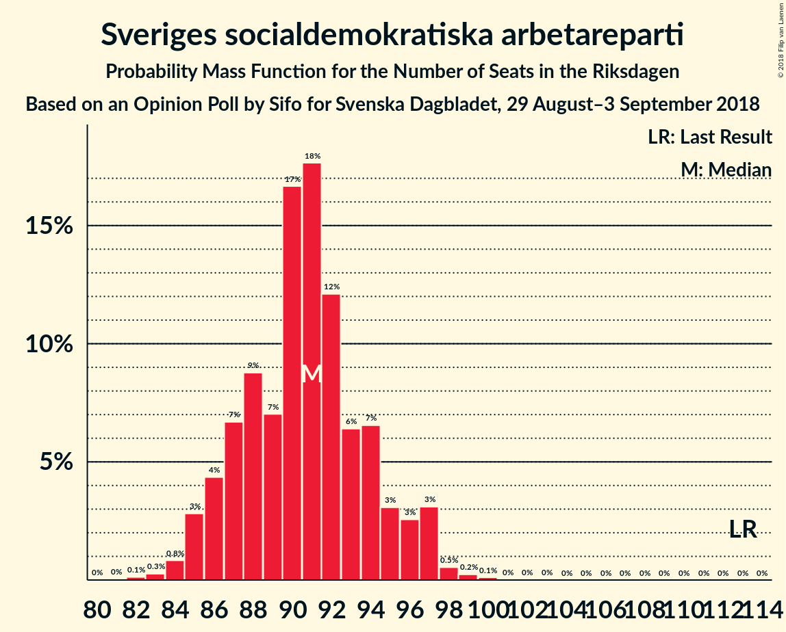
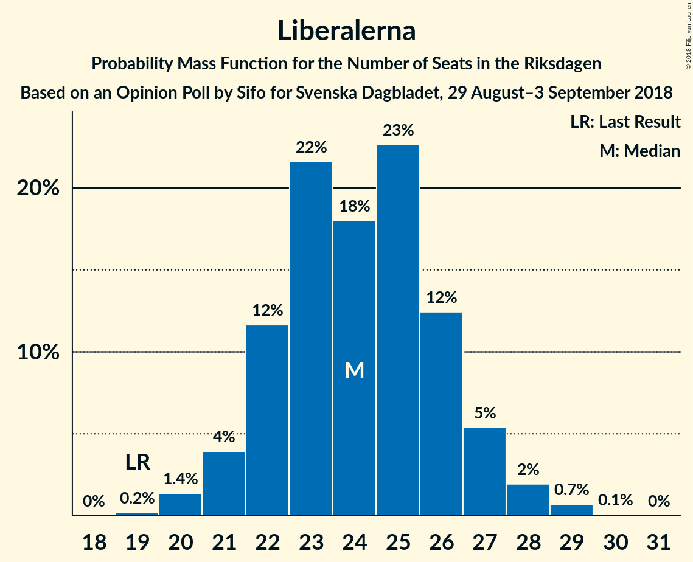
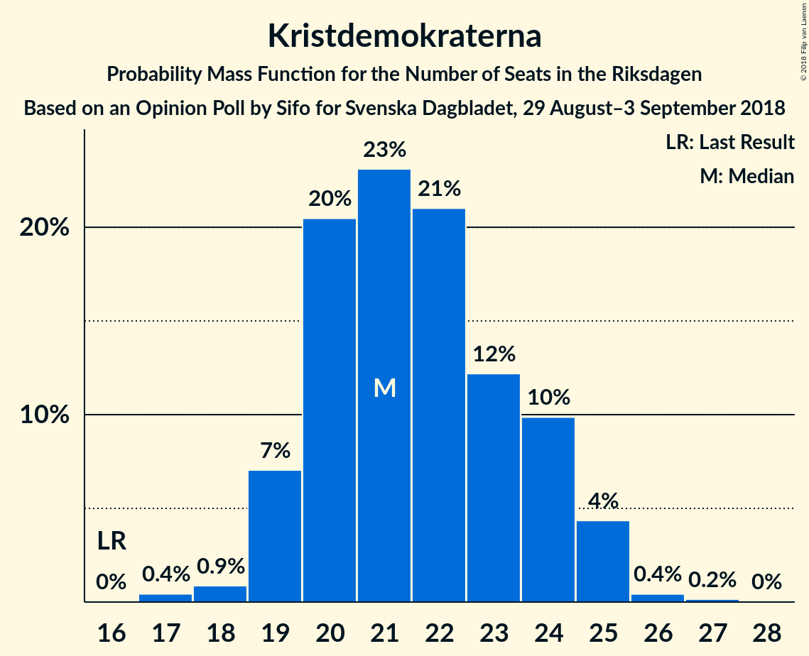

# Opinion Poll by Sifo for Svenska Dagbladet, 29 August–3 September 2018

<a href="#voting-intentions">Voting Intentions</a> | <a href="#seats">Seats</a> | <a href="#coalitions">Coalitions</a> | <a href="#technical-information">Technical Information</a>

## Voting Intentions

### Confidence Intervals

| Party | Last Result | Poll Result | 80% Confidence Interval | 90% Confidence Interval | 95% Confidence Interval | 99% Confidence Interval |
|:-----:|:-----------:|:-----------:|:-----------------------:|:-----------------------:|:-----------------------:|:-----------------------:|
| Sveriges socialdemokratiska arbetareparti | 31.0% | 25.3% | 24.3–26.4% |24.0–26.7% |23.7–26.9% |23.2–27.4% |
| Sverigedemokraterna | 12.9% | 17.2% | 16.3–18.2% |16.1–18.4% |15.9–18.6% |15.5–19.1% |
| Moderata samlingspartiet | 23.3% | 17.0% | 16.1–17.9% |15.9–18.2% |15.7–18.4% |15.3–18.9% |
| Vänsterpartiet | 5.7% | 11.1% | 10.4–11.9% |10.2–12.1% |10.0–12.3% |9.6–12.7% |
| Centerpartiet | 6.1% | 8.4% | 7.8–9.1% |7.6–9.3% |7.5–9.5% |7.2–9.8% |
| Liberalerna | 5.4% | 6.7% | 6.1–7.3% |6.0–7.5% |5.8–7.7% |5.6–8.0% |
| Kristdemokraterna | 4.6% | 6.0% | 5.5–6.6% |5.3–6.8% |5.2–6.9% |4.9–7.2% |
| Miljöpartiet de gröna | 6.9% | 5.4% | 4.9–6.0% |4.8–6.2% |4.6–6.3% |4.4–6.6% |

*Note:* The poll result column reflects the actual value used in the calculations. Published results may vary slightly, and in addition be rounded to fewer digits.

## Seats

### Confidence Intervals

| Party | Last Result | Median | 80% Confidence Interval | 90% Confidence Interval | 95% Confidence Interval | 99% Confidence Interval |
|:-----:|:-----------:|:------:|:-----------------------:|:-----------------------:|:-----------------------:|:-----------------------:|
| <a href="#sveriges-socialdemokratiska-arbetareparti">Sveriges socialdemokratiska arbetareparti</a> | 113 | 90 | 86–95 |86–97 |84–97 |83–99 |
| <a href="#sverigedemokraterna">Sverigedemokraterna</a> | 49 | 62 | 58–64 |57–66 |56–67 |56–69 |
| <a href="#moderata-samlingspartiet">Moderata samlingspartiet</a> | 84 | 62 | 59–65 |56–65 |55–66 |55–69 |
| <a href="#vänsterpartiet">Vänsterpartiet</a> | 21 | 39 | 36–42 |36–44 |35–44 |34–46 |
| <a href="#centerpartiet">Centerpartiet</a> | 22 | 30 | 28–33 |27–33 |27–34 |25–35 |
| <a href="#liberalerna">Liberalerna</a> | 19 | 25 | 23–27 |22–27 |20–28 |20–29 |
| <a href="#kristdemokraterna">Kristdemokraterna</a> | 16 | 22 | 20–24 |19–24 |19–26 |18–26 |
| <a href="#miljöpartiet-de-gröna">Miljöpartiet de gröna</a> | 25 | 20 | 17–22 |17–22 |16–22 |16–23 |

### Sveriges socialdemokratiska arbetareparti

*For a full overview of the results for this party, see the [Sveriges socialdemokratiska arbetareparti](party-sverigessocialdemokratiskaarbetareparti.html) page.*

| Number of Seats | Probability | Accumulated | Special Marks |
|:---------------:|:-----------:|:-----------:|:-------------:|
| 82 | 0.1% | 100% |  |
| 83 | 0.8% | 99.9% |  |
| 84 | 2% | 99.1% |  |
| 85 | 0.7% | 97% |  |
| 86 | 30% | 97% |  |
| 87 | 3% | 67% |  |
| 88 | 7% | 64% |  |
| 89 | 6% | 57% |  |
| 90 | 3% | 51% | Median |
| 91 | 7% | 48% |  |
| 92 | 7% | 41% |  |
| 93 | 6% | 34% |  |
| 94 | 14% | 29% |  |
| 95 | 5% | 14% |  |
| 96 | 2% | 9% |  |
| 97 | 5% | 7% |  |
| 98 | 0.2% | 2% |  |
| 99 | 1.5% | 2% |  |
| 100 | 0% | 0.1% |  |
| 101 | 0.1% | 0.1% |  |
| 102 | 0% | 0% |  |
| 103 | 0% | 0% |  |
| 104 | 0% | 0% |  |
| 105 | 0% | 0% |  |
| 106 | 0% | 0% |  |
| 107 | 0% | 0% |  |
| 108 | 0% | 0% |  |
| 109 | 0% | 0% |  |
| 110 | 0% | 0% |  |
| 111 | 0% | 0% |  |
| 112 | 0% | 0% |  |
| 113 | 0% | 0% | Last Result |

### Sverigedemokraterna

*For a full overview of the results for this party, see the [Sverigedemokraterna](party-sverigedemokraterna.html) page.*

| Number of Seats | Probability | Accumulated | Special Marks |
|:---------------:|:-----------:|:-----------:|:-------------:|
| 49 | 0% | 100% | Last Result |
| 50 | 0% | 100% |  |
| 51 | 0% | 100% |  |
| 52 | 0% | 100% |  |
| 53 | 0% | 100% |  |
| 54 | 0.1% | 100% |  |
| 55 | 0% | 99.8% |  |
| 56 | 4% | 99.8% |  |
| 57 | 1.4% | 96% |  |
| 58 | 11% | 95% |  |
| 59 | 7% | 84% |  |
| 60 | 3% | 78% |  |
| 61 | 12% | 74% |  |
| 62 | 31% | 63% | Median |
| 63 | 5% | 31% |  |
| 64 | 19% | 27% |  |
| 65 | 3% | 8% |  |
| 66 | 0.5% | 5% |  |
| 67 | 4% | 5% |  |
| 68 | 0.1% | 0.8% |  |
| 69 | 0.4% | 0.8% |  |
| 70 | 0.2% | 0.3% |  |
| 71 | 0.1% | 0.2% |  |
| 72 | 0% | 0% |  |

### Moderata samlingspartiet

*For a full overview of the results for this party, see the [Moderata samlingspartiet](party-moderatasamlingspartiet.html) page.*

| Number of Seats | Probability | Accumulated | Special Marks |
|:---------------:|:-----------:|:-----------:|:-------------:|
| 52 | 0.1% | 100% |  |
| 53 | 0.1% | 99.9% |  |
| 54 | 0.2% | 99.8% |  |
| 55 | 3% | 99.6% |  |
| 56 | 3% | 97% |  |
| 57 | 1.2% | 94% |  |
| 58 | 1.1% | 93% |  |
| 59 | 18% | 92% |  |
| 60 | 5% | 74% |  |
| 61 | 3% | 69% |  |
| 62 | 29% | 66% | Median |
| 63 | 24% | 37% |  |
| 64 | 1.4% | 13% |  |
| 65 | 8% | 12% |  |
| 66 | 2% | 4% |  |
| 67 | 0.5% | 1.4% |  |
| 68 | 0.4% | 0.9% |  |
| 69 | 0.5% | 0.5% |  |
| 70 | 0% | 0% |  |
| 71 | 0% | 0% |  |
| 72 | 0% | 0% |  |
| 73 | 0% | 0% |  |
| 74 | 0% | 0% |  |
| 75 | 0% | 0% |  |
| 76 | 0% | 0% |  |
| 77 | 0% | 0% |  |
| 78 | 0% | 0% |  |
| 79 | 0% | 0% |  |
| 80 | 0% | 0% |  |
| 81 | 0% | 0% |  |
| 82 | 0% | 0% |  |
| 83 | 0% | 0% |  |
| 84 | 0% | 0% | Last Result |

### Vänsterpartiet

*For a full overview of the results for this party, see the [Vänsterpartiet](party-vänsterpartiet.html) page.*

| Number of Seats | Probability | Accumulated | Special Marks |
|:---------------:|:-----------:|:-----------:|:-------------:|
| 21 | 0% | 100% | Last Result |
| 22 | 0% | 100% |  |
| 23 | 0% | 100% |  |
| 24 | 0% | 100% |  |
| 25 | 0% | 100% |  |
| 26 | 0% | 100% |  |
| 27 | 0% | 100% |  |
| 28 | 0% | 100% |  |
| 29 | 0% | 100% |  |
| 30 | 0% | 100% |  |
| 31 | 0% | 100% |  |
| 32 | 0% | 100% |  |
| 33 | 0% | 100% |  |
| 34 | 1.4% | 99.9% |  |
| 35 | 2% | 98.5% |  |
| 36 | 14% | 97% |  |
| 37 | 7% | 83% |  |
| 38 | 10% | 76% |  |
| 39 | 35% | 66% | Median |
| 40 | 7% | 31% |  |
| 41 | 8% | 24% |  |
| 42 | 6% | 16% |  |
| 43 | 2% | 10% |  |
| 44 | 6% | 8% |  |
| 45 | 1.1% | 2% |  |
| 46 | 0.2% | 0.6% |  |
| 47 | 0.4% | 0.4% |  |
| 48 | 0% | 0% |  |

### Centerpartiet

*For a full overview of the results for this party, see the [Centerpartiet](party-centerpartiet.html) page.*

| Number of Seats | Probability | Accumulated | Special Marks |
|:---------------:|:-----------:|:-----------:|:-------------:|
| 22 | 0% | 100% | Last Result |
| 23 | 0% | 100% |  |
| 24 | 0.1% | 100% |  |
| 25 | 1.1% | 99.9% |  |
| 26 | 0.3% | 98.8% |  |
| 27 | 3% | 98% |  |
| 28 | 13% | 95% |  |
| 29 | 8% | 82% |  |
| 30 | 44% | 75% | Median |
| 31 | 8% | 31% |  |
| 32 | 10% | 23% |  |
| 33 | 9% | 13% |  |
| 34 | 3% | 4% |  |
| 35 | 0.2% | 0.5% |  |
| 36 | 0.3% | 0.4% |  |
| 37 | 0.1% | 0.1% |  |
| 38 | 0% | 0% |  |

### Liberalerna

*For a full overview of the results for this party, see the [Liberalerna](party-liberalerna.html) page.*

| Number of Seats | Probability | Accumulated | Special Marks |
|:---------------:|:-----------:|:-----------:|:-------------:|
| 19 | 0% | 100% | Last Result |
| 20 | 2% | 99.9% |  |
| 21 | 2% | 97% |  |
| 22 | 3% | 96% |  |
| 23 | 32% | 93% |  |
| 24 | 3% | 61% |  |
| 25 | 44% | 58% | Median |
| 26 | 2% | 14% |  |
| 27 | 9% | 12% |  |
| 28 | 2% | 4% |  |
| 29 | 1.4% | 2% |  |
| 30 | 0.1% | 0.2% |  |
| 31 | 0% | 0% |  |

### Kristdemokraterna

*For a full overview of the results for this party, see the [Kristdemokraterna](party-kristdemokraterna.html) page.*

| Number of Seats | Probability | Accumulated | Special Marks |
|:---------------:|:-----------:|:-----------:|:-------------:|
| 16 | 0% | 100% | Last Result |
| 17 | 0.4% | 100% |  |
| 18 | 1.0% | 99.5% |  |
| 19 | 4% | 98% |  |
| 20 | 23% | 95% |  |
| 21 | 15% | 72% |  |
| 22 | 20% | 57% | Median |
| 23 | 5% | 37% |  |
| 24 | 28% | 32% |  |
| 25 | 1.0% | 4% |  |
| 26 | 3% | 3% |  |
| 27 | 0.3% | 0.4% |  |
| 28 | 0.1% | 0.1% |  |
| 29 | 0% | 0% |  |

### Miljöpartiet de gröna

*For a full overview of the results for this party, see the [Miljöpartiet de gröna](party-miljöpartietdegröna.html) page.*

| Number of Seats | Probability | Accumulated | Special Marks |
|:---------------:|:-----------:|:-----------:|:-------------:|
| 15 | 0% | 100% |  |
| 16 | 3% | 99.9% |  |
| 17 | 9% | 97% |  |
| 18 | 5% | 88% |  |
| 19 | 26% | 83% |  |
| 20 | 12% | 57% | Median |
| 21 | 33% | 44% |  |
| 22 | 10% | 11% |  |
| 23 | 0.7% | 0.9% |  |
| 24 | 0.2% | 0.2% |  |
| 25 | 0% | 0% | Last Result |

## Coalitions

### Confidence Intervals

| Coalition | Last Result | Median | Majority? | 80% Confidence Interval | 90% Confidence Interval | 95% Confidence Interval | 99% Confidence Interval |
|:---------:|:-----------:|:------:|:---------:|:-----------------------:|:-----------------------:|:-----------------------:|:-----------------------:|
| Sveriges socialdemokratiska arbetareparti – Moderata samlingspartiet – Centerpartiet | 219 | 182 | 98.6% | 178–187 | 177–187 | 175–187 | 172–190 |
| Sveriges socialdemokratiska arbetareparti – Moderata samlingspartiet | 197 | 151 | 0% | 147–157 | 146–157 | 146–158 | 144–161 |
| Sveriges socialdemokratiska arbetareparti – Vänsterpartiet – Miljöpartiet de gröna | 159 | 148 | 0% | 145–156 | 144–158 | 144–158 | 143–159 |
| Sverigedemokraterna – Moderata samlingspartiet – Kristdemokraterna | 149 | 147 | 0% | 139–148 | 138–148 | 138–149 | 135–152 |
| Moderata samlingspartiet – Centerpartiet – Liberalerna – Kristdemokraterna | 141 | 140 | 0% | 131–142 | 130–144 | 130–145 | 128–145 |
| Sveriges socialdemokratiska arbetareparti – Vänsterpartiet | 134 | 129 | 0% | 125–136 | 124–137 | 124–138 | 124–140 |
| Sverigedemokraterna – Moderata samlingspartiet | 133 | 124 | 0% | 118–127 | 117–127 | 117–128 | 113–131 |
| Moderata samlingspartiet – Centerpartiet – Liberalerna | 125 | 117 | 0% | 110–121 | 109–123 | 109–123 | 107–123 |
| Moderata samlingspartiet – Centerpartiet – Kristdemokraterna | 122 | 115 | 0% | 108–117 | 107–118 | 106–120 | 103–120 |
| Sveriges socialdemokratiska arbetareparti – Miljöpartiet de gröna | 138 | 109 | 0% | 106–115 | 105–119 | 104–119 | 101–119 |
| Moderata samlingspartiet – Centerpartiet | 106 | 92 | 0% | 87–96 | 86–97 | 85–98 | 84–98 |

### Sveriges socialdemokratiska arbetareparti – Moderata samlingspartiet – Centerpartiet

| Number of Seats | Probability | Accumulated | Special Marks |
|:---------------:|:-----------:|:-----------:|:-------------:|
| 169 | 0.1% | 100% |  |
| 170 | 0.1% | 99.9% |  |
| 171 | 0% | 99.9% |  |
| 172 | 0.5% | 99.9% |  |
| 173 | 0.1% | 99.4% |  |
| 174 | 0.7% | 99.3% |  |
| 175 | 2% | 98.6% | Majority |
| 176 | 0.6% | 97% |  |
| 177 | 2% | 96% |  |
| 178 | 31% | 94% |  |
| 179 | 0.9% | 63% |  |
| 180 | 6% | 62% |  |
| 181 | 2% | 56% |  |
| 182 | 7% | 54% | Median |
| 183 | 3% | 47% |  |
| 184 | 13% | 44% |  |
| 185 | 7% | 31% |  |
| 186 | 1.4% | 24% |  |
| 187 | 21% | 23% |  |
| 188 | 0.8% | 2% |  |
| 189 | 0% | 0.8% |  |
| 190 | 0.4% | 0.8% |  |
| 191 | 0.2% | 0.4% |  |
| 192 | 0% | 0.1% |  |
| 193 | 0% | 0.1% |  |
| 194 | 0% | 0.1% |  |
| 195 | 0% | 0% |  |
| 196 | 0% | 0% |  |
| 197 | 0% | 0% |  |
| 198 | 0% | 0% |  |
| 199 | 0% | 0% |  |
| 200 | 0% | 0% |  |
| 201 | 0% | 0% |  |
| 202 | 0% | 0% |  |
| 203 | 0% | 0% |  |
| 204 | 0% | 0% |  |
| 205 | 0% | 0% |  |
| 206 | 0% | 0% |  |
| 207 | 0% | 0% |  |
| 208 | 0% | 0% |  |
| 209 | 0% | 0% |  |
| 210 | 0% | 0% |  |
| 211 | 0% | 0% |  |
| 212 | 0% | 0% |  |
| 213 | 0% | 0% |  |
| 214 | 0% | 0% |  |
| 215 | 0% | 0% |  |
| 216 | 0% | 0% |  |
| 217 | 0% | 0% |  |
| 218 | 0% | 0% |  |
| 219 | 0% | 0% | Last Result |

### Sveriges socialdemokratiska arbetareparti – Moderata samlingspartiet

| Number of Seats | Probability | Accumulated | Special Marks |
|:---------------:|:-----------:|:-----------:|:-------------:|
| 141 | 0% | 100% |  |
| 142 | 0.2% | 99.9% |  |
| 143 | 0% | 99.7% |  |
| 144 | 0.3% | 99.7% |  |
| 145 | 2% | 99.4% |  |
| 146 | 4% | 98% |  |
| 147 | 6% | 94% |  |
| 148 | 27% | 87% |  |
| 149 | 6% | 60% |  |
| 150 | 0.8% | 54% |  |
| 151 | 4% | 53% |  |
| 152 | 7% | 49% | Median |
| 153 | 5% | 42% |  |
| 154 | 2% | 37% |  |
| 155 | 4% | 35% |  |
| 156 | 7% | 31% |  |
| 157 | 19% | 24% |  |
| 158 | 3% | 5% |  |
| 159 | 0.6% | 2% |  |
| 160 | 0.3% | 1.0% |  |
| 161 | 0.4% | 0.6% |  |
| 162 | 0.2% | 0.3% |  |
| 163 | 0.1% | 0.1% |  |
| 164 | 0% | 0% |  |
| 165 | 0% | 0% |  |
| 166 | 0% | 0% |  |
| 167 | 0% | 0% |  |
| 168 | 0% | 0% |  |
| 169 | 0% | 0% |  |
| 170 | 0% | 0% |  |
| 171 | 0% | 0% |  |
| 172 | 0% | 0% |  |
| 173 | 0% | 0% |  |
| 174 | 0% | 0% |  |
| 175 | 0% | 0% | Majority |
| 176 | 0% | 0% |  |
| 177 | 0% | 0% |  |
| 178 | 0% | 0% |  |
| 179 | 0% | 0% |  |
| 180 | 0% | 0% |  |
| 181 | 0% | 0% |  |
| 182 | 0% | 0% |  |
| 183 | 0% | 0% |  |
| 184 | 0% | 0% |  |
| 185 | 0% | 0% |  |
| 186 | 0% | 0% |  |
| 187 | 0% | 0% |  |
| 188 | 0% | 0% |  |
| 189 | 0% | 0% |  |
| 190 | 0% | 0% |  |
| 191 | 0% | 0% |  |
| 192 | 0% | 0% |  |
| 193 | 0% | 0% |  |
| 194 | 0% | 0% |  |
| 195 | 0% | 0% |  |
| 196 | 0% | 0% |  |
| 197 | 0% | 0% | Last Result |

### Sveriges socialdemokratiska arbetareparti – Vänsterpartiet – Miljöpartiet de gröna

| Number of Seats | Probability | Accumulated | Special Marks |
|:---------------:|:-----------:|:-----------:|:-------------:|
| 137 | 0.1% | 100% |  |
| 138 | 0% | 99.9% |  |
| 139 | 0% | 99.8% |  |
| 140 | 0% | 99.8% |  |
| 141 | 0% | 99.8% |  |
| 142 | 0.1% | 99.8% |  |
| 143 | 0.3% | 99.7% |  |
| 144 | 5% | 99.4% |  |
| 145 | 7% | 95% |  |
| 146 | 29% | 88% |  |
| 147 | 4% | 59% |  |
| 148 | 5% | 55% |  |
| 149 | 16% | 50% | Median |
| 150 | 9% | 34% |  |
| 151 | 4% | 25% |  |
| 152 | 2% | 21% |  |
| 153 | 0.5% | 19% |  |
| 154 | 3% | 18% |  |
| 155 | 0.4% | 16% |  |
| 156 | 7% | 15% |  |
| 157 | 0.7% | 8% |  |
| 158 | 7% | 8% |  |
| 159 | 0.5% | 0.6% | Last Result |
| 160 | 0.1% | 0.2% |  |
| 161 | 0.1% | 0.1% |  |
| 162 | 0% | 0% |  |

### Sverigedemokraterna – Moderata samlingspartiet – Kristdemokraterna

| Number of Seats | Probability | Accumulated | Special Marks |
|:---------------:|:-----------:|:-----------:|:-------------:|
| 133 | 0.1% | 100% |  |
| 134 | 0.1% | 99.9% |  |
| 135 | 0.8% | 99.8% |  |
| 136 | 1.2% | 99.1% |  |
| 137 | 0.3% | 98% |  |
| 138 | 8% | 98% |  |
| 139 | 1.1% | 90% |  |
| 140 | 6% | 89% |  |
| 141 | 3% | 83% |  |
| 142 | 2% | 80% |  |
| 143 | 1.2% | 78% |  |
| 144 | 5% | 77% |  |
| 145 | 11% | 71% |  |
| 146 | 8% | 60% | Median |
| 147 | 16% | 52% |  |
| 148 | 33% | 36% |  |
| 149 | 1.2% | 3% | Last Result |
| 150 | 0.6% | 2% |  |
| 151 | 0.9% | 2% |  |
| 152 | 0.4% | 0.7% |  |
| 153 | 0% | 0.3% |  |
| 154 | 0.1% | 0.3% |  |
| 155 | 0.2% | 0.2% |  |
| 156 | 0% | 0% |  |

### Moderata samlingspartiet – Centerpartiet – Liberalerna – Kristdemokraterna

| Number of Seats | Probability | Accumulated | Special Marks |
|:---------------:|:-----------:|:-----------:|:-------------:|
| 127 | 0.2% | 100% |  |
| 128 | 0.4% | 99.8% |  |
| 129 | 0.5% | 99.3% |  |
| 130 | 7% | 98.9% |  |
| 131 | 3% | 92% |  |
| 132 | 1.5% | 89% |  |
| 133 | 2% | 88% |  |
| 134 | 1.3% | 86% |  |
| 135 | 8% | 85% |  |
| 136 | 17% | 77% |  |
| 137 | 6% | 60% |  |
| 138 | 1.4% | 54% |  |
| 139 | 1.2% | 53% | Median |
| 140 | 11% | 52% |  |
| 141 | 29% | 40% | Last Result |
| 142 | 2% | 11% |  |
| 143 | 0.5% | 10% |  |
| 144 | 5% | 9% |  |
| 145 | 3% | 4% |  |
| 146 | 0.4% | 0.4% |  |
| 147 | 0.1% | 0.1% |  |
| 148 | 0% | 0% |  |

### Sveriges socialdemokratiska arbetareparti – Vänsterpartiet

| Number of Seats | Probability | Accumulated | Special Marks |
|:---------------:|:-----------:|:-----------:|:-------------:|
| 119 | 0.1% | 100% |  |
| 120 | 0% | 99.9% |  |
| 121 | 0.1% | 99.8% |  |
| 122 | 0.1% | 99.8% |  |
| 123 | 0.1% | 99.6% |  |
| 124 | 5% | 99.5% |  |
| 125 | 26% | 95% |  |
| 126 | 7% | 69% |  |
| 127 | 2% | 62% |  |
| 128 | 3% | 60% |  |
| 129 | 12% | 58% | Median |
| 130 | 15% | 45% |  |
| 131 | 5% | 30% |  |
| 132 | 4% | 26% |  |
| 133 | 2% | 22% |  |
| 134 | 5% | 20% | Last Result |
| 135 | 0.4% | 15% |  |
| 136 | 6% | 14% |  |
| 137 | 5% | 8% |  |
| 138 | 0.9% | 3% |  |
| 139 | 0.2% | 2% |  |
| 140 | 1.4% | 2% |  |
| 141 | 0.3% | 0.3% |  |
| 142 | 0% | 0.1% |  |
| 143 | 0% | 0% |  |

### Sverigedemokraterna – Moderata samlingspartiet

| Number of Seats | Probability | Accumulated | Special Marks |
|:---------------:|:-----------:|:-----------:|:-------------:|
| 113 | 0.9% | 100% |  |
| 114 | 0% | 99.1% |  |
| 115 | 0.1% | 99.1% |  |
| 116 | 1.2% | 99.0% |  |
| 117 | 7% | 98% |  |
| 118 | 2% | 91% |  |
| 119 | 4% | 89% |  |
| 120 | 7% | 85% |  |
| 121 | 6% | 78% |  |
| 122 | 3% | 72% |  |
| 123 | 5% | 69% |  |
| 124 | 38% | 64% | Median |
| 125 | 3% | 26% |  |
| 126 | 4% | 23% |  |
| 127 | 15% | 19% |  |
| 128 | 2% | 3% |  |
| 129 | 0.5% | 2% |  |
| 130 | 0.4% | 1.2% |  |
| 131 | 0.6% | 0.8% |  |
| 132 | 0.1% | 0.2% |  |
| 133 | 0% | 0% | Last Result |

### Moderata samlingspartiet – Centerpartiet – Liberalerna

| Number of Seats | Probability | Accumulated | Special Marks |
|:---------------:|:-----------:|:-----------:|:-------------:|
| 106 | 0% | 100% |  |
| 107 | 0.5% | 99.9% |  |
| 108 | 0.7% | 99.4% |  |
| 109 | 4% | 98.7% |  |
| 110 | 5% | 94% |  |
| 111 | 0.7% | 89% |  |
| 112 | 2% | 88% |  |
| 113 | 2% | 87% |  |
| 114 | 9% | 84% |  |
| 115 | 8% | 75% |  |
| 116 | 16% | 66% |  |
| 117 | 28% | 50% | Median |
| 118 | 8% | 22% |  |
| 119 | 0.3% | 14% |  |
| 120 | 3% | 14% |  |
| 121 | 2% | 11% |  |
| 122 | 1.2% | 9% |  |
| 123 | 7% | 7% |  |
| 124 | 0.1% | 0.2% |  |
| 125 | 0.1% | 0.1% | Last Result |
| 126 | 0% | 0% |  |

### Moderata samlingspartiet – Centerpartiet – Kristdemokraterna

| Number of Seats | Probability | Accumulated | Special Marks |
|:---------------:|:-----------:|:-----------:|:-------------:|
| 101 | 0.1% | 100% |  |
| 102 | 0% | 99.9% |  |
| 103 | 0.6% | 99.9% |  |
| 104 | 0.2% | 99.3% |  |
| 105 | 0.2% | 99.1% |  |
| 106 | 2% | 98.9% |  |
| 107 | 5% | 97% |  |
| 108 | 3% | 92% |  |
| 109 | 2% | 89% |  |
| 110 | 3% | 86% |  |
| 111 | 3% | 84% |  |
| 112 | 8% | 80% |  |
| 113 | 16% | 72% |  |
| 114 | 4% | 56% | Median |
| 115 | 10% | 52% |  |
| 116 | 30% | 42% |  |
| 117 | 7% | 12% |  |
| 118 | 1.2% | 5% |  |
| 119 | 0.9% | 4% |  |
| 120 | 3% | 3% |  |
| 121 | 0.2% | 0.4% |  |
| 122 | 0.2% | 0.2% | Last Result |
| 123 | 0% | 0% |  |

### Sveriges socialdemokratiska arbetareparti – Miljöpartiet de gröna

| Number of Seats | Probability | Accumulated | Special Marks |
|:---------------:|:-----------:|:-----------:|:-------------:|
| 101 | 0.8% | 100% |  |
| 102 | 0% | 99.2% |  |
| 103 | 2% | 99.1% |  |
| 104 | 0.3% | 98% |  |
| 105 | 4% | 97% |  |
| 106 | 9% | 94% |  |
| 107 | 31% | 85% |  |
| 108 | 3% | 54% |  |
| 109 | 2% | 51% |  |
| 110 | 1.0% | 49% | Median |
| 111 | 3% | 48% |  |
| 112 | 11% | 44% |  |
| 113 | 22% | 34% |  |
| 114 | 1.2% | 12% |  |
| 115 | 2% | 10% |  |
| 116 | 0.4% | 8% |  |
| 117 | 2% | 8% |  |
| 118 | 0.2% | 5% |  |
| 119 | 5% | 5% |  |
| 120 | 0.1% | 0.2% |  |
| 121 | 0.1% | 0.1% |  |
| 122 | 0% | 0% |  |
| 123 | 0% | 0% |  |
| 124 | 0% | 0% |  |
| 125 | 0% | 0% |  |
| 126 | 0% | 0% |  |
| 127 | 0% | 0% |  |
| 128 | 0% | 0% |  |
| 129 | 0% | 0% |  |
| 130 | 0% | 0% |  |
| 131 | 0% | 0% |  |
| 132 | 0% | 0% |  |
| 133 | 0% | 0% |  |
| 134 | 0% | 0% |  |
| 135 | 0% | 0% |  |
| 136 | 0% | 0% |  |
| 137 | 0% | 0% |  |
| 138 | 0% | 0% | Last Result |

### Moderata samlingspartiet – Centerpartiet

| Number of Seats | Probability | Accumulated | Special Marks |
|:---------------:|:-----------:|:-----------:|:-------------:|
| 82 | 0.4% | 100% |  |
| 83 | 0% | 99.5% |  |
| 84 | 0.4% | 99.5% |  |
| 85 | 2% | 99.1% |  |
| 86 | 3% | 97% |  |
| 87 | 6% | 95% |  |
| 88 | 3% | 88% |  |
| 89 | 4% | 86% |  |
| 90 | 6% | 81% |  |
| 91 | 8% | 76% |  |
| 92 | 33% | 68% | Median |
| 93 | 20% | 36% |  |
| 94 | 3% | 15% |  |
| 95 | 1.2% | 12% |  |
| 96 | 5% | 11% |  |
| 97 | 2% | 5% |  |
| 98 | 3% | 4% |  |
| 99 | 0.4% | 0.5% |  |
| 100 | 0% | 0.1% |  |
| 101 | 0% | 0% |  |
| 102 | 0% | 0% |  |
| 103 | 0% | 0% |  |
| 104 | 0% | 0% |  |
| 105 | 0% | 0% |  |
| 106 | 0% | 0% | Last Result |

## Technical Information

### Opinion Poll

+ **Polling firm:** Sifo
+ **Commissioner(s):** Svenska Dagbladet
+ **Fieldwork period:** 29 August–3 September 2018

### Calculations

+ **Sample size:** 2887
+ **Simulations done:** 32,768
+ **Error estimate:** 2.27%

