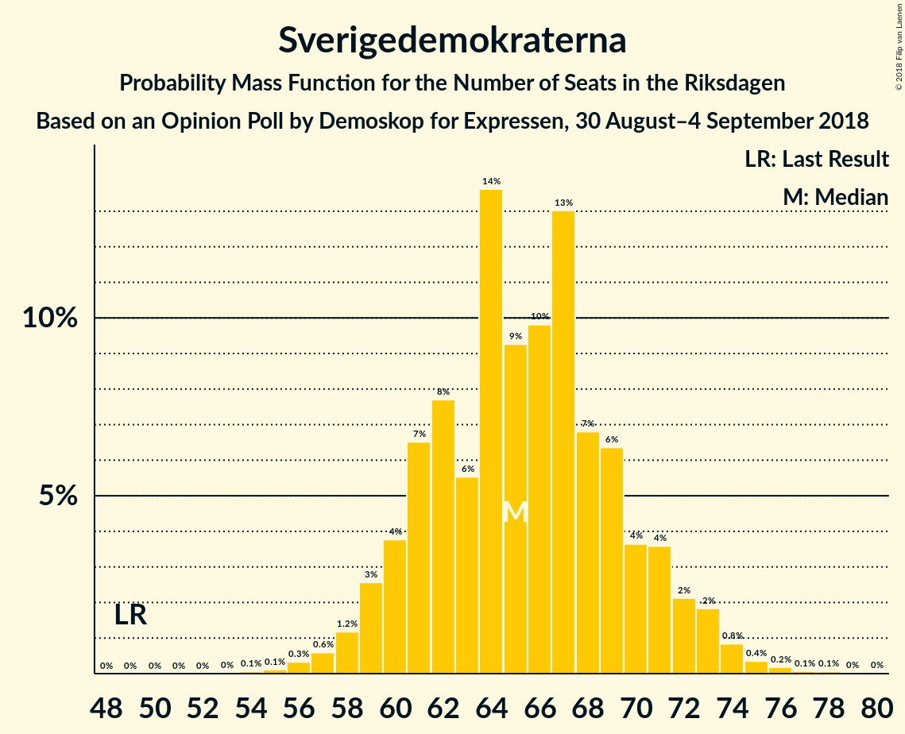

# Opinion Poll by Demoskop for Expressen, 30 August–4 September 2018

<a href="#voting-intentions">Voting Intentions</a> | <a href="#seats">Seats</a> | <a href="#coalitions">Coalitions</a> | <a href="#technical-information">Technical Information</a>

## Voting Intentions

### Confidence Intervals

| Party | Last Result | Poll Result | 80% Confidence Interval | 90% Confidence Interval | 95% Confidence Interval | 99% Confidence Interval |
|:-----:|:-----------:|:-----------:|:-----------------------:|:-----------------------:|:-----------------------:|:-----------------------:|
| Sveriges socialdemokratiska arbetareparti | 31.0% | 25.5% | 24.1–26.9% |23.7–27.3% |23.4–27.7% |22.8–28.4% |
| Sverigedemokraterna | 12.9% | 18.2% | 17.0–19.5% |16.6–19.8% |16.4–20.1% |15.8–20.8% |
| Moderata samlingspartiet | 23.3% | 17.8% | 16.6–19.1% |16.3–19.4% |16.0–19.8% |15.5–20.4% |
| Vänsterpartiet | 5.7% | 9.4% | 8.6–10.4% |8.3–10.7% |8.1–11.0% |7.7–11.5% |
| Centerpartiet | 6.1% | 8.9% | 8.0–9.8% |7.8–10.1% |7.6–10.4% |7.2–10.9% |
| Liberalerna | 5.4% | 6.2% | 5.5–7.0% |5.3–7.3% |5.1–7.5% |4.8–7.9% |
| Kristdemokraterna | 4.6% | 5.9% | 5.2–6.7% |5.0–7.0% |4.8–7.2% |4.5–7.6% |
| Miljöpartiet de gröna | 6.9% | 4.8% | 4.2–5.5% |4.0–5.7% |3.8–5.9% |3.6–6.3% |

*Note:* The poll result column reflects the actual value used in the calculations. Published results may vary slightly, and in addition be rounded to fewer digits.

## Seats

### Confidence Intervals

| Party | Last Result | Median | 80% Confidence Interval | 90% Confidence Interval | 95% Confidence Interval | 99% Confidence Interval |
|:-----:|:-----------:|:------:|:-----------------------:|:-----------------------:|:-----------------------:|:-----------------------:|
| <a href="#sveriges-socialdemokratiska-arbetareparti">Sveriges socialdemokratiska arbetareparti</a> | 113 | 94 | 83–94 |83–94 |80–94 |80–96 |
| <a href="#sverigedemokraterna">Sverigedemokraterna</a> | 49 | 61 | 61–65 |61–67 |61–68 |58–73 |
| <a href="#moderata-samlingspartiet">Moderata samlingspartiet</a> | 84 | 68 | 60–68 |60–68 |60–68 |59–69 |
| <a href="#vänsterpartiet">Vänsterpartiet</a> | 21 | 30 | 30–33 |30–35 |30–42 |28–45 |
| <a href="#centerpartiet">Centerpartiet</a> | 22 | 29 | 29–32 |29–35 |29–39 |29–39 |
| <a href="#liberalerna">Liberalerna</a> | 19 | 24 | 18–24 |18–26 |18–26 |15–28 |
| <a href="#kristdemokraterna">Kristdemokraterna</a> | 16 | 26 | 22–26 |22–26 |18–26 |18–27 |
| <a href="#miljöpartiet-de-gröna">Miljöpartiet de gröna</a> | 25 | 17 | 17–19 |17–19 |15–19 |0–20 |

### Sveriges socialdemokratiska arbetareparti

*For a full overview of the results for this party, see the [Sveriges socialdemokratiska arbetareparti](party-sverigessocialdemokratiskaarbetareparti.html) page.*

| Number of Seats | Probability | Accumulated | Special Marks |
|:---------------:|:-----------:|:-----------:|:-------------:|
| 78 | 0.1% | 100% |  |
| 79 | 0% | 99.9% |  |
| 80 | 3% | 99.9% |  |
| 81 | 0% | 96% |  |
| 82 | 1.2% | 96% |  |
| 83 | 11% | 95% |  |
| 84 | 0.6% | 85% |  |
| 85 | 0% | 84% |  |
| 86 | 0% | 84% |  |
| 87 | 0% | 84% |  |
| 88 | 0% | 84% |  |
| 89 | 3% | 84% |  |
| 90 | 0% | 81% |  |
| 91 | 0% | 81% |  |
| 92 | 0% | 81% |  |
| 93 | 0% | 81% |  |
| 94 | 80% | 81% | Median |
| 95 | 0% | 0.8% |  |
| 96 | 0.4% | 0.8% |  |
| 97 | 0% | 0.4% |  |
| 98 | 0.3% | 0.4% |  |
| 99 | 0% | 0.1% |  |
| 100 | 0% | 0.1% |  |
| 101 | 0% | 0% |  |
| 102 | 0% | 0% |  |
| 103 | 0% | 0% |  |
| 104 | 0% | 0% |  |
| 105 | 0% | 0% |  |
| 106 | 0% | 0% |  |
| 107 | 0% | 0% |  |
| 108 | 0% | 0% |  |
| 109 | 0% | 0% |  |
| 110 | 0% | 0% |  |
| 111 | 0% | 0% |  |
| 112 | 0% | 0% |  |
| 113 | 0% | 0% | Last Result |

### Sverigedemokraterna

*For a full overview of the results for this party, see the [Sverigedemokraterna](party-sverigedemokraterna.html) page.*

| Number of Seats | Probability | Accumulated | Special Marks |
|:---------------:|:-----------:|:-----------:|:-------------:|
| 49 | 0% | 100% | Last Result |
| 50 | 0% | 100% |  |
| 51 | 0% | 100% |  |
| 52 | 0% | 100% |  |
| 53 | 0% | 100% |  |
| 54 | 0% | 100% |  |
| 55 | 0% | 100% |  |
| 56 | 0.1% | 100% |  |
| 57 | 0% | 99.9% |  |
| 58 | 2% | 99.9% |  |
| 59 | 0% | 98% |  |
| 60 | 0% | 98% |  |
| 61 | 80% | 98% | Median |
| 62 | 0% | 18% |  |
| 63 | 0% | 18% |  |
| 64 | 0.1% | 18% |  |
| 65 | 11% | 18% |  |
| 66 | 0.6% | 7% |  |
| 67 | 3% | 6% |  |
| 68 | 1.3% | 3% |  |
| 69 | 1.3% | 2% |  |
| 70 | 0% | 0.9% |  |
| 71 | 0% | 0.9% |  |
| 72 | 0.4% | 0.9% |  |
| 73 | 0.2% | 0.5% |  |
| 74 | 0% | 0.3% |  |
| 75 | 0% | 0.3% |  |
| 76 | 0% | 0.3% |  |
| 77 | 0.3% | 0.3% |  |
| 78 | 0% | 0% |  |

### Moderata samlingspartiet

*For a full overview of the results for this party, see the [Moderata samlingspartiet](party-moderatasamlingspartiet.html) page.*

| Number of Seats | Probability | Accumulated | Special Marks |
|:---------------:|:-----------:|:-----------:|:-------------:|
| 55 | 0% | 100% |  |
| 56 | 0% | 99.9% |  |
| 57 | 0% | 99.9% |  |
| 58 | 0.4% | 99.9% |  |
| 59 | 0% | 99.5% |  |
| 60 | 11% | 99.5% |  |
| 61 | 0.3% | 88% |  |
| 62 | 2% | 88% |  |
| 63 | 0% | 86% |  |
| 64 | 0% | 86% |  |
| 65 | 3% | 86% |  |
| 66 | 0% | 83% |  |
| 67 | 1.2% | 83% |  |
| 68 | 80% | 82% | Median |
| 69 | 1.2% | 2% |  |
| 70 | 0.2% | 0.3% |  |
| 71 | 0% | 0.1% |  |
| 72 | 0% | 0% |  |
| 73 | 0% | 0% |  |
| 74 | 0% | 0% |  |
| 75 | 0% | 0% |  |
| 76 | 0% | 0% |  |
| 77 | 0% | 0% |  |
| 78 | 0% | 0% |  |
| 79 | 0% | 0% |  |
| 80 | 0% | 0% |  |
| 81 | 0% | 0% |  |
| 82 | 0% | 0% |  |
| 83 | 0% | 0% |  |
| 84 | 0% | 0% | Last Result |

### Vänsterpartiet

*For a full overview of the results for this party, see the [Vänsterpartiet](party-vänsterpartiet.html) page.*

| Number of Seats | Probability | Accumulated | Special Marks |
|:---------------:|:-----------:|:-----------:|:-------------:|
| 21 | 0% | 100% | Last Result |
| 22 | 0% | 100% |  |
| 23 | 0% | 100% |  |
| 24 | 0% | 100% |  |
| 25 | 0% | 100% |  |
| 26 | 0.4% | 100% |  |
| 27 | 0% | 99.6% |  |
| 28 | 0.2% | 99.5% |  |
| 29 | 0% | 99.3% |  |
| 30 | 80% | 99.3% | Median |
| 31 | 0% | 19% |  |
| 32 | 1.2% | 19% |  |
| 33 | 12% | 18% |  |
| 34 | 0% | 6% |  |
| 35 | 3% | 6% |  |
| 36 | 0.1% | 3% |  |
| 37 | 0% | 3% |  |
| 38 | 0% | 3% |  |
| 39 | 0.3% | 3% |  |
| 40 | 0% | 3% |  |
| 41 | 0% | 3% |  |
| 42 | 0.4% | 3% |  |
| 43 | 2% | 2% |  |
| 44 | 0% | 0.6% |  |
| 45 | 0.6% | 0.6% |  |
| 46 | 0% | 0% |  |

### Centerpartiet

*For a full overview of the results for this party, see the [Centerpartiet](party-centerpartiet.html) page.*

| Number of Seats | Probability | Accumulated | Special Marks |
|:---------------:|:-----------:|:-----------:|:-------------:|
| 22 | 0% | 100% | Last Result |
| 23 | 0% | 100% |  |
| 24 | 0% | 100% |  |
| 25 | 0% | 100% |  |
| 26 | 0.1% | 100% |  |
| 27 | 0% | 99.9% |  |
| 28 | 0.3% | 99.9% |  |
| 29 | 80% | 99.6% | Median |
| 30 | 0.2% | 20% |  |
| 31 | 0% | 20% |  |
| 32 | 14% | 20% |  |
| 33 | 0% | 6% |  |
| 34 | 0.3% | 6% |  |
| 35 | 1.1% | 5% |  |
| 36 | 0% | 4% |  |
| 37 | 1.2% | 4% |  |
| 38 | 0% | 3% |  |
| 39 | 3% | 3% |  |
| 40 | 0% | 0% |  |

### Liberalerna

*For a full overview of the results for this party, see the [Liberalerna](party-liberalerna.html) page.*

| Number of Seats | Probability | Accumulated | Special Marks |
|:---------------:|:-----------:|:-----------:|:-------------:|
| 15 | 1.2% | 100% |  |
| 16 | 0% | 98.8% |  |
| 17 | 0% | 98.8% |  |
| 18 | 11% | 98.8% |  |
| 19 | 0.6% | 88% | Last Result |
| 20 | 0% | 87% |  |
| 21 | 0.1% | 87% |  |
| 22 | 1.2% | 87% |  |
| 23 | 0.2% | 86% |  |
| 24 | 80% | 85% | Median |
| 25 | 0.5% | 6% |  |
| 26 | 3% | 5% |  |
| 27 | 0.3% | 2% |  |
| 28 | 2% | 2% |  |
| 29 | 0% | 0% |  |

### Kristdemokraterna

*For a full overview of the results for this party, see the [Kristdemokraterna](party-kristdemokraterna.html) page.*

| Number of Seats | Probability | Accumulated | Special Marks |
|:---------------:|:-----------:|:-----------:|:-------------:|
| 16 | 0% | 100% | Last Result |
| 17 | 0% | 100% |  |
| 18 | 3% | 100% |  |
| 19 | 0.3% | 97% |  |
| 20 | 0% | 97% |  |
| 21 | 0.2% | 97% |  |
| 22 | 14% | 96% |  |
| 23 | 0.6% | 83% |  |
| 24 | 0.6% | 82% |  |
| 25 | 0% | 82% |  |
| 26 | 81% | 82% | Median |
| 27 | 0.4% | 0.6% |  |
| 28 | 0% | 0.2% |  |
| 29 | 0.2% | 0.2% |  |
| 30 | 0% | 0% |  |

### Miljöpartiet de gröna

*For a full overview of the results for this party, see the [Miljöpartiet de gröna](party-miljöpartietdegröna.html) page.*

| Number of Seats | Probability | Accumulated | Special Marks |
|:---------------:|:-----------:|:-----------:|:-------------:|
| 0 | 0.7% | 100% |  |
| 1 | 0% | 99.3% |  |
| 2 | 0% | 99.3% |  |
| 3 | 0% | 99.3% |  |
| 4 | 0% | 99.3% |  |
| 5 | 0% | 99.3% |  |
| 6 | 0% | 99.3% |  |
| 7 | 0% | 99.3% |  |
| 8 | 0% | 99.3% |  |
| 9 | 0% | 99.3% |  |
| 10 | 0% | 99.3% |  |
| 11 | 0% | 99.3% |  |
| 12 | 0% | 99.3% |  |
| 13 | 0% | 99.3% |  |
| 14 | 0% | 99.3% |  |
| 15 | 2% | 99.3% |  |
| 16 | 0% | 97% |  |
| 17 | 82% | 97% | Median |
| 18 | 1.3% | 16% |  |
| 19 | 14% | 14% |  |
| 20 | 0.5% | 0.6% |  |
| 21 | 0.1% | 0.1% |  |
| 22 | 0% | 0.1% |  |
| 23 | 0% | 0% |  |
| 24 | 0% | 0% |  |
| 25 | 0% | 0% | Last Result |

## Coalitions

### Confidence Intervals

| Coalition | Last Result | Median | Majority? | 80% Confidence Interval | 90% Confidence Interval | 95% Confidence Interval | 99% Confidence Interval |
|:---------:|:-----------:|:------:|:---------:|:-----------------------:|:-----------------------:|:-----------------------:|:-----------------------:|
| Sveriges socialdemokratiska arbetareparti – Moderata samlingspartiet – Centerpartiet | 219 | 191 | 99.9% | 175–191 | 175–191 | 175–191 | 175–193 |
| Sveriges socialdemokratiska arbetareparti – Moderata samlingspartiet | 197 | 162 | 0% | 143–162 | 143–162 | 143–162 | 143–162 |
| Sverigedemokraterna – Moderata samlingspartiet – Kristdemokraterna | 149 | 155 | 0% | 147–155 | 147–155 | 147–159 | 142–162 |
| Moderata samlingspartiet – Centerpartiet – Liberalerna – Kristdemokraterna | 141 | 147 | 0% | 132–147 | 132–147 | 132–148 | 132–150 |
| Sveriges socialdemokratiska arbetareparti – Vänsterpartiet – Miljöpartiet de gröna | 159 | 141 | 0% | 135–141 | 135–141 | 134–143 | 129–147 |
| Sverigedemokraterna – Moderata samlingspartiet | 133 | 129 | 0% | 125–129 | 125–132 | 125–136 | 120–137 |
| Sveriges socialdemokratiska arbetareparti – Vänsterpartiet | 134 | 124 | 0% | 116–124 | 116–124 | 115–132 | 110–136 |
| Moderata samlingspartiet – Centerpartiet – Liberalerna | 125 | 121 | 0% | 110–121 | 110–122 | 110–130 | 110–130 |
| Moderata samlingspartiet – Centerpartiet – Kristdemokraterna | 122 | 123 | 0% | 114–123 | 114–123 | 114–125 | 114–128 |
| Sveriges socialdemokratiska arbetareparti – Miljöpartiet de gröna | 138 | 111 | 0% | 102–111 | 99–111 | 99–111 | 95–112 |
| Moderata samlingspartiet – Centerpartiet | 106 | 97 | 0% | 92–97 | 92–100 | 92–104 | 92–106 |

### Sveriges socialdemokratiska arbetareparti – Moderata samlingspartiet – Centerpartiet

| Number of Seats | Probability | Accumulated | Special Marks |
|:---------------:|:-----------:|:-----------:|:-------------:|
| 168 | 0% | 100% |  |
| 169 | 0% | 99.9% |  |
| 170 | 0% | 99.9% |  |
| 171 | 0% | 99.9% |  |
| 172 | 0% | 99.9% |  |
| 173 | 0% | 99.9% |  |
| 174 | 0% | 99.9% |  |
| 175 | 11% | 99.9% | Majority |
| 176 | 0% | 89% |  |
| 177 | 0% | 89% |  |
| 178 | 0.1% | 89% |  |
| 179 | 0.6% | 89% |  |
| 180 | 0% | 88% |  |
| 181 | 0% | 88% |  |
| 182 | 0% | 88% |  |
| 183 | 2% | 88% |  |
| 184 | 3% | 87% |  |
| 185 | 0% | 83% |  |
| 186 | 0% | 83% |  |
| 187 | 0.3% | 83% |  |
| 188 | 2% | 83% |  |
| 189 | 0.4% | 81% |  |
| 190 | 0% | 80% |  |
| 191 | 80% | 80% | Median |
| 192 | 0% | 0.5% |  |
| 193 | 0.1% | 0.5% |  |
| 194 | 0.4% | 0.5% |  |
| 195 | 0% | 0% |  |
| 196 | 0% | 0% |  |
| 197 | 0% | 0% |  |
| 198 | 0% | 0% |  |
| 199 | 0% | 0% |  |
| 200 | 0% | 0% |  |
| 201 | 0% | 0% |  |
| 202 | 0% | 0% |  |
| 203 | 0% | 0% |  |
| 204 | 0% | 0% |  |
| 205 | 0% | 0% |  |
| 206 | 0% | 0% |  |
| 207 | 0% | 0% |  |
| 208 | 0% | 0% |  |
| 209 | 0% | 0% |  |
| 210 | 0% | 0% |  |
| 211 | 0% | 0% |  |
| 212 | 0% | 0% |  |
| 213 | 0% | 0% |  |
| 214 | 0% | 0% |  |
| 215 | 0% | 0% |  |
| 216 | 0% | 0% |  |
| 217 | 0% | 0% |  |
| 218 | 0% | 0% |  |
| 219 | 0% | 0% | Last Result |

### Sveriges socialdemokratiska arbetareparti – Moderata samlingspartiet

| Number of Seats | Probability | Accumulated | Special Marks |
|:---------------:|:-----------:|:-----------:|:-------------:|
| 139 | 0% | 100% |  |
| 140 | 0% | 99.9% |  |
| 141 | 0% | 99.9% |  |
| 142 | 0% | 99.9% |  |
| 143 | 11% | 99.9% |  |
| 144 | 0.6% | 89% |  |
| 145 | 3% | 89% |  |
| 146 | 0% | 85% |  |
| 147 | 0% | 85% |  |
| 148 | 0% | 85% |  |
| 149 | 0% | 85% |  |
| 150 | 0.3% | 85% |  |
| 151 | 3% | 85% |  |
| 152 | 0% | 82% |  |
| 153 | 0% | 82% |  |
| 154 | 0.4% | 82% |  |
| 155 | 0% | 82% |  |
| 156 | 1.2% | 82% |  |
| 157 | 0% | 81% |  |
| 158 | 0% | 81% |  |
| 159 | 0.3% | 81% |  |
| 160 | 0% | 80% |  |
| 161 | 0.1% | 80% |  |
| 162 | 80% | 80% | Median |
| 163 | 0.1% | 0.1% |  |
| 164 | 0% | 0.1% |  |
| 165 | 0% | 0.1% |  |
| 166 | 0% | 0% |  |
| 167 | 0% | 0% |  |
| 168 | 0% | 0% |  |
| 169 | 0% | 0% |  |
| 170 | 0% | 0% |  |
| 171 | 0% | 0% |  |
| 172 | 0% | 0% |  |
| 173 | 0% | 0% |  |
| 174 | 0% | 0% |  |
| 175 | 0% | 0% | Majority |
| 176 | 0% | 0% |  |
| 177 | 0% | 0% |  |
| 178 | 0% | 0% |  |
| 179 | 0% | 0% |  |
| 180 | 0% | 0% |  |
| 181 | 0% | 0% |  |
| 182 | 0% | 0% |  |
| 183 | 0% | 0% |  |
| 184 | 0% | 0% |  |
| 185 | 0% | 0% |  |
| 186 | 0% | 0% |  |
| 187 | 0% | 0% |  |
| 188 | 0% | 0% |  |
| 189 | 0% | 0% |  |
| 190 | 0% | 0% |  |
| 191 | 0% | 0% |  |
| 192 | 0% | 0% |  |
| 193 | 0% | 0% |  |
| 194 | 0% | 0% |  |
| 195 | 0% | 0% |  |
| 196 | 0% | 0% |  |
| 197 | 0% | 0% | Last Result |

### Sverigedemokraterna – Moderata samlingspartiet – Kristdemokraterna

| Number of Seats | Probability | Accumulated | Special Marks |
|:---------------:|:-----------:|:-----------:|:-------------:|
| 138 | 0% | 100% |  |
| 139 | 0% | 99.9% |  |
| 140 | 0.1% | 99.9% |  |
| 141 | 0% | 99.9% |  |
| 142 | 2% | 99.9% |  |
| 143 | 0% | 98% |  |
| 144 | 0% | 98% |  |
| 145 | 0% | 98% |  |
| 146 | 0% | 98% |  |
| 147 | 11% | 98% |  |
| 148 | 0% | 87% |  |
| 149 | 0.5% | 87% | Last Result |
| 150 | 3% | 87% |  |
| 151 | 0% | 84% |  |
| 152 | 0% | 84% |  |
| 153 | 0.1% | 84% |  |
| 154 | 0.4% | 84% |  |
| 155 | 80% | 83% | Median |
| 156 | 0.4% | 4% |  |
| 157 | 0.3% | 3% |  |
| 158 | 0% | 3% |  |
| 159 | 1.4% | 3% |  |
| 160 | 0% | 1.5% |  |
| 161 | 0% | 1.5% |  |
| 162 | 1.2% | 1.5% |  |
| 163 | 0% | 0.2% |  |
| 164 | 0% | 0.2% |  |
| 165 | 0% | 0.2% |  |
| 166 | 0% | 0.2% |  |
| 167 | 0.2% | 0.2% |  |
| 168 | 0% | 0% |  |

### Moderata samlingspartiet – Centerpartiet – Liberalerna – Kristdemokraterna

| Number of Seats | Probability | Accumulated | Special Marks |
|:---------------:|:-----------:|:-----------:|:-------------:|
| 132 | 11% | 100% |  |
| 133 | 0% | 89% |  |
| 134 | 0% | 89% |  |
| 135 | 0.7% | 89% |  |
| 136 | 0% | 89% |  |
| 137 | 0.6% | 89% |  |
| 138 | 0% | 88% |  |
| 139 | 0% | 88% |  |
| 140 | 1.3% | 88% |  |
| 141 | 0% | 87% | Last Result |
| 142 | 0.1% | 87% |  |
| 143 | 0% | 87% |  |
| 144 | 2% | 87% |  |
| 145 | 0% | 85% |  |
| 146 | 0.2% | 85% |  |
| 147 | 80% | 84% | Median |
| 148 | 3% | 5% |  |
| 149 | 0% | 2% |  |
| 150 | 1.2% | 2% |  |
| 151 | 0% | 0.4% |  |
| 152 | 0.4% | 0.4% |  |
| 153 | 0% | 0% |  |

### Sveriges socialdemokratiska arbetareparti – Vänsterpartiet – Miljöpartiet de gröna

| Number of Seats | Probability | Accumulated | Special Marks |
|:---------------:|:-----------:|:-----------:|:-------------:|
| 123 | 0.2% | 100% |  |
| 124 | 0% | 99.8% |  |
| 125 | 0.1% | 99.8% |  |
| 126 | 0% | 99.6% |  |
| 127 | 0% | 99.6% |  |
| 128 | 0% | 99.6% |  |
| 129 | 0.2% | 99.6% |  |
| 130 | 0% | 99.4% |  |
| 131 | 1.2% | 99.4% |  |
| 132 | 0% | 98% |  |
| 133 | 0% | 98% |  |
| 134 | 3% | 98% |  |
| 135 | 11% | 95% |  |
| 136 | 0.4% | 85% |  |
| 137 | 0.3% | 84% |  |
| 138 | 0% | 84% |  |
| 139 | 0% | 84% |  |
| 140 | 1.2% | 84% |  |
| 141 | 80% | 83% | Median |
| 142 | 0.4% | 3% |  |
| 143 | 0% | 3% |  |
| 144 | 0% | 2% |  |
| 145 | 0% | 2% |  |
| 146 | 0.5% | 2% |  |
| 147 | 2% | 2% |  |
| 148 | 0% | 0.1% |  |
| 149 | 0% | 0.1% |  |
| 150 | 0% | 0.1% |  |
| 151 | 0% | 0.1% |  |
| 152 | 0% | 0.1% |  |
| 153 | 0% | 0.1% |  |
| 154 | 0% | 0.1% |  |
| 155 | 0% | 0.1% |  |
| 156 | 0% | 0.1% |  |
| 157 | 0% | 0.1% |  |
| 158 | 0% | 0% |  |
| 159 | 0% | 0% | Last Result |

### Sverigedemokraterna – Moderata samlingspartiet

| Number of Seats | Probability | Accumulated | Special Marks |
|:---------------:|:-----------:|:-----------:|:-------------:|
| 117 | 0% | 100% |  |
| 118 | 0% | 99.9% |  |
| 119 | 0% | 99.9% |  |
| 120 | 2% | 99.9% |  |
| 121 | 0% | 98% |  |
| 122 | 0% | 98% |  |
| 123 | 0% | 98% |  |
| 124 | 0% | 98% |  |
| 125 | 11% | 98% |  |
| 126 | 0.6% | 87% |  |
| 127 | 0% | 87% |  |
| 128 | 0.1% | 87% |  |
| 129 | 80% | 87% | Median |
| 130 | 0.4% | 7% |  |
| 131 | 0% | 6% |  |
| 132 | 3% | 6% |  |
| 133 | 0% | 3% | Last Result |
| 134 | 0% | 3% |  |
| 135 | 0.2% | 3% |  |
| 136 | 1.2% | 3% |  |
| 137 | 1.2% | 2% |  |
| 138 | 0.4% | 0.5% |  |
| 139 | 0% | 0% |  |

### Sveriges socialdemokratiska arbetareparti – Vänsterpartiet

| Number of Seats | Probability | Accumulated | Special Marks |
|:---------------:|:-----------:|:-----------:|:-------------:|
| 108 | 0.3% | 100% |  |
| 109 | 0% | 99.6% |  |
| 110 | 0.2% | 99.6% |  |
| 111 | 0% | 99.5% |  |
| 112 | 0% | 99.5% |  |
| 113 | 0% | 99.5% |  |
| 114 | 1.2% | 99.5% |  |
| 115 | 3% | 98% |  |
| 116 | 11% | 95% |  |
| 117 | 0% | 85% |  |
| 118 | 0% | 85% |  |
| 119 | 0% | 85% |  |
| 120 | 0% | 85% |  |
| 121 | 0% | 85% |  |
| 122 | 2% | 85% |  |
| 123 | 0% | 83% |  |
| 124 | 80% | 83% | Median |
| 125 | 0% | 3% |  |
| 126 | 0% | 3% |  |
| 127 | 0% | 3% |  |
| 128 | 0% | 3% |  |
| 129 | 0.5% | 3% |  |
| 130 | 0% | 3% |  |
| 131 | 0% | 3% |  |
| 132 | 2% | 3% |  |
| 133 | 0% | 0.8% |  |
| 134 | 0% | 0.8% | Last Result |
| 135 | 0% | 0.8% |  |
| 136 | 0.5% | 0.8% |  |
| 137 | 0.3% | 0.3% |  |
| 138 | 0% | 0.1% |  |
| 139 | 0% | 0.1% |  |
| 140 | 0% | 0.1% |  |
| 141 | 0% | 0% |  |

### Moderata samlingspartiet – Centerpartiet – Liberalerna

| Number of Seats | Probability | Accumulated | Special Marks |
|:---------------:|:-----------:|:-----------:|:-------------:|
| 108 | 0% | 100% |  |
| 109 | 0% | 99.9% |  |
| 110 | 11% | 99.9% |  |
| 111 | 0.4% | 89% |  |
| 112 | 0% | 89% |  |
| 113 | 0% | 89% |  |
| 114 | 2% | 89% |  |
| 115 | 0% | 87% |  |
| 116 | 0.3% | 87% |  |
| 117 | 0% | 87% |  |
| 118 | 0.2% | 87% |  |
| 119 | 0% | 86% |  |
| 120 | 0% | 86% |  |
| 121 | 80% | 86% | Median |
| 122 | 2% | 7% |  |
| 123 | 0% | 5% |  |
| 124 | 0% | 5% |  |
| 125 | 0.4% | 5% | Last Result |
| 126 | 0% | 4% |  |
| 127 | 0% | 4% |  |
| 128 | 1.2% | 4% |  |
| 129 | 0% | 3% |  |
| 130 | 3% | 3% |  |
| 131 | 0% | 0% |  |

### Moderata samlingspartiet – Centerpartiet – Kristdemokraterna

| Number of Seats | Probability | Accumulated | Special Marks |
|:---------------:|:-----------:|:-----------:|:-------------:|
| 108 | 0.3% | 100% |  |
| 109 | 0% | 99.7% |  |
| 110 | 0% | 99.7% |  |
| 111 | 0% | 99.6% |  |
| 112 | 0% | 99.6% |  |
| 113 | 0% | 99.6% |  |
| 114 | 11% | 99.6% |  |
| 115 | 0.1% | 89% |  |
| 116 | 2% | 89% |  |
| 117 | 0.4% | 87% |  |
| 118 | 0.6% | 87% |  |
| 119 | 0% | 86% |  |
| 120 | 0% | 86% |  |
| 121 | 0.1% | 86% |  |
| 122 | 3% | 86% | Last Result |
| 123 | 80% | 83% | Median |
| 124 | 0.2% | 3% |  |
| 125 | 1.2% | 3% |  |
| 126 | 0% | 2% |  |
| 127 | 0.4% | 2% |  |
| 128 | 1.4% | 1.4% |  |
| 129 | 0% | 0% |  |

### Sveriges socialdemokratiska arbetareparti – Miljöpartiet de gröna

| Number of Seats | Probability | Accumulated | Special Marks |
|:---------------:|:-----------:|:-----------:|:-------------:|
| 94 | 0.4% | 100% |  |
| 95 | 0.3% | 99.6% |  |
| 96 | 0% | 99.2% |  |
| 97 | 0% | 99.2% |  |
| 98 | 0.3% | 99.2% |  |
| 99 | 4% | 98.9% |  |
| 100 | 0% | 95% |  |
| 101 | 0.5% | 95% |  |
| 102 | 11% | 94% |  |
| 103 | 0% | 83% |  |
| 104 | 2% | 83% |  |
| 105 | 0% | 82% |  |
| 106 | 0% | 82% |  |
| 107 | 1.3% | 82% |  |
| 108 | 0% | 80% |  |
| 109 | 0% | 80% |  |
| 110 | 0% | 80% |  |
| 111 | 80% | 80% | Median |
| 112 | 0% | 0.5% |  |
| 113 | 0% | 0.5% |  |
| 114 | 0% | 0.5% |  |
| 115 | 0% | 0.5% |  |
| 116 | 0.4% | 0.5% |  |
| 117 | 0% | 0.1% |  |
| 118 | 0% | 0.1% |  |
| 119 | 0.1% | 0.1% |  |
| 120 | 0% | 0% |  |
| 121 | 0% | 0% |  |
| 122 | 0% | 0% |  |
| 123 | 0% | 0% |  |
| 124 | 0% | 0% |  |
| 125 | 0% | 0% |  |
| 126 | 0% | 0% |  |
| 127 | 0% | 0% |  |
| 128 | 0% | 0% |  |
| 129 | 0% | 0% |  |
| 130 | 0% | 0% |  |
| 131 | 0% | 0% |  |
| 132 | 0% | 0% |  |
| 133 | 0% | 0% |  |
| 134 | 0% | 0% |  |
| 135 | 0% | 0% |  |
| 136 | 0% | 0% |  |
| 137 | 0% | 0% |  |
| 138 | 0% | 0% | Last Result |

### Moderata samlingspartiet – Centerpartiet

| Number of Seats | Probability | Accumulated | Special Marks |
|:---------------:|:-----------:|:-----------:|:-------------:|
| 85 | 0% | 100% |  |
| 86 | 0% | 99.9% |  |
| 87 | 0% | 99.9% |  |
| 88 | 0% | 99.9% |  |
| 89 | 0.3% | 99.9% |  |
| 90 | 0% | 99.6% |  |
| 91 | 0.1% | 99.6% |  |
| 92 | 11% | 99.5% |  |
| 93 | 0.4% | 89% |  |
| 94 | 2% | 88% |  |
| 95 | 0.7% | 87% |  |
| 96 | 0% | 86% |  |
| 97 | 80% | 86% | Median |
| 98 | 0% | 6% |  |
| 99 | 1.2% | 6% |  |
| 100 | 0.5% | 5% |  |
| 101 | 0% | 5% |  |
| 102 | 0% | 4% |  |
| 103 | 0% | 4% |  |
| 104 | 3% | 4% |  |
| 105 | 0% | 1.2% |  |
| 106 | 1.2% | 1.2% | Last Result |
| 107 | 0% | 0% |  |

## Technical Information

### Opinion Poll

+ **Polling firm:** Demoskop
+ **Commissioner(s):** Expressen
+ **Fieldwork period:** 30 August–4 September 2018

### Calculations

+ **Sample size:** 1612
+ **Simulations done:** 1,024
+ **Error estimate:** 3.49%

