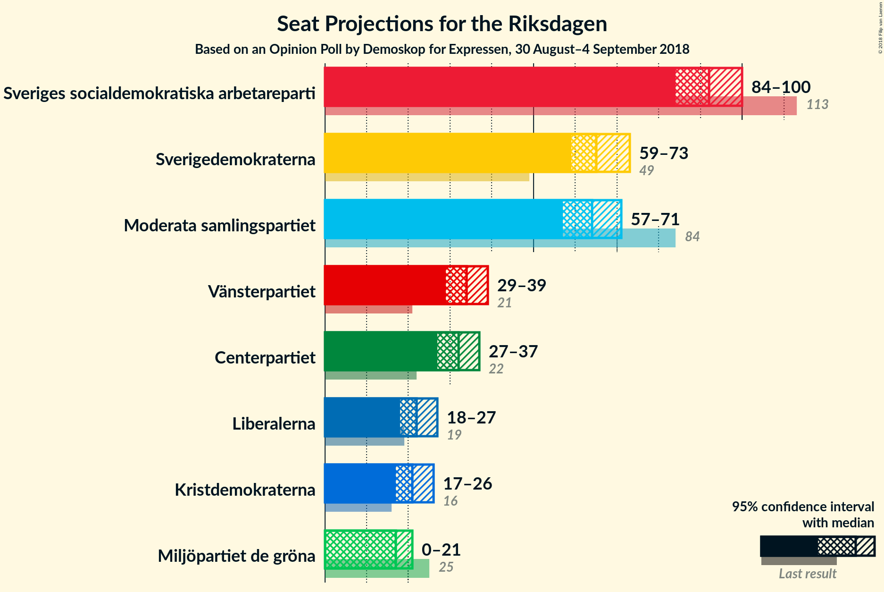
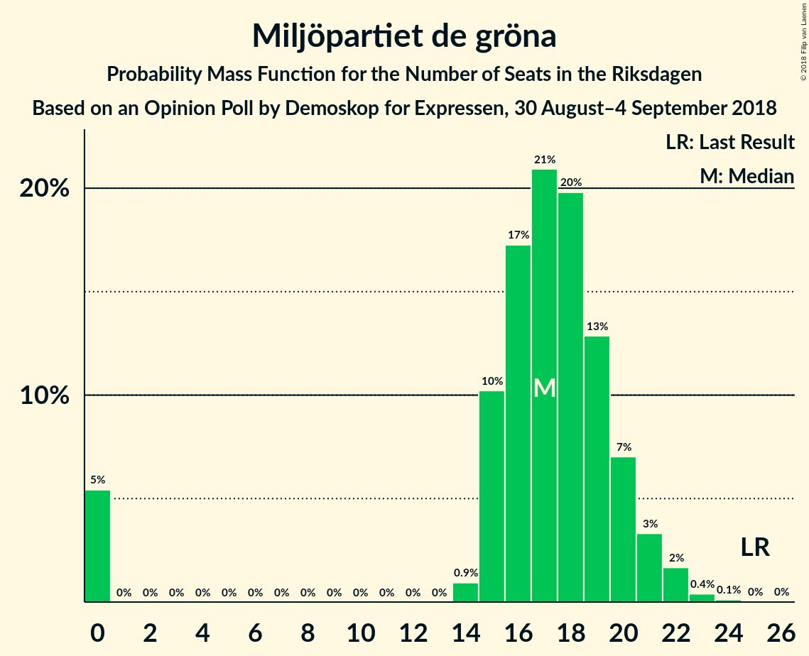

# Opinion Poll by Demoskop for Expressen, 30 August–4 September 2018

<a href="#voting-intentions">Voting Intentions</a> | <a href="#seats">Seats</a> | <a href="#coalitions">Coalitions</a> | <a href="#technical-information">Technical Information</a>

## Voting Intentions

### Confidence Intervals

| Party | Last Result | Poll Result | 80% Confidence Interval | 90% Confidence Interval | 95% Confidence Interval | 99% Confidence Interval |
|:-----:|:-----------:|:-----------:|:-----------------------:|:-----------------------:|:-----------------------:|:-----------------------:|
| Sveriges socialdemokratiska arbetareparti | 31.0% | 25.5% | 24.1–26.9% |23.7–27.3% |23.4–27.7% |22.8–28.4% |
| Sverigedemokraterna | 12.9% | 18.2% | 17.0–19.5% |16.6–19.8% |16.4–20.1% |15.8–20.8% |
| Moderata samlingspartiet | 23.3% | 17.8% | 16.6–19.1% |16.3–19.4% |16.0–19.8% |15.5–20.4% |
| Vänsterpartiet | 5.7% | 9.4% | 8.6–10.4% |8.3–10.7% |8.1–11.0% |7.7–11.5% |
| Centerpartiet | 6.1% | 8.9% | 8.0–9.8% |7.8–10.1% |7.6–10.4% |7.2–10.9% |
| Liberalerna | 5.4% | 6.2% | 5.5–7.0% |5.3–7.3% |5.1–7.5% |4.8–7.9% |
| Kristdemokraterna | 4.6% | 5.9% | 5.2–6.7% |5.0–7.0% |4.8–7.2% |4.5–7.6% |
| Miljöpartiet de gröna | 6.9% | 4.8% | 4.2–5.5% |4.0–5.7% |3.8–5.9% |3.6–6.3% |

*Note:* The poll result column reflects the actual value used in the calculations. Published results may vary slightly, and in addition be rounded to fewer digits.

## Seats

### Confidence Intervals

| Party | Last Result | Median | 80% Confidence Interval | 90% Confidence Interval | 95% Confidence Interval | 99% Confidence Interval |
|:-----:|:-----------:|:------:|:-----------------------:|:-----------------------:|:-----------------------:|:-----------------------:|
| <a href="#sveriges-socialdemokratiska-arbetareparti">Sveriges socialdemokratiska arbetareparti</a> | 113 | 92 | 86–97 |85–99 |84–100 |81–103 |
| <a href="#sverigedemokraterna">Sverigedemokraterna</a> | 49 | 65 | 61–70 |60–72 |59–73 |56–75 |
| <a href="#moderata-samlingspartiet">Moderata samlingspartiet</a> | 84 | 64 | 60–69 |58–70 |57–71 |55–73 |
| <a href="#vänsterpartiet">Vänsterpartiet</a> | 21 | 34 | 31–38 |30–38 |29–39 |27–41 |
| <a href="#centerpartiet">Centerpartiet</a> | 22 | 32 | 29–35 |28–36 |27–37 |26–39 |
| <a href="#liberalerna">Liberalerna</a> | 19 | 22 | 20–25 |19–26 |18–27 |17–29 |
| <a href="#kristdemokraterna">Kristdemokraterna</a> | 16 | 21 | 19–24 |18–25 |17–26 |16–27 |
| <a href="#miljöpartiet-de-gröna">Miljöpartiet de gröna</a> | 25 | 17 | 15–20 |0–21 |0–21 |0–23 |

### Sveriges socialdemokratiska arbetareparti

*For a full overview of the results for this party, see the [Sveriges socialdemokratiska arbetareparti](party-sverigessocialdemokratiskaarbetareparti.html) page.*

| Number of Seats | Probability | Accumulated | Special Marks |
|:---------------:|:-----------:|:-----------:|:-------------:|
| 78 | 0% | 100% |  |
| 79 | 0.1% | 99.9% |  |
| 80 | 0.2% | 99.9% |  |
| 81 | 0.5% | 99.7% |  |
| 82 | 0.6% | 99.2% |  |
| 83 | 0.9% | 98.6% |  |
| 84 | 2% | 98% |  |
| 85 | 2% | 95% |  |
| 86 | 4% | 93% |  |
| 87 | 6% | 89% |  |
| 88 | 6% | 83% |  |
| 89 | 8% | 77% |  |
| 90 | 10% | 69% |  |
| 91 | 8% | 59% |  |
| 92 | 9% | 51% | Median |
| 93 | 9% | 42% |  |
| 94 | 8% | 32% |  |
| 95 | 8% | 25% |  |
| 96 | 4% | 17% |  |
| 97 | 5% | 13% |  |
| 98 | 3% | 8% |  |
| 99 | 2% | 5% |  |
| 100 | 1.2% | 3% |  |
| 101 | 0.8% | 2% |  |
| 102 | 0.4% | 1.1% |  |
| 103 | 0.2% | 0.7% |  |
| 104 | 0.2% | 0.5% |  |
| 105 | 0.2% | 0.3% |  |
| 106 | 0% | 0.1% |  |
| 107 | 0% | 0.1% |  |
| 108 | 0% | 0% |  |
| 109 | 0% | 0% |  |
| 110 | 0% | 0% |  |
| 111 | 0% | 0% |  |
| 112 | 0% | 0% |  |
| 113 | 0% | 0% | Last Result |

### Sverigedemokraterna

*For a full overview of the results for this party, see the [Sverigedemokraterna](party-sverigedemokraterna.html) page.*

| Number of Seats | Probability | Accumulated | Special Marks |
|:---------------:|:-----------:|:-----------:|:-------------:|
| 49 | 0% | 100% | Last Result |
| 50 | 0% | 100% |  |
| 51 | 0% | 100% |  |
| 52 | 0% | 100% |  |
| 53 | 0% | 100% |  |
| 54 | 0.1% | 100% |  |
| 55 | 0.1% | 99.9% |  |
| 56 | 0.3% | 99.8% |  |
| 57 | 0.6% | 99.5% |  |
| 58 | 1.2% | 98.9% |  |
| 59 | 3% | 98% |  |
| 60 | 4% | 95% |  |
| 61 | 7% | 91% |  |
| 62 | 8% | 85% |  |
| 63 | 6% | 77% |  |
| 64 | 14% | 72% |  |
| 65 | 9% | 58% | Median |
| 66 | 10% | 49% |  |
| 67 | 13% | 39% |  |
| 68 | 7% | 26% |  |
| 69 | 6% | 19% |  |
| 70 | 4% | 13% |  |
| 71 | 4% | 9% |  |
| 72 | 2% | 5% |  |
| 73 | 2% | 3% |  |
| 74 | 0.8% | 2% |  |
| 75 | 0.4% | 0.7% |  |
| 76 | 0.2% | 0.3% |  |
| 77 | 0.1% | 0.2% |  |
| 78 | 0.1% | 0.1% |  |
| 79 | 0% | 0% |  |

### Moderata samlingspartiet

*For a full overview of the results for this party, see the [Moderata samlingspartiet](party-moderatasamlingspartiet.html) page.*

| Number of Seats | Probability | Accumulated | Special Marks |
|:---------------:|:-----------:|:-----------:|:-------------:|
| 53 | 0.1% | 100% |  |
| 54 | 0.1% | 99.9% |  |
| 55 | 0.3% | 99.8% |  |
| 56 | 0.8% | 99.5% |  |
| 57 | 1.5% | 98.6% |  |
| 58 | 3% | 97% |  |
| 59 | 4% | 95% |  |
| 60 | 6% | 91% |  |
| 61 | 7% | 85% |  |
| 62 | 9% | 77% |  |
| 63 | 11% | 68% |  |
| 64 | 13% | 57% | Median |
| 65 | 10% | 44% |  |
| 66 | 11% | 34% |  |
| 67 | 7% | 23% |  |
| 68 | 5% | 17% |  |
| 69 | 6% | 12% |  |
| 70 | 2% | 6% |  |
| 71 | 1.3% | 4% |  |
| 72 | 1.1% | 2% |  |
| 73 | 0.8% | 1.2% |  |
| 74 | 0.2% | 0.4% |  |
| 75 | 0.1% | 0.2% |  |
| 76 | 0.1% | 0.1% |  |
| 77 | 0% | 0.1% |  |
| 78 | 0% | 0% |  |
| 79 | 0% | 0% |  |
| 80 | 0% | 0% |  |
| 81 | 0% | 0% |  |
| 82 | 0% | 0% |  |
| 83 | 0% | 0% |  |
| 84 | 0% | 0% | Last Result |

### Vänsterpartiet

*For a full overview of the results for this party, see the [Vänsterpartiet](party-vänsterpartiet.html) page.*

| Number of Seats | Probability | Accumulated | Special Marks |
|:---------------:|:-----------:|:-----------:|:-------------:|
| 21 | 0% | 100% | Last Result |
| 22 | 0% | 100% |  |
| 23 | 0% | 100% |  |
| 24 | 0% | 100% |  |
| 25 | 0% | 100% |  |
| 26 | 0.1% | 100% |  |
| 27 | 0.5% | 99.9% |  |
| 28 | 1.0% | 99.4% |  |
| 29 | 2% | 98% |  |
| 30 | 5% | 96% |  |
| 31 | 9% | 92% |  |
| 32 | 12% | 82% |  |
| 33 | 15% | 70% |  |
| 34 | 14% | 55% | Median |
| 35 | 14% | 41% |  |
| 36 | 10% | 28% |  |
| 37 | 6% | 17% |  |
| 38 | 6% | 11% |  |
| 39 | 2% | 5% |  |
| 40 | 1.4% | 2% |  |
| 41 | 0.6% | 1.1% |  |
| 42 | 0.3% | 0.5% |  |
| 43 | 0.1% | 0.2% |  |
| 44 | 0% | 0.1% |  |
| 45 | 0% | 0% |  |

### Centerpartiet

*For a full overview of the results for this party, see the [Centerpartiet](party-centerpartiet.html) page.*

| Number of Seats | Probability | Accumulated | Special Marks |
|:---------------:|:-----------:|:-----------:|:-------------:|
| 22 | 0% | 100% | Last Result |
| 23 | 0% | 100% |  |
| 24 | 0.1% | 100% |  |
| 25 | 0.3% | 99.9% |  |
| 26 | 1.0% | 99.6% |  |
| 27 | 2% | 98.6% |  |
| 28 | 5% | 97% |  |
| 29 | 10% | 92% |  |
| 30 | 11% | 82% |  |
| 31 | 12% | 71% |  |
| 32 | 16% | 59% | Median |
| 33 | 14% | 42% |  |
| 34 | 12% | 28% |  |
| 35 | 7% | 16% |  |
| 36 | 4% | 9% |  |
| 37 | 2% | 5% |  |
| 38 | 1.4% | 2% |  |
| 39 | 0.5% | 0.8% |  |
| 40 | 0.1% | 0.3% |  |
| 41 | 0.1% | 0.2% |  |
| 42 | 0% | 0% |  |

### Liberalerna

*For a full overview of the results for this party, see the [Liberalerna](party-liberalerna.html) page.*

| Number of Seats | Probability | Accumulated | Special Marks |
|:---------------:|:-----------:|:-----------:|:-------------:|
| 16 | 0.1% | 100% |  |
| 17 | 0.7% | 99.9% |  |
| 18 | 2% | 99.2% |  |
| 19 | 6% | 97% | Last Result |
| 20 | 10% | 92% |  |
| 21 | 19% | 82% |  |
| 22 | 18% | 64% | Median |
| 23 | 14% | 46% |  |
| 24 | 14% | 31% |  |
| 25 | 10% | 18% |  |
| 26 | 4% | 8% |  |
| 27 | 3% | 4% |  |
| 28 | 0.8% | 1.4% |  |
| 29 | 0.4% | 0.6% |  |
| 30 | 0.1% | 0.2% |  |
| 31 | 0% | 0% |  |

### Kristdemokraterna

*For a full overview of the results for this party, see the [Kristdemokraterna](party-kristdemokraterna.html) page.*

| Number of Seats | Probability | Accumulated | Special Marks |
|:---------------:|:-----------:|:-----------:|:-------------:|
| 15 | 0.1% | 100% |  |
| 16 | 0.5% | 99.9% | Last Result |
| 17 | 2% | 99.3% |  |
| 18 | 7% | 97% |  |
| 19 | 14% | 91% |  |
| 20 | 14% | 76% |  |
| 21 | 15% | 62% | Median |
| 22 | 12% | 47% |  |
| 23 | 18% | 36% |  |
| 24 | 9% | 17% |  |
| 25 | 6% | 8% |  |
| 26 | 2% | 3% |  |
| 27 | 0.7% | 1.1% |  |
| 28 | 0.3% | 0.4% |  |
| 29 | 0.1% | 0.1% |  |
| 30 | 0% | 0% |  |

### Miljöpartiet de gröna

*For a full overview of the results for this party, see the [Miljöpartiet de gröna](party-miljöpartietdegröna.html) page.*

| Number of Seats | Probability | Accumulated | Special Marks |
|:---------------:|:-----------:|:-----------:|:-------------:|
| 0 | 5% | 100% |  |
| 1 | 0% | 95% |  |
| 2 | 0% | 95% |  |
| 3 | 0% | 95% |  |
| 4 | 0% | 95% |  |
| 5 | 0% | 95% |  |
| 6 | 0% | 95% |  |
| 7 | 0% | 95% |  |
| 8 | 0% | 95% |  |
| 9 | 0% | 95% |  |
| 10 | 0% | 95% |  |
| 11 | 0% | 95% |  |
| 12 | 0% | 95% |  |
| 13 | 0% | 95% |  |
| 14 | 0.9% | 95% |  |
| 15 | 10% | 94% |  |
| 16 | 17% | 83% |  |
| 17 | 21% | 66% | Median |
| 18 | 20% | 45% |  |
| 19 | 13% | 25% |  |
| 20 | 7% | 13% |  |
| 21 | 3% | 6% |  |
| 22 | 2% | 2% |  |
| 23 | 0.4% | 0.5% |  |
| 24 | 0.1% | 0.1% |  |
| 25 | 0% | 0% | Last Result |

## Coalitions

### Confidence Intervals

| Coalition | Last Result | Median | Majority? | 80% Confidence Interval | 90% Confidence Interval | 95% Confidence Interval | 99% Confidence Interval |
|:---------:|:-----------:|:------:|:---------:|:-----------------------:|:-----------------------:|:-----------------------:|:-----------------------:|
| Sveriges socialdemokratiska arbetareparti – Moderata samlingspartiet – Centerpartiet | 219 | 188 | 99.0% | 181–195 | 179–197 | 177–198 | 173–204 |
| Sveriges socialdemokratiska arbetareparti – Moderata samlingspartiet | 197 | 156 | 0.1% | 150–162 | 148–164 | 146–166 | 142–170 |
| Sverigedemokraterna – Moderata samlingspartiet – Kristdemokraterna | 149 | 151 | 0% | 145–157 | 142–159 | 141–161 | 138–165 |
| Sveriges socialdemokratiska arbetareparti – Vänsterpartiet – Miljöpartiet de gröna | 159 | 142 | 0% | 136–149 | 133–150 | 130–152 | 125–155 |
| Moderata samlingspartiet – Centerpartiet – Liberalerna – Kristdemokraterna | 141 | 140 | 0% | 134–146 | 132–148 | 130–150 | 128–154 |
| Sverigedemokraterna – Moderata samlingspartiet | 133 | 129 | 0% | 124–136 | 122–137 | 120–140 | 117–143 |
| Sveriges socialdemokratiska arbetareparti – Vänsterpartiet | 134 | 126 | 0% | 119–131 | 118–133 | 117–135 | 114–139 |
| Moderata samlingspartiet – Centerpartiet – Liberalerna | 125 | 118 | 0% | 113–125 | 111–126 | 110–128 | 107–131 |
| Moderata samlingspartiet – Centerpartiet – Kristdemokraterna | 122 | 118 | 0% | 112–124 | 110–125 | 109–127 | 106–129 |
| Sveriges socialdemokratiska arbetareparti – Miljöpartiet de gröna | 138 | 109 | 0% | 102–114 | 99–116 | 95–118 | 90–120 |
| Moderata samlingspartiet – Centerpartiet | 106 | 96 | 0% | 91–102 | 89–103 | 88–105 | 85–107 |

