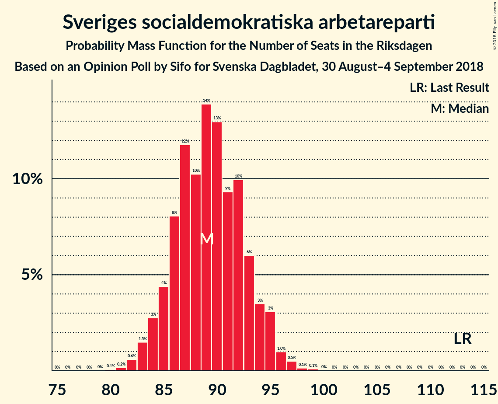
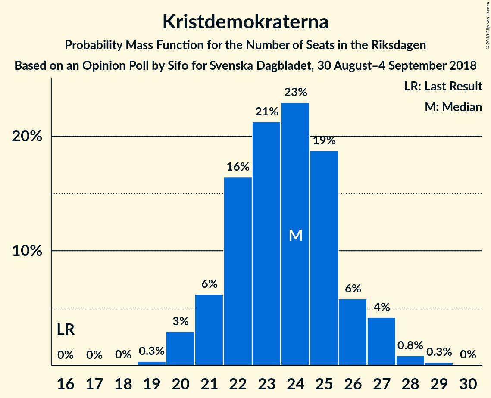

# Opinion Poll by Sifo for Svenska Dagbladet, 30 August–4 September 2018

<a href="#voting-intentions">Voting Intentions</a> | <a href="#seats">Seats</a> | <a href="#coalitions">Coalitions</a> | <a href="#technical-information">Technical Information</a>

## Voting Intentions

### Confidence Intervals

| Party | Last Result | Poll Result | 80% Confidence Interval | 90% Confidence Interval | 95% Confidence Interval | 99% Confidence Interval |
|:-----:|:-----------:|:-----------:|:-----------------------:|:-----------------------:|:-----------------------:|:-----------------------:|
| Sveriges socialdemokratiska arbetareparti | 31.0% | 24.9% | 23.9–26.0% |23.6–26.3% |23.4–26.5% |22.9–27.1% |
| Moderata samlingspartiet | 23.3% | 17.1% | 16.3–18.1% |16.0–18.3% |15.8–18.6% |15.4–19.0% |
| Sverigedemokraterna | 12.9% | 17.0% | 16.2–18.0% |15.9–18.2% |15.7–18.5% |15.3–18.9% |
| Vänsterpartiet | 5.7% | 10.2% | 9.5–10.9% |9.3–11.1% |9.1–11.3% |8.8–11.7% |
| Centerpartiet | 6.1% | 9.3% | 8.6–10.0% |8.4–10.2% |8.3–10.4% |7.9–10.7% |
| Liberalerna | 5.4% | 6.8% | 6.2–7.4% |6.1–7.6% |5.9–7.8% |5.7–8.1% |
| Kristdemokraterna | 4.6% | 6.6% | 6.0–7.2% |5.9–7.4% |5.7–7.5% |5.5–7.8% |
| Miljöpartiet de gröna | 6.9% | 5.4% | 4.9–6.0% |4.7–6.1% |4.6–6.3% |4.4–6.6% |

*Note:* The poll result column reflects the actual value used in the calculations. Published results may vary slightly, and in addition be rounded to fewer digits.

## Seats

### Confidence Intervals

| Party | Last Result | Median | 80% Confidence Interval | 90% Confidence Interval | 95% Confidence Interval | 99% Confidence Interval |
|:-----:|:-----------:|:------:|:-----------------------:|:-----------------------:|:-----------------------:|:-----------------------:|
| <a href="#sveriges-socialdemokratiska-arbetareparti">Sveriges socialdemokratiska arbetareparti</a> | 113 | 89 | 86–93 |84–94 |84–95 |82–97 |
| <a href="#moderata-samlingspartiet">Moderata samlingspartiet</a> | 84 | 61 | 58–64 |57–66 |57–66 |55–68 |
| <a href="#sverigedemokraterna">Sverigedemokraterna</a> | 49 | 61 | 58–65 |57–65 |56–66 |55–67 |
| <a href="#vänsterpartiet">Vänsterpartiet</a> | 21 | 36 | 34–39 |33–40 |33–41 |31–42 |
| <a href="#centerpartiet">Centerpartiet</a> | 22 | 33 | 31–36 |30–37 |30–37 |29–38 |
| <a href="#liberalerna">Liberalerna</a> | 19 | 24 | 22–26 |22–28 |21–28 |20–28 |
| <a href="#kristdemokraterna">Kristdemokraterna</a> | 16 | 24 | 22–26 |21–27 |20–27 |20–28 |
| <a href="#miljöpartiet-de-gröna">Miljöpartiet de gröna</a> | 25 | 19 | 17–21 |17–22 |17–22 |16–24 |

### Sveriges socialdemokratiska arbetareparti

*For a full overview of the results for this party, see the [Sveriges socialdemokratiska arbetareparti](party-sverigessocialdemokratiskaarbetareparti.html) page.*

| Number of Seats | Probability | Accumulated | Special Marks |
|:---------------:|:-----------:|:-----------:|:-------------:|
| 80 | 0.1% | 100% |  |
| 81 | 0.2% | 99.9% |  |
| 82 | 0.6% | 99.7% |  |
| 83 | 1.5% | 99.2% |  |
| 84 | 3% | 98% |  |
| 85 | 4% | 95% |  |
| 86 | 8% | 91% |  |
| 87 | 12% | 82% |  |
| 88 | 10% | 71% |  |
| 89 | 14% | 60% | Median |
| 90 | 13% | 47% |  |
| 91 | 9% | 34% |  |
| 92 | 10% | 24% |  |
| 93 | 6% | 14% |  |
| 94 | 3% | 8% |  |
| 95 | 3% | 5% |  |
| 96 | 1.0% | 2% |  |
| 97 | 0.5% | 0.8% |  |
| 98 | 0.1% | 0.3% |  |
| 99 | 0.1% | 0.1% |  |
| 100 | 0% | 0% |  |
| 101 | 0% | 0% |  |
| 102 | 0% | 0% |  |
| 103 | 0% | 0% |  |
| 104 | 0% | 0% |  |
| 105 | 0% | 0% |  |
| 106 | 0% | 0% |  |
| 107 | 0% | 0% |  |
| 108 | 0% | 0% |  |
| 109 | 0% | 0% |  |
| 110 | 0% | 0% |  |
| 111 | 0% | 0% |  |
| 112 | 0% | 0% |  |
| 113 | 0% | 0% | Last Result |

### Moderata samlingspartiet

*For a full overview of the results for this party, see the [Moderata samlingspartiet](party-moderatasamlingspartiet.html) page.*

| Number of Seats | Probability | Accumulated | Special Marks |
|:---------------:|:-----------:|:-----------:|:-------------:|
| 54 | 0.2% | 100% |  |
| 55 | 0.6% | 99.7% |  |
| 56 | 2% | 99.1% |  |
| 57 | 3% | 98% |  |
| 58 | 5% | 95% |  |
| 59 | 9% | 89% |  |
| 60 | 12% | 80% |  |
| 61 | 25% | 68% | Median |
| 62 | 11% | 42% |  |
| 63 | 9% | 31% |  |
| 64 | 12% | 22% |  |
| 65 | 3% | 10% |  |
| 66 | 5% | 7% |  |
| 67 | 2% | 2% |  |
| 68 | 0.4% | 0.8% |  |
| 69 | 0.3% | 0.4% |  |
| 70 | 0% | 0.1% |  |
| 71 | 0% | 0% |  |
| 72 | 0% | 0% |  |
| 73 | 0% | 0% |  |
| 74 | 0% | 0% |  |
| 75 | 0% | 0% |  |
| 76 | 0% | 0% |  |
| 77 | 0% | 0% |  |
| 78 | 0% | 0% |  |
| 79 | 0% | 0% |  |
| 80 | 0% | 0% |  |
| 81 | 0% | 0% |  |
| 82 | 0% | 0% |  |
| 83 | 0% | 0% |  |
| 84 | 0% | 0% | Last Result |

### Sverigedemokraterna

*For a full overview of the results for this party, see the [Sverigedemokraterna](party-sverigedemokraterna.html) page.*

| Number of Seats | Probability | Accumulated | Special Marks |
|:---------------:|:-----------:|:-----------:|:-------------:|
| 49 | 0% | 100% | Last Result |
| 50 | 0% | 100% |  |
| 51 | 0% | 100% |  |
| 52 | 0% | 100% |  |
| 53 | 0.1% | 100% |  |
| 54 | 0.2% | 99.9% |  |
| 55 | 0.8% | 99.7% |  |
| 56 | 1.5% | 98.9% |  |
| 57 | 4% | 97% |  |
| 58 | 9% | 93% |  |
| 59 | 16% | 84% |  |
| 60 | 14% | 68% |  |
| 61 | 13% | 54% | Median |
| 62 | 11% | 42% |  |
| 63 | 7% | 31% |  |
| 64 | 11% | 24% |  |
| 65 | 9% | 13% |  |
| 66 | 3% | 4% |  |
| 67 | 0.8% | 1.2% |  |
| 68 | 0.3% | 0.4% |  |
| 69 | 0.1% | 0.1% |  |
| 70 | 0% | 0.1% |  |
| 71 | 0% | 0% |  |

### Vänsterpartiet

*For a full overview of the results for this party, see the [Vänsterpartiet](party-vänsterpartiet.html) page.*

| Number of Seats | Probability | Accumulated | Special Marks |
|:---------------:|:-----------:|:-----------:|:-------------:|
| 21 | 0% | 100% | Last Result |
| 22 | 0% | 100% |  |
| 23 | 0% | 100% |  |
| 24 | 0% | 100% |  |
| 25 | 0% | 100% |  |
| 26 | 0% | 100% |  |
| 27 | 0% | 100% |  |
| 28 | 0% | 100% |  |
| 29 | 0% | 100% |  |
| 30 | 0.1% | 100% |  |
| 31 | 0.4% | 99.9% |  |
| 32 | 2% | 99.5% |  |
| 33 | 5% | 98% |  |
| 34 | 10% | 93% |  |
| 35 | 16% | 84% |  |
| 36 | 20% | 67% | Median |
| 37 | 17% | 48% |  |
| 38 | 16% | 31% |  |
| 39 | 8% | 15% |  |
| 40 | 4% | 7% |  |
| 41 | 2% | 3% |  |
| 42 | 0.5% | 0.7% |  |
| 43 | 0.2% | 0.2% |  |
| 44 | 0% | 0% |  |

### Centerpartiet

*For a full overview of the results for this party, see the [Centerpartiet](party-centerpartiet.html) page.*

| Number of Seats | Probability | Accumulated | Special Marks |
|:---------------:|:-----------:|:-----------:|:-------------:|
| 22 | 0% | 100% | Last Result |
| 23 | 0% | 100% |  |
| 24 | 0% | 100% |  |
| 25 | 0% | 100% |  |
| 26 | 0% | 100% |  |
| 27 | 0.1% | 100% |  |
| 28 | 0.4% | 99.9% |  |
| 29 | 2% | 99.6% |  |
| 30 | 6% | 98% |  |
| 31 | 10% | 92% |  |
| 32 | 16% | 82% |  |
| 33 | 22% | 66% | Median |
| 34 | 22% | 44% |  |
| 35 | 11% | 23% |  |
| 36 | 6% | 11% |  |
| 37 | 4% | 5% |  |
| 38 | 1.1% | 2% |  |
| 39 | 0.3% | 0.4% |  |
| 40 | 0.1% | 0.1% |  |
| 41 | 0% | 0% |  |

### Liberalerna

*For a full overview of the results for this party, see the [Liberalerna](party-liberalerna.html) page.*

| Number of Seats | Probability | Accumulated | Special Marks |
|:---------------:|:-----------:|:-----------:|:-------------:|
| 19 | 0.1% | 100% | Last Result |
| 20 | 1.1% | 99.9% |  |
| 21 | 2% | 98.9% |  |
| 22 | 11% | 97% |  |
| 23 | 9% | 86% |  |
| 24 | 39% | 77% | Median |
| 25 | 12% | 39% |  |
| 26 | 17% | 26% |  |
| 27 | 4% | 9% |  |
| 28 | 5% | 6% |  |
| 29 | 0.2% | 0.5% |  |
| 30 | 0.2% | 0.2% |  |
| 31 | 0% | 0% |  |

### Kristdemokraterna

*For a full overview of the results for this party, see the [Kristdemokraterna](party-kristdemokraterna.html) page.*

| Number of Seats | Probability | Accumulated | Special Marks |
|:---------------:|:-----------:|:-----------:|:-------------:|
| 16 | 0% | 100% | Last Result |
| 17 | 0% | 100% |  |
| 18 | 0% | 100% |  |
| 19 | 0.3% | 100% |  |
| 20 | 3% | 99.6% |  |
| 21 | 6% | 97% |  |
| 22 | 16% | 90% |  |
| 23 | 21% | 74% |  |
| 24 | 23% | 53% | Median |
| 25 | 19% | 30% |  |
| 26 | 6% | 11% |  |
| 27 | 4% | 5% |  |
| 28 | 0.8% | 1.1% |  |
| 29 | 0.3% | 0.3% |  |
| 30 | 0% | 0% |  |

### Miljöpartiet de gröna

*For a full overview of the results for this party, see the [Miljöpartiet de gröna](party-miljöpartietdegröna.html) page.*

| Number of Seats | Probability | Accumulated | Special Marks |
|:---------------:|:-----------:|:-----------:|:-------------:|
| 15 | 0.2% | 100% |  |
| 16 | 2% | 99.7% |  |
| 17 | 9% | 98% |  |
| 18 | 16% | 88% |  |
| 19 | 24% | 72% | Median |
| 20 | 23% | 49% |  |
| 21 | 16% | 26% |  |
| 22 | 7% | 9% |  |
| 23 | 2% | 2% |  |
| 24 | 0.5% | 0.5% |  |
| 25 | 0.1% | 0.1% | Last Result |
| 26 | 0% | 0% |  |

## Coalitions

### Confidence Intervals

| Coalition | Last Result | Median | Majority? | 80% Confidence Interval | 90% Confidence Interval | 95% Confidence Interval | 99% Confidence Interval |
|:---------:|:-----------:|:------:|:---------:|:-----------------------:|:-----------------------:|:-----------------------:|:-----------------------:|
| Sveriges socialdemokratiska arbetareparti – Moderata samlingspartiet – Centerpartiet | 219 | 184 | 99.8% | 180–188 | 179–190 | 178–191 | 176–193 |
| Sveriges socialdemokratiska arbetareparti – Moderata samlingspartiet | 197 | 151 | 0% | 147–155 | 146–156 | 144–157 | 142–159 |
| Moderata samlingspartiet – Sverigedemokraterna – Kristdemokraterna | 149 | 146 | 0% | 142–150 | 141–151 | 140–153 | 138–154 |
| Sveriges socialdemokratiska arbetareparti – Vänsterpartiet – Miljöpartiet de gröna | 159 | 145 | 0% | 141–149 | 140–151 | 139–152 | 137–154 |
| Moderata samlingspartiet – Centerpartiet – Liberalerna – Kristdemokraterna | 141 | 142 | 0% | 138–147 | 137–148 | 137–149 | 134–151 |
| Sveriges socialdemokratiska arbetareparti – Vänsterpartiet | 134 | 125 | 0% | 122–130 | 121–132 | 120–132 | 118–134 |
| Moderata samlingspartiet – Sverigedemokraterna | 133 | 122 | 0% | 118–127 | 117–128 | 116–129 | 115–131 |
| Moderata samlingspartiet – Centerpartiet – Liberalerna | 125 | 119 | 0% | 115–123 | 114–125 | 113–125 | 111–127 |
| Moderata samlingspartiet – Centerpartiet – Kristdemokraterna | 122 | 118 | 0% | 114–122 | 113–123 | 112–125 | 111–127 |
| Sveriges socialdemokratiska arbetareparti – Miljöpartiet de gröna | 138 | 109 | 0% | 105–113 | 104–114 | 103–115 | 101–117 |
| Moderata samlingspartiet – Centerpartiet | 106 | 94 | 0% | 91–98 | 90–99 | 89–100 | 88–102 |

