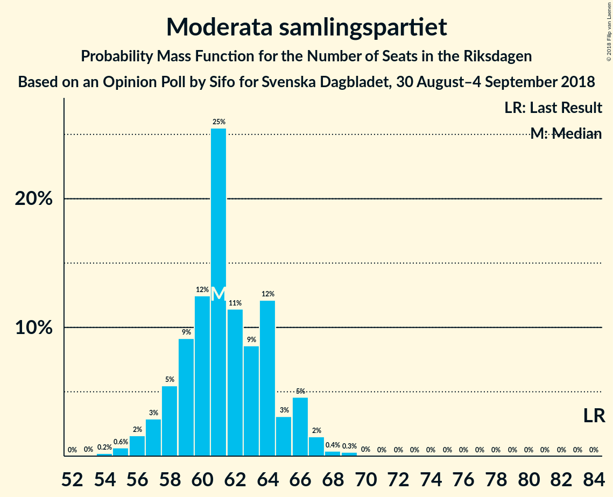
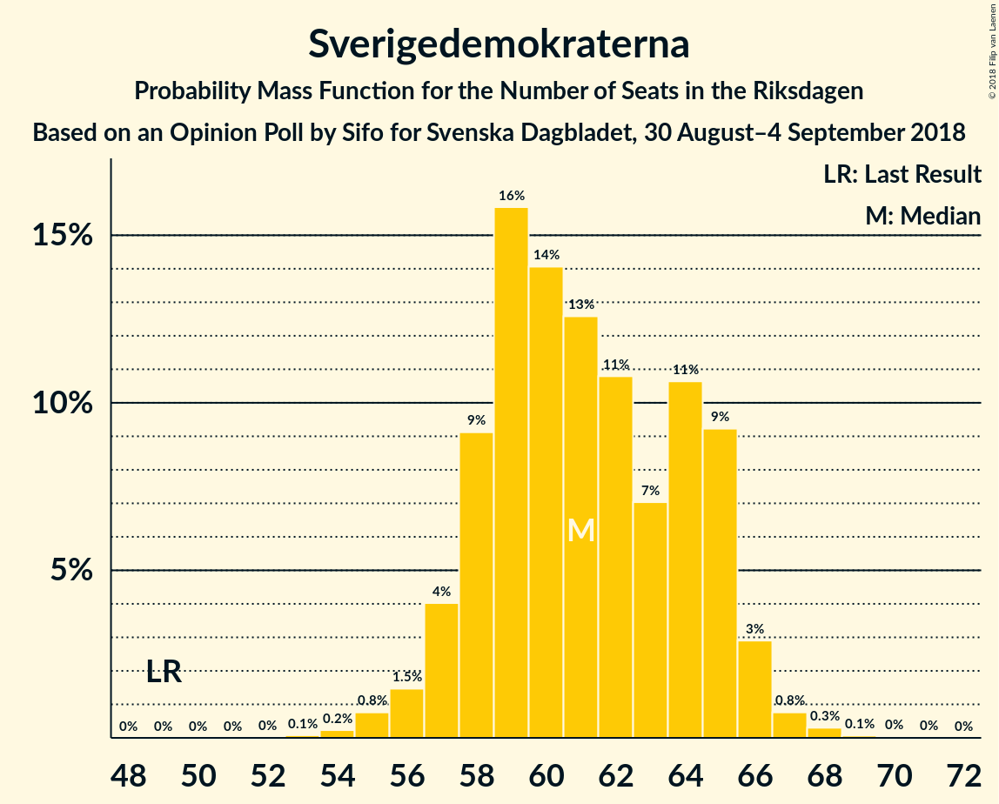
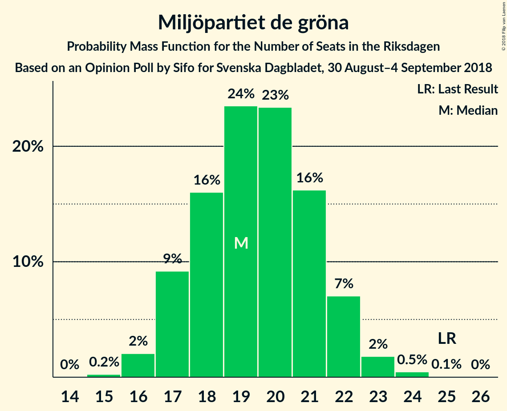

# Opinion Poll by Sifo for Svenska Dagbladet, 30 August–4 September 2018

<a href="#voting-intentions">Voting Intentions</a> | <a href="#seats">Seats</a> | <a href="#coalitions">Coalitions</a> | <a href="#technical-information">Technical Information</a>

## Voting Intentions

### Confidence Intervals

| Party | Last Result | Poll Result | 80% Confidence Interval | 90% Confidence Interval | 95% Confidence Interval | 99% Confidence Interval |
|:-----:|:-----------:|:-----------:|:-----------------------:|:-----------------------:|:-----------------------:|:-----------------------:|
| Sveriges socialdemokratiska arbetareparti | 31.0% | 24.9% | 23.9–26.0% |23.6–26.3% |23.4–26.5% |22.9–27.1% |
| Moderata samlingspartiet | 23.3% | 17.1% | 16.3–18.1% |16.0–18.3% |15.8–18.6% |15.4–19.0% |
| Sverigedemokraterna | 12.9% | 17.0% | 16.2–18.0% |15.9–18.2% |15.7–18.5% |15.3–18.9% |
| Vänsterpartiet | 5.7% | 10.2% | 9.5–10.9% |9.3–11.1% |9.1–11.3% |8.8–11.7% |
| Centerpartiet | 6.1% | 9.3% | 8.6–10.0% |8.4–10.2% |8.3–10.4% |7.9–10.7% |
| Liberalerna | 5.4% | 6.8% | 6.2–7.4% |6.1–7.6% |5.9–7.8% |5.7–8.1% |
| Kristdemokraterna | 4.6% | 6.6% | 6.0–7.2% |5.9–7.4% |5.7–7.5% |5.5–7.8% |
| Miljöpartiet de gröna | 6.9% | 5.4% | 4.9–6.0% |4.7–6.1% |4.6–6.3% |4.4–6.6% |

*Note:* The poll result column reflects the actual value used in the calculations. Published results may vary slightly, and in addition be rounded to fewer digits.

## Seats

### Confidence Intervals

| Party | Last Result | Median | 80% Confidence Interval | 90% Confidence Interval | 95% Confidence Interval | 99% Confidence Interval |
|:-----:|:-----------:|:------:|:-----------------------:|:-----------------------:|:-----------------------:|:-----------------------:|
| <a href="#sveriges-socialdemokratiska-arbetareparti">Sveriges socialdemokratiska arbetareparti</a> | 113 | 86 | 85–86 |85–86 |85–89 |81–89 |
| <a href="#moderata-samlingspartiet">Moderata samlingspartiet</a> | 84 | 62 | 58–65 |58–65 |58–65 |58–65 |
| <a href="#sverigedemokraterna">Sverigedemokraterna</a> | 49 | 63 | 62–63 |59–63 |59–63 |58–64 |
| <a href="#vänsterpartiet">Vänsterpartiet</a> | 21 | 40 | 36–40 |36–41 |36–41 |36–44 |
| <a href="#centerpartiet">Centerpartiet</a> | 22 | 31 | 31–35 |31–35 |31–35 |29–35 |
| <a href="#liberalerna">Liberalerna</a> | 19 | 26 | 25–27 |25–27 |23–27 |23–29 |
| <a href="#kristdemokraterna">Kristdemokraterna</a> | 16 | 24 | 21–25 |21–27 |21–28 |21–28 |
| <a href="#miljöpartiet-de-gröna">Miljöpartiet de gröna</a> | 25 | 17 | 17–22 |17–22 |17–22 |16–22 |

### Sveriges socialdemokratiska arbetareparti

*For a full overview of the results for this party, see the [Sveriges socialdemokratiska arbetareparti](party-sverigessocialdemokratiskaarbetareparti.html) page.*

| Number of Seats | Probability | Accumulated | Special Marks |
|:---------------:|:-----------:|:-----------:|:-------------:|
| 81 | 0.9% | 100% |  |
| 82 | 0% | 99.1% |  |
| 83 | 0% | 99.1% |  |
| 84 | 0% | 99.1% |  |
| 85 | 38% | 99.1% |  |
| 86 | 58% | 61% | Median |
| 87 | 0.4% | 3% |  |
| 88 | 0% | 3% |  |
| 89 | 2% | 3% |  |
| 90 | 0.1% | 0.4% |  |
| 91 | 0.1% | 0.2% |  |
| 92 | 0% | 0.2% |  |
| 93 | 0% | 0.1% |  |
| 94 | 0% | 0.1% |  |
| 95 | 0% | 0.1% |  |
| 96 | 0.1% | 0.1% |  |
| 97 | 0.1% | 0.1% |  |
| 98 | 0% | 0% |  |
| 99 | 0% | 0% |  |
| 100 | 0% | 0% |  |
| 101 | 0% | 0% |  |
| 102 | 0% | 0% |  |
| 103 | 0% | 0% |  |
| 104 | 0% | 0% |  |
| 105 | 0% | 0% |  |
| 106 | 0% | 0% |  |
| 107 | 0% | 0% |  |
| 108 | 0% | 0% |  |
| 109 | 0% | 0% |  |
| 110 | 0% | 0% |  |
| 111 | 0% | 0% |  |
| 112 | 0% | 0% |  |
| 113 | 0% | 0% | Last Result |

### Moderata samlingspartiet

*For a full overview of the results for this party, see the [Moderata samlingspartiet](party-moderatasamlingspartiet.html) page.*

| Number of Seats | Probability | Accumulated | Special Marks |
|:---------------:|:-----------:|:-----------:|:-------------:|
| 58 | 22% | 100% |  |
| 59 | 0% | 78% |  |
| 60 | 5% | 78% |  |
| 61 | 0% | 74% |  |
| 62 | 33% | 74% | Median |
| 63 | 0.4% | 41% |  |
| 64 | 2% | 40% |  |
| 65 | 38% | 38% |  |
| 66 | 0% | 0.2% |  |
| 67 | 0.1% | 0.2% |  |
| 68 | 0.1% | 0.1% |  |
| 69 | 0% | 0% |  |
| 70 | 0% | 0% |  |
| 71 | 0% | 0% |  |
| 72 | 0% | 0% |  |
| 73 | 0% | 0% |  |
| 74 | 0% | 0% |  |
| 75 | 0% | 0% |  |
| 76 | 0% | 0% |  |
| 77 | 0% | 0% |  |
| 78 | 0% | 0% |  |
| 79 | 0% | 0% |  |
| 80 | 0% | 0% |  |
| 81 | 0% | 0% |  |
| 82 | 0% | 0% |  |
| 83 | 0% | 0% |  |
| 84 | 0% | 0% | Last Result |

### Sverigedemokraterna

*For a full overview of the results for this party, see the [Sverigedemokraterna](party-sverigedemokraterna.html) page.*

| Number of Seats | Probability | Accumulated | Special Marks |
|:---------------:|:-----------:|:-----------:|:-------------:|
| 49 | 0% | 100% | Last Result |
| 50 | 0% | 100% |  |
| 51 | 0% | 100% |  |
| 52 | 0% | 100% |  |
| 53 | 0% | 100% |  |
| 54 | 0% | 100% |  |
| 55 | 0% | 100% |  |
| 56 | 0% | 100% |  |
| 57 | 0.1% | 100% |  |
| 58 | 2% | 99.9% |  |
| 59 | 5% | 98% |  |
| 60 | 0% | 93% |  |
| 61 | 0% | 93% |  |
| 62 | 21% | 93% |  |
| 63 | 72% | 72% | Median |
| 64 | 0.1% | 0.6% |  |
| 65 | 0% | 0.4% |  |
| 66 | 0% | 0.4% |  |
| 67 | 0.3% | 0.4% |  |
| 68 | 0% | 0.1% |  |
| 69 | 0% | 0% |  |

### Vänsterpartiet

*For a full overview of the results for this party, see the [Vänsterpartiet](party-vänsterpartiet.html) page.*

| Number of Seats | Probability | Accumulated | Special Marks |
|:---------------:|:-----------:|:-----------:|:-------------:|
| 21 | 0% | 100% | Last Result |
| 22 | 0% | 100% |  |
| 23 | 0% | 100% |  |
| 24 | 0% | 100% |  |
| 25 | 0% | 100% |  |
| 26 | 0% | 100% |  |
| 27 | 0% | 100% |  |
| 28 | 0% | 100% |  |
| 29 | 0% | 100% |  |
| 30 | 0% | 100% |  |
| 31 | 0% | 100% |  |
| 32 | 0% | 100% |  |
| 33 | 0% | 100% |  |
| 34 | 0% | 100% |  |
| 35 | 0.3% | 99.9% |  |
| 36 | 38% | 99.6% |  |
| 37 | 0.9% | 62% |  |
| 38 | 0.1% | 61% |  |
| 39 | 0% | 61% |  |
| 40 | 54% | 61% | Median |
| 41 | 5% | 7% |  |
| 42 | 0.1% | 2% |  |
| 43 | 0% | 2% |  |
| 44 | 2% | 2% |  |
| 45 | 0% | 0% |  |

### Centerpartiet

*For a full overview of the results for this party, see the [Centerpartiet](party-centerpartiet.html) page.*

| Number of Seats | Probability | Accumulated | Special Marks |
|:---------------:|:-----------:|:-----------:|:-------------:|
| 22 | 0% | 100% | Last Result |
| 23 | 0% | 100% |  |
| 24 | 0% | 100% |  |
| 25 | 0% | 100% |  |
| 26 | 0% | 100% |  |
| 27 | 0% | 100% |  |
| 28 | 0.1% | 100% |  |
| 29 | 2% | 99.9% |  |
| 30 | 0% | 98% |  |
| 31 | 75% | 98% | Median |
| 32 | 0% | 22% |  |
| 33 | 1.0% | 22% |  |
| 34 | 0.2% | 21% |  |
| 35 | 21% | 21% |  |
| 36 | 0.3% | 0.3% |  |
| 37 | 0% | 0% |  |

### Liberalerna

*For a full overview of the results for this party, see the [Liberalerna](party-liberalerna.html) page.*

| Number of Seats | Probability | Accumulated | Special Marks |
|:---------------:|:-----------:|:-----------:|:-------------:|
| 18 | 0.1% | 100% |  |
| 19 | 0% | 99.9% | Last Result |
| 20 | 0.1% | 99.9% |  |
| 21 | 0.1% | 99.8% |  |
| 22 | 0% | 99.7% |  |
| 23 | 2% | 99.7% |  |
| 24 | 0.1% | 97% |  |
| 25 | 33% | 97% |  |
| 26 | 42% | 64% | Median |
| 27 | 21% | 22% |  |
| 28 | 0% | 0.9% |  |
| 29 | 0.9% | 0.9% |  |
| 30 | 0% | 0% |  |

### Kristdemokraterna

*For a full overview of the results for this party, see the [Kristdemokraterna](party-kristdemokraterna.html) page.*

| Number of Seats | Probability | Accumulated | Special Marks |
|:---------------:|:-----------:|:-----------:|:-------------:|
| 16 | 0% | 100% | Last Result |
| 17 | 0% | 100% |  |
| 18 | 0.1% | 100% |  |
| 19 | 0% | 99.9% |  |
| 20 | 0.4% | 99.9% |  |
| 21 | 33% | 99.5% |  |
| 22 | 2% | 66% |  |
| 23 | 0.1% | 64% |  |
| 24 | 21% | 64% | Median |
| 25 | 38% | 43% |  |
| 26 | 0.1% | 6% |  |
| 27 | 0.9% | 6% |  |
| 28 | 5% | 5% |  |
| 29 | 0.1% | 0.1% |  |
| 30 | 0% | 0% |  |

### Miljöpartiet de gröna

*For a full overview of the results for this party, see the [Miljöpartiet de gröna](party-miljöpartietdegröna.html) page.*

| Number of Seats | Probability | Accumulated | Special Marks |
|:---------------:|:-----------:|:-----------:|:-------------:|
| 0 | 0.1% | 100% |  |
| 1 | 0% | 99.9% |  |
| 2 | 0% | 99.9% |  |
| 3 | 0% | 99.9% |  |
| 4 | 0% | 99.9% |  |
| 5 | 0% | 99.9% |  |
| 6 | 0% | 99.9% |  |
| 7 | 0% | 99.9% |  |
| 8 | 0% | 99.9% |  |
| 9 | 0% | 99.9% |  |
| 10 | 0% | 99.9% |  |
| 11 | 0% | 99.9% |  |
| 12 | 0% | 99.9% |  |
| 13 | 0% | 99.9% |  |
| 14 | 0% | 99.9% |  |
| 15 | 0.4% | 99.9% |  |
| 16 | 0.2% | 99.6% |  |
| 17 | 58% | 99.4% | Median |
| 18 | 0.1% | 41% |  |
| 19 | 5% | 41% |  |
| 20 | 2% | 36% |  |
| 21 | 1.0% | 34% |  |
| 22 | 33% | 33% |  |
| 23 | 0% | 0% |  |
| 24 | 0% | 0% |  |
| 25 | 0% | 0% | Last Result |

## Coalitions

### Confidence Intervals

| Coalition | Last Result | Median | Majority? | 80% Confidence Interval | 90% Confidence Interval | 95% Confidence Interval | 99% Confidence Interval |
|:---------:|:-----------:|:------:|:---------:|:-----------------------:|:-----------------------:|:-----------------------:|:-----------------------:|
| Sveriges socialdemokratiska arbetareparti – Moderata samlingspartiet – Centerpartiet | 219 | 179 | 99.1% | 178–182 | 176–182 | 176–182 | 172–186 |
| Moderata samlingspartiet – Sverigedemokraterna – Kristdemokraterna | 149 | 146 | 0% | 144–153 | 144–153 | 144–153 | 144–153 |
| Sveriges socialdemokratiska arbetareparti – Moderata samlingspartiet | 197 | 147 | 0% | 144–151 | 144–151 | 144–152 | 139–153 |
| Moderata samlingspartiet – Centerpartiet – Liberalerna – Kristdemokraterna | 141 | 144 | 0% | 139–147 | 139–147 | 139–147 | 138–147 |
| Sveriges socialdemokratiska arbetareparti – Vänsterpartiet – Miljöpartiet de gröna | 159 | 143 | 0% | 139–147 | 139–147 | 139–147 | 139–153 |
| Sveriges socialdemokratiska arbetareparti – Vänsterpartiet | 134 | 125 | 0% | 122–126 | 122–126 | 122–130 | 118–133 |
| Moderata samlingspartiet – Sverigedemokraterna | 133 | 125 | 0% | 120–128 | 120–128 | 119–128 | 119–130 |
| Moderata samlingspartiet – Centerpartiet – Liberalerna | 125 | 120 | 0% | 118–122 | 117–122 | 117–122 | 116–122 |
| Moderata samlingspartiet – Centerpartiet – Kristdemokraterna | 122 | 117 | 0% | 114–121 | 114–121 | 114–121 | 114–121 |
| Sveriges socialdemokratiska arbetareparti – Miljöpartiet de gröna | 138 | 103 | 0% | 103–107 | 103–107 | 103–107 | 102–109 |
| Moderata samlingspartiet – Centerpartiet | 106 | 93 | 0% | 93–96 | 91–96 | 91–96 | 91–97 |

### Sveriges socialdemokratiska arbetareparti – Moderata samlingspartiet – Centerpartiet

| Number of Seats | Probability | Accumulated | Special Marks |
|:---------------:|:-----------:|:-----------:|:-------------:|
| 172 | 0.9% | 100% |  |
| 173 | 0% | 99.1% |  |
| 174 | 0% | 99.1% |  |
| 175 | 0% | 99.1% | Majority |
| 176 | 4% | 99.1% |  |
| 177 | 0% | 95% |  |
| 178 | 33% | 95% |  |
| 179 | 21% | 62% | Median |
| 180 | 0% | 41% |  |
| 181 | 0% | 41% |  |
| 182 | 40% | 41% |  |
| 183 | 0% | 0.8% |  |
| 184 | 0.1% | 0.8% |  |
| 185 | 0% | 0.7% |  |
| 186 | 0.5% | 0.6% |  |
| 187 | 0% | 0.2% |  |
| 188 | 0% | 0.2% |  |
| 189 | 0% | 0.2% |  |
| 190 | 0.1% | 0.1% |  |
| 191 | 0% | 0.1% |  |
| 192 | 0% | 0.1% |  |
| 193 | 0% | 0.1% |  |
| 194 | 0% | 0.1% |  |
| 195 | 0% | 0.1% |  |
| 196 | 0% | 0.1% |  |
| 197 | 0% | 0.1% |  |
| 198 | 0.1% | 0.1% |  |
| 199 | 0% | 0% |  |
| 200 | 0% | 0% |  |
| 201 | 0% | 0% |  |
| 202 | 0% | 0% |  |
| 203 | 0% | 0% |  |
| 204 | 0% | 0% |  |
| 205 | 0% | 0% |  |
| 206 | 0% | 0% |  |
| 207 | 0% | 0% |  |
| 208 | 0% | 0% |  |
| 209 | 0% | 0% |  |
| 210 | 0% | 0% |  |
| 211 | 0% | 0% |  |
| 212 | 0% | 0% |  |
| 213 | 0% | 0% |  |
| 214 | 0% | 0% |  |
| 215 | 0% | 0% |  |
| 216 | 0% | 0% |  |
| 217 | 0% | 0% |  |
| 218 | 0% | 0% |  |
| 219 | 0% | 0% | Last Result |

### Moderata samlingspartiet – Sverigedemokraterna – Kristdemokraterna

| Number of Seats | Probability | Accumulated | Special Marks |
|:---------------:|:-----------:|:-----------:|:-------------:|
| 142 | 0.1% | 100% |  |
| 143 | 0% | 99.8% |  |
| 144 | 23% | 99.8% |  |
| 145 | 0% | 77% |  |
| 146 | 33% | 77% |  |
| 147 | 5% | 44% |  |
| 148 | 0.9% | 39% |  |
| 149 | 0% | 38% | Last Result, Median |
| 150 | 0.3% | 38% |  |
| 151 | 0% | 38% |  |
| 152 | 0% | 38% |  |
| 153 | 38% | 38% |  |
| 154 | 0.1% | 0.3% |  |
| 155 | 0% | 0.2% |  |
| 156 | 0.1% | 0.2% |  |
| 157 | 0% | 0.1% |  |
| 158 | 0.1% | 0.1% |  |
| 159 | 0% | 0% |  |

### Sveriges socialdemokratiska arbetareparti – Moderata samlingspartiet

| Number of Seats | Probability | Accumulated | Special Marks |
|:---------------:|:-----------:|:-----------:|:-------------:|
| 139 | 0.9% | 100% |  |
| 140 | 0% | 99.1% |  |
| 141 | 0% | 99.1% |  |
| 142 | 0% | 99.1% |  |
| 143 | 0% | 99.1% |  |
| 144 | 21% | 99.1% |  |
| 145 | 5% | 78% |  |
| 146 | 0% | 74% |  |
| 147 | 33% | 74% |  |
| 148 | 0% | 41% | Median |
| 149 | 0% | 41% |  |
| 150 | 0.3% | 41% |  |
| 151 | 38% | 40% |  |
| 152 | 0.1% | 3% |  |
| 153 | 2% | 2% |  |
| 154 | 0.1% | 0.3% |  |
| 155 | 0% | 0.2% |  |
| 156 | 0% | 0.1% |  |
| 157 | 0% | 0.1% |  |
| 158 | 0% | 0.1% |  |
| 159 | 0% | 0.1% |  |
| 160 | 0% | 0.1% |  |
| 161 | 0% | 0.1% |  |
| 162 | 0% | 0.1% |  |
| 163 | 0.1% | 0.1% |  |
| 164 | 0% | 0% |  |
| 165 | 0% | 0% |  |
| 166 | 0% | 0% |  |
| 167 | 0% | 0% |  |
| 168 | 0% | 0% |  |
| 169 | 0% | 0% |  |
| 170 | 0% | 0% |  |
| 171 | 0% | 0% |  |
| 172 | 0% | 0% |  |
| 173 | 0% | 0% |  |
| 174 | 0% | 0% |  |
| 175 | 0% | 0% | Majority |
| 176 | 0% | 0% |  |
| 177 | 0% | 0% |  |
| 178 | 0% | 0% |  |
| 179 | 0% | 0% |  |
| 180 | 0% | 0% |  |
| 181 | 0% | 0% |  |
| 182 | 0% | 0% |  |
| 183 | 0% | 0% |  |
| 184 | 0% | 0% |  |
| 185 | 0% | 0% |  |
| 186 | 0% | 0% |  |
| 187 | 0% | 0% |  |
| 188 | 0% | 0% |  |
| 189 | 0% | 0% |  |
| 190 | 0% | 0% |  |
| 191 | 0% | 0% |  |
| 192 | 0% | 0% |  |
| 193 | 0% | 0% |  |
| 194 | 0% | 0% |  |
| 195 | 0% | 0% |  |
| 196 | 0% | 0% |  |
| 197 | 0% | 0% | Last Result |

### Moderata samlingspartiet – Centerpartiet – Liberalerna – Kristdemokraterna

| Number of Seats | Probability | Accumulated | Special Marks |
|:---------------:|:-----------:|:-----------:|:-------------:|
| 136 | 0% | 100% |  |
| 137 | 0.1% | 99.9% |  |
| 138 | 2% | 99.8% |  |
| 139 | 33% | 98% |  |
| 140 | 0.1% | 65% |  |
| 141 | 0% | 64% | Last Result |
| 142 | 0.1% | 64% |  |
| 143 | 0.1% | 64% | Median |
| 144 | 21% | 64% |  |
| 145 | 5% | 43% |  |
| 146 | 0% | 39% |  |
| 147 | 39% | 39% |  |
| 148 | 0% | 0.1% |  |
| 149 | 0.1% | 0.1% |  |
| 150 | 0% | 0% |  |

### Sveriges socialdemokratiska arbetareparti – Vänsterpartiet – Miljöpartiet de gröna

| Number of Seats | Probability | Accumulated | Special Marks |
|:---------------:|:-----------:|:-----------:|:-------------:|
| 136 | 0.1% | 100% |  |
| 137 | 0.3% | 99.9% |  |
| 138 | 0% | 99.6% |  |
| 139 | 39% | 99.6% |  |
| 140 | 0% | 61% |  |
| 141 | 0% | 61% |  |
| 142 | 0% | 61% |  |
| 143 | 21% | 61% | Median |
| 144 | 0% | 40% |  |
| 145 | 4% | 40% |  |
| 146 | 0% | 36% |  |
| 147 | 33% | 36% |  |
| 148 | 0% | 2% |  |
| 149 | 0% | 2% |  |
| 150 | 0.1% | 2% |  |
| 151 | 0% | 2% |  |
| 152 | 0% | 2% |  |
| 153 | 2% | 2% |  |
| 154 | 0% | 0% |  |
| 155 | 0% | 0% |  |
| 156 | 0% | 0% |  |
| 157 | 0% | 0% |  |
| 158 | 0% | 0% |  |
| 159 | 0% | 0% | Last Result |

### Sveriges socialdemokratiska arbetareparti – Vänsterpartiet

| Number of Seats | Probability | Accumulated | Special Marks |
|:---------------:|:-----------:|:-----------:|:-------------:|
| 118 | 0.9% | 100% |  |
| 119 | 0% | 99.1% |  |
| 120 | 0% | 99.1% |  |
| 121 | 0% | 99.1% |  |
| 122 | 38% | 99.1% |  |
| 123 | 0.1% | 61% |  |
| 124 | 0% | 61% |  |
| 125 | 33% | 61% |  |
| 126 | 25% | 28% | Median |
| 127 | 0% | 3% |  |
| 128 | 0% | 3% |  |
| 129 | 0% | 3% |  |
| 130 | 0% | 3% |  |
| 131 | 0% | 2% |  |
| 132 | 0.1% | 2% |  |
| 133 | 2% | 2% |  |
| 134 | 0% | 0.1% | Last Result |
| 135 | 0.1% | 0.1% |  |
| 136 | 0.1% | 0.1% |  |
| 137 | 0% | 0% |  |

### Moderata samlingspartiet – Sverigedemokraterna

| Number of Seats | Probability | Accumulated | Special Marks |
|:---------------:|:-----------:|:-----------:|:-------------:|
| 117 | 0% | 100% |  |
| 118 | 0% | 99.9% |  |
| 119 | 4% | 99.9% |  |
| 120 | 21% | 95% |  |
| 121 | 0.9% | 75% |  |
| 122 | 2% | 74% |  |
| 123 | 0% | 71% |  |
| 124 | 0.1% | 71% |  |
| 125 | 33% | 71% | Median |
| 126 | 0% | 38% |  |
| 127 | 0.1% | 38% |  |
| 128 | 38% | 38% |  |
| 129 | 0% | 0.6% |  |
| 130 | 0.3% | 0.6% |  |
| 131 | 0.1% | 0.2% |  |
| 132 | 0.1% | 0.1% |  |
| 133 | 0% | 0% | Last Result |

### Moderata samlingspartiet – Centerpartiet – Liberalerna

| Number of Seats | Probability | Accumulated | Special Marks |
|:---------------:|:-----------:|:-----------:|:-------------:|
| 113 | 0% | 100% |  |
| 114 | 0% | 99.9% |  |
| 115 | 0% | 99.9% |  |
| 116 | 2% | 99.9% |  |
| 117 | 5% | 98% |  |
| 118 | 33% | 93% |  |
| 119 | 0.1% | 60% | Median |
| 120 | 22% | 60% |  |
| 121 | 0% | 38% |  |
| 122 | 38% | 38% |  |
| 123 | 0% | 0.4% |  |
| 124 | 0% | 0.4% |  |
| 125 | 0.3% | 0.4% | Last Result |
| 126 | 0% | 0.1% |  |
| 127 | 0.1% | 0.1% |  |
| 128 | 0% | 0% |  |

### Moderata samlingspartiet – Centerpartiet – Kristdemokraterna

| Number of Seats | Probability | Accumulated | Special Marks |
|:---------------:|:-----------:|:-----------:|:-------------:|
| 114 | 33% | 100% |  |
| 115 | 2% | 67% |  |
| 116 | 0% | 65% |  |
| 117 | 21% | 65% | Median |
| 118 | 0.9% | 44% |  |
| 119 | 5% | 43% |  |
| 120 | 0% | 38% |  |
| 121 | 38% | 38% |  |
| 122 | 0.1% | 0.3% | Last Result |
| 123 | 0% | 0.2% |  |
| 124 | 0.1% | 0.2% |  |
| 125 | 0% | 0.1% |  |
| 126 | 0.1% | 0.1% |  |
| 127 | 0% | 0% |  |

### Sveriges socialdemokratiska arbetareparti – Miljöpartiet de gröna

| Number of Seats | Probability | Accumulated | Special Marks |
|:---------------:|:-----------:|:-----------:|:-------------:|
| 96 | 0.1% | 100% |  |
| 97 | 0% | 99.9% |  |
| 98 | 0% | 99.9% |  |
| 99 | 0% | 99.9% |  |
| 100 | 0% | 99.9% |  |
| 101 | 0% | 99.9% |  |
| 102 | 1.2% | 99.9% |  |
| 103 | 58% | 98.7% | Median |
| 104 | 4% | 40% |  |
| 105 | 0% | 36% |  |
| 106 | 0.1% | 36% |  |
| 107 | 33% | 36% |  |
| 108 | 0.2% | 2% |  |
| 109 | 2% | 2% |  |
| 110 | 0% | 0.1% |  |
| 111 | 0% | 0.1% |  |
| 112 | 0% | 0.1% |  |
| 113 | 0% | 0.1% |  |
| 114 | 0% | 0.1% |  |
| 115 | 0% | 0.1% |  |
| 116 | 0% | 0.1% |  |
| 117 | 0% | 0% |  |
| 118 | 0% | 0% |  |
| 119 | 0% | 0% |  |
| 120 | 0% | 0% |  |
| 121 | 0% | 0% |  |
| 122 | 0% | 0% |  |
| 123 | 0% | 0% |  |
| 124 | 0% | 0% |  |
| 125 | 0% | 0% |  |
| 126 | 0% | 0% |  |
| 127 | 0% | 0% |  |
| 128 | 0% | 0% |  |
| 129 | 0% | 0% |  |
| 130 | 0% | 0% |  |
| 131 | 0% | 0% |  |
| 132 | 0% | 0% |  |
| 133 | 0% | 0% |  |
| 134 | 0% | 0% |  |
| 135 | 0% | 0% |  |
| 136 | 0% | 0% |  |
| 137 | 0% | 0% |  |
| 138 | 0% | 0% | Last Result |

### Moderata samlingspartiet – Centerpartiet

| Number of Seats | Probability | Accumulated | Special Marks |
|:---------------:|:-----------:|:-----------:|:-------------:|
| 91 | 5% | 100% |  |
| 92 | 0% | 95% |  |
| 93 | 56% | 95% | Median |
| 94 | 0% | 38% |  |
| 95 | 0% | 38% |  |
| 96 | 38% | 38% |  |
| 97 | 0.1% | 0.6% |  |
| 98 | 0% | 0.5% |  |
| 99 | 0.4% | 0.4% |  |
| 100 | 0% | 0.1% |  |
| 101 | 0% | 0.1% |  |
| 102 | 0.1% | 0.1% |  |
| 103 | 0% | 0% |  |
| 104 | 0% | 0% |  |
| 105 | 0% | 0% |  |
| 106 | 0% | 0% | Last Result |

## Technical Information

### Opinion Poll

+ **Polling firm:** Sifo
+ **Commissioner(s):** Svenska Dagbladet
+ **Fieldwork period:** 30 August–4 September 2018

### Calculations

+ **Sample size:** 2893
+ **Simulations done:** 1,024
+ **Error estimate:** 1.20%

