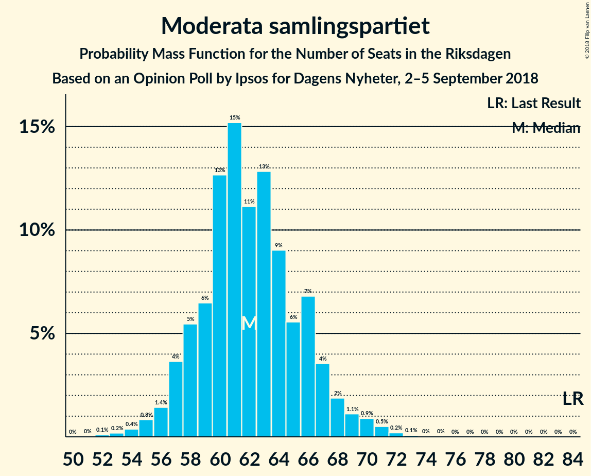

# Opinion Poll by Ipsos for Dagens Nyheter, 2–5 September 2018

<a href="#voting-intentions">Voting Intentions</a> | <a href="#seats">Seats</a> | <a href="#coalitions">Coalitions</a> | <a href="#technical-information">Technical Information</a>

## Voting Intentions

### Confidence Intervals

| Party | Last Result | Poll Result | 80% Confidence Interval | 90% Confidence Interval | 95% Confidence Interval | 99% Confidence Interval |
|:-----:|:-----------:|:-----------:|:-----------------------:|:-----------------------:|:-----------------------:|:-----------------------:|
| Sveriges socialdemokratiska arbetareparti | 31.0% | 25.9% | 24.6–27.2% |24.2–27.6% |23.9–27.9% |23.4–28.6% |
| Moderata samlingspartiet | 23.3% | 17.3% | 16.2–18.5% |15.9–18.8% |15.6–19.1% |15.1–19.6% |
| Sverigedemokraterna | 12.9% | 16.8% | 15.7–18.0% |15.4–18.3% |15.2–18.6% |14.7–19.1% |
| Vänsterpartiet | 5.7% | 10.1% | 9.2–11.0% |9.0–11.3% |8.8–11.5% |8.4–12.0% |
| Centerpartiet | 6.1% | 9.6% | 8.8–10.5% |8.6–10.8% |8.4–11.0% |8.0–11.5% |
| Liberalerna | 5.4% | 6.2% | 5.5–7.0% |5.3–7.2% |5.2–7.4% |4.9–7.8% |
| Kristdemokraterna | 4.6% | 5.9% | 5.3–6.7% |5.1–6.9% |4.9–7.1% |4.6–7.5% |
| Miljöpartiet de gröna | 6.9% | 4.8% | 4.2–5.5% |4.1–5.7% |3.9–5.9% |3.7–6.2% |

*Note:* The poll result column reflects the actual value used in the calculations. Published results may vary slightly, and in addition be rounded to fewer digits.

## Seats

### Confidence Intervals

| Party | Last Result | Median | 80% Confidence Interval | 90% Confidence Interval | 95% Confidence Interval | 99% Confidence Interval |
|:-----:|:-----------:|:------:|:-----------------------:|:-----------------------:|:-----------------------:|:-----------------------:|
| <a href="#sveriges-socialdemokratiska-arbetareparti">Sveriges socialdemokratiska arbetareparti</a> | 113 | 93 | 88–98 |87–99 |85–101 |83–104 |
| <a href="#moderata-samlingspartiet">Moderata samlingspartiet</a> | 84 | 62 | 58–66 |57–67 |56–69 |54–71 |
| <a href="#sverigedemokraterna">Sverigedemokraterna</a> | 49 | 61 | 57–65 |55–66 |54–67 |53–69 |
| <a href="#vänsterpartiet">Vänsterpartiet</a> | 21 | 37 | 33–40 |32–41 |31–42 |30–43 |
| <a href="#centerpartiet">Centerpartiet</a> | 22 | 35 | 32–37 |31–39 |31–40 |28–41 |
| <a href="#liberalerna">Liberalerna</a> | 19 | 23 | 20–25 |19–26 |19–26 |18–28 |
| <a href="#kristdemokraterna">Kristdemokraterna</a> | 16 | 21 | 19–24 |18–25 |18–25 |17–27 |
| <a href="#miljöpartiet-de-gröna">Miljöpartiet de gröna</a> | 25 | 17 | 15–20 |15–20 |0–21 |0–22 |

### Sveriges socialdemokratiska arbetareparti

*For a full overview of the results for this party, see the [Sveriges socialdemokratiska arbetareparti](party-sverigessocialdemokratiskaarbetareparti.html) page.*

| Number of Seats | Probability | Accumulated | Special Marks |
|:---------------:|:-----------:|:-----------:|:-------------:|
| 80 | 0% | 100% |  |
| 81 | 0.1% | 99.9% |  |
| 82 | 0.2% | 99.9% |  |
| 83 | 0.3% | 99.7% |  |
| 84 | 0.5% | 99.4% |  |
| 85 | 2% | 98.8% |  |
| 86 | 2% | 97% |  |
| 87 | 2% | 96% |  |
| 88 | 5% | 94% |  |
| 89 | 3% | 88% |  |
| 90 | 5% | 85% |  |
| 91 | 11% | 80% |  |
| 92 | 4% | 69% |  |
| 93 | 18% | 65% | Median |
| 94 | 9% | 47% |  |
| 95 | 5% | 38% |  |
| 96 | 16% | 33% |  |
| 97 | 4% | 17% |  |
| 98 | 6% | 12% |  |
| 99 | 3% | 7% |  |
| 100 | 0.9% | 4% |  |
| 101 | 1.2% | 3% |  |
| 102 | 0.5% | 2% |  |
| 103 | 0.4% | 1.1% |  |
| 104 | 0.3% | 0.7% |  |
| 105 | 0.2% | 0.3% |  |
| 106 | 0% | 0.1% |  |
| 107 | 0% | 0.1% |  |
| 108 | 0% | 0% |  |
| 109 | 0% | 0% |  |
| 110 | 0% | 0% |  |
| 111 | 0% | 0% |  |
| 112 | 0% | 0% |  |
| 113 | 0% | 0% | Last Result |

### Moderata samlingspartiet

*For a full overview of the results for this party, see the [Moderata samlingspartiet](party-moderatasamlingspartiet.html) page.*

| Number of Seats | Probability | Accumulated | Special Marks |
|:---------------:|:-----------:|:-----------:|:-------------:|
| 52 | 0.1% | 100% |  |
| 53 | 0.2% | 99.9% |  |
| 54 | 0.4% | 99.7% |  |
| 55 | 0.8% | 99.3% |  |
| 56 | 1.4% | 98% |  |
| 57 | 4% | 97% |  |
| 58 | 5% | 93% |  |
| 59 | 6% | 88% |  |
| 60 | 13% | 81% |  |
| 61 | 15% | 69% |  |
| 62 | 11% | 54% | Median |
| 63 | 13% | 42% |  |
| 64 | 9% | 30% |  |
| 65 | 6% | 21% |  |
| 66 | 7% | 15% |  |
| 67 | 4% | 8% |  |
| 68 | 2% | 5% |  |
| 69 | 1.1% | 3% |  |
| 70 | 0.9% | 2% |  |
| 71 | 0.5% | 0.8% |  |
| 72 | 0.2% | 0.3% |  |
| 73 | 0.1% | 0.1% |  |
| 74 | 0% | 0.1% |  |
| 75 | 0% | 0% |  |
| 76 | 0% | 0% |  |
| 77 | 0% | 0% |  |
| 78 | 0% | 0% |  |
| 79 | 0% | 0% |  |
| 80 | 0% | 0% |  |
| 81 | 0% | 0% |  |
| 82 | 0% | 0% |  |
| 83 | 0% | 0% |  |
| 84 | 0% | 0% | Last Result |

### Sverigedemokraterna

*For a full overview of the results for this party, see the [Sverigedemokraterna](party-sverigedemokraterna.html) page.*

| Number of Seats | Probability | Accumulated | Special Marks |
|:---------------:|:-----------:|:-----------:|:-------------:|
| 49 | 0% | 100% | Last Result |
| 50 | 0% | 100% |  |
| 51 | 0.2% | 99.9% |  |
| 52 | 0.3% | 99.8% |  |
| 53 | 0.8% | 99.5% |  |
| 54 | 2% | 98.7% |  |
| 55 | 3% | 97% |  |
| 56 | 4% | 94% |  |
| 57 | 5% | 90% |  |
| 58 | 8% | 85% |  |
| 59 | 8% | 77% |  |
| 60 | 15% | 69% |  |
| 61 | 18% | 54% | Median |
| 62 | 13% | 36% |  |
| 63 | 7% | 23% |  |
| 64 | 3% | 16% |  |
| 65 | 5% | 13% |  |
| 66 | 4% | 8% |  |
| 67 | 3% | 4% |  |
| 68 | 1.0% | 2% |  |
| 69 | 0.3% | 0.6% |  |
| 70 | 0.2% | 0.3% |  |
| 71 | 0.1% | 0.1% |  |
| 72 | 0% | 0.1% |  |
| 73 | 0% | 0% |  |

### Vänsterpartiet

*For a full overview of the results for this party, see the [Vänsterpartiet](party-vänsterpartiet.html) page.*

| Number of Seats | Probability | Accumulated | Special Marks |
|:---------------:|:-----------:|:-----------:|:-------------:|
| 21 | 0% | 100% | Last Result |
| 22 | 0% | 100% |  |
| 23 | 0% | 100% |  |
| 24 | 0% | 100% |  |
| 25 | 0% | 100% |  |
| 26 | 0% | 100% |  |
| 27 | 0% | 100% |  |
| 28 | 0% | 100% |  |
| 29 | 0.2% | 100% |  |
| 30 | 0.7% | 99.7% |  |
| 31 | 2% | 99.0% |  |
| 32 | 4% | 97% |  |
| 33 | 7% | 94% |  |
| 34 | 9% | 87% |  |
| 35 | 13% | 78% |  |
| 36 | 14% | 65% |  |
| 37 | 17% | 51% | Median |
| 38 | 14% | 34% |  |
| 39 | 9% | 20% |  |
| 40 | 6% | 11% |  |
| 41 | 3% | 5% |  |
| 42 | 1.5% | 3% |  |
| 43 | 0.7% | 1.1% |  |
| 44 | 0.2% | 0.3% |  |
| 45 | 0.1% | 0.1% |  |
| 46 | 0% | 0% |  |

### Centerpartiet

*For a full overview of the results for this party, see the [Centerpartiet](party-centerpartiet.html) page.*

| Number of Seats | Probability | Accumulated | Special Marks |
|:---------------:|:-----------:|:-----------:|:-------------:|
| 22 | 0% | 100% | Last Result |
| 23 | 0% | 100% |  |
| 24 | 0% | 100% |  |
| 25 | 0% | 100% |  |
| 26 | 0% | 100% |  |
| 27 | 0.1% | 100% |  |
| 28 | 0.8% | 99.9% |  |
| 29 | 0.7% | 99.1% |  |
| 30 | 0.6% | 98% |  |
| 31 | 5% | 98% |  |
| 32 | 18% | 93% |  |
| 33 | 16% | 75% |  |
| 34 | 4% | 59% |  |
| 35 | 8% | 56% | Median |
| 36 | 22% | 48% |  |
| 37 | 18% | 26% |  |
| 38 | 2% | 8% |  |
| 39 | 2% | 6% |  |
| 40 | 2% | 4% |  |
| 41 | 1.3% | 2% |  |
| 42 | 0.2% | 0.3% |  |
| 43 | 0.1% | 0.1% |  |
| 44 | 0% | 0% |  |

### Liberalerna

*For a full overview of the results for this party, see the [Liberalerna](party-liberalerna.html) page.*

| Number of Seats | Probability | Accumulated | Special Marks |
|:---------------:|:-----------:|:-----------:|:-------------:|
| 16 | 0.1% | 100% |  |
| 17 | 0.3% | 99.9% |  |
| 18 | 2% | 99.6% |  |
| 19 | 4% | 98% | Last Result |
| 20 | 10% | 94% |  |
| 21 | 13% | 84% |  |
| 22 | 19% | 71% |  |
| 23 | 24% | 52% | Median |
| 24 | 11% | 28% |  |
| 25 | 11% | 17% |  |
| 26 | 4% | 6% |  |
| 27 | 2% | 2% |  |
| 28 | 0.4% | 0.7% |  |
| 29 | 0.2% | 0.2% |  |
| 30 | 0.1% | 0.1% |  |
| 31 | 0% | 0% |  |

### Kristdemokraterna

*For a full overview of the results for this party, see the [Kristdemokraterna](party-kristdemokraterna.html) page.*

| Number of Seats | Probability | Accumulated | Special Marks |
|:---------------:|:-----------:|:-----------:|:-------------:|
| 15 | 0% | 100% |  |
| 16 | 0.3% | 99.9% | Last Result |
| 17 | 1.1% | 99.6% |  |
| 18 | 5% | 98% |  |
| 19 | 9% | 94% |  |
| 20 | 14% | 85% |  |
| 21 | 28% | 70% | Median |
| 22 | 15% | 43% |  |
| 23 | 15% | 28% |  |
| 24 | 6% | 13% |  |
| 25 | 4% | 7% |  |
| 26 | 2% | 2% |  |
| 27 | 0.4% | 0.6% |  |
| 28 | 0.2% | 0.2% |  |
| 29 | 0% | 0.1% |  |
| 30 | 0% | 0% |  |

### Miljöpartiet de gröna

*For a full overview of the results for this party, see the [Miljöpartiet de gröna](party-miljöpartietdegröna.html) page.*

| Number of Seats | Probability | Accumulated | Special Marks |
|:---------------:|:-----------:|:-----------:|:-------------:|
| 0 | 4% | 100% |  |
| 1 | 0% | 96% |  |
| 2 | 0% | 96% |  |
| 3 | 0% | 96% |  |
| 4 | 0% | 96% |  |
| 5 | 0% | 96% |  |
| 6 | 0% | 96% |  |
| 7 | 0% | 96% |  |
| 8 | 0% | 96% |  |
| 9 | 0% | 96% |  |
| 10 | 0% | 96% |  |
| 11 | 0% | 96% |  |
| 12 | 0% | 96% |  |
| 13 | 0% | 96% |  |
| 14 | 0.7% | 96% |  |
| 15 | 9% | 95% |  |
| 16 | 25% | 86% |  |
| 17 | 18% | 61% | Median |
| 18 | 18% | 43% |  |
| 19 | 13% | 26% |  |
| 20 | 8% | 12% |  |
| 21 | 3% | 4% |  |
| 22 | 1.1% | 1.5% |  |
| 23 | 0.3% | 0.4% |  |
| 24 | 0.1% | 0.1% |  |
| 25 | 0% | 0% | Last Result |

## Coalitions

### Confidence Intervals

| Coalition | Last Result | Median | Majority? | 80% Confidence Interval | 90% Confidence Interval | 95% Confidence Interval | 99% Confidence Interval |
|:---------:|:-----------:|:------:|:---------:|:-----------------------:|:-----------------------:|:-----------------------:|:-----------------------:|
| Sveriges socialdemokratiska arbetareparti – Moderata samlingspartiet – Centerpartiet | 219 | 191 | 99.7% | 184–196 | 182–199 | 180–200 | 176–205 |
| Sveriges socialdemokratiska arbetareparti – Moderata samlingspartiet | 197 | 156 | 0% | 150–161 | 148–163 | 146–165 | 142–169 |
| Sveriges socialdemokratiska arbetareparti – Vänsterpartiet – Miljöpartiet de gröna | 159 | 147 | 0% | 140–152 | 138–154 | 135–155 | 131–158 |
| Moderata samlingspartiet – Sverigedemokraterna – Kristdemokraterna | 149 | 143 | 0% | 139–150 | 137–152 | 135–154 | 132–157 |
| Moderata samlingspartiet – Centerpartiet – Liberalerna – Kristdemokraterna | 141 | 140 | 0% | 135–147 | 134–149 | 132–150 | 129–153 |
| Sveriges socialdemokratiska arbetareparti – Vänsterpartiet | 134 | 130 | 0% | 124–135 | 122–137 | 120–138 | 118–142 |
| Moderata samlingspartiet – Sverigedemokraterna | 133 | 122 | 0% | 118–128 | 116–130 | 114–132 | 111–135 |
| Moderata samlingspartiet – Centerpartiet – Liberalerna | 125 | 119 | 0% | 114–125 | 113–127 | 111–128 | 108–131 |
| Moderata samlingspartiet – Centerpartiet – Kristdemokraterna | 122 | 118 | 0% | 113–123 | 112–125 | 110–127 | 107–130 |
| Sveriges socialdemokratiska arbetareparti – Miljöpartiet de gröna | 138 | 110 | 0% | 105–116 | 102–117 | 98–118 | 93–120 |
| Moderata samlingspartiet – Centerpartiet | 106 | 97 | 0% | 92–102 | 91–103 | 89–105 | 87–108 |

### Sveriges socialdemokratiska arbetareparti – Moderata samlingspartiet – Centerpartiet

| Number of Seats | Probability | Accumulated | Special Marks |
|:---------------:|:-----------:|:-----------:|:-------------:|
| 172 | 0% | 100% |  |
| 173 | 0.1% | 99.9% |  |
| 174 | 0.1% | 99.9% |  |
| 175 | 0.1% | 99.7% | Majority |
| 176 | 0.3% | 99.6% |  |
| 177 | 0.3% | 99.4% |  |
| 178 | 0.5% | 99.1% |  |
| 179 | 0.5% | 98.5% |  |
| 180 | 0.9% | 98% |  |
| 181 | 1.4% | 97% |  |
| 182 | 2% | 96% |  |
| 183 | 3% | 94% |  |
| 184 | 4% | 91% |  |
| 185 | 4% | 88% |  |
| 186 | 3% | 84% |  |
| 187 | 7% | 80% |  |
| 188 | 7% | 73% |  |
| 189 | 9% | 66% |  |
| 190 | 6% | 57% | Median |
| 191 | 15% | 51% |  |
| 192 | 9% | 36% |  |
| 193 | 7% | 27% |  |
| 194 | 4% | 19% |  |
| 195 | 4% | 16% |  |
| 196 | 3% | 12% |  |
| 197 | 2% | 9% |  |
| 198 | 2% | 7% |  |
| 199 | 2% | 5% |  |
| 200 | 1.3% | 4% |  |
| 201 | 1.0% | 2% |  |
| 202 | 0.2% | 1.4% |  |
| 203 | 0.3% | 1.2% |  |
| 204 | 0.3% | 0.9% |  |
| 205 | 0.3% | 0.6% |  |
| 206 | 0.1% | 0.3% |  |
| 207 | 0% | 0.2% |  |
| 208 | 0.1% | 0.2% |  |
| 209 | 0% | 0.1% |  |
| 210 | 0% | 0% |  |
| 211 | 0% | 0% |  |
| 212 | 0% | 0% |  |
| 213 | 0% | 0% |  |
| 214 | 0% | 0% |  |
| 215 | 0% | 0% |  |
| 216 | 0% | 0% |  |
| 217 | 0% | 0% |  |
| 218 | 0% | 0% |  |
| 219 | 0% | 0% | Last Result |

### Sveriges socialdemokratiska arbetareparti – Moderata samlingspartiet

| Number of Seats | Probability | Accumulated | Special Marks |
|:---------------:|:-----------:|:-----------:|:-------------:|
| 140 | 0.1% | 100% |  |
| 141 | 0.1% | 99.9% |  |
| 142 | 0.3% | 99.8% |  |
| 143 | 0.3% | 99.5% |  |
| 144 | 0.6% | 99.2% |  |
| 145 | 0.6% | 98.6% |  |
| 146 | 1.2% | 98% |  |
| 147 | 1.2% | 97% |  |
| 148 | 2% | 96% |  |
| 149 | 2% | 93% |  |
| 150 | 4% | 91% |  |
| 151 | 6% | 87% |  |
| 152 | 5% | 81% |  |
| 153 | 7% | 76% |  |
| 154 | 12% | 69% |  |
| 155 | 6% | 57% | Median |
| 156 | 13% | 50% |  |
| 157 | 7% | 37% |  |
| 158 | 4% | 30% |  |
| 159 | 7% | 25% |  |
| 160 | 6% | 18% |  |
| 161 | 2% | 12% |  |
| 162 | 3% | 9% |  |
| 163 | 2% | 6% |  |
| 164 | 1.1% | 4% |  |
| 165 | 1.1% | 3% |  |
| 166 | 0.6% | 2% |  |
| 167 | 0.5% | 1.3% |  |
| 168 | 0.2% | 0.8% |  |
| 169 | 0.3% | 0.7% |  |
| 170 | 0.2% | 0.4% |  |
| 171 | 0.1% | 0.2% |  |
| 172 | 0% | 0.1% |  |
| 173 | 0% | 0.1% |  |
| 174 | 0% | 0% |  |
| 175 | 0% | 0% | Majority |
| 176 | 0% | 0% |  |
| 177 | 0% | 0% |  |
| 178 | 0% | 0% |  |
| 179 | 0% | 0% |  |
| 180 | 0% | 0% |  |
| 181 | 0% | 0% |  |
| 182 | 0% | 0% |  |
| 183 | 0% | 0% |  |
| 184 | 0% | 0% |  |
| 185 | 0% | 0% |  |
| 186 | 0% | 0% |  |
| 187 | 0% | 0% |  |
| 188 | 0% | 0% |  |
| 189 | 0% | 0% |  |
| 190 | 0% | 0% |  |
| 191 | 0% | 0% |  |
| 192 | 0% | 0% |  |
| 193 | 0% | 0% |  |
| 194 | 0% | 0% |  |
| 195 | 0% | 0% |  |
| 196 | 0% | 0% |  |
| 197 | 0% | 0% | Last Result |

### Sveriges socialdemokratiska arbetareparti – Vänsterpartiet – Miljöpartiet de gröna

| Number of Seats | Probability | Accumulated | Special Marks |
|:---------------:|:-----------:|:-----------:|:-------------:|
| 124 | 0.1% | 100% |  |
| 125 | 0% | 99.9% |  |
| 126 | 0% | 99.9% |  |
| 127 | 0% | 99.9% |  |
| 128 | 0.1% | 99.9% |  |
| 129 | 0.1% | 99.8% |  |
| 130 | 0.1% | 99.7% |  |
| 131 | 0.2% | 99.5% |  |
| 132 | 0.3% | 99.4% |  |
| 133 | 0.3% | 99.1% |  |
| 134 | 0.5% | 98.8% |  |
| 135 | 1.5% | 98% |  |
| 136 | 0.9% | 97% |  |
| 137 | 0.9% | 96% |  |
| 138 | 2% | 95% |  |
| 139 | 2% | 93% |  |
| 140 | 2% | 92% |  |
| 141 | 3% | 89% |  |
| 142 | 4% | 86% |  |
| 143 | 4% | 82% |  |
| 144 | 7% | 79% |  |
| 145 | 7% | 72% |  |
| 146 | 12% | 65% |  |
| 147 | 9% | 53% | Median |
| 148 | 7% | 44% |  |
| 149 | 8% | 37% |  |
| 150 | 12% | 29% |  |
| 151 | 4% | 16% |  |
| 152 | 6% | 12% |  |
| 153 | 2% | 7% |  |
| 154 | 3% | 5% |  |
| 155 | 0.8% | 3% |  |
| 156 | 0.9% | 2% |  |
| 157 | 0.5% | 1.0% |  |
| 158 | 0.2% | 0.5% |  |
| 159 | 0.1% | 0.3% | Last Result |
| 160 | 0.1% | 0.2% |  |
| 161 | 0% | 0% |  |

### Moderata samlingspartiet – Sverigedemokraterna – Kristdemokraterna

| Number of Seats | Probability | Accumulated | Special Marks |
|:---------------:|:-----------:|:-----------:|:-------------:|
| 128 | 0% | 100% |  |
| 129 | 0.1% | 99.9% |  |
| 130 | 0.1% | 99.9% |  |
| 131 | 0.1% | 99.8% |  |
| 132 | 0.2% | 99.7% |  |
| 133 | 0.5% | 99.5% |  |
| 134 | 0.8% | 99.0% |  |
| 135 | 2% | 98% |  |
| 136 | 1.4% | 96% |  |
| 137 | 2% | 95% |  |
| 138 | 2% | 93% |  |
| 139 | 2% | 91% |  |
| 140 | 3% | 89% |  |
| 141 | 7% | 86% |  |
| 142 | 10% | 79% |  |
| 143 | 20% | 69% |  |
| 144 | 6% | 49% | Median |
| 145 | 11% | 43% |  |
| 146 | 7% | 32% |  |
| 147 | 4% | 25% |  |
| 148 | 6% | 20% |  |
| 149 | 2% | 15% | Last Result |
| 150 | 3% | 12% |  |
| 151 | 3% | 9% |  |
| 152 | 2% | 6% |  |
| 153 | 1.4% | 4% |  |
| 154 | 0.9% | 3% |  |
| 155 | 0.7% | 2% |  |
| 156 | 0.2% | 1.0% |  |
| 157 | 0.4% | 0.8% |  |
| 158 | 0.2% | 0.4% |  |
| 159 | 0.1% | 0.2% |  |
| 160 | 0.1% | 0.1% |  |
| 161 | 0% | 0% |  |

### Moderata samlingspartiet – Centerpartiet – Liberalerna – Kristdemokraterna

| Number of Seats | Probability | Accumulated | Special Marks |
|:---------------:|:-----------:|:-----------:|:-------------:|
| 125 | 0% | 100% |  |
| 126 | 0.1% | 99.9% |  |
| 127 | 0.1% | 99.9% |  |
| 128 | 0.3% | 99.8% |  |
| 129 | 0.3% | 99.5% |  |
| 130 | 0.4% | 99.2% |  |
| 131 | 0.8% | 98.8% |  |
| 132 | 1.1% | 98% |  |
| 133 | 1.5% | 97% |  |
| 134 | 3% | 95% |  |
| 135 | 3% | 93% |  |
| 136 | 5% | 89% |  |
| 137 | 7% | 84% |  |
| 138 | 9% | 77% |  |
| 139 | 9% | 68% |  |
| 140 | 10% | 59% |  |
| 141 | 5% | 49% | Last Result, Median |
| 142 | 13% | 44% |  |
| 143 | 5% | 31% |  |
| 144 | 7% | 26% |  |
| 145 | 6% | 18% |  |
| 146 | 2% | 13% |  |
| 147 | 4% | 11% |  |
| 148 | 2% | 7% |  |
| 149 | 2% | 5% |  |
| 150 | 0.9% | 3% |  |
| 151 | 0.6% | 2% |  |
| 152 | 0.8% | 1.4% |  |
| 153 | 0.3% | 0.7% |  |
| 154 | 0.2% | 0.4% |  |
| 155 | 0.1% | 0.2% |  |
| 156 | 0.1% | 0.1% |  |
| 157 | 0% | 0.1% |  |
| 158 | 0% | 0% |  |

### Sveriges socialdemokratiska arbetareparti – Vänsterpartiet

| Number of Seats | Probability | Accumulated | Special Marks |
|:---------------:|:-----------:|:-----------:|:-------------:|
| 115 | 0% | 100% |  |
| 116 | 0.1% | 99.9% |  |
| 117 | 0.2% | 99.8% |  |
| 118 | 0.5% | 99.6% |  |
| 119 | 0.7% | 99.1% |  |
| 120 | 1.2% | 98% |  |
| 121 | 2% | 97% |  |
| 122 | 2% | 96% |  |
| 123 | 1.5% | 94% |  |
| 124 | 3% | 92% |  |
| 125 | 6% | 89% |  |
| 126 | 4% | 83% |  |
| 127 | 5% | 79% |  |
| 128 | 7% | 74% |  |
| 129 | 8% | 66% |  |
| 130 | 13% | 59% | Median |
| 131 | 11% | 46% |  |
| 132 | 12% | 35% |  |
| 133 | 3% | 22% |  |
| 134 | 10% | 20% | Last Result |
| 135 | 4% | 10% |  |
| 136 | 1.3% | 7% |  |
| 137 | 2% | 5% |  |
| 138 | 1.5% | 4% |  |
| 139 | 0.6% | 2% |  |
| 140 | 0.5% | 2% |  |
| 141 | 0.5% | 1.0% |  |
| 142 | 0.2% | 0.5% |  |
| 143 | 0.1% | 0.4% |  |
| 144 | 0.2% | 0.3% |  |
| 145 | 0% | 0.1% |  |
| 146 | 0% | 0.1% |  |
| 147 | 0% | 0% |  |

### Moderata samlingspartiet – Sverigedemokraterna

| Number of Seats | Probability | Accumulated | Special Marks |
|:---------------:|:-----------:|:-----------:|:-------------:|
| 108 | 0% | 100% |  |
| 109 | 0.1% | 99.9% |  |
| 110 | 0.1% | 99.9% |  |
| 111 | 0.2% | 99.7% |  |
| 112 | 0.6% | 99.5% |  |
| 113 | 0.7% | 98.9% |  |
| 114 | 1.3% | 98% |  |
| 115 | 2% | 97% |  |
| 116 | 2% | 95% |  |
| 117 | 3% | 94% |  |
| 118 | 4% | 91% |  |
| 119 | 4% | 87% |  |
| 120 | 9% | 83% |  |
| 121 | 11% | 74% |  |
| 122 | 17% | 63% |  |
| 123 | 7% | 46% | Median |
| 124 | 10% | 40% |  |
| 125 | 6% | 29% |  |
| 126 | 6% | 23% |  |
| 127 | 4% | 17% |  |
| 128 | 4% | 13% |  |
| 129 | 2% | 9% |  |
| 130 | 2% | 7% |  |
| 131 | 2% | 5% |  |
| 132 | 1.2% | 3% |  |
| 133 | 0.8% | 2% | Last Result |
| 134 | 0.5% | 1.0% |  |
| 135 | 0.3% | 0.5% |  |
| 136 | 0.1% | 0.2% |  |
| 137 | 0.1% | 0.2% |  |
| 138 | 0% | 0.1% |  |
| 139 | 0% | 0% |  |

### Moderata samlingspartiet – Centerpartiet – Liberalerna

| Number of Seats | Probability | Accumulated | Special Marks |
|:---------------:|:-----------:|:-----------:|:-------------:|
| 105 | 0% | 100% |  |
| 106 | 0.1% | 99.9% |  |
| 107 | 0.1% | 99.8% |  |
| 108 | 0.3% | 99.7% |  |
| 109 | 0.5% | 99.4% |  |
| 110 | 0.8% | 98.8% |  |
| 111 | 1.1% | 98% |  |
| 112 | 2% | 97% |  |
| 113 | 3% | 95% |  |
| 114 | 3% | 92% |  |
| 115 | 6% | 89% |  |
| 116 | 7% | 83% |  |
| 117 | 11% | 76% |  |
| 118 | 9% | 65% |  |
| 119 | 12% | 56% |  |
| 120 | 5% | 45% | Median |
| 121 | 14% | 39% |  |
| 122 | 6% | 26% |  |
| 123 | 5% | 20% |  |
| 124 | 3% | 16% |  |
| 125 | 4% | 12% | Last Result |
| 126 | 3% | 8% |  |
| 127 | 2% | 5% |  |
| 128 | 1.3% | 3% |  |
| 129 | 0.7% | 2% |  |
| 130 | 0.7% | 1.3% |  |
| 131 | 0.2% | 0.6% |  |
| 132 | 0.2% | 0.3% |  |
| 133 | 0.1% | 0.1% |  |
| 134 | 0% | 0.1% |  |
| 135 | 0% | 0.1% |  |
| 136 | 0% | 0% |  |

### Moderata samlingspartiet – Centerpartiet – Kristdemokraterna

| Number of Seats | Probability | Accumulated | Special Marks |
|:---------------:|:-----------:|:-----------:|:-------------:|
| 104 | 0% | 100% |  |
| 105 | 0.1% | 99.9% |  |
| 106 | 0.2% | 99.9% |  |
| 107 | 0.4% | 99.7% |  |
| 108 | 0.4% | 99.4% |  |
| 109 | 0.8% | 98.9% |  |
| 110 | 1.4% | 98% |  |
| 111 | 1.0% | 97% |  |
| 112 | 3% | 96% |  |
| 113 | 5% | 93% |  |
| 114 | 4% | 88% |  |
| 115 | 6% | 84% |  |
| 116 | 17% | 78% |  |
| 117 | 7% | 61% |  |
| 118 | 7% | 54% | Median |
| 119 | 13% | 47% |  |
| 120 | 7% | 34% |  |
| 121 | 5% | 26% |  |
| 122 | 6% | 21% | Last Result |
| 123 | 5% | 15% |  |
| 124 | 3% | 10% |  |
| 125 | 2% | 7% |  |
| 126 | 2% | 4% |  |
| 127 | 1.1% | 3% |  |
| 128 | 0.5% | 2% |  |
| 129 | 0.3% | 1.0% |  |
| 130 | 0.2% | 0.7% |  |
| 131 | 0.3% | 0.5% |  |
| 132 | 0.1% | 0.2% |  |
| 133 | 0% | 0.1% |  |
| 134 | 0% | 0.1% |  |
| 135 | 0% | 0.1% |  |
| 136 | 0% | 0% |  |

### Sveriges socialdemokratiska arbetareparti – Miljöpartiet de gröna

| Number of Seats | Probability | Accumulated | Special Marks |
|:---------------:|:-----------:|:-----------:|:-------------:|
| 89 | 0% | 100% |  |
| 90 | 0.1% | 99.9% |  |
| 91 | 0.2% | 99.9% |  |
| 92 | 0.1% | 99.7% |  |
| 93 | 0.1% | 99.6% |  |
| 94 | 0.4% | 99.5% |  |
| 95 | 0.5% | 99.1% |  |
| 96 | 0.3% | 98.5% |  |
| 97 | 0.7% | 98% |  |
| 98 | 0.4% | 98% |  |
| 99 | 0.5% | 97% |  |
| 100 | 0.7% | 97% |  |
| 101 | 0.6% | 96% |  |
| 102 | 1.2% | 95% |  |
| 103 | 2% | 94% |  |
| 104 | 2% | 92% |  |
| 105 | 3% | 90% |  |
| 106 | 5% | 87% |  |
| 107 | 6% | 82% |  |
| 108 | 4% | 76% |  |
| 109 | 15% | 72% |  |
| 110 | 10% | 58% | Median |
| 111 | 9% | 48% |  |
| 112 | 10% | 39% |  |
| 113 | 5% | 28% |  |
| 114 | 5% | 23% |  |
| 115 | 7% | 17% |  |
| 116 | 5% | 11% |  |
| 117 | 2% | 6% |  |
| 118 | 2% | 3% |  |
| 119 | 0.8% | 2% |  |
| 120 | 0.6% | 1.1% |  |
| 121 | 0.3% | 0.5% |  |
| 122 | 0.1% | 0.2% |  |
| 123 | 0.1% | 0.1% |  |
| 124 | 0% | 0.1% |  |
| 125 | 0% | 0% |  |
| 126 | 0% | 0% |  |
| 127 | 0% | 0% |  |
| 128 | 0% | 0% |  |
| 129 | 0% | 0% |  |
| 130 | 0% | 0% |  |
| 131 | 0% | 0% |  |
| 132 | 0% | 0% |  |
| 133 | 0% | 0% |  |
| 134 | 0% | 0% |  |
| 135 | 0% | 0% |  |
| 136 | 0% | 0% |  |
| 137 | 0% | 0% |  |
| 138 | 0% | 0% | Last Result |

### Moderata samlingspartiet – Centerpartiet

| Number of Seats | Probability | Accumulated | Special Marks |
|:---------------:|:-----------:|:-----------:|:-------------:|
| 84 | 0.1% | 100% |  |
| 85 | 0.1% | 99.9% |  |
| 86 | 0.2% | 99.8% |  |
| 87 | 0.5% | 99.6% |  |
| 88 | 0.6% | 99.1% |  |
| 89 | 1.4% | 98.5% |  |
| 90 | 2% | 97% |  |
| 91 | 3% | 95% |  |
| 92 | 5% | 92% |  |
| 93 | 5% | 87% |  |
| 94 | 7% | 82% |  |
| 95 | 13% | 74% |  |
| 96 | 10% | 61% |  |
| 97 | 9% | 51% | Median |
| 98 | 12% | 42% |  |
| 99 | 7% | 30% |  |
| 100 | 7% | 23% |  |
| 101 | 5% | 16% |  |
| 102 | 4% | 11% |  |
| 103 | 3% | 8% |  |
| 104 | 2% | 5% |  |
| 105 | 1.2% | 3% |  |
| 106 | 0.8% | 2% | Last Result |
| 107 | 0.3% | 0.8% |  |
| 108 | 0.3% | 0.5% |  |
| 109 | 0.1% | 0.3% |  |
| 110 | 0% | 0.1% |  |
| 111 | 0% | 0.1% |  |
| 112 | 0% | 0% |  |

## Technical Information

### Opinion Poll

+ **Polling firm:** Ipsos
+ **Commissioner(s):** Dagens Nyheter
+ **Fieldwork period:** 2–5 September 2018

### Calculations

+ **Sample size:** 1683
+ **Simulations done:** 1,048,576
+ **Error estimate:** 1.14%

