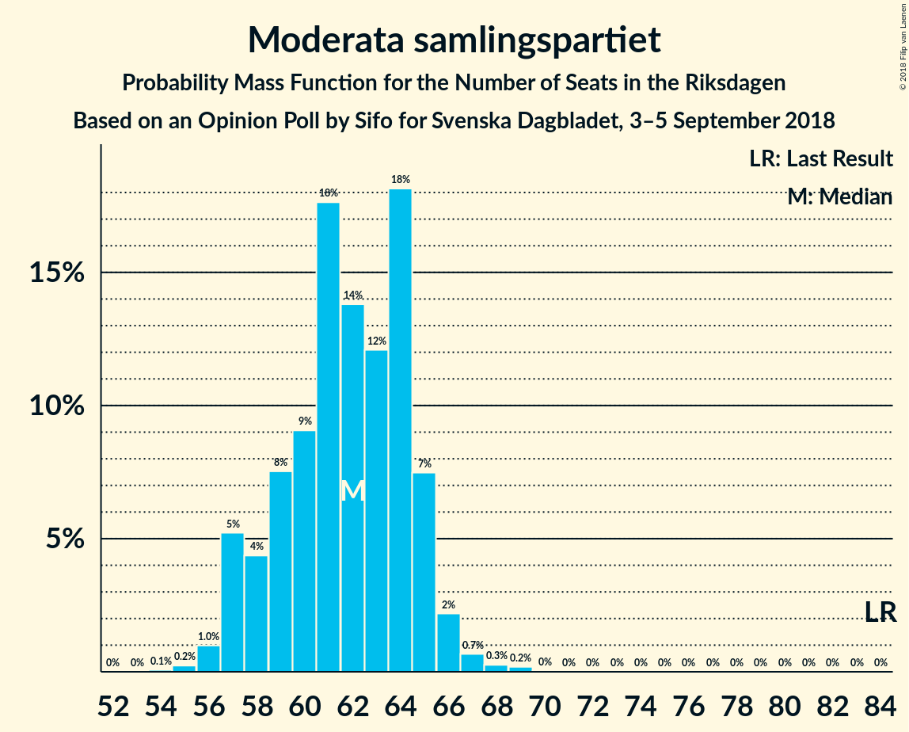
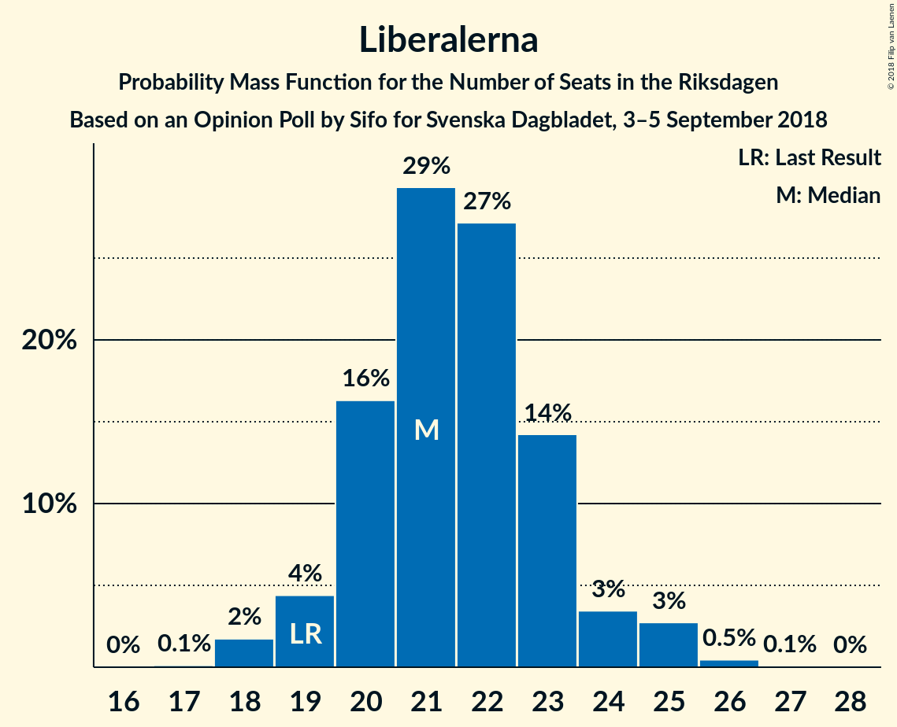

# Opinion Poll by Sifo for Svenska Dagbladet, 3–5 September 2018

<a href="#voting-intentions">Voting Intentions</a> | <a href="#seats">Seats</a> | <a href="#coalitions">Coalitions</a> | <a href="#technical-information">Technical Information</a>

## Voting Intentions

### Confidence Intervals

| Party | Last Result | Poll Result | 80% Confidence Interval | 90% Confidence Interval | 95% Confidence Interval | 99% Confidence Interval |
|:-----:|:-----------:|:-----------:|:-----------------------:|:-----------------------:|:-----------------------:|:-----------------------:|
| Sveriges socialdemokratiska arbetareparti | 31.0% | 25.1% | 24.1–26.1% |23.9–26.4% |23.6–26.6% |23.2–27.1% |
| Moderata samlingspartiet | 23.3% | 17.2% | 16.4–18.1% |16.2–18.3% |16.0–18.5% |15.6–18.9% |
| Sverigedemokraterna | 12.9% | 16.9% | 16.1–17.8% |15.9–18.0% |15.7–18.2% |15.3–18.6% |
| Vänsterpartiet | 5.7% | 10.1% | 9.5–10.8% |9.3–11.0% |9.1–11.2% |8.8–11.5% |
| Centerpartiet | 6.1% | 10.0% | 9.3–10.7% |9.2–10.9% |9.0–11.1% |8.7–11.4% |
| Miljöpartiet de gröna | 6.9% | 6.2% | 5.7–6.8% |5.6–7.0% |5.4–7.1% |5.2–7.4% |
| Liberalerna | 5.4% | 6.0% | 5.5–6.6% |5.4–6.7% |5.2–6.9% |5.0–7.1% |
| Kristdemokraterna | 4.6% | 5.9% | 5.4–6.4% |5.3–6.6% |5.1–6.7% |4.9–7.0% |
| Feministiskt initiativ | 3.1% | 1.0% | 0.8–1.3% |0.8–1.4% |0.7–1.4% |0.6–1.6% |

*Note:* The poll result column reflects the actual value used in the calculations. Published results may vary slightly, and in addition be rounded to fewer digits.

## Seats

### Confidence Intervals

| Party | Last Result | Median | 80% Confidence Interval | 90% Confidence Interval | 95% Confidence Interval | 99% Confidence Interval |
|:-----:|:-----------:|:------:|:-----------------------:|:-----------------------:|:-----------------------:|:-----------------------:|
| <a href="#sveriges-socialdemokratiska-arbetareparti">Sveriges socialdemokratiska arbetareparti</a> | 113 | 91 | 87–94 |85–96 |84–96 |83–97 |
| <a href="#moderata-samlingspartiet">Moderata samlingspartiet</a> | 84 | 62 | 58–64 |57–65 |57–66 |56–67 |
| <a href="#sverigedemokraterna">Sverigedemokraterna</a> | 49 | 60 | 57–63 |57–64 |56–65 |55–66 |
| <a href="#vänsterpartiet">Vänsterpartiet</a> | 21 | 37 | 34–38 |32–39 |32–40 |31–41 |
| <a href="#centerpartiet">Centerpartiet</a> | 22 | 36 | 34–39 |33–40 |33–40 |31–41 |
| <a href="#miljöpartiet-de-gröna">Miljöpartiet de gröna</a> | 25 | 22 | 20–24 |20–25 |20–25 |18–27 |
| <a href="#liberalerna">Liberalerna</a> | 19 | 21 | 20–23 |18–24 |18–25 |18–26 |
| <a href="#kristdemokraterna">Kristdemokraterna</a> | 16 | 21 | 19–24 |18–24 |18–24 |17–25 |
| <a href="#feministiskt-initiativ">Feministiskt initiativ</a> | 0 | 0 | 0 |0 |0 |0 |

### Sveriges socialdemokratiska arbetareparti

*For a full overview of the results for this party, see the [Sveriges socialdemokratiska arbetareparti](party-sverigessocialdemokratiskaarbetareparti.html) page.*

| Number of Seats | Probability | Accumulated | Special Marks |
|:---------------:|:-----------:|:-----------:|:-------------:|
| 81 | 0.2% | 100% |  |
| 82 | 0.1% | 99.8% |  |
| 83 | 0.7% | 99.7% |  |
| 84 | 3% | 99.1% |  |
| 85 | 1.3% | 96% |  |
| 86 | 4% | 95% |  |
| 87 | 3% | 91% |  |
| 88 | 15% | 89% |  |
| 89 | 9% | 73% |  |
| 90 | 3% | 64% |  |
| 91 | 21% | 61% | Median |
| 92 | 19% | 40% |  |
| 93 | 2% | 21% |  |
| 94 | 13% | 19% |  |
| 95 | 0.7% | 6% |  |
| 96 | 4% | 5% |  |
| 97 | 0.6% | 0.7% |  |
| 98 | 0% | 0.1% |  |
| 99 | 0% | 0% |  |
| 100 | 0% | 0% |  |
| 101 | 0% | 0% |  |
| 102 | 0% | 0% |  |
| 103 | 0% | 0% |  |
| 104 | 0% | 0% |  |
| 105 | 0% | 0% |  |
| 106 | 0% | 0% |  |
| 107 | 0% | 0% |  |
| 108 | 0% | 0% |  |
| 109 | 0% | 0% |  |
| 110 | 0% | 0% |  |
| 111 | 0% | 0% |  |
| 112 | 0% | 0% |  |
| 113 | 0% | 0% | Last Result |

### Moderata samlingspartiet

*For a full overview of the results for this party, see the [Moderata samlingspartiet](party-moderatasamlingspartiet.html) page.*

| Number of Seats | Probability | Accumulated | Special Marks |
|:---------------:|:-----------:|:-----------:|:-------------:|
| 54 | 0% | 100% |  |
| 55 | 0.1% | 99.9% |  |
| 56 | 2% | 99.9% |  |
| 57 | 7% | 98% |  |
| 58 | 8% | 91% |  |
| 59 | 11% | 83% |  |
| 60 | 11% | 72% |  |
| 61 | 10% | 61% |  |
| 62 | 24% | 51% | Median |
| 63 | 10% | 27% |  |
| 64 | 12% | 17% |  |
| 65 | 2% | 5% |  |
| 66 | 2% | 3% |  |
| 67 | 1.3% | 2% |  |
| 68 | 0.2% | 0.3% |  |
| 69 | 0.1% | 0.1% |  |
| 70 | 0% | 0% |  |
| 71 | 0% | 0% |  |
| 72 | 0% | 0% |  |
| 73 | 0% | 0% |  |
| 74 | 0% | 0% |  |
| 75 | 0% | 0% |  |
| 76 | 0% | 0% |  |
| 77 | 0% | 0% |  |
| 78 | 0% | 0% |  |
| 79 | 0% | 0% |  |
| 80 | 0% | 0% |  |
| 81 | 0% | 0% |  |
| 82 | 0% | 0% |  |
| 83 | 0% | 0% |  |
| 84 | 0% | 0% | Last Result |

### Sverigedemokraterna

*For a full overview of the results for this party, see the [Sverigedemokraterna](party-sverigedemokraterna.html) page.*

| Number of Seats | Probability | Accumulated | Special Marks |
|:---------------:|:-----------:|:-----------:|:-------------:|
| 49 | 0% | 100% | Last Result |
| 50 | 0% | 100% |  |
| 51 | 0% | 100% |  |
| 52 | 0% | 100% |  |
| 53 | 0% | 100% |  |
| 54 | 0.3% | 99.9% |  |
| 55 | 0.9% | 99.6% |  |
| 56 | 3% | 98.7% |  |
| 57 | 11% | 96% |  |
| 58 | 17% | 84% |  |
| 59 | 6% | 67% |  |
| 60 | 15% | 61% | Median |
| 61 | 21% | 46% |  |
| 62 | 15% | 25% |  |
| 63 | 4% | 10% |  |
| 64 | 2% | 6% |  |
| 65 | 2% | 4% |  |
| 66 | 1.2% | 2% |  |
| 67 | 0.2% | 0.3% |  |
| 68 | 0.1% | 0.2% |  |
| 69 | 0% | 0% |  |

### Vänsterpartiet

*For a full overview of the results for this party, see the [Vänsterpartiet](party-vänsterpartiet.html) page.*

| Number of Seats | Probability | Accumulated | Special Marks |
|:---------------:|:-----------:|:-----------:|:-------------:|
| 21 | 0% | 100% | Last Result |
| 22 | 0% | 100% |  |
| 23 | 0% | 100% |  |
| 24 | 0% | 100% |  |
| 25 | 0% | 100% |  |
| 26 | 0% | 100% |  |
| 27 | 0% | 100% |  |
| 28 | 0% | 100% |  |
| 29 | 0% | 100% |  |
| 30 | 0% | 100% |  |
| 31 | 1.0% | 100% |  |
| 32 | 7% | 99.0% |  |
| 33 | 2% | 92% |  |
| 34 | 11% | 91% |  |
| 35 | 6% | 80% |  |
| 36 | 14% | 73% |  |
| 37 | 29% | 60% | Median |
| 38 | 24% | 31% |  |
| 39 | 3% | 7% |  |
| 40 | 3% | 4% |  |
| 41 | 0.9% | 1.1% |  |
| 42 | 0.2% | 0.2% |  |
| 43 | 0% | 0% |  |

### Centerpartiet

*For a full overview of the results for this party, see the [Centerpartiet](party-centerpartiet.html) page.*

| Number of Seats | Probability | Accumulated | Special Marks |
|:---------------:|:-----------:|:-----------:|:-------------:|
| 22 | 0% | 100% | Last Result |
| 23 | 0% | 100% |  |
| 24 | 0% | 100% |  |
| 25 | 0% | 100% |  |
| 26 | 0% | 100% |  |
| 27 | 0% | 100% |  |
| 28 | 0% | 100% |  |
| 29 | 0% | 100% |  |
| 30 | 0.1% | 100% |  |
| 31 | 1.3% | 99.8% |  |
| 32 | 0.9% | 98.6% |  |
| 33 | 3% | 98% |  |
| 34 | 16% | 94% |  |
| 35 | 20% | 79% |  |
| 36 | 11% | 59% | Median |
| 37 | 16% | 47% |  |
| 38 | 16% | 31% |  |
| 39 | 7% | 15% |  |
| 40 | 7% | 8% |  |
| 41 | 0.3% | 0.7% |  |
| 42 | 0.4% | 0.4% |  |
| 43 | 0% | 0% |  |

### Miljöpartiet de gröna

*For a full overview of the results for this party, see the [Miljöpartiet de gröna](party-miljöpartietdegröna.html) page.*

| Number of Seats | Probability | Accumulated | Special Marks |
|:---------------:|:-----------:|:-----------:|:-------------:|
| 18 | 0.5% | 100% |  |
| 19 | 2% | 99.4% |  |
| 20 | 10% | 98% |  |
| 21 | 27% | 88% |  |
| 22 | 35% | 61% | Median |
| 23 | 9% | 25% |  |
| 24 | 8% | 16% |  |
| 25 | 6% | 8% | Last Result |
| 26 | 2% | 2% |  |
| 27 | 0.7% | 0.8% |  |
| 28 | 0.1% | 0.1% |  |
| 29 | 0% | 0% |  |

### Liberalerna

*For a full overview of the results for this party, see the [Liberalerna](party-liberalerna.html) page.*

| Number of Seats | Probability | Accumulated | Special Marks |
|:---------------:|:-----------:|:-----------:|:-------------:|
| 17 | 0.2% | 100% |  |
| 18 | 5% | 99.8% |  |
| 19 | 3% | 95% | Last Result |
| 20 | 14% | 92% |  |
| 21 | 32% | 78% | Median |
| 22 | 29% | 46% |  |
| 23 | 10% | 17% |  |
| 24 | 2% | 7% |  |
| 25 | 4% | 5% |  |
| 26 | 0.5% | 0.7% |  |
| 27 | 0.2% | 0.2% |  |
| 28 | 0% | 0% |  |

### Kristdemokraterna

*For a full overview of the results for this party, see the [Kristdemokraterna](party-kristdemokraterna.html) page.*

| Number of Seats | Probability | Accumulated | Special Marks |
|:---------------:|:-----------:|:-----------:|:-------------:|
| 16 | 0% | 100% | Last Result |
| 17 | 0.6% | 100% |  |
| 18 | 6% | 99.3% |  |
| 19 | 8% | 93% |  |
| 20 | 15% | 85% |  |
| 21 | 29% | 70% | Median |
| 22 | 20% | 41% |  |
| 23 | 11% | 21% |  |
| 24 | 8% | 10% |  |
| 25 | 2% | 2% |  |
| 26 | 0.1% | 0.1% |  |
| 27 | 0% | 0% |  |

### Feministiskt initiativ

*For a full overview of the results for this party, see the [Feministiskt initiativ](party-feministisktinitiativ.html) page.*

| Number of Seats | Probability | Accumulated | Special Marks |
|:---------------:|:-----------:|:-----------:|:-------------:|
| 0 | 100% | 100% | Last Result, Median |

## Coalitions

### Confidence Intervals

| Coalition | Last Result | Median | Majority? | 80% Confidence Interval | 90% Confidence Interval | 95% Confidence Interval | 99% Confidence Interval |
|:---------:|:-----------:|:------:|:---------:|:-----------------------:|:-----------------------:|:-----------------------:|:-----------------------:|
| Sveriges socialdemokratiska arbetareparti – Moderata samlingspartiet – Centerpartiet | 219 | 189 | 100% | 183–193 | 182–193 | 181–193 | 178–196 |
| Sveriges socialdemokratiska arbetareparti – Moderata samlingspartiet | 197 | 151 | 0% | 147–157 | 146–157 | 145–157 | 144–158 |
| Sveriges socialdemokratiska arbetareparti – Vänsterpartiet – Miljöpartiet de gröna – Feministiskt initiativ | 159 | 150 | 0% | 143–153 | 143–154 | 143–156 | 140–156 |
| Sveriges socialdemokratiska arbetareparti – Vänsterpartiet – Miljöpartiet de gröna | 159 | 150 | 0% | 143–153 | 143–154 | 143–156 | 140–156 |
| Moderata samlingspartiet – Sverigedemokraterna – Kristdemokraterna | 149 | 142 | 0% | 138–146 | 138–148 | 138–149 | 136–152 |
| Moderata samlingspartiet – Centerpartiet – Liberalerna – Kristdemokraterna | 141 | 139 | 0% | 136–145 | 135–145 | 134–145 | 133–147 |
| Sveriges socialdemokratiska arbetareparti – Vänsterpartiet | 134 | 128 | 0% | 122–131 | 122–132 | 120–132 | 119–133 |
| Moderata samlingspartiet – Sverigedemokraterna | 133 | 121 | 0% | 119–124 | 118–127 | 117–128 | 116–130 |
| Moderata samlingspartiet – Centerpartiet – Kristdemokraterna | 122 | 118 | 0% | 114–124 | 114–124 | 113–124 | 112–125 |
| Moderata samlingspartiet – Centerpartiet – Liberalerna | 125 | 119 | 0% | 114–123 | 113–123 | 113–124 | 111–127 |
| Sveriges socialdemokratiska arbetareparti – Miljöpartiet de gröna | 138 | 113 | 0% | 108–116 | 108–118 | 107–119 | 105–120 |
| Moderata samlingspartiet – Centerpartiet | 106 | 97 | 0% | 92–102 | 91–102 | 91–103 | 90–104 |

### Sveriges socialdemokratiska arbetareparti – Moderata samlingspartiet – Centerpartiet

| Number of Seats | Probability | Accumulated | Special Marks |
|:---------------:|:-----------:|:-----------:|:-------------:|
| 178 | 0.5% | 100% |  |
| 179 | 0.4% | 99.5% |  |
| 180 | 1.1% | 99.1% |  |
| 181 | 1.4% | 98% |  |
| 182 | 3% | 97% |  |
| 183 | 9% | 94% |  |
| 184 | 3% | 84% |  |
| 185 | 7% | 82% |  |
| 186 | 10% | 74% |  |
| 187 | 11% | 64% |  |
| 188 | 2% | 54% |  |
| 189 | 15% | 52% | Median |
| 190 | 10% | 37% |  |
| 191 | 2% | 27% |  |
| 192 | 14% | 25% |  |
| 193 | 10% | 11% |  |
| 194 | 0.2% | 1.1% |  |
| 195 | 0.2% | 0.9% |  |
| 196 | 0.6% | 0.7% |  |
| 197 | 0.1% | 0.1% |  |
| 198 | 0% | 0% |  |
| 199 | 0% | 0% |  |
| 200 | 0% | 0% |  |
| 201 | 0% | 0% |  |
| 202 | 0% | 0% |  |
| 203 | 0% | 0% |  |
| 204 | 0% | 0% |  |
| 205 | 0% | 0% |  |
| 206 | 0% | 0% |  |
| 207 | 0% | 0% |  |
| 208 | 0% | 0% |  |
| 209 | 0% | 0% |  |
| 210 | 0% | 0% |  |
| 211 | 0% | 0% |  |
| 212 | 0% | 0% |  |
| 213 | 0% | 0% |  |
| 214 | 0% | 0% |  |
| 215 | 0% | 0% |  |
| 216 | 0% | 0% |  |
| 217 | 0% | 0% |  |
| 218 | 0% | 0% |  |
| 219 | 0% | 0% | Last Result |

### Sveriges socialdemokratiska arbetareparti – Moderata samlingspartiet

| Number of Seats | Probability | Accumulated | Special Marks |
|:---------------:|:-----------:|:-----------:|:-------------:|
| 142 | 0.2% | 100% |  |
| 143 | 0% | 99.8% |  |
| 144 | 0.8% | 99.7% |  |
| 145 | 1.5% | 98.9% |  |
| 146 | 4% | 97% |  |
| 147 | 7% | 94% |  |
| 148 | 10% | 86% |  |
| 149 | 9% | 77% |  |
| 150 | 17% | 67% |  |
| 151 | 2% | 51% |  |
| 152 | 2% | 49% |  |
| 153 | 4% | 47% | Median |
| 154 | 11% | 43% |  |
| 155 | 13% | 31% |  |
| 156 | 7% | 18% |  |
| 157 | 10% | 11% |  |
| 158 | 0.9% | 1.2% |  |
| 159 | 0.1% | 0.2% |  |
| 160 | 0% | 0.1% |  |
| 161 | 0% | 0.1% |  |
| 162 | 0% | 0% |  |
| 163 | 0% | 0% |  |
| 164 | 0% | 0% |  |
| 165 | 0% | 0% |  |
| 166 | 0% | 0% |  |
| 167 | 0% | 0% |  |
| 168 | 0% | 0% |  |
| 169 | 0% | 0% |  |
| 170 | 0% | 0% |  |
| 171 | 0% | 0% |  |
| 172 | 0% | 0% |  |
| 173 | 0% | 0% |  |
| 174 | 0% | 0% |  |
| 175 | 0% | 0% | Majority |
| 176 | 0% | 0% |  |
| 177 | 0% | 0% |  |
| 178 | 0% | 0% |  |
| 179 | 0% | 0% |  |
| 180 | 0% | 0% |  |
| 181 | 0% | 0% |  |
| 182 | 0% | 0% |  |
| 183 | 0% | 0% |  |
| 184 | 0% | 0% |  |
| 185 | 0% | 0% |  |
| 186 | 0% | 0% |  |
| 187 | 0% | 0% |  |
| 188 | 0% | 0% |  |
| 189 | 0% | 0% |  |
| 190 | 0% | 0% |  |
| 191 | 0% | 0% |  |
| 192 | 0% | 0% |  |
| 193 | 0% | 0% |  |
| 194 | 0% | 0% |  |
| 195 | 0% | 0% |  |
| 196 | 0% | 0% |  |
| 197 | 0% | 0% | Last Result |

### Sveriges socialdemokratiska arbetareparti – Vänsterpartiet – Miljöpartiet de gröna – Feministiskt initiativ

| Number of Seats | Probability | Accumulated | Special Marks |
|:---------------:|:-----------:|:-----------:|:-------------:|
| 139 | 0.1% | 100% |  |
| 140 | 0.9% | 99.9% |  |
| 141 | 0.4% | 99.0% |  |
| 142 | 0.4% | 98.6% |  |
| 143 | 9% | 98% |  |
| 144 | 7% | 89% |  |
| 145 | 6% | 82% |  |
| 146 | 1.0% | 77% |  |
| 147 | 9% | 76% |  |
| 148 | 3% | 66% |  |
| 149 | 4% | 63% |  |
| 150 | 24% | 59% | Median |
| 151 | 9% | 35% |  |
| 152 | 15% | 26% |  |
| 153 | 3% | 11% |  |
| 154 | 4% | 9% |  |
| 155 | 1.1% | 4% |  |
| 156 | 3% | 3% |  |
| 157 | 0% | 0.1% |  |
| 158 | 0.1% | 0.1% |  |
| 159 | 0% | 0% | Last Result |

### Sveriges socialdemokratiska arbetareparti – Vänsterpartiet – Miljöpartiet de gröna

| Number of Seats | Probability | Accumulated | Special Marks |
|:---------------:|:-----------:|:-----------:|:-------------:|
| 139 | 0.1% | 100% |  |
| 140 | 0.9% | 99.9% |  |
| 141 | 0.4% | 99.0% |  |
| 142 | 0.4% | 98.6% |  |
| 143 | 9% | 98% |  |
| 144 | 7% | 89% |  |
| 145 | 6% | 82% |  |
| 146 | 1.0% | 77% |  |
| 147 | 9% | 76% |  |
| 148 | 3% | 66% |  |
| 149 | 4% | 63% |  |
| 150 | 24% | 59% | Median |
| 151 | 9% | 35% |  |
| 152 | 15% | 26% |  |
| 153 | 3% | 11% |  |
| 154 | 4% | 9% |  |
| 155 | 1.1% | 4% |  |
| 156 | 3% | 3% |  |
| 157 | 0% | 0.1% |  |
| 158 | 0.1% | 0.1% |  |
| 159 | 0% | 0% | Last Result |

### Moderata samlingspartiet – Sverigedemokraterna – Kristdemokraterna

| Number of Seats | Probability | Accumulated | Special Marks |
|:---------------:|:-----------:|:-----------:|:-------------:|
| 134 | 0.1% | 100% |  |
| 135 | 0.1% | 99.9% |  |
| 136 | 0.4% | 99.7% |  |
| 137 | 0.5% | 99.3% |  |
| 138 | 12% | 98.8% |  |
| 139 | 3% | 86% |  |
| 140 | 3% | 83% |  |
| 141 | 28% | 80% |  |
| 142 | 13% | 52% |  |
| 143 | 7% | 39% | Median |
| 144 | 3% | 32% |  |
| 145 | 14% | 29% |  |
| 146 | 8% | 14% |  |
| 147 | 2% | 7% |  |
| 148 | 3% | 5% |  |
| 149 | 1.0% | 3% | Last Result |
| 150 | 0.4% | 2% |  |
| 151 | 0.1% | 1.3% |  |
| 152 | 1.0% | 1.1% |  |
| 153 | 0.1% | 0.1% |  |
| 154 | 0% | 0% |  |

### Moderata samlingspartiet – Centerpartiet – Liberalerna – Kristdemokraterna

| Number of Seats | Probability | Accumulated | Special Marks |
|:---------------:|:-----------:|:-----------:|:-------------:|
| 131 | 0.1% | 100% |  |
| 132 | 0.1% | 99.9% |  |
| 133 | 1.3% | 99.8% |  |
| 134 | 2% | 98% |  |
| 135 | 5% | 97% |  |
| 136 | 10% | 92% |  |
| 137 | 5% | 82% |  |
| 138 | 6% | 77% |  |
| 139 | 23% | 71% |  |
| 140 | 2% | 48% | Median |
| 141 | 10% | 46% | Last Result |
| 142 | 12% | 36% |  |
| 143 | 10% | 24% |  |
| 144 | 2% | 14% |  |
| 145 | 10% | 13% |  |
| 146 | 1.1% | 2% |  |
| 147 | 0.8% | 1.2% |  |
| 148 | 0.2% | 0.4% |  |
| 149 | 0.2% | 0.2% |  |
| 150 | 0.1% | 0.1% |  |
| 151 | 0% | 0% |  |

### Sveriges socialdemokratiska arbetareparti – Vänsterpartiet

| Number of Seats | Probability | Accumulated | Special Marks |
|:---------------:|:-----------:|:-----------:|:-------------:|
| 117 | 0.2% | 100% |  |
| 118 | 0.1% | 99.8% |  |
| 119 | 2% | 99.6% |  |
| 120 | 1.0% | 98% |  |
| 121 | 1.4% | 97% |  |
| 122 | 9% | 96% |  |
| 123 | 4% | 86% |  |
| 124 | 9% | 82% |  |
| 125 | 4% | 73% |  |
| 126 | 8% | 69% |  |
| 127 | 8% | 61% |  |
| 128 | 19% | 53% | Median |
| 129 | 4% | 34% |  |
| 130 | 16% | 30% |  |
| 131 | 7% | 13% |  |
| 132 | 5% | 6% |  |
| 133 | 0.6% | 0.8% |  |
| 134 | 0% | 0.2% | Last Result |
| 135 | 0% | 0.1% |  |
| 136 | 0% | 0.1% |  |
| 137 | 0% | 0.1% |  |
| 138 | 0% | 0% |  |

### Moderata samlingspartiet – Sverigedemokraterna

| Number of Seats | Probability | Accumulated | Special Marks |
|:---------------:|:-----------:|:-----------:|:-------------:|
| 112 | 0.2% | 100% |  |
| 113 | 0.1% | 99.8% |  |
| 114 | 0% | 99.8% |  |
| 115 | 0.1% | 99.7% |  |
| 116 | 0.5% | 99.6% |  |
| 117 | 3% | 99.1% |  |
| 118 | 3% | 96% |  |
| 119 | 24% | 93% |  |
| 120 | 19% | 69% |  |
| 121 | 17% | 51% |  |
| 122 | 7% | 34% | Median |
| 123 | 11% | 27% |  |
| 124 | 8% | 16% |  |
| 125 | 1.3% | 8% |  |
| 126 | 2% | 7% |  |
| 127 | 2% | 5% |  |
| 128 | 2% | 3% |  |
| 129 | 0.9% | 1.4% |  |
| 130 | 0.2% | 0.6% |  |
| 131 | 0.1% | 0.4% |  |
| 132 | 0.2% | 0.2% |  |
| 133 | 0% | 0% | Last Result |

### Moderata samlingspartiet – Centerpartiet – Kristdemokraterna

| Number of Seats | Probability | Accumulated | Special Marks |
|:---------------:|:-----------:|:-----------:|:-------------:|
| 110 | 0.1% | 100% |  |
| 111 | 0.1% | 99.8% |  |
| 112 | 2% | 99.7% |  |
| 113 | 2% | 98% |  |
| 114 | 8% | 96% |  |
| 115 | 1.1% | 88% |  |
| 116 | 14% | 87% |  |
| 117 | 6% | 73% |  |
| 118 | 24% | 66% |  |
| 119 | 7% | 42% | Median |
| 120 | 4% | 35% |  |
| 121 | 8% | 31% |  |
| 122 | 11% | 23% | Last Result |
| 123 | 1.1% | 12% |  |
| 124 | 10% | 11% |  |
| 125 | 0.8% | 1.2% |  |
| 126 | 0.2% | 0.5% |  |
| 127 | 0.2% | 0.3% |  |
| 128 | 0% | 0% |  |

### Moderata samlingspartiet – Centerpartiet – Liberalerna

| Number of Seats | Probability | Accumulated | Special Marks |
|:---------------:|:-----------:|:-----------:|:-------------:|
| 110 | 0% | 100% |  |
| 111 | 2% | 99.9% |  |
| 112 | 0.3% | 98% |  |
| 113 | 7% | 98% |  |
| 114 | 5% | 91% |  |
| 115 | 2% | 85% |  |
| 116 | 6% | 83% |  |
| 117 | 9% | 77% |  |
| 118 | 11% | 68% |  |
| 119 | 14% | 57% | Median |
| 120 | 10% | 43% |  |
| 121 | 8% | 34% |  |
| 122 | 12% | 26% |  |
| 123 | 11% | 14% |  |
| 124 | 2% | 4% |  |
| 125 | 0.5% | 1.2% | Last Result |
| 126 | 0.2% | 0.7% |  |
| 127 | 0.3% | 0.5% |  |
| 128 | 0.1% | 0.2% |  |
| 129 | 0% | 0.1% |  |
| 130 | 0.1% | 0.1% |  |
| 131 | 0% | 0% |  |

### Sveriges socialdemokratiska arbetareparti – Miljöpartiet de gröna

| Number of Seats | Probability | Accumulated | Special Marks |
|:---------------:|:-----------:|:-----------:|:-------------:|
| 102 | 0.1% | 100% |  |
| 103 | 0.1% | 99.9% |  |
| 104 | 0.2% | 99.8% |  |
| 105 | 1.1% | 99.6% |  |
| 106 | 0.2% | 98.5% |  |
| 107 | 1.3% | 98% |  |
| 108 | 10% | 97% |  |
| 109 | 11% | 87% |  |
| 110 | 4% | 77% |  |
| 111 | 4% | 73% |  |
| 112 | 7% | 69% |  |
| 113 | 26% | 62% | Median |
| 114 | 12% | 37% |  |
| 115 | 11% | 25% |  |
| 116 | 4% | 13% |  |
| 117 | 0.2% | 9% |  |
| 118 | 5% | 9% |  |
| 119 | 3% | 4% |  |
| 120 | 0.7% | 0.7% |  |
| 121 | 0% | 0% |  |
| 122 | 0% | 0% |  |
| 123 | 0% | 0% |  |
| 124 | 0% | 0% |  |
| 125 | 0% | 0% |  |
| 126 | 0% | 0% |  |
| 127 | 0% | 0% |  |
| 128 | 0% | 0% |  |
| 129 | 0% | 0% |  |
| 130 | 0% | 0% |  |
| 131 | 0% | 0% |  |
| 132 | 0% | 0% |  |
| 133 | 0% | 0% |  |
| 134 | 0% | 0% |  |
| 135 | 0% | 0% |  |
| 136 | 0% | 0% |  |
| 137 | 0% | 0% |  |
| 138 | 0% | 0% | Last Result |

### Moderata samlingspartiet – Centerpartiet

| Number of Seats | Probability | Accumulated | Special Marks |
|:---------------:|:-----------:|:-----------:|:-------------:|
| 90 | 2% | 100% |  |
| 91 | 7% | 98% |  |
| 92 | 1.1% | 91% |  |
| 93 | 2% | 90% |  |
| 94 | 0.8% | 88% |  |
| 95 | 4% | 87% |  |
| 96 | 18% | 83% |  |
| 97 | 25% | 65% |  |
| 98 | 13% | 40% | Median |
| 99 | 3% | 26% |  |
| 100 | 0.7% | 23% |  |
| 101 | 1.4% | 23% |  |
| 102 | 18% | 21% |  |
| 103 | 2% | 3% |  |
| 104 | 1.2% | 1.3% |  |
| 105 | 0.1% | 0.2% |  |
| 106 | 0% | 0% | Last Result |

## Technical Information

### Opinion Poll

+ **Polling firm:** Sifo
+ **Commissioner(s):** Svenska Dagbladet
+ **Fieldwork period:** 3–5 September 2018

### Calculations

+ **Sample size:** 3364
+ **Simulations done:** 131,072
+ **Error estimate:** 1.11%

