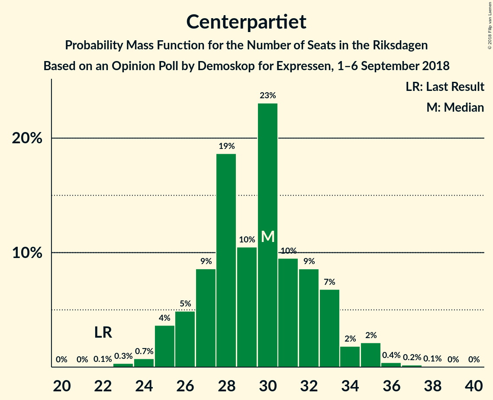

# Opinion Poll by Demoskop for Expressen, 1–6 September 2018

<a href="#voting-intentions">Voting Intentions</a> | <a href="#seats">Seats</a> | <a href="#coalitions">Coalitions</a> | <a href="#technical-information">Technical Information</a>

## Voting Intentions

### Confidence Intervals

| Party | Last Result | Poll Result | 80% Confidence Interval | 90% Confidence Interval | 95% Confidence Interval | 99% Confidence Interval |
|:-----:|:-----------:|:-----------:|:-----------------------:|:-----------------------:|:-----------------------:|:-----------------------:|
| Sveriges socialdemokratiska arbetareparti | 31.0% | 26.5% | 25.1–27.9% |24.7–28.3% |24.4–28.7% |23.8–29.3% |
| Moderata samlingspartiet | 23.3% | 17.9% | 16.7–19.1% |16.4–19.5% |16.1–19.8% |15.6–20.4% |
| Sverigedemokraterna | 12.9% | 17.2% | 16.1–18.5% |15.7–18.8% |15.5–19.1% |14.9–19.7% |
| Vänsterpartiet | 5.7% | 9.8% | 8.9–10.8% |8.7–11.1% |8.5–11.3% |8.1–11.8% |
| Centerpartiet | 6.1% | 8.2% | 7.4–9.1% |7.1–9.4% |7.0–9.6% |6.6–10.1% |
| Liberalerna | 5.4% | 6.2% | 5.5–7.0% |5.3–7.3% |5.2–7.5% |4.8–7.9% |
| Kristdemokraterna | 4.6% | 6.0% | 5.3–6.8% |5.1–7.0% |4.9–7.2% |4.6–7.6% |
| Miljöpartiet de gröna | 6.9% | 5.3% | 4.7–6.1% |4.5–6.3% |4.3–6.5% |4.1–6.9% |

*Note:* The poll result column reflects the actual value used in the calculations. Published results may vary slightly, and in addition be rounded to fewer digits.

## Seats

### Confidence Intervals

| Party | Last Result | Median | 80% Confidence Interval | 90% Confidence Interval | 95% Confidence Interval | 99% Confidence Interval |
|:-----:|:-----------:|:------:|:-----------------------:|:-----------------------:|:-----------------------:|:-----------------------:|
| <a href="#sveriges-socialdemokratiska-arbetareparti">Sveriges socialdemokratiska arbetareparti</a> | 113 | 97 | 90–100 |89–100 |88–101 |87–105 |
| <a href="#moderata-samlingspartiet">Moderata samlingspartiet</a> | 84 | 64 | 60–67 |59–69 |58–70 |56–73 |
| <a href="#sverigedemokraterna">Sverigedemokraterna</a> | 49 | 62 | 58–66 |57–67 |56–68 |54–71 |
| <a href="#vänsterpartiet">Vänsterpartiet</a> | 21 | 34 | 32–39 |31–40 |30–40 |29–42 |
| <a href="#centerpartiet">Centerpartiet</a> | 22 | 30 | 27–33 |26–33 |25–35 |24–36 |
| <a href="#liberalerna">Liberalerna</a> | 19 | 21 | 20–24 |20–25 |19–26 |18–28 |
| <a href="#kristdemokraterna">Kristdemokraterna</a> | 16 | 21 | 19–24 |18–25 |17–26 |17–27 |
| <a href="#miljöpartiet-de-gröna">Miljöpartiet de gröna</a> | 25 | 19 | 17–21 |16–22 |15–23 |15–24 |

### Sveriges socialdemokratiska arbetareparti

*For a full overview of the results for this party, see the [Sveriges socialdemokratiska arbetareparti](party-sverigessocialdemokratiskaarbetareparti.html) page.*

| Number of Seats | Probability | Accumulated | Special Marks |
|:---------------:|:-----------:|:-----------:|:-------------:|
| 83 | 0% | 100% |  |
| 84 | 0.1% | 99.9% |  |
| 85 | 0.1% | 99.9% |  |
| 86 | 0.2% | 99.8% |  |
| 87 | 1.4% | 99.5% |  |
| 88 | 2% | 98% |  |
| 89 | 5% | 96% |  |
| 90 | 5% | 91% |  |
| 91 | 8% | 86% |  |
| 92 | 3% | 78% |  |
| 93 | 2% | 74% |  |
| 94 | 4% | 72% |  |
| 95 | 7% | 69% |  |
| 96 | 6% | 62% |  |
| 97 | 17% | 56% | Median |
| 98 | 22% | 39% |  |
| 99 | 5% | 18% |  |
| 100 | 9% | 12% |  |
| 101 | 1.2% | 4% |  |
| 102 | 0.9% | 2% |  |
| 103 | 0.3% | 1.5% |  |
| 104 | 0.5% | 1.1% |  |
| 105 | 0.3% | 0.7% |  |
| 106 | 0.2% | 0.4% |  |
| 107 | 0.1% | 0.2% |  |
| 108 | 0.1% | 0.1% |  |
| 109 | 0% | 0% |  |
| 110 | 0% | 0% |  |
| 111 | 0% | 0% |  |
| 112 | 0% | 0% |  |
| 113 | 0% | 0% | Last Result |

### Moderata samlingspartiet

*For a full overview of the results for this party, see the [Moderata samlingspartiet](party-moderatasamlingspartiet.html) page.*

| Number of Seats | Probability | Accumulated | Special Marks |
|:---------------:|:-----------:|:-----------:|:-------------:|
| 54 | 0.1% | 100% |  |
| 55 | 0.2% | 99.9% |  |
| 56 | 0.4% | 99.7% |  |
| 57 | 0.7% | 99.3% |  |
| 58 | 2% | 98.5% |  |
| 59 | 3% | 96% |  |
| 60 | 9% | 93% |  |
| 61 | 7% | 84% |  |
| 62 | 10% | 77% |  |
| 63 | 9% | 67% |  |
| 64 | 16% | 58% | Median |
| 65 | 9% | 43% |  |
| 66 | 18% | 33% |  |
| 67 | 8% | 15% |  |
| 68 | 2% | 8% |  |
| 69 | 2% | 5% |  |
| 70 | 1.2% | 3% |  |
| 71 | 0.7% | 2% |  |
| 72 | 0.3% | 0.9% |  |
| 73 | 0.4% | 0.6% |  |
| 74 | 0.2% | 0.2% |  |
| 75 | 0% | 0.1% |  |
| 76 | 0% | 0% |  |
| 77 | 0% | 0% |  |
| 78 | 0% | 0% |  |
| 79 | 0% | 0% |  |
| 80 | 0% | 0% |  |
| 81 | 0% | 0% |  |
| 82 | 0% | 0% |  |
| 83 | 0% | 0% |  |
| 84 | 0% | 0% | Last Result |

### Sverigedemokraterna

*For a full overview of the results for this party, see the [Sverigedemokraterna](party-sverigedemokraterna.html) page.*

| Number of Seats | Probability | Accumulated | Special Marks |
|:---------------:|:-----------:|:-----------:|:-------------:|
| 49 | 0% | 100% | Last Result |
| 50 | 0% | 100% |  |
| 51 | 0% | 100% |  |
| 52 | 0% | 100% |  |
| 53 | 0.2% | 99.9% |  |
| 54 | 0.4% | 99.8% |  |
| 55 | 0.9% | 99.4% |  |
| 56 | 1.1% | 98% |  |
| 57 | 4% | 97% |  |
| 58 | 4% | 93% |  |
| 59 | 9% | 89% |  |
| 60 | 10% | 81% |  |
| 61 | 7% | 71% |  |
| 62 | 13% | 63% | Median |
| 63 | 23% | 50% |  |
| 64 | 10% | 27% |  |
| 65 | 4% | 17% |  |
| 66 | 7% | 14% |  |
| 67 | 2% | 7% |  |
| 68 | 3% | 5% |  |
| 69 | 0.9% | 2% |  |
| 70 | 0.3% | 1.1% |  |
| 71 | 0.6% | 0.8% |  |
| 72 | 0.2% | 0.3% |  |
| 73 | 0.1% | 0.1% |  |
| 74 | 0% | 0% |  |

### Vänsterpartiet

*For a full overview of the results for this party, see the [Vänsterpartiet](party-vänsterpartiet.html) page.*

| Number of Seats | Probability | Accumulated | Special Marks |
|:---------------:|:-----------:|:-----------:|:-------------:|
| 21 | 0% | 100% | Last Result |
| 22 | 0% | 100% |  |
| 23 | 0% | 100% |  |
| 24 | 0% | 100% |  |
| 25 | 0% | 100% |  |
| 26 | 0% | 100% |  |
| 27 | 0% | 100% |  |
| 28 | 0.2% | 99.9% |  |
| 29 | 1.0% | 99.7% |  |
| 30 | 1.5% | 98.8% |  |
| 31 | 3% | 97% |  |
| 32 | 10% | 94% |  |
| 33 | 13% | 84% |  |
| 34 | 21% | 71% | Median |
| 35 | 11% | 50% |  |
| 36 | 8% | 39% |  |
| 37 | 9% | 30% |  |
| 38 | 11% | 22% |  |
| 39 | 6% | 11% |  |
| 40 | 3% | 5% |  |
| 41 | 1.5% | 2% |  |
| 42 | 0.4% | 0.8% |  |
| 43 | 0.2% | 0.4% |  |
| 44 | 0.1% | 0.1% |  |
| 45 | 0% | 0% |  |

### Centerpartiet

*For a full overview of the results for this party, see the [Centerpartiet](party-centerpartiet.html) page.*

| Number of Seats | Probability | Accumulated | Special Marks |
|:---------------:|:-----------:|:-----------:|:-------------:|
| 22 | 0% | 100% | Last Result |
| 23 | 0.4% | 100% |  |
| 24 | 0.3% | 99.6% |  |
| 25 | 4% | 99.2% |  |
| 26 | 5% | 96% |  |
| 27 | 3% | 91% |  |
| 28 | 27% | 87% |  |
| 29 | 3% | 60% |  |
| 30 | 30% | 57% | Median |
| 31 | 5% | 27% |  |
| 32 | 10% | 21% |  |
| 33 | 7% | 11% |  |
| 34 | 1.1% | 4% |  |
| 35 | 2% | 3% |  |
| 36 | 0.3% | 0.6% |  |
| 37 | 0.3% | 0.3% |  |
| 38 | 0% | 0.1% |  |
| 39 | 0% | 0% |  |

### Liberalerna

*For a full overview of the results for this party, see the [Liberalerna](party-liberalerna.html) page.*

| Number of Seats | Probability | Accumulated | Special Marks |
|:---------------:|:-----------:|:-----------:|:-------------:|
| 16 | 0% | 100% |  |
| 17 | 0.1% | 99.9% |  |
| 18 | 2% | 99.9% |  |
| 19 | 2% | 98% | Last Result |
| 20 | 10% | 96% |  |
| 21 | 37% | 86% | Median |
| 22 | 12% | 49% |  |
| 23 | 25% | 37% |  |
| 24 | 3% | 12% |  |
| 25 | 6% | 9% |  |
| 26 | 1.4% | 3% |  |
| 27 | 0.7% | 1.5% |  |
| 28 | 0.5% | 0.8% |  |
| 29 | 0.1% | 0.3% |  |
| 30 | 0.2% | 0.2% |  |
| 31 | 0% | 0% |  |

### Kristdemokraterna

*For a full overview of the results for this party, see the [Kristdemokraterna](party-kristdemokraterna.html) page.*

| Number of Seats | Probability | Accumulated | Special Marks |
|:---------------:|:-----------:|:-----------:|:-------------:|
| 16 | 0.4% | 100% | Last Result |
| 17 | 3% | 99.6% |  |
| 18 | 3% | 97% |  |
| 19 | 6% | 94% |  |
| 20 | 23% | 88% |  |
| 21 | 18% | 65% | Median |
| 22 | 22% | 46% |  |
| 23 | 8% | 25% |  |
| 24 | 8% | 17% |  |
| 25 | 4% | 8% |  |
| 26 | 3% | 5% |  |
| 27 | 0.8% | 1.1% |  |
| 28 | 0.2% | 0.3% |  |
| 29 | 0.1% | 0.1% |  |
| 30 | 0% | 0% |  |

### Miljöpartiet de gröna

*For a full overview of the results for this party, see the [Miljöpartiet de gröna](party-miljöpartietdegröna.html) page.*

| Number of Seats | Probability | Accumulated | Special Marks |
|:---------------:|:-----------:|:-----------:|:-------------:|
| 0 | 0.2% | 100% |  |
| 1 | 0% | 99.8% |  |
| 2 | 0% | 99.8% |  |
| 3 | 0% | 99.8% |  |
| 4 | 0% | 99.8% |  |
| 5 | 0% | 99.8% |  |
| 6 | 0% | 99.8% |  |
| 7 | 0% | 99.8% |  |
| 8 | 0% | 99.8% |  |
| 9 | 0% | 99.8% |  |
| 10 | 0% | 99.8% |  |
| 11 | 0% | 99.8% |  |
| 12 | 0% | 99.8% |  |
| 13 | 0% | 99.8% |  |
| 14 | 0.1% | 99.8% |  |
| 15 | 2% | 99.7% |  |
| 16 | 4% | 97% |  |
| 17 | 12% | 94% |  |
| 18 | 12% | 81% |  |
| 19 | 29% | 69% | Median |
| 20 | 16% | 40% |  |
| 21 | 14% | 24% |  |
| 22 | 6% | 10% |  |
| 23 | 2% | 4% |  |
| 24 | 1.3% | 2% |  |
| 25 | 0.3% | 0.5% | Last Result |
| 26 | 0.2% | 0.2% |  |
| 27 | 0% | 0% |  |

## Coalitions

### Confidence Intervals

| Coalition | Last Result | Median | Majority? | 80% Confidence Interval | 90% Confidence Interval | 95% Confidence Interval | 99% Confidence Interval |
|:---------:|:-----------:|:------:|:---------:|:-----------------------:|:-----------------------:|:-----------------------:|:-----------------------:|
| Sveriges socialdemokratiska arbetareparti – Moderata samlingspartiet – Centerpartiet | 219 | 190 | 99.9% | 184–194 | 181–196 | 179–196 | 176–199 |
| Sveriges socialdemokratiska arbetareparti – Moderata samlingspartiet | 197 | 160 | 0% | 152–164 | 151–165 | 150–166 | 148–171 |
| Sveriges socialdemokratiska arbetareparti – Vänsterpartiet – Miljöpartiet de gröna | 159 | 151 | 0% | 144–155 | 142–157 | 141–157 | 138–160 |
| Moderata samlingspartiet – Sverigedemokraterna – Kristdemokraterna | 149 | 148 | 0% | 141–152 | 140–154 | 139–156 | 137–160 |
| Moderata samlingspartiet – Centerpartiet – Liberalerna – Kristdemokraterna | 141 | 137 | 0% | 132–141 | 131–144 | 129–145 | 128–148 |
| Sveriges socialdemokratiska arbetareparti – Vänsterpartiet | 134 | 131 | 0% | 124–136 | 124–138 | 122–138 | 120–141 |
| Moderata samlingspartiet – Sverigedemokraterna | 133 | 126 | 0% | 120–131 | 119–132 | 118–133 | 115–137 |
| Moderata samlingspartiet – Centerpartiet – Liberalerna | 125 | 115 | 0% | 111–120 | 109–121 | 108–123 | 106–126 |
| Moderata samlingspartiet – Centerpartiet – Kristdemokraterna | 122 | 114 | 0% | 110–120 | 109–121 | 107–123 | 105–126 |
| Sveriges socialdemokratiska arbetareparti – Miljöpartiet de gröna | 138 | 116 | 0% | 109–119 | 107–121 | 106–121 | 104–124 |
| Moderata samlingspartiet – Centerpartiet | 106 | 94 | 0% | 89–98 | 88–99 | 86–100 | 84–104 |

### Sveriges socialdemokratiska arbetareparti – Moderata samlingspartiet – Centerpartiet

| Number of Seats | Probability | Accumulated | Special Marks |
|:---------------:|:-----------:|:-----------:|:-------------:|
| 174 | 0.1% | 100% |  |
| 175 | 0.4% | 99.9% | Majority |
| 176 | 0.1% | 99.5% |  |
| 177 | 0.2% | 99.4% |  |
| 178 | 0.6% | 99.2% |  |
| 179 | 1.3% | 98.6% |  |
| 180 | 1.2% | 97% |  |
| 181 | 1.2% | 96% |  |
| 182 | 1.0% | 95% |  |
| 183 | 3% | 94% |  |
| 184 | 10% | 91% |  |
| 185 | 3% | 81% |  |
| 186 | 10% | 78% |  |
| 187 | 3% | 69% |  |
| 188 | 5% | 65% |  |
| 189 | 8% | 60% |  |
| 190 | 8% | 53% |  |
| 191 | 11% | 45% | Median |
| 192 | 20% | 34% |  |
| 193 | 3% | 14% |  |
| 194 | 4% | 11% |  |
| 195 | 0.9% | 7% |  |
| 196 | 4% | 6% |  |
| 197 | 0.5% | 2% |  |
| 198 | 0.7% | 2% |  |
| 199 | 0.6% | 1.0% |  |
| 200 | 0.1% | 0.4% |  |
| 201 | 0% | 0.3% |  |
| 202 | 0.1% | 0.3% |  |
| 203 | 0.1% | 0.1% |  |
| 204 | 0% | 0.1% |  |
| 205 | 0% | 0.1% |  |
| 206 | 0% | 0% |  |
| 207 | 0% | 0% |  |
| 208 | 0% | 0% |  |
| 209 | 0% | 0% |  |
| 210 | 0% | 0% |  |
| 211 | 0% | 0% |  |
| 212 | 0% | 0% |  |
| 213 | 0% | 0% |  |
| 214 | 0% | 0% |  |
| 215 | 0% | 0% |  |
| 216 | 0% | 0% |  |
| 217 | 0% | 0% |  |
| 218 | 0% | 0% |  |
| 219 | 0% | 0% | Last Result |

### Sveriges socialdemokratiska arbetareparti – Moderata samlingspartiet

| Number of Seats | Probability | Accumulated | Special Marks |
|:---------------:|:-----------:|:-----------:|:-------------:|
| 145 | 0% | 100% |  |
| 146 | 0% | 99.9% |  |
| 147 | 0.3% | 99.9% |  |
| 148 | 0.5% | 99.6% |  |
| 149 | 0.6% | 99.0% |  |
| 150 | 2% | 98% |  |
| 151 | 3% | 96% |  |
| 152 | 5% | 94% |  |
| 153 | 2% | 89% |  |
| 154 | 5% | 87% |  |
| 155 | 2% | 83% |  |
| 156 | 8% | 81% |  |
| 157 | 4% | 73% |  |
| 158 | 3% | 69% |  |
| 159 | 9% | 66% |  |
| 160 | 10% | 56% |  |
| 161 | 12% | 46% | Median |
| 162 | 5% | 33% |  |
| 163 | 3% | 29% |  |
| 164 | 19% | 26% |  |
| 165 | 2% | 7% |  |
| 166 | 2% | 5% |  |
| 167 | 0.7% | 2% |  |
| 168 | 0.3% | 2% |  |
| 169 | 0.2% | 1.4% |  |
| 170 | 0.7% | 1.2% |  |
| 171 | 0.2% | 0.5% |  |
| 172 | 0.1% | 0.3% |  |
| 173 | 0.1% | 0.2% |  |
| 174 | 0% | 0.1% |  |
| 175 | 0% | 0% | Majority |
| 176 | 0% | 0% |  |
| 177 | 0% | 0% |  |
| 178 | 0% | 0% |  |
| 179 | 0% | 0% |  |
| 180 | 0% | 0% |  |
| 181 | 0% | 0% |  |
| 182 | 0% | 0% |  |
| 183 | 0% | 0% |  |
| 184 | 0% | 0% |  |
| 185 | 0% | 0% |  |
| 186 | 0% | 0% |  |
| 187 | 0% | 0% |  |
| 188 | 0% | 0% |  |
| 189 | 0% | 0% |  |
| 190 | 0% | 0% |  |
| 191 | 0% | 0% |  |
| 192 | 0% | 0% |  |
| 193 | 0% | 0% |  |
| 194 | 0% | 0% |  |
| 195 | 0% | 0% |  |
| 196 | 0% | 0% |  |
| 197 | 0% | 0% | Last Result |

### Sveriges socialdemokratiska arbetareparti – Vänsterpartiet – Miljöpartiet de gröna

| Number of Seats | Probability | Accumulated | Special Marks |
|:---------------:|:-----------:|:-----------:|:-------------:|
| 133 | 0% | 100% |  |
| 134 | 0% | 99.9% |  |
| 135 | 0% | 99.9% |  |
| 136 | 0.1% | 99.9% |  |
| 137 | 0.2% | 99.8% |  |
| 138 | 0.1% | 99.6% |  |
| 139 | 0.3% | 99.5% |  |
| 140 | 2% | 99.2% |  |
| 141 | 0.9% | 98% |  |
| 142 | 2% | 97% |  |
| 143 | 2% | 95% |  |
| 144 | 7% | 93% |  |
| 145 | 2% | 85% |  |
| 146 | 3% | 83% |  |
| 147 | 9% | 80% |  |
| 148 | 4% | 71% |  |
| 149 | 6% | 67% |  |
| 150 | 11% | 61% | Median |
| 151 | 19% | 51% |  |
| 152 | 7% | 32% |  |
| 153 | 7% | 25% |  |
| 154 | 6% | 18% |  |
| 155 | 2% | 11% |  |
| 156 | 3% | 9% |  |
| 157 | 4% | 6% |  |
| 158 | 0.6% | 2% |  |
| 159 | 0.8% | 1.5% | Last Result |
| 160 | 0.2% | 0.6% |  |
| 161 | 0.2% | 0.4% |  |
| 162 | 0.1% | 0.2% |  |
| 163 | 0% | 0.1% |  |
| 164 | 0% | 0.1% |  |
| 165 | 0% | 0% |  |

### Moderata samlingspartiet – Sverigedemokraterna – Kristdemokraterna

| Number of Seats | Probability | Accumulated | Special Marks |
|:---------------:|:-----------:|:-----------:|:-------------:|
| 133 | 0% | 100% |  |
| 134 | 0.1% | 99.9% |  |
| 135 | 0.1% | 99.9% |  |
| 136 | 0.2% | 99.8% |  |
| 137 | 0.5% | 99.6% |  |
| 138 | 1.1% | 99.1% |  |
| 139 | 1.0% | 98% |  |
| 140 | 3% | 97% |  |
| 141 | 6% | 94% |  |
| 142 | 2% | 88% |  |
| 143 | 4% | 86% |  |
| 144 | 5% | 82% |  |
| 145 | 10% | 77% |  |
| 146 | 6% | 67% |  |
| 147 | 3% | 61% | Median |
| 148 | 10% | 58% |  |
| 149 | 23% | 48% | Last Result |
| 150 | 5% | 25% |  |
| 151 | 4% | 20% |  |
| 152 | 8% | 16% |  |
| 153 | 3% | 9% |  |
| 154 | 1.2% | 6% |  |
| 155 | 2% | 5% |  |
| 156 | 1.0% | 3% |  |
| 157 | 0.9% | 2% |  |
| 158 | 0.5% | 1.1% |  |
| 159 | 0.1% | 0.6% |  |
| 160 | 0.4% | 0.5% |  |
| 161 | 0% | 0.2% |  |
| 162 | 0.1% | 0.1% |  |
| 163 | 0% | 0% |  |

### Moderata samlingspartiet – Centerpartiet – Liberalerna – Kristdemokraterna

| Number of Seats | Probability | Accumulated | Special Marks |
|:---------------:|:-----------:|:-----------:|:-------------:|
| 125 | 0.1% | 100% |  |
| 126 | 0.2% | 99.9% |  |
| 127 | 0.1% | 99.7% |  |
| 128 | 0.4% | 99.6% |  |
| 129 | 2% | 99.2% |  |
| 130 | 2% | 97% |  |
| 131 | 2% | 95% |  |
| 132 | 5% | 94% |  |
| 133 | 4% | 88% |  |
| 134 | 8% | 84% |  |
| 135 | 17% | 76% |  |
| 136 | 6% | 59% | Median |
| 137 | 17% | 53% |  |
| 138 | 5% | 36% |  |
| 139 | 8% | 30% |  |
| 140 | 7% | 23% |  |
| 141 | 5% | 15% | Last Result |
| 142 | 4% | 10% |  |
| 143 | 0.5% | 6% |  |
| 144 | 2% | 5% |  |
| 145 | 1.2% | 3% |  |
| 146 | 0.9% | 2% |  |
| 147 | 0.7% | 1.3% |  |
| 148 | 0.3% | 0.6% |  |
| 149 | 0.1% | 0.3% |  |
| 150 | 0.1% | 0.2% |  |
| 151 | 0% | 0.1% |  |
| 152 | 0% | 0.1% |  |
| 153 | 0% | 0% |  |

### Sveriges socialdemokratiska arbetareparti – Vänsterpartiet

| Number of Seats | Probability | Accumulated | Special Marks |
|:---------------:|:-----------:|:-----------:|:-------------:|
| 117 | 0% | 100% |  |
| 118 | 0.1% | 99.9% |  |
| 119 | 0.2% | 99.9% |  |
| 120 | 0.6% | 99.7% |  |
| 121 | 1.5% | 99.1% |  |
| 122 | 1.0% | 98% |  |
| 123 | 1.4% | 97% |  |
| 124 | 6% | 95% |  |
| 125 | 3% | 89% |  |
| 126 | 3% | 86% |  |
| 127 | 5% | 84% |  |
| 128 | 4% | 78% |  |
| 129 | 11% | 74% |  |
| 130 | 10% | 63% |  |
| 131 | 5% | 53% | Median |
| 132 | 20% | 48% |  |
| 133 | 4% | 29% |  |
| 134 | 6% | 25% | Last Result |
| 135 | 6% | 19% |  |
| 136 | 5% | 13% |  |
| 137 | 2% | 8% |  |
| 138 | 4% | 5% |  |
| 139 | 0.6% | 2% |  |
| 140 | 0.4% | 1.0% |  |
| 141 | 0.3% | 0.6% |  |
| 142 | 0.1% | 0.3% |  |
| 143 | 0.1% | 0.2% |  |
| 144 | 0% | 0.1% |  |
| 145 | 0% | 0.1% |  |
| 146 | 0% | 0% |  |

### Moderata samlingspartiet – Sverigedemokraterna

| Number of Seats | Probability | Accumulated | Special Marks |
|:---------------:|:-----------:|:-----------:|:-------------:|
| 112 | 0% | 100% |  |
| 113 | 0.1% | 99.9% |  |
| 114 | 0.1% | 99.9% |  |
| 115 | 0.3% | 99.7% |  |
| 116 | 0.6% | 99.5% |  |
| 117 | 0.7% | 98.9% |  |
| 118 | 3% | 98% |  |
| 119 | 3% | 96% |  |
| 120 | 6% | 93% |  |
| 121 | 2% | 86% |  |
| 122 | 5% | 85% |  |
| 123 | 7% | 80% |  |
| 124 | 7% | 73% |  |
| 125 | 9% | 66% |  |
| 126 | 13% | 57% | Median |
| 127 | 6% | 44% |  |
| 128 | 4% | 39% |  |
| 129 | 17% | 35% |  |
| 130 | 5% | 18% |  |
| 131 | 7% | 13% |  |
| 132 | 2% | 6% |  |
| 133 | 2% | 4% | Last Result |
| 134 | 0.5% | 2% |  |
| 135 | 1.0% | 2% |  |
| 136 | 0.3% | 1.0% |  |
| 137 | 0.3% | 0.7% |  |
| 138 | 0.3% | 0.4% |  |
| 139 | 0.1% | 0.1% |  |
| 140 | 0% | 0.1% |  |
| 141 | 0% | 0% |  |

### Moderata samlingspartiet – Centerpartiet – Liberalerna

| Number of Seats | Probability | Accumulated | Special Marks |
|:---------------:|:-----------:|:-----------:|:-------------:|
| 104 | 0% | 100% |  |
| 105 | 0.1% | 99.9% |  |
| 106 | 0.4% | 99.8% |  |
| 107 | 1.4% | 99.4% |  |
| 108 | 1.1% | 98% |  |
| 109 | 2% | 97% |  |
| 110 | 3% | 95% |  |
| 111 | 6% | 91% |  |
| 112 | 5% | 85% |  |
| 113 | 7% | 80% |  |
| 114 | 4% | 73% |  |
| 115 | 29% | 68% | Median |
| 116 | 7% | 39% |  |
| 117 | 5% | 33% |  |
| 118 | 10% | 27% |  |
| 119 | 6% | 17% |  |
| 120 | 4% | 11% |  |
| 121 | 3% | 7% |  |
| 122 | 2% | 5% |  |
| 123 | 0.5% | 3% |  |
| 124 | 0.7% | 2% |  |
| 125 | 0.9% | 1.4% | Last Result |
| 126 | 0.2% | 0.5% |  |
| 127 | 0.1% | 0.3% |  |
| 128 | 0.1% | 0.2% |  |
| 129 | 0.1% | 0.1% |  |
| 130 | 0% | 0% |  |

### Moderata samlingspartiet – Centerpartiet – Kristdemokraterna

| Number of Seats | Probability | Accumulated | Special Marks |
|:---------------:|:-----------:|:-----------:|:-------------:|
| 102 | 0% | 100% |  |
| 103 | 0.2% | 99.9% |  |
| 104 | 0.2% | 99.8% |  |
| 105 | 0.3% | 99.5% |  |
| 106 | 0.6% | 99.2% |  |
| 107 | 2% | 98.6% |  |
| 108 | 1.1% | 97% |  |
| 109 | 5% | 96% |  |
| 110 | 4% | 91% |  |
| 111 | 4% | 87% |  |
| 112 | 7% | 83% |  |
| 113 | 6% | 75% |  |
| 114 | 21% | 70% |  |
| 115 | 3% | 49% | Median |
| 116 | 17% | 46% |  |
| 117 | 7% | 29% |  |
| 118 | 4% | 21% |  |
| 119 | 7% | 17% |  |
| 120 | 3% | 11% |  |
| 121 | 4% | 8% |  |
| 122 | 0.4% | 4% | Last Result |
| 123 | 0.7% | 3% |  |
| 124 | 2% | 2% |  |
| 125 | 0.1% | 0.9% |  |
| 126 | 0.6% | 0.8% |  |
| 127 | 0.1% | 0.2% |  |
| 128 | 0.1% | 0.1% |  |
| 129 | 0% | 0.1% |  |
| 130 | 0% | 0% |  |

### Sveriges socialdemokratiska arbetareparti – Miljöpartiet de gröna

| Number of Seats | Probability | Accumulated | Special Marks |
|:---------------:|:-----------:|:-----------:|:-------------:|
| 96 | 0% | 100% |  |
| 97 | 0% | 99.9% |  |
| 98 | 0% | 99.9% |  |
| 99 | 0% | 99.9% |  |
| 100 | 0% | 99.9% |  |
| 101 | 0.1% | 99.9% |  |
| 102 | 0% | 99.8% |  |
| 103 | 0.1% | 99.8% |  |
| 104 | 0.3% | 99.7% |  |
| 105 | 0.4% | 99.4% |  |
| 106 | 2% | 99.0% |  |
| 107 | 2% | 97% |  |
| 108 | 1.3% | 95% |  |
| 109 | 10% | 94% |  |
| 110 | 3% | 84% |  |
| 111 | 6% | 81% |  |
| 112 | 4% | 75% |  |
| 113 | 3% | 71% |  |
| 114 | 5% | 68% |  |
| 115 | 11% | 63% |  |
| 116 | 5% | 52% | Median |
| 117 | 24% | 46% |  |
| 118 | 10% | 23% |  |
| 119 | 4% | 13% |  |
| 120 | 4% | 9% |  |
| 121 | 3% | 5% |  |
| 122 | 1.3% | 2% |  |
| 123 | 0.2% | 1.0% |  |
| 124 | 0.3% | 0.7% |  |
| 125 | 0.1% | 0.4% |  |
| 126 | 0% | 0.3% |  |
| 127 | 0.2% | 0.2% |  |
| 128 | 0% | 0.1% |  |
| 129 | 0% | 0% |  |
| 130 | 0% | 0% |  |
| 131 | 0% | 0% |  |
| 132 | 0% | 0% |  |
| 133 | 0% | 0% |  |
| 134 | 0% | 0% |  |
| 135 | 0% | 0% |  |
| 136 | 0% | 0% |  |
| 137 | 0% | 0% |  |
| 138 | 0% | 0% | Last Result |

### Moderata samlingspartiet – Centerpartiet

| Number of Seats | Probability | Accumulated | Special Marks |
|:---------------:|:-----------:|:-----------:|:-------------:|
| 81 | 0% | 100% |  |
| 82 | 0.1% | 99.9% |  |
| 83 | 0.2% | 99.9% |  |
| 84 | 0.6% | 99.7% |  |
| 85 | 1.4% | 99.1% |  |
| 86 | 1.2% | 98% |  |
| 87 | 1.0% | 96% |  |
| 88 | 5% | 95% |  |
| 89 | 7% | 90% |  |
| 90 | 3% | 83% |  |
| 91 | 4% | 80% |  |
| 92 | 7% | 75% |  |
| 93 | 12% | 69% |  |
| 94 | 26% | 57% | Median |
| 95 | 9% | 31% |  |
| 96 | 4% | 22% |  |
| 97 | 7% | 18% |  |
| 98 | 5% | 11% |  |
| 99 | 3% | 7% |  |
| 100 | 2% | 4% |  |
| 101 | 0.6% | 2% |  |
| 102 | 0.8% | 2% |  |
| 103 | 0.4% | 1.1% |  |
| 104 | 0.4% | 0.7% |  |
| 105 | 0.2% | 0.3% |  |
| 106 | 0.1% | 0.1% | Last Result |
| 107 | 0% | 0% |  |

## Technical Information

### Opinion Poll

+ **Polling firm:** Demoskop
+ **Commissioner(s):** Expressen
+ **Fieldwork period:** 1–6 September 2018

### Calculations

+ **Sample size:** 1673
+ **Simulations done:** 262,144
+ **Error estimate:** 0.66%

