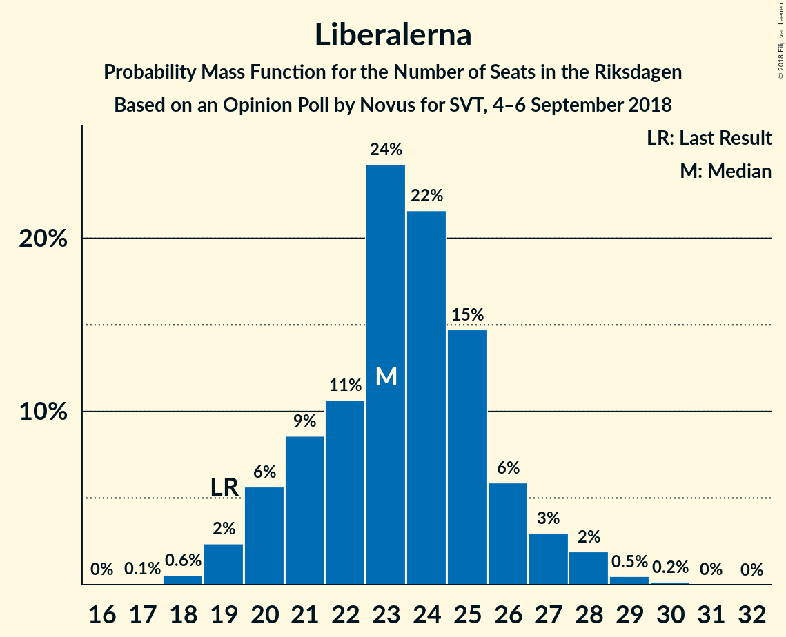

# Opinion Poll by Novus for SVT, 4–6 September 2018

<a href="#voting-intentions">Voting Intentions</a> | <a href="#seats">Seats</a> | <a href="#coalitions">Coalitions</a> | <a href="#technical-information">Technical Information</a>

## Voting Intentions

### Confidence Intervals

| Party | Last Result | Poll Result | 80% Confidence Interval | 90% Confidence Interval | 95% Confidence Interval | 99% Confidence Interval |
|:-----:|:-----------:|:-----------:|:-----------------------:|:-----------------------:|:-----------------------:|:-----------------------:|
| Sveriges socialdemokratiska arbetareparti | 31.0% | 24.9% | 23.6–26.2% |23.3–26.6% |23.0–26.9% |22.4–27.6% |
| Sverigedemokraterna | 12.9% | 19.1% | 18.0–20.3% |17.6–20.7% |17.4–21.0% |16.8–21.6% |
| Moderata samlingspartiet | 23.3% | 17.7% | 16.6–18.9% |16.3–19.2% |16.0–19.5% |15.5–20.1% |
| Vänsterpartiet | 5.7% | 10.0% | 9.2–11.0% |8.9–11.2% |8.7–11.5% |8.3–11.9% |
| Centerpartiet | 6.1% | 8.6% | 7.8–9.5% |7.6–9.8% |7.4–10.0% |7.0–10.4% |
| Liberalerna | 5.4% | 6.5% | 5.8–7.3% |5.6–7.5% |5.5–7.7% |5.2–8.1% |
| Kristdemokraterna | 4.6% | 5.7% | 5.0–6.4% |4.9–6.7% |4.7–6.8% |4.4–7.2% |
| Miljöpartiet de gröna | 6.9% | 5.0% | 4.4–5.7% |4.2–5.9% |4.1–6.1% |3.8–6.4% |

*Note:* The poll result column reflects the actual value used in the calculations. Published results may vary slightly, and in addition be rounded to fewer digits.

## Seats

### Confidence Intervals

| Party | Last Result | Median | 80% Confidence Interval | 90% Confidence Interval | 95% Confidence Interval | 99% Confidence Interval |
|:-----:|:-----------:|:------:|:-----------------------:|:-----------------------:|:-----------------------:|:-----------------------:|
| <a href="#sveriges-socialdemokratiska-arbetareparti">Sveriges socialdemokratiska arbetareparti</a> | 113 | 90 | 85–94 |84–95 |82–96 |80–99 |
| <a href="#sverigedemokraterna">Sverigedemokraterna</a> | 49 | 68 | 65–72 |63–74 |62–75 |60–77 |
| <a href="#moderata-samlingspartiet">Moderata samlingspartiet</a> | 84 | 63 | 60–68 |58–68 |57–69 |55–72 |
| <a href="#vänsterpartiet">Vänsterpartiet</a> | 21 | 36 | 33–39 |32–40 |31–41 |30–43 |
| <a href="#centerpartiet">Centerpartiet</a> | 22 | 30 | 28–34 |27–35 |26–36 |25–37 |
| <a href="#liberalerna">Liberalerna</a> | 19 | 23 | 21–26 |20–27 |19–28 |18–29 |
| <a href="#kristdemokraterna">Kristdemokraterna</a> | 16 | 21 | 18–23 |17–24 |17–24 |16–26 |
| <a href="#miljöpartiet-de-gröna">Miljöpartiet de gröna</a> | 25 | 18 | 16–20 |15–21 |15–22 |0–23 |

### Sveriges socialdemokratiska arbetareparti

*For a full overview of the results for this party, see the [Sveriges socialdemokratiska arbetareparti](party-sverigessocialdemokratiskaarbetareparti.html) page.*

| Number of Seats | Probability | Accumulated | Special Marks |
|:---------------:|:-----------:|:-----------:|:-------------:|
| 78 | 0.1% | 100% |  |
| 79 | 0.1% | 99.9% |  |
| 80 | 0.7% | 99.8% |  |
| 81 | 0.8% | 99.1% |  |
| 82 | 1.5% | 98% |  |
| 83 | 1.1% | 97% |  |
| 84 | 4% | 96% |  |
| 85 | 5% | 91% |  |
| 86 | 10% | 86% |  |
| 87 | 9% | 76% |  |
| 88 | 8% | 68% |  |
| 89 | 10% | 60% |  |
| 90 | 19% | 50% | Median |
| 91 | 14% | 31% |  |
| 92 | 3% | 17% |  |
| 93 | 3% | 14% |  |
| 94 | 5% | 11% |  |
| 95 | 4% | 7% |  |
| 96 | 1.2% | 3% |  |
| 97 | 0.6% | 2% |  |
| 98 | 0.2% | 1.2% |  |
| 99 | 0.7% | 1.0% |  |
| 100 | 0.1% | 0.3% |  |
| 101 | 0.1% | 0.2% |  |
| 102 | 0% | 0.1% |  |
| 103 | 0% | 0% |  |
| 104 | 0% | 0% |  |
| 105 | 0% | 0% |  |
| 106 | 0% | 0% |  |
| 107 | 0% | 0% |  |
| 108 | 0% | 0% |  |
| 109 | 0% | 0% |  |
| 110 | 0% | 0% |  |
| 111 | 0% | 0% |  |
| 112 | 0% | 0% |  |
| 113 | 0% | 0% | Last Result |

### Sverigedemokraterna

*For a full overview of the results for this party, see the [Sverigedemokraterna](party-sverigedemokraterna.html) page.*

| Number of Seats | Probability | Accumulated | Special Marks |
|:---------------:|:-----------:|:-----------:|:-------------:|
| 49 | 0% | 100% | Last Result |
| 50 | 0% | 100% |  |
| 51 | 0% | 100% |  |
| 52 | 0% | 100% |  |
| 53 | 0% | 100% |  |
| 54 | 0% | 100% |  |
| 55 | 0% | 100% |  |
| 56 | 0% | 100% |  |
| 57 | 0% | 100% |  |
| 58 | 0% | 100% |  |
| 59 | 0.1% | 99.9% |  |
| 60 | 0.4% | 99.8% |  |
| 61 | 1.2% | 99.4% |  |
| 62 | 3% | 98% |  |
| 63 | 3% | 95% |  |
| 64 | 3% | 93% |  |
| 65 | 9% | 90% |  |
| 66 | 14% | 81% |  |
| 67 | 11% | 67% |  |
| 68 | 9% | 56% | Median |
| 69 | 6% | 47% |  |
| 70 | 11% | 41% |  |
| 71 | 18% | 30% |  |
| 72 | 5% | 12% |  |
| 73 | 2% | 7% |  |
| 74 | 2% | 5% |  |
| 75 | 1.2% | 3% |  |
| 76 | 2% | 2% |  |
| 77 | 0.4% | 0.7% |  |
| 78 | 0.2% | 0.3% |  |
| 79 | 0.1% | 0.1% |  |
| 80 | 0% | 0.1% |  |
| 81 | 0% | 0% |  |

### Moderata samlingspartiet

*For a full overview of the results for this party, see the [Moderata samlingspartiet](party-moderatasamlingspartiet.html) page.*

| Number of Seats | Probability | Accumulated | Special Marks |
|:---------------:|:-----------:|:-----------:|:-------------:|
| 53 | 0% | 100% |  |
| 54 | 0.1% | 99.9% |  |
| 55 | 0.4% | 99.9% |  |
| 56 | 0.9% | 99.5% |  |
| 57 | 2% | 98.6% |  |
| 58 | 3% | 97% |  |
| 59 | 4% | 94% |  |
| 60 | 7% | 90% |  |
| 61 | 10% | 83% |  |
| 62 | 14% | 73% |  |
| 63 | 19% | 59% | Median |
| 64 | 10% | 40% |  |
| 65 | 6% | 31% |  |
| 66 | 8% | 25% |  |
| 67 | 7% | 17% |  |
| 68 | 5% | 10% |  |
| 69 | 2% | 5% |  |
| 70 | 1.1% | 2% |  |
| 71 | 0.4% | 1.1% |  |
| 72 | 0.3% | 0.7% |  |
| 73 | 0.3% | 0.4% |  |
| 74 | 0.1% | 0.1% |  |
| 75 | 0% | 0% |  |
| 76 | 0% | 0% |  |
| 77 | 0% | 0% |  |
| 78 | 0% | 0% |  |
| 79 | 0% | 0% |  |
| 80 | 0% | 0% |  |
| 81 | 0% | 0% |  |
| 82 | 0% | 0% |  |
| 83 | 0% | 0% |  |
| 84 | 0% | 0% | Last Result |

### Vänsterpartiet

*For a full overview of the results for this party, see the [Vänsterpartiet](party-vänsterpartiet.html) page.*

| Number of Seats | Probability | Accumulated | Special Marks |
|:---------------:|:-----------:|:-----------:|:-------------:|
| 21 | 0% | 100% | Last Result |
| 22 | 0% | 100% |  |
| 23 | 0% | 100% |  |
| 24 | 0% | 100% |  |
| 25 | 0% | 100% |  |
| 26 | 0% | 100% |  |
| 27 | 0% | 100% |  |
| 28 | 0.1% | 100% |  |
| 29 | 0.2% | 99.9% |  |
| 30 | 0.7% | 99.7% |  |
| 31 | 2% | 99.0% |  |
| 32 | 4% | 97% |  |
| 33 | 9% | 93% |  |
| 34 | 14% | 84% |  |
| 35 | 16% | 70% |  |
| 36 | 16% | 54% | Median |
| 37 | 17% | 38% |  |
| 38 | 7% | 21% |  |
| 39 | 7% | 15% |  |
| 40 | 4% | 7% |  |
| 41 | 2% | 3% |  |
| 42 | 0.8% | 1.4% |  |
| 43 | 0.4% | 0.6% |  |
| 44 | 0.1% | 0.2% |  |
| 45 | 0% | 0.1% |  |
| 46 | 0% | 0% |  |

### Centerpartiet

*For a full overview of the results for this party, see the [Centerpartiet](party-centerpartiet.html) page.*

| Number of Seats | Probability | Accumulated | Special Marks |
|:---------------:|:-----------:|:-----------:|:-------------:|
| 22 | 0% | 100% | Last Result |
| 23 | 0% | 100% |  |
| 24 | 0.1% | 100% |  |
| 25 | 0.7% | 99.8% |  |
| 26 | 2% | 99.2% |  |
| 27 | 3% | 97% |  |
| 28 | 5% | 94% |  |
| 29 | 14% | 89% |  |
| 30 | 25% | 75% | Median |
| 31 | 18% | 50% |  |
| 32 | 12% | 32% |  |
| 33 | 7% | 20% |  |
| 34 | 5% | 13% |  |
| 35 | 5% | 8% |  |
| 36 | 2% | 3% |  |
| 37 | 0.7% | 0.9% |  |
| 38 | 0.2% | 0.3% |  |
| 39 | 0.1% | 0.1% |  |
| 40 | 0% | 0% |  |

### Liberalerna

*For a full overview of the results for this party, see the [Liberalerna](party-liberalerna.html) page.*

| Number of Seats | Probability | Accumulated | Special Marks |
|:---------------:|:-----------:|:-----------:|:-------------:|
| 17 | 0.1% | 100% |  |
| 18 | 0.6% | 99.9% |  |
| 19 | 2% | 99.4% | Last Result |
| 20 | 6% | 97% |  |
| 21 | 9% | 91% |  |
| 22 | 11% | 83% |  |
| 23 | 24% | 72% | Median |
| 24 | 22% | 48% |  |
| 25 | 15% | 26% |  |
| 26 | 6% | 11% |  |
| 27 | 3% | 6% |  |
| 28 | 2% | 3% |  |
| 29 | 0.5% | 0.7% |  |
| 30 | 0.2% | 0.2% |  |
| 31 | 0% | 0.1% |  |
| 32 | 0% | 0% |  |

### Kristdemokraterna

*For a full overview of the results for this party, see the [Kristdemokraterna](party-kristdemokraterna.html) page.*

| Number of Seats | Probability | Accumulated | Special Marks |
|:---------------:|:-----------:|:-----------:|:-------------:|
| 14 | 0% | 100% |  |
| 15 | 0.4% | 99.9% |  |
| 16 | 1.5% | 99.6% | Last Result |
| 17 | 3% | 98% |  |
| 18 | 6% | 95% |  |
| 19 | 17% | 89% |  |
| 20 | 19% | 72% |  |
| 21 | 23% | 53% | Median |
| 22 | 17% | 30% |  |
| 23 | 7% | 13% |  |
| 24 | 4% | 6% |  |
| 25 | 1.4% | 2% |  |
| 26 | 0.5% | 0.7% |  |
| 27 | 0.2% | 0.2% |  |
| 28 | 0% | 0% |  |

### Miljöpartiet de gröna

*For a full overview of the results for this party, see the [Miljöpartiet de gröna](party-miljöpartietdegröna.html) page.*

| Number of Seats | Probability | Accumulated | Special Marks |
|:---------------:|:-----------:|:-----------:|:-------------:|
| 0 | 2% | 100% |  |
| 1 | 0% | 98% |  |
| 2 | 0% | 98% |  |
| 3 | 0% | 98% |  |
| 4 | 0% | 98% |  |
| 5 | 0% | 98% |  |
| 6 | 0% | 98% |  |
| 7 | 0% | 98% |  |
| 8 | 0% | 98% |  |
| 9 | 0% | 98% |  |
| 10 | 0% | 98% |  |
| 11 | 0% | 98% |  |
| 12 | 0% | 98% |  |
| 13 | 0% | 98% |  |
| 14 | 0.6% | 98% |  |
| 15 | 6% | 98% |  |
| 16 | 11% | 92% |  |
| 17 | 21% | 81% |  |
| 18 | 19% | 60% | Median |
| 19 | 21% | 41% |  |
| 20 | 12% | 20% |  |
| 21 | 5% | 8% |  |
| 22 | 2% | 3% |  |
| 23 | 0.6% | 0.8% |  |
| 24 | 0.1% | 0.2% |  |
| 25 | 0% | 0% | Last Result |

## Coalitions

### Confidence Intervals

| Coalition | Last Result | Median | Majority? | 80% Confidence Interval | 90% Confidence Interval | 95% Confidence Interval | 99% Confidence Interval |
|:---------:|:-----------:|:------:|:---------:|:-----------------------:|:-----------------------:|:-----------------------:|:-----------------------:|
| Sveriges socialdemokratiska arbetareparti – Moderata samlingspartiet – Centerpartiet | 219 | 183 | 98% | 178–188 | 177–190 | 175–192 | 173–196 |
| Sverigedemokraterna – Moderata samlingspartiet – Kristdemokraterna | 149 | 153 | 0% | 147–157 | 146–158 | 144–161 | 142–164 |
| Sveriges socialdemokratiska arbetareparti – Moderata samlingspartiet | 197 | 152 | 0% | 147–157 | 146–159 | 144–161 | 142–164 |
| Sveriges socialdemokratiska arbetareparti – Vänsterpartiet – Miljöpartiet de gröna | 159 | 143 | 0% | 138–148 | 136–149 | 134–151 | 129–153 |
| Moderata samlingspartiet – Centerpartiet – Liberalerna – Kristdemokraterna | 141 | 137 | 0% | 134–144 | 132–145 | 130–146 | 127–150 |
| Sverigedemokraterna – Moderata samlingspartiet | 133 | 132 | 0% | 127–136 | 126–138 | 124–140 | 121–142 |
| Sveriges socialdemokratiska arbetareparti – Vänsterpartiet | 134 | 125 | 0% | 120–130 | 119–132 | 117–133 | 115–136 |
| Moderata samlingspartiet – Centerpartiet – Liberalerna | 125 | 117 | 0% | 114–123 | 112–124 | 109–125 | 107–128 |
| Moderata samlingspartiet – Centerpartiet – Kristdemokraterna | 122 | 114 | 0% | 110–120 | 109–121 | 107–123 | 105–125 |
| Sveriges socialdemokratiska arbetareparti – Miljöpartiet de gröna | 138 | 107 | 0% | 102–111 | 100–113 | 99–114 | 92–117 |
| Moderata samlingspartiet – Centerpartiet | 106 | 93 | 0% | 90–99 | 89–100 | 87–101 | 85–104 |

