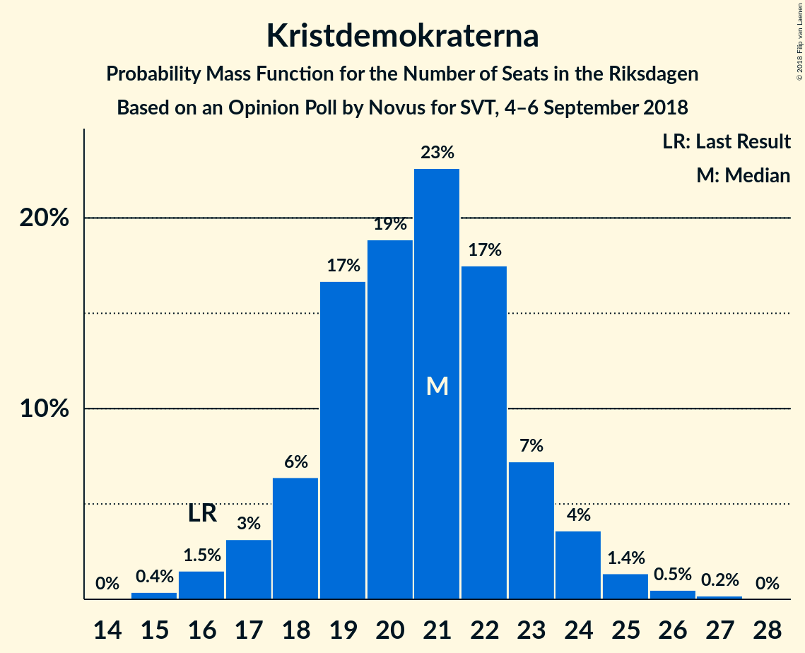

# Opinion Poll by Novus for SVT, 4–6 September 2018

<a href="#voting-intentions">Voting Intentions</a> | <a href="#seats">Seats</a> | <a href="#coalitions">Coalitions</a> | <a href="#technical-information">Technical Information</a>

## Voting Intentions

### Confidence Intervals

| Party | Last Result | Poll Result | 80% Confidence Interval | 90% Confidence Interval | 95% Confidence Interval | 99% Confidence Interval |
|:-----:|:-----------:|:-----------:|:-----------------------:|:-----------------------:|:-----------------------:|:-----------------------:|
| Sveriges socialdemokratiska arbetareparti | 31.0% | 24.9% | 23.6–26.2% |23.3–26.6% |23.0–26.9% |22.4–27.6% |
| Sverigedemokraterna | 12.9% | 19.1% | 18.0–20.3% |17.6–20.7% |17.4–21.0% |16.8–21.6% |
| Moderata samlingspartiet | 23.3% | 17.7% | 16.6–18.9% |16.3–19.2% |16.0–19.5% |15.5–20.1% |
| Vänsterpartiet | 5.7% | 10.0% | 9.2–11.0% |8.9–11.2% |8.7–11.5% |8.3–11.9% |
| Centerpartiet | 6.1% | 8.6% | 7.8–9.5% |7.6–9.8% |7.4–10.0% |7.0–10.4% |
| Liberalerna | 5.4% | 6.5% | 5.8–7.3% |5.6–7.5% |5.5–7.7% |5.2–8.1% |
| Kristdemokraterna | 4.6% | 5.7% | 5.0–6.4% |4.9–6.7% |4.7–6.8% |4.4–7.2% |
| Miljöpartiet de gröna | 6.9% | 5.0% | 4.4–5.7% |4.2–5.9% |4.1–6.1% |3.8–6.4% |

*Note:* The poll result column reflects the actual value used in the calculations. Published results may vary slightly, and in addition be rounded to fewer digits.

## Seats

### Confidence Intervals

| Party | Last Result | Median | 80% Confidence Interval | 90% Confidence Interval | 95% Confidence Interval | 99% Confidence Interval |
|:-----:|:-----------:|:------:|:-----------------------:|:-----------------------:|:-----------------------:|:-----------------------:|
| <a href="#sveriges-socialdemokratiska-arbetareparti">Sveriges socialdemokratiska arbetareparti</a> | 113 | 89 | 85–95 |84–96 |82–96 |79–98 |
| <a href="#sverigedemokraterna">Sverigedemokraterna</a> | 49 | 67 | 63–72 |62–74 |61–76 |60–77 |
| <a href="#moderata-samlingspartiet">Moderata samlingspartiet</a> | 84 | 63 | 59–67 |58–68 |57–69 |55–72 |
| <a href="#vänsterpartiet">Vänsterpartiet</a> | 21 | 36 | 32–40 |31–41 |31–41 |30–43 |
| <a href="#centerpartiet">Centerpartiet</a> | 22 | 31 | 27–35 |27–35 |26–36 |25–37 |
| <a href="#liberalerna">Liberalerna</a> | 19 | 23 | 21–26 |20–27 |20–28 |18–29 |
| <a href="#kristdemokraterna">Kristdemokraterna</a> | 16 | 21 | 17–24 |17–24 |16–25 |15–25 |
| <a href="#miljöpartiet-de-gröna">Miljöpartiet de gröna</a> | 25 | 17 | 16–20 |15–21 |15–21 |0–23 |

### Sveriges socialdemokratiska arbetareparti

*For a full overview of the results for this party, see the [Sveriges socialdemokratiska arbetareparti](party-sverigessocialdemokratiskaarbetareparti.html) page.*

| Number of Seats | Probability | Accumulated | Special Marks |
|:---------------:|:-----------:|:-----------:|:-------------:|
| 78 | 0.1% | 100% |  |
| 79 | 0.4% | 99.9% |  |
| 80 | 0.9% | 99.5% |  |
| 81 | 0.4% | 98.6% |  |
| 82 | 0.8% | 98% |  |
| 83 | 0.3% | 97% |  |
| 84 | 6% | 97% |  |
| 85 | 4% | 91% |  |
| 86 | 11% | 87% |  |
| 87 | 2% | 76% |  |
| 88 | 10% | 74% |  |
| 89 | 14% | 64% | Median |
| 90 | 11% | 50% |  |
| 91 | 3% | 39% |  |
| 92 | 1.5% | 37% |  |
| 93 | 2% | 35% |  |
| 94 | 18% | 33% |  |
| 95 | 9% | 15% |  |
| 96 | 4% | 6% |  |
| 97 | 1.3% | 2% |  |
| 98 | 0.1% | 0.5% |  |
| 99 | 0.2% | 0.4% |  |
| 100 | 0.1% | 0.2% |  |
| 101 | 0.1% | 0.1% |  |
| 102 | 0% | 0% |  |
| 103 | 0% | 0% |  |
| 104 | 0% | 0% |  |
| 105 | 0% | 0% |  |
| 106 | 0% | 0% |  |
| 107 | 0% | 0% |  |
| 108 | 0% | 0% |  |
| 109 | 0% | 0% |  |
| 110 | 0% | 0% |  |
| 111 | 0% | 0% |  |
| 112 | 0% | 0% |  |
| 113 | 0% | 0% | Last Result |

### Sverigedemokraterna

*For a full overview of the results for this party, see the [Sverigedemokraterna](party-sverigedemokraterna.html) page.*

| Number of Seats | Probability | Accumulated | Special Marks |
|:---------------:|:-----------:|:-----------:|:-------------:|
| 49 | 0% | 100% | Last Result |
| 50 | 0% | 100% |  |
| 51 | 0% | 100% |  |
| 52 | 0% | 100% |  |
| 53 | 0% | 100% |  |
| 54 | 0% | 100% |  |
| 55 | 0% | 100% |  |
| 56 | 0% | 100% |  |
| 57 | 0.1% | 100% |  |
| 58 | 0.1% | 99.9% |  |
| 59 | 0.2% | 99.8% |  |
| 60 | 0.7% | 99.6% |  |
| 61 | 3% | 99.0% |  |
| 62 | 3% | 96% |  |
| 63 | 5% | 93% |  |
| 64 | 6% | 88% |  |
| 65 | 11% | 82% |  |
| 66 | 19% | 71% |  |
| 67 | 7% | 52% | Median |
| 68 | 9% | 46% |  |
| 69 | 7% | 36% |  |
| 70 | 9% | 30% |  |
| 71 | 6% | 21% |  |
| 72 | 8% | 15% |  |
| 73 | 1.1% | 7% |  |
| 74 | 1.2% | 6% |  |
| 75 | 1.0% | 5% |  |
| 76 | 3% | 4% |  |
| 77 | 0.2% | 0.6% |  |
| 78 | 0.1% | 0.4% |  |
| 79 | 0.1% | 0.3% |  |
| 80 | 0.1% | 0.2% |  |
| 81 | 0% | 0.1% |  |
| 82 | 0% | 0% |  |

### Moderata samlingspartiet

*For a full overview of the results for this party, see the [Moderata samlingspartiet](party-moderatasamlingspartiet.html) page.*

| Number of Seats | Probability | Accumulated | Special Marks |
|:---------------:|:-----------:|:-----------:|:-------------:|
| 54 | 0.1% | 100% |  |
| 55 | 0.4% | 99.8% |  |
| 56 | 2% | 99.5% |  |
| 57 | 2% | 98% |  |
| 58 | 4% | 96% |  |
| 59 | 4% | 92% |  |
| 60 | 6% | 87% |  |
| 61 | 12% | 82% |  |
| 62 | 18% | 70% |  |
| 63 | 15% | 52% | Median |
| 64 | 6% | 37% |  |
| 65 | 8% | 32% |  |
| 66 | 8% | 23% |  |
| 67 | 8% | 15% |  |
| 68 | 3% | 7% |  |
| 69 | 1.2% | 4% |  |
| 70 | 1.2% | 2% |  |
| 71 | 0.2% | 1.2% |  |
| 72 | 0.8% | 1.1% |  |
| 73 | 0.1% | 0.2% |  |
| 74 | 0.1% | 0.1% |  |
| 75 | 0% | 0% |  |
| 76 | 0% | 0% |  |
| 77 | 0% | 0% |  |
| 78 | 0% | 0% |  |
| 79 | 0% | 0% |  |
| 80 | 0% | 0% |  |
| 81 | 0% | 0% |  |
| 82 | 0% | 0% |  |
| 83 | 0% | 0% |  |
| 84 | 0% | 0% | Last Result |

### Vänsterpartiet

*For a full overview of the results for this party, see the [Vänsterpartiet](party-vänsterpartiet.html) page.*

| Number of Seats | Probability | Accumulated | Special Marks |
|:---------------:|:-----------:|:-----------:|:-------------:|
| 21 | 0% | 100% | Last Result |
| 22 | 0% | 100% |  |
| 23 | 0% | 100% |  |
| 24 | 0% | 100% |  |
| 25 | 0% | 100% |  |
| 26 | 0% | 100% |  |
| 27 | 0% | 100% |  |
| 28 | 0.1% | 100% |  |
| 29 | 0.2% | 99.9% |  |
| 30 | 0.6% | 99.6% |  |
| 31 | 4% | 99.0% |  |
| 32 | 7% | 95% |  |
| 33 | 6% | 88% |  |
| 34 | 9% | 82% |  |
| 35 | 15% | 73% |  |
| 36 | 25% | 58% | Median |
| 37 | 10% | 33% |  |
| 38 | 5% | 23% |  |
| 39 | 6% | 18% |  |
| 40 | 7% | 12% |  |
| 41 | 3% | 6% |  |
| 42 | 1.3% | 2% |  |
| 43 | 0.6% | 0.9% |  |
| 44 | 0.2% | 0.2% |  |
| 45 | 0% | 0.1% |  |
| 46 | 0% | 0% |  |

### Centerpartiet

*For a full overview of the results for this party, see the [Centerpartiet](party-centerpartiet.html) page.*

| Number of Seats | Probability | Accumulated | Special Marks |
|:---------------:|:-----------:|:-----------:|:-------------:|
| 22 | 0% | 100% | Last Result |
| 23 | 0% | 100% |  |
| 24 | 0.1% | 100% |  |
| 25 | 1.3% | 99.9% |  |
| 26 | 2% | 98.5% |  |
| 27 | 7% | 97% |  |
| 28 | 6% | 90% |  |
| 29 | 9% | 84% |  |
| 30 | 15% | 75% |  |
| 31 | 14% | 60% | Median |
| 32 | 19% | 46% |  |
| 33 | 10% | 27% |  |
| 34 | 5% | 17% |  |
| 35 | 7% | 12% |  |
| 36 | 4% | 5% |  |
| 37 | 0.5% | 0.7% |  |
| 38 | 0.2% | 0.2% |  |
| 39 | 0% | 0.1% |  |
| 40 | 0% | 0% |  |

### Liberalerna

*For a full overview of the results for this party, see the [Liberalerna](party-liberalerna.html) page.*

| Number of Seats | Probability | Accumulated | Special Marks |
|:---------------:|:-----------:|:-----------:|:-------------:|
| 17 | 0.1% | 100% |  |
| 18 | 0.5% | 99.8% |  |
| 19 | 1.3% | 99.3% | Last Result |
| 20 | 7% | 98% |  |
| 21 | 21% | 91% |  |
| 22 | 10% | 69% |  |
| 23 | 21% | 60% | Median |
| 24 | 12% | 39% |  |
| 25 | 12% | 27% |  |
| 26 | 8% | 15% |  |
| 27 | 4% | 7% |  |
| 28 | 2% | 3% |  |
| 29 | 0.9% | 1.2% |  |
| 30 | 0.2% | 0.3% |  |
| 31 | 0.1% | 0.1% |  |
| 32 | 0% | 0% |  |

### Kristdemokraterna

*For a full overview of the results for this party, see the [Kristdemokraterna](party-kristdemokraterna.html) page.*

| Number of Seats | Probability | Accumulated | Special Marks |
|:---------------:|:-----------:|:-----------:|:-------------:|
| 0 | 0.1% | 100% |  |
| 1 | 0% | 99.9% |  |
| 2 | 0% | 99.9% |  |
| 3 | 0% | 99.9% |  |
| 4 | 0% | 99.9% |  |
| 5 | 0% | 99.9% |  |
| 6 | 0% | 99.9% |  |
| 7 | 0% | 99.9% |  |
| 8 | 0% | 99.9% |  |
| 9 | 0% | 99.9% |  |
| 10 | 0% | 99.9% |  |
| 11 | 0% | 99.9% |  |
| 12 | 0% | 99.9% |  |
| 13 | 0% | 99.9% |  |
| 14 | 0% | 99.9% |  |
| 15 | 0.6% | 99.9% |  |
| 16 | 3% | 99.3% | Last Result |
| 17 | 10% | 96% |  |
| 18 | 8% | 87% |  |
| 19 | 5% | 79% |  |
| 20 | 5% | 74% |  |
| 21 | 20% | 69% | Median |
| 22 | 17% | 49% |  |
| 23 | 17% | 32% |  |
| 24 | 11% | 14% |  |
| 25 | 3% | 3% |  |
| 26 | 0.3% | 0.3% |  |
| 27 | 0.1% | 0.1% |  |
| 28 | 0% | 0% |  |

### Miljöpartiet de gröna

*For a full overview of the results for this party, see the [Miljöpartiet de gröna](party-miljöpartietdegröna.html) page.*

| Number of Seats | Probability | Accumulated | Special Marks |
|:---------------:|:-----------:|:-----------:|:-------------:|
| 0 | 1.1% | 100% |  |
| 1 | 0% | 98.9% |  |
| 2 | 0% | 98.9% |  |
| 3 | 0% | 98.9% |  |
| 4 | 0% | 98.9% |  |
| 5 | 0% | 98.9% |  |
| 6 | 0% | 98.9% |  |
| 7 | 0% | 98.9% |  |
| 8 | 0% | 98.9% |  |
| 9 | 0% | 98.9% |  |
| 10 | 0% | 98.9% |  |
| 11 | 0% | 98.9% |  |
| 12 | 0% | 98.9% |  |
| 13 | 0% | 98.9% |  |
| 14 | 0.8% | 98.9% |  |
| 15 | 5% | 98% |  |
| 16 | 21% | 93% |  |
| 17 | 26% | 72% | Median |
| 18 | 20% | 46% |  |
| 19 | 16% | 26% |  |
| 20 | 5% | 10% |  |
| 21 | 4% | 6% |  |
| 22 | 1.4% | 2% |  |
| 23 | 0.6% | 0.8% |  |
| 24 | 0.1% | 0.1% |  |
| 25 | 0% | 0% | Last Result |

## Coalitions

### Confidence Intervals

| Coalition | Last Result | Median | Majority? | 80% Confidence Interval | 90% Confidence Interval | 95% Confidence Interval | 99% Confidence Interval |
|:---------:|:-----------:|:------:|:---------:|:-----------------------:|:-----------------------:|:-----------------------:|:-----------------------:|
| Sveriges socialdemokratiska arbetareparti – Moderata samlingspartiet – Centerpartiet | 219 | 185 | 98.7% | 178–188 | 177–191 | 176–193 | 173–196 |
| Sveriges socialdemokratiska arbetareparti – Moderata samlingspartiet | 197 | 153 | 0% | 147–159 | 146–160 | 145–161 | 141–164 |
| Sverigedemokraterna – Moderata samlingspartiet – Kristdemokraterna | 149 | 151 | 0% | 148–157 | 144–158 | 143–159 | 142–164 |
| Sveriges socialdemokratiska arbetareparti – Vänsterpartiet – Miljöpartiet de gröna | 159 | 143 | 0% | 137–148 | 136–150 | 134–152 | 130–154 |
| Moderata samlingspartiet – Centerpartiet – Liberalerna – Kristdemokraterna | 141 | 137 | 0% | 133–145 | 131–146 | 130–146 | 128–149 |
| Sverigedemokraterna – Moderata samlingspartiet | 133 | 129 | 0% | 126–137 | 124–139 | 122–140 | 120–142 |
| Sveriges socialdemokratiska arbetareparti – Vänsterpartiet | 134 | 125 | 0% | 120–131 | 119–133 | 118–134 | 115–137 |
| Moderata samlingspartiet – Centerpartiet – Liberalerna | 125 | 116 | 0% | 113–123 | 110–124 | 108–125 | 107–128 |
| Moderata samlingspartiet – Centerpartiet – Kristdemokraterna | 122 | 115 | 0% | 110–120 | 108–121 | 107–122 | 105–126 |
| Sveriges socialdemokratiska arbetareparti – Miljöpartiet de gröna | 138 | 106 | 0% | 103–113 | 101–114 | 98–115 | 94–116 |
| Moderata samlingspartiet – Centerpartiet | 106 | 94 | 0% | 89–99 | 88–100 | 87–101 | 85–104 |

