# Opinion Poll by SKOP, 30 August–6 September 2018

<a href="#voting-intentions">Voting Intentions</a> | <a href="#seats">Seats</a> | <a href="#coalitions">Coalitions</a> | <a href="#technical-information">Technical Information</a>

## Voting Intentions

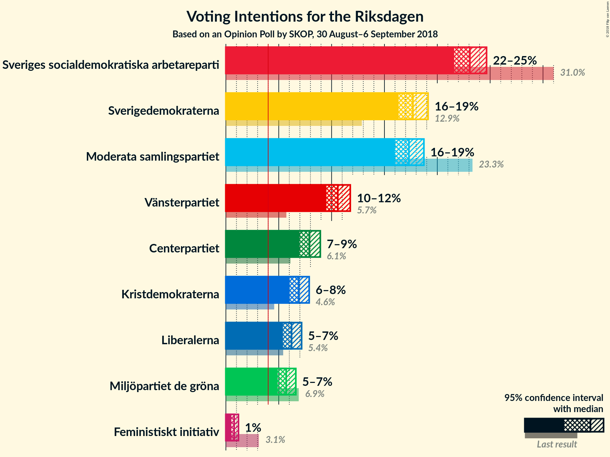

### Confidence Intervals

| Party | Last Result | Poll Result | 80% Confidence Interval | 90% Confidence Interval | 95% Confidence Interval | 99% Confidence Interval |
|:-----:|:-----------:|:-----------:|:-----------------------:|:-----------------------:|:-----------------------:|:-----------------------:|
| Sveriges socialdemokratiska arbetareparti | 31.0% | 23.1% | 22.1–24.1% |21.8–24.4% |21.6–24.7% |21.1–25.1% |
| Sverigedemokraterna | 12.9% | 17.7% | 16.8–18.6% |16.6–18.9% |16.3–19.1% |15.9–19.6% |
| Moderata samlingspartiet | 23.3% | 17.3% | 16.4–18.2% |16.2–18.5% |16.0–18.7% |15.6–19.2% |
| Vänsterpartiet | 5.7% | 10.6% | 9.9–11.4% |9.7–11.6% |9.5–11.8% |9.2–12.1% |
| Centerpartiet | 6.1% | 7.9% | 7.3–8.6% |7.1–8.8% |7.0–8.9% |6.7–9.3% |
| Kristdemokraterna | 4.6% | 6.9% | 6.3–7.5% |6.2–7.7% |6.0–7.9% |5.8–8.2% |
| Liberalerna | 5.4% | 6.2% | 5.7–6.8% |5.5–7.0% |5.4–7.2% |5.1–7.5% |
| Miljöpartiet de gröna | 6.9% | 5.7% | 5.2–6.3% |5.0–6.5% |4.9–6.6% |4.7–6.9% |
| Feministiskt initiativ | 3.1% | 0.8% | 0.6–1.1% |0.6–1.1% |0.5–1.2% |0.4–1.3% |

*Note:* The poll result column reflects the actual value used in the calculations. Published results may vary slightly, and in addition be rounded to fewer digits.

## Seats

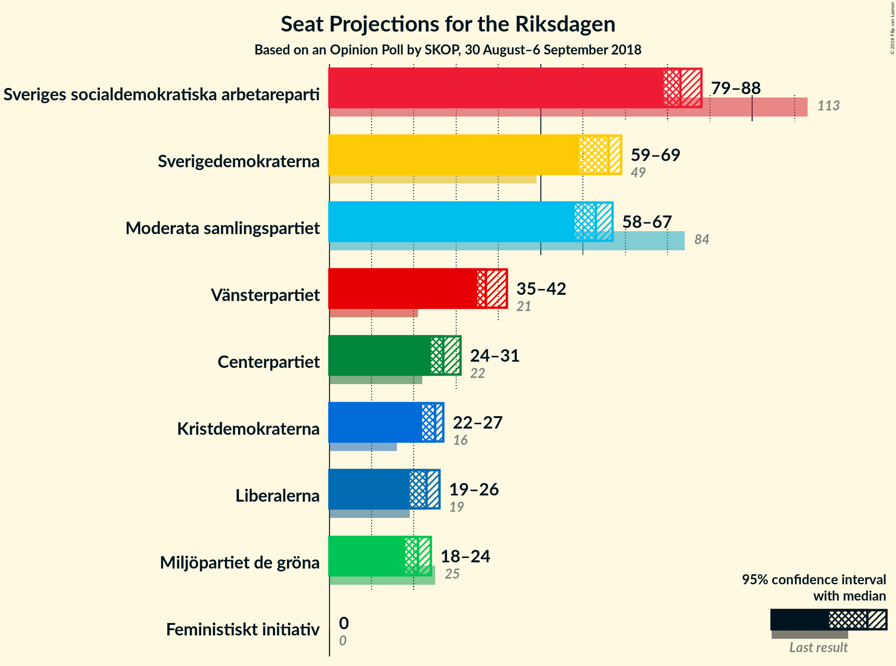

### Confidence Intervals

| Party | Last Result | Median | 80% Confidence Interval | 90% Confidence Interval | 95% Confidence Interval | 99% Confidence Interval |
|:-----:|:-----------:|:------:|:-----------------------:|:-----------------------:|:-----------------------:|:-----------------------:|
| <a href="#sveriges-socialdemokratiska-arbetareparti">Sveriges socialdemokratiska arbetareparti</a> | 113 | 83 | 79–87 |79–89 |77–90 |75–91 |
| <a href="#sverigedemokraterna">Sverigedemokraterna</a> | 49 | 64 | 60–68 |59–68 |58–69 |57–71 |
| <a href="#moderata-samlingspartiet">Moderata samlingspartiet</a> | 84 | 62 | 59–66 |58–67 |57–68 |56–69 |
| <a href="#vänsterpartiet">Vänsterpartiet</a> | 21 | 38 | 36–41 |35–43 |34–43 |33–44 |
| <a href="#centerpartiet">Centerpartiet</a> | 22 | 29 | 26–31 |26–31 |25–32 |24–33 |
| <a href="#kristdemokraterna">Kristdemokraterna</a> | 16 | 25 | 23–27 |22–28 |22–28 |21–29 |
| <a href="#liberalerna">Liberalerna</a> | 19 | 22 | 21–24 |20–25 |19–26 |19–27 |
| <a href="#miljöpartiet-de-gröna">Miljöpartiet de gröna</a> | 25 | 21 | 19–23 |18–23 |18–23 |17–25 |
| <a href="#feministiskt-initiativ">Feministiskt initiativ</a> | 0 | 0 | 0 |0 |0 |0 |

### Sveriges socialdemokratiska arbetareparti

*For a full overview of the results for this party, see the [Sveriges socialdemokratiska arbetareparti](party-sverigessocialdemokratiskaarbetareparti.html) page.*

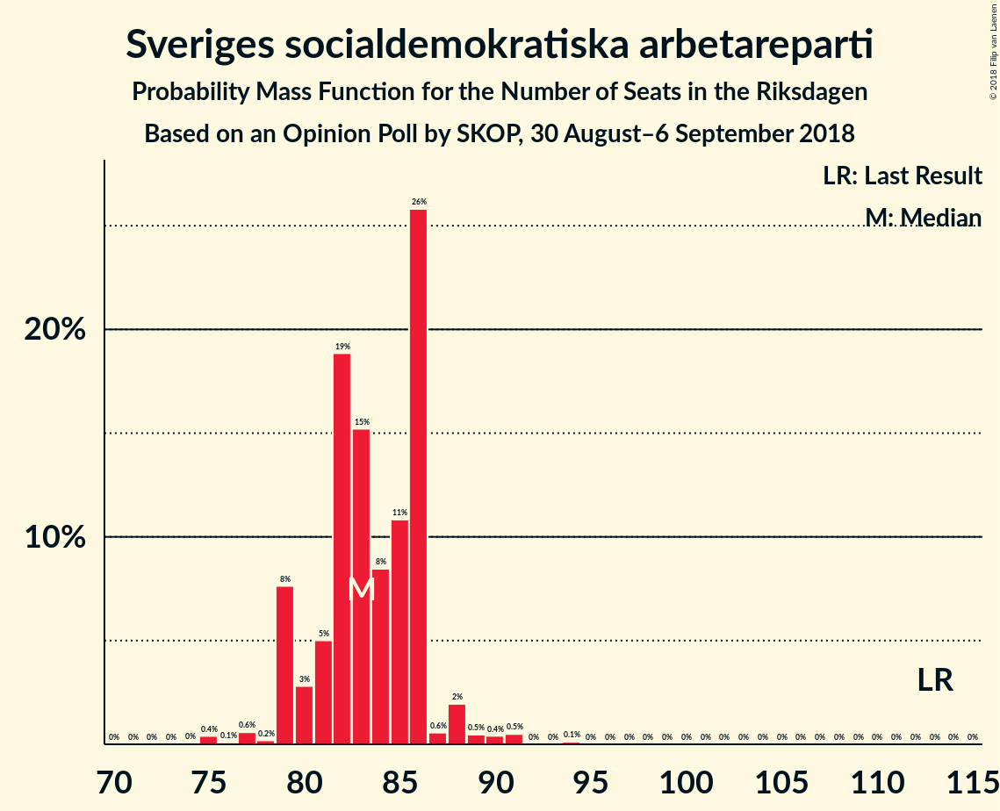

| Number of Seats | Probability | Accumulated | Special Marks |
|:---------------:|:-----------:|:-----------:|:-------------:|
| 73 | 0.1% | 100% |  |
| 74 | 0.1% | 99.9% |  |
| 75 | 0.3% | 99.8% |  |
| 76 | 1.0% | 99.4% |  |
| 77 | 1.4% | 98% |  |
| 78 | 2% | 97% |  |
| 79 | 14% | 95% |  |
| 80 | 8% | 81% |  |
| 81 | 6% | 73% |  |
| 82 | 6% | 67% |  |
| 83 | 14% | 61% | Median |
| 84 | 5% | 47% |  |
| 85 | 9% | 42% |  |
| 86 | 19% | 33% |  |
| 87 | 4% | 14% |  |
| 88 | 2% | 9% |  |
| 89 | 4% | 7% |  |
| 90 | 2% | 3% |  |
| 91 | 0.4% | 0.6% |  |
| 92 | 0.1% | 0.2% |  |
| 93 | 0.1% | 0.1% |  |
| 94 | 0% | 0% |  |
| 95 | 0% | 0% |  |
| 96 | 0% | 0% |  |
| 97 | 0% | 0% |  |
| 98 | 0% | 0% |  |
| 99 | 0% | 0% |  |
| 100 | 0% | 0% |  |
| 101 | 0% | 0% |  |
| 102 | 0% | 0% |  |
| 103 | 0% | 0% |  |
| 104 | 0% | 0% |  |
| 105 | 0% | 0% |  |
| 106 | 0% | 0% |  |
| 107 | 0% | 0% |  |
| 108 | 0% | 0% |  |
| 109 | 0% | 0% |  |
| 110 | 0% | 0% |  |
| 111 | 0% | 0% |  |
| 112 | 0% | 0% |  |
| 113 | 0% | 0% | Last Result |

### Sverigedemokraterna

*For a full overview of the results for this party, see the [Sverigedemokraterna](party-sverigedemokraterna.html) page.*

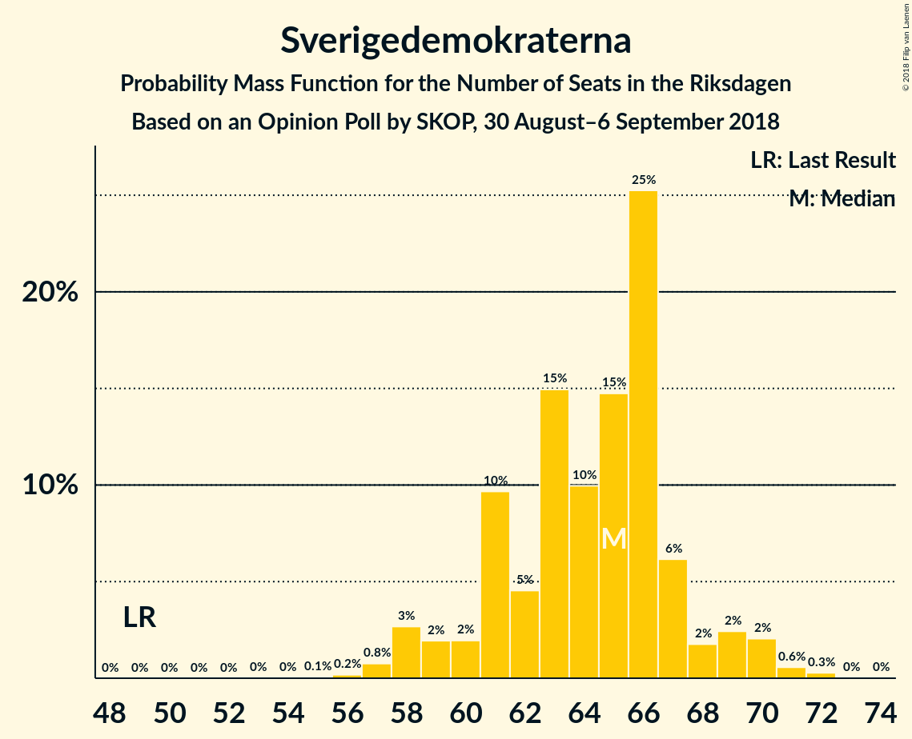

| Number of Seats | Probability | Accumulated | Special Marks |
|:---------------:|:-----------:|:-----------:|:-------------:|
| 49 | 0% | 100% | Last Result |
| 50 | 0% | 100% |  |
| 51 | 0% | 100% |  |
| 52 | 0% | 100% |  |
| 53 | 0% | 100% |  |
| 54 | 0% | 100% |  |
| 55 | 0.1% | 100% |  |
| 56 | 0.1% | 99.9% |  |
| 57 | 0.6% | 99.8% |  |
| 58 | 2% | 99.2% |  |
| 59 | 4% | 97% |  |
| 60 | 5% | 94% |  |
| 61 | 12% | 88% |  |
| 62 | 7% | 76% |  |
| 63 | 15% | 69% |  |
| 64 | 11% | 54% | Median |
| 65 | 10% | 43% |  |
| 66 | 17% | 33% |  |
| 67 | 6% | 16% |  |
| 68 | 6% | 10% |  |
| 69 | 2% | 4% |  |
| 70 | 1.3% | 2% |  |
| 71 | 0.4% | 0.7% |  |
| 72 | 0.3% | 0.3% |  |
| 73 | 0% | 0.1% |  |
| 74 | 0% | 0% |  |

### Moderata samlingspartiet

*For a full overview of the results for this party, see the [Moderata samlingspartiet](party-moderatasamlingspartiet.html) page.*

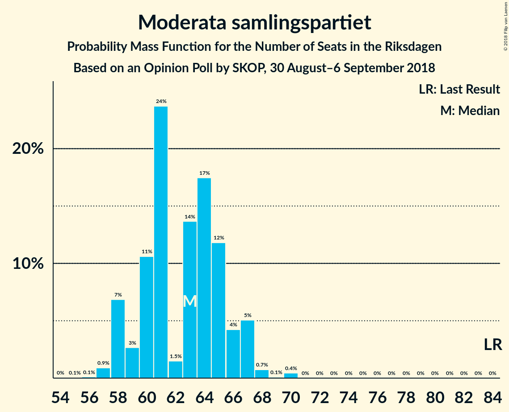

| Number of Seats | Probability | Accumulated | Special Marks |
|:---------------:|:-----------:|:-----------:|:-------------:|
| 53 | 0% | 100% |  |
| 54 | 0.1% | 99.9% |  |
| 55 | 0.3% | 99.9% |  |
| 56 | 1.4% | 99.6% |  |
| 57 | 2% | 98% |  |
| 58 | 4% | 96% |  |
| 59 | 6% | 92% |  |
| 60 | 8% | 86% |  |
| 61 | 12% | 78% |  |
| 62 | 23% | 66% | Median |
| 63 | 8% | 43% |  |
| 64 | 16% | 35% |  |
| 65 | 8% | 19% |  |
| 66 | 5% | 11% |  |
| 67 | 3% | 6% |  |
| 68 | 2% | 3% |  |
| 69 | 0.7% | 1.1% |  |
| 70 | 0.3% | 0.4% |  |
| 71 | 0.1% | 0.1% |  |
| 72 | 0% | 0% |  |
| 73 | 0% | 0% |  |
| 74 | 0% | 0% |  |
| 75 | 0% | 0% |  |
| 76 | 0% | 0% |  |
| 77 | 0% | 0% |  |
| 78 | 0% | 0% |  |
| 79 | 0% | 0% |  |
| 80 | 0% | 0% |  |
| 81 | 0% | 0% |  |
| 82 | 0% | 0% |  |
| 83 | 0% | 0% |  |
| 84 | 0% | 0% | Last Result |

### Vänsterpartiet

*For a full overview of the results for this party, see the [Vänsterpartiet](party-vänsterpartiet.html) page.*

| Number of Seats | Probability | Accumulated | Special Marks |
|:---------------:|:-----------:|:-----------:|:-------------:|
| 21 | 0% | 100% | Last Result |
| 22 | 0% | 100% |  |
| 23 | 0% | 100% |  |
| 24 | 0% | 100% |  |
| 25 | 0% | 100% |  |
| 26 | 0% | 100% |  |
| 27 | 0% | 100% |  |
| 28 | 0% | 100% |  |
| 29 | 0% | 100% |  |
| 30 | 0% | 100% |  |
| 31 | 0% | 100% |  |
| 32 | 0.3% | 100% |  |
| 33 | 0.7% | 99.6% |  |
| 34 | 1.5% | 98.9% |  |
| 35 | 6% | 97% |  |
| 36 | 14% | 92% |  |
| 37 | 26% | 78% |  |
| 38 | 12% | 52% | Median |
| 39 | 14% | 40% |  |
| 40 | 6% | 26% |  |
| 41 | 12% | 21% |  |
| 42 | 4% | 9% |  |
| 43 | 4% | 5% |  |
| 44 | 0.5% | 0.7% |  |
| 45 | 0.2% | 0.2% |  |
| 46 | 0% | 0% |  |

### Centerpartiet

*For a full overview of the results for this party, see the [Centerpartiet](party-centerpartiet.html) page.*

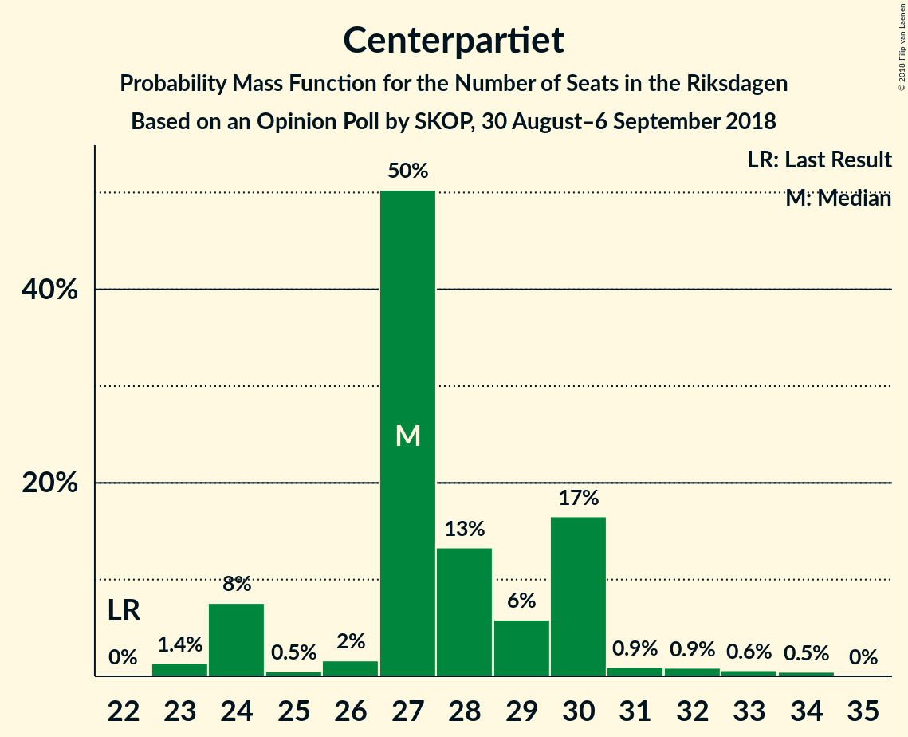

| Number of Seats | Probability | Accumulated | Special Marks |
|:---------------:|:-----------:|:-----------:|:-------------:|
| 22 | 0% | 100% | Last Result |
| 23 | 0.2% | 100% |  |
| 24 | 1.1% | 99.7% |  |
| 25 | 3% | 98.6% |  |
| 26 | 10% | 95% |  |
| 27 | 18% | 86% |  |
| 28 | 18% | 68% |  |
| 29 | 26% | 50% | Median |
| 30 | 13% | 24% |  |
| 31 | 8% | 11% |  |
| 32 | 2% | 3% |  |
| 33 | 1.3% | 2% |  |
| 34 | 0.2% | 0.3% |  |
| 35 | 0.1% | 0.1% |  |
| 36 | 0% | 0% |  |

### Kristdemokraterna

*For a full overview of the results for this party, see the [Kristdemokraterna](party-kristdemokraterna.html) page.*

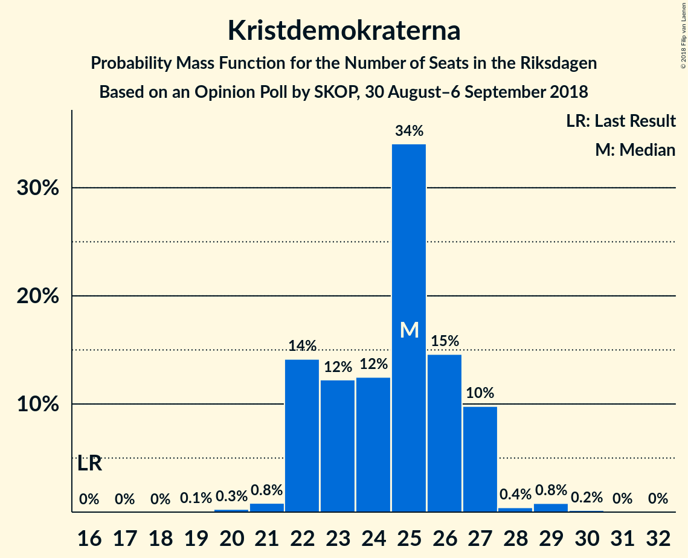

| Number of Seats | Probability | Accumulated | Special Marks |
|:---------------:|:-----------:|:-----------:|:-------------:|
| 16 | 0% | 100% | Last Result |
| 17 | 0% | 100% |  |
| 18 | 0% | 100% |  |
| 19 | 0% | 100% |  |
| 20 | 0.3% | 100% |  |
| 21 | 1.4% | 99.7% |  |
| 22 | 5% | 98% |  |
| 23 | 16% | 93% |  |
| 24 | 17% | 77% |  |
| 25 | 23% | 60% | Median |
| 26 | 22% | 37% |  |
| 27 | 9% | 15% |  |
| 28 | 4% | 6% |  |
| 29 | 2% | 2% |  |
| 30 | 0.4% | 0.5% |  |
| 31 | 0.1% | 0.1% |  |
| 32 | 0% | 0% |  |

### Liberalerna

*For a full overview of the results for this party, see the [Liberalerna](party-liberalerna.html) page.*

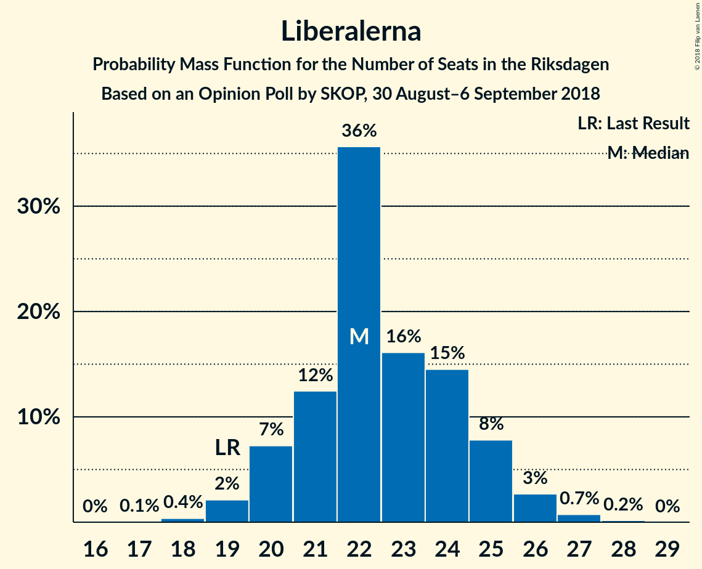

| Number of Seats | Probability | Accumulated | Special Marks |
|:---------------:|:-----------:|:-----------:|:-------------:|
| 17 | 0.1% | 100% |  |
| 18 | 0.4% | 99.9% |  |
| 19 | 2% | 99.5% | Last Result |
| 20 | 7% | 97% |  |
| 21 | 18% | 90% |  |
| 22 | 32% | 72% | Median |
| 23 | 18% | 40% |  |
| 24 | 12% | 22% |  |
| 25 | 7% | 10% |  |
| 26 | 2% | 3% |  |
| 27 | 0.6% | 0.8% |  |
| 28 | 0.1% | 0.2% |  |
| 29 | 0% | 0% |  |

### Miljöpartiet de gröna

*For a full overview of the results for this party, see the [Miljöpartiet de gröna](party-miljöpartietdegröna.html) page.*

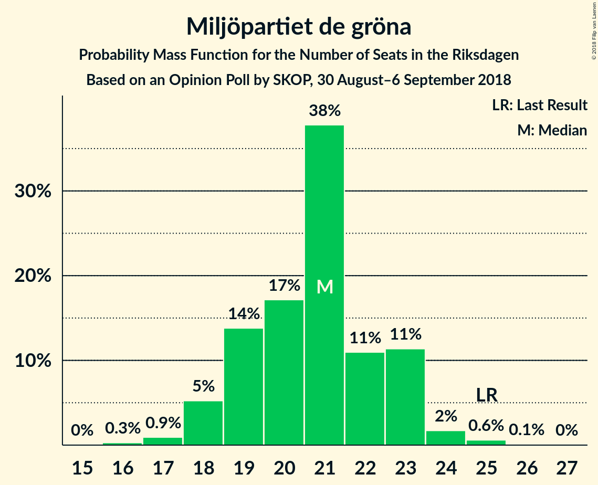

| Number of Seats | Probability | Accumulated | Special Marks |
|:---------------:|:-----------:|:-----------:|:-------------:|
| 16 | 0.3% | 100% |  |
| 17 | 0.9% | 99.7% |  |
| 18 | 5% | 98.8% |  |
| 19 | 14% | 94% |  |
| 20 | 17% | 80% |  |
| 21 | 38% | 63% | Median |
| 22 | 11% | 25% |  |
| 23 | 11% | 14% |  |
| 24 | 2% | 2% |  |
| 25 | 0.6% | 0.7% | Last Result |
| 26 | 0.1% | 0.1% |  |
| 27 | 0% | 0% |  |

### Feministiskt initiativ

*For a full overview of the results for this party, see the [Feministiskt initiativ](party-feministisktinitiativ.html) page.*

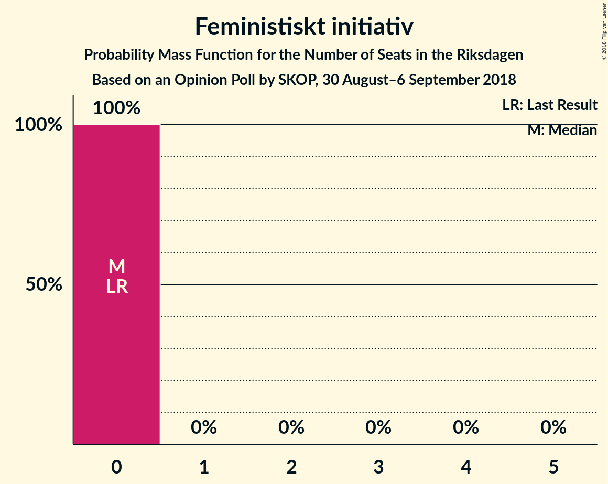

| Number of Seats | Probability | Accumulated | Special Marks |
|:---------------:|:-----------:|:-----------:|:-------------:|
| 0 | 100% | 100% | Last Result, Median |

## Coalitions

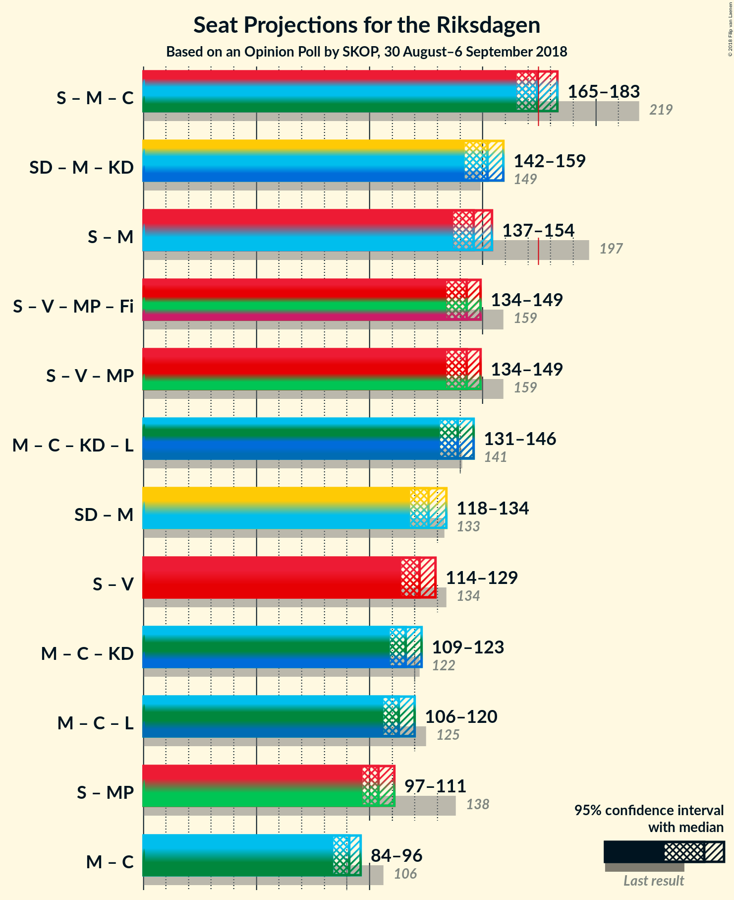

### Confidence Intervals

| Coalition | Last Result | Median | Majority? | 80% Confidence Interval | 90% Confidence Interval | 95% Confidence Interval | 99% Confidence Interval |
|:---------:|:-----------:|:------:|:---------:|:-----------------------:|:-----------------------:|:-----------------------:|:-----------------------:|
| Sveriges socialdemokratiska arbetareparti – Moderata samlingspartiet – Centerpartiet | 219 | 174 | 49% | 167–179 | 166–182 | 165–183 | 162–184 |
| Sverigedemokraterna – Moderata samlingspartiet – Kristdemokraterna | 149 | 152 | 0% | 145–157 | 144–157 | 142–159 | 141–161 |
| Sveriges socialdemokratiska arbetareparti – Moderata samlingspartiet | 197 | 146 | 0% | 140–151 | 139–152 | 137–154 | 135–156 |
| Sveriges socialdemokratiska arbetareparti – Vänsterpartiet – Miljöpartiet de gröna – Feministiskt initiativ | 159 | 143 | 0% | 137–147 | 136–148 | 134–149 | 131–152 |
| Sveriges socialdemokratiska arbetareparti – Vänsterpartiet – Miljöpartiet de gröna | 159 | 143 | 0% | 137–147 | 136–148 | 134–149 | 131–152 |
| Moderata samlingspartiet – Centerpartiet – Kristdemokraterna – Liberalerna | 141 | 139 | 0% | 133–142 | 132–144 | 131–146 | 129–148 |
| Sverigedemokraterna – Moderata samlingspartiet | 133 | 126 | 0% | 121–132 | 119–133 | 118–134 | 116–136 |
| Sveriges socialdemokratiska arbetareparti – Vänsterpartiet | 134 | 122 | 0% | 116–126 | 115–128 | 114–129 | 111–130 |
| Moderata samlingspartiet – Centerpartiet – Kristdemokraterna | 122 | 116 | 0% | 111–120 | 109–121 | 109–123 | 107–125 |
| Moderata samlingspartiet – Centerpartiet – Liberalerna | 125 | 113 | 0% | 109–118 | 107–119 | 106–120 | 104–122 |
| Sveriges socialdemokratiska arbetareparti – Miljöpartiet de gröna | 138 | 104 | 0% | 100–108 | 99–110 | 97–111 | 95–112 |
| Moderata samlingspartiet – Centerpartiet | 106 | 91 | 0% | 86–95 | 86–95 | 84–96 | 83–99 |

### Sveriges socialdemokratiska arbetareparti – Moderata samlingspartiet – Centerpartiet

| Number of Seats | Probability | Accumulated | Special Marks |
|:---------------:|:-----------:|:-----------:|:-------------:|
| 159 | 0% | 100% |  |
| 160 | 0.1% | 99.9% |  |
| 161 | 0.1% | 99.8% |  |
| 162 | 0.7% | 99.7% |  |
| 163 | 0.3% | 99.0% |  |
| 164 | 1.2% | 98.7% |  |
| 165 | 1.1% | 98% |  |
| 166 | 4% | 96% |  |
| 167 | 4% | 93% |  |
| 168 | 2% | 89% |  |
| 169 | 2% | 87% |  |
| 170 | 13% | 85% |  |
| 171 | 3% | 72% |  |
| 172 | 5% | 69% |  |
| 173 | 6% | 64% |  |
| 174 | 9% | 58% | Median |
| 175 | 4% | 49% | Majority |
| 176 | 6% | 45% |  |
| 177 | 20% | 39% |  |
| 178 | 5% | 19% |  |
| 179 | 4% | 14% |  |
| 180 | 4% | 10% |  |
| 181 | 0.5% | 6% |  |
| 182 | 2% | 5% |  |
| 183 | 1.3% | 3% |  |
| 184 | 1.1% | 2% |  |
| 185 | 0.3% | 0.4% |  |
| 186 | 0.1% | 0.1% |  |
| 187 | 0.1% | 0.1% |  |
| 188 | 0% | 0% |  |
| 189 | 0% | 0% |  |
| 190 | 0% | 0% |  |
| 191 | 0% | 0% |  |
| 192 | 0% | 0% |  |
| 193 | 0% | 0% |  |
| 194 | 0% | 0% |  |
| 195 | 0% | 0% |  |
| 196 | 0% | 0% |  |
| 197 | 0% | 0% |  |
| 198 | 0% | 0% |  |
| 199 | 0% | 0% |  |
| 200 | 0% | 0% |  |
| 201 | 0% | 0% |  |
| 202 | 0% | 0% |  |
| 203 | 0% | 0% |  |
| 204 | 0% | 0% |  |
| 205 | 0% | 0% |  |
| 206 | 0% | 0% |  |
| 207 | 0% | 0% |  |
| 208 | 0% | 0% |  |
| 209 | 0% | 0% |  |
| 210 | 0% | 0% |  |
| 211 | 0% | 0% |  |
| 212 | 0% | 0% |  |
| 213 | 0% | 0% |  |
| 214 | 0% | 0% |  |
| 215 | 0% | 0% |  |
| 216 | 0% | 0% |  |
| 217 | 0% | 0% |  |
| 218 | 0% | 0% |  |
| 219 | 0% | 0% | Last Result |

### Sverigedemokraterna – Moderata samlingspartiet – Kristdemokraterna

| Number of Seats | Probability | Accumulated | Special Marks |
|:---------------:|:-----------:|:-----------:|:-------------:|
| 137 | 0% | 100% |  |
| 138 | 0.1% | 99.9% |  |
| 139 | 0.2% | 99.8% |  |
| 140 | 0.1% | 99.7% |  |
| 141 | 0.8% | 99.6% |  |
| 142 | 2% | 98.8% |  |
| 143 | 1.4% | 97% |  |
| 144 | 3% | 95% |  |
| 145 | 4% | 93% |  |
| 146 | 4% | 89% |  |
| 147 | 7% | 85% |  |
| 148 | 10% | 78% |  |
| 149 | 6% | 68% | Last Result |
| 150 | 8% | 62% |  |
| 151 | 3% | 54% | Median |
| 152 | 8% | 50% |  |
| 153 | 8% | 43% |  |
| 154 | 15% | 35% |  |
| 155 | 3% | 20% |  |
| 156 | 3% | 17% |  |
| 157 | 9% | 14% |  |
| 158 | 2% | 5% |  |
| 159 | 1.3% | 3% |  |
| 160 | 1.2% | 2% |  |
| 161 | 0.4% | 0.8% |  |
| 162 | 0.3% | 0.4% |  |
| 163 | 0.1% | 0.1% |  |
| 164 | 0% | 0% |  |

### Sveriges socialdemokratiska arbetareparti – Moderata samlingspartiet

| Number of Seats | Probability | Accumulated | Special Marks |
|:---------------:|:-----------:|:-----------:|:-------------:|
| 133 | 0.2% | 100% |  |
| 134 | 0.2% | 99.7% |  |
| 135 | 0.6% | 99.5% |  |
| 136 | 0.9% | 98.9% |  |
| 137 | 2% | 98% |  |
| 138 | 1.2% | 96% |  |
| 139 | 4% | 95% |  |
| 140 | 5% | 92% |  |
| 141 | 4% | 87% |  |
| 142 | 7% | 83% |  |
| 143 | 9% | 76% |  |
| 144 | 9% | 67% |  |
| 145 | 6% | 58% | Median |
| 146 | 6% | 52% |  |
| 147 | 7% | 46% |  |
| 148 | 15% | 39% |  |
| 149 | 8% | 24% |  |
| 150 | 2% | 17% |  |
| 151 | 9% | 15% |  |
| 152 | 2% | 6% |  |
| 153 | 1.1% | 4% |  |
| 154 | 2% | 3% |  |
| 155 | 0.6% | 2% |  |
| 156 | 0.9% | 1.2% |  |
| 157 | 0.1% | 0.2% |  |
| 158 | 0.1% | 0.1% |  |
| 159 | 0% | 0% |  |
| 160 | 0% | 0% |  |
| 161 | 0% | 0% |  |
| 162 | 0% | 0% |  |
| 163 | 0% | 0% |  |
| 164 | 0% | 0% |  |
| 165 | 0% | 0% |  |
| 166 | 0% | 0% |  |
| 167 | 0% | 0% |  |
| 168 | 0% | 0% |  |
| 169 | 0% | 0% |  |
| 170 | 0% | 0% |  |
| 171 | 0% | 0% |  |
| 172 | 0% | 0% |  |
| 173 | 0% | 0% |  |
| 174 | 0% | 0% |  |
| 175 | 0% | 0% | Majority |
| 176 | 0% | 0% |  |
| 177 | 0% | 0% |  |
| 178 | 0% | 0% |  |
| 179 | 0% | 0% |  |
| 180 | 0% | 0% |  |
| 181 | 0% | 0% |  |
| 182 | 0% | 0% |  |
| 183 | 0% | 0% |  |
| 184 | 0% | 0% |  |
| 185 | 0% | 0% |  |
| 186 | 0% | 0% |  |
| 187 | 0% | 0% |  |
| 188 | 0% | 0% |  |
| 189 | 0% | 0% |  |
| 190 | 0% | 0% |  |
| 191 | 0% | 0% |  |
| 192 | 0% | 0% |  |
| 193 | 0% | 0% |  |
| 194 | 0% | 0% |  |
| 195 | 0% | 0% |  |
| 196 | 0% | 0% |  |
| 197 | 0% | 0% | Last Result |

### Sveriges socialdemokratiska arbetareparti – Vänsterpartiet – Miljöpartiet de gröna – Feministiskt initiativ

| Number of Seats | Probability | Accumulated | Special Marks |
|:---------------:|:-----------:|:-----------:|:-------------:|
| 129 | 0.1% | 100% |  |
| 130 | 0.2% | 99.8% |  |
| 131 | 0.2% | 99.7% |  |
| 132 | 0.4% | 99.5% |  |
| 133 | 0.4% | 99.0% |  |
| 134 | 2% | 98.6% |  |
| 135 | 1.4% | 97% |  |
| 136 | 4% | 96% |  |
| 137 | 2% | 92% |  |
| 138 | 12% | 90% |  |
| 139 | 6% | 78% |  |
| 140 | 6% | 72% |  |
| 141 | 5% | 66% |  |
| 142 | 5% | 61% | Median |
| 143 | 12% | 56% |  |
| 144 | 17% | 44% |  |
| 145 | 8% | 27% |  |
| 146 | 5% | 19% |  |
| 147 | 6% | 14% |  |
| 148 | 3% | 8% |  |
| 149 | 3% | 5% |  |
| 150 | 0.4% | 1.4% |  |
| 151 | 0.3% | 0.9% |  |
| 152 | 0.3% | 0.6% |  |
| 153 | 0.2% | 0.3% |  |
| 154 | 0.1% | 0.1% |  |
| 155 | 0% | 0% |  |
| 156 | 0% | 0% |  |
| 157 | 0% | 0% |  |
| 158 | 0% | 0% |  |
| 159 | 0% | 0% | Last Result |

### Sveriges socialdemokratiska arbetareparti – Vänsterpartiet – Miljöpartiet de gröna

| Number of Seats | Probability | Accumulated | Special Marks |
|:---------------:|:-----------:|:-----------:|:-------------:|
| 129 | 0.1% | 100% |  |
| 130 | 0.2% | 99.8% |  |
| 131 | 0.2% | 99.7% |  |
| 132 | 0.4% | 99.5% |  |
| 133 | 0.4% | 99.0% |  |
| 134 | 2% | 98.6% |  |
| 135 | 1.4% | 97% |  |
| 136 | 4% | 96% |  |
| 137 | 2% | 92% |  |
| 138 | 12% | 90% |  |
| 139 | 6% | 78% |  |
| 140 | 6% | 72% |  |
| 141 | 5% | 66% |  |
| 142 | 5% | 61% | Median |
| 143 | 12% | 56% |  |
| 144 | 17% | 44% |  |
| 145 | 8% | 27% |  |
| 146 | 5% | 19% |  |
| 147 | 6% | 14% |  |
| 148 | 3% | 8% |  |
| 149 | 3% | 5% |  |
| 150 | 0.4% | 1.4% |  |
| 151 | 0.3% | 0.9% |  |
| 152 | 0.3% | 0.6% |  |
| 153 | 0.2% | 0.3% |  |
| 154 | 0.1% | 0.1% |  |
| 155 | 0% | 0% |  |
| 156 | 0% | 0% |  |
| 157 | 0% | 0% |  |
| 158 | 0% | 0% |  |
| 159 | 0% | 0% | Last Result |

### Moderata samlingspartiet – Centerpartiet – Kristdemokraterna – Liberalerna

| Number of Seats | Probability | Accumulated | Special Marks |
|:---------------:|:-----------:|:-----------:|:-------------:|
| 125 | 0.1% | 100% |  |
| 126 | 0.2% | 99.9% |  |
| 127 | 0.1% | 99.7% |  |
| 128 | 0.1% | 99.6% |  |
| 129 | 0.3% | 99.5% |  |
| 130 | 1.1% | 99.2% |  |
| 131 | 2% | 98% |  |
| 132 | 5% | 96% |  |
| 133 | 4% | 91% |  |
| 134 | 7% | 88% |  |
| 135 | 11% | 81% |  |
| 136 | 1.1% | 70% |  |
| 137 | 7% | 69% |  |
| 138 | 10% | 63% | Median |
| 139 | 22% | 53% |  |
| 140 | 10% | 31% |  |
| 141 | 6% | 20% | Last Result |
| 142 | 7% | 14% |  |
| 143 | 2% | 7% |  |
| 144 | 0.6% | 5% |  |
| 145 | 0.8% | 4% |  |
| 146 | 2% | 4% |  |
| 147 | 0.7% | 2% |  |
| 148 | 0.6% | 1.0% |  |
| 149 | 0.2% | 0.4% |  |
| 150 | 0.1% | 0.2% |  |
| 151 | 0% | 0% |  |

### Sverigedemokraterna – Moderata samlingspartiet

| Number of Seats | Probability | Accumulated | Special Marks |
|:---------------:|:-----------:|:-----------:|:-------------:|
| 113 | 0% | 100% |  |
| 114 | 0% | 99.9% |  |
| 115 | 0.2% | 99.9% |  |
| 116 | 0.2% | 99.7% |  |
| 117 | 1.1% | 99.5% |  |
| 118 | 0.9% | 98% |  |
| 119 | 3% | 97% |  |
| 120 | 2% | 94% |  |
| 121 | 3% | 92% |  |
| 122 | 6% | 89% |  |
| 123 | 11% | 83% |  |
| 124 | 4% | 72% |  |
| 125 | 14% | 68% |  |
| 126 | 5% | 54% | Median |
| 127 | 6% | 49% |  |
| 128 | 18% | 43% |  |
| 129 | 4% | 25% |  |
| 130 | 8% | 21% |  |
| 131 | 2% | 13% |  |
| 132 | 6% | 11% |  |
| 133 | 2% | 5% | Last Result |
| 134 | 0.9% | 3% |  |
| 135 | 0.6% | 2% |  |
| 136 | 1.0% | 1.2% |  |
| 137 | 0.2% | 0.2% |  |
| 138 | 0% | 0.1% |  |
| 139 | 0% | 0% |  |

### Sveriges socialdemokratiska arbetareparti – Vänsterpartiet

| Number of Seats | Probability | Accumulated | Special Marks |
|:---------------:|:-----------:|:-----------:|:-------------:|
| 109 | 0.1% | 100% |  |
| 110 | 0.1% | 99.9% |  |
| 111 | 0.3% | 99.8% |  |
| 112 | 0.6% | 99.5% |  |
| 113 | 1.1% | 98.9% |  |
| 114 | 1.1% | 98% |  |
| 115 | 4% | 97% |  |
| 116 | 3% | 93% |  |
| 117 | 11% | 90% |  |
| 118 | 3% | 79% |  |
| 119 | 7% | 75% |  |
| 120 | 7% | 68% |  |
| 121 | 7% | 62% | Median |
| 122 | 9% | 55% |  |
| 123 | 14% | 46% |  |
| 124 | 10% | 32% |  |
| 125 | 6% | 22% |  |
| 126 | 7% | 16% |  |
| 127 | 3% | 8% |  |
| 128 | 2% | 6% |  |
| 129 | 3% | 4% |  |
| 130 | 0.6% | 1.0% |  |
| 131 | 0.2% | 0.4% |  |
| 132 | 0.1% | 0.2% |  |
| 133 | 0% | 0.1% |  |
| 134 | 0% | 0% | Last Result |

### Moderata samlingspartiet – Centerpartiet – Kristdemokraterna

| Number of Seats | Probability | Accumulated | Special Marks |
|:---------------:|:-----------:|:-----------:|:-------------:|
| 104 | 0% | 100% |  |
| 105 | 0.2% | 99.9% |  |
| 106 | 0.1% | 99.8% |  |
| 107 | 0.2% | 99.7% |  |
| 108 | 2% | 99.4% |  |
| 109 | 3% | 98% |  |
| 110 | 4% | 95% |  |
| 111 | 3% | 90% |  |
| 112 | 5% | 87% |  |
| 113 | 4% | 82% |  |
| 114 | 12% | 77% |  |
| 115 | 9% | 65% |  |
| 116 | 6% | 55% | Median |
| 117 | 25% | 50% |  |
| 118 | 10% | 24% |  |
| 119 | 4% | 14% |  |
| 120 | 5% | 10% |  |
| 121 | 2% | 5% |  |
| 122 | 0.7% | 4% | Last Result |
| 123 | 1.3% | 3% |  |
| 124 | 1.0% | 2% |  |
| 125 | 0.3% | 0.7% |  |
| 126 | 0.2% | 0.3% |  |
| 127 | 0.1% | 0.2% |  |
| 128 | 0% | 0% |  |

### Moderata samlingspartiet – Centerpartiet – Liberalerna

| Number of Seats | Probability | Accumulated | Special Marks |
|:---------------:|:-----------:|:-----------:|:-------------:|
| 102 | 0.1% | 100% |  |
| 103 | 0.3% | 99.9% |  |
| 104 | 0.6% | 99.6% |  |
| 105 | 1.1% | 98.9% |  |
| 106 | 2% | 98% |  |
| 107 | 1.4% | 96% |  |
| 108 | 4% | 95% |  |
| 109 | 6% | 91% |  |
| 110 | 5% | 84% |  |
| 111 | 3% | 79% |  |
| 112 | 14% | 76% |  |
| 113 | 25% | 62% | Median |
| 114 | 7% | 36% |  |
| 115 | 9% | 29% |  |
| 116 | 4% | 21% |  |
| 117 | 6% | 17% |  |
| 118 | 5% | 11% |  |
| 119 | 3% | 6% |  |
| 120 | 2% | 3% |  |
| 121 | 0.7% | 2% |  |
| 122 | 0.6% | 0.9% |  |
| 123 | 0.2% | 0.4% |  |
| 124 | 0.1% | 0.2% |  |
| 125 | 0% | 0.1% | Last Result |
| 126 | 0% | 0% |  |

### Sveriges socialdemokratiska arbetareparti – Miljöpartiet de gröna

| Number of Seats | Probability | Accumulated | Special Marks |
|:---------------:|:-----------:|:-----------:|:-------------:|
| 93 | 0.1% | 100% |  |
| 94 | 0.2% | 99.9% |  |
| 95 | 0.2% | 99.6% |  |
| 96 | 0.5% | 99.4% |  |
| 97 | 1.4% | 98.9% |  |
| 98 | 2% | 97% |  |
| 99 | 4% | 96% |  |
| 100 | 10% | 91% |  |
| 101 | 6% | 81% |  |
| 102 | 11% | 75% |  |
| 103 | 7% | 65% |  |
| 104 | 13% | 58% | Median |
| 105 | 7% | 45% |  |
| 106 | 10% | 38% |  |
| 107 | 16% | 28% |  |
| 108 | 3% | 12% |  |
| 109 | 3% | 9% |  |
| 110 | 3% | 6% |  |
| 111 | 2% | 3% |  |
| 112 | 0.6% | 1.0% |  |
| 113 | 0.2% | 0.4% |  |
| 114 | 0.2% | 0.2% |  |
| 115 | 0% | 0% |  |
| 116 | 0% | 0% |  |
| 117 | 0% | 0% |  |
| 118 | 0% | 0% |  |
| 119 | 0% | 0% |  |
| 120 | 0% | 0% |  |
| 121 | 0% | 0% |  |
| 122 | 0% | 0% |  |
| 123 | 0% | 0% |  |
| 124 | 0% | 0% |  |
| 125 | 0% | 0% |  |
| 126 | 0% | 0% |  |
| 127 | 0% | 0% |  |
| 128 | 0% | 0% |  |
| 129 | 0% | 0% |  |
| 130 | 0% | 0% |  |
| 131 | 0% | 0% |  |
| 132 | 0% | 0% |  |
| 133 | 0% | 0% |  |
| 134 | 0% | 0% |  |
| 135 | 0% | 0% |  |
| 136 | 0% | 0% |  |
| 137 | 0% | 0% |  |
| 138 | 0% | 0% | Last Result |

### Moderata samlingspartiet – Centerpartiet

| Number of Seats | Probability | Accumulated | Special Marks |
|:---------------:|:-----------:|:-----------:|:-------------:|
| 80 | 0% | 100% |  |
| 81 | 0% | 99.9% |  |
| 82 | 0.2% | 99.9% |  |
| 83 | 2% | 99.6% |  |
| 84 | 1.5% | 98% |  |
| 85 | 1.0% | 96% |  |
| 86 | 5% | 95% |  |
| 87 | 8% | 90% |  |
| 88 | 5% | 82% |  |
| 89 | 4% | 78% |  |
| 90 | 9% | 74% |  |
| 91 | 35% | 65% | Median |
| 92 | 9% | 31% |  |
| 93 | 2% | 22% |  |
| 94 | 8% | 20% |  |
| 95 | 8% | 12% |  |
| 96 | 1.2% | 4% |  |
| 97 | 0.4% | 2% |  |
| 98 | 1.3% | 2% |  |
| 99 | 0.6% | 0.8% |  |
| 100 | 0.1% | 0.2% |  |
| 101 | 0.1% | 0.2% |  |
| 102 | 0% | 0.1% |  |
| 103 | 0% | 0% |  |
| 104 | 0% | 0% |  |
| 105 | 0% | 0% |  |
| 106 | 0% | 0% | Last Result |

## Technical Information

### Opinion Poll

+ **Polling firm:** SKOP
+ **Commissioner(s):** —
+ **Fieldwork period:** 30 August–6 September 2018

### Calculations

+ **Sample size:** 2928
+ **Simulations done:** 1,048,576
+ **Error estimate:** 1.22%

