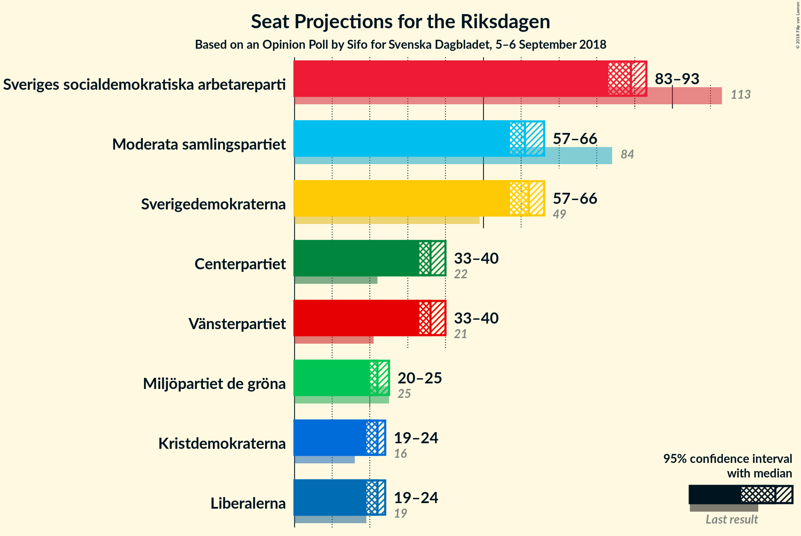
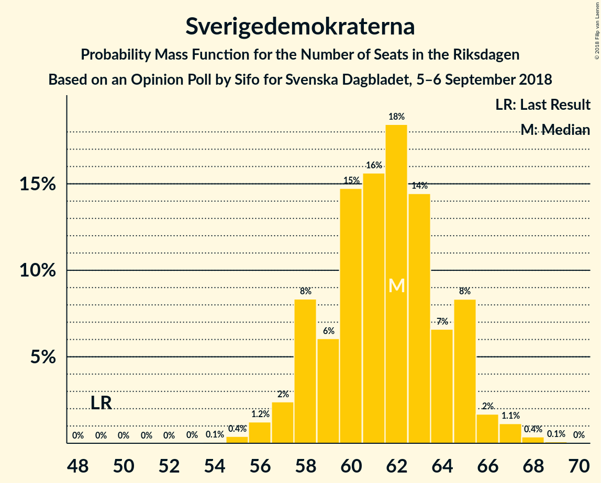
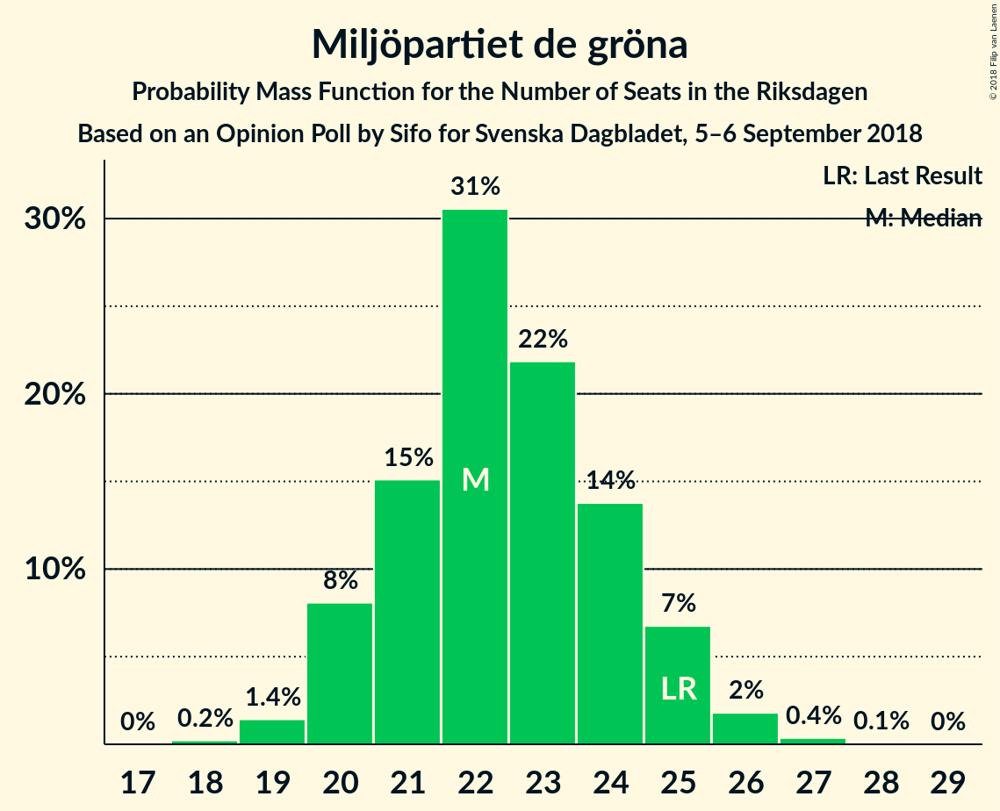
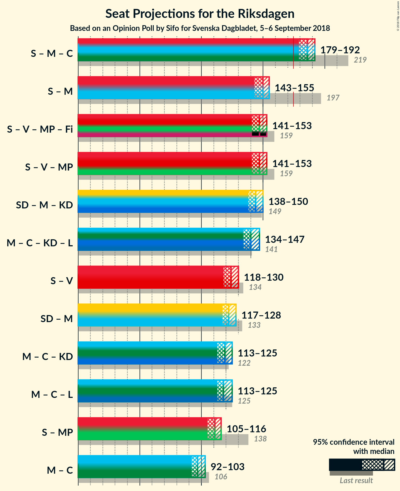

# Opinion Poll by Sifo for Svenska Dagbladet, 5–6 September 2018

<a href="#voting-intentions">Voting Intentions</a> | <a href="#seats">Seats</a> | <a href="#coalitions">Coalitions</a> | <a href="#technical-information">Technical Information</a>

## Voting Intentions

### Confidence Intervals

| Party | Last Result | Poll Result | 80% Confidence Interval | 90% Confidence Interval | 95% Confidence Interval | 99% Confidence Interval |
|:-----:|:-----------:|:-----------:|:-----------------------:|:-----------------------:|:-----------------------:|:-----------------------:|
| Sveriges socialdemokratiska arbetareparti | 31.0% | 24.5% | 23.6–25.4% |23.3–25.7% |23.1–25.9% |22.6–26.4% |
| Sverigedemokraterna | 12.9% | 17.0% | 16.2–17.9% |16.0–18.1% |15.8–18.3% |15.4–18.7% |
| Moderata samlingspartiet | 23.3% | 17.0% | 16.2–17.8% |15.9–18.0% |15.7–18.2% |15.4–18.7% |
| Centerpartiet | 6.1% | 10.0% | 9.4–10.7% |9.2–10.9% |9.1–11.1% |8.8–11.4% |
| Vänsterpartiet | 5.7% | 10.0% | 9.4–10.7% |9.2–10.9% |9.1–11.1% |8.8–11.4% |
| Miljöpartiet de gröna | 6.9% | 6.2% | 5.7–6.8% |5.6–6.9% |5.4–7.1% |5.2–7.3% |
| Liberalerna | 5.4% | 6.0% | 5.5–6.6% |5.4–6.7% |5.3–6.9% |5.0–7.1% |
| Kristdemokraterna | 4.6% | 6.0% | 5.5–6.6% |5.4–6.7% |5.3–6.9% |5.0–7.1% |

*Note:* The poll result column reflects the actual value used in the calculations. Published results may vary slightly, and in addition be rounded to fewer digits.

## Seats

### Confidence Intervals

| Party | Last Result | Median | 80% Confidence Interval | 90% Confidence Interval | 95% Confidence Interval | 99% Confidence Interval |
|:-----:|:-----------:|:------:|:-----------------------:|:-----------------------:|:-----------------------:|:-----------------------:|
| <a href="#sveriges-socialdemokratiska-arbetareparti">Sveriges socialdemokratiska arbetareparti</a> | 113 | 89 | 85–91 |84–92 |83–93 |81–95 |
| <a href="#sverigedemokraterna">Sverigedemokraterna</a> | 49 | 62 | 58–65 |58–65 |57–66 |56–67 |
| <a href="#moderata-samlingspartiet">Moderata samlingspartiet</a> | 84 | 61 | 58–64 |57–65 |57–66 |55–67 |
| <a href="#centerpartiet">Centerpartiet</a> | 22 | 36 | 34–39 |33–39 |33–40 |31–41 |
| <a href="#vänsterpartiet">Vänsterpartiet</a> | 21 | 36 | 34–38 |33–39 |33–40 |32–41 |
| <a href="#miljöpartiet-de-gröna">Miljöpartiet de gröna</a> | 25 | 22 | 21–24 |20–25 |20–25 |19–26 |
| <a href="#liberalerna">Liberalerna</a> | 19 | 22 | 20–24 |20–24 |19–24 |18–26 |
| <a href="#kristdemokraterna">Kristdemokraterna</a> | 16 | 22 | 20–24 |19–24 |19–24 |18–26 |

### Sveriges socialdemokratiska arbetareparti

*For a full overview of the results for this party, see the [Sveriges socialdemokratiska arbetareparti](party-sverigessocialdemokratiskaarbetareparti.html) page.*

| Number of Seats | Probability | Accumulated | Special Marks |
|:---------------:|:-----------:|:-----------:|:-------------:|
| 80 | 0.1% | 100% |  |
| 81 | 0.4% | 99.8% |  |
| 82 | 1.1% | 99.4% |  |
| 83 | 2% | 98% |  |
| 84 | 4% | 96% |  |
| 85 | 6% | 92% |  |
| 86 | 11% | 86% |  |
| 87 | 10% | 75% |  |
| 88 | 15% | 65% |  |
| 89 | 14% | 50% | Median |
| 90 | 19% | 36% |  |
| 91 | 8% | 18% |  |
| 92 | 5% | 10% |  |
| 93 | 2% | 5% |  |
| 94 | 1.4% | 2% |  |
| 95 | 0.7% | 1.0% |  |
| 96 | 0.2% | 0.3% |  |
| 97 | 0% | 0.1% |  |
| 98 | 0% | 0% |  |
| 99 | 0% | 0% |  |
| 100 | 0% | 0% |  |
| 101 | 0% | 0% |  |
| 102 | 0% | 0% |  |
| 103 | 0% | 0% |  |
| 104 | 0% | 0% |  |
| 105 | 0% | 0% |  |
| 106 | 0% | 0% |  |
| 107 | 0% | 0% |  |
| 108 | 0% | 0% |  |
| 109 | 0% | 0% |  |
| 110 | 0% | 0% |  |
| 111 | 0% | 0% |  |
| 112 | 0% | 0% |  |
| 113 | 0% | 0% | Last Result |

### Sverigedemokraterna

*For a full overview of the results for this party, see the [Sverigedemokraterna](party-sverigedemokraterna.html) page.*

| Number of Seats | Probability | Accumulated | Special Marks |
|:---------------:|:-----------:|:-----------:|:-------------:|
| 49 | 0% | 100% | Last Result |
| 50 | 0% | 100% |  |
| 51 | 0% | 100% |  |
| 52 | 0% | 100% |  |
| 53 | 0% | 100% |  |
| 54 | 0.1% | 100% |  |
| 55 | 0.4% | 99.9% |  |
| 56 | 1.2% | 99.5% |  |
| 57 | 2% | 98% |  |
| 58 | 8% | 96% |  |
| 59 | 6% | 88% |  |
| 60 | 15% | 81% |  |
| 61 | 16% | 67% |  |
| 62 | 18% | 51% | Median |
| 63 | 14% | 33% |  |
| 64 | 7% | 18% |  |
| 65 | 8% | 12% |  |
| 66 | 2% | 3% |  |
| 67 | 1.1% | 2% |  |
| 68 | 0.4% | 0.5% |  |
| 69 | 0.1% | 0.1% |  |
| 70 | 0% | 0% |  |

### Moderata samlingspartiet

*For a full overview of the results for this party, see the [Moderata samlingspartiet](party-moderatasamlingspartiet.html) page.*

| Number of Seats | Probability | Accumulated | Special Marks |
|:---------------:|:-----------:|:-----------:|:-------------:|
| 54 | 0.2% | 100% |  |
| 55 | 0.4% | 99.8% |  |
| 56 | 2% | 99.4% |  |
| 57 | 5% | 98% |  |
| 58 | 8% | 93% |  |
| 59 | 13% | 85% |  |
| 60 | 17% | 72% |  |
| 61 | 14% | 55% | Median |
| 62 | 14% | 41% |  |
| 63 | 12% | 27% |  |
| 64 | 8% | 15% |  |
| 65 | 4% | 7% |  |
| 66 | 2% | 3% |  |
| 67 | 0.8% | 1.2% |  |
| 68 | 0.3% | 0.3% |  |
| 69 | 0.1% | 0.1% |  |
| 70 | 0% | 0% |  |
| 71 | 0% | 0% |  |
| 72 | 0% | 0% |  |
| 73 | 0% | 0% |  |
| 74 | 0% | 0% |  |
| 75 | 0% | 0% |  |
| 76 | 0% | 0% |  |
| 77 | 0% | 0% |  |
| 78 | 0% | 0% |  |
| 79 | 0% | 0% |  |
| 80 | 0% | 0% |  |
| 81 | 0% | 0% |  |
| 82 | 0% | 0% |  |
| 83 | 0% | 0% |  |
| 84 | 0% | 0% | Last Result |

### Centerpartiet

*For a full overview of the results for this party, see the [Centerpartiet](party-centerpartiet.html) page.*

| Number of Seats | Probability | Accumulated | Special Marks |
|:---------------:|:-----------:|:-----------:|:-------------:|
| 22 | 0% | 100% | Last Result |
| 23 | 0% | 100% |  |
| 24 | 0% | 100% |  |
| 25 | 0% | 100% |  |
| 26 | 0% | 100% |  |
| 27 | 0% | 100% |  |
| 28 | 0% | 100% |  |
| 29 | 0% | 100% |  |
| 30 | 0.1% | 100% |  |
| 31 | 0.4% | 99.9% |  |
| 32 | 2% | 99.5% |  |
| 33 | 5% | 98% |  |
| 34 | 12% | 93% |  |
| 35 | 14% | 81% |  |
| 36 | 26% | 67% | Median |
| 37 | 18% | 41% |  |
| 38 | 12% | 23% |  |
| 39 | 7% | 12% |  |
| 40 | 3% | 4% |  |
| 41 | 0.7% | 0.9% |  |
| 42 | 0.2% | 0.2% |  |
| 43 | 0% | 0% |  |

### Vänsterpartiet

*For a full overview of the results for this party, see the [Vänsterpartiet](party-vänsterpartiet.html) page.*

| Number of Seats | Probability | Accumulated | Special Marks |
|:---------------:|:-----------:|:-----------:|:-------------:|
| 21 | 0% | 100% | Last Result |
| 22 | 0% | 100% |  |
| 23 | 0% | 100% |  |
| 24 | 0% | 100% |  |
| 25 | 0% | 100% |  |
| 26 | 0% | 100% |  |
| 27 | 0% | 100% |  |
| 28 | 0% | 100% |  |
| 29 | 0% | 100% |  |
| 30 | 0.1% | 100% |  |
| 31 | 0.3% | 99.9% |  |
| 32 | 1.4% | 99.6% |  |
| 33 | 5% | 98% |  |
| 34 | 11% | 93% |  |
| 35 | 21% | 82% |  |
| 36 | 24% | 61% | Median |
| 37 | 15% | 37% |  |
| 38 | 13% | 23% |  |
| 39 | 7% | 10% |  |
| 40 | 2% | 3% |  |
| 41 | 0.7% | 1.1% |  |
| 42 | 0.4% | 0.4% |  |
| 43 | 0% | 0% |  |

### Miljöpartiet de gröna

*For a full overview of the results for this party, see the [Miljöpartiet de gröna](party-miljöpartietdegröna.html) page.*

| Number of Seats | Probability | Accumulated | Special Marks |
|:---------------:|:-----------:|:-----------:|:-------------:|
| 18 | 0.2% | 100% |  |
| 19 | 1.4% | 99.8% |  |
| 20 | 8% | 98% |  |
| 21 | 15% | 90% |  |
| 22 | 31% | 75% | Median |
| 23 | 22% | 45% |  |
| 24 | 14% | 23% |  |
| 25 | 7% | 9% | Last Result |
| 26 | 2% | 2% |  |
| 27 | 0.4% | 0.4% |  |
| 28 | 0.1% | 0.1% |  |
| 29 | 0% | 0% |  |

### Liberalerna

*For a full overview of the results for this party, see the [Liberalerna](party-liberalerna.html) page.*

| Number of Seats | Probability | Accumulated | Special Marks |
|:---------------:|:-----------:|:-----------:|:-------------:|
| 18 | 2% | 100% |  |
| 19 | 1.2% | 98% | Last Result |
| 20 | 27% | 97% |  |
| 21 | 10% | 69% |  |
| 22 | 36% | 60% | Median |
| 23 | 14% | 24% |  |
| 24 | 8% | 11% |  |
| 25 | 2% | 2% |  |
| 26 | 0.5% | 0.6% |  |
| 27 | 0.1% | 0.1% |  |
| 28 | 0% | 0% |  |

### Kristdemokraterna

*For a full overview of the results for this party, see the [Kristdemokraterna](party-kristdemokraterna.html) page.*

| Number of Seats | Probability | Accumulated | Special Marks |
|:---------------:|:-----------:|:-----------:|:-------------:|
| 16 | 0% | 100% | Last Result |
| 17 | 0.1% | 100% |  |
| 18 | 1.0% | 99.9% |  |
| 19 | 5% | 98.9% |  |
| 20 | 11% | 94% |  |
| 21 | 30% | 83% |  |
| 22 | 25% | 52% | Median |
| 23 | 15% | 27% |  |
| 24 | 10% | 12% |  |
| 25 | 2% | 2% |  |
| 26 | 0.5% | 0.6% |  |
| 27 | 0.1% | 0.1% |  |
| 28 | 0% | 0% |  |

## Coalitions

### Confidence Intervals

| Coalition | Last Result | Median | Majority? | 80% Confidence Interval | 90% Confidence Interval | 95% Confidence Interval | 99% Confidence Interval |
|:---------:|:-----------:|:------:|:---------:|:-----------------------:|:-----------------------:|:-----------------------:|:-----------------------:|
| Sveriges socialdemokratiska arbetareparti – Moderata samlingspartiet – Centerpartiet | 219 | 186 | 99.8% | 182–190 | 180–191 | 179–192 | 176–193 |
| Sveriges socialdemokratiska arbetareparti – Moderata samlingspartiet | 197 | 150 | 0% | 145–153 | 144–155 | 143–155 | 141–157 |
| Sveriges socialdemokratiska arbetareparti – Vänsterpartiet – Miljöpartiet de gröna | 159 | 147 | 0% | 143–150 | 142–152 | 141–153 | 138–155 |
| Sverigedemokraterna – Moderata samlingspartiet – Kristdemokraterna | 149 | 144 | 0% | 140–148 | 139–149 | 138–150 | 136–152 |
| Moderata samlingspartiet – Centerpartiet – Kristdemokraterna – Liberalerna | 141 | 140 | 0% | 137–144 | 135–145 | 134–147 | 133–148 |
| Sveriges socialdemokratiska arbetareparti – Vänsterpartiet | 134 | 124 | 0% | 120–128 | 120–129 | 118–130 | 117–133 |
| Sverigedemokraterna – Moderata samlingspartiet | 133 | 122 | 0% | 119–126 | 118–127 | 117–128 | 115–130 |
| Moderata samlingspartiet – Centerpartiet – Kristdemokraterna | 122 | 119 | 0% | 115–123 | 114–124 | 113–125 | 111–127 |
| Moderata samlingspartiet – Centerpartiet – Liberalerna | 125 | 118 | 0% | 115–123 | 114–124 | 113–125 | 111–126 |
| Sveriges socialdemokratiska arbetareparti – Miljöpartiet de gröna | 138 | 111 | 0% | 107–114 | 106–115 | 105–116 | 103–118 |
| Moderata samlingspartiet – Centerpartiet | 106 | 97 | 0% | 94–101 | 93–102 | 92–103 | 90–105 |

### Sveriges socialdemokratiska arbetareparti – Moderata samlingspartiet – Centerpartiet

| Number of Seats | Probability | Accumulated | Special Marks |
|:---------------:|:-----------:|:-----------:|:-------------:|
| 173 | 0.1% | 100% |  |
| 174 | 0.1% | 99.9% |  |
| 175 | 0.3% | 99.8% | Majority |
| 176 | 0.2% | 99.6% |  |
| 177 | 0.5% | 99.3% |  |
| 178 | 0.7% | 98.8% |  |
| 179 | 2% | 98% |  |
| 180 | 3% | 96% |  |
| 181 | 3% | 93% |  |
| 182 | 9% | 90% |  |
| 183 | 8% | 82% |  |
| 184 | 10% | 74% |  |
| 185 | 10% | 64% |  |
| 186 | 18% | 54% | Median |
| 187 | 9% | 36% |  |
| 188 | 9% | 27% |  |
| 189 | 8% | 18% |  |
| 190 | 5% | 10% |  |
| 191 | 2% | 6% |  |
| 192 | 2% | 3% |  |
| 193 | 0.6% | 1.0% |  |
| 194 | 0.3% | 0.4% |  |
| 195 | 0.1% | 0.2% |  |
| 196 | 0% | 0.1% |  |
| 197 | 0% | 0% |  |
| 198 | 0% | 0% |  |
| 199 | 0% | 0% |  |
| 200 | 0% | 0% |  |
| 201 | 0% | 0% |  |
| 202 | 0% | 0% |  |
| 203 | 0% | 0% |  |
| 204 | 0% | 0% |  |
| 205 | 0% | 0% |  |
| 206 | 0% | 0% |  |
| 207 | 0% | 0% |  |
| 208 | 0% | 0% |  |
| 209 | 0% | 0% |  |
| 210 | 0% | 0% |  |
| 211 | 0% | 0% |  |
| 212 | 0% | 0% |  |
| 213 | 0% | 0% |  |
| 214 | 0% | 0% |  |
| 215 | 0% | 0% |  |
| 216 | 0% | 0% |  |
| 217 | 0% | 0% |  |
| 218 | 0% | 0% |  |
| 219 | 0% | 0% | Last Result |

### Sveriges socialdemokratiska arbetareparti – Moderata samlingspartiet

| Number of Seats | Probability | Accumulated | Special Marks |
|:---------------:|:-----------:|:-----------:|:-------------:|
| 138 | 0% | 100% |  |
| 139 | 0.1% | 99.9% |  |
| 140 | 0.2% | 99.9% |  |
| 141 | 0.6% | 99.7% |  |
| 142 | 0.8% | 99.0% |  |
| 143 | 2% | 98% |  |
| 144 | 3% | 96% |  |
| 145 | 6% | 93% |  |
| 146 | 8% | 88% |  |
| 147 | 9% | 80% |  |
| 148 | 9% | 71% |  |
| 149 | 10% | 62% |  |
| 150 | 19% | 52% | Median |
| 151 | 11% | 33% |  |
| 152 | 6% | 23% |  |
| 153 | 8% | 16% |  |
| 154 | 4% | 9% |  |
| 155 | 3% | 5% |  |
| 156 | 1.3% | 2% |  |
| 157 | 0.8% | 1.2% |  |
| 158 | 0.2% | 0.4% |  |
| 159 | 0.1% | 0.2% |  |
| 160 | 0% | 0% |  |
| 161 | 0% | 0% |  |
| 162 | 0% | 0% |  |
| 163 | 0% | 0% |  |
| 164 | 0% | 0% |  |
| 165 | 0% | 0% |  |
| 166 | 0% | 0% |  |
| 167 | 0% | 0% |  |
| 168 | 0% | 0% |  |
| 169 | 0% | 0% |  |
| 170 | 0% | 0% |  |
| 171 | 0% | 0% |  |
| 172 | 0% | 0% |  |
| 173 | 0% | 0% |  |
| 174 | 0% | 0% |  |
| 175 | 0% | 0% | Majority |
| 176 | 0% | 0% |  |
| 177 | 0% | 0% |  |
| 178 | 0% | 0% |  |
| 179 | 0% | 0% |  |
| 180 | 0% | 0% |  |
| 181 | 0% | 0% |  |
| 182 | 0% | 0% |  |
| 183 | 0% | 0% |  |
| 184 | 0% | 0% |  |
| 185 | 0% | 0% |  |
| 186 | 0% | 0% |  |
| 187 | 0% | 0% |  |
| 188 | 0% | 0% |  |
| 189 | 0% | 0% |  |
| 190 | 0% | 0% |  |
| 191 | 0% | 0% |  |
| 192 | 0% | 0% |  |
| 193 | 0% | 0% |  |
| 194 | 0% | 0% |  |
| 195 | 0% | 0% |  |
| 196 | 0% | 0% |  |
| 197 | 0% | 0% | Last Result |

### Sveriges socialdemokratiska arbetareparti – Vänsterpartiet – Miljöpartiet de gröna

| Number of Seats | Probability | Accumulated | Special Marks |
|:---------------:|:-----------:|:-----------:|:-------------:|
| 135 | 0.1% | 100% |  |
| 136 | 0% | 99.9% |  |
| 137 | 0.1% | 99.9% |  |
| 138 | 0.3% | 99.8% |  |
| 139 | 0.5% | 99.5% |  |
| 140 | 1.4% | 99.0% |  |
| 141 | 2% | 98% |  |
| 142 | 4% | 95% |  |
| 143 | 5% | 92% |  |
| 144 | 6% | 87% |  |
| 145 | 11% | 81% |  |
| 146 | 12% | 70% |  |
| 147 | 13% | 58% | Median |
| 148 | 21% | 45% |  |
| 149 | 6% | 24% |  |
| 150 | 9% | 18% |  |
| 151 | 3% | 9% |  |
| 152 | 3% | 6% |  |
| 153 | 2% | 3% |  |
| 154 | 0.8% | 2% |  |
| 155 | 0.5% | 0.7% |  |
| 156 | 0.2% | 0.3% |  |
| 157 | 0% | 0.1% |  |
| 158 | 0% | 0% |  |
| 159 | 0% | 0% | Last Result |

### Sverigedemokraterna – Moderata samlingspartiet – Kristdemokraterna

| Number of Seats | Probability | Accumulated | Special Marks |
|:---------------:|:-----------:|:-----------:|:-------------:|
| 133 | 0.1% | 100% |  |
| 134 | 0.1% | 99.9% |  |
| 135 | 0.2% | 99.8% |  |
| 136 | 0.4% | 99.7% |  |
| 137 | 0.7% | 99.3% |  |
| 138 | 1.5% | 98.6% |  |
| 139 | 2% | 97% |  |
| 140 | 6% | 95% |  |
| 141 | 10% | 89% |  |
| 142 | 6% | 79% |  |
| 143 | 18% | 74% |  |
| 144 | 10% | 55% |  |
| 145 | 13% | 46% | Median |
| 146 | 10% | 33% |  |
| 147 | 10% | 22% |  |
| 148 | 4% | 13% |  |
| 149 | 5% | 9% | Last Result |
| 150 | 2% | 4% |  |
| 151 | 1.1% | 2% |  |
| 152 | 0.4% | 0.7% |  |
| 153 | 0.2% | 0.3% |  |
| 154 | 0.1% | 0.1% |  |
| 155 | 0% | 0% |  |

### Moderata samlingspartiet – Centerpartiet – Kristdemokraterna – Liberalerna

| Number of Seats | Probability | Accumulated | Special Marks |
|:---------------:|:-----------:|:-----------:|:-------------:|
| 130 | 0.1% | 100% |  |
| 131 | 0.2% | 99.9% |  |
| 132 | 0.1% | 99.7% |  |
| 133 | 0.5% | 99.7% |  |
| 134 | 2% | 99.2% |  |
| 135 | 3% | 97% |  |
| 136 | 2% | 94% |  |
| 137 | 4% | 93% |  |
| 138 | 12% | 89% |  |
| 139 | 22% | 77% |  |
| 140 | 12% | 55% |  |
| 141 | 6% | 44% | Last Result, Median |
| 142 | 9% | 38% |  |
| 143 | 11% | 29% |  |
| 144 | 10% | 18% |  |
| 145 | 3% | 7% |  |
| 146 | 2% | 5% |  |
| 147 | 1.5% | 3% |  |
| 148 | 0.7% | 1.1% |  |
| 149 | 0.3% | 0.4% |  |
| 150 | 0.1% | 0.1% |  |
| 151 | 0% | 0.1% |  |
| 152 | 0% | 0% |  |

### Sveriges socialdemokratiska arbetareparti – Vänsterpartiet

| Number of Seats | Probability | Accumulated | Special Marks |
|:---------------:|:-----------:|:-----------:|:-------------:|
| 114 | 0% | 100% |  |
| 115 | 0.1% | 99.9% |  |
| 116 | 0.2% | 99.8% |  |
| 117 | 0.9% | 99.6% |  |
| 118 | 1.3% | 98.7% |  |
| 119 | 2% | 97% |  |
| 120 | 7% | 95% |  |
| 121 | 5% | 88% |  |
| 122 | 5% | 83% |  |
| 123 | 14% | 78% |  |
| 124 | 14% | 64% |  |
| 125 | 9% | 49% | Median |
| 126 | 17% | 41% |  |
| 127 | 13% | 24% |  |
| 128 | 3% | 11% |  |
| 129 | 4% | 8% |  |
| 130 | 2% | 4% |  |
| 131 | 0.7% | 2% |  |
| 132 | 0.6% | 1.1% |  |
| 133 | 0.4% | 0.5% |  |
| 134 | 0.1% | 0.1% | Last Result |
| 135 | 0% | 0% |  |

### Sverigedemokraterna – Moderata samlingspartiet

| Number of Seats | Probability | Accumulated | Special Marks |
|:---------------:|:-----------:|:-----------:|:-------------:|
| 112 | 0.1% | 100% |  |
| 113 | 0.1% | 99.9% |  |
| 114 | 0.3% | 99.9% |  |
| 115 | 0.5% | 99.6% |  |
| 116 | 1.3% | 99.1% |  |
| 117 | 2% | 98% |  |
| 118 | 6% | 96% |  |
| 119 | 7% | 90% |  |
| 120 | 9% | 83% |  |
| 121 | 9% | 74% |  |
| 122 | 18% | 65% |  |
| 123 | 11% | 47% | Median |
| 124 | 10% | 36% |  |
| 125 | 11% | 26% |  |
| 126 | 5% | 15% |  |
| 127 | 5% | 9% |  |
| 128 | 2% | 4% |  |
| 129 | 1.4% | 2% |  |
| 130 | 0.4% | 0.7% |  |
| 131 | 0.2% | 0.3% |  |
| 132 | 0.1% | 0.1% |  |
| 133 | 0% | 0% | Last Result |

### Moderata samlingspartiet – Centerpartiet – Kristdemokraterna

| Number of Seats | Probability | Accumulated | Special Marks |
|:---------------:|:-----------:|:-----------:|:-------------:|
| 109 | 0.1% | 100% |  |
| 110 | 0.1% | 99.9% |  |
| 111 | 0.3% | 99.8% |  |
| 112 | 1.0% | 99.5% |  |
| 113 | 1.3% | 98% |  |
| 114 | 3% | 97% |  |
| 115 | 5% | 94% |  |
| 116 | 9% | 90% |  |
| 117 | 15% | 81% |  |
| 118 | 13% | 65% |  |
| 119 | 12% | 52% | Median |
| 120 | 11% | 40% |  |
| 121 | 10% | 29% |  |
| 122 | 8% | 19% | Last Result |
| 123 | 5% | 11% |  |
| 124 | 3% | 6% |  |
| 125 | 1.4% | 3% |  |
| 126 | 0.5% | 1.2% |  |
| 127 | 0.5% | 0.7% |  |
| 128 | 0.1% | 0.2% |  |
| 129 | 0% | 0.1% |  |
| 130 | 0% | 0% |  |

### Moderata samlingspartiet – Centerpartiet – Liberalerna

| Number of Seats | Probability | Accumulated | Special Marks |
|:---------------:|:-----------:|:-----------:|:-------------:|
| 109 | 0% | 100% |  |
| 110 | 0.2% | 99.9% |  |
| 111 | 0.4% | 99.8% |  |
| 112 | 1.1% | 99.4% |  |
| 113 | 2% | 98% |  |
| 114 | 3% | 97% |  |
| 115 | 5% | 94% |  |
| 116 | 8% | 89% |  |
| 117 | 17% | 81% |  |
| 118 | 15% | 64% |  |
| 119 | 11% | 49% | Median |
| 120 | 12% | 39% |  |
| 121 | 8% | 27% |  |
| 122 | 9% | 19% |  |
| 123 | 5% | 10% |  |
| 124 | 3% | 5% |  |
| 125 | 2% | 3% | Last Result |
| 126 | 0.8% | 1.2% |  |
| 127 | 0.3% | 0.4% |  |
| 128 | 0.1% | 0.1% |  |
| 129 | 0% | 0% |  |

### Sveriges socialdemokratiska arbetareparti – Miljöpartiet de gröna

| Number of Seats | Probability | Accumulated | Special Marks |
|:---------------:|:-----------:|:-----------:|:-------------:|
| 101 | 0.1% | 100% |  |
| 102 | 0.2% | 99.9% |  |
| 103 | 0.5% | 99.7% |  |
| 104 | 1.1% | 99.2% |  |
| 105 | 2% | 98% |  |
| 106 | 3% | 96% |  |
| 107 | 4% | 93% |  |
| 108 | 9% | 89% |  |
| 109 | 10% | 80% |  |
| 110 | 12% | 70% |  |
| 111 | 15% | 58% | Median |
| 112 | 19% | 43% |  |
| 113 | 11% | 24% |  |
| 114 | 6% | 13% |  |
| 115 | 4% | 7% |  |
| 116 | 2% | 3% |  |
| 117 | 1.0% | 2% |  |
| 118 | 0.4% | 0.7% |  |
| 119 | 0.2% | 0.3% |  |
| 120 | 0.1% | 0.1% |  |
| 121 | 0% | 0% |  |
| 122 | 0% | 0% |  |
| 123 | 0% | 0% |  |
| 124 | 0% | 0% |  |
| 125 | 0% | 0% |  |
| 126 | 0% | 0% |  |
| 127 | 0% | 0% |  |
| 128 | 0% | 0% |  |
| 129 | 0% | 0% |  |
| 130 | 0% | 0% |  |
| 131 | 0% | 0% |  |
| 132 | 0% | 0% |  |
| 133 | 0% | 0% |  |
| 134 | 0% | 0% |  |
| 135 | 0% | 0% |  |
| 136 | 0% | 0% |  |
| 137 | 0% | 0% |  |
| 138 | 0% | 0% | Last Result |

### Moderata samlingspartiet – Centerpartiet

| Number of Seats | Probability | Accumulated | Special Marks |
|:---------------:|:-----------:|:-----------:|:-------------:|
| 88 | 0.1% | 100% |  |
| 89 | 0.1% | 99.9% |  |
| 90 | 0.5% | 99.8% |  |
| 91 | 1.0% | 99.3% |  |
| 92 | 2% | 98% |  |
| 93 | 4% | 96% |  |
| 94 | 10% | 93% |  |
| 95 | 9% | 83% |  |
| 96 | 16% | 73% |  |
| 97 | 14% | 57% | Median |
| 98 | 12% | 43% |  |
| 99 | 10% | 31% |  |
| 100 | 8% | 20% |  |
| 101 | 5% | 12% |  |
| 102 | 4% | 7% |  |
| 103 | 2% | 3% |  |
| 104 | 0.7% | 1.4% |  |
| 105 | 0.5% | 0.7% |  |
| 106 | 0.1% | 0.2% | Last Result |
| 107 | 0% | 0% |  |

## Technical Information

### Opinion Poll

+ **Polling firm:** Sifo
+ **Commissioner(s):** Svenska Dagbladet
+ **Fieldwork period:** 5–6 September 2018

### Calculations

+ **Sample size:** 3480
+ **Simulations done:** 1,048,576
+ **Error estimate:** 0.66%

